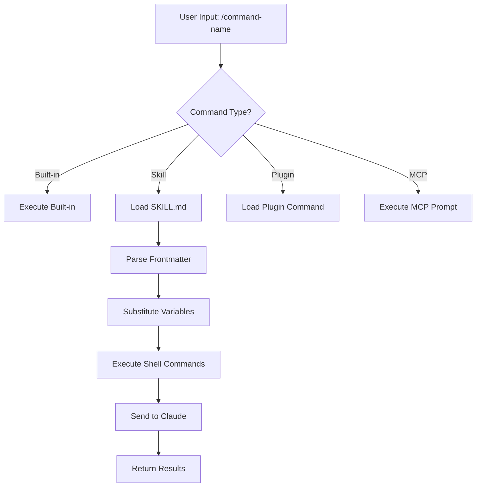
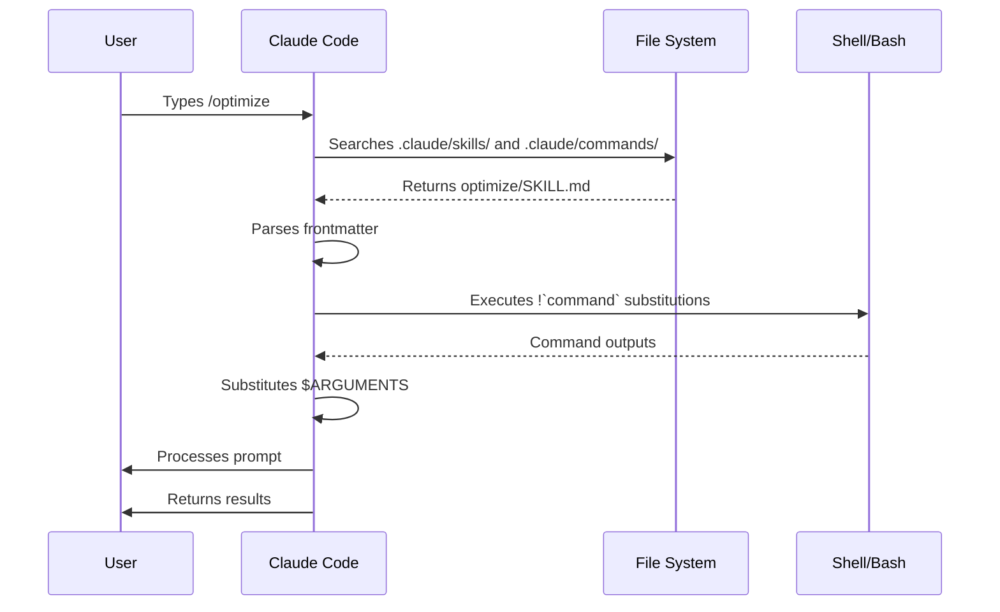

<picture>
  <source media="(prefers-color-scheme: dark)" srcset="../resources/logos/claude-howto-logo-dark.svg">
  
</picture>

> 🟢 **Beginner** | ⏱ 30 minutes
>
> ✅ Verified against Claude Code **v2.1.92** · Last verified: 2026-04-05

**What you'll build:** Learn to use slash commands for faster workflows.

# Slash Commands

## Overview

Slash commands are shortcuts that control Claude's behavior during an interactive session. They come in several types:

- **Built-in commands**: Provided by Claude Code (`/help`, `/clear`, `/model`)
- **Skills**: User-defined commands created as `SKILL.md` files (`/optimize`, `/pr`)
- **Plugin commands**: Commands from installed plugins (`/frontend-design:frontend-design`)
- **MCP prompts**: Commands from MCP servers (`/mcp__github__list_prs`)

> **Note**: Custom slash commands have been merged into skills. Files in `.claude/commands/` still work, but skills (`.claude/skills/`) are now the recommended approach. Both create `/command-name` shortcuts. See the [Skills Guide](../03-skills/) for the full reference.

## Built-in Commands Reference

Built-in commands are shortcuts for common actions. There are **55+ built-in commands** and **5 bundled skills** available. Type `/` in Claude Code to see the full list, or type `/` followed by any letters to filter.

| Command | Purpose |
|---------|---------|
| `/add-dir <path>` | Add working directory |
| `/agents` | Manage agent configurations |
| `/branch [name]` | Branch conversation into a new session (alias: `/fork`). Note: `/fork` renamed to `/branch` in v2.1.77 |
| `/btw <question>` | Side question without adding to history |
| `/chrome` | Configure Chrome browser integration |
| `/clear` | Clear conversation (aliases: `/reset`, `/new`) |
| `/color [color\|default]` | Set prompt bar color |
| `/compact [instructions]` | Compact conversation with optional focus instructions |
| `/config` | Open Settings (alias: `/settings`) |
| `/context` | Visualize context usage as colored grid |
| `/copy [N]` | Copy assistant response to clipboard; `w` writes to file |
| `/cost` | Show token usage statistics |
| `/desktop` | Continue in Desktop app (alias: `/app`) |
| `/diff` | Interactive diff viewer for uncommitted changes |
| `/doctor` | Diagnose installation health |
| `/effort [low\|medium\|high\|max\|auto]` | Set effort level. `max` requires Opus 4.6 |
| `/exit` | Exit the REPL (alias: `/quit`) |
| `/export [filename]` | Export the current conversation to a file or clipboard |
| `/extra-usage` | Configure extra usage for rate limits |
| `/fast [on\|off]` | Toggle fast mode |
| `/feedback` | Submit feedback (alias: `/bug`) |
| `/help` | Show help |
| `/hooks` | View hook configurations |
| `/ide` | Manage IDE integrations |
| `/init` | Initialize `CLAUDE.md`. Set `CLAUDE_CODE_NEW_INIT=true` for interactive flow |
| `/insights` | Generate session analysis report |
| `/install-github-app` | Set up GitHub Actions app |
| `/install-slack-app` | Install Slack app |
| `/keybindings` | Open keybindings configuration |
| `/login` | Switch Anthropic accounts |
| `/logout` | Sign out from your Anthropic account |
| `/mcp` | Manage MCP servers and OAuth |
| `/memory` | Edit `CLAUDE.md`, toggle auto-memory |
| `/mobile` | QR code for mobile app (aliases: `/ios`, `/android`) |
| `/model [model]` | Select model with left/right arrows for effort |
| `/passes` | Share free week of Claude Code |
| `/permissions` | View/update permissions (alias: `/allowed-tools`) |
| `/plan [description]` | Enter plan mode |
| `/plugin` | Manage plugins |
| `/pr-comments [PR]` | Fetch GitHub PR comments |
| `/privacy-settings` | Privacy settings (Pro/Max only) |
| `/release-notes` | View changelog |
| `/reload-plugins` | Reload active plugins |
| `/remote-control` | Remote control from claude.ai (alias: `/rc`) |
| `/remote-env` | Configure default remote environment |
| `/rename [name]` | Rename session |
| `/resume [session]` | Resume conversation (alias: `/continue`) |
| `/review` | **Deprecated** — install the `code-review` plugin instead |
| `/rewind` | Rewind conversation and/or code (alias: `/checkpoint`) |
| `/sandbox` | Toggle sandbox mode |
| `/schedule [description]` | Create/manage scheduled tasks |
| `/security-review` | Analyze branch for security vulnerabilities |
| `/skills` | List available skills |
| `/stats` | Visualize daily usage, sessions, streaks |
| `/status` | Show version, model, account |
| `/statusline` | Configure status line |
| `/tasks` | List/manage background tasks |
| `/terminal-setup` | Configure terminal keybindings |
| `/theme` | Change color theme |
| `/vim` | Toggle Vim/Normal modes |
| `/voice` | Toggle push-to-talk voice dictation |

### Bundled Skills

These skills ship with Claude Code and are invoked like slash commands:

| Skill | Purpose |
|-------|---------|
| `/batch <instruction>` | Orchestrate large-scale parallel changes using worktrees |
| `/claude-api` | Load Claude API reference for project language |
| `/debug [description]` | Enable debug logging |
| `/loop [interval] <prompt>` | Run prompt repeatedly on interval |
| `/simplify [focus]` | Review changed files for code quality |

### Deprecated Commands

| Command | Status |
|---------|--------|
| `/review` | Deprecated — replaced by `code-review` plugin |
| `/output-style` | Deprecated since v2.1.73 |
| `/fork` | Renamed to `/branch` (alias still works, v2.1.77) |

### Recent Changes

- `/fork` renamed to `/branch` with `/fork` kept as alias (v2.1.77)
- `/output-style` deprecated (v2.1.73)
- `/review` deprecated in favor of the `code-review` plugin
- `/effort` command added with `max` level requiring Opus 4.6
- `/voice` command added for push-to-talk voice dictation
- `/schedule` command added for creating/managing scheduled tasks
- `/color` command added for prompt bar customization
- `/model` picker now shows human-readable labels (e.g., "Sonnet 4.6") instead of raw model IDs
- `/resume` supports `/continue` alias
- MCP prompts are available as `/mcp__<server>__<prompt>` commands (see [MCP Prompts as Commands](#mcp-prompts-as-commands))

## Custom Commands (Now Skills)

Custom slash commands have been **merged into skills**. Both approaches create commands you can invoke with `/command-name`:

| Approach | Location | Status |
|----------|----------|--------|
| **Skills (Recommended)** | `.claude/skills/<name>/SKILL.md` | Current standard |
| **Legacy Commands** | `.claude/commands/<name>.md` | Still works |

If a skill and a command share the same name, the **skill takes precedence**. For example, when both `.claude/commands/review.md` and `.claude/skills/review/SKILL.md` exist, the skill version is used.

### Migration Path

Your existing `.claude/commands/` files continue to work without changes. To migrate to skills:

**Before (Command):**
```
.claude/commands/optimize.md
```

**After (Skill):**
```
.claude/skills/optimize/SKILL.md
```

### Why Skills?

Skills offer additional features over legacy commands:

- **Directory structure**: Bundle scripts, templates, and reference files
- **Auto-invocation**: Claude can trigger skills automatically when relevant
- **Invocation control**: Choose whether users, Claude, or both can invoke
- **Subagent execution**: Run skills in isolated contexts with `context: fork`
- **Progressive disclosure**: Load additional files only when needed

### Creating a Custom Command as a Skill

Create a directory with a `SKILL.md` file:

```bash
mkdir -p .claude/skills/my-command
```

**File:** `.claude/skills/my-command/SKILL.md`

```yaml
---
name: my-command
description: What this command does and when to use it
---

# My Command

Instructions for Claude to follow when this command is invoked.

1. First step
2. Second step
3. Third step
```

### Frontmatter Reference

| Field | Purpose | Default |
|-------|---------|---------|
| `name` | Command name (becomes `/name`) | Directory name |
| `description` | Brief description (helps Claude know when to use it) | First paragraph |
| `argument-hint` | Expected arguments for auto-completion | None |
| `allowed-tools` | Tools the command can use without permission | Inherits |
| `model` | Specific model to use | Inherits |
| `disable-model-invocation` | If `true`, only user can invoke (not Claude) | `false` |
| `user-invocable` | If `false`, hide from `/` menu | `true` |
| `context` | Set to `fork` to run in isolated subagent | None |
| `agent` | Agent type when using `context: fork` | `general-purpose` |
| `hooks` | Skill-scoped hooks (PreToolUse, PostToolUse, Stop) | None |

### Arguments

Commands can receive arguments:

**All arguments with `$ARGUMENTS`:**

```yaml
---
name: fix-issue
description: Fix a GitHub issue by number
---

Fix issue #$ARGUMENTS following our coding standards
```

Usage: `/fix-issue 123` → `$ARGUMENTS` becomes "123"

**Individual arguments with `$0`, `$1`, etc.:**

```yaml
---
name: review-pr
description: Review a PR with priority
---

Review PR #$0 with priority $1
```

Usage: `/review-pr 456 high` → `$0`="456", `$1`="high"

### Dynamic Context with Shell Commands

Execute bash commands before the prompt using `!`command``:

```yaml
---
name: commit
description: Create a git commit with context
allowed-tools: Bash(git *)
---

## Context

- Current git status: !`git status`
- Current git diff: !`git diff HEAD`
- Current branch: !`git branch --show-current`
- Recent commits: !`git log --oneline -5`

## Your task

Based on the above changes, create a single git commit.
```

### File References

Include file contents using `@`:

```markdown
Review the implementation in @src/utils/helpers.js
Compare @src/old-version.js with @src/new-version.js
```

## Plugin Commands

Plugins can provide custom commands:

```
/plugin-name:command-name
```

Or simply `/command-name` when there are no naming conflicts.

**Examples:**
```bash
/frontend-design:frontend-design
/commit-commands:commit
```

## MCP Prompts as Commands

MCP servers can expose prompts as slash commands:

```
/mcp__<server-name>__<prompt-name> [arguments]
```

**Examples:**
```bash
/mcp__github__list_prs
/mcp__github__pr_review 456
/mcp__jira__create_issue "Bug title" high
```

### MCP Permission Syntax

Control MCP server access in permissions:

- `mcp__github` - Access entire GitHub MCP server
- `mcp__github__*` - Wildcard access to all tools
- `mcp__github__get_issue` - Specific tool access

## Command Architecture



## Command Lifecycle



## Available Commands in This Folder

These example commands can be installed as skills or legacy commands.

### 1. `/optimize` - Code Optimization

Analyzes code for performance issues, memory leaks, and optimization opportunities.

**Usage:**
```
/optimize
[Paste your code]
```

### 2. `/pr` - Pull Request Preparation

Guides through PR preparation checklist including linting, testing, and commit formatting.

**Usage:**
```
/pr
```

**Screenshot:**


### 3. `/generate-api-docs` - API Documentation Generator

Generates comprehensive API documentation from source code.

**Usage:**
```
/generate-api-docs
```

### 4. `/commit` - Git Commit with Context

Creates a git commit with dynamic context from your repository.

**Usage:**
```
/commit [optional message]
```

### 5. `/push-all` - Stage, Commit, and Push

Stages all changes, creates a commit, and pushes to remote with safety checks.

**Usage:**
```
/push-all
```

**Safety Checks:**
- Secrets: `.env*`, `*.key`, `*.pem`, `credentials.json`
- API Keys: Detects real keys vs. placeholders
- Large files: `>10MB` without Git LFS
- Build artifacts: `node_modules/`, `dist/`, `__pycache__/`

### 6. `/doc-refactor` - Documentation Restructuring

Restructures project documentation for clarity and accessibility.

**Usage:**
```
/doc-refactor
```

### 7. `/setup-ci-cd` - CI/CD Pipeline Setup

Implements pre-commit hooks and GitHub Actions for quality assurance.

**Usage:**
```
/setup-ci-cd
```

### 8. `/unit-test-expand` - Test Coverage Expansion

Increases test coverage by targeting untested branches and edge cases.

**Usage:**
```
/unit-test-expand
```

## Installation

### As Skills (Recommended)

Copy to your skills directory:

```bash
# Create skills directory
mkdir -p .claude/skills

# For each command file, create a skill directory
for cmd in optimize pr commit; do
  mkdir -p .claude/skills/$cmd
  cp 01-slash-commands/$cmd.md .claude/skills/$cmd/SKILL.md
done
```

### As Legacy Commands

Copy to your commands directory:

```bash
# Project-wide (team)
mkdir -p .claude/commands
cp 01-slash-commands/*.md .claude/commands/

# Personal use
mkdir -p ~/.claude/commands
cp 01-slash-commands/*.md ~/.claude/commands/
```

## Creating Your Own Commands

### Skill Template (Recommended)

Create `.claude/skills/my-command/SKILL.md`:

```yaml
---
name: my-command
description: What this command does. Use when [trigger conditions].
argument-hint: [optional-args]
allowed-tools: Bash(npm *), Read, Grep
---

# Command Title

## Context

- Current branch: !`git branch --show-current`
- Related files: @package.json

## Instructions

1. First step
2. Second step with argument: $ARGUMENTS
3. Third step

## Output Format

- How to format the response
- What to include
```

### User-Only Command (No Auto-Invocation)

For commands with side effects that Claude shouldn't trigger automatically:

```yaml
---
name: deploy
description: Deploy to production
disable-model-invocation: true
allowed-tools: Bash(npm *), Bash(git *)
---

Deploy the application to production:

1. Run tests
2. Build application
3. Push to deployment target
4. Verify deployment
```

## Best Practices

| Do | Don't |
|------|---------|
| Use clear, action-oriented names | Create commands for one-time tasks |
| Include `description` with trigger conditions | Build complex logic in commands |
| Keep commands focused on single task | Hardcode sensitive information |
| Use `disable-model-invocation` for side effects | Skip the description field |
| Use `!` prefix for dynamic context | Assume Claude knows current state |
| Organize related files in skill directories | Put everything in one file |

## Try It Now

### 🎯 Exercise 1: Create Your First Skill

Create a simple `/hello` skill that greets you:

```bash
mkdir -p .claude/skills/hello
```

Create `.claude/skills/hello/SKILL.md`:

```yaml
---
name: hello
description: Greet the user. Use when user says hello or starts a session.
---

# Hello Skill

Greet the user warmly and ask what they'd like to work on today.

Include:
1. Current time and date
2. Quick status of the project (git branch, recent activity)
3. Suggestions for what to work on based on recent changes
```

Test it: `/hello`

### 🎯 Exercise 2: Dynamic Context Skill

Create a `/status` skill that shows project status:

```yaml
---
name: status
description: Show comprehensive project status. Use when user asks about project state.
allowed-tools: Bash(git *), Bash(npm *), Read
---

# Project Status Report

## Git Status
- Current branch: !`git branch --show-current`
- Uncommitted changes: !`git status --short`
- Recent commits: !`git log --oneline -5`

## Dependencies
- Package.json: @package.json
- Outdated packages: !`npm outdated --json 2>/dev/null || echo "no outdated packages"`

## Test Coverage
- Last test run: !`npm test -- --coverage --silent 2>&1 | tail -20 || echo "tests not configured"`

## Summary

Provide a brief summary of:
1. What needs attention (uncommitted changes, failing tests)
2. What's ready to ship
3. Recommended next steps
```

Test it: `/status`

### 🎯 Exercise 3: Command Chaining Workflow

Combine multiple commands for a complete workflow:

```bash
# Morning routine
/status          # Check project health
/diff            # Review yesterday's changes
/memory          # Add context for today's focus

# Pre-commit routine  
/optimize        # Check for optimization opportunities  
/commit          # Create contextual commit

# PR preparation
/pr              # Full PR checklist
```

## Practical Workflows

### Daily Development Cycle

```mermaid
graph LR
    A[/status] --> B[/diff]
    B --> C[Work on Code]
    C --> D[/optimize]
    D --> E[/commit]
    E --> F{/tests pass?}
    F -->|Yes| G[/pr]
    F -->|No| C
```

**Morning startup:**
```bash
/status           # Project health check
/compact focus:bugs  # Focus on bug fixes
```

**After completing work:**
```bash
/optimize         # Performance review
/test             # Run tests
/commit           # Contextual commit
```

### Code Review Workflow

Create a `/review-branch` skill for comprehensive reviews:

```yaml
---
name: review-branch
description: Review a branch for quality, security, and performance. Use before merging PRs.
argument-hint: branch-name
allowed-tools: Bash(git *), Read, Grep, Glob
---

# Branch Review: $ARGUMENTS

## Changes Summary
- Files changed: !`git diff main...$ARGUMENTS --stat`
- Commits included: !`git log main..$ARGUMENTS --oneline`

## Quality Checks
For each changed file:

1. **Code Style**
   - Functions < 50 lines
   - Files < 800 lines
   - No deep nesting (>4 levels)

2. **Security**
   - No hardcoded secrets
   - Input validation present
   - Proper error handling

3. **Performance**
   - No N+1 queries
   - Efficient algorithms
   - No memory leaks

## Report Format

| File | Quality | Security | Performance | Issues |
|------|---------|----------|-------------|--------|

## Recommendation

Provide merge recommendation with:
- Blocking issues (must fix)
- Warnings (should fix)
- Suggestions (nice to have)
```

### Release Workflow

Create a `/release-check` skill:

```yaml
---
name: release-check
description: Pre-release validation checklist. Use before cutting a release.
allowed-tools: Bash(npm *), Bash(git *), Read
---

# Release Checklist

## Version Check
- Current version: !`node -e "console.log(require('./package.json').version)"`
- Changelog updated: Check CHANGELOG.md for current version entry

## Quality Gates
- All tests passing: !`npm test 2>&1 | tail -5`
- No TypeScript errors: !`npx tsc --noEmit 2>&1 || echo "No TS errors"`
- Lint clean: !`npm run lint 2>&1 | tail -5 || echo "Lint passed"`

## Security Scan
- No secrets in code: !`grep -r "api_key\|password\|secret" --include="*.js" --include="*.ts" src/ || echo "Clean"`
- Dependencies audited: !`npm audit 2>&1 || echo "Audit passed"`

## Documentation
- README updated
- API docs current
- Migration guide if breaking changes

## Final Report

Provide:
1. ✅ Passed checks
2. ❌ Failed checks (blocking)
3. ⚠️ Warnings (non-blocking)
4. Release recommendation
```

## Advanced Patterns

### Pattern 1: Context Inheritance

Skills can reference other skills or memory:

```yaml
---
name: smart-commit
description: Intelligent commit using project memory
---

# Smart Commit

Use context from:
- @CLAUDE.md for project conventions
- Recent memory for current focus

## Steps

1. Review changes against CLAUDE.md conventions
2. Check memory for ongoing work
3. Create commit message matching project style
4. Include co-authorship if collaborative
```

### Pattern 2: Conditional Execution

Use shell conditions for smart behavior:

```yaml
---
name: safe-push
description: Safe push with automatic checks
allowed-tools: Bash(git *), Bash(npm *)
---

# Safe Push

## Pre-flight Checks
- Tests passing: !`npm test 2>&1 | grep -q "passed" && echo "PASS" || echo "FAIL"`
- Branch clean: !`git status --porcelain | wc -l | xargs`

## Conditional Logic
- If tests FAIL: "Cannot push - tests failing. Run /test-fix first"
- If branch dirty: "Cannot push - uncommitted changes. Run /commit first"
- If all PASS: Proceed with push

## Push Steps
!`npm test 2>&1 | grep -q "passed" && git push || echo "Blocked: tests failing"`
```

### Pattern 3: Error Recovery

Handle errors gracefully:

```yaml
---
name: robust-deploy
description: Deploy with rollback capability
allowed-tools: Bash(npm *), Bash(git *)
---

# Robust Deploy

## Pre-deploy Snapshot
- Current commit: !`git rev-parse HEAD`
- Current branch: !`git branch --show-current`

## Deploy Steps
1. Build: !`npm run build 2>&1 | tail -10`
2. Deploy: !`npm run deploy 2>&1 | tail -10`
3. Verify: !`curl -s https://app.example.com/health || echo "FAILED"`

## Rollback on Failure
If any step fails:
```bash
git checkout !`git rev-parse HEAD`  # Return to snapshot
npm run rollback  # Custom rollback command
```

Report success or rollback reason.
```

### Pattern 4: Multi-File Processing

Process multiple files efficiently:

```yaml
---
name: batch-optimize
description: Optimize multiple files in parallel
allowed-tools: Read, Edit, Glob, Bash
---

# Batch Optimization

## Find Target Files
!`find src -name "*.ts" -type f | head -20`

## For Each File
1. Read file
2. Analyze for:
   - Unused imports
   - Dead code
   - Optimization opportunities
3. Apply optimizations
4. Track changes

## Summary Report
- Files processed: $FILES_COUNT
- Optimizations applied: $OPTIMIZATIONS_COUNT
- Lines reduced: $LINES_SAVED
```

### Pattern 5: Interactive Prompts

Skills can prompt for user input:

```yaml
---
name: interactive-review
description: Interactive code review with user guidance
---

# Interactive Review

## Phase 1: Overview
Show summary of changes and ask:
- "Focus on specific areas? (security, performance, style)"
- Wait for user response

## Phase 2: Deep Dive
Based on user's focus area:
- Show relevant issues
- Ask for decisions on each

## Phase 3: Apply
- "Apply all approved changes?"
- If yes: Make edits
- If no: List for manual review
```

## Performance Considerations

### Skill Loading Speed

Skills load faster when:

1. **Minimal frontmatter**: Only include necessary fields
2. **Efficient shell commands**: Use `--quiet`, `--silent`, pipe to `head`
3. **File references over reads**: `@file` is cached, `Read` is fresh
4. **Lazy loading**: Don't include every file, use `!` commands to fetch when needed

### Command Execution Speed

| Approach | Speed | Use Case |
|----------|-------|----------|
| Static content | Fastest | Fixed instructions |
| `!` command (cached) | Fast | Git status, package.json |
| `!` command (fresh) | Medium | Test results, build output |
| `@file` reference | Medium | Large files, templates |
| Inline Read tool | Slowest | Real-time file inspection |

### Optimization Example

**Slow skill:**
```yaml
# Reads every file every time
Check all these files:
- @src/index.ts
- @src/utils.ts
- @src/config.ts
- @src/app.ts
```

**Fast skill:**
```yaml
# Lazy loads only what's needed
Check files matching pattern:
!`find src -name "*.ts" | head -5`

Then selectively read:
"Which files need detailed review?"
```

## Common Pitfalls

### Pitfall 1: Circular Dependencies

**Problem:** Skill A references Skill B, which references Skill A.

**Solution:** Use memory (CLAUDE.md) for shared context instead of skill chains.

### Pitfall 2: Permission Overreach

**Problem:** Skill requests tools it doesn't need.

```yaml
# BAD: Requests everything
allowed-tools: Bash(*), Read(*), Write(*)
```

**Solution:** Request only necessary tools:

```yaml
# GOOD: Specific permissions
allowed-tools: Bash(git status), Bash(git log), Read
```

### Pitfall 3: Overly Complex Skills

**Problem:** One skill does too much.

**Solution:** Decompose into focused skills:

```yaml
# Instead of /full-review, create:
/review-security  # Security-focused
/review-performance  # Performance-focused  
/review-style  # Style-focused
```

### Pitfall 4: Missing Error Handling

**Problem:** Skill fails without guidance.

```yaml
# BAD: No fallback
Run tests: !`npm test`
```

**Solution:** Include error guidance:

```yaml
# GOOD: Error handling
Run tests: !`npm test 2>&1 || echo "Tests failed - check output above"`

If tests fail:
1. Show test output
2. Suggest running /debug-tests
3. Don't proceed with dependent steps
```

### Pitfall 5: Hardcoded Paths

**Problem:** Skill only works in specific project.

```yaml
# BAD: Hardcoded
Check: @/Users/dev/my-project/src/app.ts
```

**Solution:** Use relative paths and discovery:

```yaml
# GOOD: Portable
Check: @src/app.ts
Or discover: !`find . -name "app.ts" -type f`
```

## Troubleshooting

### Command Not Found

**Solutions:**
- Check file is in `.claude/skills/<name>/SKILL.md` or `.claude/commands/<name>.md`
- Verify the `name` field in frontmatter matches expected command name
- Restart Claude Code session
- Run `/help` to see available commands

### Command Not Executing as Expected

**Solutions:**
- Add more specific instructions
- Include examples in the skill file
- Check `allowed-tools` if using bash commands
- Test with simple inputs first

### Skill vs Command Conflict

If both exist with the same name, the **skill takes precedence**. Remove one or rename it.

## Related Guides

- **[Skills](../03-skills/)** - Full reference for skills (auto-invoked capabilities)
- **[Memory](../02-memory/)** - Persistent context with CLAUDE.md
- **[Subagents](../04-subagents/)** - Delegated AI agents
- **[Plugins](../07-plugins/)** - Bundled command collections
- **[Hooks](../06-hooks/)** - Event-driven automation

## Additional Resources

- [Official Interactive Mode Documentation](https://code.claude.com/docs/en/interactive-mode) - Built-in commands reference
- [Official Skills Documentation](https://code.claude.com/docs/en/skills) - Complete skills reference
- [CLI Reference](https://code.claude.com/docs/en/cli-reference) - Command-line options

---

*Part of the [Claude How To](../) guide series*
