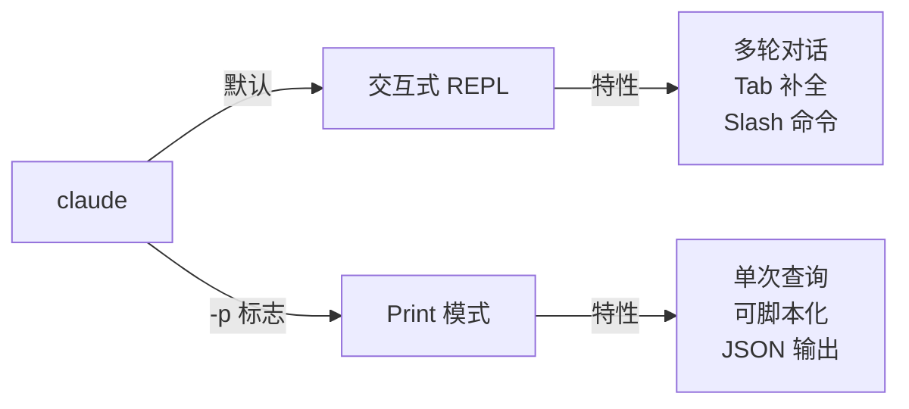

<picture>
  <source media="(prefers-color-scheme: dark)" srcset="../resources/logos/claude-howto-logo-dark.svg">
  
</picture>

> 🟢 **初级** | ⏱ 45 分钟
>
> ✅ 已验证 Claude Code **v2.1.92** · 最后验证：2026-04-06

**你将学会：** 掌握高效交互方式，会管理会话，知道怎么提问更有效。

# 交互与对话

## 为什么需要这个？

你学会了启动 Claude Code，开始和它对话。但你可能发现：

- 每次都要输入完整的问题，很累
- 有时候 Claude 不理解你的意图
- 对话太多，找不到之前的内容
- 切换项目后，又要重新解释背景

这一章，我们学习如何高效地和 Claude 交互，让每次对话都更顺畅。

## 核心概念：两种交互模式

Claude Code 有两种使用方式：

### 交互式 REPL（默认）

```bash
claude
```

特点：
- 多轮对话
- Tab 补全
- 历史记录
- Slash 命令

**适合：** 开发、调试、探索

### Print 模式（非交互）

```bash
claude -p "问题"
```

特点：
- 单次查询
- 可脚本化
- 可管道化
- JSON 输出

**适合：** CI/CD、批量处理、自动化



## 实战场景

### 场景 1：启动命名会话

**问题：** 你在做多个功能，每个功能需要单独的对话上下文。

**解决方案：** 使用 `-n` 参数命名会话。

```bash
# 启动一个专门做认证功能的会话
claude -n "auth-feature"

# 这个会话会记住所有关于认证的讨论
```

**效果：**
- 会话有名字，容易找到
- 上下文隔离，不会混在一起
- 可以随时切换

**Try It Now：**

```bash
# 创建一个会话
claude -n "my-first-session"

# 问一个问题
> 列出这个项目的文件结构

# 退出（Ctrl+D 或 /exit）

# 恢复这个会话
claude -r "my-first-session"
```

### 场景 2：恢复之前的对话

**问题：** 昨天的对话里有重要信息，今天想继续。

**解决方案：** 使用 `-c` 或 `-r` 恢复。

```bash
# 继续最近的对话
claude -c

# 恢复特定会话（按名字）
claude -r "auth-feature"

# 恢复特定会话（按 ID）
claude -r "abc123-def456"
```

**查看所有会话：**

```bash
# 在 Claude Code 里输入
/history

# 或使用命令
claude --list-sessions
```

**Try It Now：**

```bash
# 1. 启动会话
claude -n "test-session"

# 2. 问几个问题
> 这个项目用什么框架？
> 有多少个测试文件？

# 3. 退出
/exit

# 4. 恢复
claude -c

# 5. 验证上下文保留
> 我刚才问了什么问题？
```

### 场景 3：用 Print 模式快速提问

**问题：** 你只想问一个简单问题，不需要进入交互模式。

**解决方案：** 使用 `-p` 标志。

```bash
# 快速提问
claude -p "这个函数做了什么？"

# 处理文件内容
cat error.log | claude -p "分析这些错误"

# 在脚本中使用
claude -p --output-format json "列出所有 API 端点" | jq '.endpoints'
```

**Print 模式的优势：**

| 用途 | 命令示例 |
|------|----------|
| 快速查询 | `claude -p "问题"` |
| 分析日志 | `cat logs \| claude -p "分析"` |
| 生成文档 | `claude -p "生成 README" > README.md` |
| CI/CD | `claude -p --output-format json "代码审查"` |

**Try It Now：**

```bash
# 快速查看项目信息
claude -p "这个项目的技术栈是什么？"

# 分析一个文件
cat package.json | claude -p "解释依赖关系"

# JSON 输出
claude -p --output-format json "有多少个 TypeScript 文件？" | jq
```

## 高效沟通技巧

### 怎么提问更清晰

**不清晰的提问：**
```
帮我改一下这个代码
```

**清晰的提问：**
```
src/api/users.ts 的 updateUser 函数有个问题：
当用户邮箱格式不对时，会抛出未处理的错误。
帮我修复，要求：
- 验证邮箱格式
- 返回明确的错误信息
- 添加单元测试
```

**好的提问包含：**
1. **位置**：哪个文件、哪个函数
2. **问题**：具体是什么问题
3. **要求**：你希望的结果
4. **约束**：有什么限制

### 怎么给上下文

Claude 自动读取当前目录的代码。但有时候需要额外说明：

```
我在做用户认证功能，技术栈是：
- Express.js 后端
- PostgreSQL 数据库
- JWT 认证

请帮我写一个登录 API。
```

### 怎么逐步细化

**第一轮：** 确定方向
```
我想添加一个搜索功能，应该怎么设计？
```

**第二轮：** 确定细节
```
好，就用你的方案。具体实现时：
- 搜索结果要分页
- 支持关键词高亮
- 性能要快（100ms 内）
```

**第三轮：** 具体执行
```
开始实现，先写搜索 API 的路由
```

## 常用 CLI 命令（精简版）

日常最常用的 10 个命令：

| 命令 | 作用 | 示例 |
|------|------|------|
| `claude` | 启动交互会话 | `claude` |
| `claude -p "问题"` | Print 模式快速提问 | `claude -p "解释这个函数"` |
| `claude -c` | 继续最近会话 | `claude -c` |
| `claude -r "名称"` | 恢复命名会话 | `claude -r "auth"` |
| `claude -n "名称"` | 创建命名会话 | `claude -n "新功能"` |
| `/help` | 查看帮助 | `/help` |
| `/clear` | 清空当前对话 | `/clear` |
| `/compact` | 压缩对话历史 | `/compact` |
| `/exit` | 退出 | `/exit` |
| `/model opus` | 切换模型 | `/model opus` |

完整的 CLI 参考见 [附录：CLI 命令参考手册](../temp-cli-ref/)。

## 🎯 Try It Now

### 练习 1：会话管理

1. 创建命名会话：
```bash
claude -n "practice-session"
```

2. 问几个问题，记住上下文

3. 退出，然后恢复：
```bash
claude -r "practice-session"
```

4. 验证 Claude 记住了之前的讨论

### 练习 2：Print 模式

1. 快速分析一个文件：
```bash
cat src/main.ts | claude -p "这个文件做了什么？"
```

2. 使用 JSON 输出：
```bash
claude -p --output-format json "这个项目有多少文件？" | jq
```

### 练习 3：高效提问

对比两种提问方式的效果：

**模糊提问：**
```
帮我优化代码
```

**清晰提问：**
```
src/utils/parser.ts 的 parseJSON 函数：
当输入不是有效 JSON 时，会抛出通用错误。
帮我优化：
- 捕获具体错误类型
- 返回有意义的错误信息
- 性能提升（如果可能）
```

观察 Claude 的回答质量差异。

## 常见问题

### 会话会保存多久？

默认保存在本地，除非手动清除。
- 7 天不活跃可能被清理
- 可以用 `/export` 导出保存

### 怎么查看历史？

在 Claude Code 里：
```
/history
```

### Print 模式和交互模式怎么选？

| 场景 | 推荐 |
|------|------|
| 开发调试 | 交互模式 |
| 快速查询 | Print 模式 |
| CI/CD 自动化 | Print 模式 |
| 探索学习 | 交互模式 |

## 下一章预告

你已经知道怎么和 Claude 交互了。但每次都要输入完整指令，还是有点麻烦。

有没有快捷命令，一键触发常用任务？

下一章，我们学习 **Slash 命令**：
- 55+ 内置快捷命令
- 代码审查、提交、搜索一键完成
- 自定义命令

继续 → [Slash 命令](../03-slash-commands/)