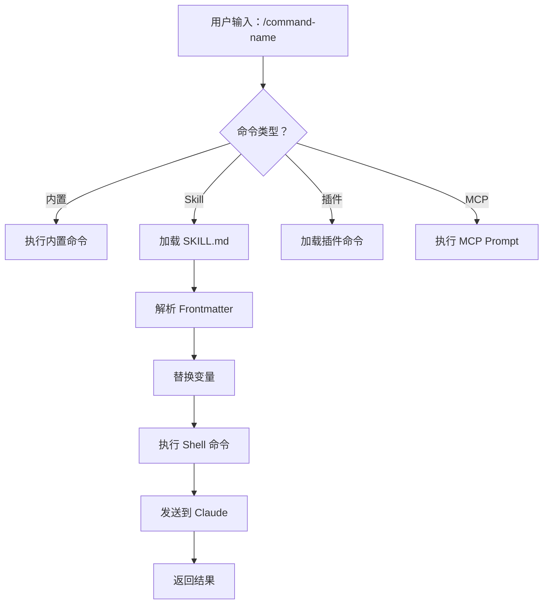
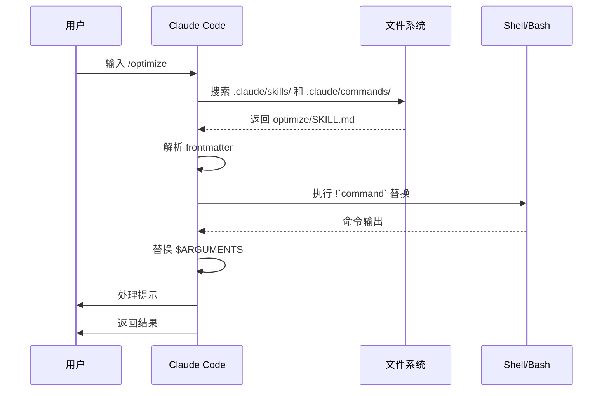

<picture>
  <source media="(prefers-color-scheme: dark)" srcset="../resources/logos/claude-howto-logo-dark.svg">
  
</picture>

> 🟢 **初级** | ⏱ 30 分钟
>
> ✅ 已验证 Claude Code **v2.1.92** · 最后验证：2026-04-05

**你将学到：** 学习使用 slash commands 加速工作流程。

# Slash Commands

## 概述

Slash commands 是在交互式会话中控制 Claude 行为的快捷方式。它们分为几种类型：

- **内置命令**：由 Claude Code 提供（`/help`、`/clear`、`/model`）
- **Skills**：用户定义的命令，以 `SKILL.md` 文件形式创建（`/optimize`、`/pr`）
- **插件命令**：来自已安装插件的命令（`/frontend-design:frontend-design`）
- **MCP prompts**：来自 MCP servers 的命令（`/mcp__github__list_prs`）

> **注意**：自定义 slash commands 已合并到 skills 中。`.claude/commands/` 中的文件仍然可用，但 skills（`.claude/skills/`）现在是推荐的方式。两者都创建 `/command-name` 快捷方式。参见 [Skills 指南](../03-skills/) 获取完整参考。

## 内置命令参考

内置命令是常用操作的快捷方式。共有 **55+ 个内置命令** 和 **5 个内置 skills** 可用。在 Claude Code 中输入 `/` 可查看完整列表，或输入 `/` 后跟任意字母进行筛选。

| 命令 | 用途 |
|---------|---------|
| `/add-dir <path>` | 添加工作目录 |
| `/agents` | 管理代理配置 |
| `/branch [name]` | 将对话分支到新会话（别名：`/fork`）。注意：`/fork` 在 v2.1.77 中重命名为 `/branch` |
| `/btw <question>` | 旁注问题，不添加到历史记录 |
| `/chrome` | 配置 Chrome 浏览器集成 |
| `/clear` | 清除对话（别名：`/reset`、`/new`） |
| `/color [color\|default]` | 设置提示栏颜色 |
| `/compact [instructions]` | 压缩对话，可选聚焦指令 |
| `/config` | 打开设置（别名：`/settings`） |
| `/context` | 以彩色网格可视化上下文使用情况 |
| `/copy [N]` | 将助手响应复制到剪贴板；`w` 写入文件 |
| `/cost` | 显示 token 使用统计 |
| `/desktop` | 在 Desktop 应用中继续（别名：`/app`） |
| `/diff` | 未提交更改的交互式 diff 查看器 |
| `/doctor` | 诊断安装健康状况 |
| `/effort [low\|medium\|high\|max\|auto]` | 设置努力级别。`max` 需要 Opus 4.6 |
| `/exit` | 退出 REPL（别名：`/quit`） |
| `/export [filename]` | 将当前对话导出到文件或剪贴板 |
| `/extra-usage` | 配置速率限制的额外使用量 |
| `/fast [on\|off]` | 切换快速模式 |
| `/feedback` | 提交反馈（别名：`/bug`） |
| `/help` | 显示帮助 |
| `/hooks` | 查看 hook 配置 |
| `/ide` | 管理 IDE 集成 |
| `/init` | 初始化 `CLAUDE.md`。设置 `CLAUDE_CODE_NEW_INIT=true` 启用交互式流程 |
| `/insights` | 生成会话分析报告 |
| `/install-github-app` | 设置 GitHub Actions 应用 |
| `/install-slack-app` | 安装 Slack 应用 |
| `/keybindings` | 打开快捷键配置 |
| `/login` | 切换 Anthropic 账户 |
| `/logout` | 登出 Anthropic 账户 |
| `/mcp` | 管理 MCP servers 和 OAuth |
| `/memory` | 编辑 `CLAUDE.md`，切换自动记忆 |
| `/mobile` | 移动应用二维码（别名：`/ios`、`/android`） |
| `/model [model]` | 用左右箭头选择模型以调整努力级别 |
| `/passes` | 分享 Claude Code 的免费周 |
| `/permissions` | 查看/更新权限（别名：`/allowed-tools`） |
| `/plan [description]` | 进入规划模式 |
| `/plugin` | 管理插件 |
| `/powerup` | 🆕 交互式学习课程，动画演示 Claude Code 功能（v2.1.90+） |
| `/pr-comments [PR]` | 获取 GitHub PR 评论 |
| `/privacy-settings` | 隐私设置（仅限 Pro/Max） |
| `/release-notes` | 查看变更日志 |
| `/reload-plugins` | 重新加载活跃插件 |
| `/remote-control` | 从 claude.ai 远程控制（别名：`/rc`） |
| `/remote-env` | 配置默认远程环境 |
| `/rename [name]` | 重命名会话 |
| `/resume [session]` | 恢复对话（别名：`/continue`） |
| `/review` | **已弃用** — 请安装 `code-review` 插件 |
| `/rewind` | 回退对话和/或代码（别名：`/checkpoint`） |
| `/sandbox` | 切换沙箱模式 |
| `/schedule [description]` | 创建/管理定时任务 |
| `/security-review` | 分析分支的安全漏洞 |
| `/skills` | 列出可用 skills |
| `/stats` | 可视化每日使用量、会话、连续天数 |
| `/status` | 显示版本、模型、账户 |
| `/statusline` | 配置状态栏 |
| `/tasks` | 列出/管理后台任务 |
| `/terminal-setup` | 配置终端快捷键 |
| `/theme` | 更改颜色主题 |
| `/vim` | 切换 Vim/普通模式 |
| `/voice` | 切换按键说话语音听写 |

### 🎮 趣味功能

| 命令 | 用途 |
|------|------|
| `/buddy` | 🆕 孵化一个小伙伴陪你写代码（v2.1.89+，四月特别功能） |

### 内置 Skills

这些 skills 随 Claude Code 提供，可像 slash commands 一样调用：

| Skill | 用途 |
|-------|---------|
| `/batch <instruction>` | 使用 worktrees 编排大规模并行更改 |
| `/claude-api` | 加载项目语言的 Claude API 参考 |
| `/debug [description]` | 启用调试日志 |
| `/loop [interval] <prompt>` | 按间隔重复运行提示 |
| `/simplify [focus]` | 检查已更改文件的代码质量 |

---

## 高级命令详解

以下是对核心内置命令的详细说明，帮助你更高效地使用 Claude Code。

### `/compact` - 压缩对话历史

压缩对话历史，保留核心信息，减少 token 消耗，同时保持对话的连贯性。

**基本语法：**
```bash
/compact [instructions]
```

**工作流程：**
执行 `/compact` 后，Claude Code 会：
1. 分析当前对话历史
2. 保留对话的核心信息和上下文
3. 压缩对话内容，减少 token 数量
4. 保持对话的连贯性

**使用场景：**

| 场景 | 说明 |
|------|------|
| 对话过长时 | 当对话超过 20 轮或 token 消耗过高时 |
| 任务切换前 | 完成一个任务，准备开始新任务前 |
| 定期压缩 | 在长时间对话中每完成一个子任务后 |

**组合用法：**
```bash
# 压缩对话历史后，开始新的对话
/compact
/clear

# 压缩并聚焦特定内容
/compact focus:bugs  # 只保留 bug 相关内容
```

**注意事项：**
- `/compact` 命令无参数版本会自动压缩对话历史
- 压缩后无法恢复原始对话历史
- 不会影响已生成的 `CLAUDE.md` 文件或其他项目文件

---

### `/init` - 初始化项目知识

初始化项目知识图谱，扫描当前文件夹下的所有文件，将解析结果保存到 `CLAUDE.md` 文件中。

**基本语法：**
```bash
/init
```

**工作流程：**
1. 扫描当前目录下的所有文件
2. 解析文件内容并生成项目知识图谱
3. 将解析结果保存到 `CLAUDE.md` 文件中
4. 后续对话会自动引用该文件作为上下文

**关键特点：**
- **生成 CLAUDE.md 文件**：该文件包含项目所有文件的解析结果
- **支持手动编辑**：你可以直接修改 `CLAUDE.md` 文件，添加额外信息
- **自动作为上下文**：后续对话会自动引用 `CLAUDE.md` 文件

**最佳实践：**
- 新项目必用：在任何新项目中首次使用 Claude Code 时，先运行 `/init`
- 定期更新：当项目文件发生较大变化时，重新运行 `/init`
- 手动补充：根据需要手动编辑 `CLAUDE.md`，添加额外信息

---

### `/doctor` - 诊断安装健康状况

检查 Claude Code 的安装健康状况，诊断常见问题，并提供修复建议。

**基本语法：**
```bash
/doctor
```

**检查项目：**

| 检查类别 | 内容 |
|---------|------|
| 系统环境 | 操作系统版本、Node.js 版本、内存和磁盘空间 |
| 安装完整性 | Claude Code 版本、依赖包完整性、可执行文件路径 |
| 网络连接 | Anthropic API 连接、代理设置、DNS 解析 |
| 配置文件 | 配置文件语法、配置文件路径、配置项有效性 |
| 认证状态 | 登录状态、令牌有效性、账户权限 |

**输出示例：**
```bash
Claude Code Health Check
━━━━━━━━━━━━━━━━━━━━━━━━━━━━━━━━━━━━━━━━━━━━━━━━━━━

✓ System Environment
  - OS: macOS 14.0
  - Node.js: v18.17.0
  - Memory: 16 GB

✓ Installation
  - Version: 1.0.124
  - Dependencies: All installed

✓ Network Connection
  - API Connection: OK

✓ Authentication
  - Status: Logged in

Overall Status: ✓ Healthy
```

**常见问题修复：**

| 问题 | 修复建议 |
|------|---------|
| 网络连接失败 | 检查互联网连接、验证代理设置、尝试禁用 VPN |
| 认证失败 | 运行 `/logout` 然后 `/login`，验证账户凭据 |
| 配置文件错误 | 检查 config.json 语法，运行 `/config` 重置设置 |

---

### `/config` - 打开设置界面

打开 Claude Code 的设置界面，允许你配置各种选项和偏好设置。

**基本语法：**
```bash
/config
```

**配置选项类别：**

| 类别 | 内容 |
|------|------|
| 模型设置 | 选择默认 AI 模型、配置模型参数 |
| 界面设置 | 主题选择、字体大小、界面布局 |
| 行为设置 | 自动保存、文件监听、上下文管理 |
| 集成设置 | Git 集成、MCP 服务器、插件配置 |
| 安全设置 | 权限管理、隐私设置、沙箱配置 |

**配置文件位置：**
- **Windows**: `%APPDATA%\claude\config.json`
- **macOS**: `~/Library/Application Support/claude/config.json`
- **Linux**: `~/.config/claude/config.json`

**最佳实践：**
- 定期检查配置设置，确保符合当前需求
- 大幅修改配置前备份配置文件
- 修改配置后测试相关功能是否正常

---

### `/model` - 选择或更改 AI 模型

选择或更改 Claude Code 使用的 AI 模型，根据任务需求选择最合适的模型。

**基本语法：**
```bash
/model [model-name]
```

**可用模型：**

| 模型 | 名称 | 特点 | 适用场景 |
|------|------|------|---------|
| Sonnet 4.6 | `claude-sonnet-4-6` | 平衡性能和速度 | 通用任务、代码生成、文档编写 |
| Haiku 4.5 | `claude-haiku-4-5` | 快速响应，成本低 | 简单任务、快速查询、成本敏感场景 |
| Opus 4.5 | `claude-opus-4-5` | 最强性能，成本高 | 复杂任务、深度分析、高质量要求 |

**模型选择建议：**

| 任务类型 | 推荐模型 |
|---------|---------|
| 代码生成 | Sonnet 4.6 |
| 文档编写 | Sonnet 4.6 |
| 简单查询 | Haiku 4.5 |
| 复杂分析 | Opus 4.5 |

**注意事项：**
- 不同模型的成本不同
- 模型切换会影响当前会话
- 使用 `/effort max` 需要 Opus 4.6 模型

---

### `/permissions` - 查看或更新权限

查看或更新 Claude Code 的权限配置，控制 Claude 可以执行的操作。

**基本语法：**
```bash
/permissions [subcommand]
```

**子命令：**

| 子命令 | 描述 |
|--------|------|
| 无参数 | 查看当前权限配置 |
| `add` | 添加权限规则 |
| `remove` | 删除权限规则 |
| `clear` | 清除所有权限规则 |
| `reset` | 重置为默认权限 |

**权限类型：**

| 类型 | 说明 |
|------|------|
| 工具权限 | `Bash`, `Read`, `Write`, `Edit`, `Delete`, `Grep` |
| 命令权限 | `SlashCommand`, `RunCommand` |

**权限规则示例：**

```yaml
# 允许特定命令
allow:
  - Bash(git add:*)
  - Bash(git commit:*)
  - Bash(git status:*)

# 拒绝特定操作
deny:
  - Delete(*)
  - Bash(rm:*)

# 限制文件访问
allow:
  - Read(./src/*)
  - Write(./src/*)
deny:
  - Read(./config/*)
```

**安全建议：**
- 遵循最小权限原则：只授予必要的权限
- 拒绝规则优先于允许规则
- 定期审查权限配置

---

### `/mcp` - 管理 MCP 服务器

管理 Claude Code 的模型上下文协议（MCP）服务器，扩展 Claude Code 的能力范围。

**基本语法：**
```bash
/mcp <子命令> [参数]
```

**子命令：**

| 子命令 | 描述 |
|--------|------|
| `list` | 列出已配置的 MCP 服务器 |
| `add` | 添加 MCP 服务器 |
| `remove` | 删除 MCP 服务器 |
| `enable` | 启用 MCP 服务器 |
| `disable` | 禁用 MCP 服务器 |
| `test` | 测试 MCP 服务器连接 |

**常见 MCP 服务器配置：**

```bash
# 添加文件系统访问
/mcp add filesystem stdio npx @modelcontextprotocol/server-filesystem ~/projects

# 添加 GitHub 集成
/mcp add github sse https://api.github.com/mcp --token $GITHUB_TOKEN

# 添加数据库连接
/mcp add database stdio npx @modelcontextprotocol/server-postgres --connection-string "postgresql://..."
```

**最佳实践：**
- 只连接必要的 MCP 服务器
- 使用环境变量存储凭证
- 定期测试 MCP 服务器连接

---

### `/terminal-setup` - 配置终端快捷键

安装 Shift+Enter 键绑定，以便在终端中输入多行文本。

**基本语法：**
```bash
/terminal-setup
```

**支持的终端：**

| 终端 | 支持 | 功能 |
|------|------|------|
| iTerm2 | ✓ 完全支持 | Shift+Enter 换行，Enter 发送 |
| VSCode 终端 | ✓ 完全支持 | Shift+Enter 换行，Enter 发送 |
| 其他终端 | ✗ 不支持 | 建议使用 iTerm2 或 VSCode 终端 |

**键绑定说明：**
- **Enter**: 发送命令
- **Shift+Enter**: 换行（不发送）

**注意事项：**
- 仅支持 iTerm2 和 VSCode 终端
- 需要重启终端才能生效

---

### `/rewind` - 回退对话和代码

回退对话和/或代码，允许你撤销之前的操作，恢复到之前的状态。

**基本语法：**
```bash
/rewind [steps]
```

**参数说明：**
- 无参数：显示可回退的操作列表
- `[steps]`：指定要回退的步数

**可回退的操作：**

| 类型 | 操作 |
|------|------|
| 对话操作 | 消息发送、命令执行、上下文更改 |
| 文件操作 | 文件创建、文件编辑、文件删除 |
| 代码操作 | 代码生成、代码修改、代码重构 |

**使用示例：**
```bash
# 查看可回退的操作列表
/rewind

# 回退 3 步
/rewind 3
```

**注意事项：**
- 回退操作无法恢复
- 建议在回退前使用 `/export` 导出对话

---

### `/export` - 导出对话

将当前对话导出到文件或剪贴板，方便保存和分享。

**基本语法：**
```bash
/export [filename]
```

**参数说明：**
- 无参数：导出到剪贴板
- `[filename]`：导出到指定文件

**导出格式：**
导出的文件采用 Markdown 格式，包含：
- 会话日期和时间
- 使用的模型
- 完整对话历史

**使用场景：**
- 保存重要对话记录
- 分享对话内容
- 创建文档

---

### `/clear` - 清除对话历史

清除 Claude Code 的对话历史，重置当前会话上下文。

**基本语法：**
```bash
/clear
```

**功能说明：**
1. 清除当前会话的所有对话历史
2. 重置上下文窗口
3. 保持 Claude Code 界面打开，准备新对话

**使用场景：**

| 场景 | 说明 |
|------|------|
| 任务切换 | 完成一个任务后，开始新任务前 |
| 清理过长对话 | 对话持续很久、上下文累积过多时 |
| 修复偏离 | Claude 的回答偏离正轨或上下文混乱时 |

**注意事项：**
- 清除的对话内容无法恢复
- 不会影响已生成的 `CLAUDE.md` 文件或项目文件

---

### `/bashes` - 管理后台任务

列出和管理 Claude Code 中的后台任务。

**基本语法：**
```bash
/bashes [subcommand]
```

**子命令：**

| 子命令 | 描述 |
|--------|------|
| 无参数 | 列出所有后台任务及其状态 |
| `kill <task-id>` | 终止指定的后台任务 |
| `output <task-id>` | 查看指定任务的输出 |
| `clear` | 清除已完成的任务 |

**使用场景：**
- 长时间运行的构建任务
- 安装依赖
- 运行测试

**后台任务优势：**
- 非阻塞：后台任务不会阻塞主对话流程
- 多任务：可以同时运行多个后台任务
- 监控：可以随时查看任务状态和输出

---

### `/hooks` - 管理钩子配置

管理工具事件的钩子配置，在特定事件发生时自动执行自定义脚本。

**基本语法：**
```bash
/hooks [subcommand]
```

**子命令：**

| 子命令 | 描述 |
|--------|------|
| 无参数 | 列出所有已配置的钩子 |
| `add` | 添加新的钩子 |
| `edit` | 编辑现有钩子 |
| `remove` | 删除钩子 |
| `enable` | 启用钩子 |
| `disable` | 禁用钩子 |

**钩子事件：**

| 事件 | 描述 |
|------|------|
| `before-edit` | 文件编辑前 |
| `after-edit` | 文件编辑后 |
| `before-run` | 命令执行前 |
| `after-run` | 命令执行后 |
| `on-error` | 错误发生时 |
| `on-success` | 任务成功时 |

**钩子配置示例：**
```yaml
name: format-code
event: after-edit
command: prettier --write $FILE
enabled: true
```

---

### `/memory` - 编辑内存文件

编辑 `CLAUDE.md` 内存文件，该文件包含项目的上下文信息。

**基本语法：**
```bash
/memory
```

**CLAUDE.md 文件内容：**
- 项目概述：项目的基本信息和目标
- 架构说明：项目架构和技术栈
- 代码规范：编码标准和最佳实践
- 重要说明：需要注意的事项
- 上下文信息：AI 需要了解的项目细节

**使用场景：**
- 添加项目信息
- 更新架构说明
- 补充上下文

**最佳实践：**
- 定期更新 `CLAUDE.md` 文件
- 使用清晰的语言描述项目
- 结构化内容，使用标题和列表组织

---

### `/agents` - 管理 AI 子代理

管理专门的自定义 AI 子代理，处理特定类型的任务。

**基本语法：**
```bash
/agents [subcommand]
```

**子命令：**

| 子命令 | 描述 |
|--------|------|
| 无参数 | 列出所有可用的子代理 |
| `create` | 创建新的子代理 |
| `edit` | 编辑现有子代理 |
| `delete` | 删除子代理 |
| `use` | 使用指定的子代理 |

**子代理优势：**
- 专业化：每个子代理专注于特定领域
- 一致性：保持输出风格的一致性
- 效率：预设特定任务的工作流程
- 可定制：根据团队需求创建自定义子代理

**使用示例：**
```bash
# 使用代码审查代理
/agents use code-reviewer

# 切换到错误修复代理
/agents use bug-fixer
```

---

## 三种核心模式详解

Claude Code 有三种核心权限模式，理解它们的区别对于高效使用至关重要。

### 模式概览

| 模式 | 特点 | 适用场景 | 安全性 |
|------|------|----------|--------|
| **默认模式** | 逐个确认 | 初学者、不确定的操作 | ⭐⭐⭐⭐⭐ |
| **自动模式** | 自动批准 | 信任的重复性任务 | ⭐⭐⭐ |
| **规划模式** | 先计划后执行 | 复杂重构、大型功能 | ⭐⭐⭐⭐⭐ |

### 默认模式 (Default Mode)

**启动方式：**
```bash
# 默认就是此模式，无需额外参数
claude
```

**交互流程：**
```
你: "帮我修复这个 bug"

Claude: "我将修改 file.js"
你: [需要按 y 确认]

Claude: "我将安装依赖"
你: [需要按 y 确认]
```

**推荐使用场景：**
- 初次使用 Claude Code
- 不确定的操作
- 需要仔细审查每个改动
- 生产环境的代码

### 自动模式 (Auto Mode)

**启动方式：**
```bash
# 方式 1: 命令行参数
claude --auto-approve

# 方式 2: 配置文件
# ~/.claude/config.json
{
  "autoApprove": true
}
```

**安全机制：**
Auto Mode 不是简单的"全部放行"，它内置了 AI 安全分类器：
- **第一阶段**：Prompt Injection 探测器快速检查（误报率 8.5%）
- **第二阶段**：Transcript 分类器深度推理（误报率 0.4%）

**推荐使用场景：**
- 高度信任的操作（如只读任务）
- 重复性工作（如格式化代码）
- 沙盒环境或测试项目
- 已经在规划模式中审查过的任务

**安全警告：**
- Auto Mode 有约 17% 的漏检率
- `--dangerously-skip-permissions` 完全跳过权限检查，仅限沙盒环境

### 规划模式 (Plan Mode)

**启动方式：**
```bash
# 方式 1: 命令行参数
claude --plan-mode

# 方式 2: 在会话中快速切换
# 按两次 Shift+Tab

# 方式 3: 使用 /plan 命令
/plan 添加用户认证功能
```

**工作流程：**
```
你: "帮我将应用迁移到 TypeScript"

Claude: [生成详细计划]
1. 安装 TypeScript 和依赖
2. 创建 tsconfig.json
3. 重命名 .js 文件为 .ts
...

你: [批准或修改计划]
Claude: [执行计划]
```

**推荐使用场景：**
- 大型重构（超过 5 个文件）
- 架构变更
- 添加复杂功能
- 安全性敏感的操作

### 模式选择决策树

```
任务来了
  │
  ├─ 是否修改代码？
  │   ├─ 否 → 默认模式或自动模式（只读操作）
  │   └─ 是 → 继续
  │
  ├─ 涉及多少文件？
  │   ├─ 1-3 个 → 默认模式
  │   └─ 3+ 个 → 继续
  │
  ├─ 是否是生产代码？
  │   ├─ 是 → 规划模式
  │   └─ 否 → 继续
  │
  └─ 你是否信任 Claude？
      ├─ 是 → 自动模式
      └─ 否 → 规划模式或默认模式
```

### 推荐工作流

```
┌─────────────────┐
│  规划模式        │ ← 大型任务从这里开始
│  (Plan Mode)    │
└────────┬────────┘
         │ 审查并批准计划
         ↓
┌─────────────────┐
│  自动模式        │ ← 执行已批准的计划
│  (Auto Mode)    │
└─────────────────┘
```

---

### 已弃用命令

| 命令 | 状态 |
|---------|--------|
| `/review` | 已弃用 — 被 `code-review` 插件取代 |
| `/output-style` | 自 v2.1.73 起弃用 |
| `/fork` | 重命名为 `/branch`（别名仍可用，v2.1.77） |

### 近期更改

- `/fork` 重命名为 `/branch`，保留 `/fork` 作为别名（v2.1.77）
- `/output-style` 弃用（v2.1.73）
- `/review` 弃用，推荐使用 `code-review` 插件
- 添加 `/effort` 命令，`max` 级别需要 Opus 4.6
- 添加 `/voice` 命令用于按键说话语音听写
- 添加 `/schedule` 命令用于创建/管理定时任务
- 添加 `/color` 命令用于提示栏自定义
- `/model` 选择器现在显示人类可读标签（如 "Sonnet 4.6"）而非原始模型 ID
- `/resume` 支持 `/continue` 别名
- MCP prompts 可作为 `/mcp__<server>__<prompt>` 命令使用（参见 [MCP Prompts 作为命令](#mcp-prompts-as-commands)）

## 自定义命令（现为 Skills）

自定义 slash commands 已**合并到 skills** 中。两种方式都创建可用 `/command-name` 调用的命令：

| 方式 | 位置 | 状态 |
|----------|----------|--------|
| **Skills（推荐）** | `.claude/skills/<name>/SKILL.md` | 当前标准 |
| **旧版命令** | `.claude/commands/<name>.md` | 仍可用 |

如果 skill 和命令同名，**skill 优先**。例如，当 `.claude/commands/review.md` 和 `.claude/skills/review/SKILL.md` 同时存在时，使用 skill 版本。

### 迁移路径

现有的 `.claude/commands/` 文件无需修改即可继续工作。要迁移到 skills：

**迁移前（命令）：**
```
.claude/commands/optimize.md
```

**迁移后（Skill）：**
```
.claude/skills/optimize/SKILL.md
```

### 为什么选择 Skills？

Skills 比旧版命令提供更多功能：

- **目录结构**：可打包脚本、模板和参考文件
- **自动调用**：Claude 可在相关时自动触发 skills
- **调用控制**：选择用户、Claude 或两者是否可调用
- **子代理执行**：使用 `context: fork` 在隔离上下文中运行 skills
- **渐进式披露**：仅在需要时加载额外文件

### 创建自定义命令作为 Skill

创建包含 `SKILL.md` 文件的目录：

```bash
mkdir -p .claude/skills/my-command
```

**文件：** `.claude/skills/my-command/SKILL.md`

```yaml
---
name: my-command
description: 此命令的功能及何时使用
---

# My Command

调用此命令时 Claude 应遵循的指令。

1. 第一步
2. 第二步
3. 第三步
```

### Frontmatter 参考

| 字段 | 用途 | 默认值 |
|-------|---------|---------|
| `name` | 命令名称（变为 `/name`） | 目录名 |
| `description` | 简要描述（帮助 Claude 知道何时使用） | 首段 |
| `argument-hint` | 自动补全的预期参数 | 无 |
| `allowed-tools` | 命令无需权限即可使用的工具 | 继承 |
| `model` | 使用的特定模型 | 继承 |
| `disable-model-invocation` | 若为 `true`，仅用户可调用（Claude 不可） | `false` |
| `user-invocable` | 若为 `false`，从 `/` 菜单隐藏 | `true` |
| `context` | 设为 `fork` 以在隔离子代理中运行 | 无 |
| `agent` | 使用 `context: fork` 时的代理类型 | `general-purpose` |
| `hooks` | Skill 级别的 hooks（PreToolUse、PostToolUse、Stop） | 无 |

### 参数

命令可接收参数：

**使用 `$ARGUMENTS` 接收所有参数：**

```yaml
---
name: fix-issue
description: 根据编号修复 GitHub issue
---

按照我们的编码标准修复 issue #$ARGUMENTS
```

用法：`/fix-issue 123` → `$ARGUMENTS` 变为 "123"

**使用 `$0`、`$1` 等接收单个参数：**

```yaml
---
name: review-pr
description: 以指定优先级审查 PR
---

以优先级 $1 审查 PR #$0
```

用法：`/review-pr 456 high` → `$0`="456", `$1`="high"

### 使用 Shell 命令获取动态上下文

使用 `!`command`` 在提示前执行 bash 命令：

```yaml
---
name: commit
description: 创建包含上下文的 git commit
allowed-tools: Bash(git *)
---

## 上下文

- 当前 git 状态：!`git status`
- 当前 git diff：!`git diff HEAD`
- 当前分支：!`git branch --show-current`
- 最近提交：!`git log --oneline -5`

## 你的任务

基于以上更改，创建一个 git commit。
```

### 文件引用

使用 `@` 包含文件内容：

```markdown
审查 @src/utils/helpers.js 中的实现
比较 @src/old-version.js 和 @src/new-version.js
```

## 插件命令

插件可提供自定义命令：

```
/plugin-name:command-name
```

或当无命名冲突时直接使用 `/command-name`。

**示例：**
```bash
/frontend-design:frontend-design
/commit-commands:commit
```

## MCP Prompts 作为命令

MCP servers 可将 prompts 暴露为 slash commands：

```
/mcp__<server-name>__<prompt-name> [arguments]
```

**示例：**
```bash
/mcp__github__list_prs
/mcp__github__pr_review 456
/mcp__jira__create_issue "Bug 标题" high
```

### MCP 权限语法

在权限中控制 MCP server 访问：

- `mcp__github` - 访问整个 GitHub MCP server
- `mcp__github__*` - 通配符访问所有工具
- `mcp__github__get_issue` - 特定工具访问

## 命令架构



## 命令生命周期



## 本文件夹中的可用命令

这些示例命令可作为 skills 或旧版命令安装。

### 1. `/optimize` - 代码优化

分析代码的性能问题、内存泄漏和优化机会。

**用法：**
```
/optimize
[粘贴你的代码]
```

### 2. `/pr` - Pull Request 准备

引导完成 PR 准备检查清单，包括 linting、测试和提交格式化。

**用法：**
```
/pr
```

**截图：**


### 3. `/generate-api-docs` - API 文档生成器

从源代码生成全面的 API 文档。

**用法：**
```
/generate-api-docs
```

### 4. `/commit` - 带上下文的 Git Commit

创建包含仓库动态上下文的 git commit。

**用法：**
```
/commit [可选消息]
```

### 5. `/push-all` -暂存、提交和推送

暂存所有更改、创建 commit 并推送到远程，附带安全检查。

**用法：**
```
/push-all
```

**安全检查：**
- 密钥：`.env*`、`*.key`、`*.pem`、`credentials.json`
- API 密钥：检测真实密钥与占位符
- 大文件：`>10MB` 无 Git LFS
- 构建产物：`node_modules/`、`dist/`、`__pycache__/`

### 6. `/doc-refactor` - 文档重构

重构项目文档以提高清晰度和可访问性。

**用法：**
```
/doc-refactor
```

### 7. `/setup-ci-cd` - CI/CD 管道设置

实现 pre-commit hooks 和 GitHub Actions 用于质量保证。

**用法：**
```
/setup-ci-cd
```

### 8. `/unit-test-expand` - 测试覆盖扩展

通过针对未测试分支和边缘情况提高测试覆盖率。

**用法：**
```
/unit-test-expand
```

## 安装

### 作为 Skills（推荐）

复制到你的 skills 目录：

```bash
# 创建 skills 目录
mkdir -p .claude/skills

# 为每个命令文件创建 skill 目录
for cmd in optimize pr commit; do
  mkdir -p .claude/skills/$cmd
  cp 01-slash-commands/$cmd.md .claude/skills/$cmd/SKILL.md
done
```

### 作为旧版命令

复制到你的 commands 目录：

```bash
# 项目级（团队共享）
mkdir -p .claude/commands
cp 01-slash-commands/*.md .claude/commands/

# 个人使用
mkdir -p ~/.claude/commands
cp 01-slash-commands/*.md ~/.claude/commands/
```

## 创建自己的命令

### Skill 模板（推荐）

创建 `.claude/skills/my-command/SKILL.md`：

```yaml
---
name: my-command
description: 此命令的功能。当 [触发条件] 时使用。
argument-hint: [可选参数]
allowed-tools: Bash(npm *), Read, Grep
---

# 命令标题

## 上下文

- 当前分支：!`git branch --show-current`
- 相关文件：@package.json

## 指令

1. 第一步
2. 使用参数的第二步：$ARGUMENTS
3. 第三步

## 输出格式

- 如何格式化响应
- 包含什么内容
```

### 仅用户命令（禁止自动调用）

对于有副作用且 Claude 不应自动触发的命令：

```yaml
---
name: deploy
description: 部署到生产环境
disable-model-invocation: true
allowed-tools: Bash(npm *), Bash(git *)
---

将应用部署到生产环境：

1. 运行测试
2. 构建应用
3. 推送到部署目标
4. 验证部署
```

## 最佳实践

| 应该 | 不应该 |
|------|---------|
| 使用清晰、行动导向的名称 | 为一次性任务创建命令 |
| 包含带触发条件的 `description` | 在命令中构建复杂逻辑 |
| 保持命令专注于单一任务 | 硬编码敏感信息 |
| 对有副作用的命令使用 `disable-model-invocation` | 略过 description 字段 |
| 使用 `!` 前缀获取动态上下文 | 假设 Claude 知道当前状态 |
| 在 skill 目录中组织相关文件 | 把所有内容放在一个文件中 |

## 立即尝试

### 🎯 练习 1：创建你的第一个 Skill

创建一个简单的 `/hello` skill 来问候你：

```bash
mkdir -p .claude/skills/hello
```

创建 `.claude/skills/hello/SKILL.md`：

```yaml
---
name: hello
description: 问候用户。当用户打招呼或开始会话时使用。
---

# Hello Skill

热情问候用户，询问他们今天想做什么。

包含：
1. 当前时间和日期
2. 项目快速状态（git 分支、最近活动）
3. 根据最近更改建议做什么
```

测试：`/hello`

### 🎯 练习 2：动态上下文 Skill

创建一个 `/status` skill 显示项目状态：

```yaml
---
name: status
description: 显示全面的项目状态。当用户询问项目状态时使用。
allowed-tools: Bash(git *), Bash(npm *), Read
---

# 项目状态报告

## Git 状态
- 当前分支：!`git branch --show-current`
- 未提交更改：!`git status --short`
- 最近提交：!`git log --oneline -5`

## 依赖
- Package.json：@package.json
- 过期包：!`npm outdated --json 2>/dev/null || echo "无过期包"`

## 测试覆盖率
- 最近测试运行：!`npm test -- --coverage --silent 2>&1 | tail -20 || echo "测试未配置"`

## 概要

简要总结：
1. 需要关注的内容（未提交更改、失败的测试）
2. 准备好可发布的
3. 建议的下一步
```

测试：`/status`

### 🎯 练习 3：命令链工作流

组合多个命令完成工作流：

```bash
# 早晨例行
/status          # 检查项目健康
/diff            # 回顾昨天的更改
/memory          # 添加今天的聚焦上下文

# 提交前例行  
/optimize        # 检查优化机会  
/commit          # 创建上下文提交

# PR 准备
/pr              # 完整 PR 检查清单
```

## 实用工作流

### 每日开发周期

```mermaid
graph LR
    A[/status] --> B[/diff]
    B --> C[编写代码]
    C --> D[/optimize]
    D --> E[/commit]
    E --> F{/测试通过？}
    F -->|是| G[/pr]
    F -->|否| C
```

**早晨启动：**
```bash
/status           # 项目健康检查
/compact focus:bugs  # 聚焦 bug 修复
```

**完成工作后：**
```bash
/optimize         # 性能审查
/test             # 运行测试
/commit           # 上下文提交
```

### 代码审查工作流

创建一个 `/review-branch` skill 用于全面审查：

```yaml
---
name: review-branch
description: 审查分支的质量、安全和性能。合并 PR 前使用。
argument-hint: branch-name
allowed-tools: Bash(git *), Read, Grep, Glob
---

# 分支审查：$ARGUMENTS

## 更改概要
- 更改的文件：!`git diff main...$ARGUMENTS --stat`
- 包含的提交：!`git log main..$ARGUMENTS --oneline`

## 质量检查
对于每个更改的文件：

1. **代码风格**
   - 函数 < 50 行
   - 文件 < 800 行
   - 无深层嵌套（>4 层）

2. **安全**
   - 无硬编码密钥
   - 存在输入验证
   - 正确的错误处理

3. **性能**
   - 无 N+1 查询
   - 高效算法
   - 无内存泄漏

## 报告格式

| 文件 | 质量 | 安全 | 性能 | 问题 |
|------|---------|----------|-------------|--------|

## 建议

提供合并建议：
- 阻塞问题（必须修复）
- 警告（应该修复）
- 建议（可选）
```

### 发布工作流

创建一个 `/release-check` skill：

```yaml
---
name: release-check
description: 发布前验证检查清单。发布前使用。
allowed-tools: Bash(npm *), Bash(git *), Read
---

# 发布检查清单

## 版本检查
- 当前版本：!`node -e "console.log(require('./package.json').version)"`
- 变更日志已更新：检查 CHANGELOG.md 是否有当前版本条目

## 质量门控
- 所有测试通过：!`npm test 2>&1 | tail -5`
- 无 TypeScript 错误：!`npx tsc --noEmit 2>&1 || echo "无 TS 错误"`
- Lint 清洁：!`npm run lint 2>&1 | tail -5 || echo "Lint 通过"`

## 安全扫描
- 代码中无密钥：!`grep -r "api_key\|password\|secret" --include="*.js" --include="*.ts" src/ || echo "清洁"`
- 依赖已审计：!`npm audit 2>&1 || echo "审计通过"`

## 文档
- README 已更新
- API 文档当前
- 如有破坏性更改需迁移指南

## 最终报告

提供：
1. ✅ 通过的检查
2. ❌ 失败的检查（阻塞）
3. ⚠️ 警告（非阻塞）
4. 发布建议
```

## 高级模式

### 模式 1：上下文继承

Skills 可引用其他 skills 或记忆：

```yaml
---
name: smart-commit
description: 使用项目记忆的智能提交
---

# Smart Commit

使用来自以下的上下文：
- @CLAUDE.md 用于项目约定
- 最近记忆用于当前聚焦

## 步骤

1. 对照 CLAUDE.md 约定审查更改
2. 检查记忆中的进行中工作
3. 创建符合项目风格的提交消息
4. 如有协作需包含共同作者信息
```

### 模式 2：条件执行

使用 shell 条件实现智能行为：

```yaml
---
name: safe-push
description: 自动检查的安全推送
allowed-tools: Bash(git *), Bash(npm *)
---

# Safe Push

## 预检查
- 测试通过：!`npm test 2>&1 | grep -q "passed" && echo "PASS" || echo "FAIL"`
- 分支清洁：!`git status --porcelain | wc -l | xargs`

## 条件逻辑
- 若测试 FAIL："无法推送 - 测试失败。先运行 /test-fix"
- 若分支有未提交更改："无法推送 - 有未提交更改。先运行 /commit"
- 若全 PASS：继续推送

## 推送步骤
!`npm test 2>&1 | grep -q "passed" && git push || echo "阻塞：测试失败"`
```

### 模式 3：错误恢复

优雅处理错误：

```yaml
---
name: robust-deploy
description: 带回滚能力的部署
allowed-tools: Bash(npm *), Bash(git *)
---

# Robust Deploy

## 部署前快照
- 当前提交：!`git rev-parse HEAD`
- 当前分支：!`git branch --show-current`

## 部署步骤
1. 构建：!`npm run build 2>&1 | tail -10`
2. 部署：!`npm run deploy 2>&1 | tail -10`
3. 验证：!`curl -s https://app.example.com/health || echo "FAILED"`

## 失败时回滚
若任何步骤失败：
```bash
git checkout !`git rev-parse HEAD`  # 返回快照
npm run rollback  # 自定义回滚命令
```

报告成功或回滚原因。
```

### 模式 4：多文件处理

高效处理多个文件：

```yaml
---
name: batch-optimize
description: 并行优化多个文件
allowed-tools: Read, Edit, Glob, Bash
---

# 批量优化

## 查找目标文件
!`find src -name "*.ts" -type f | head -20`

## 对每个文件
1. 读取文件
2. 分析：
   - 未使用的导入
   - 死代码
   - 优化机会
3. 应用优化
4. 跟踪更改

## 概要报告
- 处理文件数：$FILES_COUNT
- 应用优化数：$OPTIMIZATIONS_COUNT
- 减少行数：$LINES_SAVED
```

### 模式 5：交互式提示

Skills 可提示用户输入：

```yaml
---
name: interactive-review
description: 带用户引导的交互式代码审查
---

# Interactive Review

## 第一阶段：概览
显示更改摘要并询问：
- "聚焦特定领域？（安全、性能、风格）"
- 等待用户响应

## 第二阶段：深入
基于用户聚焦领域：
- 显示相关问题
- 对每个问题请求决策

## 第三阶段：应用
- "应用所有批准的更改？"
- 若是：进行编辑
- 若否：列出供人工审查
```

## 性能考量

### Skill 加载速度

以下情况 Skills 加载更快：

1. **精简 frontmatter**：仅包含必要字段
2. **高效 shell 命令**：使用 `--quiet`、`--silent`，管道到 `head`
3. **优先文件引用而非读取**：`@file` 有缓存，`Read` 为最新
4. **惰性加载**：不包含所有文件，使用 `!` 命令按需获取

### 命令执行速度

| 方式 | 速度 | 用例 |
|----------|-------|----------|
| 静态内容 | 最快 | 固定指令 |
| `!` 命令（缓存） | 快 | Git 状态、package.json |
| `!` 命令（最新） | 中等 | 测试结果、构建输出 |
| `@file` 引用 | 中等 | 大文件、模板 |
| 内联 Read 工具 | 最慢 | 实时文件检查 |

### 优化示例

**慢 skill：**
```yaml
# 每次读取所有文件
检查所有这些文件：
- @src/index.ts
- @src/utils.ts
- @src/config.ts
- @src/app.ts
```

**快 skill：**
```yaml
# 惰性加载仅所需内容
检查匹配模式的文件：
!`find src -name "*.ts" | head -5`

然后选择性读取：
"哪些文件需要详细审查？"
```

## 常见陷阱

### 陷阱 1：循环依赖

**问题：** Skill A 引用 Skill B，Skill B 又引用 Skill A。

**解决方案：** 使用记忆（CLAUDE.md）作为共享上下文，而非 skill 链。

### 陷阱 2：权限过度

**问题：** Skill 请求它不需要的工具。

```yaml
# 不好：请求所有权限
allowed-tools: Bash(*), Read(*), Write(*)
```

**解决方案：** 仅请求必要工具：

```yaml
# 好：特定权限
allowed-tools: Bash(git status), Bash(git log), Read
```

### 陷阱 3：过于复杂的 Skills

**问题：** 一个 skill 做太多事情。

**解决方案：** 分解为聚焦的 skills：

```yaml
# 代替 /full-review，创建：
/review-security  # 聚焦安全
/review-performance  # 聚焦性能  
/review-style  # 聚焦风格
```

### 陷阱 4：缺少错误处理

**问题：** Skill 失败但无指导。

```yaml
# 不好：无回退
运行测试：!`npm test`
```

**解决方案：** 包含错误指导：

```yaml
# 好：错误处理
运行测试：!`npm test 2>&1 || echo "测试失败 - 查看上方输出"`

若测试失败：
1. 显示测试输出
2. 建议运行 /debug-tests
3. 不要继续依赖步骤
```

### 陷阱 5：硬编码路径

**问题：** Skill 仅在特定项目中工作。

```yaml
# 不好：硬编码
检查：@/Users/dev/my-project/src/app.ts
```

**解决方案：** 使用相对路径和发现：

```yaml
# 好：可移植
检查：@src/app.ts
或发现：!`find . -name "app.ts" -type f`
```

## 故障排查

### 命令未找到

**解决方案：**
- 检查文件是否在 `.claude/skills/<name>/SKILL.md` 或 `.claude/commands/<name>.md`
- 验证 frontmatter 中的 `name` 字段是否匹配预期命令名
- 重启 Claude Code 会话
- 运行 `/help` 查看可用命令

### 命令未按预期执行

**解决方案：**
- 添加更具体的指令
- 在 skill 文件中包含示例
- 若使用 bash 命令，检查 `allowed-tools`
- 先用简单输入测试

### Skill 与命令冲突

若两者同名，**skill 优先**。移除其中一个或重命名。

## 相关指南

- **[Skills](../03-skills/)** - skills 完整参考（自动调用能力）
- **[Memory](../02-memory/)** - CLAUDE.md 持久上下文
- **[Subagents](../04-subagents/)** - 委托 AI 代理
- **[Plugins](../07-plugins/)** - 打包命令集合
- **[Hooks](../06-hooks/)** - 事件驱动自动化

## 更多资源

- [官方交互模式文档](https://code.claude.com/docs/en/interactive-mode) - 内置命令参考
- [官方 Skills 文档](https://code.claude.com/docs/en/skills) - 完整 skills 参考
- [CLI 参考](https://code.claude.com/docs/en/cli-reference) - 命令行选项

---

*属于 [Claude How To](../) 指南系列*