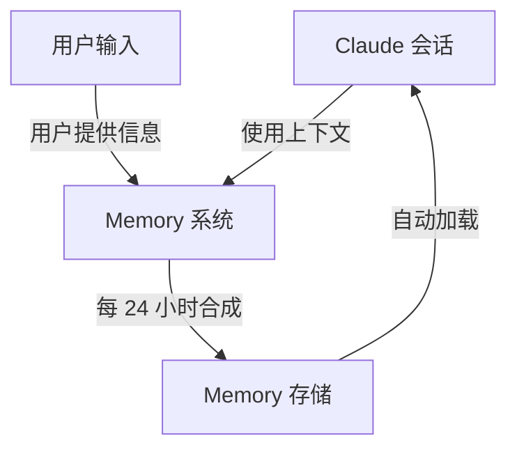
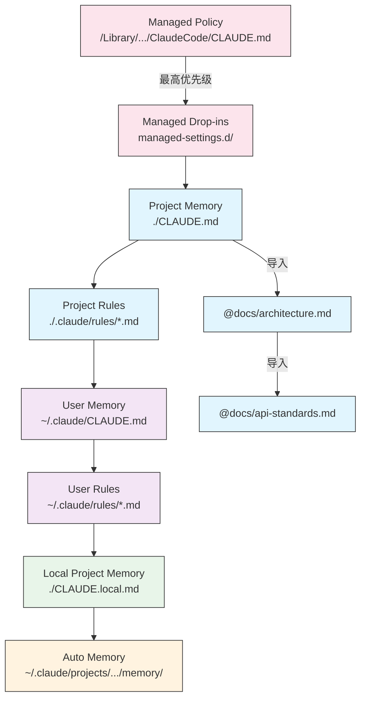
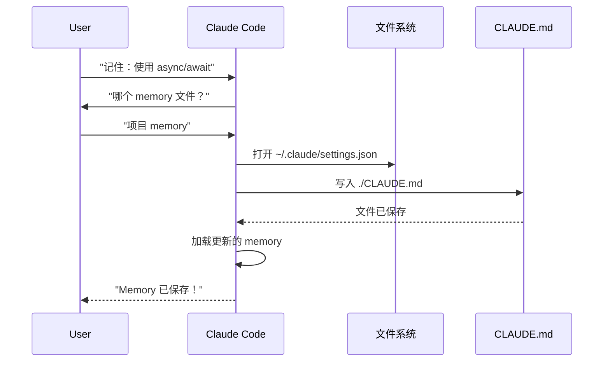
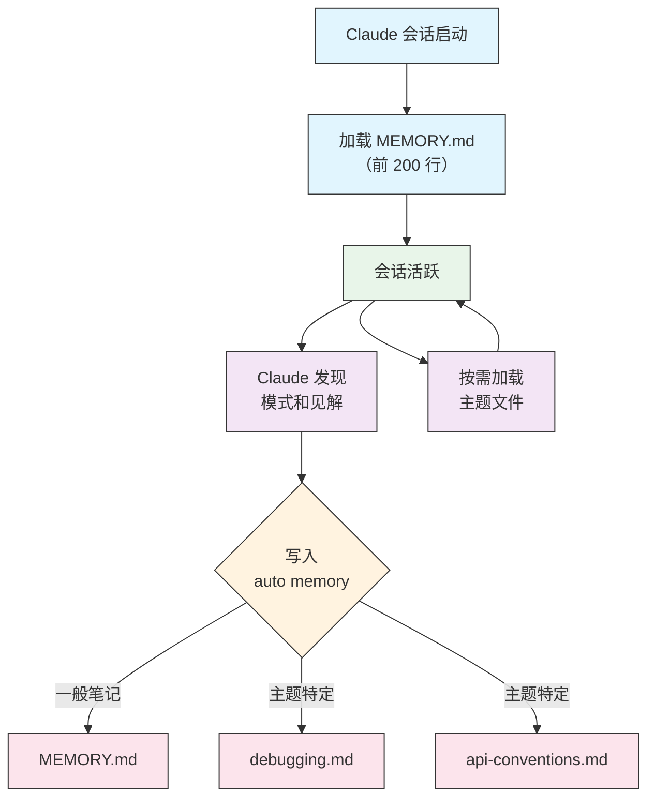

<picture>
  <source media="(prefers-color-scheme: dark)" srcset="../resources/logos/claude-howto-logo-dark.svg">
  
</picture>

> 🟢 **初级** | ⏱ 45 minutes
>
> ✅ 已验证 Claude Code **v2.1.92** · 最后验证：2026-04-05

**你将构建：** 在 Claude Code 会话之间设置持久化上下文。

# Memory 指南

Memory 使 Claude 能够跨会话和对话保持上下文。它有两种形式：claude.ai 中的自动合成，以及 Claude Code 中基于文件系统的 CLAUDE.md。

## 概述

Claude Code 中的 Memory 提供跨多个会话和对话的持久化上下文。与临时的上下文窗口不同，memory 文件允许你：

- 在团队间共享项目标准
- 存储个人开发偏好
- 维护目录特定的规则和配置
- 导入外部文档
- 将 memory 作为项目的一部分进行版本控制

Memory 系统在多个层级上运行，从全局个人偏好到特定子目录，允许精细控制 Claude 记住什么以及如何应用这些知识。

## Memory 命令快速参考

| 命令 | 用途 | 使用方式 | 何时使用 |
|---------|---------|-------|-------------|
| `/init` | 初始化项目 memory | `/init` | 启动新项目，首次设置 CLAUDE.md |
| `/memory` | 在编辑器中编辑 memory 文件 | `/memory` | 大量更新、重组、审查内容 |
| `#` prefix | 快速单行 memory 添加 | `# Your rule here` | 在对话中添加快速规则 |
| `# new rule into memory` | 显式 memory 添加 | `# new rule into memory<br/>Your detailed rule` | 添加复杂的多行规则 |
| `# remember this` | 自然语言 memory | `# remember this<br/>Your instruction` | 对话式 memory 更新 |
| `@path/to/file` | 导入外部内容 | `@README.md` 或 `@docs/api.md` | 在 CLAUDE.md 中引用现有文档 |

## 快速开始：初始化 Memory

### `/init` 命令

`/init` 命令是在 Claude Code 中设置项目 memory 的最快方式。它会创建一个包含基础项目文档的 CLAUDE.md 文件。

**使用方式：**

```bash
/init
```

**功能：**

- 在项目中创建新的 CLAUDE.md 文件（通常位于 `./CLAUDE.md` 或 `./.claude/CLAUDE.md`）
- 建立项目约定和指南
- 设置跨会话上下文持久化的基础
- 提供文档化项目标准的模板结构

**增强交互模式：** 设置 `CLAUDE_CODE_NEW_INIT=true` 启用多阶段交互流程，逐步引导你完成项目设置：

```bash
CLAUDE_CODE_NEW_INIT=true claude
/init
```

**何时使用 `/init`：**

- 使用 Claude Code 启动新项目
- 建立团队编码标准和约定
- 创建关于代码库结构的文档
- 为协作开发设置 memory 层级

**示例工作流：**

```markdown
# 在项目目录中
/init

# Claude 创建 CLAUDE.md，结构如下：
# 项目配置
## 项目概述
- 名称：你的项目
- 技术栈：[你的技术]
- 团队规模：[开发者人数]

## 开发标准
- 代码风格偏好
- 测试要求
- Git 工作流约定
```

### 使用 `#` 快速更新 Memory

你可以在任何对话中通过以 `#` 开头的消息快速添加信息到 memory：

**语法：**

```markdown
# 你的 memory 规则或指令
```

**示例：**

```markdown
# 在此项目中始终使用 TypeScript 严格模式

# 优先使用 async/await 而非 promise 链

# 每次提交前运行 npm test

# 文件名使用 kebab-case
```

**工作原理：**

1. 以 `#` 开头后跟你的规则开始消息
2. Claude 将其识别为 memory 更新请求
3. Claude 询问要更新哪个 memory 文件（项目或个人）
4. 规则被添加到相应的 CLAUDE.md 文件
5. 未来会话自动加载此上下文

**替代模式：**

```markdown
# new rule into memory
始终使用 Zod schema 验证用户输入

# remember this
所有发布使用语义化版本号

# add to memory
数据库迁移必须是可逆的
```

### `/memory` 命令

`/memory` 命令提供在 Claude Code 会话中直接编辑 CLAUDE.md memory 文件的功能。它会在你的系统编辑器中打开 memory 文件，便于全面编辑。

**使用方式：**

```bash
/memory
```

**功能：**

- 在系统默认编辑器中打开 memory 文件
- 允许进行大量添加、修改和重组
- 提供对层级中所有 memory 文件的直接访问
- 使你能够管理跨会话的持久化上下文

**何时使用 `/memory`：**

- 审查现有 memory 内容
- 对项目标准进行大量更新
- 重组 memory 结构
- 添加详细文档或指南
- 随项目演进维护和更新 memory

**对比：`/memory` vs `/init`**

| 方面 | `/memory` | `/init` |
|--------|-----------|---------|
| **用途** | 编辑现有 memory 文件 | 初始化新 CLAUDE.md |
| **何时使用** | 更新/修改项目上下文 | 开始新项目 |
| **操作** | 打开编辑器进行更改 | 生成起始模板 |
| **工作流** | 持续维护 | 一次性设置 |

**示例工作流：**

```markdown
# 打开 memory 进行编辑
/memory

# Claude 提示选项：
# 1. Managed Policy Memory
# 2. Project Memory (./CLAUDE.md)
# 3. User Memory (~/.claude/CLAUDE.md)
# 4. Local Project Memory

# 选择选项 2（Project Memory）
# 默认编辑器打开 ./CLAUDE.md 内容

# 进行更改、保存并关闭编辑器
# Claude 自动重新加载更新的 memory
```

**使用 Memory 导入：**

CLAUDE.md 文件支持 `@path/to/file` 语法来包含外部内容：

```markdown
# 项目文档
参见 @README.md 了解项目概述
参见 @package.json 了解可用的 npm 命令
参见 @docs/architecture.md 了解系统设计

# 使用绝对路径从主目录导入
@~/.claude/my-project-instructions.md
```

**导入功能：**

- 支持相对路径和绝对路径（如 `@docs/api.md` 或 `@~/.claude/my-project-instructions.md`）
- 支持递归导入，最大深度为 5
- 首次从外部位置导入会触发安全审批对话框
- 导入指令在 markdown 代码跨度或代码块中不会被评估（因此在示例中文档化它们是安全的）
- 通过引用现有文档避免重复
- 自动在 Claude 的上下文中包含引用的内容

## Memory 架构

Claude Code 中的 Memory 遵循层级系统，不同作用域服务于不同目的：



## Claude Code 中的 Memory 层级

Claude Code 使用多层级的 memory 系统。Memory 文件在 Claude Code 启动时自动加载，更高层级的文件优先。

**完整的 Memory 层级（按优先级排序）：**

1. **Managed Policy** - 组织范围的指令
   - macOS: `/Library/Application Support/ClaudeCode/CLAUDE.md`
   - Linux/WSL: `/etc/claude-code/CLAUDE.md`
   - Windows: `C:\Program Files\ClaudeCode\CLAUDE.md`

2. **Managed Drop-ins** - 按字母顺序合并的策略文件（v2.1.83+）
   - `managed-settings.d/` 目录位于 managed policy CLAUDE.md 旁边
   - 文件按字母顺序合并，用于模块化策略管理

3. **Project Memory** - 团队共享上下文（版本控制）
   - `./.claude/CLAUDE.md` 或 `./CLAUDE.md`（在仓库根目录）

4. **Project Rules** - 模块化、主题特定的项目指令
   - `./.claude/rules/*.md`

5. **User Memory** - 个人偏好（所有项目）
   - `~/.claude/CLAUDE.md`

6. **User-Level Rules** - 个人规则（所有项目）
   - `~/.claude/rules/*.md`

7. **Local Project Memory** - 个人项目特定偏好
   - `./CLAUDE.local.md`

> **注意**：截至 2026 年 3 月，`CLAUDE.local.md` 在[官方文档](https://code.claude.com/docs/en/memory)中未被提及。它可能仍作为遗留功能工作。对于新项目，考虑使用 `~/.claude/CLAUDE.md`（用户级别）或 `.claude/rules/`（项目级别、路径作用域）代替。

8. **Auto Memory** - Claude 的自动笔记和学习内容
   - `~/.claude/projects/<project>/memory/`

**Memory 发现行为：**

Claude 按此顺序搜索 memory 文件，较早的位置优先：



## 使用 `claudeMdExcludes` 排除 CLAUDE.md 文件

在大型 monorepo 中，某些 CLAUDE.md 文件可能与当前工作无关。`claudeMdExcludes` 设置允许你跳过特定 CLAUDE.md 文件，使其不会被加载到上下文中：

```jsonc
// 在 ~/.claude/settings.json 或 .claude/settings.json 中
{
  "claudeMdExcludes": [
    "packages/legacy-app/CLAUDE.md",
    "vendors/**/CLAUDE.md"
  ]
}
```

模式匹配相对于项目根目录的路径。这特别适用于：

- 包含多个子项目的 monorepo，只有部分相关
- 包含 vendored 或第三方 CLAUDE.md 文件的仓库
- 通过排除过时或不相关的指令减少 Claude 上下文窗口中的噪音

## 设置文件层级

Claude Code 设置（包括 `autoMemoryDirectory`、`claudeMdExcludes` 和其他配置）从五级层级解析，更高层级优先：

| 级别 | 位置 | 作用域 |
|-------|----------|-------|
| 1（最高） | Managed policy（系统级别） | 组织范围强制执行 |
| 2 | `managed-settings.d/`（v2.1.83+） | 模块化策略 drop-ins，按字母顺序合并 |
| 3 | `~/.claude/settings.json` | 用户偏好 |
| 4 | `.claude/settings.json` | 项目级别（提交到 git） |
| 5（最低） | `.claude/settings.local.json` | 本地覆盖（git 忽略） |

**平台特定配置（v2.1.51+）：**

设置也可以通过以下方式配置：
- **macOS**：属性列表（plist）文件
- **Windows**：Windows 注册表

这些平台原生机制与 JSON 设置文件一起读取，并遵循相同的优先级规则。

## 模块化 Rules 系统

使用 `.claude/rules/` 目录结构创建有组织的、路径特定的 rules。Rules 可以在项目级别和用户级别定义：

```
your-project/
├── .claude/
│   ├── CLAUDE.md
│   └── rules/
│       ├── code-style.md
│       ├── testing.md
│       ├── security.md
│       └── api/                  # 支持子目录
│           ├── conventions.md
│           └── validation.md

~/.claude/
├── CLAUDE.md
└── rules/                        # 用户级别 rules（所有项目）
    ├── personal-style.md
    └── preferred-patterns.md
```

Rules 在 `rules/` 目录中递归发现，包括任何子目录。位于 `~/.claude/rules/` 的用户级别 rules 在项目级别 rules 之前加载，允许项目可以覆盖的个人默认值。

### 使用 YAML Frontmatter 定义路径特定 Rules

定义仅应用于特定文件路径的 rules：

```markdown
---
paths: src/api/**/*.ts
---

# API 开发规则

- 所有 API 端点必须包含输入验证
- 使用 Zod 进行 schema 验证
- 文档化所有参数和响应类型
- 为所有操作包含错误处理
```

**Glob 模式示例：**

- `**/*.ts` - 所有 TypeScript 文件
- `src/**/*` - src/ 下的所有文件
- `src/**/*.{ts,tsx}` - 多种扩展名
- `{src,lib}/**/*.ts, tests/**/*.test.ts` - 多个模式

### 子目录和符号链接

`.claude/rules/` 中的 rules 支持两个组织功能：

- **子目录**：Rules 递归发现，因此你可以将它们组织成基于主题的文件夹（如 `rules/api/`、`rules/testing/`、`rules/security/`）
- **符号链接**：支持符号链接以跨多个项目共享 rules。例如，你可以将共享 rule 文件从中心位置符号链接到每个项目的 `.claude/rules/` 目录

## Memory 位置表

| 位置 | 作用域 | 优先级 | 共享 | 访问方式 | 最适用于 |
|----------|-------|----------|--------|--------|----------|
| `/Library/Application Support/ClaudeCode/CLAUDE.md` (macOS) | Managed Policy | 1（最高） | 组织 | 系统 | 公司范围策略 |
| `/etc/claude-code/CLAUDE.md` (Linux/WSL) | Managed Policy | 1（最高） | 组织 | 系统 | 组织标准 |
| `C:\Program Files\ClaudeCode\CLAUDE.md` (Windows) | Managed Policy | 1（最高） | 组织 | 系统 | 企业指南 |
| `managed-settings.d/*.md`（在 policy 旁边） | Managed Drop-ins | 1.5 | 组织 | 系统 | 模块化策略文件（v2.1.83+） |
| `./CLAUDE.md` 或 `./.claude/CLAUDE.md` | Project Memory | 2 | 团队 | Git | 团队标准、共享架构 |
| `./.claude/rules/*.md` | Project Rules | 3 | 团队 | Git | 路径特定、模块化 rules |
| `~/.claude/CLAUDE.md` | User Memory | 4 | 个人 | 文件系统 | 个人偏好（所有项目） |
| `~/.claude/rules/*.md` | User Rules | 5 | 个人 | 文件系统 | 个人 rules（所有项目） |
| `./CLAUDE.local.md` | Project Local | 6 | 个人 | Git（忽略） | 个人项目特定偏好 |
| `~/.claude/projects/<project>/memory/` | Auto Memory | 7（最低） | 个人 | 文件系统 | Claude 的自动笔记和学习内容 |

## Memory 更新生命周期

以下是 memory 更新如何在 Claude Code 会话中流转：



## Auto Memory

Auto memory 是一个持久化目录，Claude 在与你的项目工作时自动记录学习内容、模式和见解。与手动编写和维护的 CLAUDE.md 文件不同，auto memory 由 Claude 在会话期间自动写入。

### Auto Memory 工作原理

- **位置**：`~/.claude/projects/<project>/memory/`
- **入口文件**：`MEMORY.md` 作为 auto memory 目录的主文件
- **主题文件**：特定主题的可选额外文件（如 `debugging.md`、`api-conventions.md`）
- **加载行为**：`MEMORY.md` 的前 200 行在会话开始时加载到系统提示中。主题文件按需加载，不在启动时加载。
- **读写**：Claude 在会话期间读写 memory 文件，发现模式和项目特定知识

### Auto Memory 架构



### Auto Memory 目录结构

```
~/.claude/projects/<project>/memory/
├── MEMORY.md              # 入口文件（启动时加载前 200 行）
├── debugging.md           # 主题文件（按需加载）
├── api-conventions.md     # 主题文件（按需加载）
└── testing-patterns.md    # 主题文件（按需加载）
```

### 版本要求

Auto memory 需要 **Claude Code v2.1.59 或更高版本**。如果你使用较旧版本，请先升级：

```bash
npm install -g @anthropic-ai/claude-code@latest
```

### 自定义 Auto Memory 目录

默认情况下，auto memory 存储在 `~/.claude/projects/<project>/memory/`。你可以使用 `autoMemoryDirectory` 设置更改此位置（自 **v2.1.74** 起可用）：

```jsonc
// 在 ~/.claude/settings.json 或 .claude/settings.local.json（仅用户/本地设置）
{
  "autoMemoryDirectory": "/path/to/custom/memory/directory"
}
```

> **注意**：`autoMemoryDirectory` 只能在用户级别（`~/.claude/settings.json`）或本地设置（`.claude/settings.local.json`）中设置，不能在项目或 managed policy 设置中设置。

这适用于以下情况：

- 将 auto memory 存储在共享或同步位置
- 将 auto memory 与默认 Claude 配置目录分离
- 在默认层级之外使用项目特定路径

### Worktree 和仓库共享

同一 git 仓库中的所有 worktree 和子目录共享一个 auto memory 目录。这意味着在同一仓库的不同 worktree 或子目录之间切换时，将读写相同的 memory 文件。

### Subagent Memory

Subagents（通过 Task 或并行执行等工具启动）可以有自己的 memory 上下文。在 subagent 定义中使用 `memory` frontmatter 字段指定要加载的 memory 作用域：

```yaml
memory: user      # 仅加载用户级别 memory
memory: project   # 仅加载项目级别 memory
memory: local     # 仅加载本地 memory
```

这允许 subagents 以聚焦的上下文运行，而不是继承完整的 memory 层级。

### 控制 Auto Memory

Auto memory 可以通过 `CLAUDE_CODE_DISABLE_AUTO_MEMORY` 环境变量控制：

| 值 | 行为 |
|-------|----------|
| `0` | 强制 auto memory **开启** |
| `1` | 强制 auto memory **关闭** |
| *(未设置)* | 默认行为（auto memory 启用） |

```bash
# 为会话禁用 auto memory
CLAUDE_CODE_DISABLE_AUTO_MEMORY=1 claude

# 显式强制 auto memory 开启
CLAUDE_CODE_DISABLE_AUTO_MEMORY=0 claude
```

## 使用 `--add-dir` 添加额外目录

`--add-dir` 标志允许 Claude Code 从当前工作目录之外的其他目录加载 CLAUDE.md 文件。这对于 monorepo 或多项目设置很有用，其中来自其他目录的上下文是相关的。

要启用此功能，设置环境变量：

```bash
CLAUDE_CODE_ADDITIONAL_DIRECTORIES_CLAUDE_MD=1
```

然后使用该标志启动 Claude Code：

```bash
claude --add-dir /path/to/other/project
```

Claude 将从指定的额外目录加载 CLAUDE.md，同时加载当前工作目录的 memory 文件。

## 实际示例

### 示例 1：项目 Memory 结构

**文件：** `./CLAUDE.md`

```markdown
# 项目配置

## 项目概述
- **名称**：电商平台
- **技术栈**：Node.js、PostgreSQL、React 18、Docker
- **团队规模**：5 名开发者
- **截止日期**：2025 年第四季度

## 架构
@docs/architecture.md
@docs/api-standards.md
@docs/database-schema.md

## 开发标准

### 代码风格
- 使用 Prettier 进行格式化
- 使用 ESLint 配合 airbnb 配置
- 最大行长：100 字符
- 使用 2 空格缩进

### 命名约定
- **文件**：kebab-case（user-controller.js）
- **类**：PascalCase（UserService）
- **函数/变量**：camelCase（getUserById）
- **常量**：UPPER_SNAKE_CASE（API_BASE_URL）
- **数据库表**：snake_case（user_accounts）

### Git 工作流
- 分支名称：`feature/description` 或 `fix/description`
- 提交消息：遵循约定式提交
- 合并前需要 PR
- 所有 CI/CD 检查必须通过
- 至少需要 1 个审批

### 测试要求
- 最低 80% 代码覆盖率
- 所有关键路径必须有测试
- 单元测试使用 Jest
- E2E 测试使用 Cypress
- 测试文件名：`*.test.ts` 或 `*.spec.ts`

### API 标准
- 仅 RESTful 端点
- JSON 请求/响应
- 正确使用 HTTP 状态码
- 版本化 API 端点：`/api/v1/`
- 文档化所有端点并附示例

### 数据库
- 使用迁移进行 schema 变更
- 永远不要硬编码凭据
- 使用连接池
- 开发环境启用查询日志
- 需要定期备份

### 部署
- Docker 基础部署
- Kubernetes 编排
- 蓝绿部署策略
- 失败时自动回滚
- 部署前运行数据库迁移

## 常用命令

| 命令 | 用途 |
|---------|---------|
| `npm run dev` | 启动开发服务器 |
| `npm test` | 运行测试套件 |
| `npm run lint` | 检查代码风格 |
| `npm run build` | 生产构建 |
| `npm run migrate` | 运行数据库迁移 |

## 团队联系方式
- 技术负责人：Sarah Chen (@sarah.chen)
- 产品经理：Mike Johnson (@mike.j)
- DevOps：Alex Kim (@alex.k)

## 已知问题和解决方案
- 高峰时段 PostgreSQL 连接池限制为 20
- 解决方案：实现查询排队
- Safari 14 与 async generators 存在兼容性问题
- 解决方案：使用 Babel 转译器

## 相关项目
- 分析仪表板：`/projects/analytics`
- 移动应用：`/projects/mobile`
- 管理面板：`/projects/admin`
```

### 示例 2：目录特定 Memory

**文件：** `./src/api/CLAUDE.md`

```markdown
# API 模块标准

此文件覆盖 /src/api/ 中的根 CLAUDE.md

## API 特定标准

### 请求验证
- 使用 Zod 进行 schema 验证
- 始终验证输入
- 返回 400 和验证错误
- 包含字段级别的错误详情

### 认证
- 所有端点需要 JWT token
- Token 在 Authorization header 中
- Token 24 小时后过期
- 实现 refresh token 机制

### 响应格式

所有响应必须遵循此结构：

```json
{
  "success": true,
  "data": { /* 实际数据 */ },
  "timestamp": "2025-11-06T10:30:00Z",
  "version": "1.0"
}
```

错误响应：
```json
{
  "success": false,
  "error": {
    "code": "VALIDATION_ERROR",
    "message": "用户消息",
    "details": { /* 字段错误 */ }
  },
  "timestamp": "2025-11-06T10:30:00Z"
}
```

### 分页
- 使用基于 cursor 的分页（而非 offset）
- 包含 `hasMore` boolean
- 最大页面大小限制为 100
- 默认页面大小：20

### 速率限制
- 认证用户每小时 1000 次请求
- 公共端点每小时 100 次请求
- 超出时返回 429
- 包含 retry-after header

### 缓存
- 使用 Redis 进行会话缓存
- 缓存时长：默认 5 分钟
- 写操作时失效
- 使用资源类型标记缓存键
```

### 示例 3：个人 Memory

**文件：** `~/.claude/CLAUDE.md`

```markdown
# 我的开发偏好

## 关于我
- **经验水平**：8 年全栈开发经验
- **偏好语言**：TypeScript、Python
- **沟通风格**：直接，附示例
- **学习风格**：视觉图表配代码

## 代码偏好

### 错误处理
我偏好使用 try-catch 块和有意义错误消息的显式错误处理。
避免泛型错误。始终记录错误以便调试。

### 注释
注释用于 WHY，而非 WHAT。代码应自文档化。
注释应解释业务逻辑或不明显的决策。

### 测试
我偏好 TDD（测试驱动开发）。
先写测试，再实现。
关注行为，而非实现细节。

### 架构
我偏好模块化、松耦合设计。
使用依赖注入以提高可测试性。
分离关注点（Controllers、Services、Repositories）。

## 调试偏好
- 使用带前缀的 console.log：`[DEBUG]`
- 包含上下文：函数名、相关变量
- 可用时使用堆栈跟踪
- 日志中始终包含时间戳

## 沟通
- 用图表解释复杂概念
- 解释理论前先展示具体示例
- 包含前后代码片段
- 最后总结关键点

## 项目组织
我按以下方式组织项目：

   project/
   ├── src/
   │   ├── api/
   │   ├── services/
   │   ├── models/
   │   └── utils/
   ├── tests/
   ├── docs/
   └── docker/

## 工具
- **IDE**：VS Code 配合 vim keybindings
- **终端**：Zsh 配合 Oh-My-Zsh
- **格式化**：Prettier（100 字符行长）
- **Linter**：ESLint 配合 airbnb 配置
- **测试框架**：Jest 配合 React Testing Library
```

_My Test_
请求 Claude 保存新规则


Claude 没有保存规则，因为我在任何地方都没有 `Claude.md` 文件。然后请求 Claude 确认位置。


### 示例 4：会话期间的 Memory 更新

你可以在活跃的 Claude Code 会话中添加新规则到 memory。有两种方式：

#### 方法 1：直接请求

```markdown
用户：记住我为所有新组件优先使用 React hooks 而非类组件。

Claude：我将此添加到你的 memory。应放入哪个 memory 文件？
        1. 项目 memory (./CLAUDE.md)
        2. 个人 memory (~/.claude/CLAUDE.md)

用户：项目 memory

Claude：✅ Memory 已保存！

已添加到 ./CLAUDE.md：
---

### 组件开发
- 使用带 React Hooks 的函数组件
- 优先使用 hooks 而非类组件
- 自定义 hooks 用于可复用逻辑
- useCallback 用于事件处理器
- useMemo 用于昂贵计算
```

#### 方法 2：使用 "# new rule into memory" 模式

你也可以使用显式模式 "# new rule into memory" 触发 memory 更新：

```markdown
用户：# new rule into memory
      处理前始终使用 Zod schema 验证用户输入。

Claude：我将此规则保存到 memory。应使用哪个 memory 文件？
        1. 项目 memory (./CLAUDE.md)
        2. 个人 memory (~/.claude/CLAUDE.md)

用户：项目 memory

Claude：✅ Memory 已保存！

已添加到 ./CLAUDE.md：
---

### 输入验证
- 处理前始终使用 Zod schema 验证用户输入
- 在每个 API handler 文件顶部定义 schema
- 返回 400 状态和验证错误
```

#### 添加 Memory 的技巧

- 规则要具体和可操作
- 在章节标题下组织相关规则
- 更新现有章节而非重复内容
- 选择适当的 memory 作用域（项目 vs. 个人）

## Memory 功能对比

| 功能 | Claude Web/Desktop | Claude Code (CLAUDE.md) |
|---------|-------------------|------------------------|
| 自动合成 | ✅ 每 24 小时 | ❌ 手动 |
| 跨项目 | ✅ 共享 | ❌ 项目特定 |
| 团队访问 | ✅ 共享项目 | ✅ Git 跟踪 |
| 可搜索 | ✅ 内置 | ✅ 通过 `/memory` |
| 可编辑 | ✅ 聊天内 | ✅ 直接文件编辑 |
| 导入/导出 | ✅ 支持 | ✅ 复制/粘贴 |
| 持久化 | ✅ 24 小时+ | ✅ 无限期 |

### Claude Web/Desktop 中的 Memory

#### Memory 合成时间线


**示例 Memory 摘要：**

```markdown
## Claude 对用户的记忆

### 职业背景
- 高级全栈开发者，8 年经验
- 专注于 TypeScript/Node.js 后端和 React 前端
- 活跃的开源贡献者
- 对 AI 和机器学习感兴趣

### 项目上下文
- 当前构建电商平台
- 技术栈：Node.js、PostgreSQL、React 18、Docker
- 与 5 名开发者团队合作
- 使用 CI/CD 和蓝绿部署

### 沟通偏好
- 喜欢直接、简洁的解释
- 喜欢视觉图表和示例
- 喜欢代码片段
- 在注释中解释业务逻辑

### 当前目标
- 提高 API 性能
- 将测试覆盖率提高到 90%
- 实现缓存策略
- 文档化架构
```

## 立即尝试

### 练习 1：创建你的第一个项目 Memory

为你的项目创建 CLAUDE.md 文件：

**步骤 1：使用 `/init` 初始化**
```bash
/init
```

**步骤 2：自定义模板**

添加你的项目特定信息：

```markdown
# 项目名称

## 用途
简要描述此项目的功能。

## 架构
- 关键目录及其用途
- 主要入口点
- 使用的重要模式

## 开发规则
- 提交前始终运行测试
- 使用约定式提交格式
- 生产代码中不使用 console.log

## 命令
- `npm test` - 运行所有测试
- `npm run build` - 生产构建
- `npm run lint` - 检查代码风格
```

**步骤 3：测试**

询问 Claude："你对这个项目了解什么？"

Claude 应引用你的 CLAUDE.md 内容。

### 练习 2：Memory 层级设置

在不同级别设置 memory：

**全局 Memory（~/.claude/CLAUDE.md）：**
```markdown
# 我的全局偏好

## 编码风格
- 倾向于函数式编程模式
- 使用 TypeScript 以获得类型安全
- 保持函数少于 50 行

## 沟通
- 简洁，避免冗余
- 代码前先解释理由
- 用代码示例而非理论
```

**项目 Memory（.claude/CLAUDE.md）：**
```markdown
## 项目特定规则

extends: @~/.claude/CLAUDE.md

## 测试覆盖率
- 最低要求 80% 覆盖率
- 所有新功能必须有测试
- 单元测试使用 Jest，E2E 使用 Playwright

## Git 工作流
- 从 main 创建 feature 分支
- PR 需要 2 个审批
- Squash merge 到 main
```

**目录 Memory（src/api/.claude/CLAUDE.md）：**
```markdown
## API 模块规则

## 认证
- 所有端点需要 auth token
- 使用 JWT，24 小时过期
- 速率限制：每分钟 100 次请求

## 响应格式
{
  "success": boolean,
  "data": object | null,
  "error": string | null
}
```

**验证层级：**
```bash
# 在 Claude Code 中输入：
/memory

# 检查哪些文件处于活跃状态
# 询问："此目录加载了哪些 memory 文件？"
```

### 练习 3：导入外部文档

引用现有文档而非重复：

```markdown
## 项目文档

- 架构：@docs/architecture.md
- API 参考：@docs/api-reference.md  
- 贡献指南：@CONTRIBUTING.md
- 代码风格：@docs/style-guide.md

## 快速参考
导入文档未涵盖的详情：
- 数据库使用 PostgreSQL
- 缓存使用 Redis
- 本地开发使用 Docker
```

**测试导入是否工作：**
```bash
# 询问 Claude 关于导入文档涵盖的主题
"我们的 API 认证方式是什么？"

# Claude 应引用 @docs/api-reference.md
```

### 练习 4：快速 Memory 更新

在对话中添加规则无需编辑文件：

**单行添加：**
```bash
# 始终使用提前返回而非深层嵌套
```

**多行添加：**
```bash
# new rule into memory
## 错误处理模式
- 在函数边界捕获错误
- 记录时包含上下文（函数名、输入）
- 返回结构化错误对象
- 永远不要静默吞掉错误
```

**对话式添加：**
```bash
# remember this
处理 async 函数时：
- 始终使用 async/await 而非原始 promise
- 使用 try-catch 处理错误
- 并行操作使用 Promise.all
```

**验证添加：**
```bash
# 检查 memory
/memory

# 要求 Claude 应用规则
"审查此函数的错误处理"
```

### 练习 5：团队协作的 Memory

设置团队范围的 memory：

**步骤 1：创建共享 memory 文件**
```markdown
# 团队开发标准

## 代码审查检查清单
- [ ] 测试在本地通过
- [ ] 无硬编码密钥
- [ ] 函数少于 50 行
- [ ] 正确的错误处理
- [ ] TypeScript 类型完整

## 分支命名
- feature/<ticket-id>-<description>
- fix/<ticket-id>-<description>
- refactor/<description>

## PR 模板
- 变更描述
- 包含步骤的测试计划
- 如有 UI 变更附截图
- 注明破坏性变更
```

**步骤 2：提交到仓库**
```bash
git add .claude/CLAUDE.md
git commit -m "docs：将团队开发标准添加到 memory"
git push
```

**步骤 3：团队成员同步**
```bash
git pull
# 下次 Claude 会话时 memory 自动加载
```

**步骤 4：验证团队采用**
```bash
# 询问 Claude 关于团队标准
"我们的代码审查检查清单是什么？"

# 应引用已提交的 CLAUDE.md
```

## 最佳实践

### 应做 - 应包含什么

- **具体和详细**：使用清晰、详细的指令而非模糊指导
  - ✅ 好的做法："所有 JavaScript 文件使用 2 空格缩进"
  - ❌ 避免："遵循最佳实践"

- **保持组织**：用清晰的 markdown 章节和标题组织 memory 文件

- **使用适当的层级级别**：
  - **Managed policy**：公司范围策略、安全标准、合规要求
  - **项目 memory**：团队标准、架构、编码约定（提交到 git）
  - **用户 memory**：个人偏好、沟通风格、工具选择
  - **目录 memory**：模块特定规则和覆盖

- **利用导入**：使用 `@path/to/file` 语法引用现有文档
  - 支持最多 5 级递归嵌套
  - 避免 memory 文件间的重复
  - 示例：`参见 @README.md 了解项目概述`

- **文档常用命令**：包含你反复使用的命令以节省时间

- **版本控制项目 memory**：将项目级别的 CLAUDE.md 文件提交到 git 供团队使用

- **定期审查**：随项目演进和需求变化定期更新 memory

- **提供具体示例**：包含代码片段和特定场景

### 不应做 - 应避免什么

- **不要存储密钥**：永远不要包含 API keys、密码、tokens 或凭据

- **不要包含敏感数据**：无 PII、私人信息或专有密钥

- **不要重复内容**：使用导入（`@path`）引用现有文档而非重复

- **不要模糊**：避免像"遵循最佳实践"或"写好代码"这样的泛泛陈述

- **不要过长**：保持单个 memory 文件聚焦且少于 500 行

- **不要过度组织**：策略性使用层级；不要创建过多的子目录覆盖

- **不要忘记更新**：过时的 memory 会导致困惑和过时的实践

- **不要超出嵌套限制**：Memory 导入支持最多 5 级嵌套

### Memory 管理技巧

**选择正确的 memory 级别：**

| 用例 | Memory 级别 | 原因 |
|----------|-------------|-----------|
| 公司安全策略 | Managed Policy | 组织范围内应用于所有项目 |
| 团队代码风格指南 | 项目 | 通过 git 与团队共享 |
| 你偏好的编辑器快捷键 | 用户 | 个人偏好，不共享 |
| API 模块标准 | 目录 | 仅特定于该模块 |

**快速更新工作流：**

1. 单条规则：对话中使用 `#` prefix
2. 多项更改：使用 `/memory` 打开编辑器
3. 初始设置：使用 `/init` 创建模板

**导入最佳实践：**

```markdown
# 好的做法：引用现有文档
@README.md
@docs/architecture.md
@package.json

# 避免：复制已存在于其他地方的内容
# 不要将 README 内容复制到 CLAUDE.md，只需导入它
```

## 安装说明

### 设置项目 Memory

#### 方法 1：使用 `/init` 命令（推荐）

设置项目 memory 的最快方式：

1. **导航到你的项目目录：**
   ```bash
   cd /path/to/your/project
   ```

2. **在 Claude Code 中运行 init 命令：**
   ```bash
   /init
   ```

3. **Claude 将创建并填充 CLAUDE.md** 使用模板结构

4. **自定义生成的文件** 以匹配你的项目需求

5. **提交到 git：**
   ```bash
   git add CLAUDE.md
   git commit -m "使用 /init 初始化项目 memory"
   ```

#### 方法 2：手动创建

如果你偏好手动设置：

1. **在项目根目录创建 CLAUDE.md：**
   ```bash
   cd /path/to/your/project
   touch CLAUDE.md
   ```

2. **添加项目标准：**
   ```bash
   cat > CLAUDE.md << 'EOF'
   # 项目配置

   ## 项目概述
   - **名称**：你的项目名称
   - **技术栈**：列出你的技术
   - **团队规模**：开发者人数

   ## 开发标准
   - 你的编码标准
   - 命名约定
   - 测试要求
   EOF
   ```

3. **提交到 git：**
   ```bash
   git add CLAUDE.md
   git commit -m "添加项目 memory 配置"
   ```

#### 方法 3：使用 `#` 快速更新

CLAUDE.md 存在后，在对话中快速添加规则：

```markdown
# 所有发布使用语义化版本号

# 提交前始终运行测试

# 倾向于组合而非继承
```

Claude 将提示你选择要更新的 memory 文件。

### 设置个人 Memory

1. **创建 ~/.claude 目录：**
   ```bash
   mkdir -p ~/.claude
   ```

2. **创建个人 CLAUDE.md：**
   ```bash
   touch ~/.claude/CLAUDE.md
   ```

3. **添加你的偏好：**
   ```bash
   cat > ~/.claude/CLAUDE.md << 'EOF'
   # 我的开发偏好

   ## 关于我
   - 经验水平：[你的水平]
   - 偏好语言：[你的语言]
   - 沟通风格：[你的风格]

   ## 代码偏好
   - [你的偏好]
   EOF
   ```

### 设置目录特定 Memory

1. **为特定目录创建 memory：**
   ```bash
   mkdir -p /path/to/directory/.claude
   touch /path/to/directory/CLAUDE.md
   ```

2. **添加目录特定规则：**
   ```bash
   cat > /path/to/directory/CLAUDE.md << 'EOF'
   # [目录名] 标准

   此文件覆盖此目录的根 CLAUDE.md。

   ## [特定标准]
   EOF
   ```

3. **提交到版本控制：**
   ```bash
   git add /path/to/directory/CLAUDE.md
   git commit -m "添加 [目录] memory 配置"
   ```

### 验证设置

1. **检查 memory 位置：**
   ```bash
   # 项目根 memory
   ls -la ./CLAUDE.md

   # 个人 memory
   ls -la ~/.claude/CLAUDE.md
   ```

2. **Claude Code 将自动加载** 启动会话时的这些文件

3. **在 Claude Code 中测试** 在你的项目中启动新会话

## 官方文档

有关最新信息，请参考官方 Claude Code 文档：

- **[Memory 文档](https://code.claude.com/docs/en/memory)** - 完整 memory 系统参考
- **[Slash 命令参考](https://code.claude.com/docs/en/interactive-mode)** - 所有内置命令包括 `/init` 和 `/memory`
- **[CLI 参考](https://code.claude.com/docs/en/cli-reference)** - 命令行界面文档

### 官方文档中的关键技术细节

**Memory 加载：**

- 所有 memory 文件在 Claude Code 启动时自动加载
- Claude 从当前工作目录向上遍历以发现 CLAUDE.md 文件
- 访问这些目录时，子树文件被上下文发现和加载

**导入语法：**

- 使用 `@path/to/file` 包含外部内容（如 `@~/.claude/my-project-instructions.md`）
- 支持相对路径和绝对路径
- 支持递归导入，最大深度为 5
- 首次外部导入触发审批对话框
- 在 markdown 代码跨度或代码块中不会被评估
- 自动在 Claude 的上下文中包含引用的内容

**Memory 层级优先级：**

1. Managed Policy（最高优先级）
2. Managed Drop-ins（`managed-settings.d/`，v2.1.83+）
3. Project Memory
4. Project Rules（`.claude/rules/`）
5. User Memory
6. User-Level Rules（`~/.claude/rules/`）
7. Local Project Memory
8. Auto Memory（最低优先级）

## 护栏理念：约束而非手册

### Boris Cherny 的核心原则

Claude Code 的负责人 Boris Cherny 提出了一个关键原则：

> **CLAUDE.md 应该是"护栏"（guardrails），而不是"手册"（manual）。**

```
❌ 手册式写法（不推荐）：
"项目使用 React，组件放在 src/components/ 下，
状态管理用 Redux，API 请求用 axios，
测试用 Jest，构建用 Webpack..."

→ 这是文档应该做的事
→ 太长，浪费上下文 token
→ 大部分信息 Claude 可以自己发现

✅ 护栏式写法（推荐）：
"不要修改 src/legacy/ 下的文件，那是即将废弃的旧代码。
所有新 API 必须使用 Zod 验证。
测试覆盖率要求 80% 以上。"

→ 只写 Claude 自己无法知道的约束
→ 短小精悍（Boris 的 CLAUDE.md 约 2500 tokens）
→ 防止 Claude 犯错
```

### Boris 的 CLAUDE.md 示例

```markdown
# 项目规范

## 约束
- 不要修改 src/legacy/ 目录，那是废弃代码
- 新的 API 端点必须使用 Zod 进行输入验证
- 数据库迁移只能使用 Prisma Migrate
- 不要安装新的 npm 包，除非我明确要求

## 风格
- 使用函数式组件和 hooks
- 优先使用 TypeScript 接口而非 type
- 错误处理使用 Result 模式，不要 throw

## 测试
- 测试覆盖率要求 80%+
- 使用 Vitest 而不是 Jest
- E2E 测试使用 Playwright
```

💡 **约 2500 tokens，只包含关键的约束和偏好。**

### 该写 / 不该写的对比

| 该写 ✅ | 不该写 ❌ |
|---------|----------|
| Claude 自己无法发现的约束 | 项目的基本结构（它能自己看） |
| 容易犯的错误和注意事项 | 框架的基本用法（它已经知道） |
| 项目特有的约定和规范 | 通用的编程最佳实践 |
| 为什么某个决策这样做 | 大段的代码示例 |
| 团队的工作流程 | 依赖列表和版本号 |

## 企业级 CLAUDE.md 配置示例

### Managed Policy 配置

Managed Policy 允许组织强制执行所有项目必须遵循的策略。

**macOS 配置示例：**

```markdown
# 公司安全策略

## 安全要求
- 所有代码提交必须通过安全扫描
- 禁止硬编码任何凭据或密钥
- 所有 API 调用必须使用 TLS
- 用户输入必须经过验证和净化

## 合规要求
- 遵守 SOC 2 Type II 标准
- 所有数据库变更必须记录审计日志
- 密码必须使用 bcrypt 哈希（最小 cost factor: 12）

## 代码审查
- 所有 PR 需要至少 2 名审查者
- 安全敏感代码需要安全团队审批
- 禁止绕过 CI/CD 检查
```

**文件位置：** `/Library/Application Support/ClaudeCode/CLAUDE.md`

### Managed Drop-ins 模块化策略（v2.1.83+）

```text
/Library/Application Support/ClaudeCode/
├── CLAUDE.md                      # 主策略文件
└── managed-settings.d/
    ├── 01-security.md             # 安全策略
    ├── 02-compliance.md           # 合规策略
    ├── 03-code-review.md          # 代码审查策略
    └── 04-deployment.md           # 部署策略
```

**按字母顺序合并，允许模块化管理：**

```markdown
# 01-security.md
## 安全策略
- 所有依赖更新需要安全审查
- 禁止使用已知有漏洞的包版本

# 02-compliance.md  
## 合规策略
- GDPR 要求：用户数据删除请求 72 小时内响应
- HIPAA 要求：医疗数据传输加密

# 03-code-review.md
## 代码审查
- 关键系统变更需要架构师审批
- 性能敏感代码需要性能测试报告
```

## 团队协作 Memory 配置

### 团队共享 Memory 结构

```text
project/
├── .claude/
│   ├── CLAUDE.md               # 主 memory 文件
│   ├── rules/
│   │   ├── coding-style.md     # 编码风格规则
│   │   ├── testing.md          # 测试规则
│   │   ├── security.md         # 安全规则
│   │   └── git-workflow.md     # Git 工作流规则
│   └── settings.json           # 项目设置（提交到 git）
└── README.md                   # 项目文档
```

### 团队 Memory 内容示例

```markdown
# 团队开发标准

## 项目概述
- **名称**：企业资源管理系统
- **技术栈**：Next.js 14、NestJS、PostgreSQL、Redis
- **团队规模**：8 名开发者（2 前端、4 后端、2 DevOps）

## 代码审查检查清单
- [ ] 测试在本地通过
- [ ] 无硬编码密钥
- [ ] 函数少于 50 行
- [ ] 正确的错误处理
- [ ] TypeScript 类型完整
- [ ] 无 console.log 或调试代码

## 分支命名
- `feature/<ticket-id>-<description>` — 新功能
- `fix/<ticket-id>-<description>` — Bug 修复
- `refactor/<description>` — 重构
- `docs/<description>` — 文档更新

## PR 模板要求
- 变更描述（关联 Issue）
- 测试计划（包含步骤）
- 截图（如有 UI 变更）
- 破坏性变更说明

## 团队联系方式
- 技术负责人：@tech-lead
- 安全团队：@security-team
- DevOps：@devops-team

## 决策记录
- 2025-01-15：选择 PostgreSQL 而非 MongoDB（需要事务支持）
- 2025-02-20：采用 Monorepo 结构（便于代码共享）
```

### 团队协作最佳实践

1. **提交 Memory 到 Git**
   ```bash
   git add .claude/CLAUDE.md .claude/rules/
   git commit -m "docs: 添加团队 CLAUDE.md 配置"
   git push
   ```

2. **定期更新 Memory**
   - 每月审查 Memory 内容的准确性
   - 新技术栈采用时更新规则
   - 团队流程变更时同步更新

3. **使用符号链接共享规则**
   ```bash
   # 创建共享规则库
   mkdir -p ~/.claude/shared-rules
   
   # 在多个项目中符号链接
   ln -s ~/.claude/shared-rules/security.md \
         ~/projects/project-a/.claude/rules/security.md
   ln -s ~/.claude/shared-rules/security.md \
         ~/projects/project-b/.claude/rules/security.md
   ```

## 多项目 Memory 管理

### 用户级别 Memory

为所有项目设置个人偏好：

```markdown
# ~/.claude/CLAUDE.md

## 个人偏好
- 倾向于函数式编程风格
- 使用 TypeScript 严格模式
- 保持函数少于 50 行
- 注释用中文（团队项目则遵循团队约定）

## 沟通风格
- 简洁，避免冗余
- 代码前先解释理由
- 用代码示例而非纯理论

## 工具偏好
- IDE：VS Code + vim keybindings
- 格式化：Prettier（100 字符行长）
- Linter：ESLint + airbnb 配置
```

### 项目级别 Memory 层级

```text
~/.claude/
├── CLAUDE.md                    # 全局用户偏好
├── rules/                       # 全局用户规则
│   ├── personal-style.md
│   └── preferred-patterns.md

~/projects/
├── project-a/
│   ├── CLAUDE.md                # 项目 A 特定规则
│   └── .claude/rules/           # 项目 A 规则（覆盖全局）
│       ├── api-conventions.md
│       └── testing.md
│
├── project-b/
│   ├── CLAUDE.md                # 项目 B 特定规则
│   └── .claude/rules/
│       ├── security.md
│       └── deployment.md
```

### 使用 `--add-dir` 跨项目工作

```bash
# 设置环境变量启用跨目录支持
export CLAUDE_CODE_ADDITIONAL_DIRECTORIES_CLAUDE_MD=1

# 同时加载多个项目的 memory
claude --add-dir ~/projects/shared-lib --add-dir ~/projects/project-a

# Claude 会同时读取：
# - ~/projects/project-a/CLAUDE.md
# - ~/projects/shared-lib/CLAUDE.md
# - ~/.claude/CLAUDE.md
```

### 使用 `claudeMdExcludes` 管理 Monorepo

```jsonc
// 在 .claude/settings.json 中
{
  "claudeMdExcludes": [
    "packages/legacy-app/CLAUDE.md",    // 排除过时子项目
    "vendors/**/CLAUDE.md",             // 排除第三方 vendor
    "experimental/**/CLAUDE.md"         // 排除实验性模块
  ]
}
```

## Auto Memory 迭代飞轮

### 概念

Auto Memory 支持持续学习和改进，形成"迭代飞轮"：


### 工作原理

```
会话中：
你: "我喜欢用函数式编程风格"
→ Claude 自动保存到 ~/.claude/projects/my-app/memory/user_style.md

下次会话：
Claude: [自动读取 memory/]
→ 知道你偏好函数式风格
→ 自动按你的偏好编写代码
```

### CLAUDE.md vs Auto Memory 对比

| 特性 | CLAUDE.md | Auto Memory |
|------|-----------|-------------|
| 存储位置 | 项目根目录 | `~/.claude/projects/` |
| 创建方式 | 手动编写 | Claude 自动创建 |
| 提交到 Git | ✅ 可以 | ❌ 不需要 |
| 团队共享 | ✅ 团队可见 | ❌ 仅个人 |
| 内容类型 | 项目规范、约束 | 个人偏好、反馈 |
| 优先级 | 高（项目规则） | 中（个人偏好） |
| 控制方式 | 手动编辑 | 环境变量控制 |

### 控制 Auto Memory

```bash
# 禁用 auto memory
CLAUDE_CODE_DISABLE_AUTO_MEMORY=1 claude

# 强制启用 auto memory
CLAUDE_CODE_DISABLE_AUTO_MEMORY=0 claude

# 自定义 auto memory 目录
# 在 ~/.claude/settings.json 中：
{
  "autoMemoryDirectory": "/custom/path/memory"
}
```

## 反模式与避坑指南

### Shrivu Shankar 的反模式建议

**反模式 1：@引用大文档**

```
❌ 错误做法：
参考这个 200 页的设计文档 → @design-doc.pdf
→ 大文档消耗大量上下文
→ Claude 反而更难找到关键信息

✅ 正确做法：
从文档中提取关键部分
或用几句话总结要点：
"架构要点：使用微服务，服务间通过 gRPC 通信，
数据存储用 PostgreSQL + Redis 缓存层"
```

**反模式 2：只写"永远不要做 X"**

```
❌ 错误做法：
"永远不要删除文件"
→ 没有说明为什么
→ Claude 可能在不同上下文中误判

✅ 正确做法：
"不要删除 src/data/ 下的文件，因为它们是
手动维护的种子数据，删除后需要从生产环境
重新导出"
→ 说明原因和背景
→ Claude 能更好地判断
```

**反模式 3：过度详细的规范**

```
❌ 错误做法：
列出所有函数、所有变量名、所有文件位置...
→ Claude 能自己读取代码发现这些
→浪费 token 且信息会过时

✅ 正确做法：
只写 Claude 需要知道的约束：
"API 响应必须包含 requestId 字段用于追踪"
"数据库事务超时设置为 5 秒"
```

### 常见错误及解决方案

| 错误 | 原因 | 解决方案 |
|------|------|----------|
| Claude 不知道项目规范 | CLAUDE.md 未创建或位置错误 | 运行 `/init` 或手动创建 |
| Memory 不生效 | 文件不在正确位置 | 检查是否在项目根目录 |
| 规则被忽略 | 规则太模糊 | 使用具体、可操作的指令 |
| 上下文溢出 | CLAUDE.md 过长 | 精简到 2500 tokens 左右 |
| 团队成员 Memory 不同步 | 未提交到 Git | 将 .claude/ 提交到仓库 |

## Memory 排错指南

### 诊断 Memory 问题

**检查 Memory 文件位置：**

```bash
# 项目 memory
ls -la ./CLAUDE.md ./CLAUDE.local.md
ls -la .claude/CLAUDE.md

# 用户 memory
ls -la ~/.claude/CLAUDE.md

# 规则目录
ls -la .claude/rules/
ls -la ~/.claude/rules/
```

**验证 Memory 加载：**

```markdown
在 Claude Code 中输入：

/memory

# 检查哪些文件处于活跃状态
# 询问："此目录加载了哪些 memory 文件？"
```

**检查设置配置：**

```bash
# 查看项目设置
cat .claude/settings.json

# 查看用户设置
cat ~/.claude/settings.json

# 检查是否有排除配置
grep claudeMdExcludes .claude/settings.json
```

### 常见问题排查

**问题 1：Memory 不生效**

```bash
# 诊断步骤
1. 检查文件是否在正确位置
2. 验证文件内容格式正确（Markdown）
3. 确认没有在 claudeMdExcludes 中排除
4. 尝试 /memory 命令查看加载状态
```

**问题 2：规则被忽略**

```bash
# 可能原因
1. 规则太模糊（如"遵循最佳实践"）
2. 规则与其他 memory 冲突
3. YAML frontmatter paths 配置错误

# 解决方案
- 使用具体指令："使用 Zod 验证所有用户输入"
- 检查 paths glob 模式是否正确匹配目标文件
```

**问题 3：Auto Memory 未保存**

```bash
# 检查环境变量
echo $CLAUDE_CODE_DISABLE_AUTO_MEMORY

# 检查目录权限
ls -la ~/.claude/projects/<project>/memory/

# 检查版本要求（需要 v2.1.59+）
claude --version
```

**问题 4：导入文件失败**

```bash
# 检查导入语法
# 正确格式：@docs/architecture.md 或 @~/.claude/config.md

# 检查文件路径是否存在
ls -la docs/architecture.md

# 检查递归深度（最大 5 级）
# 避免循环导入
```

### 重置 Memory

如果 Memory 状态混乱，可以重置：

```bash
# 清除当前会话上下文（不影响文件）
/clear

# 删除并重建 Auto Memory
rm -rf ~/.claude/projects/<project>/memory/

# 重新初始化项目 memory
/init
```

## 相关概念链接

### 集成点
- [MCP 协议](../05-mcp/) - 与 memory 并存的实时数据访问
- [Slash 命令](../01-slash-commands/) - 会话特定快捷方式
- [Skills](../03-skills/) - 带 memory 上下文的自动化工作流

### 相关 Claude 功能
- [Claude Web Memory](https://claude.ai) - 自动合成
- [官方 Memory 文档](https://code.claude.com/docs/en/memory) - Anthropic 文档