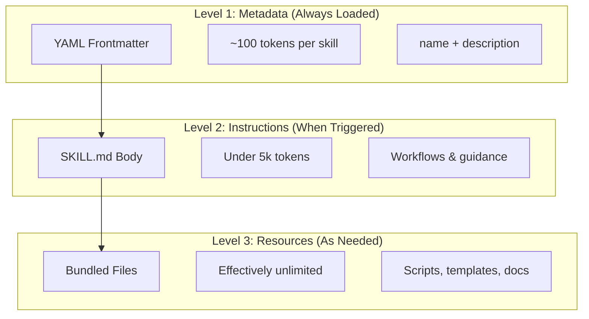
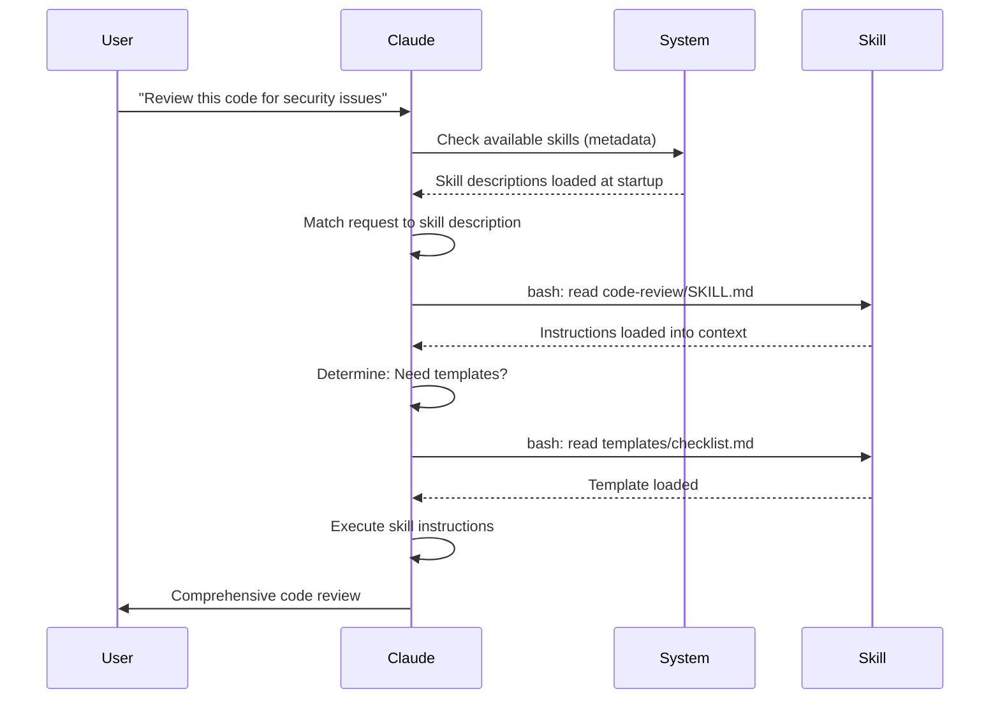

<picture>
  <source media="(prefers-color-scheme: dark)" srcset="../resources/logos/claude-howto-logo-dark.svg">
  
</picture>

> 🟢 **初级** | ⏱ 40 分钟
>
> ✅ 已验证适配 Claude Code **v2.1.92** · 最后验证日期：2026-04-05

**你将构建什么：** 为 Claude 创建可复用、自动调用的能力。

# Agent Skills 指南

Agent Skills 是基于文件系统的可复用能力，可扩展 Claude 的功能。它们将领域专业知识、工作流和最佳实践封装成可发现的组件，Claude 在相关场景下会自动使用。

## 概览

**Agent Skills** 是模块化能力，可将通用智能体转化为专家。与提示词（针对一次性任务的对话级指令）不同，Skills 按需加载，无需在多次对话中重复提供相同的指导。

### 主要优势

- **专业化 Claude**：针对特定领域任务定制能力
- **减少重复**：一次创建，跨对话自动使用
- **组合能力**：组合 Skills 构建复杂工作流
- **扩展工作流**：跨多个项目和团队复用 Skills
- **保持质量**：将最佳实践直接嵌入工作流

Skills 遵循 [Agent Skills](https://agentskills.io) 开放标准，可在多种 AI 工具间通用。Claude Code 扩展了该标准，增加了调用控制、subagent 执行和动态上下文注入等额外功能。

> **注意**：自定义 slash 命令已合并到 skills 中。`.claude/commands/` 文件仍然有效，并支持相同的 frontmatter 字段。建议新开发使用 Skills。当同一路径同时存在两者时（如 `.claude/commands/review.md` 和 `.claude/skills/review/SKILL.md`），skill 优先。

## Skills 工作原理：渐进式披露

Skills 采用**渐进式披露**架构——Claude 按需分阶段加载信息，而非预先占用上下文。这实现了高效的上下文管理，同时保持无限的可扩展性。

### 三层加载机制



| 层级 | 加载时机 | Token 成本 | 内容 |
|-------|------------|------------|---------|
| **Level 1: Metadata** | 始终（启动时） | 每个 Skill 约 100 tokens | YAML frontmatter 中的 `name` 和 `description` |
| **Level 2: Instructions** | Skill 被触发时 | 低于 5k tokens | SKILL.md 正文中的指令和指导 |
| **Level 3+: Resources** | 按需加载 | 实际上无限制 | 通过 bash 执行的捆绑文件，无需将内容加载到上下文 |

这意味着你可以安装大量 Skills 而不会产生上下文惩罚——Claude 只知道每个 Skill 存在以及何时使用它，直到实际触发前不会加载详细内容。

## Skill 加载流程



## Skill 类型与位置

| 类型 | 位置 | 作用范围 | 可共享 | 最佳用途 |
|------|----------|-------|--------|----------|
| **Enterprise** | Managed settings | 所有组织用户 | 是 | 组织级标准 |
| **Personal** | `~/.claude/skills/<skill-name>/SKILL.md` | 个人 | 否 | 个人工作流 |
| **Project** | `.claude/skills/<skill-name>/SKILL.md` | 团队 | 是（通过 git） | 团队标准 |
| **Plugin** | `<plugin>/skills/<skill-name>/SKILL.md` | 启用位置 | 视情况 | 与 plugins 捆绑 |

当不同层级的 skills 同名时，更高优先级的位置获胜：**enterprise > personal > project**。Plugin skills 使用 `plugin-name:skill-name` 命名空间，因此不会冲突。

### 自动发现

**嵌套目录**：当你处理子目录中的文件时，Claude Code 会自动发现嵌套 `.claude/skills/` 目录中的 skills。例如，如果你正在编辑 `packages/frontend/` 中的文件，Claude Code 也会查找 `packages/frontend/.claude/skills/` 中的 skills。这支持 monorepo 设置中各包拥有自己的 skills。

**`--add-dir` 目录**：通过 `--add-dir` 添加的目录中的 Skills 会自动加载，并具有实时变更检测。对这些目录中 skill 文件的任何编辑都会立即生效，无需重启 Claude Code。

**描述预算**：Skill descriptions（Level 1 metadata）上限为**上下文窗口的 2%**（后备值：**16,000 字符**）。如果你安装了大量 skills，部分可能被排除。运行 `/context` 查看警告。可通过 `SLASH_COMMAND_TOOL_CHAR_BUDGET` 环境变量覆盖预算。

## 创建自定义 Skills

### 基础目录结构

```
my-skill/
├── SKILL.md           # 主要指令（必需）
├── template.md        # Claude 填写的模板
├── examples/
│   └── sample.md      # 展示预期格式的示例输出
└── scripts/
    └── validate.sh    # Claude 可执行的脚本
```

### SKILL.md 格式

```yaml
---
name: your-skill-name
description: 简要描述此 Skill 的功能及何时使用
---

# Your Skill Name

## Instructions
为 Claude 提供清晰的分步指导。

## Examples
展示使用此 Skill 的具体示例。
```

### 必填字段

- **name**：仅小写字母、数字、连字符（最多 64 字符）。不能包含 "anthropic" 或 "claude"。
- **description**：Skill 的功能**以及**何时使用（最多 1024 字符）。这对 Claude 知道何时激活 skill 至关重要。

### 可选 Frontmatter 字段

```yaml
---
name: my-skill
description: What this skill does and when to use it
argument-hint: "[filename] [format]"        # 自动补全提示
disable-model-invocation: true              # 仅用户可调用
user-invocable: false                       # 从 slash 菜单隐藏
allowed-tools: Read, Grep, Glob             # 限制工具访问
model: opus                                 # 使用的特定模型
effort: high                                # 效力级别覆盖 (low, medium, high, max)
context: fork                               # 在隔离 subagent 中运行
agent: Explore                              # agent 类型（配合 context: fork）
shell: bash                                 # 命令 shell: bash（默认）或 powershell
hooks:                                      # Skill 级别的 hooks
  PreToolUse:
    - matcher: "Bash"
      hooks:
        - type: command
          command: "./scripts/validate.sh"
---
```

| 字段 | 描述 |
|-------|-------------|
| `name` | 仅小写字母、数字、连字符（最多 64 字符）。不能包含 "anthropic" 或 "claude"。 |
| `description` | Skill 的功能**以及**何时使用（最多 1024 字符）。对自动调用匹配至关重要。 |
| `argument-hint` | `/` 自动补全菜单中显示的提示（如 `"[filename] [format]"`）。 |
| `disable-model-invocation` | `true` = 仅用户可通过 `/name` 调用。Claude 永不自动调用。 |
| `user-invocable` | `false` = 从 `/` 菜单隐藏。仅 Claude 可自动调用。 |
| `allowed-tools` | skill 可无需权限提示使用的工具列表（逗号分隔）。 |
| `model` | skill 激活时的模型覆盖（如 `opus`, `sonnet`）。 |
| `effort` | skill 激活时的效力级别覆盖：`low`, `medium`, `high`, 或 `max`。 |
| `context` | `fork` 在独立的 subagent 上下文中运行 skill，拥有自己的上下文窗口。 |
| `agent` | 当 `context: fork` 时的 subagent 类型（如 `Explore`, `Plan`, `general-purpose`）。 |
| `shell` | `!`command`` 替换和脚本使用的 shell：`bash`（默认）或 `powershell`。 |
| `hooks` | 限定于此 skill 生命周期的 hooks（格式与全局 hooks 相同）。 |

## Skill 内容类型

Skills 可包含两种类型的内容，各有适用场景：

### 参考内容

添加 Claude 应用于当前工作的知识——约定、模式、风格指南、领域知识。在对话上下文中内联运行。

```yaml
---
name: api-conventions
description: API design patterns for this codebase
---

When writing API endpoints:
- Use RESTful naming conventions
- Return consistent error formats
- Include request validation
```

### 任务内容

针对特定操作的分步指令。通常通过 `/skill-name` 直接调用。

```yaml
---
name: deploy
description: Deploy the application to production
context: fork
disable-model-invocation: true
---

Deploy the application:
1. Run the test suite
2. Build the application
3. Push to the deployment target
```

## 控制 Skill 调用

默认情况下，你和 Claude 都可以调用任何 skill。两个 frontmatter 字段控制三种调用模式：

| Frontmatter | 你可以调用 | Claude 可以调用 |
|---|---|---|
| （默认） | 是 | 是 |
| `disable-model-invocation: true` | 是 | 否 |
| `user-invocable: false` | 否 | 是 |

**使用 `disable-model-invocation: true`** 用于有副作用的工作流：`/commit`, `/deploy`, `/send-slack-message`。你不希望 Claude 因为代码看起来准备好就决定部署。

**使用 `user-invocable: false`** 用于不是可执行命令的后台知识。`legacy-system-context` skill 解释旧系统如何工作——对 Claude 有用，但对用户不是一个有意义的操作。

## 字符串替换

Skills 支持动态值，在 skill 内容到达 Claude 之前解析：

| 变量 | 描述 |
|----------|-------------|
| `$ARGUMENTS` | 调用 skill 时传入的所有参数 |
| `$ARGUMENTS[N]` 或 `$N` | 按索引访问特定参数（从 0 开始） |
| `${CLAUDE_SESSION_ID}` | 当前会话 ID |
| `${CLAUDE_SKILL_DIR}` | 包含 skill 的 SKILL.md 文件的目录 |
| `` !`command` `` | 动态上下文注入 — 运行 shell 命令并内联输出 |

**示例：**

```yaml
---
name: fix-issue
description: Fix a GitHub issue
---

Fix GitHub issue $ARGUMENTS following our coding standards.
1. Read the issue description
2. Implement the fix
3. Write tests
4. Create a commit
```

运行 `/fix-issue 123` 将 `$ARGUMENTS` 替换为 `123`。

## 注入动态上下文

`!`command`` 语法在 skill 内容发送给 Claude 之前运行 shell 命令：

```yaml
---
name: pr-summary
description: Summarize changes in a pull request
context: fork
agent: Explore
---

## Pull request context
- PR diff: !`gh pr diff`
- PR comments: !`gh pr view --comments`
- Changed files: !`gh pr diff --name-only`

## Your task
Summarize this pull request...
```

命令立即执行；Claude 只看到最终输出。默认情况下，命令在 `bash` 中运行。在 frontmatter 中设置 `shell: powershell` 以使用 PowerShell。

## 在 Subagents 中运行 Skills

添加 `context: fork` 在隔离的 subagent 上下文中运行 skill。skill 内容成为具有独立上下文窗口的专用 subagent 的任务，保持主对话整洁。

`agent` 字段指定使用的 agent 类型：

| Agent 类型 | 最佳用途 |
|---|---|
| `Explore` | 只读研究、代码库分析 |
| `Plan` | 创建实现计划 |
| `general-purpose` | 需要所有工具的广泛任务 |
| Custom agents | 配置中定义的专业 agents |

**示例 frontmatter：**

```yaml
---
context: fork
agent: Explore
---
```

**完整 skill 示例：**

```yaml
---
name: deep-research
description: Research a topic thoroughly
context: fork
agent: Explore
---

Research $ARGUMENTS thoroughly:
1. Find relevant files using Glob and Grep
2. Read and analyze the code
3. Summarize findings with specific file references
```

## 实用示例

### 示例 1：代码审查 Skill

**目录结构：**

```
~/.claude/skills/code-review/
├── SKILL.md
├── templates/
│   ├── review-checklist.md
│   └── finding-template.md
└── scripts/
    ├── analyze-metrics.py
    └── compare-complexity.py
```

**文件：** `~/.claude/skills/code-review/SKILL.md`

```yaml
---
name: code-review-specialist
description: Comprehensive code review with security, performance, and quality analysis. Use when users ask to review code, analyze code quality, evaluate pull requests, or mention code review, security analysis, or performance optimization.
---

# Code Review Skill

This skill provides comprehensive code review capabilities focusing on:

1. **Security Analysis**
   - Authentication/authorization issues
   - Data exposure risks
   - Injection vulnerabilities
   - Cryptographic weaknesses

2. **Performance Review**
   - Algorithm efficiency (Big O analysis)
   - Memory optimization
   - Database query optimization
   - Caching opportunities

3. **Code Quality**
   - SOLID principles
   - Design patterns
   - Naming conventions
   - Test coverage

4. **Maintainability**
   - Code readability
   - Function size (should be < 50 lines)
   - Cyclomatic complexity
   - Type safety

## Review Template

For each piece of code reviewed, provide:

### Summary
- Overall quality assessment (1-5)
- Key findings count
- Recommended priority areas

### Critical Issues (if any)
- **Issue**: Clear description
- **Location**: File and line number
- **Impact**: Why this matters
- **Severity**: Critical/High/Medium
- **Fix**: Code example

For detailed checklists, see [templates/review-checklist.md](templates/review-checklist.md).
```

### 示例 2：代码库可视化 Skill

生成交互式 HTML 可视化的 skill：

**目录结构：**

```
~/.claude/skills/codebase-visualizer/
├── SKILL.md
└── scripts/
    └── visualize.py
```

**文件：** `~/.claude/skills/codebase-visualizer/SKILL.md`

```yaml
---
name: codebase-visualizer
description: Generate an interactive collapsible tree visualization of your codebase. Use when exploring a new repo, understanding project structure, or identifying large files.
allowed-tools: Bash(python *)
---

# Codebase Visualizer

Generate an interactive HTML tree view showing your project's file structure.

## Usage

Run the visualization script from your project root:

```bash
python ~/.claude/skills/codebase-visualizer/scripts/visualize.py .
```

This creates `codebase-map.html` and opens it in your default browser.

## What the visualization shows

- **Collapsible directories**: Click folders to expand/collapse
- **File sizes**: Displayed next to each file
- **Colors**: Different colors for different file types
- **Directory totals**: Shows aggregate size of each folder
```

捆绑的 Python 脚本完成繁重工作，Claude 负责编排。

### 示例 3：部署 Skill（仅用户调用）

```yaml
---
name: deploy
description: Deploy the application to production
disable-model-invocation: true
allowed-tools: Bash(npm *), Bash(git *)
---

Deploy $ARGUMENTS to production:

1. Run the test suite: `npm test`
2. Build the application: `npm run build`
3. Push to the deployment target
4. Verify the deployment succeeded
5. Report deployment status
```

### 示例 4：品牌语调 Skill（后台知识）

```yaml
---
name: brand-voice
description: Ensure all communication matches brand voice and tone guidelines. Use when creating marketing copy, customer communications, or public-facing content.
user-invocable: false
---

## Tone of Voice
- **Friendly but professional** - approachable without being casual
- **Clear and concise** - avoid jargon
- **Confident** - we know what we're doing
- **Empathetic** - understand user needs

## Writing Guidelines
- Use "you" when addressing readers
- Use active voice
- Keep sentences under 20 words
- Start with value proposition

For templates, see [templates/](templates/).
```

### 示例 5：CLAUDE.md 生成器 Skill

```yaml
---
name: claude-md
description: Create or update CLAUDE.md files following best practices for optimal AI agent onboarding. Use when users mention CLAUDE.md, project documentation, or AI onboarding.
---

## Core Principles

**LLMs are stateless**: CLAUDE.md is the only file automatically included in every conversation.

### The Golden Rules

1. **Less is More**: Keep under 300 lines (ideally under 100)
2. **Universal Applicability**: Only include information relevant to EVERY session
3. **Don't Use Claude as a Linter**: Use deterministic tools instead
4. **Never Auto-Generate**: Craft it manually with careful consideration

## Essential Sections

- **Project Name**: Brief one-line description
- **Tech Stack**: Primary language, frameworks, database
- **Development Commands**: Install, test, build commands
- **Critical Conventions**: Only non-obvious, high-impact conventions
- **Known Issues / Gotchas**: Things that trip up developers
```

### 示例 6：带脚本的重构 Skill

**目录结构：**

```
refactor/
├── SKILL.md
├── references/
│   ├── code-smells.md
│   └── refactoring-catalog.md
├── templates/
│   └── refactoring-plan.md
└── scripts/
    ├── analyze-complexity.py
    └etect-smells.py
```

**文件：** `refactor/SKILL.md`

```yaml
---
name: code-refactor
description: Systematic code refactoring based on Martin Fowler's methodology. Use when users ask to refactor code, improve code structure, reduce technical debt, or eliminate code smells.
---

# Code Refactoring Skill

A phased approach emphasizing safe, incremental changes backed by tests.

## Workflow

Phase 1: Research & Analysis → Phase 2: Test Coverage Assessment →
Phase 3: Code Smell Identification → Phase 4: Refactoring Plan Creation →
Phase 5: Incremental Implementation → Phase 6: Review & Iteration

## Core Principles

1. **Behavior Preservation**: External behavior must remain unchanged
2. **Small Steps**: Make tiny, testable changes
3. **Test-Driven**: Tests are the safety net
4. **Continuous**: Refactoring is ongoing, not a one-time event

For code smell catalog, see [references/code-smells.md](references/code-smells.md).
For refactoring techniques, see [references/refactoring-catalog.md](references/refactoring-catalog.md).
```

## 支持文件

Skills 可以在其目录中包含 `SKILL.md`之外的多个文件。这些支持文件（模板、示例、脚本、参考文档）让你保持主 skill 文件聚焦，同时为 Claude 提供可按需加载的额外资源。

```
my-skill/
├── SKILL.md              # 主要指令（必需，保持低于 500 行）
├── templates/            # Claude 填写的模板
│   └── output-format.md
├── examples/             # 展示预期格式的示例输出
│   └── sample-output.md
├── references/           # 领域知识和规范
│   └── api-spec.md
└── scripts/              # Claude 可执行的脚本
    └── validate.sh
```

支持文件指南：

- 保持 `SKILL.md` 低于 **500 行**。将详细参考材料、大型示例和规范移至单独文件。
- 使用**相对路径**从 `SKILL.md` 引用额外文件（如 `[API reference](references/api-spec.md)`）。
- 支持文件在 Level 3（按需）加载，因此直到 Claude 实际读取它们之前不会消耗上下文。

## 管理 Skills

### 查看可用 Skills

直接询问 Claude：
```
What Skills are available?
```

或检查文件系统：
```bash
# 列出个人 Skills
ls ~/.claude/skills/

# 列出项目 Skills
ls .claude/skills/
```

### 测试 Skill

两种测试方式：

**让 Claude 自动调用**，通过请求匹配描述的内容：
```
Can you help me review this code for security issues?
```

**或直接调用**，使用 skill 名称：
```
/code-review src/auth/login.ts
```

### 更新 Skill

直接编辑 `SKILL.md` 文件。更改在下次 Claude Code 启动时生效。

```bash
# 个人 Skill
code ~/.claude/skills/my-skill/SKILL.md

# 项目 Skill
code .claude/skills/my-skill/SKILL.md
```

### 限制 Claude 的 Skill 访问

三种方式控制 Claude 可调用的 skills：

**在 `/permissions` 中禁用所有 skills**：
```
# Add to deny rules:
Skill
```

**允许或拒绝特定 skills**：
```
# Allow only specific skills
Skill(commit)
Skill(review-pr *)

# Deny specific skills
Skill(deploy *)
```

**隐藏单个 skills**，通过在其 frontmatter 中添加 `disable-model-invocation: true`。

## 立即尝试

### 🎯 练习 1：创建你的第一个 Skill

构建一个 `/hello` skill，用于问候团队成员：

**步骤 1：创建 skill 目录**
```bash
mkdir -p .claude/skills/hello
```

**步骤 2：创建 SKILL.md**
```markdown
---
name: hello
description: Greet team members. Use when user says hello or starts a session.
---

# Hello Skill

Greet the user with:
1. Current date and time
2. Quick project status (branch, recent commits)
3. Ask what they'd like to work on

Be warm but concise.
```

**步骤 3：测试**
```bash
# In Claude Code:
/hello

# Or just type "hello" and Claude should auto-invoke
```

### 🎯 练习 2：带动态上下文的 Skill

使用 shell 命令创建 `/status` skill：

```markdown
---
name: status
description: Show comprehensive project status. Use when user asks about project health or status.
allowed-tools: Bash(git *), Bash(npm *), Read
---

# Project Status

## Git Context
- Branch: !`git branch --show-current`
- Changes: !`git status --short | head -10`
- Recent: !`git log --oneline -5`

## Package Info
- Version: !`node -e "console.log(require('./package.json').version)" 2>/dev/null || echo "N/A"`
- Dependencies: !`npm ls --depth=0 2>/dev/null | head -15 || echo "Run npm install first"`

## Summary
Provide a brief health report with recommendations.
```

**测试：**
```bash
/status
```

### 🎯 练习 3：带参数的 Skill

创建一个接受 issue 编号的 `/fix-issue` skill：

```markdown
---
name: fix-issue
description: Fix a GitHub issue by number. Use when user mentions fixing an issue.
argument-hint: issue-number
allowed-tools: Bash(git *), Bash(gh *), Read, Edit, Write
---

# Fix Issue #$ARGUMENTS

## Steps

1. **Fetch Issue Details**
   - Title and description from GitHub
   - Labels and priority
   - Related files based on issue context

2. **Analyze Codebase**
   - Find relevant files
   - Understand current implementation
   - Identify root cause

3. **Implement Fix**
   - Make minimal, focused changes
   - Add/update tests
   - Follow project conventions from CLAUDE.md

4. **Verify**
   - Tests pass
   - Fix addresses the issue
   - No side effects

5. **Commit**
   - Reference issue in commit message
   - Include co-authorship if collaborative

## Output Format
Report: issue title, changes made, tests added, verification results
```

**测试：**
```bash
/fix-issue 123
```

### 🎯 练习 4：多文件 Skill 目录

创建完整的 `/review` skill 及支持文件：

**目录结构：**
```bash
mkdir -p .claude/skills/review
touch .claude/skills/review/SKILL.md
touch .claude/skills/review/checklist.md
touch .claude/skills/review/template.md
```

**SKILL.md：**
```markdown
---
name: review
description: Comprehensive code review. Use before commits or PRs.
allowed-tools: Read, Grep, Glob, Bash(git *)
---

# Code Review

Load checklist: @checklist.md

## Current Changes
!`git diff HEAD`

## Review Process
1. Load each changed file
2. Check against checklist items
3. Note issues by severity (CRITICAL, HIGH, MEDIUM, LOW)
4. Provide actionable recommendations

## Output Template
Use: @template.md
```

**checklist.md：**
```markdown
# Review Checklist

## Security
- [ ] No hardcoded secrets
- [ ] Input validation present
- [ ] Proper error handling
- [ ] No SQL injection risks

## Quality
- [ ] Functions < 50 lines
- [ ] Files < 800 lines
- [ ] No deep nesting (>4 levels)
- [ ] Clear naming

## Performance
- [ ] No N+1 queries
- [ ] Efficient algorithms
- [ ] No memory leaks

## Testing
- [ ] Tests for new code
- [ ] Edge cases covered
- [ ] Mocks properly configured
```

**template.md：**
```markdown
# Review Report

## Files Reviewed
- List each file with severity summary

## Issues Found

| Severity | File | Line | Issue | Fix |
|----------|------|------|-------|-----|

## Summary
- Critical issues: X (must fix)
- High issues: Y (should fix)  
- Medium issues: Z (consider)
- Low issues: W (optional)

## Recommendation
[Approve / Block / Warn]
```

**测试：**
```bash
/review
```

### 🎯 练习 5：仅用户 Skill（无自动调用）

创建一个 Claude 不应自动触发的 `/deploy` skill：

```markdown
---
name: deploy
description: Deploy to production. Only invoke when user explicitly requests deploy.
disable-model-invocation: true
allowed-tools: Bash(npm *), Bash(git *)
---

# Deploy to Production

## Pre-flight Checks
1. Tests passing: !`npm test 2>&1 | tail -5`
2. Build succeeds: !`npm run build 2>&1 | tail -5`
3. No uncommitted changes: !`git status --short`

## Deploy Steps
1. Tag release: !`git tag -a v!`node -e "console.log(require('./package.json').version)"` -m "Release"`
2. Push tag: git push origin --tags
3. Trigger CI: npm run deploy:trigger

## Post-deploy
1. Verify health: curl health endpoint
2. Notify team: post to Slack

## Rollback Plan
If deployment fails:
- Revert to previous tag
- Run rollback script
- Notify team immediately
```

**测试（仅在显式调用时有效）：**
```bash
/deploy

# Claude will NOT auto-invoke this even if you say "let's deploy"
# It requires explicit /deploy command
```

## 最佳实践

### 1. 使描述具体化

- **差（模糊）**："Helps with documents"
- **好（具体）**："Extract text and tables from PDF files, fill forms, merge documents. Use when working with PDF files or when the user mentions PDFs, forms, or document extraction."

### 2. 保持 Skills 聚焦

- 一个 Skill = 一个能力
- ✅ "PDF form filling"
- ❌ "Document processing"（太宽泛）

### 3. 包含触发术语

在描述中添加匹配用户请求的关键词：
```yaml
description: Analyze Excel spreadsheets, generate pivot tables, create charts. Use when working with Excel files, spreadsheets, or .xlsx files.
```

### 4. 保持 SKILL.md 低于 500 行

将详细参考材料移至 Claude 按需加载的单独文件。

### 5. 引用支持文件

```markdown
## Additional resources

- For complete API details, see [reference.md](reference.md)
- For usage examples, see [examples.md](examples.md)
```

### 应做的

- 使用清晰、描述性的名称
- 包含全面的指令
- 添加具体示例
- 打包相关脚本和模板
- 用真实场景测试
- 记录依赖

### 不应做的

- 不要为一次性任务创建 skills
- 不要复制现有功能
- 不要让 skills 太宽泛
- 不要跳过 description 字段
- 不要在未审计的情况下安装来自不可信来源的 skills

## 故障排除

### 快速参考

| 问题 | 解决方案 |
|-------|----------|
| Claude 不使用 Skill | 使描述更具体，添加触发术语 |
| Skill 文件未找到 | 验证路径：`~/.claude/skills/name/SKILL.md` |
| YAML 错误 | 检查 `---` 标记、缩进、无制表符 |
| Skills 冲突 | 在描述中使用不同的触发术语 |
| 脚本未运行 | 检查权限：`chmod +x scripts/*.py` |
| Claude 未看到所有 skills | skills 过多；运行 `/context` 查看警告 |

### Skill 未触发

如果 Claude 在预期时未使用你的 skill：

1. 检查描述是否包含用户自然会说出的关键词
2. 验证询问 "What skills are available?" 时 skill 是否出现
3. 尝试重述请求以匹配描述
4. 直接调用 `/skill-name` 测试

### Skill 触发过于频繁

如果 Claude 在你不希望时使用你的 skill：

1. 使描述更具体
2. 添加 `disable-model-invocation: true` 仅允许手动调用

### Claude 未看到所有 Skills

Skill descriptions 加载上限为**上下文窗口的 2%**（后备值：**16,000 字符**）。运行 `/context` 检查关于被排除 skills 的警告。可通过 `SLASH_COMMAND_TOOL_CHAR_BUDGET` 环境变量覆盖预算。

## 安全考量

**仅使用来自可信来源的 Skills。** Skills 通过指令和代码为 Claude 提供能力——恶意 Skill 可引导 Claude 以有害方式调用工具或执行代码。

**关键安全考量：**

- **彻底审计**：审查 Skill 目录中的所有文件
- **外部来源有风险**：从外部 URL 获取内容的 Skills 可能被入侵
- **工具滥用**：恶意 Skills 可能有害地调用工具
- **像安装软件一样对待**：仅使用来自可信来源的 Skills

## Skills 与其他功能对比

| 功能 | 调用方式 | 最佳用途 |
|---------|------------|----------|
| **Skills** | 自动或 `/name` | 可复用专业知识、工作流 |
| **Slash Commands** | 用户发起 `/name` | 快捷方式（已合并到 skills） |
| **Subagents** | 自动委托 | 隔离任务执行 |
| **Memory (CLAUDE.md)** | 始终加载 | 持久项目上下文 |
| **MCP** | 实时 | 外部数据/服务访问 |
| **Hooks** | 事件驱动 | 自动副作用 |

## 内置 Skills

Claude Code 附带几个内置 skills，无需安装即可使用：

| Skill | 描述 |
|-------|-------------|
| `/simplify` | 审查变更文件的重用、质量和效率；启动 3 个并行审查 agents |
| `/batch <instruction>` | 使用 git worktrees 在代码库中编排大规模并行变更 |
| `/debug [description]` | 通过读取调试日志排查当前会话 |
| `/loop [interval] <prompt>` | 按间隔重复运行提示（如 `/loop 5m check the deploy`） |
| `/claude-api` | 加载 Claude API/SDK 参考；在 `anthropic`/`@anthropic-ai/sdk` 导入时自动激活 |

这些 skills 开箱即用，无需安装或配置。它们遵循与自定义 skills 相同的 SKILL.md 格式。

## 分享 Skills

### 项目 Skills（团队共享）

1. 在 `.claude/skills/` 中创建 Skill
2. 提交到 git
3. 团队成员拉取变更 — Skills 立即可用

### 个人 Skills

```bash
# 复制到个人目录
cp -r my-skill ~/.claude/skills/

# 使脚本可执行
chmod +x ~/.claude/skills/my-skill/scripts/*.py
```

### Plugin 分发

将 skills 打包在 plugin 的 `skills/` 目录中以进行更广泛的分发。

## 进阶：Skill 收集与 Skill 管理器

当你开始认真构建 skills 时，两件事变得必不可少：经过验证的 skills 库和管理它们的工具。

**[luongnv89/skills](https://github.com/luongnv89/skills)** — 我在几乎所有项目中日常使用的 skills 收集。亮点包括 `logo-designer`（即时生成项目 logo）和 `ollama-optimizer`（根据你的硬件调优本地 LLM 性能）。如果你想要即用型 skills，这是个很好的起点。

**[luongnv89/asm](https://github.com/luongnv89/asm)** — Agent Skill Manager。处理 skill 开发、重复检测和测试。`asm link` 命令让你可以在任何项目中测试 skill，无需复制文件——一旦你有超过几个 skills，这必不可少。

## 更多资源

- [官方 Skills 文档](https://code.claude.com/docs/en/skills)
- [Agent Skills 架构博客](https://claude.com/blog/equipping-agents-for-the-real-world-with-agent-skills)
- [Skills 仓库](https://github.com/luongnv89/skills) - 即用型 skills 收集
- [Slash Commands 指南](../01-slash-commands/) - 用户发起快捷方式
- [Subagents 指南](../04-subagents/) - 委托 AI agents
- [Memory 指南](../02-memory/) - 持久上下文
- [MCP (Model Context Protocol)](../05-mcp/) - 实时外部数据
- [Hooks 指南](../06-hooks/) - 事件驱动自动化