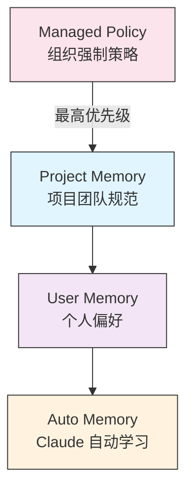
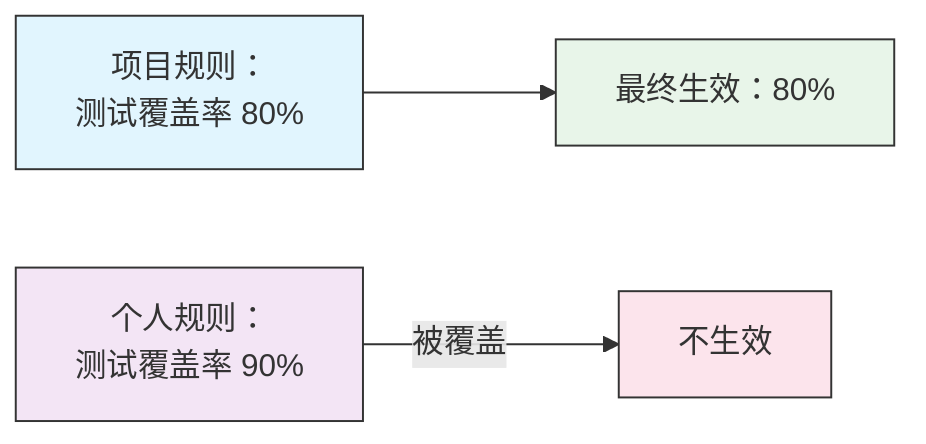
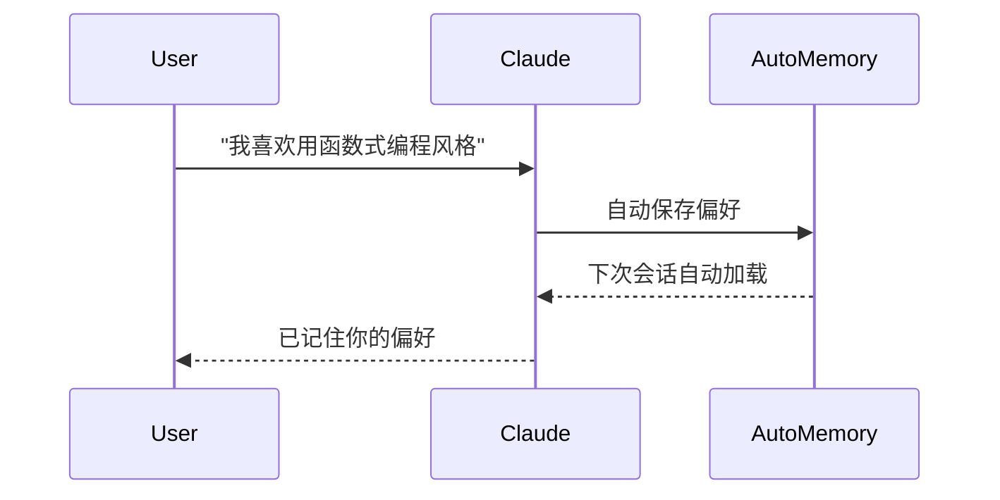

<picture>
  <source media="(prefers-color-scheme: dark)" srcset="../resources/logos/claude-howto-logo-dark.svg">
  
</picture>

> 🟢 **初级** | ⏱ 45 分钟
>
> ✅ 已验证 Claude Code **v2.1.92** · 最后验证：2026-04-06

**你将学到：** 设置持久化上下文，让 Claude 跨会话记住项目规范和个人偏好。

---

# Memory 指南

## 为什么需要这个？

学完上一章的 Slash Commands 后，你可能已经习惯了用 `/compact` 压缩对话、用 `/cost` 查看消耗。但每次新开一个 Claude Code 会话，Claude 对你的项目一无所知。

你心里在想：

> **"我希望 Claude 记住我的项目规范，不要再每次从头解释。"**

这正是 Memory 系统解决的问题。它让 Claude 跨会话保持上下文，就像你给新同事写了一份《项目入职手册》。

---

## 核心概念：三层 Memory 结构

Claude Code 的 Memory 系统像一个三层金字塔，从上到下优先级降低：



### 三层对比

| 层级 | 存储位置 | 作用域 | 提交 Git | 适用场景 |
|------|----------|--------|----------|----------|
| **Project Memory** | `./CLAUDE.md` | 当前项目 | ✅ 建议提交 | 团队共享规范 |
| **User Memory** | `~/.claude/CLAUDE.md` | 所有项目 | ❌ 个人文件 | 你的个人偏好 |
| **Auto Memory** | `~/.claude/projects/.../memory/` | 当前项目 | ❌ 自动管理 | Claude 自动记录 |

> **关键原则**：CLAUDE.md 应是"护栏"（guardrails），不是"手册"（manual）。
> 只写 Claude 自己无法知道的约束，不要写它能自己发现的代码结构。

---

## 场景 1：项目 CLAUDE.md — 团队共享规范

**场景**：你是团队负责人，想让所有成员用 Claude Code 时遵循相同的开发规范。

### 创建项目 Memory

**步骤 1：初始化**

在项目根目录运行：

```bash
/init
```

Claude 会分析项目结构，生成基础模板。

**步骤 2：补充关键约束**

编辑生成的 `CLAUDE.md`，添加团队特有的约束：

```markdown
# 项目规范

## 约束（Claude 无法自己发现的）
- 不要修改 src/legacy/ 目录，那是即将废弃的旧代码
- 所有 API 端点必须使用 Zod 进行输入验证
- 数据库迁移只能使用 Prisma Migrate，禁止手动 SQL
- 测试覆盖率要求 80% 以上，CI 会检查

## 风格偏好
- 使用函数式组件和 hooks，不用类组件
- 错误处理使用 Result 模式，不要 throw
- API 响应必须包含 requestId 字段用于追踪

## 常用命令
| 命令 | 用途 |
|---------|---------|
| `npm run dev` | 启动开发服务器 |
| `npm test` | 运行测试（提交前必须通过） |
| `npm run db:migrate` | 执行数据库迁移 |
```

**步骤 3：提交到 Git**

```bash
git add CLAUDE.md
git commit -m "docs: 添加项目 CLAUDE.md 配置"
git push
```

团队成员拉取代码后，Claude 自动加载这些规范。

### 使用 `@` 导入现有文档

避免重复内容，用 `@` 语法引用现有文档：

```markdown
## 架构设计
详见 @docs/architecture.md

## API 标准
详见 @docs/api-standards.md

## 部署流程
详见 @DEPLOYMENT.md
```

导入规则：
- 支持相对路径和绝对路径（`@~/.claude/my-rules.md`）
- 递归导入最大深度 5 级
- 在代码块中不会被解析（可以安全地在示例中使用）

---

## 场景 2：个人 CLAUDE.md — 你的偏好跨项目共享

**场景**：你有自己的编码习惯，希望所有项目都遵循，不想在每个项目中重复配置。

### 创建个人 Memory

```bash
# 创建目录（如果不存在）
mkdir -p ~/.claude

# 创建文件
touch ~/.claude/CLAUDE.md
```

编辑内容，写你的个人偏好：

```markdown
# 我的开发偏好

## 关于我
- 经验：8 年全栈开发
- 偏好语言：TypeScript、Python
- 沟通风格：直接，用示例解释

## 代码偏好
- 倾向函数式编程风格
- 使用 TypeScript 严格模式
- 保持函数少于 50 行
- 注释用中文（团队项目遵循团队约定）

## 调试习惯
- 用带前缀的 console.log：`[DEBUG]`
- 包含上下文：函数名、关键变量
- 始终包含时间戳

## 沟通偏好
- 用图表解释复杂概念
- 先展示代码，再解释理论
- 最后总结关键点
```

### 与项目 Memory 的关系

个人 Memory 在所有项目中生效，但项目 Memory 会**覆盖**冲突的个人规则：



> **Tip**：把通用偏好放在个人 Memory，项目特定约束放在项目 Memory。

---

## 场景 3：对话中快速添加规则

**场景**：正在开发中，发现了一条新规则想保存，不想中断工作流去编辑文件。

### 方法 1：`#` 快捷语法

在对话中输入以 `#` 开头的消息：

```markdown
# 提交前始终运行 npm test
```

Claude 会询问保存到哪个 memory 文件：

```
Claude：我将此规则保存到 memory。应使用哪个 memory 文件？
       1. 项目 memory (./CLAUDE.md)
       2. 个人 memory (~/.claude/CLAUDE.md)
```

选择后，规则自动追加到文件末尾。

### 方法 2：显式声明

```markdown
# new rule into memory
所有 async 函数必须用 try-catch 包裹
记录错误时包含堆栈信息
```

或使用自然语言：

```markdown
# remember this
处理用户输入时，先用 Zod schema 验证
返回 400 状态码和详细的验证错误
```

### 方法 3：用 `/memory` 编辑器

当需要大量修改时：

```bash
/memory
```

Claude 会打开系统编辑器，显示所有可编辑的 memory 文件选项：

```
1. Managed Policy Memory
2. Project Memory (./CLAUDE.md)
3. User Memory (~/.claude/CLAUDE.md)
4. Local Project Memory
```

选择后，编辑器打开文件，修改保存即可。

---

## 模块化 Rules：按路径组织规则

**场景**：你的项目有多个子模块，每个模块有独立的规则。

### 创建 Rules 目录结构

```
your-project/
├── CLAUDE.md              # 主 memory 文件
└── .claude/
    └── rules/
        ├── security.md    # 全局安全规则
        ├── testing.md     # 全局测试规则
        └── api/
            ├── conventions.md    # API 子模块规则
            └── validation.md     # API 验证规则
```

### 使用 Frontmatter 定义路径作用域

```markdown
---
paths: src/api/**/*.ts
---

# API 开发规则

- 所有 API 端点必须包含输入验证
- 使用 Zod 进行 schema 验证
- 文档化所有参数和响应类型
- 为所有操作包含错误处理
```

Glob 模式示例：
- `**/*.ts` — 所有 TypeScript 文件
- `src/**/*` — src/ 下的所有文件
- `{src,lib}/**/*.ts` — 多个目录

---

## Auto Memory：Claude 的自动学习

**场景**：你希望 Claude 记住你在对话中表达的偏好，不用每次重复说。

### Auto Memory 工作原理

Auto Memory 位于 `~/.claude/projects/<project>/memory/`，由 Claude 自动管理：



### 目录结构

```
~/.claude/projects/<project>/memory/
├── MEMORY.md              # 入口文件（启动时加载前 200 行）
├── debugging.md           # 主题文件（按需加载）
├── api-conventions.md     # 主题文件
└── testing-patterns.md    # 主题文件
```

### 控制 Auto Memory

```bash
# 禁用 auto memory
CLAUDE_CODE_DISABLE_AUTO_MEMORY=1 claude

# 强制启用 auto memory
CLAUDE_CODE_DISABLE_AUTO_MEMORY=0 claude
```

> **Note**：Auto Memory 需要 Claude Code v2.1.59+ 版本。

---

## 🎯 Try It Now

### 练习 1：创建你的第一个项目 Memory

```bash
# 1. 导航到你的项目
cd /path/to/your/project

# 2. 运行初始化
/init

# 3. 测试是否生效
# 在 Claude Code 中问："你对这个项目了解什么？"
```

Claude 应引用你的 CLAUDE.md 内容。

### 练习 2：快速添加一条规则

在 Claude Code 对话中输入：

```markdown
# 始终使用 async/await 而非 promise 链
```

选择保存到项目 memory，然后验证：

```bash
/memory
# 选择项目 memory 查看内容
```

### 练习 3：创建个人偏好文件

```bash
# 创建个人 memory
mkdir -p ~/.claude
cat > ~/.claude/CLAUDE.md << 'EOF'
# 我的偏好

## 代码风格
- 函数少于 50 行
- 使用 TypeScript 严格模式
- 注释用中文

## 沟通偏好
- 用示例解释
- 先展示后解释
EOF

# 验证生效
# 在任意项目中问 Claude："我的代码风格偏好是什么？"
```

---

## Memory 命令速查表

| 命令 | 用途 | 使用方式 |
|---------|---------|-------|
| `/init` | 初始化项目 memory | `/init` |
| `/memory` | 打开编辑器编辑 memory | `/memory` |
| `#` prefix | 快速添加规则到 memory | `# 你的规则` |
| `# new rule into memory` | 显式声明添加规则 | `# new rule into memory`<br/>规则内容 |
| `# remember this` | 自然语言添加规则 | `# remember this`<br/>偏好内容 |
| `@path/to/file` | 导入外部文档 | `@README.md` |

---

## 常见问题

### Q1：Memory 不生效怎么办？

**检查步骤**：

1. 确认文件位置正确：
   ```bash
   ls ./CLAUDE.md         # 项目 memory
   ls ~/.claude/CLAUDE.md # 个人 memory
   ```

2. 在 Claude Code 中运行 `/memory` 查看加载状态

3. 检查是否在 `claudeMdExcludes` 中被排除：
   ```bash
   cat .claude/settings.json | grep claudeMdExcludes
   ```

### Q2：规则被 Claude 忽略？

**可能原因**：

- 规则太模糊（如"遵循最佳实践"）
- 与其他 memory 文件冲突
- YAML frontmatter paths 配置错误

**解决方案**：使用具体指令：

```markdown
❌ 避免："遵循最佳实践"
✅ 推荐："使用 Zod 验证所有用户输入，返回 400 和验证错误"
```

### Q3：导入文件失败？

**检查清单**：

- 文件路径是否存在：`ls docs/architecture.md`
- 导入语法正确：`@docs/architecture.md` 或 `@~/.claude/config.md`
- 避免循环导入（A 导入 B，B 又导入 A）
- 递归深度不超过 5 级

### Q4：CLAUDE.md 应该写多长？

**原则**：约 2500 tokens，只写关键约束。

| 该写 ✅ | 不该写 ❌ |
|---------|----------|
| Claude 无法自己发现的约束 | 项目基本结构（它能自己看） |
| 容易犯的错误和注意事项 | 框架基本用法（它已经知道） |
| 项目特有的约定和规范 | 通用编程最佳实践 |
| 为什么某个决策这样做 | 大段代码示例 |

### Q5：团队成员如何同步 Memory？

项目 memory 提交到 Git 后：

```bash
# 其他成员拉取
git pull

# 下次启动 Claude Code 时自动加载
```

个人 memory 不提交 Git，各自维护。

---

## 反模式与避坑指南

### 反模式 1：@引用大文档

```markdown
❌ 错误：
参考这个 200 页的设计文档 → @design-doc.pdf
→ 大文档消耗大量上下文
→ Claude 反而更难找到关键信息

✅ 正确：
从文档中提取关键部分：
"架构要点：微服务架构，gRPC 通信，PostgreSQL + Redis 缓存"
```

### 反模式 2：只写"永远不要做 X"

```markdown
❌ 错误：
"永远不要删除文件"
→ 没有说明为什么
→ Claude 可能在不同上下文中误判

✅ 正确：
"不要删除 src/data/ 下的文件，因为它们是手动维护的种子数据，
删除后需要从生产环境重新导出"
```

### 反模式 3：过度详细的规范

```markdown
❌ 错误：
列出所有函数、变量名、文件位置...
→ Claude 能自己发现这些
→ 浪费 token 且信息会过时

✅ 正确：
只写 Claude 需要知道的约束：
"API 响应必须包含 requestId 字段用于追踪"
```

---

## Memory 层级完整参考

| 位置 | 作用域 | 优先级 | 提交 Git | 最适用于 |
|----------|-------|----------|--------|----------|
| Managed Policy | 组织强制策略 | 1（最高） | ❌ 系统管理 | 企业安全合规 |
| Project Memory (`./CLAUDE.md`) | 项目团队 | 2 | ✅ 建议 | 团队共享规范 |
| Project Rules (`./.claude/rules/`) | 项目路径特定 | 3 | ✅ 建议 | 子模块规则 |
| User Memory (`~/.claude/CLAUDE.md`) | 个人所有项目 | 4 | ❌ 个人 | 个人偏好 |
| User Rules (`~/.claude/rules/`) | 个人所有项目 | 5 | ❌ 个人 | 个人规则 |
| Auto Memory | 项目自动学习 | 最低 | ❌ 自动 | Claude 自动记录 |

---

## 下一章预告

现在你已经能让 Claude 记住项目规范和个人偏好了。但你可能还有另一个想法：

> **"有些任务我经常重复做，能不能保存成模板？"**

这正是下一章 [Skills](../05-skills/) 要解决的问题。Skills 让你把重复的工作流程打包成可复用的模板，用 `/command-name` 一键调用。

---

## 相关资源

- [官方 Memory 文档](https://code.claude.com/docs/en/memory) — Anthropic 完整参考
- [Slash Commands](../01-slash-commands/) — 会话快捷命令
- [Skills](../05-skills/) — 可复用任务模板

---
**Last Updated**: April 2026
**Claude Code Version**: 2.1.92+
**Compatible Models**: Claude Sonnet 4.6, Claude Opus 4.6, Claude Haiku 4.5