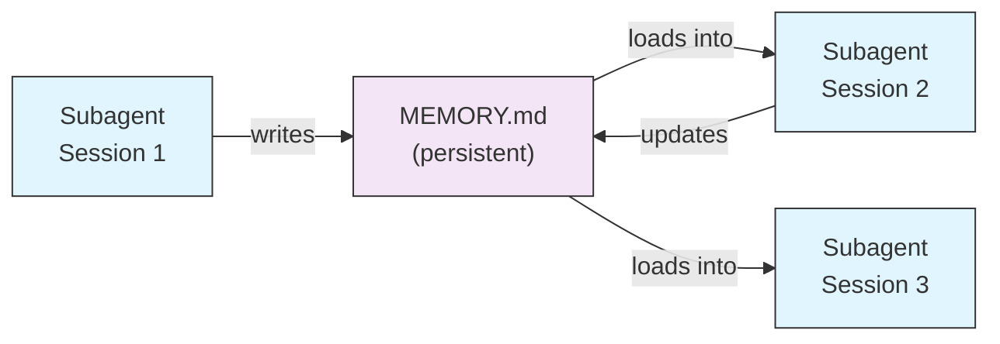
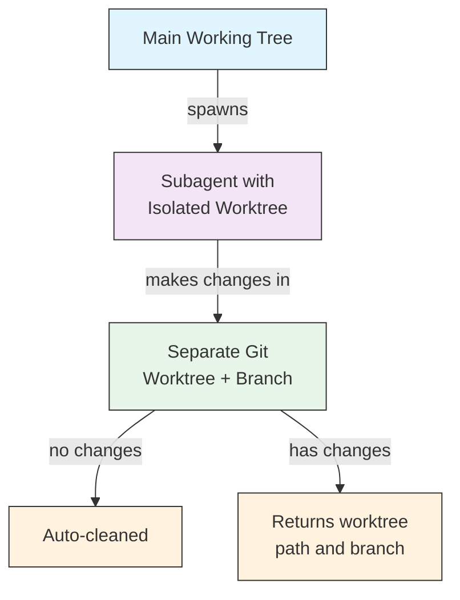
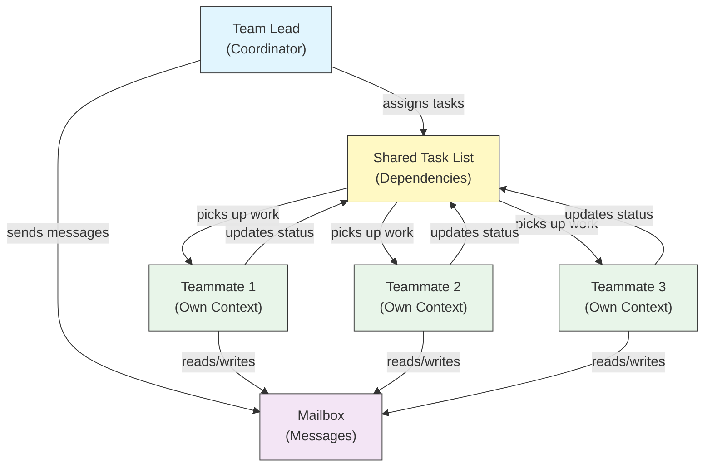
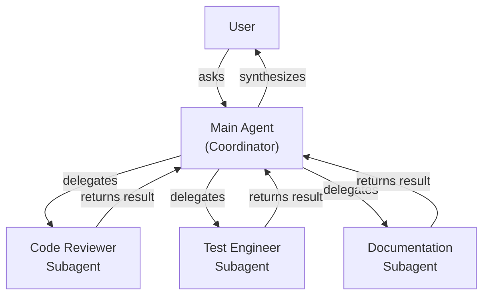
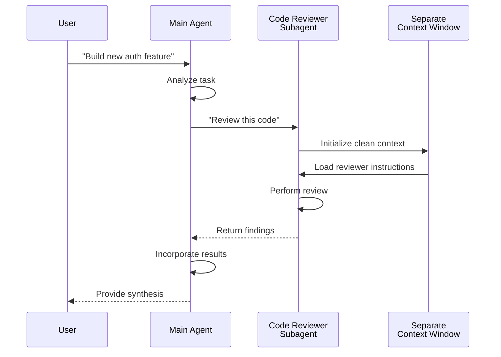
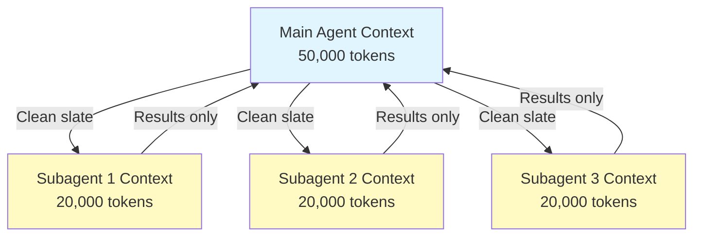
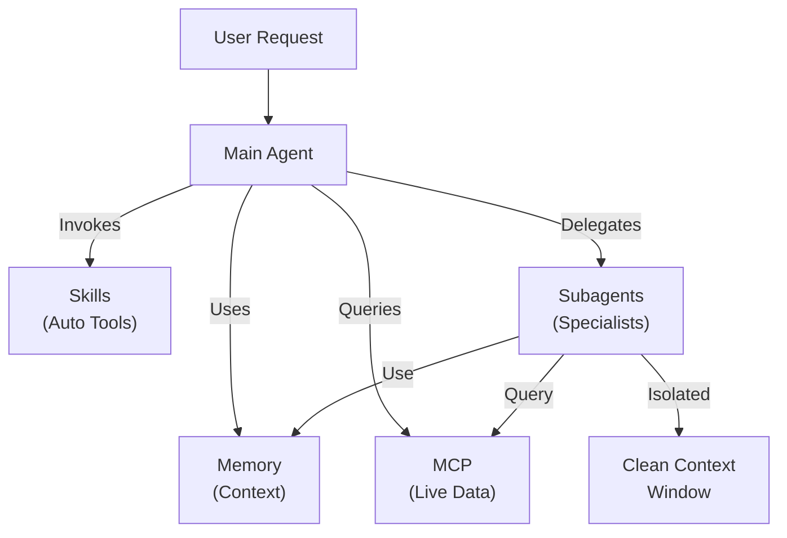

<picture>
  <source media="(prefers-color-scheme: dark)" srcset="../resources/logos/claude-howto-logo-dark.svg">
  
</picture>

> 🟡 **中级** | ⏱ 60 分钟
>
> ✅ 已验证于 Claude Code **v2.1.92** · 最后验证日期：2026-04-05

**你将构建：** 将任务委托给专业 AI 助手。

# Subagents - 完整参考指南

Subagents 是 Claude Code 可以将任务委托给的专业 AI 助手。每个 subagent 有特定用途，使用独立于主对话的上下文窗口，并可配置特定工具和自定义系统提示。

## 目录

1. [概述](#概述)
2. [核心优势](#核心优势)
3. [文件位置](#文件位置)
4. [配置](#配置)
5. [内置 Subagents](#内置-subagents)
6. [管理 Subagents](#管理-subagents)
7. [使用 Subagents](#使用-subagents)
8. [可恢复 Agents](#可恢复-agents)
9. [链式 Subagents](#链式-subagents)
10. [Subagents 持久化内存](#subagents-持久化内存)
11. [后台 Subagents](#后台-subagents)
12. [Worktree 隔离](#worktree-隔离)
13. [限制可生成的 Subagents](#限制可生成的-subagents)
14. [`claude agents` CLI 命令](#claude-agents-cli-命令)
15. [Agent Teams（实验性）](#agent-teams实验性)
16. [插件 Subagent 安全](#插件-subagent-安全)
17. [架构](#架构)
18. [上下文管理](#上下文管理)
19. [何时使用 Subagents](#何时使用-subagents)
20. [最佳实践](#最佳实践)
21. [本文件夹中的示例 Subagents](#本文件夹中的示例-subagents)
22. [安装说明](#安装说明)
23. [相关概念](#相关概念)

---

## 概述

Subagents 通过以下方式在 Claude Code 中实现委托任务执行：

- 创建**隔离的 AI 助手**，拥有独立的上下文窗口
- 提供**自定义系统提示**以获得专业特长
- 实施**工具访问控制**以限制能力
- 防止复杂任务造成的**上下文污染**
- 实现多个专业任务的**并行执行**

每个 subagent 独立运行，从干净的状态开始，仅接收其任务所需的特定上下文，然后将结果返回给主 agent 进行整合。

**快速开始**：使用 `/agents` 命令交互式地创建、查看、编辑和管理你的 subagents。

---

## 核心优势

| 优势 | 描述 |
|------|------|
| **上下文保护** | 在独立上下文中运行，防止污染主对话 |
| **专业特长** | 针对特定领域优化，成功率更高 |
| **可复用性** | 可跨不同项目使用并与团队共享 |
| **灵活权限** | 不同 subagent 类型有不同的工具访问级别 |
| **可扩展性** | 多个 agents 可同时处理不同方面 |

---

## 文件位置

Subagent 文件可存储在多个位置，具有不同的作用域：

| 优先级 | 类型 | 位置 | 作用域 |
|--------|------|------|--------|
| 1（最高） | **CLI 定义** | 通过 `--agents` 标志（JSON） | 仅当前会话 |
| 2 | **项目 subagents** | `.claude/agents/` | 当前项目 |
| 3 | **用户 subagents** | `~/.claude/agents/` | 所有项目 |
| 4（最低） | **插件 agents** | 插件 `agents/` 目录 | 通过插件 |

当存在重复名称时，优先级较高的来源优先。

---

## 配置

### 文件格式

Subagents 在 YAML frontmatter 中定义，随后是 markdown 格式的系统提示：

```yaml
---
name: your-sub-agent-name
description: Description of when this subagent should be invoked
tools: tool1, tool2, tool3  # Optional - inherits all tools if omitted
disallowedTools: tool4  # Optional - explicitly disallowed tools
model: sonnet  # Optional - sonnet, opus, haiku, or inherit
permissionMode: default  # Optional - permission mode
maxTurns: 20  # Optional - limit agentic turns
skills: skill1, skill2  # Optional - skills to preload into context
mcpServers: server1  # Optional - MCP servers to make available
memory: user  # Optional - persistent memory scope (user, project, local)
background: false  # Optional - run as background task
effort: high  # Optional - reasoning effort (low, medium, high, max)
isolation: worktree  # Optional - git worktree isolation
initialPrompt: "Start by analyzing the codebase"  # Optional - auto-submitted first turn
hooks:  # Optional - component-scoped hooks
  PreToolUse:
    - matcher: "Bash"
      hooks:
        - type: command
          command: "./scripts/security-check.sh"
---

Your subagent's system prompt goes here. This can be multiple paragraphs
and should clearly define the subagent's role, capabilities, and approach
to solving problems.
```

### 配置字段

| 字段 | 必需 | 描述 |
|------|------|------|
| `name` | 是 | 唯一标识符（小写字母和连字符） |
| `description` | 是 | 目的自然语言描述。包含 "use PROACTIVELY" 以鼓励自动调用 |
| `tools` | 否 | 以逗号分隔的特定工具列表。省略则继承所有工具。支持 `Agent(agent_name)` 语法来限制可生成的 subagents |
| `disallowedTools` | 否 | 以逗号分隔的 subagent 禁止使用的工具列表 |
| `model` | 否 | 要使用的模型：`sonnet`、`opus`、`haiku`、完整模型 ID 或 `inherit`。默认为配置的 subagent 模型 |
| `permissionMode` | 否 | `default`、`acceptEdits`、`dontAsk`、`bypassPermissions`、`plan` |
| `maxTurns` | 否 | subagent 可执行的最大 agent 步数 |
| `skills` | 否 | 以逗号分隔的要预加载的 skills 列表。在启动时将完整 skill 内容注入 subagent 的上下文 |
| `mcpServers` | 否 | 提供给 subagent 使用的 MCP 服务器 |
| `hooks` | 否 | 组件级 hooks（PreToolUse、PostToolUse、Stop） |
| `memory` | 否 | 持久化内存目录作用域：`user`、`project` 或 `local` |
| `background` | 否 | 设置为 `true` 以始终将此 subagent 作为后台任务运行 |
| `effort` | 否 | 推理努力级别：`low`、`medium`、`high` 或 `max` |
| `isolation` | 否 | 设置为 `worktree` 以给 subagent 其自己的 git worktree |
| `initialPrompt` | 否 | 当 subagent 作为主 agent 运行时自动提交的第一轮 |

### 工具配置选项

**选项 1：继承所有工具（省略该字段）**
```yaml
---
name: full-access-agent
description: Agent with all available tools
---
```

**选项 2：指定特定工具**
```yaml
---
name: limited-agent
description: Agent with specific tools only
tools: Read, Grep, Glob, Bash
---
```

**选项 3：条件性工具访问**
```yaml
---
name: conditional-agent
description: Agent with filtered tool access
tools: Read, Bash(npm:*), Bash(test:*)
---
```

### CLI 配置

使用 `--agents` 标志和 JSON 格式为单个会话定义 subagents：

```bash
claude --agents '{
  "code-reviewer": {
    "description": "Expert code reviewer. Use proactively after code changes.",
    "prompt": "You are a senior code reviewer. Focus on code quality, security, and best practices.",
    "tools": ["Read", "Grep", "Glob", "Bash"],
    "model": "sonnet"
  }
}'
```

**`--agents` 标志的 JSON 格式：**

```json
{
  "agent-name": {
    "description": "Required: when to invoke this agent",
    "prompt": "Required: system prompt for the agent",
    "tools": ["Optional", "array", "of", "tools"],
    "model": "optional: sonnet|opus|haiku"
  }
}
```

**Agent 定义优先级：**

Agent 定义按以下优先级顺序加载（首次匹配优先）：
1. **CLI 定义** - `--agents` 标志（仅当前会话，JSON）
2. **项目级** - `.claude/agents/`（当前项目）
3. **用户级** - `~/.claude/agents/`（所有项目）
4. **插件级** - 插件 `agents/` 目录

这允许 CLI 定义在单个会话中覆盖所有其他来源。

---

## 内置 Subagents

Claude Code 包含几个始终可用的内置 subagents：

| Agent | 模型 | 用途 |
|-------|------|------|
| **general-purpose** | 继承 | 复杂、多步骤任务 |
| **Plan** | 继承 | 用于规划模式的研究 |
| **Explore** | Haiku | 只读代码库探索（快速/中等/非常详尽） |
| **Bash** | 继承 | 在独立上下文中执行终端命令 |
| **statusline-setup** | Sonnet | 配置状态栏 |
| **Claude Code Guide** | Haiku | 回答 Claude Code 功能问题 |

### General-Purpose Subagent

| 属性 | 值 |
|------|------|
| **模型** | 从父级继承 |
| **工具** | 所有工具 |
| **用途** | 复杂研究任务、多步骤操作、代码修改 |

**何时使用**：需要同时进行探索和修改以及复杂推理的任务。

### Plan Subagent

| 属性 | 值 |
|------|------|
| **模型** | 从父级继承 |
| **工具** | Read, Glob, Grep, Bash |
| **用途** | 在规划模式中自动用于研究代码库 |

**何时使用**：当 Claude 需要在提出计划前理解代码库时。

### Explore Subagent

| 属性 | 值 |
|------|------|
| **模型** | Haiku（快速、低延迟） |
| **模式** | 严格只读 |
| **工具** | Glob, Grep, Read, Bash（仅只读命令） |
| **用途** | 快速代码库搜索和分析 |

**何时使用**：搜索/理解代码而不进行修改时。

**详尽度级别** - 指定探索深度：
- **"quick"** - 快速搜索，最小探索，适合查找特定模式
- **"medium"** - 中等探索，平衡速度和详尽度，默认方式
- **"very thorough"** - 跨多个位置和命名约定的全面分析，可能需要更长时间

### Bash Subagent

| 属性 | 值 |
|------|------|
| **模型** | 从父级继承 |
| **工具** | Bash |
| **用途** | 在独立上下文窗口中执行终端命令 |

**何时使用**：运行受益于隔离上下文的 shell 命令时。

### Statusline Setup Subagent

| 属性 | 值 |
|------|------|
| **模型** | Sonnet |
| **工具** | Read, Write, Bash |
| **用途** | 配置 Claude Code 状态栏显示 |

**何时使用**：设置或自定义状态栏时。

### Claude Code Guide Subagent

| 属性 | 值 |
|------|------|
| **模型** | Haiku（快速、低延迟） |
| **工具** | 只读 |
| **用途** | 回答关于 Claude Code 功能和使用的问题 |

**何时使用**：当用户询问 Claude Code 如何工作或如何使用特定功能时。

---

## 管理 Subagents

### 使用 `/agents` 命令（推荐）

```bash
/agents
```

这提供交互式菜单来：
- 查看所有可用的 subagents（内置、用户和项目）
- 通过引导设置创建新 subagents
- 编辑现有的自定义 subagents 和工具访问
- 删除自定义 subagents
- 查看当存在重复时哪些 subagents 处于活动状态

### 直接文件管理

```bash
# 创建项目 subagent
mkdir -p .claude/agents
cat > .claude/agents/test-runner.md << 'EOF'
---
name: test-runner
description: Use proactively to run tests and fix failures
---

You are a test automation expert. When you see code changes, proactively
run the appropriate tests. If tests fail, analyze the failures and fix
them while preserving the original test intent.
EOF

# 创建用户 subagent（在所有项目中可用）
mkdir -p ~/.claude/agents
```

---

## 使用 Subagents

### 自动委托

Claude 根据以下主动委托任务：
- 你请求中的任务描述
- subagent 配置中的 `description` 字段
- 当前上下文和可用工具

要鼓励主动使用，在 `description` 字段中包含 "use PROACTIVELY" 或 "MUST BE USED"：

```yaml
---
name: code-reviewer
description: Expert code review specialist. Use PROACTIVELY after writing or modifying code.
---
```

### 显式调用

你可以显式请求特定 subagent：

```
> Use the test-runner subagent to fix failing tests
> Have the code-reviewer subagent look at my recent changes
> Ask the debugger subagent to investigate this error
```

### @-提及调用

使用 `@` 前缀保证调用特定 subagent（绕过自动委托启发式）：

```
> @"code-reviewer (agent)" review the auth module
```

### 会话级 Agent

使用特定 agent 作为主 agent 运行整个会话：

```bash
# 通过 CLI 标志
claude --agent code-reviewer

# 通过 settings.json
{
  "agent": "code-reviewer"
}
```

### 列出可用 Agents

使用 `claude agents` 命令列出所有来源的所有已配置 agents：

```bash
claude agents
```

---

## 可恢复 Agents

Subagents 可以继续之前的对话，完整保留上下文：

```bash
# 初始调用
> Use the code-analyzer agent to start reviewing the authentication module
# Returns agentId: "abc123"

#稍后恢复 agent
> Resume agent abc123 and now analyze the authorization logic as well
```

**用例**：
- 跨多个会话的长期研究
- 不丢失上下文的迭代优化
- 维持上下文的多步骤工作流

---

## 链式 Subagents

按顺序执行多个 subagents：

```bash
> First use the code-analyzer subagent to find performance issues,
  then use the optimizer subagent to fix them
```

这实现了复杂工作流，其中一个 subagent 的输出传递给另一个。

---

## Subagents 持久化内存

`memory` 字段给 subagents 一个跨会话持久化的目录。这允许 subagents 随时间积累知识，存储笔记、发现和跨会话持久化的上下文。

### 内存作用域

| 作用域 | 目录 | 用例 |
|--------|------|------|
| `user` | `~/.claude/agent-memory/<name>/` | 跨所有项目的个人笔记和偏好 |
| `project` | `.claude/agent-memory/<name>/` | 与团队共享的项目特定知识 |
| `local` | `.claude/agent-memory-local/<name>/` | 不提交到版本控制的本地项目知识 |

### 工作原理

- 内存目录中 `MEMORY.md` 的前 200 行自动加载到 subagent 的系统提示中
- `Read`、`Write` 和 `Edit` 工具自动启用，供 subagent 管理其内存文件
- subagent 可以根据需要在其内存目录中创建额外文件

### 示例配置

```yaml
---
name: researcher
memory: user
---

You are a research assistant. Use your memory directory to store findings,
track progress across sessions, and build up knowledge over time.

Check your MEMORY.md file at the start of each session to recall previous context.
```



---

## 后台 Subagents

Subagents 可以在后台运行，释放主对话用于其他任务。

### 配置

在 frontmatter 中设置 `background: true` 以始终将 subagent 作为后台任务运行：

```yaml
---
name: long-runner
background: true
description: Performs long-running analysis tasks in the background
---
```

### 键盘快捷键

| 快捷键 | 操作 |
|--------|------|
| `Ctrl+B` | 将当前运行的 subagent 任务放入后台 |
| `Ctrl+F` | 终止所有后台 agents（按两次确认） |

### 禁用后台任务

设置环境变量以完全禁用后台任务支持：

```bash
export CLAUDE_CODE_DISABLE_BACKGROUND_TASKS=1
```

---

## Worktree 隔离

`isolation: worktree` 设置给 subagent 其自己的 git worktree，允许其独立进行更改而不影响主工作树。

### 配置

```yaml
---
name: feature-builder
isolation: worktree
description: Implements features in an isolated git worktree
tools: Read, Write, Edit, Bash, Grep, Glob
---
```

### 工作原理



- subagent 在独立分支的独立 git worktree 中操作
- 如果 subagent 未进行更改，worktree 会自动清理
- 如果存在更改，worktree 路径和分支名称会返回给主 agent 以供审查或合并

---

## 限制可生成的 Subagents

你可以通过在 `tools` 字段中使用 `Agent(agent_type)` 语法来控制给定 subagent 允许生成哪些 subagents。这提供了一种白名单特定 subagents 进行委托的方式。

> **注意**：在 v2.1.63 中，`Task` 工具更名为 `Agent`。现有的 `Task(...)` 引用仍作为别名工作。

### 示例

```yaml
---
name: coordinator
description: Coordinates work between specialized agents
tools: Agent(worker, researcher), Read, Bash
---

You are a coordinator agent. You can delegate work to the "worker" and
"researcher" subagents only. Use Read and Bash for your own exploration.
```

在此示例中，`coordinator` subagent 只能生成 `worker` 和 `researcher` subagents。它不能生成任何其他 subagents，即使它们在其他地方定义。

---

## `claude agents` CLI 命令

`claude agents` 命令按来源（内置、用户级、项目级）分组列出所有已配置的 agents：

```bash
claude agents
```

此命令：
- 显示所有来源的所有可用 agents
- 按 source 位置分组 agents
- 指示**覆盖**，当较高优先级的 agent 覆盖较低优先级的同名 agent 时（例如，项目级 agent 与用户级 agent 同名）

---

## Agent Teams（实验性）

Agent Teams 协调多个 Claude Code 实例共同处理复杂任务。与 subagents（被委托子任务并返回结果）不同，队友独立工作，拥有自己的上下文，并通过共享邮箱系统直接通信。

> **注意**：Agent Teams 是实验性的，需要 Claude Code v2.1.32+。使用前请启用。

### Subagents vs Agent Teams

| 方面 | Subagents | Agent Teams |
|------|-----------|-------------|
| **委托模型** | 父级委托子任务，等待结果 | 团队负责人分配工作，队友独立执行 |
| **上下文** | 每个子任务全新上下文，结果提炼返回 | 每个队友维护自己的持久化上下文 |
| **协调** | 顺序或并行，由父级管理 | 共享任务列表，自动依赖管理 |
| **通信** | 仅返回值 | 通过邮箱进行 agent 间消息传递 |
| **会话恢复** | 支持 | 不支持进程内队友 |
| **最适合** | 专注、明确的子任务 | 需要并行工作的大型多文件项目 |

### 启用 Agent Teams

设置环境变量或将其添加到 `settings.json`：

```bash
export CLAUDE_CODE_EXPERIMENTAL_AGENT_TEAMS=1
```

或在 `settings.json` 中：

```json
{
  "env": {
    "CLAUDE_CODE_EXPERIMENTAL_AGENT_TEAMS": "1"
  }
}
```

### 启动团队

启用后，在提示中要求 Claude 与队友一起工作：

```
User: Build the authentication module. Use a team — one teammate for the API endpoints,
      one for the database schema, and one for the test suite.
```

Claude 将创建团队、分配任务并自动协调工作。

### 显示模式

控制队友活动的显示方式：

| 模式 | 标志 | 描述 |
|------|------|------|
| **Auto** | `--teammate-mode auto` | 自动为你的终端选择最佳显示模式 |
| **In-process** | `--teammate-mode in-process` | 在当前终端内联显示队友输出（默认） |
| **Split-panes** | `--teammate-mode tmux` | 在独立的 tmux 或 iTerm2 窗格中打开每个队友 |

```bash
claude --teammate-mode tmux
```

你也可以在 `settings.json` 中设置显示模式：

```json
{
  "teammateMode": "tmux"
}
```

> **注意**：分窗模式需要 tmux 或 iTerm2。它在 VS Code 终端、Windows Terminal 或 Ghostty 中不可用。

### 导航

在分窗模式中使用 `Shift+Down` 在队友之间导航。

### 团队配置

团队配置存储在 `~/.claude/teams/{team-name}/config.json`。

### 架构



**关键组件**：

- **Team Lead**：创建团队、分配任务并协调的主 Claude Code 会话
- **Shared Task List**：具有自动依赖跟踪的同步任务列表
- **Mailbox**：队友通信状态和协调的 agent 间消息传递系统
- **Teammates**：独立的 Claude Code 实例，各有自己的上下文窗口

### 任务分配和消息传递

团队负责人将工作分解为任务并分配给队友。共享任务列表处理：

- **自动依赖管理** — 任务等待其依赖项完成
- **状态跟踪** — 队友工作时更新任务状态
- **Agent 间消息传递** — 队友通过邮箱发送消息进行协调（例如，"数据库架构已准备好，你可以开始编写查询"）

### 计划审批工作流

对于复杂任务，团队负责人在队友开始工作前创建执行计划。用户审查并批准计划，确保团队的方法在代码更改前与期望一致。

### 团队 hook 事件

Agent Teams 引入两个额外的 [hook 事件](../06-hooks/)：

| 事件 | 触发时机 | 用例 |
|------|----------|------|
| `TeammateIdle` | 队友完成当前任务且无待处理工作时 | 触发通知、分配后续任务 |
| `TaskCompleted` | 共享任务列表中的任务标记完成时 | 运行验证、更新仪表板、链式依赖工作 |

### 最佳实践

- **团队规模**：保持团队 3-5 名队友以获得最佳协调
- **任务大小**：将工作分解为每个 5-15 分钟的任务 — 足够小以并行化，足够大以有意义
- **避免文件冲突**：将不同文件或目录分配给不同队友以防止合并冲突
- **从简单开始**：首次团队使用进程内模式；熟悉后切换到分窗
- **清晰任务描述**：提供具体、可操作的任务描述以便队友独立工作

### 限制

- **实验性**：功能行为可能在未来版本中更改
- **无会话恢复**：进程内队友在会话结束后无法恢复
- **每会话一个团队**：无法在单个会话中创建嵌套团队或多个团队
- **固定领导**：团队负责人角色无法转移给队友
- **分窗限制**：需要 tmux/iTerm2；在 VS Code 终端、Windows Terminal 或 Ghostty 中不可用
- **无跨会话团队**：队友仅在当前会话中存在

> **警告**：Agent Teams 是实验性的。先用非关键工作测试，并监控队友协调的意外行为。

---

## 插件 Subagent 安全

插件提供的 subagents 具有受限的 frontmatter 能力以确保安全。以下字段在插件 subagent 定义中**不允许**：

- `hooks` - 不能定义生命周期 hooks
- `mcpServers` - 不能配置 MCP 服务器
- `permissionMode` - 不能覆盖权限设置

这防止插件通过 subagent hooks 提升权限或执行任意命令。

---

## 架构

### 高层架构



### Subagent 生命周期



---

## 上下文管理



### 关键要点

- 每个 subagent 获得**全新上下文窗口**，没有主对话历史
- 仅将**相关上下文**传递给 subagent 用于其特定任务
- 结果**提炼**返回给主 agent
- 这防止长期项目中的**上下文 token 耗尽**

### 性能考虑

- **上下文效率** - Agents 保护主上下文，启用更长会话
- **延迟** - Subagents 从干净状态开始，收集初始上下文可能增加延迟

### 关键行为

- **无嵌套生成** - Subagents 不能生成其他 subagents
- **后台权限** - 后台 subagents 自动拒绝任何未预先批准的权限
- **后台化** - 按 `Ctrl+B` 将当前运行的任务放入后台
- ** transcripts** - Subagent transcripts 存储在 `~/.claude/projects/{project}/{sessionId}/subagents/agent-{agentId}.jsonl`
- **自动压缩** - Subagent 上下文在约 95% 容量时自动压缩（使用 `CLAUDE_AUTOCOMPACT_PCT_OVERRIDE` 环境变量覆盖）

---

## 何时使用 Subagents

| 场景 | 使用 Subagent | 原因 |
|------|---------------|------|
| 有许多步骤的复杂功能 | 是 | 分离关注点，防止上下文污染 |
| 快速代码审查 | 否 | 不必要的开销 |
| 并行任务执行 | 是 | 每个 subagent 有独立上下文 |
| 需要专业特长 | 是 | 自定义系统提示 |
| 长期分析 | 是 | 防止主上下文耗尽 |
| 单一任务 | 否 | 不必要地增加延迟 |

## 立即尝试

### 🎯 练习 1：探索内置 Subagents

测试 Claude Code 的内置专业 agents：

```bash
# 在 Claude Code 会话中：

# 测试 Explore agent（代码库搜索）
"I need to understand how authentication works in this codebase. Use the Explore agent."

# 测试 Plan agent（实现规划）
"Plan the implementation of a new user profile feature."

# 测试 Code Reviewer
"Review the code I just wrote for security issues."

# 测试 Build Error Resolver
"My build is failing with TypeScript errors. Help me fix them."
```

### 🎯 练习 2：创建自定义 Subagent

为你的工作流创建专业 agent：

**步骤 1：定义 agent 目的**
```markdown
# 需要：一个用于文档生成的 "Doc Writer" agent
- 分析代码结构
- 生成全面文档
- 遵循项目文档标准
```

**步骤 2：创建 agent 配置**
```bash
mkdir -p .claude/agents/doc-writer
```

创建 `.claude/agents/doc-writer/agent.md`：
```markdown
---
name: doc-writer
description: Documentation generation specialist. Use when generating or updating docs.
model: sonnet
tools: Read, Write, Glob, Grep
---

# Documentation Writer Agent

## Purpose
Generate comprehensive, clear documentation for code modules.

## Process

1. **Analyze Code Structure**
   - Read source files
   - Identify key functions, classes, exports
   - Understand module purpose

2. **Generate Documentation**
   - Module overview
   - Function signatures and descriptions
   - Usage examples
   - Edge cases and error handling

3. **Follow Standards**
   - Check CLAUDE.md for project doc conventions
   - Use consistent formatting
   - Include code examples

4. **Output Format**
   ```markdown
   # Module Name
   
   ## Overview
   Brief description
   
   ## API Reference
   ### Function Name
   **Signature:** `functionName(param1, param2)`
   **Purpose:** Description
   **Returns:** Type
   
   ## Usage Examples
   ```typescript
   // Example code
   ```
   
   ## Notes
   - Edge cases
   - Performance considerations
   ```
```

**步骤 3：测试 agent**
```bash
# 在 Claude Code 中调用
"Use the doc-writer agent to document src/utils/helpers.ts"

# 或直接使用 Agent 工具
Agent(subagent_type: "doc-writer", prompt: "Document src/utils/helpers.ts")
```

### 🎯 练习 3：并行 Subagent 执行

同时运行多个 agents：

```bash
# 在 Claude Code 中：

"I need a comprehensive code analysis. Run these agents in parallel:
1. Security reviewer - check for vulnerabilities
2. Performance optimizer - find bottlenecks
3. Code reviewer - check quality and style

After all complete, summarize findings."
```

**预期行为：**
- Claude 同时启动 3 个 subagents
- 每个在隔离上下文中运行
- 结果合并到最终摘要中

### 🎯 练习 4：多视角分析

使用分角色 subagents 进行复杂决策：

```bash
"Analyze whether we should migrate from REST to GraphQL. Use split-role subagents:
- Factual reviewer: Check technical facts
- Senior engineer: Evaluate architecture impact
- Security expert: Assess security implications
- Consistency reviewer: Check alignment with existing patterns

Provide a synthesized recommendation."
```

### 🎯 练习 5：上下文隔离测试

测试 subagent 上下文隔离：

```bash
# 步骤 1：在主会话中加载大量上下文
"Read all files in src/ and summarize the architecture"

# 步骤 2：运行 subagent 而不污染上下文
"Now use the code-reviewer agent to review src/api/users.ts"
# subagent 不会有所有 src/* 文件加载
# 它从干净状态开始，防止上下文偏差

# 步骤 3：比较
# 主会话：广泛但可能遗漏细节
# Subagent：专注的深度审查
```

---

## 最佳实践

### 设计原则

**应该：**
- 从 Claude 生成的 agents 开始 - 用 Claude 生成初始 subagent，然后迭代定制
- 设计专注的 subagents - 单一、明确的职责，而非一个做所有事情
- 编写详细提示 - 包含具体说明、示例和约束
- 限制工具访问 - 仅授予 subagent 目的所需的工具
- 版本控制 - 将项目 subagents 纳入版本控制以进行团队协作

**不应该：**
- 创建具有相同角色的重叠 subagents
- 给 subagents 不必要的工具访问
- 对简单、单步任务使用 subagents
- 在一个 subagent 的提示中混合关注点
- 忘记传递必要的上下文

### 系统提示最佳实践

1. **明确角色**
   ```
   You are an expert code reviewer specializing in [specific areas]
   ```

2. **清晰定义优先级**
   ```
   Review priorities (in order):
   1. Security Issues
   2. Performance Problems
   3. Code Quality
   ```

3. **指定输出格式**
   ```
   For each issue provide: Severity, Category, Location, Description, Fix, Impact
   ```

4. **包含操作步骤**
   ```
   When invoked:
   1. Run git diff to see recent changes
   2. Focus on modified files
   3. Begin review immediately
   ```

### 工具访问策略

1. **从严格开始**：仅从必要工具开始
2. **仅在需要时扩展**：根据需求添加工具
3. **尽可能只读**：对分析 agents 使用 Read/Grep
4. **沙箱执行**：将 Bash 命令限制为特定模式

---

## 本文件夹中的示例 Subagents

此文件夹包含即用型示例 subagents：

### 1. Code Reviewer (`code-reviewer.md`)

**用途**：全面的代码质量和可维护性分析

**工具**：Read, Grep, Glob, Bash

**专业领域**：
- 安全漏洞检测
- 性能优化识别
- 代码可维护性评估
- 测试覆盖率分析

**何时使用**：需要关注质量和安全的自动化代码审查

---

### 2. Test Engineer (`test-engineer.md`)

**用途**：测试策略、覆盖率分析和自动化测试

**工具**：Read, Write, Bash, Grep

**专业领域**：
- 单元测试创建
- 集成测试设计
- 边缘情况识别
- 覆盖率分析（>80% 目标）

**何时使用**：需要全面测试套件创建或覆盖率分析

---

### 3. Documentation Writer (`documentation-writer.md`)

**用途**：技术文档、API 文档和用户指南

**工具**：Read, Write, Grep

**专业领域**：
- API 端点文档
- 用户指南创建
- 架构文档
- 代码注释改进

**何时使用**：需要创建或更新项目文档

---

### 4. Secure Reviewer (`secure-reviewer.md`)

**用途**：具有最小权限的安全专注代码审查

**工具**：Read, Grep

**专业领域**：
- 安全漏洞检测
- 认证/授权问题
- 数据暴露风险
- 注入攻击识别

**何时使用**：需要没有修改能力的安全审计

---

### 5. Implementation Agent (`implementation-agent.md`)

**用途**：用于功能开发的完整实现能力

**工具**：Read, Write, Edit, Bash, Grep, Glob

**专业领域**：
- 功能实现
- 代码生成
- 构建和测试执行
- 代码库修改

**何时使用**：需要 subagent 端到端实现功能

---

### 6. Debugger (`debugger.md`)

**用途**：用于错误、测试失败和意外行为的调试专家

**工具**：Read, Edit, Bash, Grep, Glob

**专业领域**：
- 根因分析
- 错误调查
- 测试失败解决
- 最小修复实现

**何时使用**：遇到 bug、错误或意外行为

---

### 7. Data Scientist (`data-scientist.md`)

**用途**：用于 SQL 查询和数据洞察的数据分析专家

**工具**：Bash, Read, Write

**专业领域**：
- SQL 查询优化
- BigQuery 操作
- 数据分析和可视化
- 统计洞察

**何时使用**：需要数据分析、SQL 查询或 BigQuery 操作

---

## 安装说明

### 方法 1：使用 /agents 命令（推荐）

```bash
/agents
```

然后：
1. 选择 'Create New Agent'
2. 选择项目级或用户级
3. 详细描述你的 subagent
4. 选择要授予访问权限的工具（或留空以继承所有）
5. 保存并使用

### 方法 2：复制到项目

将 agent 文件复制到项目的 `.claude/agents/` 目录：

```bash
# 导航到你的项目
cd /path/to/your/project

# 如果不存在则创建 agents 目录
mkdir -p .claude/agents

# 从此文件夹复制所有 agent 文件
cp /path/to/04-subagents/*.md .claude/agents/

# 移除 README（不需要在 .claude/agents 中）
rm .claude/agents/README.md
```

### 方法 3：复制到用户目录

对于在所有项目中可用的 agents：

```bash
# 创建用户 agents 目录
mkdir -p ~/.claude/agents

# 复制 agents
cp /path/to/04-subagents/code-reviewer.md ~/.claude/agents/
cp /path/to/04-subagents/debugger.md ~/.claude/agents/
# ... 根据需要复制其他
```

### 验证

安装后，验证 agents 是否被识别：

```bash
/agents
```

你应该看到已安装的 agents 与内置 agents 一起列出。

---

## 文件结构

```
project/
├── .claude/
│   └── agents/
│       ├── code-reviewer.md
│       ├── test-engineer.md
│       ├── documentation-writer.md
│       ├── secure-reviewer.md
│       ├── implementation-agent.md
│       ├── debugger.md
│       └── data-scientist.md
└── ...
```

---

## 相关概念

### 相关功能

- **[Slash Commands](../01-slash-commands/)** - 快速用户调用快捷方式
- **[Memory](../02-memory/)** - 持久化跨会话上下文
- **[Skills](../03-skills/)** - 可复用自主能力
- **[MCP Protocol](../05-mcp/)** - 实时外部数据访问
- **[Hooks](../06-hooks/)** - 事件驱动的 shell 命令自动化
- **[Plugins](../07-plugins/)** - 打包的扩展包

### 与其他功能比较

| 功能 | 用户调用 | 自动调用 | 持久化 | 外部访问 | 隔离上下文 |
|------|----------|----------|--------|----------|------------|
| **Slash Commands** | 是 | 否 | 否 | 否 | 否 |
| **Subagents** | 是 | 是 | 否 | 否 | 是 |
| **Memory** | 自动 | 自动 | 是 | 否 | 否 |
| **MCP** | 自动 | 是 | 否 | 是 | 否 |
| **Skills** | 是 | 是 | 否 | 否 | 否 |

### 集成模式



---

## 其他资源

- [官方 Subagents 文档](https://code.claude.com/docs/en/sub-agents)
- [CLI 参考](https://code.claude.com/docs/en/cli-reference) - `--agents` 标志和其他 CLI 选项
- [插件指南](../07-plugins/) - 用于将 agents 与其他功能打包
- [Skills 指南](../03-skills/) - 用于自动调用能力
- [Memory 指南](../02-memory/) - 用于持久化上下文
- [Hooks 指南](../06-hooks/) - 用于事件驱动自动化

---

*最后更新：2026 年 3 月*

*本指南涵盖完整的 subagent 配置、委托模式和 Claude Code 最佳实践。*