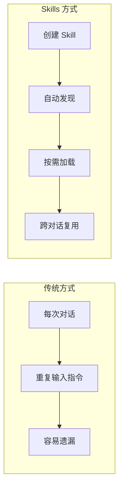
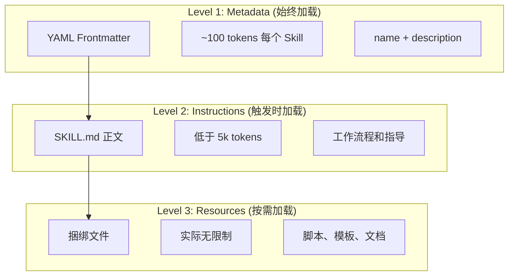

<picture>
  <source media="(prefers-color-scheme: dark)" srcset="../resources/logos/claude-howto-logo-dark.svg">
  
</picture>

> 🟡 **中级** | ⏱ 50 分钟
>
> ✅ 已验证适用于 Claude Code **v2.1.92** · 最后验证：2026-04-06

**你将构建：** 为 Claude 创建可复用、自动调用的能力模板。

---

## 为什么需要这个？

> "有些任务我经常重复做，能不能保存成模板？"

你有没有遇到过这些场景：

- 每次写新功能都要提醒 Claude "先写测试"
- 每次代码审查都要输入一堆检查清单
- 每次部署都要手动检查测试、构建、推送...
- 团队每个人都有一套自己的"习惯"，无法标准化

**Skills 就是答案。**

Skills 是基于文件系统的可复用能力模板。把你的工作流程、最佳实践、领域知识打包成 Skill，Claude 就能在需要时自动调用——**一次创建，跨对话复用**。

---

## 核心概念

### Skills 是什么？

**Skills** 是模块化能力，可将通用智能体转变为专家。与提示词（用于一次性任务的对话级指令）不同，Skills 按需加载，无需在多个对话中重复提供相同的指导。



### 渐进式披露架构

Skills 采用**渐进式披露**架构——Claude 按需分阶段加载信息，而非预先占用上下文：



| 级别 | 加载时机 | Token 成本 | 内容 |
|-------|------------|------------|---------|
| **Level 1: Metadata** | 始终（启动时） | 每个 Skill 约 100 tokens | YAML frontmatter 中的 `name` 和 `description` |
| **Level 2: Instructions** | Skill 被触发时 | 低于 5k tokens | SKILL.md 正文，包含指令和指导 |
| **Level 3+: Resources** | 按需加载 | 实际无限制 | 通过 bash 执行的捆绑文件，内容不加载到上下文中 |

这意味着你可以安装多个 Skills 而不会产生上下文惩罚——Claude 只知道每个 Skill 存在以及何时使用它，直到实际触发时才加载更多。

### Skill 类型与位置

| 类型 | 位置 | 范围 | 共享 | 最适用于 |
|------|----------|-------|--------|----------|
| **Enterprise** | Managed settings | 所有组织用户 | 是 | 组织级标准 |
| **Personal** | `~/.claude/skills/<skill-name>/SKILL.md` | 个人 | 否 | 个人工作流程 |
| **Project** | `.claude/skills/<skill-name>/SKILL.md` | 团队 | 是（通过 git） | 团队标准 |
| **Plugin** | `<plugin>/skills/<skill-name>/SKILL.md` | 启用范围 | 取决于插件 | 与插件捆绑 |

---

## 场景 1：使用内置 Skills

Claude Code 附带多个内置 Skills，无需安装即可使用：

### 查看可用 Skills

直接询问 Claude：

```
What Skills are available?
```

或检查文件系统：

```bash
# 列出个人 Skills
ls ~/.claude/skills/

# 列出项目 Skills
ls .claude/skills/
```

### 内置 Skills一览

| Skill | 描述 |
|-------|-------------|
| `/simplify` | 审查变更文件的复用、质量和效率；启动 3 个并行审查智能体 |
| `/batch <instruction>` | 使用 git worktrees 在代码库中编排大规模并行变更 |
| `/debug [description]` | 通过读取 debug 日志排查当前会话 |
| `/loop [interval] <prompt>` | 按间隔重复运行提示词（如 `/loop 5m check the deploy`） |
| `/claude-api` | 加载 Claude API/SDK 参考；在 `anthropic`/`@anthropic-ai/sdk` 导入时自动激活 |

### 实战演练

**场景：你的项目引入了 Anthropic SDK，想快速了解 API 使用方法。**

```bash
# 步骤 1：直接开始使用
# Claude 会自动检测 anthropic 导入并激活 claude-api skill

# 步骤 2：提问
# "帮我用 Anthropic SDK 实现一个聊天功能"

# Claude 自动加载 claude-api skill，提供准确的 API 用法指导
```

**场景：你修改了几个文件，想检查代码质量。**

```bash
# 步骤 1：调用 simplify skill
/simplify

# Claude 会启动 3 个并行审查智能体，检查：
# - 复用机会
# - 代码质量
# - 效率问题
```

---

## 场景 2：创建简单 Skill

### 基础目录结构

一个 Skill 最少只需要一个 `SKILL.md` 文件：

```
my-skill/
└── SKILL.md           # 主要指令（必需）
```

### SKILL.md 格式

```yaml
---
name: your-skill-name
description: Brief description of what this Skill does and when to use it
---

# Your Skill Name

## Instructions
Provide clear, step-by-step guidance for Claude.

## Examples
Show concrete examples of using this Skill.
```

### 必填字段

- **name**：仅限小写字母、数字、连字符（最多 64 字符）。不能包含 "anthropic" 或 "claude"。
- **description**：Skill 的功能以及何时使用（最多 1024 字符）。这对 Claude 知道何时激活 skill 至关重要。

### 实战演练

**场景：你希望每次开始工作时，Claude 能快速给你一个项目状态摘要。**

**步骤 1：创建 Skill 目录**

```bash
mkdir -p .claude/skills/status
```

**步骤 2：创建 SKILL.md**

```markdown
---
name: status
description: Show comprehensive project status. Use when user asks about project health, status, or starts a session.
allowed-tools: Bash(git *), Bash(npm *), Read
---

# Project Status

## Git Context
- Branch: !`git branch --show-current`
- Changes: !`git status --short | head -10`
- Recent: !`git log --oneline -5`

## Package Info
- Version: !`node -e "console.log(require('./package.json').version)" 2>/dev/null || echo "N/A"`
- Dependencies: !`npm ls --depth=0 2>/dev/null | head -15 || echo "Run npm install first"`

## Summary
Provide a brief health report with recommendations.
```

**步骤 3：测试**

```bash
# 方式 1：直接调用
/status

# 方式 2：自然语言触发
# 输入 "项目状态怎么样"
# Claude 会自动识别并调用 status skill
```

### 关键语法：动态上下文注入

`!`command`` 语法在 skill 内容发送给 Claude 之前运行 shell 命令：

```yaml
---
name: pr-summary
description: Summarize changes in a pull request
---

## Pull request context
- PR diff: !`gh pr diff`
- PR comments: !`gh pr view --comments`
- Changed files: !`gh pr diff --name-only`

## Your task
Summarize this pull request...
```

命令立即执行；Claude 只看到最终输出。

---

## 场景 3：创建带模板的 Skill

### 完整 Skill 目录结构

当 Skill 需要更多资源时，可以添加支持文件：

```
my-skill/
├── SKILL.md              # 主要指令（必需，保持在 500 行以下）
├── templates/            # Claude 填写的模板
│   └ output-format.md
├── examples/             # 示例输出，展示预期格式
│   └ sample-output.md
├── references/           # 领域知识和规范
│   └ api-spec.md
└── scripts/              # Claude 可执行的脚本
    └ validate.sh
```

### 实战演练

**场景：你希望每次代码审查都遵循统一的标准和输出格式。**

**步骤 1：创建目录结构**

```bash
mkdir -p .claude/skills/review/templates
mkdir -p .claude/skills/review/scripts
```

**步骤 2：创建 SKILL.md**

```markdown
---
name: review
description: Comprehensive code review. Use before commits or PRs, when user asks to review code.
allowed-tools: Read, Grep, Glob, Bash(git *)
---

# Code Review

## Current Changes
!`git diff HEAD`

## Review Process
1. Load each changed file
2. Check against checklist (see templates/checklist.md)
3. Note issues by severity (CRITICAL, HIGH, MEDIUM, LOW)
4. Provide actionable recommendations

## Output Template
Use format from templates/report.md

## Additional Resources
- For security checklist, see templates/security-checklist.md
- For quality checklist, see templates/quality-checklist.md
```

**步骤 3：创建模板文件**

`templates/checklist.md`:

```markdown
# Review Checklist

## Security
- [ ] No hardcoded secrets
- [ ] Input validation present
- [ ] Proper error handling
- [ ] No SQL injection risks

## Quality
- [ ] Functions < 50 lines
- [ ] Files < 800 lines
- [ ] No deep nesting (>4 levels)
- [ ] Clear naming

## Performance
- [ ] No N+1 queries
- [ ] Efficient algorithms
- [ ] No memory leaks

## Testing
- [ ] Tests for new code
- [ ] Edge cases covered
- [ ] Mocks properly configured
```

`templates/report.md`:

```markdown
# Review Report

## Files Reviewed
- List each file with severity summary

## Issues Found

| Severity | File | Line | Issue | Fix |
|----------|------|------|-------|-----|

## Summary
- Critical issues: X (must fix)
- High issues: Y (should fix)
- Medium issues: Z (consider)
- Low issues: W (optional)

## Recommendation
[Approve / Block / Warn]
```

**步骤 4：测试**

```bash
# 方式 1：直接调用
/review

# 方式 2：自然语言触发
# 输入 "帮我审查代码"
# Claude 会自动调用 review skill

# Claude 会：
# 1. 获取当前变更
# 2. 按需加载 checklist.md
# 3. 按模板格式输出审查报告
```

### 支持文件指南

- 保持 `SKILL.md` 在 **500 行以下**。将详细参考材料移到单独文件。
- 从 `SKILL.md` 使用**相对路径**引用其他文件。
- 支持文件在 Level 3（按需）加载，不预先占用上下文。

---

## 控制 Skill 调用

默认情况下，你和 Claude 都可以调用任何 skill。两个 frontmatter 字段控制三种调用模式：

| Frontmatter | 你可调用 | Claude 可调用 |
|---|---|---|
| （默认） | 是 | 是 |
| `disable-model-invocation: true` | 是 | 否 |
| `user-invocable: false` | 否 | 是 |

### 仅用户调用（防止意外执行）

**场景：部署操作有副作用，你不希望 Claude 自动触发。**

```yaml
---
name: deploy
description: Deploy to production. Only invoke when user explicitly requests deploy.
disable-model-invocation: true
allowed-tools: Bash(npm *), Bash(git *)
---

# Deploy to Production

## Pre-flight Checks
1. Tests passing: !`npm test 2>&1 | tail -5`
2. Build succeeds: !`npm run build 2>&1 | tail -5`
3. No uncommitted changes: !`git status --short`

## Deploy Steps
1. Tag release
2. Push tag
3. Trigger CI
```

**使用：**

```bash
/deploy

# Claude 不会自动调用此 skill，即使你说 "let's deploy"
# 它需要显式的 /deploy 命令
```

### 仅 Claude 调用（后台知识）

**场景：品牌语调规范是后台知识，不需要用户手动调用。**

```yaml
---
name: brand-voice
description: Ensure all communication matches brand voice guidelines. Use when creating marketing copy.
user-invocable: false
---

## Tone of Voice
- Friendly but professional
- Clear and concise
- Confident but empathetic

## Writing Guidelines
- Use "you" when addressing readers
- Use active voice
- Keep sentences under 20 words
```

---

## 在子智能体中运行 Skills

添加 `context: fork` 在隔离的子智能体上下文中运行 skill：

```yaml
---
name: deep-research
description: Research a topic thoroughly
context: fork
agent: Explore
---

Research $ARGUMENTS thoroughly:
1. Find relevant files using Glob and Grep
2. Read and analyze the code
3. Summarize findings with specific file references
```

| 智能体类型 | 最适用于 |
|---|---|
| `Explore` | 只读研究、代码库分析 |
| `Plan` | 创建实现计划 |
| `general-purpose` | 需要所有工具的广泛任务 |

---

## 🎯 Try It Now

### 练习 1：创建你的第一个 Skill

构建一个 `/hello` skill 用于问候：

```bash
# 步骤 1：创建目录
mkdir -p .claude/skills/hello

# 步骤 2：创建 SKILL.md（内容如下）
```

```markdown
---
name: hello
description: Greet team members. Use when user says hello or starts a session.
---

# Hello Skill

Greet the user with:
1. Current date and time
2. Quick project status (branch, recent commits)
3. Ask what they'd like to work on

Be warm but concise.
```

```bash
# 步骤 3：测试
/hello

# 或直接输入 "hello"
```

### 练习 2：带参数的 Skill

创建 `/fix-issue` skill：

```markdown
---
name: fix-issue
description: Fix a GitHub issue by number. Use when user mentions fixing an issue.
argument-hint: issue-number
allowed-tools: Bash(git *), Bash(gh *), Read, Edit, Write
---

# Fix Issue #$ARGUMENTS

## Steps
1. Fetch Issue Details from GitHub
2. Analyze Codebase
3. Implement Fix (minimal, focused changes)
4. Add/update tests
5. Verify tests pass
6. Commit with issue reference

## Output Format
Report: issue title, changes made, tests added, verification results
```

```bash
# 测试
/fix-issue 123
```

### 练习 3：多文件 Skill

创建完整的 `/review` skill（见场景 3 的完整示例）。

---

## 常见问题

### Claude 不使用我的 Skill

**原因：** 描述不够具体，缺少触发词。

**解决：**

```yaml
# 差（模糊）
description: Helps with documents

# 好（具体）
description: Extract text and tables from PDF files, fill forms, merge documents. Use when working with PDF files or when user mentions PDFs, forms, or document extraction.
```

### Skill 触发太频繁

**原因：** 描述过于宽泛。

**解决：**

1. 让描述更具体
2. 添加 `disable-model-invocation: true` 仅限手动调用

### Claude 看不到所有 Skills

**原因：** Skill 描述加载上限为上下文窗口的 2%（后备值：16,000 字符）。

**解决：** 运行 `/context` 查看警告。可通过环境变量覆盖：

```bash
export SLASH_COMMAND_TOOL_CHAR_BUDGET=20000
```

### YAML 解析错误

**解决：**

1. 检查 `---` 标记是否正确
2. 确保缩进使用空格，不用制表符
3. 验证路径：`~/.claude/skills/name/SKILL.md`

### Skills 冲突

**解决：**

1. 在描述中使用不同的触发词
2. 高优先级位置优先：**enterprise > personal > project**
3. Plugin skills 使用 `plugin-name:skill-name` 命名空间，不会冲突

---

## 最佳实践

### 描述要具体

```yaml
# 差
description: Helps with documents

# 好
description: Extract text and tables from PDF files. Use when working with PDFs, forms, or document extraction.
```

### 一个 Skill 一个能力

- ✅ "PDF form filling"
- ❌ "Document processing"（太宽泛）

### 包含触发词

```yaml
description: Analyze Excel spreadsheets, generate pivot tables. Use when working with Excel files, spreadsheets, or .xlsx files.
```

### 保持 SKILL.md 简洁

保持在 500 行以下，详细内容移到支持文件。

### 引用支持文件

```markdown
## Additional resources
- For API details, see [reference.md](reference.md)
- For examples, see [examples.md](examples.md)
```

---

## 安全考虑

**仅使用来自可信来源的 Skills。** Skills 可引导 Claude 调用工具或执行代码——恶意 Skill 有安全风险。

关键原则：

- 彻底审计 Skill 目录中的所有文件
- 外部来源有风险，可能被篡改
- 像安装软件一样对待 Skills

---

## Skills 与其他功能对比

| 功能 | 调用方式 | 最适用于 |
|---------|------------|----------|
| **Skills** | 自动或 `/name` | 可复用专业知识、工作流程 |
| **Slash Commands** | 用户发起 `/name` | 快捷方式（已合并到 skills） |
| **Subagents** | 自动委托 | 隔离任务执行 |
| **Memory (CLAUDE.md)** | 始终加载 | 持久项目上下文 |
| **MCP** | 实时 | 外部数据/服务访问 |
| **Hooks** | 事件驱动 | 自动化副作用 |

---

## 可选 Frontmatter 字段完整列表

| 字段 | 描述 |
|-------|-------------|
| `name` | 仅限小写字母、数字、连字符（最多 64 字符） |
| `description` | Skill 的功能以及何时使用（最多 1024 字符） |
| `argument-hint` | `/` 自动补全菜单中显示的提示 |
| `disable-model-invocation` | `true` = 仅用户可调用 |
| `user-invocable` | `false` = 从 `/` 菜单隐藏 |
| `allowed-tools` | Skill 可使用的工具列表 |
| `model` | Skill 激活时的模型覆盖（如 `opus`、`sonnet`） |
| `effort` | Effort 级别覆盖：`low`、`medium`、`high`、`max` |
| `context` | `fork` 在隔离子智能体中运行 |
| `agent` | 子智能体类型（配合 `context: fork`） |
| `shell` | Shell 类型：`bash`（默认）或 `powershell` |
| `hooks` | Skill 范围的 hooks |

---

## 下一章预告

> "有些任务太专业了，能不能请专家？"

Skills 让你保存模板，但有些任务需要**专业智能体**来处理——比如安全审查、代码重构、系统调试。

下一章 [Subagents](../04-subagents/) 将介绍如何委托专业智能体处理复杂任务。

---

## 更多资源

- [官方 Skills 文档](https://code.claude.com/docs/en/skills)
- [Agent Skills 架构博客](https://claude.com/blog/equipping-agents-for-the-real-world-with-agent-skills)
- [Skills 仓库](https://github.com/luongnv89/skills) - 即用 skills 收集
- [Slash Commands 指南](../01-slash-commands/) - 用户发起的快捷方式
- [Subagents 指南](../04-subagents/) - 委托 AI 智能体
- [Memory 指南](../02-memory/) - 持久上下文