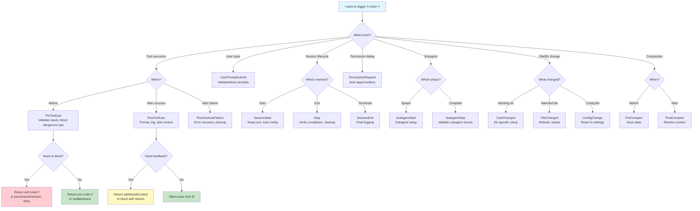

<picture>
  <source media="(prefers-color-scheme: dark)" srcset="../resources/logos/claude-howto-logo-dark.svg">
  
</picture>

> 🟡 **Intermediate** | ⏱ 70 minutes
>
> ✅ Verified against Claude Code **v2.1.92** · Last verified: 2026-04-05

**What you'll build:** Automate workflows with event-driven scripts.

# Hooks

Hooks are automated scripts that execute in response to specific events during Claude Code sessions. They enable automation, validation, permission management, and custom workflows.

## Overview

Hooks are automated actions (shell commands, HTTP webhooks, LLM prompts, or subagent evaluations) that execute automatically when specific events occur in Claude Code. They receive JSON input and communicate results via exit codes and JSON output.

**Key features:**
- Event-driven automation
- JSON-based input/output
- Support for command, prompt, HTTP, and agent hook types
- Pattern matching for tool-specific hooks

---

## The Hook Moment

Your CI caught a lint error after 20 minutes of build. Hooks catch it in 2 seconds.

**The pain cycle without hooks:**
```
Write code → Commit → Push → CI starts → 5 min install → 10 min build → 5 min test → FAIL → Fix → Repeat
```

**With hooks:**
```
Write code → Hook runs → 2 sec → Fix immediately → Commit clean code → CI passes
```

Hooks shift validation from "after the fact" to "while you're still thinking about it." They catch secrets before commit, format code before you switch files, and block dangerous commands before they execute.

---

## Choosing the Right Hook Event



---

## Try It Now: Your First Hook

Let's create a hook that formats TypeScript files automatically after Claude writes them.

**Step 1: Create the hooks directory**

```bash
mkdir -p .claude/hooks
```

**Step 2: Create the format hook**

Create `.claude/hooks/auto-format.sh`:

```bash
#!/bin/bash
# Auto-format code after Write/Edit
# Receives JSON via stdin from Claude Code

INPUT=$(cat)
FILE_PATH=$(echo "$INPUT" | jq -r '.tool_input.file_path // empty')

# Skip if no file path
[ -z "$FILE_PATH" ] && exit 0

# Format based on extension
case "$FILE_PATH" in
  *.ts|*.tsx|*.js|*.jsx|*.json|*.md)
    prettier --write "$FILE_PATH" 2>/dev/null && \
      echo "[Hook] Formatted: $FILE_PATH" >&2
    ;;
  *.py)
    black "$FILE_PATH" 2>/dev/null && \
      echo "[Hook] Formatted: $FILE_PATH" >&2
    ;;
  *.go)
    gofmt -w "$FILE_PATH" && \
      echo "[Hook] Formatted: $FILE_PATH" >&2
    ;;
esac

exit 0
```

**Step 3: Make it executable**

```bash
chmod +x .claude/hooks/auto-format.sh
```

**Step 4: Configure the hook**

Add to `.claude/settings.json`:

```json
{
  "hooks": {
    "PostToolUse": [
      {
        "matcher": "Write|Edit",
        "hooks": [
          {
            "type": "command",
            "command": "$CLAUDE_PROJECT_DIR/.claude/hooks/auto-format.sh",
            "timeout": 30
          }
        ]
      }
    ]
  }
}
```

**Step 5: Test it**

Ask Claude to write a TypeScript file. Watch the hook format it automatically:

```
> Create a simple utils.ts file with a formatDate function

[Hook] Formatted: utils.ts  ← Hook ran automatically!
```

---

## Configuration

Hooks are configured in settings files with a specific structure:

- `~/.claude/settings.json` - User settings (all projects)
- `.claude/settings.json` - Project settings (shareable, committed)
- `.claude/settings.local.json` - Local project settings (not committed)
- Managed policy - Organization-wide settings
- Plugin `hooks/hooks.json` - Plugin-scoped hooks
- Skill/Agent frontmatter - Component lifetime hooks

### Basic Configuration Structure

```json
{
  "hooks": {
    "EventName": [
      {
        "matcher": "ToolPattern",
        "hooks": [
          {
            "type": "command",
            "command": "your-command-here",
            "timeout": 60
          }
        ]
      }
    ]
  }
}
```

**Key fields:**

| Field | Description | Example |
|-------|-------------|---------|
| `matcher` | Pattern to match tool names (case-sensitive) | `"Write"`, `"Edit\|Write"`, `"*"` |
| `hooks` | Array of hook definitions | `[{ "type": "command", ... }]` |
| `type` | Hook type: `"command"` (bash), `"prompt"` (LLM), `"http"` (webhook), or `"agent"` (subagent) | `"command"` |
| `command` | Shell command to execute | `"$CLAUDE_PROJECT_DIR/.claude/hooks/format.sh"` |
| `timeout` | Optional timeout in seconds (default 60) | `30` |
| `once` | If `true`, run the hook only once per session | `true` |

### Matcher Patterns

| Pattern | Description | Example |
|---------|-------------|---------|
| Exact string | Matches specific tool | `"Write"` |
| Regex pattern | Matches multiple tools | `"Edit\|Write"` |
| Wildcard | Matches all tools | `"*"` or `""` |
| MCP tools | Server and tool pattern | `"mcp__memory__.*"` |

## Hook Types

Claude Code supports four hook types:

### Command Hooks

The default hook type. Executes a shell command and communicates via JSON stdin/stdout and exit codes.

```json
{
  "type": "command",
  "command": "python3 \"$CLAUDE_PROJECT_DIR/.claude/hooks/validate.py\"",
  "timeout": 60
}
```

### HTTP Hooks

> Added in v2.1.63.

Remote webhook endpoints that receive the same JSON input as command hooks. HTTP hooks POST JSON to the URL and receive a JSON response. HTTP hooks are routed through the sandbox when sandboxing is enabled. Environment variable interpolation in URLs requires an explicit `allowedEnvVars` list for security.

```json
{
  "hooks": {
    "PostToolUse": [{
      "type": "http",
      "url": "https://my-webhook.example.com/hook",
      "matcher": "Write"
    }]
  }
}
```

**Key properties:**
- `"type": "http"` -- identifies this as an HTTP hook
- `"url"` -- the webhook endpoint URL
- Routed through sandbox when sandbox is enabled
- Requires explicit `allowedEnvVars` list for any environment variable interpolation in the URL

### Prompt Hooks

LLM-evaluated prompts where the hook content is a prompt that Claude evaluates. Primarily used with `Stop` and `SubagentStop` events for intelligent task completion checking.

```json
{
  "type": "prompt",
  "prompt": "Evaluate if Claude completed all requested tasks.",
  "timeout": 30
}
```

The LLM evaluates the prompt and returns a structured decision (see [Prompt-Based Hooks](#prompt-based-hooks) for details).

### Agent Hooks

Subagent-based verification hooks that spawn a dedicated agent to evaluate conditions or perform complex checks. Unlike prompt hooks (single-turn LLM evaluation), agent hooks can use tools and perform multi-step reasoning.

```json
{
  "type": "agent",
  "prompt": "Verify the code changes follow our architecture guidelines. Check the relevant design docs and compare.",
  "timeout": 120
}
```

**Key properties:**
- `"type": "agent"` -- identifies this as an agent hook
- `"prompt"` -- the task description for the subagent
- The agent can use tools (Read, Grep, Bash, etc.) to perform its evaluation
- Returns a structured decision similar to prompt hooks

## Hook Events

Claude Code supports **25 hook events**:

| Event | When Triggered | Matcher Input | Can Block | Common Use |
|-------|---------------|---------------|-----------|------------|
| **SessionStart** | Session begins/resumes/clear/compact | startup/resume/clear/compact | No | Environment setup |
| **InstructionsLoaded** | After CLAUDE.md or rules file loaded | (none) | No | Modify/filter instructions |
| **UserPromptSubmit** | User submits prompt | (none) | Yes | Validate prompts |
| **PreToolUse** | Before tool execution | Tool name | Yes (allow/deny/ask) | Validate, modify inputs |
| **PermissionRequest** | Permission dialog shown | Tool name | Yes | Auto-approve/deny |
| **PostToolUse** | After tool succeeds | Tool name | No | Add context, feedback |
| **PostToolUseFailure** | Tool execution fails | Tool name | No | Error handling, logging |
| **Notification** | Notification sent | Notification type | No | Custom notifications |
| **SubagentStart** | Subagent spawned | Agent type name | No | Subagent setup |
| **SubagentStop** | Subagent finishes | Agent type name | Yes | Subagent validation |
| **Stop** | Claude finishes responding | (none) | Yes | Task completion check |
| **StopFailure** | API error ends turn | (none) | No | Error recovery, logging |
| **TeammateIdle** | Agent team teammate idle | (none) | Yes | Teammate coordination |
| **TaskCompleted** | Task marked complete | (none) | Yes | Post-task actions |
| **TaskCreated** | Task created via TaskCreate | (none) | No | Task tracking, logging |
| **ConfigChange** | Config file changes | (none) | Yes (except policy) | React to config updates |
| **CwdChanged** | Working directory changes | (none) | No | Directory-specific setup |
| **FileChanged** | Watched file changes | (none) | No | File monitoring, rebuild |
| **PreCompact** | Before context compaction | manual/auto | No | Pre-compact actions |
| **PostCompact** | After compaction completes | (none) | No | Post-compact actions |
| **WorktreeCreate** | Worktree being created | (none) | Yes (path return) | Worktree initialization |
| **WorktreeRemove** | Worktree being removed | (none) | No | Worktree cleanup |
| **Elicitation** | MCP server requests user input | (none) | Yes | Input validation |
| **ElicitationResult** | User responds to elicitation | (none) | Yes | Response processing |
| **SessionEnd** | Session terminates | (none) | No | Cleanup, final logging |

### PreToolUse

Runs after Claude creates tool parameters and before processing. Use this to validate or modify tool inputs.

**Configuration:**
```json
{
  "hooks": {
    "PreToolUse": [
      {
        "matcher": "Bash",
        "hooks": [
          {
            "type": "command",
            "command": "$CLAUDE_PROJECT_DIR/.claude/hooks/validate-bash.py"
          }
        ]
      }
    ]
  }
}
```

**Common matchers:** `Task`, `Bash`, `Glob`, `Grep`, `Read`, `Edit`, `Write`, `WebFetch`, `WebSearch`

**Output control:**
- `permissionDecision`: `"allow"`, `"deny"`, or `"ask"`
- `permissionDecisionReason`: Explanation for decision
- `updatedInput`: Modified tool input parameters

### PostToolUse

Runs immediately after tool completion. Use for verification, logging, or providing context back to Claude.

**Configuration:**
```json
{
  "hooks": {
    "PostToolUse": [
      {
        "matcher": "Write|Edit",
        "hooks": [
          {
            "type": "command",
            "command": "$CLAUDE_PROJECT_DIR/.claude/hooks/security-scan.py"
          }
        ]
      }
    ]
  }
}
```

**Output control:**
- `"block"` decision prompts Claude with feedback
- `additionalContext`: Context added for Claude

### UserPromptSubmit

Runs when user submits a prompt, before Claude processes it.

**Configuration:**
```json
{
  "hooks": {
    "UserPromptSubmit": [
      {
        "hooks": [
          {
            "type": "command",
            "command": "$CLAUDE_PROJECT_DIR/.claude/hooks/validate-prompt.py"
          }
        ]
      }
    ]
  }
}
```

**Output control:**
- `decision`: `"block"` to prevent processing
- `reason`: Explanation if blocked
- `additionalContext`: Context added to prompt

### Stop and SubagentStop

Run when Claude finishes responding (Stop) or a subagent completes (SubagentStop). Supports prompt-based evaluation for intelligent task completion checking.

**Additional input field:** Both `Stop` and `SubagentStop` hooks receive a `last_assistant_message` field in their JSON input, containing the final message from Claude or the subagent before stopping. This is useful for evaluating task completion.

**Configuration:**
```json
{
  "hooks": {
    "Stop": [
      {
        "hooks": [
          {
            "type": "prompt",
            "prompt": "Evaluate if Claude completed all requested tasks.",
            "timeout": 30
          }
        ]
      }
    ]
  }
}
```

### SubagentStart

Runs when a subagent begins execution. The matcher input is the agent type name, allowing hooks to target specific subagent types.

**Configuration:**
```json
{
  "hooks": {
    "SubagentStart": [
      {
        "matcher": "code-review",
        "hooks": [
          {
            "type": "command",
            "command": "$CLAUDE_PROJECT_DIR/.claude/hooks/subagent-init.sh"
          }
        ]
      }
    ]
  }
}
```

### SessionStart

Runs when session starts or resumes. Can persist environment variables.

**Matchers:** `startup`, `resume`, `clear`, `compact`

**Special feature:** Use `CLAUDE_ENV_FILE` to persist environment variables (also available in `CwdChanged` and `FileChanged` hooks):

```bash
#!/bin/bash
if [ -n "$CLAUDE_ENV_FILE" ]; then
  echo 'export NODE_ENV=development' >> "$CLAUDE_ENV_FILE"
fi
exit 0
```

### SessionEnd

Runs when session ends to perform cleanup or final logging. Cannot block termination.

**Reason field values:**
- `clear` - User cleared the session
- `logout` - User logged out
- `prompt_input_exit` - User exited via prompt input
- `other` - Other reason

**Configuration:**
```json
{
  "hooks": {
    "SessionEnd": [
      {
        "hooks": [
          {
            "type": "command",
            "command": "\"$CLAUDE_PROJECT_DIR/.claude/hooks/session-cleanup.sh\""
          }
        ]
      }
    ]
  }
}
```

### Notification Event

Updated matchers for notification events:
- `permission_prompt` - Permission request notification
- `idle_prompt` - Idle state notification
- `auth_success` - Authentication success
- `elicitation_dialog` - Dialog shown to user

## Component-Scoped Hooks

Hooks can be attached to specific components (skills, agents, commands) in their frontmatter:

**In SKILL.md, agent.md, or command.md:**

```yaml
---
name: secure-operations
description: Perform operations with security checks
hooks:
  PreToolUse:
    - matcher: "Bash"
      hooks:
        - type: command
          command: "./scripts/check.sh"
          once: true  # Only run once per session
---
```

**Supported events for component hooks:** `PreToolUse`, `PostToolUse`, `Stop`

This allows defining hooks directly in the component that uses them, keeping related code together.

### Hooks in Subagent Frontmatter

When a `Stop` hook is defined in a subagent's frontmatter, it is automatically converted to a `SubagentStop` hook scoped to that subagent. This ensures that the stop hook only fires when that specific subagent completes, rather than when the main session stops.

```yaml
---
name: code-review-agent
description: Automated code review subagent
hooks:
  Stop:
    - hooks:
        - type: prompt
          prompt: "Verify the code review is thorough and complete."
  # The above Stop hook auto-converts to SubagentStop for this subagent
---
```

## PermissionRequest Event

Handles permission requests with custom output format:

```json
{
  "hookSpecificOutput": {
    "hookEventName": "PermissionRequest",
    "decision": {
      "behavior": "allow|deny",
      "updatedInput": {},
      "message": "Custom message",
      "interrupt": false
    }
  }
}
```

## Hook Input and Output

### JSON Input (via stdin)

All hooks receive JSON input via stdin:

```json
{
  "session_id": "abc123",
  "transcript_path": "/path/to/transcript.jsonl",
  "cwd": "/current/working/directory",
  "permission_mode": "default",
  "hook_event_name": "PreToolUse",
  "tool_name": "Write",
  "tool_input": {
    "file_path": "/path/to/file.js",
    "content": "..."
  },
  "tool_use_id": "toolu_01ABC123...",
  "agent_id": "agent-abc123",
  "agent_type": "main",
  "worktree": "/path/to/worktree"
}
```

**Common fields:**

| Field | Description |
|-------|-------------|
| `session_id` | Unique session identifier |
| `transcript_path` | Path to the conversation transcript file |
| `cwd` | Current working directory |
| `hook_event_name` | Name of the event that triggered the hook |
| `agent_id` | Identifier of the agent running this hook |
| `agent_type` | Type of agent (`"main"`, subagent type name, etc.) |
| `worktree` | Path to the git worktree, if the agent is running in one |

### Exit Codes

| Exit Code | Meaning | Behavior |
|-----------|---------|----------|
| **0** | Success | Continue, parse JSON stdout |
| **2** | Blocking error | Block operation, stderr shown as error |
| **Other** | Non-blocking error | Continue, stderr shown in verbose mode |

### JSON Output (stdout, exit code 0)

```json
{
  "continue": true,
  "stopReason": "Optional message if stopping",
  "suppressOutput": false,
  "systemMessage": "Optional warning message",
  "hookSpecificOutput": {
    "hookEventName": "PreToolUse",
    "permissionDecision": "allow",
    "permissionDecisionReason": "File is in allowed directory",
    "updatedInput": {
      "file_path": "/modified/path.js"
    }
  }
}
```

## Environment Variables

| Variable | Availability | Description |
|----------|-------------|-------------|
| `CLAUDE_PROJECT_DIR` | All hooks | Absolute path to project root |
| `CLAUDE_ENV_FILE` | SessionStart, CwdChanged, FileChanged | File path for persisting env vars |
| `CLAUDE_CODE_REMOTE` | All hooks | `"true"` if running in remote environments |
| `${CLAUDE_PLUGIN_ROOT}` | Plugin hooks | Path to plugin directory |
| `${CLAUDE_PLUGIN_DATA}` | Plugin hooks | Path to plugin data directory |
| `CLAUDE_CODE_SESSIONEND_HOOKS_TIMEOUT_MS` | SessionEnd hooks | Configurable timeout in milliseconds for SessionEnd hooks (overrides default) |

## Prompt-Based Hooks

For `Stop` and `SubagentStop` events, you can use LLM-based evaluation:

```json
{
  "hooks": {
    "Stop": [
      {
        "hooks": [
          {
            "type": "prompt",
            "prompt": "Review if all tasks are complete. Return your decision.",
            "timeout": 30
          }
        ]
      }
    ]
  }
}
```

**LLM Response Schema:**
```json
{
  "decision": "approve",
  "reason": "All tasks completed successfully",
  "continue": false,
  "stopReason": "Task complete"
}
```

## Examples

### Example 1: Bash Command Validator (PreToolUse)

**File:** `.claude/hooks/validate-bash.py`

```python
#!/usr/bin/env python3
import json
import sys
import re

BLOCKED_PATTERNS = [
    (r"\brm\s+-rf\s+/", "Blocking dangerous rm -rf / command"),
    (r"\bsudo\s+rm", "Blocking sudo rm command"),
]

def main():
    input_data = json.load(sys.stdin)

    tool_name = input_data.get("tool_name", "")
    if tool_name != "Bash":
        sys.exit(0)

    command = input_data.get("tool_input", {}).get("command", "")

    for pattern, message in BLOCKED_PATTERNS:
        if re.search(pattern, command):
            print(message, file=sys.stderr)
            sys.exit(2)  # Exit 2 = blocking error

    sys.exit(0)

if __name__ == "__main__":
    main()
```

**Configuration:**
```json
{
  "hooks": {
    "PreToolUse": [
      {
        "matcher": "Bash",
        "hooks": [
          {
            "type": "command",
            "command": "python3 \"$CLAUDE_PROJECT_DIR/.claude/hooks/validate-bash.py\""
          }
        ]
      }
    ]
  }
}
```

### Example 2: Security Scanner (PostToolUse)

**File:** `.claude/hooks/security-scan.py`

```python
#!/usr/bin/env python3
import json
import sys
import re

SECRET_PATTERNS = [
    (r"password\s*=\s*['\"][^'\"]+['\"]", "Potential hardcoded password"),
    (r"api[_-]?key\s*=\s*['\"][^'\"]+['\"]", "Potential hardcoded API key"),
]

def main():
    input_data = json.load(sys.stdin)

    tool_name = input_data.get("tool_name", "")
    if tool_name not in ["Write", "Edit"]:
        sys.exit(0)

    tool_input = input_data.get("tool_input", {})
    content = tool_input.get("content", "") or tool_input.get("new_string", "")
    file_path = tool_input.get("file_path", "")

    warnings = []
    for pattern, message in SECRET_PATTERNS:
        if re.search(pattern, content, re.IGNORECASE):
            warnings.append(message)

    if warnings:
        output = {
            "hookSpecificOutput": {
                "hookEventName": "PostToolUse",
                "additionalContext": f"Security warnings for {file_path}: " + "; ".join(warnings)
            }
        }
        print(json.dumps(output))

    sys.exit(0)

if __name__ == "__main__":
    main()
```

### Example 3: Auto-Format Code (PostToolUse)

**File:** `.claude/hooks/format-code.sh`

```bash
#!/bin/bash

# Read JSON from stdin
INPUT=$(cat)
TOOL_NAME=$(echo "$INPUT" | python3 -c "import sys, json; print(json.load(sys.stdin).get('tool_name', ''))")
FILE_PATH=$(echo "$INPUT" | python3 -c "import sys, json; print(json.load(sys.stdin).get('tool_input', {}).get('file_path', ''))")

if [ "$TOOL_NAME" != "Write" ] && [ "$TOOL_NAME" != "Edit" ]; then
    exit 0
fi

# Format based on file extension
case "$FILE_PATH" in
    *.js|*.jsx|*.ts|*.tsx|*.json)
        command -v prettier &>/dev/null && prettier --write "$FILE_PATH" 2>/dev/null
        ;;
    *.py)
        command -v black &>/dev/null && black "$FILE_PATH" 2>/dev/null
        ;;
    *.go)
        command -v gofmt &>/dev/null && gofmt -w "$FILE_PATH" 2>/dev/null
        ;;
esac

exit 0
```

### Example 4: Prompt Validator (UserPromptSubmit)

**File:** `.claude/hooks/validate-prompt.py`

```python
#!/usr/bin/env python3
import json
import sys
import re

BLOCKED_PATTERNS = [
    (r"delete\s+(all\s+)?database", "Dangerous: database deletion"),
    (r"rm\s+-rf\s+/", "Dangerous: root deletion"),
]

def main():
    input_data = json.load(sys.stdin)
    prompt = input_data.get("user_prompt", "") or input_data.get("prompt", "")

    for pattern, message in BLOCKED_PATTERNS:
        if re.search(pattern, prompt, re.IGNORECASE):
            output = {
                "decision": "block",
                "reason": f"Blocked: {message}"
            }
            print(json.dumps(output))
            sys.exit(0)

    sys.exit(0)

if __name__ == "__main__":
    main()
```

### Example 5: Intelligent Stop Hook (Prompt-Based)

```json
{
  "hooks": {
    "Stop": [
      {
        "hooks": [
          {
            "type": "prompt",
            "prompt": "Review if Claude completed all requested tasks. Check: 1) Were all files created/modified? 2) Were there unresolved errors? If incomplete, explain what's missing.",
            "timeout": 30
          }
        ]
      }
    ]
  }
}
```

### Example 6: Context Usage Tracker (Hook Pairs)

Track token consumption per request using `UserPromptSubmit` (pre-message) and `Stop` (post-response) hooks together.

**File:** `.claude/hooks/context-tracker.py`

```python
#!/usr/bin/env python3
"""
Context Usage Tracker - Tracks token consumption per request.

Uses UserPromptSubmit as "pre-message" hook and Stop as "post-response" hook
to calculate the delta in token usage for each request.

Token Counting Methods:
1. Character estimation (default): ~4 chars per token, no dependencies
2. tiktoken (optional): More accurate (~90-95%), requires: pip install tiktoken
"""
import json
import os
import sys
import tempfile

# Configuration
CONTEXT_LIMIT = 128000  # Claude's context window (adjust for your model)
USE_TIKTOKEN = False    # Set True if tiktoken is installed for better accuracy


def get_state_file(session_id: str) -> str:
    """Get temp file path for storing pre-message token count, isolated by session."""
    return os.path.join(tempfile.gettempdir(), f"claude-context-{session_id}.json")


def count_tokens(text: str) -> int:
    """
    Count tokens in text.

    Uses tiktoken with p50k_base encoding if available (~90-95% accuracy),
    otherwise falls back to character estimation (~80-90% accuracy).
    """
    if USE_TIKTOKEN:
        try:
            import tiktoken
            enc = tiktoken.get_encoding("p50k_base")
            return len(enc.encode(text))
        except ImportError:
            pass  # Fall back to estimation

    # Character-based estimation: ~4 characters per token for English
    return len(text) // 4


def read_transcript(transcript_path: str) -> str:
    """Read and concatenate all content from transcript file."""
    if not transcript_path or not os.path.exists(transcript_path):
        return ""

    content = []
    with open(transcript_path, "r") as f:
        for line in f:
            try:
                entry = json.loads(line.strip())
                # Extract text content from various message formats
                if "message" in entry:
                    msg = entry["message"]
                    if isinstance(msg.get("content"), str):
                        content.append(msg["content"])
                    elif isinstance(msg.get("content"), list):
                        for block in msg["content"]:
                            if isinstance(block, dict) and block.get("type") == "text":
                                content.append(block.get("text", ""))
            except json.JSONDecodeError:
                continue

    return "\n".join(content)


def handle_user_prompt_submit(data: dict) -> None:
    """Pre-message hook: Save current token count before request."""
    session_id = data.get("session_id", "unknown")
    transcript_path = data.get("transcript_path", "")

    transcript_content = read_transcript(transcript_path)
    current_tokens = count_tokens(transcript_content)

    # Save to temp file for later comparison
    state_file = get_state_file(session_id)
    with open(state_file, "w") as f:
        json.dump({"pre_tokens": current_tokens}, f)


def handle_stop(data: dict) -> None:
    """Post-response hook: Calculate and report token delta."""
    session_id = data.get("session_id", "unknown")
    transcript_path = data.get("transcript_path", "")

    transcript_content = read_transcript(transcript_path)
    current_tokens = count_tokens(transcript_content)

    # Load pre-message count
    state_file = get_state_file(session_id)
    pre_tokens = 0
    if os.path.exists(state_file):
        try:
            with open(state_file, "r") as f:
                state = json.load(f)
                pre_tokens = state.get("pre_tokens", 0)
        except (json.JSONDecodeError, IOError):
            pass

    # Calculate delta
    delta_tokens = current_tokens - pre_tokens
    remaining = CONTEXT_LIMIT - current_tokens
    percentage = (current_tokens / CONTEXT_LIMIT) * 100

    # Report usage
    method = "tiktoken" if USE_TIKTOKEN else "estimated"
    print(f"Context ({method}): ~{current_tokens:,} tokens ({percentage:.1f}% used, ~{remaining:,} remaining)", file=sys.stderr)
    if delta_tokens > 0:
        print(f"This request: ~{delta_tokens:,} tokens", file=sys.stderr)


def main():
    data = json.load(sys.stdin)
    event = data.get("hook_event_name", "")

    if event == "UserPromptSubmit":
        handle_user_prompt_submit(data)
    elif event == "Stop":
        handle_stop(data)

    sys.exit(0)


if __name__ == "__main__":
    main()
```

**Configuration:**
```json
{
  "hooks": {
    "UserPromptSubmit": [
      {
        "hooks": [
          {
            "type": "command",
            "command": "python3 \"$CLAUDE_PROJECT_DIR/.claude/hooks/context-tracker.py\""
          }
        ]
      }
    ],
    "Stop": [
      {
        "hooks": [
          {
            "type": "command",
            "command": "python3 \"$CLAUDE_PROJECT_DIR/.claude/hooks/context-tracker.py\""
          }
        ]
      }
    ]
  }
}
```

**How it works:**
1. `UserPromptSubmit` fires before your prompt is processed - saves current token count
2. `Stop` fires after Claude responds - calculates delta and reports usage
3. Each session is isolated via `session_id` in the temp filename

**Token Counting Methods:**

| Method | Accuracy | Dependencies | Speed |
|--------|----------|--------------|-------|
| Character estimation | ~80-90% | None | <1ms |
| tiktoken (p50k_base) | ~90-95% | `pip install tiktoken` | <10ms |

> **Note:** Anthropic hasn't released an official offline tokenizer. Both methods are approximations. The transcript includes user prompts, Claude's responses, and tool outputs, but NOT system prompts or internal context.

### Example 7: Seed Auto-Mode Permissions (One-Time Setup Script)

A one-time setup script that seeds `~/.claude/settings.json` with ~67 safe permission rules equivalent to Claude Code's auto-mode baseline — without any hook, without remembering future choices. Run it once; safe to re-run (skips rules already present).

**File:** `09-advanced-features/setup-auto-mode-permissions.py`

```bash
# Preview what would be added
python3 09-advanced-features/setup-auto-mode-permissions.py --dry-run

# Apply
python3 09-advanced-features/setup-auto-mode-permissions.py
```

**What gets added:**

| Category | Examples |
|----------|---------|
| Built-in tools | `Read(*)`, `Edit(*)`, `Write(*)`, `Glob(*)`, `Grep(*)`, `Agent(*)`, `WebSearch(*)` |
| Git read | `Bash(git status:*)`, `Bash(git log:*)`, `Bash(git diff:*)` |
| Git write (local) | `Bash(git add:*)`, `Bash(git commit:*)`, `Bash(git checkout:*)` |
| Package managers | `Bash(npm install:*)`, `Bash(pip install:*)`, `Bash(cargo build:*)` |
| Build & test | `Bash(make:*)`, `Bash(pytest:*)`, `Bash(go test:*)` |
| Common shell | `Bash(ls:*)`, `Bash(cat:*)`, `Bash(find:*)`, `Bash(cp:*)`, `Bash(mv:*)` |
| GitHub CLI | `Bash(gh pr view:*)`, `Bash(gh pr create:*)`, `Bash(gh issue list:*)` |

**What is intentionally excluded** (never added by this script):
- `rm -rf`, `sudo`, force push, `git reset --hard`
- `DROP TABLE`, `kubectl delete`, `terraform destroy`
- `npm publish`, `curl | bash`, production deploys

## Plugin Hooks

Plugins can include hooks in their `hooks/hooks.json` file:

**File:** `plugins/hooks/hooks.json`

```json
{
  "hooks": {
    "PreToolUse": [
      {
        "matcher": "Bash",
        "hooks": [
          {
            "type": "command",
            "command": "${CLAUDE_PLUGIN_ROOT}/scripts/validate.sh"
          }
        ]
      }
    ]
  }
}
```

**Environment Variables in Plugin Hooks:**
- `${CLAUDE_PLUGIN_ROOT}` - Path to the plugin directory
- `${CLAUDE_PLUGIN_DATA}` - Path to the plugin data directory

This allows plugins to include custom validation and automation hooks.

## MCP Tool Hooks

MCP tools follow the pattern `mcp__<server>__<tool>`:

```json
{
  "hooks": {
    "PreToolUse": [
      {
        "matcher": "mcp__memory__.*",
        "hooks": [
          {
            "type": "command",
            "command": "echo '{\"systemMessage\": \"Memory operation logged\"}'"
          }
        ]
      }
    ]
  }
}
```

## Security Considerations

### Disclaimer

**USE AT YOUR OWN RISK**: Hooks execute arbitrary shell commands. You are solely responsible for:
- Commands you configure
- File access/modification permissions
- Potential data loss or system damage
- Testing hooks in safe environments before production use

### Security Notes

- **Workspace trust required:** The `statusLine` and `fileSuggestion` hook output commands now require workspace trust acceptance before they take effect.
- **HTTP hooks and environment variables:** HTTP hooks require an explicit `allowedEnvVars` list to use environment variable interpolation in URLs. This prevents accidental leakage of sensitive environment variables to remote endpoints.
- **Managed settings hierarchy:** The `disableAllHooks` setting now respects the managed settings hierarchy, meaning organization-level settings can enforce hook disablement that individual users cannot override.

### Best Practices

| Do | Don't |
|-----|-------|
| Validate and sanitize all inputs | Trust input data blindly |
| Quote shell variables: `"$VAR"` | Use unquoted: `$VAR` |
| Block path traversal (`..`) | Allow arbitrary paths |
| Use absolute paths with `$CLAUDE_PROJECT_DIR` | Hardcode paths |
| Skip sensitive files (`.env`, `.git/`, keys) | Process all files |
| Test hooks in isolation first | Deploy untested hooks |
| Use explicit `allowedEnvVars` for HTTP hooks | Expose all env vars to webhooks |

## Debugging

### Enable Debug Mode

Run Claude with debug flag for detailed hook logs:

```bash
claude --debug
```

### Verbose Mode

Use `Ctrl+O` in Claude Code to enable verbose mode and see hook execution progress.

### Test Hooks Independently

```bash
# Test with sample JSON input
echo '{"tool_name": "Bash", "tool_input": {"command": "ls -la"}}' | python3 .claude/hooks/validate-bash.py

# Check exit code
echo $?
```

## Complete Configuration Example

```json
{
  "hooks": {
    "PreToolUse": [
      {
        "matcher": "Bash",
        "hooks": [
          {
            "type": "command",
            "command": "python3 \"$CLAUDE_PROJECT_DIR/.claude/hooks/validate-bash.py\"",
            "timeout": 10
          }
        ]
      }
    ],
    "PostToolUse": [
      {
        "matcher": "Write|Edit",
        "hooks": [
          {
            "type": "command",
            "command": "\"$CLAUDE_PROJECT_DIR/.claude/hooks/format-code.sh\"",
            "timeout": 30
          },
          {
            "type": "command",
            "command": "python3 \"$CLAUDE_PROJECT_DIR/.claude/hooks/security-scan.py\"",
            "timeout": 10
          }
        ]
      }
    ],
    "UserPromptSubmit": [
      {
        "hooks": [
          {
            "type": "command",
            "command": "python3 \"$CLAUDE_PROJECT_DIR/.claude/hooks/validate-prompt.py\""
          }
        ]
      }
    ],
    "SessionStart": [
      {
        "matcher": "startup",
        "hooks": [
          {
            "type": "command",
            "command": "\"$CLAUDE_PROJECT_DIR/.claude/hooks/session-init.sh\""
          }
        ]
      }
    ],
    "Stop": [
      {
        "hooks": [
          {
            "type": "prompt",
            "prompt": "Verify all tasks are complete before stopping.",
            "timeout": 30
          }
        ]
      }
    ]
  }
}
```

## Hook Execution Details

| Aspect | Behavior |
|--------|----------|
| **Timeout** | 60 seconds default, configurable per command |
| **Parallelization** | All matching hooks run in parallel |
| **Deduplication** | Identical hook commands deduplicated |
| **Environment** | Runs in current directory with Claude Code's environment |

---

## Patterns & Recipes

Battle-tested hook combinations that solve real problems.

### Pattern 1: Format-on-Save Pipeline

The most common hook pattern: automatic formatting after every file write.

**Problem:** Code gets committed unformatted. CI fails. Developer time wasted.

**Solution:** Chain formatters as PostToolUse hooks.

```json
{
  "hooks": {
    "PostToolUse": [
      {
        "matcher": "Write|Edit",
        "hooks": [
          { "type": "command", "command": "$CLAUDE_PROJECT_DIR/.claude/hooks/auto-format.sh" },
          { "type": "command", "command": "$CLAUDE_PROJECT_DIR/.claude/hooks/lint-check.sh" }
        ]
      }
    ]
  }
}
```

**Benefits:**
- Every file is formatted before you even see it
- Lint errors caught instantly, not 20 minutes later in CI
- Zero mental overhead - it just happens

### Pattern 2: Security Gate

Block dangerous operations before they execute.

**Problem:** Claude sometimes suggests destructive commands. One wrong `rm -rf` can cost hours.

**Solution:** PreToolUse validator that blocks dangerous patterns.

```json
{
  "hooks": {
    "PreToolUse": [
      {
        "matcher": "Bash",
        "hooks": [
          {
            "type": "command",
            "command": "$CLAUDE_PROJECT_DIR/.claude/hooks/prompt-validator.sh"
          }
        ]
      }
    ]
  }
}
```

**What it blocks:**
- `rm -rf /` - Root deletion
- `sudo rm` - Elevated deletion
- `git push --force main` - Force push to main
- `DROP DATABASE` - SQL destruction
- `kubectl delete namespace` - Cluster destruction

### Pattern 3: Test Guard

Run relevant tests when code changes.

**Problem:** Changes break tests. You don't know until CI runs.

**Solution:** PostToolUse test runner for modified files.

```json
{
  "hooks": {
    "PostToolUse": [
      {
        "matcher": "Write|Edit",
        "hooks": [
          {
            "type": "command",
            "command": "$CLAUDE_PROJECT_DIR/.claude/hooks/test-runner.sh",
            "timeout": 120
          }
        ]
      }
    ]
  }
}
```

**How it works:**
- Detects which file was modified
- Finds related test files
- Runs only those tests (fast feedback)
- Reports results back to Claude

### Pattern 4: Session Hygiene

Track what happens in each session.

**Problem:** Long sessions lose context. You forget what was done.

**Solution:** Hook pair that tracks session activity.

```json
{
  "hooks": {
    "SessionStart": [
      {
        "matcher": "startup",
        "hooks": [
          { "type": "command", "command": "$CLAUDE_PROJECT_DIR/.claude/hooks/session-init.sh" }
        ]
      }
    ],
    "Stop": [
      {
        "hooks": [
          { "type": "command", "command": "$CLAUDE_PROJECT_DIR/.claude/hooks/session-summary.sh" }
        ]
      }
    ]
  }
}
```

**Tracks:**
- Files created/modified
- Commands run
- Tests passed/failed
- Token usage

### Pattern 5: Secret Scanner

Prevent secrets from ever reaching git.

**Problem:** API keys, passwords, tokens get committed. Public repos leak secrets.

**Solution:** PostToolUse security scanner.

```json
{
  "hooks": {
    "PostToolUse": [
      {
        "matcher": "Write|Edit",
        "hooks": [
          {
            "type": "command",
            "command": "$CLAUDE_PROJECT_DIR/.claude/hooks/security-scan.sh"
          }
        ]
      }
    ]
  }
}
```

**Scans for:**
- Hardcoded passwords
- API keys and tokens
- AWS credentials
- Private keys
- Uses trufflehog/semgrep if available

---

## Try It Now: Security Guard

Create a hook that blocks dangerous bash commands.

**Step 1: Create the validator**

`.claude/hooks/prompt-validator.sh`:

```bash
#!/bin/bash
# Block dangerous bash commands
# Hook: PreToolUse:Bash

INPUT=$(cat)
CMD=$(echo "$INPUT" | jq -r '.tool_input.command // empty')

# Dangerous patterns - exit 2 to block
BLOCKED=(
  'rm -rf /'
  'rm -rf ~'
  'sudo rm'
  'git push --force main'
  'git push --force master'
  'DROP DATABASE'
  'kubectl delete namespace'
  ':(){ :|:& };:'  # Fork bomb
)

for pattern in "${BLOCKED[@]}"; do
  if [[ "$CMD" == *"$pattern"* ]]; then
    echo "[Hook] BLOCKED: Dangerous command detected: $pattern" >&2
    echo "[Hook] Command: $CMD" >&2
    exit 2  # Exit 2 = blocking error
  fi
done

# Warn but allow for risky patterns
WARN=(
  'git reset --hard'
  'npm publish'
  'docker system prune'
)

for pattern in "${WARN[@]}"; do
  if [[ "$CMD" == *"$pattern"* ]]; then
    echo "[Hook] WARNING: Risky command: $pattern" >&2
    # Continue but Claude sees the warning
  fi
done

exit 0
```

**Step 2: Configure**

```json
{
  "hooks": {
    "PreToolUse": [
      {
        "matcher": "Bash",
        "hooks": [
          {
            "type": "command",
            "command": "$CLAUDE_PROJECT_DIR/.claude/hooks/prompt-validator.sh"
          }
        ]
      }
    ]
  }
}
```

**Step 3: Test**

Try asking Claude to run a dangerous command:

```
> Run rm -rf /tmp/test

[Hook] BLOCKED: Dangerous command detected: rm -rf /
[Hook] Command: rm -rf /tmp/test
```

Claude will see the block message and won't execute the command.

---

## Complete Hook Scripts Reference

Production-ready hook scripts for common use cases. Each script includes error handling, logging, and configuration detection.

### auto-format.sh

Multi-language formatter with smart detection.

```bash
#!/bin/bash
# auto-format.sh - Multi-language code formatter
# Hook: PostToolUse (Write|Edit)
# Receives JSON input via stdin

set -euo pipefail

# Parse JSON input
INPUT=$(cat)
FILE_PATH=$(echo "$INPUT" | jq -r '.tool_input.file_path // empty')
TOOL_NAME=$(echo "$INPUT" | jq -r '.tool_name // empty')

# Skip if not Write/Edit
if [[ "$TOOL_NAME" != "Write" && "$TOOL_NAME" != "Edit" ]]; then
  exit 0
fi

# Skip if no file path
[[ -z "$FILE_PATH" || ! -f "$FILE_PATH" ]] && exit 0

# Log function
log() {
  echo "[Hook:format] $1" >&2
}

# Check for formatter config
has_config() {
  [[ -f ".prettierrc" || -f ".prettierrc.json" || -f "pyproject.toml" || -f ".rustfmt.toml" ]]
}

# Format based on file extension
format_file() {
  local ext="${FILE_PATH##*.}"
  
  case "$ext" in
    js|jsx|ts|tsx|json|md|yaml|yml|css|scss)
      if command -v prettier &>/dev/null; then
        prettier --write "$FILE_PATH" 2>/dev/null && log "Formatted (prettier): $FILE_PATH"
      fi
      ;;
    py)
      if command -v black &>/dev/null; then
        black "$FILE_PATH" 2>/dev/null && log "Formatted (black): $FILE_PATH"
      elif command -v autopep8 &>/dev/null; then
        autopep8 --in-place "$FILE_PATH" && log "Formatted (autopep8): $FILE_PATH"
      fi
      ;;
    go)
      if command -v gofmt &>/dev/null; then
        gofmt -w "$FILE_PATH" && log "Formatted (gofmt): $FILE_PATH"
      fi
      ;;
    rs)
      if command -v rustfmt &>/dev/null; then
        rustfmt "$FILE_PATH" && log "Formatted (rustfmt): $FILE_PATH"
      fi
      ;;
    java)
      if command -v google-java-format &>/dev/null; then
        google-java-format -i "$FILE_PATH" && log "Formatted (google-java-format): $FILE_PATH"
      fi
      ;;
    *)
      # Unknown extension, skip
      ;;
  esac
}

format_file
exit 0
```

### security-scan.sh

Secrets and vulnerability scanner.

```bash
#!/bin/bash
# security-scan.sh - Security scanner for secrets and vulnerabilities
# Hook: PostToolUse (Write|Edit)
# Receives JSON input via stdin

set -euo pipefail

INPUT=$(cat)
FILE_PATH=$(echo "$INPUT" | jq -r '.tool_input.file_path // empty')
TOOL_NAME=$(echo "$INPUT" | jq -r '.tool_name // empty')
CONTENT=$(echo "$INPUT" | jq -r '.tool_input.content // .tool_input.new_string // empty')

# Skip if not Write/Edit
if [[ "$TOOL_NAME" != "Write" && "$TOOL_NAME" != "Edit" ]]; then
  exit 0
fi

[[ -z "$FILE_PATH" || ! -f "$FILE_PATH" ]] && exit 0

log() {
  echo "[Hook:security] $1" >&2
}

WARNINGS=()

# Regex patterns for secrets
check_secrets() {
  # Hardcoded passwords
  if grep -qE "(password|passwd|pwd)\s*=\s*['\"][^'\"]{8,}['\"]" "$FILE_PATH" 2>/dev/null; then
    WARNINGS+=("Potential hardcoded password")
  fi
  
  # API keys
  if grep -qE "(api[_-]?key|apikey|access[_-]?token)\s*=\s*['\"][^'\"]{16,}['\"]" "$FILE_PATH" 2>/dev/null; then
    WARNINGS+=("Potential hardcoded API key")
  fi
  
  # AWS keys
  if grep -qE "AKIA[0-9A-Z]{16}" "$FILE_PATH" 2>/dev/null; then
    WARNINGS+=("AWS access key detected")
  fi
  
  # Private keys
  if grep -q "BEGIN.*PRIVATE KEY" "$FILE_PATH" 2>/dev/null; then
    WARNINGS+=("Private key detected")
  fi
  
  # Generic secrets
  if grep -qE "(secret|token)\s*=\s*['\"][^'\"]{16,}['\"]" "$FILE_PATH" 2>/dev/null; then
    WARNINGS+=("Potential hardcoded secret")
  fi
}

# Run external scanners if available
run_external_scanners() {
  # Trufflehog - verified secrets only
  if command -v trufflehog &>/dev/null; then
    trufflehog filesystem "$FILE_PATH" --only-verified --json 2>/dev/null | \
      jq -r '.DetectorName // empty' | while read detector; do
        [[ -n "$detector" ]] && WARNINGS+=("Trufflehog: $detector")
      done
  fi
  
  # Semgrep - vulnerability patterns
  if command -v semgrep &>/dev/null; then
    semgrep --config=auto "$FILE_PATH" --json --quiet 2>/dev/null | \
      jq -r '.results[].check_id // empty' | while read check; do
        [[ -n "$check" ]] && WARNINGS+=("Semgrep: $check")
      done
  fi
}

# Main
check_secrets
run_external_scanners

# Report warnings
if [[ ${#WARNINGS[@]} -gt 0 ]]; then
  log "Security warnings for $FILE_PATH:"
  for warning in "${WARNINGS[@]}"; do
    log "  - $warning"
  done
  
  # Output JSON for Claude
  jq -n --arg file "$FILE_PATH" --arg warnings "$(printf '%s; ' "${WARNINGS[@]}")" \
    '{hookSpecificOutput: {hookEventName: "PostToolUse", additionalContext: "Security scan found issues in \($file): \($warnings)"}}'
fi

exit 0
```

### test-runner.sh

Smart test runner for modified files.

```bash
#!/bin/bash
# test-runner.sh - Run tests related to modified files
# Hook: PostToolUse (Write|Edit)
# Receives JSON input via stdin

set -euo pipefail

INPUT=$(cat)
FILE_PATH=$(echo "$INPUT" | jq -r '.tool_input.file_path // empty')
TOOL_NAME=$(echo "$INPUT" | jq -r '.tool_name // empty')

# Skip if not Write/Edit
if [[ "$TOOL_NAME" != "Write" && "$TOOL_NAME" != "Edit" ]]; then
  exit 0
fi

[[ -z "$FILE_PATH" ]] && exit 0

log() {
  echo "[Hook:test] $1" >&2
}

# Find test file for source file
find_test_file() {
  local src="$1"
  local base=$(basename "$src" | sed 's/\.[^.]*$//')
  local dir=$(dirname "$src")
  
  # Common test file patterns
  local patterns=(
    "test_${base}.py"
    "${base}_test.py"
    "${base}.test.ts"
    "${base}.test.js"
    "${base}_test.go"
    "${base}Test.java"
  )
  
  # Check in test directories
  local test_dirs=("tests" "test" "__tests__" "src/__tests__")
  
  for test_dir in "${test_dirs[@]}"; do
    for pattern in "${patterns[@]}"; do
      local candidate="$test_dir/$pattern"
      [[ -f "$candidate" ]] && echo "$candidate" && return
    done
  done
  
  # Check same directory
  for pattern in "${patterns[@]}"; do
    [[ -f "$dir/$pattern" ]] && echo "$dir/$pattern" && return
  done
}

# Run tests based on framework
run_tests() {
  local test_file="$1"
  
  if [[ "$test_file" == *.py ]]; then
    if command -v pytest &>/dev/null; then
      log "Running pytest on $test_file"
      pytest "$test_file" -v --tb=short 2>&1 | tail -5 >&2
    fi
  elif [[ "$test_file" == *.ts || "$test_file" == *.js ]]; then
    if command -v jest &>/dev/null; then
      log "Running jest on $test_file"
      jest "$test_file" --passWithNoTests 2>&1 | tail -5 >&2
    elif command -v vitest &>/dev/null; then
      log "Running vitest on $test_file"
      vitest run "$test_file" 2>&1 | tail -5 >&2
    fi
  elif [[ "$test_file" == *.go ]]; then
    log "Running go test"
    go test -v "$(dirname "$test_file")" 2>&1 | tail -5 >&2
  fi
}

# Main
TEST_FILE=$(find_test_file "$FILE_PATH")

if [[ -n "$TEST_FILE" ]]; then
  log "Found test file: $TEST_FILE"
  run_tests "$TEST_FILE"
else
  log "No test file found for $FILE_PATH"
fi

exit 0
```

### prompt-validator.sh

Command and prompt safety validator.

```bash
#!/bin/bash
# prompt-validator.sh - Validate bash commands and user prompts
# Hook: PreToolUse (Bash) or UserPromptSubmit
# Receives JSON input via stdin

set -euo pipefail

INPUT=$(cat)
TOOL_NAME=$(echo "$INPUT" | jq -r '.tool_name // empty')
EVENT=$(echo "$INPUT" | jq -r '.hook_event_name // empty')

log() {
  echo "[Hook:validator] $1" >&2
}

# Get command or prompt based on event
get_target() {
  if [[ "$EVENT" == "PreToolUse" ]]; then
    echo "$INPUT" | jq -r '.tool_input.command // empty'
  elif [[ "$EVENT" == "UserPromptSubmit" ]]; then
    echo "$INPUT" | jq -r '.user_prompt // .prompt // empty'
  fi
}

TARGET=$(get_target)
[[ -z "$TARGET" ]] && exit 0

# Patterns that BLOCK execution (exit 2)
BLOCKED_PATTERNS=(
  'rm -rf /'
  'rm -rf ~'
  'rm -rf /*'
  'sudo rm -rf'
  'dd if=/dev/zero'
  'dd if=/dev/urandom'
  ':(){ :|:& };:'
  'mkfs'
  'git push --force main'
  'git push --force master'
  'git push --force origin main'
  'git push --force origin master'
  'DROP DATABASE'
  'TRUNCATE TABLE'
  'kubectl delete namespace'
  'kubectl delete all'
  'terraform destroy'
)

# Patterns that WARN but allow
WARN_PATTERNS=(
  'git reset --hard'
  'npm publish'
  'yarn publish'
  'docker system prune'
  'helm uninstall'
  'kubectl delete'
)

# Check blocked patterns
for pattern in "${BLOCKED_PATTERNS[@]}"; do
  if [[ "$TARGET" == *"$pattern"* ]]; then
    log "BLOCKED: Dangerous pattern detected"
    log "Pattern: $pattern"
    log "Target: $TARGET"
    
    # Return JSON block decision
    jq -n --arg reason "Blocked dangerous operation: $pattern" \
      '{decision: "block", reason: $reason}'
    exit 0
  fi
done

# Check warn patterns
for pattern in "${WARN_PATTERNS[@]}"; do
  if [[ "$TARGET" == *"$pattern"* ]]; then
    log "WARNING: Risky operation: $pattern"
    # Continue but Claude sees warning in stderr
  fi
done

log "Validation passed"
exit 0
```

### notify-session-end.sh

Session completion notifications.

```bash
#!/bin/bash
# notify-session-end.sh - Send notifications when session ends
# Hook: SessionEnd or Stop
# Receives JSON input via stdin

set -euo pipefail

INPUT=$(cat)
SESSION_ID=$(echo "$INPUT" | jq -r '.session_id // empty')
CWD=$(echo "$INPUT" | jq -r '.cwd // empty')
REASON=$(echo "$INPUT" | jq -r '.reason // empty')

log() {
  echo "[Hook:notify] $1" >&2
}

# Desktop notification (macOS/Linux)
desktop_notify() {
  local title="Claude Code Session Ended"
  local message="Session complete in $CWD"
  
  if [[ "$(uname)" == "Darwin" ]]; then
    osascript -e 'display notification "'"$message"'" with title "'"$title"'"' 2>/dev/null || true
  elif [[ "$(uname)" == "Linux" ]]; then
    notify-send "$title" "$message" 2>/dev/null || true
  fi
}

# Slack notification
slack_notify() {
  local webhook="${SLACK_WEBHOOK_URL:-}"
  [[ -z "$webhook" ]] && return
  
  local project=$(basename "$CWD")
  
  curl -X POST "$webhook" \
    -H 'Content-Type: application/json' \
    -d '{"text": "Claude Code session ended in *'"$project"'*"}' \
    --silent --max-time 5 || true
  
  log "Slack notification sent"
}

# Email notification
email_notify() {
  local to="${SESSION_EMAIL:-}"
  [[ -z "$to" ]] && return
  
  local subject="Claude Code Session: $(basename "$CWD")"
  
  echo "Session ended in $CWD. Reason: $REASON" | mail -s "$subject" "$to" 2>/dev/null || true
  
  log "Email notification sent"
}

# Generate session summary
generate_summary() {
  local transcript=$(echo "$INPUT" | jq -r '.transcript_path // empty')
  
  if [[ -n "$transcript" && -f "$transcript" ]]; then
    local lines=$(wc -l < "$transcript" 2>/dev/null || echo "0")
    log "Session summary: $lines transcript lines"
  fi
}

# Main
log "Session ending: $REASON"
generate_summary
desktop_notify
slack_notify
email_notify

exit 0
```

---

## Troubleshooting

### Hook Not Executing
- Verify JSON configuration syntax is correct
- Check matcher pattern matches the tool name
- Ensure script exists and is executable: `chmod +x script.sh`
- Run `claude --debug` to see hook execution logs
- Verify hook reads JSON from stdin (not command args)

### Hook Blocks Unexpectedly
- Test hook with sample JSON: `echo '{"tool_name": "Write", ...}' | ./hook.py`
- Check exit code: should be 0 for allow, 2 for block
- Check stderr output (shown on exit code 2)

### JSON Parsing Errors
- Always read from stdin, not command arguments
- Use proper JSON parsing (not string manipulation)
- Handle missing fields gracefully

## Installation

### Step 1: Create Hooks Directory
```bash
mkdir -p ~/.claude/hooks
```

### Step 2: Copy Example Hooks
```bash
cp 06-hooks/*.sh ~/.claude/hooks/
chmod +x ~/.claude/hooks/*.sh
```

### Step 3: Configure in Settings
Edit `~/.claude/settings.json` or `.claude/settings.json` with the hook configuration shown above.

## Related Concepts

- **[Checkpoints and Rewind](../08-checkpoints/)** - Save and restore conversation state
- **[Slash Commands](../01-slash-commands/)** - Create custom slash commands
- **[Skills](../03-skills/)** - Reusable autonomous capabilities
- **[Subagents](../04-subagents/)** - Delegated task execution
- **[Plugins](../07-plugins/)** - Bundled extension packages
- **[Advanced Features](../09-advanced-features/)** - Explore advanced Claude Code capabilities

## Additional Resources

- **[Official Hooks Documentation](https://code.claude.com/docs/en/hooks)** - Complete hooks reference
- **[CLI Reference](https://code.claude.com/docs/en/cli-reference)** - Command-line interface documentation
- **[Memory Guide](../02-memory/)** - Persistent context configuration
