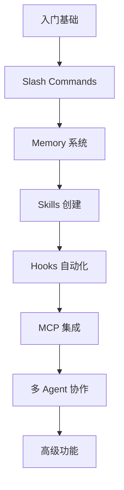

<picture>
  <source media="(prefers-color-scheme: dark)" srcset="../resources/logos/claude-howto-logo-dark.svg">
  
</picture>

> 🟢 **初级** | ⏱ 15 分钟
>
> ✅ 已验证 Claude Code **v2.1.92** · 最后验证: 2026-04-05

**你将学到:** 通过交互式课程学习 Claude Code 功能，解锁趣味陪伴系统。

# Powerup 与 Buddy

Claude Code v2.1.89 和 v2.1.90 引入了两个创新功能：交互式学习系统和虚拟伙伴。本章介绍如何使用这些功能来提升学习体验。

## 目录

1. [概述](#概述)
2. [Powerup 交互式课程](#powerup-交互式课程)
3. [Buddy 虚拟伙伴](#buddy-虚拟伙伴)
4. [最佳实践](#最佳实践)
5. [常见问题](#常见问题)

---

## 概述

### 什么是 Powerup？

Powerup 是 Claude Code 的交互式学习系统，通过动画演示和互动练习教你掌握 Claude Code 的各种功能。

**核心特点：**
- 📚 **交互式课程** - 分步学习各种功能
- 🎬 **动画演示** - 可视化展示功能使用方法
- 🎯 **实战练习** - 在实际环境中练习技能
- 📊 **进度追踪** - 记录学习进度和成就

### 什么是 Buddy？

Buddy 是 Claude Code 的虚拟伙伴系统，你可以孵化并陪伴一个小生物一起写代码。

**核心特点：**
- 🥚 **孵化系统** - 孵化属于你的独特伙伴
- 👀 **陪伴编程** - 小伙伴看着你写代码
- 🎮 **互动体验** - 与伙伴进行简单互动
- 🌟 **收集要素** - 解锁不同种类的伙伴

---

## Powerup 交互式课程

### 启动 Powerup

在 Claude Code 中输入：

```
/powerup
```

系统会显示可用的课程列表，你可以选择想要学习的内容。

### 可用课程

Powerup 提供多种课程，涵盖 Claude Code 的核心功能：

| 课程 | 内容 | 时长 |
|------|------|------|
| **入门基础** | 基本操作、命令使用 | 10 分钟 |
| **Slash Commands** | 所有内置命令详解 | 15 分钟 |
| **Memory 系统** | CLAUDE.md 配置和记忆管理 | 20 分钟 |
| **Skills 创建** | 编写自定义技能 | 25 分钟 |
| **Hooks 自动化** | 事件驱动脚本 | 30 分钟 |
| **MCP 集成** | 连接外部工具 | 25 分钟 |
| **多 Agent 协作** | 子代理使用 | 20 分钟 |
| **高级功能** | 规划模式、扩展思考 | 30 分钟 |

### 课程结构

每个 Powerup 课程遵循统一的结构：

```
1. 概念介绍
   ├── 什么是这个功能？
   ├── 为什么需要它？
   └── 什么时候使用？

2. 动画演示
   ├── 可视化展示功能
   ├── 步骤标注
   └── 关键操作高亮

3. 互动练习
   ├── 跟随练习
   ├── 实时反馈
   └── 错误纠正

4. 总结与挑战
   ├── 知识点回顾
   ├── 进阶挑战
   └── 相关课程推荐
```

### 学习路径

**推荐的学习顺序：**



### 使用技巧

**技巧 1：暂停和继续**
- 按 `Space` 暂停演示
- 按 `Enter` 继续播放
- 按 `Esc` 退出课程

**技巧 2：重复观看**
- 可以随时重新观看课程
- 练习模式可以反复尝试

**技巧 3：笔记记录**
- Powerup 会记录你的进度
- 查看已完成课程：`/powerup --progress`

---

## Buddy 虚拟伙伴

### 孵化 Buddy

在 Claude Code 中输入：

```
/buddy
```

系统会给你一个蛋，你需要通过使用 Claude Code 来孵化它。

### 孵化过程


### 互动方式

**与 Buddy 互动的方法：**

1. **日常编程** - 每次使用 Claude Code 都会增加亲密度
2. **完成任务** - 完成复杂的编程任务获得额外奖励
3. **特殊事件** - 节日期间有特殊的 Buddy 活动

### Buddy 种类

根据孵化方式和时间，你可能获得不同种类的 Buddy：

| 类型 | 特点 | 获取方式 |
|------|------|----------|
| 🐤 经典型 | 可爱、友好 | 默认孵化 |
| 🦄 稀有型 | 独特外观 | 特殊条件 |
| 🐉 传说型 | 华丽特效 | 极低概率 |
| 🎭 节日型 | 限时主题 | 节日活动 |

### Buddy 功能

**当前支持的功能：**
- 在终端角落显示 Buddy
- Buddy 会根据你的操作做出反应
- 长时间不使用会进入休眠状态

### 注意事项

> ⚠️ **重要提示：**
> - Buddy 功能主要是趣味性质，不影响 Claude Code 的核心功能
> - Buddy 数据存储在本地，清除缓存会重置
> - 此功能可能在未来版本中有所变化

---

## 最佳实践

### Powerup 学习建议

1. **循序渐进** - 按推荐顺序学习，打好基础
2. **动手实践** - 学习后立即在实际项目中应用
3. **定期复习** - 隔一段时间重温课程，巩固记忆
4. **记录笔记** - 将重要知识点记录下来

### Buddy 使用建议

1. **自然使用** - 不要刻意刷亲密度，正常使用即可
2. **享受过程** - Buddy 是编程旅程的陪伴，不必太在意收集
3. **分享乐趣** - 与社区分享你的 Buddy 截图

---

## 常见问题

### Powerup 相关

**Q: Powerup 课程会更新吗？**
A: 会的。Claude Code 每次大版本更新通常会增加新的课程。

**Q: 可以跳过课程吗？**
A: 可以，但建议按顺序学习以获得完整体验。

**Q: 进度会同步吗？**
A: Powerup 进度存储在本地，不会跨设备同步。

### Buddy 相关

**Q: Buddy 会消失吗？**
A: Buddy 会一直陪伴你，除非你清除 Claude Code 的本地数据。

**Q: 可以同时拥有多个 Buddy 吗？**
A: 目前每个会话只能有一个活跃的 Buddy。

**Q: Buddy 会影响性能吗？**
A: 不会，Buddy 只是简单的视觉元素，对性能影响微乎其微。

---

## 相关资源

- [Slash Commands 参考](../01-slash-commands/)
- [Skills 创建指南](../03-skills/)
- [官方文档](https://code.claude.com/docs)

---

## 立即尝试

### 🎯 练习 1：完成一个 Powerup 课程

1. 打开 Claude Code
2. 输入 `/powerup`
3. 选择"入门基础"课程
4. 完成所有章节

### 🎯 练习 2：孵化你的 Buddy

1. 输入 `/buddy`
2. 使用 Claude Code 编写一些代码
3. 观察 Buddy 的孵化进度
4. 与你的新伙伴互动

---

> 💡 **提示：** Powerup 和 Buddy 是 Claude Code 团队在功能创新上的尝试。它们让学习编程变得更加有趣。期待更多这样的功能在未来版本中出现！