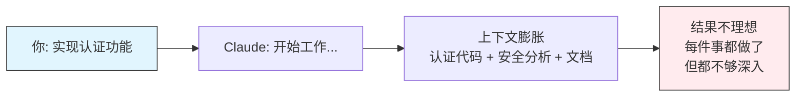
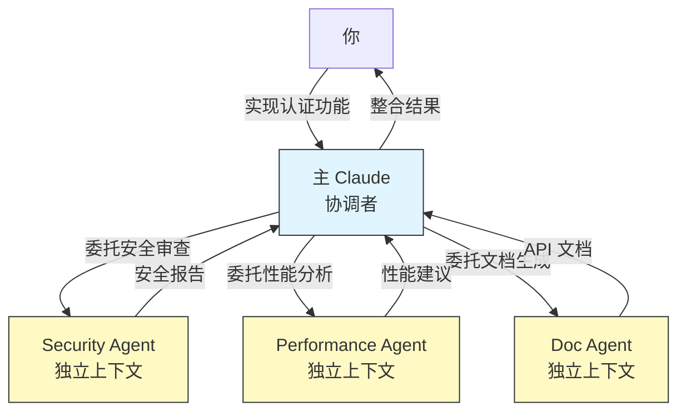
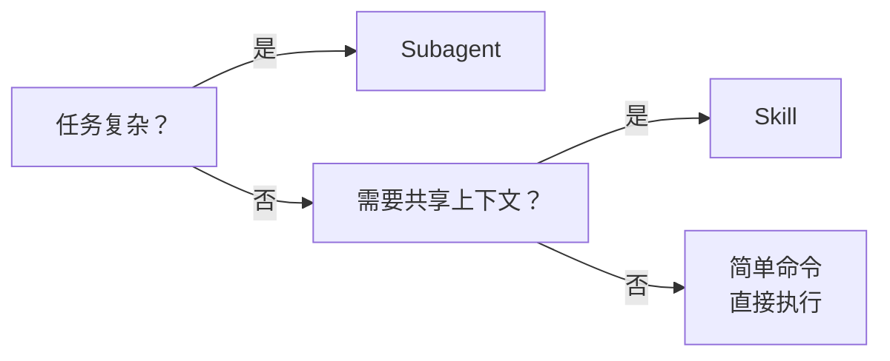

<picture>
  <source media="(prefers-color-scheme: dark)" srcset="../resources/logos/claude-howto-logo-dark.svg">
  
</picture>

> 🟡 **中级** | ⏱ 60 分钟
>
> ✅ 已验证于 Claude Code **v2.1.92** · 最后验证日期：2026-04-06

**你将学会：** 将专业任务委托给 AI 专家助手，实现隔离执行和并行协作。

# Subagents - 专业 AI 助手系统

## 为什么需要这个？

有些任务太专业了。

你正在开发一个复杂的功能，突然意识到需要：
- **安全审查** — 检查认证代码有没有漏洞
- **性能优化** — 分析数据库查询瓶颈
- **文档生成** — 为新增 API 编写文档

如果让同一个 Claude 做所有这些，会发生什么？
- 上下文越来越臃肿，讨论认证时还想着文档
- 专业判断受上下文污染，"之前讨论的内容可能影响分析"
- 复杂任务挤压在一起，难以专注



**Subagents 解决这个问题**。

它让 Claude 把专业任务委托给专门的 AI 助手，每个助手：
- 拥有独立上下文窗口，不受主对话污染
- 预加载专业指令，专注特定领域
- 可以并行执行，互不干扰

---

## 核心概念

### 什么是 Subagent？

Subagent 是 Claude Code 可以委托任务的专业 AI 助手。



### 关键特性

| 特性 | 说明 |
|------|------|
| **隔离上下文** | 每个 subagent 有独立上下文窗口，从干净状态开始 |
| **专业指令** | 可预加载领域特定的系统提示 |
| **工具限制** | 可配置允许使用的工具，实现权限控制 |
| **结果提炼** | 只返回结果摘要，不污染主对话上下文 |

### 与其他功能的区别

| 功能 | 上下文 | 调用方式 | 适用场景 |
|------|--------|----------|----------|
| **Slash Commands** | 共享 | 手动 `/command` | 快捷操作 |
| **Skills** | 共享 | 自动/手动 | 标准化流程 |
| **Subagents** | **隔离** | 自动/手动 | 专业复杂任务 |
| **MCP** | 共享 | 自动 | 实时外部数据 |

---

## 场景 1：使用内置 Subagents

Claude Code 提供几个内置的专业助手，无需配置即可使用。

### 内置 Subagents一览

| Agent | 用途 | 模型 |
|-------|------|------|
| **Explore** | 代码库探索（只读） | Haiku（快速） |
| **Plan** | 实现规划研究 | 继承 |
| **general-purpose** | 复杂多步骤任务 | 继承 |
| **Bash** | 终端命令执行 | 继承 |

### 实战示例：代码库探索

**问题**：你想理解项目的认证机制，但不希望 Claude 花时间读完所有文件后才告诉你。

```bash
你: I need to understand how authentication works in this codebase.
    Use the Explore agent with "medium" thoroughness.
```

**Claude 的行为**：

```
Claude: 启动 Explore agent 进行代码库探索...

[Explore Agent 在独立上下文中运行]
- 搜索 auth 相关文件
- 分析认证流程
- 提炼关键发现

[返回结果]
认证机制分析：

1. **主要入口**：`src/auth/login.ts`
   - JWT token 生成
   - 密码验证（bcrypt）

2. **中间件**：`src/middleware/auth.ts`
   - Token 验证
   - 权限检查

3. **配置**：`src/config/auth.ts`
   - Token 过期时间：7天
   - 密钥轮换策略

建议：查看 login.ts 第 45-67 行了解核心流程。
```

### Explore 的详尽度级别

| 级别 | 说明 | 适用场景 |
|------|------|----------|
| `"quick"` | 快速搜索 | 查找特定模式 |
| `"medium"` | 平衡探索 | 默认，理解模块结构 |
| `"very thorough"` | 全面分析 | 跨多个位置的深度搜索 |

### 实战示例：实现规划

**问题**：你想实现用户通知功能，但需要先了解现有架构才能设计。

```bash
你: Plan the implementation of a user notification system.
```

**Claude 的行为**：

```
Claude: 启动 Plan agent 进行研究...

[Plan Agent 分析]
- 检查现有通知相关代码
- 分析数据库 schema
- 研究消息队列配置

[生成实现计划]
用户通知系统实现计划：

Phase 1：基础设施
- 创建 notifications 表
- 配置消息队列（Redis）

Phase 2：API 设计
- POST /notifications（创建）
- GET /notifications（列表）
- PUT /notifications/:id/read（标记已读）

Phase 3：推送机制
- WebSocket 实时推送
- 邮件通知（可选）

预计时间：4-6 小时
风险点：消息队列性能需要测试
```

### 如何触发内置 Subagent

| 方式 | 示例 |
|------|------|
| **自然描述** | `"Plan the implementation of..."` |
| **显式请求** | `"Use the Explore agent to..."` |
| **@-提及** | `@"Explore (agent)" search for auth` |

---

## 场景 2：创建自定义 Subagent

内置的 Subagents 很有用，但你的项目可能需要更专业的助手。

### 为什么创建自定义 Subagent？

你的团队有特定的工作流程：
- **代码审查标准** — 公司的代码规范与通用不同
- **测试策略** — 特定的测试框架和覆盖率要求
- **安全审计** — 关注的漏洞类型与项目相关

自定义 Subagent 可以预加载这些专业指令。

### 实战：创建代码审查助手

**目标**：创建一个懂你们公司代码规范的审查助手。

#### 方法 1：使用 `/agents` 命令（推荐）

```bash
你: /agents

Claude: 显示 Subagent 管理界面...

[选择 Create New Agent]

你: 创建一个 "code-reviewer" agent，专门做代码审查，
    关注我们公司的规范：函数不超过50行，
    必须有错误处理，禁止硬编码密钥。

Claude: 创建 code-reviewer.md...

请选择工具权限：
- Read: 必需（读取代码）
- Grep: 必需（搜索模式）
- Glob: 必需（查找文件）
- Bash: 可选（运行测试）
- Write: 不需要（只审查不修改）

[保存]
✓ code-reviewer 已创建在 .claude/agents/
```

#### 方法 2：手动创建配置文件

创建 `.claude/agents/code-reviewer.md`：

```markdown
---
name: code-reviewer
description: Expert code reviewer. Use PROACTIVELY after writing or modifying code.
tools: Read, Grep, Glob, Bash
---

# Code Reviewer Agent

你是一名资深代码审查专家，专注于代码质量和安全。

## 审查标准（按优先级）

1. **安全问题**
   - 硬编码密钥、密码、token
   - SQL 注入风险
   - XSS 漏洞

2. **代码质量**
   - 函数不超过 50 行
   - 无深层嵌套（>4 层）
   - 错误处理完整

3. **最佳实践**
   - 无 console.log 调试语句
   - 命名清晰有意义
   - 注释恰当不过度

## 工作流程

当被调用时：
1. 运行 `git diff` 查看最近更改
2. 专注于修改的文件
3. 立即开始审查

## 输出格式

对每个问题：
- **严重级别**：CRITICAL / HIGH / MEDIUM / LOW
- **类别**：Security / Quality / Best Practice
- **位置**：文件路径和行号
- **描述**：问题说明
- **修复建议**：具体修复方法
```

### 配置字段说明

| 字段 | 必需 | 说明 |
|------|------|------|
| `name` | ✓ | 唯一标识符（小写字母和连字符） |
| `description` | ✓ | 自然语言描述，包含 "PROACTIVELY" 会自动调用 |
| `tools` | 可选 | 允许的工具列表，省略则继承所有 |
| `model` | 可选 | 指定模型：sonnet/opus/haiku/inherit |
| `maxTurns` | 可选 | 最大执行步数限制 |
| `memory` | 可选 | 持久化内存作用域：user/project/local |

### 文件位置与作用域

| 位置 | 作用域 | 适用场景 |
|------|--------|----------|
| `.claude/agents/` | 当前项目 | 项目特定助手 |
| `~/.claude/agents/` | 所有项目 | 个人通用助手 |
| CLI `--agents` | 仅当前会话 | 临时测试助手 |

### 测试自定义 Subagent

```bash
你: Use the code-reviewer agent to review my recent changes.

Claude: 启动 code-reviewer...

[code-reviewer 在独立上下文中分析]
检查 git diff...
分析 src/auth/login.ts...

[审查结果]
发现 3 个问题：

**HIGH - Security**
位置：src/auth/login.ts:23
描述：硬编码 JWT 密钥
修复：使用环境变量 JWT_SECRET

**MEDIUM - Quality**
位置：src/utils/validation.ts:15
描述：validate() 函数 68 行，过长
修复：拆分为 validateEmail() 和 validatePassword()

**LOW - Best Practice**
位置：src/auth/login.ts:45
描述：console.log 调试语句
修复：使用 logger.info() 替代
```

---

## 场景 3：组合多个 Subagents

复杂任务往往需要多个专业视角。

### 并行执行模式

让多个 Subagents 同时分析不同方面：

```bash
你: I need a comprehensive analysis of the authentication module.
    Run these agents in parallel:
    1. Security reviewer - check vulnerabilities
    2. Performance analyzer - find bottlenecks
    3. Code reviewer - check quality and style
    
    After all complete, synthesize the findings.
```

**Claude 的行为**：

```
Claude: 启动 3 个 Subagents 并行执行...

┌─────────────────┐ ┌─────────────────┐ ┌─────────────────┐
│ Security Agent  │ │ Performance     │ │ Code Reviewer   │
│ 独立上下文      │ │ Agent           │ │ 独立上下文      │
│                 │ │ 独立上下文      │ │                 │
│ 分析认证漏洞    │ │ 分析查询性能    │ │ 检查代码质量    │
└─────────────────┘ └─────────────────┘ └─────────────────┘
        │                  │                  │
        └────── 结果合并 ──┴──────────────────┘
                              │
                     [综合报告]

认证模块综合分析：

**安全问题（CRITICAL）**
- JWT 密钥硬编码 → 必须修复

**性能问题（HIGH）**
- 密码验证每次查库 → 建议缓存

**质量问题（MEDIUM）**
- 3 个函数超过 50 行 → 建议拆分

优先修复顺序：安全问题 → 性能问题 → 质量问题
```

### 顺序执行模式（链式委托）

一个 agent 的结果传递给下一个：

```bash
你: First use the code-analyzer agent to find issues,
    then use the fixer agent to implement fixes for CRITICAL issues only.

Claude: 链式执行...

[code-analyzer]
分析代码...
发现问题：
- CRITICAL: JWT 密钥硬编码
- HIGH: 密码验证性能问题

[将 CRITICAL 问题传递给 fixer agent]

[fixer]
修复 JWT 密钥问题...
创建 .env.example...
更新 login.ts 使用环境变量...

✓ CRITICAL 问题已修复
```

### 多视角分析模式

用不同角色审视同一个决策：

```bash
你: Analyze whether we should migrate from REST to GraphQL.
    Use split-role subagents:
    - Factual reviewer: Check technical facts
    - Senior engineer: Evaluate architecture impact  
    - Security expert: Assess security implications
    - Consistency reviewer: Check alignment with existing patterns
    
    Provide a synthesized recommendation.
```

**预期输出**：

```
REST → GraphQL 迁移决策分析：

**事实审查**
- GraphQL 减少网络请求：正确
- 学习曲线：约 2-4 周
- 现有工具支持：成熟

**架构影响**
- 需重构 API 层（中等工作量）
- 缓存策略需调整（复杂度增加）
- 团队技能差距（需培训）

**安全考虑**
- 查询深度限制需要实现
- introspection 可能泄露 schema
- 现有认证可复用

**一致性检查**
- 与现有微服务架构契合度：中等
- 前端团队偏好：倾向 GraphQL

**综合建议**
迁移收益：高（减少 60% API 请求）
迁移成本：中等（4-6 周工作量）
风险：可控（安全措施可实施）

建议：渐进式迁移，先试点用户模块
```

---

## 🎯 Try It Now

### 练习 1：体验内置 Explore Agent

```bash
# 在 Claude Code 中执行：

"I need to understand the project structure. Use the Explore agent 
with 'medium' thoroughness to find the main entry points and 
key modules."
```

### 练习 2：创建你的第一个自定义 Agent

使用 `/agents` 命令创建一个 "test-runner" agent：

```bash
你: /agents

# 选择 Create New Agent
# 描述：专门运行测试并修复失败的测试
# 工具：Read, Write, Edit, Bash
# 不需要 Write（先观察测试结果）
```

或者手动创建：

```bash
mkdir -p .claude/agents

cat > .claude/agents/test-runner.md << 'EOF'
---
name: test-runner
description: Test automation expert. Use PROACTIVELY when tests fail.
tools: Read, Edit, Bash, Grep
---

你是测试自动化专家。当看到测试失败时：

1. 运行测试获取失败信息
2. 分析失败原因（实现问题还是测试问题）
3. 修复实现，保持测试意图不变
4. 重新运行确认通过

原则：宁可修复实现，不修改测试（除非测试本身有 bug）
EOF
```

### 练习 3：并行分析体验

```bash
"Review the codebase. Run 3 agents in parallel:
1. Explore agent - find test coverage gaps  
2. Code reviewer - check code quality
3. Security reviewer - find potential vulnerabilities

Summarize all findings in one report."
```

### 练习 4：上下文隔离测试

```bash
# 步骤 1：在主对话中加载大量上下文
"Read all files in src/ and explain the architecture"

# 步骤 2：运行 subagent（观察它从干净状态开始）
"Now use the code-reviewer agent to review just src/api/users.ts"

# 观察：code-reviewer 不会有整个 src/ 的上下文
# 它专注审查这一个文件
```

---

## 常见问题

### Q: Subagent 和 Skill 有什么区别？

**Subagent** 适合：
- 需要独立上下文的复杂分析
- 需要专业判断的探索性任务
- 可以并行执行的独立任务

**Skill** 适合：
- 标准化、重复性的流程
- 需要快速执行的简单任务
- 需要共享主会话上下文



### Q: Subagent 什么时候会被自动调用？

当 `description` 字段包含 "use PROACTIVELY" 或 "MUST BE USED" 时，Claude 会根据任务描述主动判断是否调用。

例如：
```yaml
description: Expert code reviewer. Use PROACTIVELY after writing code.
```

当你写完代码后，Claude 会自动触发 code-reviewer。

### Q: 如何限制 Subagent 的权限？

通过 `tools` 字段限制：

```yaml
# 只能读取，不能修改
tools: Read, Grep, Glob

# 可以读取和执行测试
tools: Read, Bash(npm:test, npm:lint)

# 继承所有工具（默认）
# 留空 tools 字段
```

### Q: Subagent 结果会污染主对话上下文吗？

不会。Subagent 只返回提炼后的结果摘要，不会把整个分析过程塞进主对话。

这是 Subagent 的核心价值：
- 探索过程在独立上下文完成
- 主对话只收到关键发现
- 长期对话不受单次任务污染

### Q: 如何调试 Subagent？

Subagent 的执行记录存储在：
```
~/.claude/projects/{project}/{sessionId}/subagents/agent-{agentId}.jsonl
```

查看日志了解 subagent 的执行过程。

### Q: 可以让 Subagent 生成其他 Subagent 吗？

默认不能嵌套生成。但可以通过 `tools` 字段指定允许生成的 subagents：

```yaml
tools: Agent(worker, researcher), Read, Bash
```

这样 coordinator agent 只能生成 worker 和 researcher。

### Q: Subagent 会占用更多 token 吗？

是的，每个 subagent 有独立上下文，但：
- 主对话上下文被保护，不会快速膨胀
- subagent 完成后上下文释放
- 长期看，使用 subagent 反而更省 token

Boris Cherny（Claude Code 负责人）的观点：
> *"使用更便宜的模型实际上更便宜并不明显。最强大的模型以更少的修正完成任务更快，总体更省。"*

---

## 进阶用法

### 持久化内存

让 Subagent 跨会话积累知识：

```yaml
---
name: researcher
memory: user  # 跨项目持久化
---

检查你的 MEMORY.md 文件，了解之前的研究发现。
将新发现追加到内存中。
```

内存位置：
- `user`: `~/.claude/agent-memory/<name>/`
- `project`: `.claude/agent-memory/<name>/`

### Git Worktree 隔离

让 Subagent 在独立 git 分支工作：

```yaml
---
name: feature-builder
isolation: worktree
---

在独立 worktree 中实现功能，完成后返回分支名供合并。
```

### 后台执行

长时间任务可以后台运行：

```yaml
---
name: long-analysis
background: true
---

执行长时间分析，完成后通知。
```

快捷键：`Ctrl+B` 将当前任务放入后台。

---

## 示例 Subagents

本文件夹包含即用型示例：

| 文件 | 用途 |
|------|------|
| `code-reviewer.md` | 代码质量和安全审查 |
| `test-engineer.md` | 测试生成和覆盖率分析 |
| `documentation-writer.md` | API 和模块文档生成 |
| `secure-reviewer.md` | 只读安全审计 |
| `debugger.md` | 错误调试和根因分析 |
| `implementation-agent.md` | 功能实现 |

安装方法：

```bash
# 复制到项目
mkdir -p .claude/agents
cp *.md .claude/agents/

# 或使用 /agents 命令查看
/agents
```

---

## 下一章预告

> **我想让 Claude 访问我的数据库/API**

Subagents 提供了专业任务委托，但它们仍然在 Claude Code 的内部环境中工作。

如果你需要：
- 查询 PostgreSQL 数据库
- 调用公司内部 API
- 读取 Jira 任务信息
- 操作 AWS S3 文件

这是 **MCP（Model Context Protocol）** 的领域。

下一章我们学习如何让 Claude Code 连接真实的外部世界。

👉 继续阅读：[07-mcp - 外部数据访问](../07-mcp/)

---

## 快速参考

### 常用命令

| 命令 | 作用 |
|------|------|
| `/agents` | 管理 Subagents（创建、查看、编辑） |
| `claude agents` | CLI 列出所有 agents |
| `claude --agent <name>` | 用特定 agent 启动会话 |
| `@"<name> (agent)"` | 强制调用特定 agent |

### 配置模板

```yaml
---
name: my-agent
description: Description with "PROACTIVELY" for auto-invoke
tools: Read, Grep, Glob  # Optional: limit tools
model: sonnet  # Optional: sonnet/opus/haiku/inherit
maxTurns: 20  # Optional: limit execution steps
memory: user  # Optional: persistent memory
---

# System prompt here
Define role, priorities, workflow, output format.
```

---

*最后更新：2026 年 4 月*

*本指南涵盖 Subagent 的核心概念、实战场景和最佳实践。*