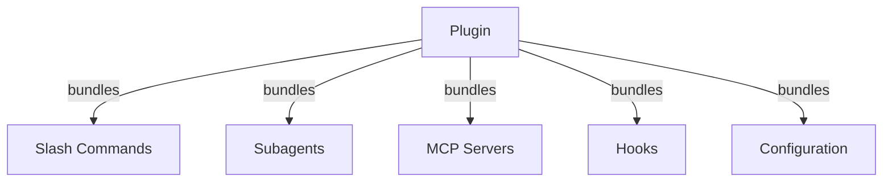
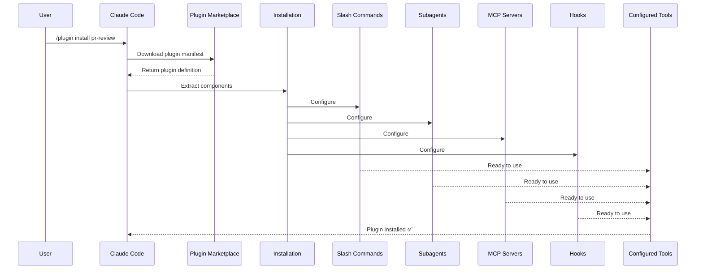
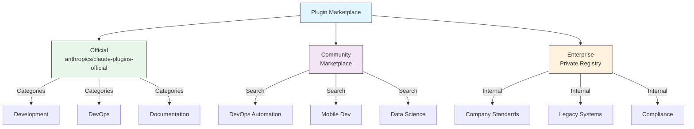
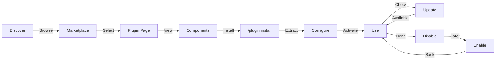
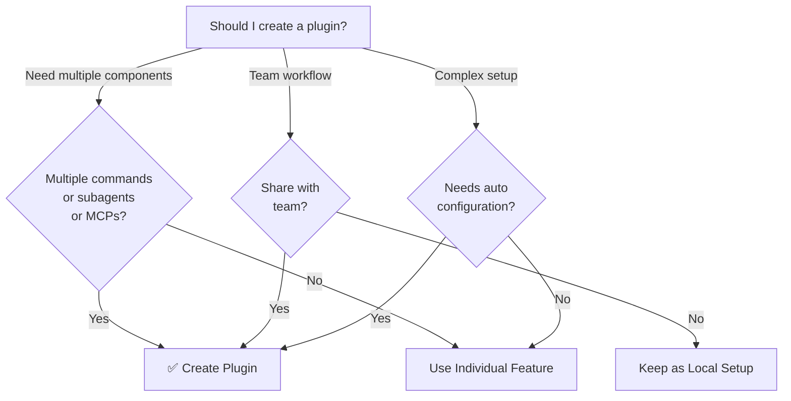

<picture>
  <source media="(prefers-color-scheme: dark)" srcset="../resources/logos/claude-howto-logo-dark.svg">
  
</picture>

> 🟡 **中级** | ⏱ 90 minutes
>
> ✅ Verified against Claude Code **v2.1.92** · Last verified: 2026-04-05

**你将构建：** 打包并分享 Claude Code 扩展。

# Claude Code Plugins（插件）

本文件夹包含完整的 plugin 示例，将多个 Claude Code 功能打包成连贯的可安装包。

## 概览

Claude Code Plugins（插件）是将自定义内容（slash commands、subagents、MCP servers 和 hooks）打包在一起的集合，可通过单一命令安装。它们代表最高级别的扩展机制——将多个功能组合成连贯的、可分享的包。

## Plugin 架构



## Plugin 加载流程



## Plugin 类型与分发

| 类型 | 范围 | 共享 | 权限 | 示例 |
|------|------|------|------|--------|
| Official（官方） | Global | 所有用户 | Anthropic | PR Review, Security Guidance |
| Community（社区） | Public | 所有用户 | Community | DevOps, Data Science |
| Organization（组织） | Internal | 团队成员 | Company | 内部标准、工具 |
| Personal（个人） | Individual | 单用户 | Developer | 自定义工作流 |

## Plugin 定义结构

Plugin manifest 使用 `.claude-plugin/plugin.json` 中的 JSON 格式：

```json
{
  "name": "my-first-plugin",
  "description": "A greeting plugin",
  "version": "1.0.0",
  "author": {
    "name": "Your Name"
  },
  "homepage": "https://example.com",
  "repository": "https://github.com/user/repo",
  "license": "MIT"
}
```

## Plugin 结构示例

```
my-plugin/
├── .claude-plugin/
│   └── plugin.json       # Manifest (name, description, version, author)
├── commands/             # Skills as Markdown files
│   ├── task-1.md
│   ├── task-2.md
│   └── workflows/
├── agents/               # Custom agent definitions
│   ├── specialist-1.md
│   ├── specialist-2.md
│   └── configs/
├── skills/               # Agent Skills with SKILL.md files
│   ├── skill-1.md
│   └── skill-2.md
├── hooks/                # Event handlers in hooks.json
│   └── hooks.json
├── .mcp.json             # MCP server configurations
├── .lsp.json             # LSP server configurations
├── settings.json         # Default settings
├── templates/
│   └── issue-template.md
├── scripts/
│   ├── helper-1.sh
│   └── helper-2.py
├── docs/
│   ├── README.md
│   └── USAGE.md
└── tests/
    └── plugin.test.js
```

### LSP server 配置

Plugins 可以包含 Language Server Protocol (LSP) 支持，提供实时的代码智能。LSP servers 在你工作时提供诊断、代码导航和符号信息。

**配置位置**：
- plugin 根目录下的 `.lsp.json` 文件
- `plugin.json` 中的内联 `lsp` 键

#### 字段参考

| 字段 | 必需 | 描述 |
|-------|----------|-------------|
| `command` | Yes | LSP server 二进制文件（必须在 PATH 中） |
| `extensionToLanguage` | Yes | 将文件扩展名映射到语言 ID |
| `args` | No | server 的命令行参数 |
| `transport` | No | 通信方式：`stdio`（默认）或 `socket` |
| `env` | No | server 进程的环境变量 |
| `initializationOptions` | No | LSP 初始化时发送的选项 |
| `settings` | No | 传递给 server 的工作区配置 |
| `workspaceFolder` | No | 覆盖工作区文件夹路径 |
| `startupTimeout` | No | 等待 server 启动的最长时间（毫秒） |
| `shutdownTimeout` | No | 优雅关闭的最长时间（毫秒） |
| `restartOnCrash` | No | server 崩溃时自动重启 |
| `maxRestarts` | No | 放弃前的最大重启尝试次数 |

#### 配置示例

**Go (gopls)**：

```json
{
  "go": {
    "command": "gopls",
    "args": ["serve"],
    "extensionToLanguage": {
      ".go": "go"
    }
  }
}
```

**Python (pyright)**：

```json
{
  "python": {
    "command": "pyright-langserver",
    "args": ["--stdio"],
    "extensionToLanguage": {
      ".py": "python",
      ".pyi": "python"
    }
  }
}
```

**TypeScript**：

```json
{
  "typescript": {
    "command": "typescript-language-server",
    "args": ["--stdio"],
    "extensionToLanguage": {
      ".ts": "typescript",
      ".tsx": "typescriptreact",
      ".js": "javascript",
      ".jsx": "javascriptreact"
    }
  }
}
```

#### 可用的 LSP plugins

官方 marketplace 包含预配置的 LSP plugins：

| Plugin | 语言 | Server 二进制 | 安装命令 |
|--------|----------|---------------|----------------|
| `pyright-lsp` | Python | `pyright-langserver` | `pip install pyright` |
| `typescript-lsp` | TypeScript/JavaScript | `typescript-language-server` | `npm install -g typescript-language-server typescript` |
| `rust-lsp` | Rust | `rust-analyzer` | Install via `rustup component add rust-analyzer` |

#### LSP 能力

配置完成后，LSP servers 提供：

- **即时诊断** — 编辑后立即显示错误和警告
- **代码导航** — 转到定义、查找引用、实现
- **悬停信息** — 悬停时显示类型签名和文档
- **符号列表** — 浏览当前文件或工作区的符号

## Plugin 选项 (v2.1.83+)

Plugins 可以在 manifest 中通过 `userConfig` 声明用户可配置的选项。标记为 `sensitive: true` 的值存储在系统密钥链中，而非明文设置文件：

```json
{
  "name": "my-plugin",
  "version": "1.0.0",
  "userConfig": {
    "apiKey": {
      "description": "API key for the service",
      "sensitive": true
    },
    "region": {
      "description": "Deployment region",
      "default": "us-east-1"
    }
  }
}
```

## Plugin 持久数据 (`${CLAUDE_PLUGIN_DATA}`) (v2.1.78+)

Plugins 通过 `${CLAUDE_PLUGIN_DATA}` 环境变量访问持久状态目录。此目录对每个 plugin 唯一，并在会话间持久保存，适合用于缓存、数据库和其他持久状态：

```json
{
  "hooks": {
    "PostToolUse": [
      {
        "command": "node ${CLAUDE_PLUGIN_DATA}/track-usage.js"
      }
    ]
  }
}
```

plugin 安装时自动创建此目录。存储在此的文件在 plugin 卸载前一直保留。

## 通过 Settings 内联 Plugin (`source: 'settings'`) (v2.1.80+)

Plugins 可以在设置文件中作为 marketplace 条目使用 `source: 'settings'` 字段内联定义。这允许直接嵌入 plugin 定义，无需单独的仓库或 marketplace：

```json
{
  "pluginMarketplaces": [
    {
      "name": "inline-tools",
      "source": "settings",
      "plugins": [
        {
          "name": "quick-lint",
          "source": "./local-plugins/quick-lint"
        }
      ]
    }
  ]
}
```

## Plugin 设置

Plugins 可以附带 `settings.json` 文件提供默认配置。目前支持 `agent` 键，用于设置 plugin 的主线程 agent：

```json
{
  "agent": "agents/specialist-1.md"
}
```

当 plugin 包含 `settings.json` 时，其默认值在安装时应用。用户可以在自己的项目或用户配置中覆盖这些设置。

## 独立 vs Plugin 方式

| 方式 | 命令名称 | 配置 | 适用场景 |
|----------|---------------|---|----------|
| **独立** | `/hello` | 在 CLAUDE.md 中手动设置 | 个人、项目特定 |
| **Plugins** | `/plugin-name:hello` | 通过 plugin.json 自动 | 分享、分发、团队使用 |

**独立 slash commands** 用于快速的个人工作流。**plugins** 用于打包多个功能、与团队分享或发布分发。

## 实用示例

### 示例 1：PR Review Plugin

**文件：** `.claude-plugin/plugin.json`

```json
{
  "name": "pr-review",
  "version": "1.0.0",
  "description": "Complete PR review workflow with security, testing, and docs",
  "author": {
    "name": "Anthropic"
  },
  "repository": "https://github.com/your-org/pr-review",
  "license": "MIT"
}
```

**文件：** `commands/review-pr.md`

```markdown
---
name: Review PR
description: Start comprehensive PR review with security and testing checks
---

# PR Review

This command initiates a complete pull request review including:

1. Security analysis
2. Test coverage verification
3. Documentation updates
4. Code quality checks
5. Performance impact assessment
```

**文件：** `agents/security-reviewer.md`

```yaml
---
name: security-reviewer
description: Security-focused code review
tools: read, grep, diff
---

# Security Reviewer

Specializes in finding security vulnerabilities:
- Authentication/authorization issues
- Data exposure
- Injection attacks
- Secure configuration
```

**安装：**

```bash
/plugin install pr-review

# Result:
# ✅ 3 slash commands installed
# ✅ 3 subagents configured
# ✅ 2 MCP servers connected
# ✅ 4 hooks registered
# ✅ Ready to use!
```

### 示例 2：DevOps Plugin

**组件：**

```
devops-automation/
├── commands/
│   ├── deploy.md
│   ├── rollback.md
│   ├── status.md
│   └── incident.md
├── agents/
│   ├── deployment-specialist.md
│   ├── incident-commander.md
│   └── alert-analyzer.md
├── mcp/
│   ├── github-config.json
│   ├── kubernetes-config.json
│   └── prometheus-config.json
├── hooks/
│   ├── pre-deploy.js
│   ├── post-deploy.js
│   └── on-error.js
└── scripts/
    ├── deploy.sh
    ├── rollback.sh
    └── health-check.sh
```

### 示例 3：Documentation Plugin

**打包组件：**

```
documentation/
├── commands/
│   ├── generate-api-docs.md
│   ├── generate-readme.md
│   ├── sync-docs.md
│   └── validate-docs.md
├── agents/
│   ├── api-documenter.md
│   ├── code-commentator.md
│   └── example-generator.md
├── mcp/
│   ├── github-docs-config.json
│   └── slack-announce-config.json
└── templates/
    ├── api-endpoint.md
    ├── function-docs.md
    └── adr-template.md
```

## Plugin Marketplace

官方 Anthropic 管理的 plugin 目录是 `anthropics/claude-plugins-official`。企业管理员也可以创建私有 plugin marketplaces 用于内部分发。



### Marketplace 配置

企业和高级用户可以通过设置控制 marketplace 行为：

| 设置 | 描述 |
|---------|-------------|
| `extraKnownMarketplaces` | 在默认之外添加额外的 marketplace 来源 |
| `strictKnownMarketplaces` | 控制允许用户添加哪些 marketplaces |
| `deniedPlugins` | 管理员管理的阻止列表，防止特定 plugins 被安装 |

### 其他 Marketplace 功能

- **默认 git 超时**：对于大型 plugin 仓库，从 30 秒增加到 120 秒
- **自定义 npm 注册表**：Plugins 可以指定自定义 npm 注册表 URL 用于依赖解析
- **版本固定**：将 plugins 锁定到特定版本以实现可复现环境

### Marketplace 定义 schema

Plugin marketplaces 在 `.claude-plugin/marketplace.json` 中定义：

```json
{
  "name": "my-team-plugins",
  "owner": "my-org",
  "plugins": [
    {
      "name": "code-standards",
      "source": "./plugins/code-standards",
      "description": "Enforce team coding standards",
      "version": "1.2.0",
      "author": "platform-team"
    },
    {
      "name": "deploy-helper",
      "source": {
        "source": "github",
        "repo": "my-org/deploy-helper",
        "ref": "v2.0.0"
      },
      "description": "Deployment automation workflows"
    }
  ]
}
```

| 字段 | 必需 | 描述 |
|-------|----------|-------------|
| `name` | Yes | Marketplace 名称，使用 kebab-case |
| `owner` | Yes | 维护 marketplace 的组织或用户 |
| `plugins` | Yes | plugin 条目数组 |
| `plugins[].name` | Yes | Plugin 名称（kebab-case） |
| `plugins[].source` | Yes | Plugin 来源（路径字符串或来源对象） |
| `plugins[].description` | No | 简要 plugin 描述 |
| `plugins[].version` | No | 语义版本字符串 |
| `plugins[].author` | No | Plugin 作者名称 |

### Plugin 来源类型

Plugins 可以从多个位置获取：

| 来源 | 语法 | 示例 |
|--------|--------|---------|
| **相对路径** | 字符串路径 | `"./plugins/my-plugin"` |
| **GitHub** | `{ "source": "github", "repo": "owner/repo" }` | `{ "source": "github", "repo": "acme/lint-plugin", "ref": "v1.0" }` |
| **Git URL** | `{ "source": "url", "url": "..." }` | `{ "source": "url", "url": "https://git.internal/plugin.git" }` |
| **Git 子目录** | `{ "source": "git-subdir", "url": "...", "path": "..." }` | `{ "source": "git-subdir", "url": "https://github.com/org/monorepo.git", "path": "packages/plugin" }` |
| **npm** | `{ "source": "npm", "package": "..." }` | `{ "source": "npm", "package": "@acme/claude-plugin", "version": "^2.0" }` |
| **pip** | `{ "source": "pip", "package": "..." }` | `{ "source": "pip", "package": "claude-data-plugin", "version": ">=1.0" }` |

GitHub 和 git 来源支持可选的 `ref`（分支/标签）和 `sha`（提交哈希）字段用于版本固定。

### 分发方法

**GitHub（推荐）**：
```bash
# 用户添加你的 marketplace
/plugin marketplace add owner/repo-name
```

**其他 git 服务**（需要完整 URL）：
```bash
/plugin marketplace add https://gitlab.com/org/marketplace-repo.git
```

**私有仓库**：通过 git credential helpers 或环境令牌支持。用户必须拥有仓库的读取权限。

**官方 marketplace 提交**：将 plugins 提交到 Anthropic 管理的 marketplace 以获得更广泛的分发。

### 严格模式

控制 marketplace 定义如何与本地 `plugin.json` 文件交互：

| 设置 | 行为 |
|---------|----------|
| `strict: true`（默认） | 本地 `plugin.json` 是权威的；marketplace 条目补充它 |
| `strict: false` | Marketplace 条目是完整的 plugin 定义 |

**组织限制**使用 `strictKnownMarketplaces`：

| 值 | 效果 |
|-------|--------|
| 未设置 | 无限制 — 用户可以添加任何 marketplace |
| 空数组 `[]` | 锁定 — 不允许任何 marketplaces |
| 模式数组 | 白名单 — 只有匹配的 marketplaces 可以添加 |

```json
{
  "strictKnownMarketplaces": [
    "my-org/*",
    "github.com/trusted-vendor/*"
  ]
}
```

> **警告**：在严格模式下使用 `strictKnownMarketplaces`，用户只能从白名单 marketplaces 安装 plugins。这对需要受控 plugin 分发的企业环境很有用。

## Plugin 安装与生命周期



## Plugin 功能对比

| 功能 | Slash Command | Skill | Subagent | Plugin |
|---------|---------------|-------|----------|--------|
| **安装** | 手动复制 | 手动复制 | 手动配置 | 单条命令 |
| **设置时间** | 5 分钟 | 10 分钟 | 15 分钟 | 2 分钟 |
| **打包** | 单文件 | 单文件 | 单文件 | 多个 |
| **版本管理** | 手动 | 手动 | 手动 | 自动 |
| **团队分享** | 复制文件 | 复制文件 | 复制文件 | 安装 ID |
| **更新** | 手动 | 手动 | 手动 | 自动可用 |
| **依赖** | 无 | 无 | 无 | 可包含 |
| **Marketplace** | 无 | 无 | 无 | 有 |
| **分发** | 仓库 | 仓库 | 仓库 | Marketplace |

## Plugin CLI 命令

所有 plugin 操作可通过 CLI 命令执行：

```bash
claude plugin install <name>@<marketplace>   # 从 marketplace 安装
claude plugin uninstall <name>               # 移除 plugin
claude plugin list                           # 列出已安装 plugins
claude plugin enable <name>                  # 启用已禁用的 plugin
claude plugin disable <name>                 # 禁用 plugin
claude plugin validate                       # 验证 plugin 结构
```

## 安装方法

### 从 Marketplace
```bash
/plugin install plugin-name
# 或从 CLI：
claude plugin install plugin-name@marketplace-name
```

### 启用 / 禁用（自动检测范围）
```bash
/plugin enable plugin-name
/plugin disable plugin-name
```

### 本地 Plugin（用于开发）
```bash
# CLI 标志用于本地测试（可重复用于多个 plugins）
claude --plugin-dir ./path/to/plugin
claude --plugin-dir ./plugin-a --plugin-dir ./plugin-b
```

### 从 Git 仓库
```bash
/plugin install github:username/repo
```

##何时创建 Plugin



### Plugin 使用场景

| 使用场景 | 推荐 | 原因 |
|----------|-----------------|-----|
| **团队入职** | ✅ 使用 Plugin | 即时设置，所有配置就绪 |
| **框架设置** | ✅ 使用 Plugin | 打包框架特定的命令 |
| **企业标准** | ✅ 使用 Plugin | 集中分发，版本控制 |
| **快速任务自动化** | ❌ 使用 Command | 复杂度过高 |
| **单一领域专业知识** | ❌ 使用 Skill | 太重，改用 skill |
| **专业分析** | ❌ 使用 Subagent | 手动创建或使用 skill |
| **实时数据访问** | ❌ 使用 MCP | 独立使用，不要打包 |

## 测试 Plugin

发布前，使用 `--plugin-dir` CLI 标志本地测试你的 plugin（可重复用于多个 plugins）：

```bash
claude --plugin-dir ./my-plugin
claude --plugin-dir ./my-plugin --plugin-dir ./another-plugin
```

这会启动加载了你的 plugin 的 Claude Code，让你可以：
- 验证所有 slash commands 可用
- 测试 subagents 和 agents 正常工作
- 确认 MCP servers 正确连接
- 验证 hook 执行
- 检查 LSP server 配置
- 检查任何配置错误

## 热重载

Plugins 在开发期间支持热重载。当你修改 plugin 文件时，Claude Code 可以自动检测变更。你也可以强制重载：

```bash
/reload-plugins
```

这会重新读取所有 plugin manifests、commands、agents、skills、hooks 和 MCP/LSP 配置，无需重启会话。

## Plugin 管理设置

管理员可以使用管理设置控制组织内的 plugin 行为：

| 设置 | 描述 |
|---------|-------------|
| `enabledPlugins` | 默认启用的 plugins 白名单 |
| `deniedPlugins` | 无法安装的 plugins 黑名单 |
| `extraKnownMarketplaces` | 在默认之外添加额外的 marketplace 来源 |
| `strictKnownMarketplaces` | 限制允许用户添加哪些 marketplaces |
| `allowedChannelPlugins` | 控制每个发布通道允许哪些 plugins |

这些设置可以通过管理配置文件在组织级别应用，并优先于用户级别设置。

## Plugin 安全

Plugin subagents 在受限沙箱中运行。以下 frontmatter 键在 plugin subagent 定义中**不允许**：

- `hooks` -- Subagents 不能注册事件处理器
- `mcpServers` -- Subagents 不能配置 MCP servers
- `permissionMode` -- Subagents 不能覆盖权限模型

这确保 plugins 不能提升权限或修改超出其声明范围的主机环境。

## 发布 Plugin

**发布步骤：**

1. 创建包含所有组件的 plugin 结构
2. 编写 `.claude-plugin/plugin.json` manifest
3. 创建包含文档的 `README.md`
4. 使用 `claude --plugin-dir ./my-plugin` 本地测试
5. 提交到 plugin marketplace
6. 获取审核和批准
7. 在 marketplace 上发布
8. 用户可以用一条命令安装

**提交示例：**

```markdown
# PR Review Plugin

## Description
Complete PR review workflow with security, testing, and documentation checks.

## What's Included
- 3 slash commands for different review types
- 3 specialized subagents
- GitHub and CodeQL MCP integration
- Automated security scanning hooks

## Installation
```bash
/plugin install pr-review
```

## Features
✅ Security analysis
✅ Test coverage checking
✅ Documentation verification
✅ Code quality assessment
✅ Performance impact analysis

## Usage
```bash
/review-pr
/check-security
/check-tests
```

## Requirements
- Claude Code 1.0+
- GitHub access
- CodeQL (optional)
```

## Plugin vs 手动配置

**手动设置（2+ 小时）：**
- 一个个安装 slash commands
- 单独创建 subagents
- 分别配置 MCPs
- 手动设置 hooks
- 文档化所有内容
- 与团队分享（希望他们正确配置）

**使用 Plugin（2 分钟）：**
```bash
/plugin install pr-review
# ✅ 所有内容已安装和配置
# ✅ 立即可用
# ✅ 团队可以复现完全相同的设置
```

## 立即尝试

### 🎯 练习 1：安装 Plugin

安装并测试一个 plugin：

```bash
# 步骤 1：浏览可用 plugins
/plugin search code-review

# 步骤 2：安装 plugin
/plugin install code-review

# 步骤 3：验证安装
/plugin list
# 应显示：code-review (installed)

# 步骤 4：测试 plugin
/code-review:review
# 或直接 /review 如果无命名冲突
```

### 🎯 练习 2：创建简单 Plugin

构建一个包含一个 skill 的 plugin：

**步骤 1：创建 plugin 目录**
```bash
mkdir -p my-first-plugin
```

**步骤 2：创建 plugin.json**
```json
{
  "name": "my-first-plugin",
  "version": "1.0.0",
  "description": "A simple example plugin",
  "skills": ["hello"]
}
```

**步骤 3：创建 skill**
```bash
mkdir -p my-first-plugin/skills/hello
```

创建 `my-first-plugin/skills/hello/SKILL.md`：
```markdown
---
name: hello
description: Greet the user
---

# Hello!

Welcome to Claude Code!

Current time: !`date`
Project: !`basename $(git rev-parse --show-toplevel 2>/dev/null || pwd)`

What would you like to work on today?
```

**步骤 4：本地测试**
```bash
# 临时加载 plugin
/plugin load ./my-first-plugin

# 测试它
/my-first-plugin:hello
```

### 🎯 练习 3：多组件 Plugin

创建一个综合 plugin：

**结构：**
```bash
my-dev-plugin/
├── plugin.json
├── README.md
├── skills/
│   ├── review/
│   │   └── SKILL.md
│   ├── commit/
│   │   └── SKILL.md
│   └── test/
│   │   └── SKILL.md
├── commands/
│   ├── deploy.md
│   └── release.md
└── hooks/
    └── PostToolUse/
        └── lint.sh
```

**plugin.json：**
```json
{
  "name": "dev-workflow",
  "version": "1.0.0",
  "description": "Development workflow helpers",
  "skills": ["review", "commit", "test"],
  "commands": ["deploy", "release"],
  "hooks": {
    "PostToolUse": ["lint"]
  }
}
```

### 🎯 练习 4：与团队分享 Plugin

发布你的 plugin：

**步骤 1：创建 GitHub 仓库**
```bash
git init
git add .
git commit -m "Initial plugin release"
git push origin main
```

**步骤 2：团队成员安装**
```bash
# 从仓库 URL
/plugin install https://github.com/yourname/dev-workflow-plugin

# 或从 npm（如果已发布）
/plugin install dev-workflow-plugin
```

**步骤 3：验证团队采用**
```bash
# 在 Claude Code 中：
/plugin list
# 应显示：dev-workflow (installed, v1.0.0)

/dev-workflow:review
```

### 🎯 练习 5：Plugin 开发工作流

测试并迭代 plugins：

```bash
# 开发周期：
/plugin load ./my-plugin        # 加载本地版本
/my-plugin:test                 # 测试功能
/plugin reload ./my-plugin      # 变更后重载
/my-plugin:test                 # 再次测试

# 满意后：
/plugin unload my-plugin        # 移除临时加载
/plugin install ./my-plugin     # 永久安装
```

## 最佳实践

### 推荐做法 ✅
- 使用清晰、描述性的 plugin 名称
- 包含全面的 README
- 正确版本化你的 plugin（semver）
- 测试所有组件的协同工作
- 清晰文档化需求
- 提供使用示例
- 包含错误处理
- 适当标记以便发现
- 保持向后兼容性
- 保持 plugins 聚焦和内聚
- 包含全面的测试
- 文档化所有依赖

### 避免做法 ❌
- 不要打包无关功能
- 不要硬编码凭据
- 不要跳过测试
- 不要忘记文档
- 不要创建冗余 plugins
- 不要忽略版本管理
- 不要过度复杂化组件依赖
- 不要忘记优雅处理错误

## 安装说明

### 从 Marketplace 安装

1. **浏览可用 plugins：**
   ```bash
   /plugin list
   ```

2. **查看 plugin 详情：**
   ```bash
   /plugin info plugin-name
   ```

3. **安装 plugin：**
   ```bash
   /plugin install plugin-name
   ```

### 从本地路径安装

```bash
/plugin install ./path/to/plugin-directory
```

### 从 GitHub 安装

```bash
/plugin install github:username/repo
```

### 列出已安装 Plugins

```bash
/plugin list --installed
```

### 更新 Plugin

```bash
/plugin update plugin-name
```

### 禁用/启用 Plugin

```bash
# 临时禁用
/plugin disable plugin-name

# 重新启用
/plugin enable plugin-name
```

### 卸载 Plugin

```bash
/plugin uninstall plugin-name
```

## 相关概念

以下 Claude Code 功能与 plugins 配合使用：

- **[Slash Commands](../01-slash-commands/)** - Plugins 中打包的独立命令
- **[Memory](../02-memory/)** - Plugins 的持久上下文
- **[Skills](../03-skills/)** - 可包装成 plugins 的领域专业知识
- **[Subagents](../04-subagents/)** - 作为 plugin 组件包含的专业 agents
- **[MCP Servers](../05-mcp/)** - Plugins 中打包的 Model Context Protocol 集成
- **[Hooks](../06-hooks/)** - 触发 plugin 工作流的事件处理器

## 完整示例工作流

### PR Review Plugin 完整工作流

```
1. User: /review-pr

2. Plugin executes:
   ├── pre-review.js hook validates git repo
   ├── GitHub MCP fetches PR data
   ├── security-reviewer subagent analyzes security
   ├── test-checker subagent verifies coverage
   └── performance-analyzer subagent checks performance

3. Results synthesized and presented:
   ✅ Security: No critical issues
   ⚠️  Testing: Coverage 65% (recommend 80%+)
   ✅ Performance: No significant impact
   📝 12 recommendations provided
```

## 问题排查

### Plugin 无法安装
- 检查 Claude Code 版本兼容性：`/version`
- 使用 JSON 验证器验证 `plugin.json` 语法
- 检查网络连接（对于远程 plugins）
- 检查权限：`ls -la plugin/`

### 组件无法加载
- 验证 `plugin.json` 中的路径与实际目录结构匹配
- 检查文件权限：`chmod +x scripts/`
- 检查组件文件语法
- 查看日志：`/plugin debug plugin-name`

### MCP 连接失败
- 验证环境变量设置正确
- 检查 MCP server 安装和健康状况
- 使用 `/mcp test` 独立测试 MCP 连接
- 检查 `mcp/` 目录中的 MCP 配置

### 安装后命令不可用
- 确保 plugin 安装成功：`/plugin list --installed`
- 检查 plugin 是否已启用：`/plugin status plugin-name`
- 重启 Claude Code：`exit` 并重新打开
- 检查与现有命令的命名冲突

### Hook 执行问题
- 验证 hook 文件有正确的权限
- 检查 hook 语法和事件名称
- 查看 hook 日志了解错误详情
- 如果可能手动测试 hooks

## 其他资源

- [Official Plugins Documentation](https://code.claude.com/docs/en/plugins)
- [Discover Plugins](https://code.claude.com/docs/en/discover-plugins)
- [Plugin Marketplaces](https://code.claude.com/docs/en/plugin-marketplaces)
- [Plugins Reference](https://code.claude.com/docs/en/plugins-reference)
- [MCP Server Reference](https://modelcontextprotocol.io/)
- [Subagent Configuration Guide](../04-subagents/README.md)
- [Hook System Reference](../06-hooks/README.md)