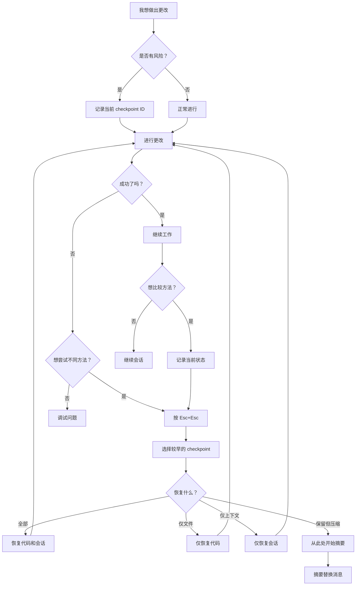
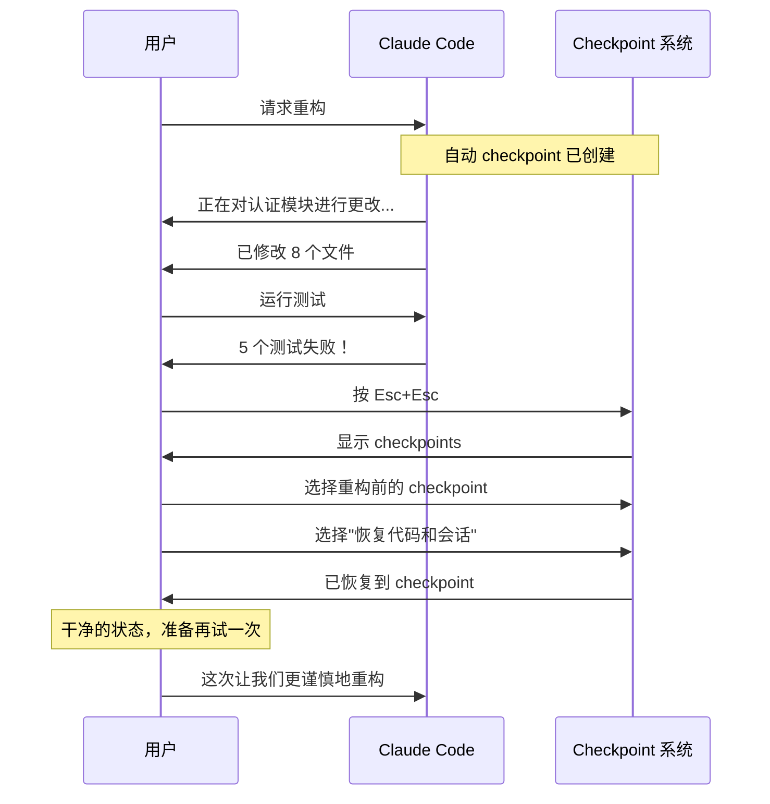
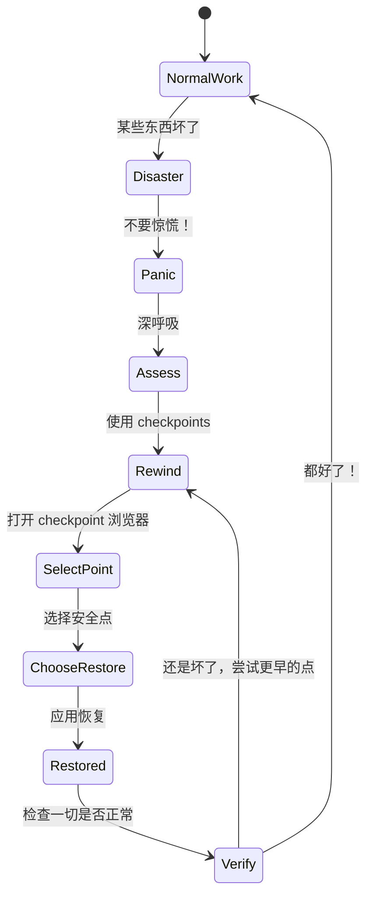
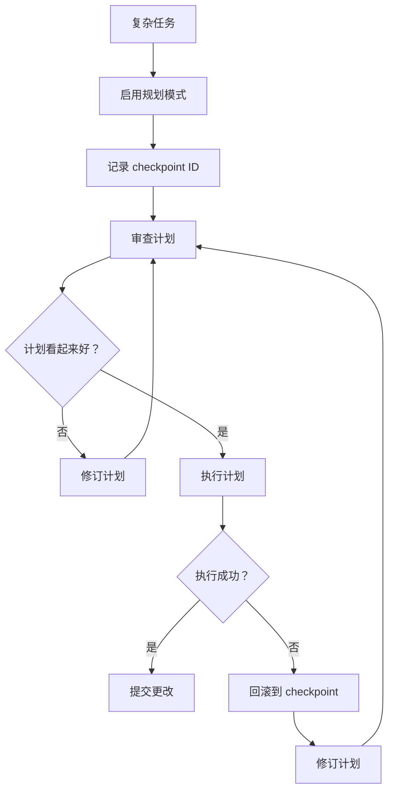
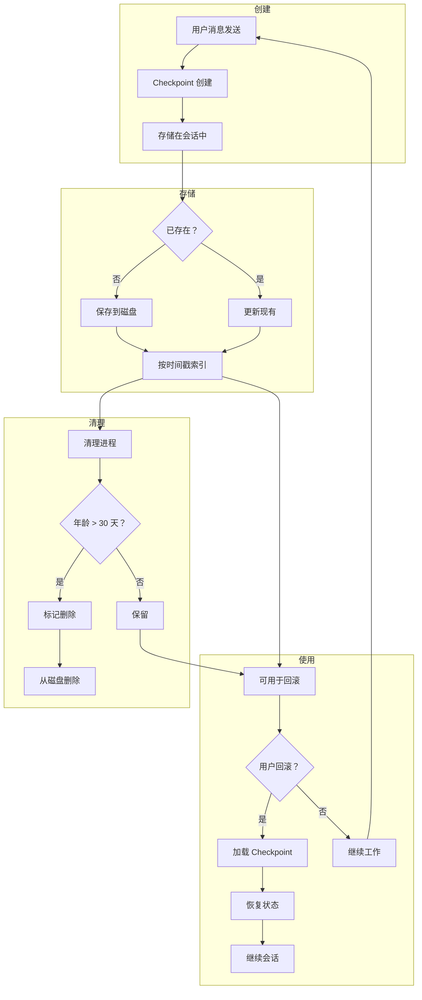
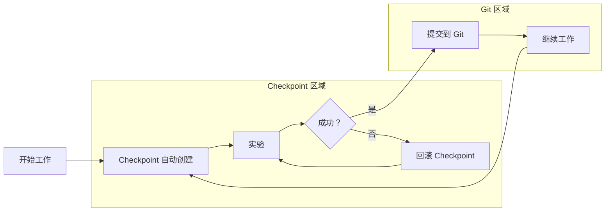

<picture>
  <source media="(prefers-color-scheme: dark)" srcset="../resources/logos/claude-howto-logo-dark.svg">
  
</picture>

> 🟢 **初级** | ⏱ 25 分钟
>
> ✅ 已验证 Claude Code **v2.1.92** · 最后验证：2026-04-05

**你将构建：** 保存和恢复会话状态。

# Checkpoints（检查点）与回滚

你的重构刚刚破坏了 3 个功能。测试失败了。API 返回 500 错误。而且你无法准确记得改了什么。这就是 checkpoints 如何拯救你 —— 一个按键操作，你就回到了正常工作状态，准备好尝试更谨慎的方法。

Checkpoints 允许你保存会话状态并回滚到 Claude Code 会话中的先前时刻。这对于探索不同方法、从错误中恢复或比较替代方案非常有价值。

---

## "糟糕"时刻

我们都经历过：

```
你: 重构认证模块以使用 OAuth2

Claude: [跨 12 个文件进行了 47 处更改]

你: 运行测试

Claude: 测试失败。23 个断言被破坏。
       支付处理出错。
       数据库连接丢失。

你: ...刚才发生了什么？
```

没有 checkpoints，你就陷入困境了。你可能要花几个小时调试。或者你可能不得不撤销一切重新开始，丢失所有混在错误中的正确更改。

**有了 checkpoints：**

```
你: [按两次 Esc] 回滚到重构前

Claude: 已恢复到 checkpoint "auth-oauth2-start"。
       所有文件已还原。会话已恢复。

你: 让我们再试一次，一次一个模块。
```

这就是 checkpoints 的威力 —— 从任何"糟糕"时刻瞬间恢复。

---

## 什么是 Checkpoints？

Checkpoints 是会话状态的快照，包括：

| 组成部分 | 捕获内容 |
|----------|----------|
| **消息** | 交换的所有用户和助手消息 |
| **文件** | 会话期间进行的所有文件修改 |
| **工具** | 完整的工具调用历史 |
| **上下文** | 会话元数据和状态 |

把 checkpoints 想象成游戏中的"存档点"。在任何时刻，你都可以加载之前的存档并尝试不同的路径。

---

## 核心概念

| 概念 | 描述 |
|------|------|
| **Checkpoint** | 包括消息、文件和上下文的会话状态快照 |
| **Rewind（回滚）** | 返回到之前的 checkpoint，丢弃后续更改 |
| **Branch Point（分支点）** | 从该 checkpoint 探索多种方法的节点 |
| **Recovery Point（恢复点）** | 在危险操作前创建的 checkpoint |

---

## 访问 Checkpoints

你可以通过两种主要方式访问和管理 checkpoints：

### 使用键盘快捷键

按两次 `Esc`（`Esc` + `Esc`）打开 checkpoint 界面并浏览已保存的 checkpoints。

### 使用 Slash 命令

使用 `/rewind` 命令（别名：`/checkpoint`）快速访问：

```bash
# 打开回滚界面
/rewind

# 或使用别名
/checkpoint
```

---

## Checkpoint 策略决策树

何时应该创建 checkpoints？何时应该回滚？这个决策树指导你通过 checkpoint 工作流：



---

## 回滚选项详解

当你回滚时，会看到五个选项。理解每个选项有助于你选择正确的恢复策略：

### 1. 恢复代码和会话

**使用场景：** 你想要完全重置到一个已知良好的状态。

```
之前: Checkpoint A（正常状态）
      ↓
      已做出更改（损坏状态）
      
之后: Checkpoint A 已恢复
      文件：已还原
      消息：已还原
      工具历史：已还原
```

这是你的"核选项" —— 完全回滚到保存点。

### 2. 仅恢复会话

**使用场景：** 你想要重置上下文但保留文件更改。

```
场景：你做出了正确的代码更改但会话
      变得混乱或走向了错误的方向。

结果：文件保持原样
      会话重置到 checkpoint
      你可以在干净的上下文中重新解释需求
```

### 3. 仅恢复代码

**使用场景：** 会话有帮助但代码更改破坏了某些东西。

```
场景：Claude 搞清楚了架构但实现
      有 bug。

结果：文件还原到 checkpoint 状态
      会话历史保留
      你可以回顾推理过程
```

### 4. 从此处开始摘要

**使用场景：** 会话太长，你想压缩历史。

```
场景：你已经工作了 2 小时，上下文
      变得臃肿，但不想丢失一切。

结果：Claude 生成会话摘要
      摘要替换从 checkpoint 开始的消息
      原始消息保留在转录中
      上下文窗口释放
```

你可以可选地提供指令来聚焦摘要：

```
用户: 从此处开始摘要，聚焦于 API 设计决策
```

### 5. 没关系

**使用场景：** 你不小心打开了回滚菜单或改变了主意。

```
结果：返回当前状态，不做任何更改
```

---

## 自动 Checkpoints

Claude Code 自动为你创建 checkpoints：

| 触发条件 | 行为 |
|----------|------|
| 每个用户提示 | 自动创建新 checkpoint |
| 会话持久化 | checkpoints 跨会话保存 |
| 自动清理 | 超过 30 天的 checkpoints 被删除 |

这意味着你始终可以回滚到会话中的任何先前时刻，从几分钟前到几天前。

### 配置

你可以在设置中切换自动 checkpoints：

```json
{
  "autoCheckpoint": true
}
```

- `autoCheckpoint`：启用或禁用每个用户提示上的自动 checkpoint 创建（默认：`true`）

---

## 工作流模板

以下是三个用于常见场景的即用型 checkpoint 工作流。

### 模板 1：安全重构工作流

在对现有代码进行重大更改时使用此工作流。



**立即尝试：**

上下文：你即将对认证模块进行可能有风险的操作。

1. 开始一个可能有风险的操作：
   ```
   你: 重构数据库层以使用连接池
   ```

2. 如果出现问题，按两次 `Esc` 并选择重构前的 checkpoint。

3. 选择"恢复代码和会话"获得干净的状态。

预期输出：所有更改已还原，会话重置到重构前状态。

### 模板 2：A/B 测试工作流

当你想要比较两种不同方法时使用此工作流。


**分步操作：**

1. **记录你的起始 checkpoint：**
   ```
   你: 我在 checkpoint "feature-start-001"
   Claude: 已记录。当前状态已保存。
   ```

2. **实现方法 A：**
   ```
   你: 用 Redis 实现缓存
   Claude: [实现 Redis 缓存]
   
   你: 运行基准测试
   Claude: 平均响应时间：45ms
   ```

3. **保存你的结果：**
   ```
   你: 记录：Redis 方法给出 45ms 响应时间
   ```

4. **回滚并尝试方法 B：**
   ```
   你: [按 Esc+Esc，回滚到 "feature-start-001"]
   你: 用内存缓存实现缓存
   Claude: [实现内存缓存]
   
   你: 运行基准测试
   Claude: 平均响应时间：12ms
   ```

5. **比较并选择：**
   ```
   你: 内存缓存快 3 倍。就用那个。
   ```

**立即尝试：**

上下文：你需要为数据处理管道比较两种不同的排序算法。

```
你: 我想比较两种排序算法。 
     当前 checkpoint 是我的基线。

Claude: 准备实现第一个算法。

你: 实现快速排序并运行基准测试套件。

[Claude 运行基准测试，报告结果]

你: 很好，结果已保存。现在我要回滚并尝试归并排序。

[按 Esc+Esc，回滚到基线]

你: 实现归并排序并运行相同的基准测试。
```

预期输出：两个基准测试结果可供比较，无代码冲突。

### 模板 3：灾难恢复工作流

当发生严重问题时使用此工作流。



**恢复流程：**

1. **不要惊慌。** Checkpoints 会保护你。

2. **评估损害：**
   ```
   你: 刚刚什么坏了？
   Claude: 部署失败，3 个服务下线，
           数据库迁移部分回滚。
   ```

3. **打开 checkpoint 浏览器：**
   ```
   按 Esc+Esc（或 /rewind）
   ```

4. **选择一个已知良好的 checkpoint：**
   - 寻找危险操作前的 checkpoints
   - 检查时间戳找到正确的那个
   - "恢复代码和会话"用于完全回滚

5. **验证恢复：**
   ```
   你: 运行测试套件
   Claude: 所有 847 个测试通过。
   ```

6. **记录发生的事情：**
   ```
   你: 未来注意：不要在高峰流量期间运行迁移。
   ```

---

## 与规划模式的集成

规划模式和 Checkpoints 作为复杂任务的强大组合一起工作。

### 它们如何互补

| 功能 | 规划模式 | Checkpoints |
|------|----------|-------------|
| **目的** | 在执行前结构化方法 | 如果执行失败则恢复 |
| **何时使用** | 在开始复杂工作前 | 当出现问题时 |
| **范围** | 未来动作 | 过去状态 |
| **可见性** | 显示将要发生什么 | 显示发生了什么 |

### 推荐工作流



### 示例：规划 + Checkpoints 实战

```
你: /plan 重构认证系统以支持 
     多租户。这很复杂，涉及 20+ 个文件。

Claude: [规划模式已启用]
        创建实施计划...
        
        计划：
        1. 更新 User 模型以进行租户关联
        2. 修改认证中间件以处理租户上下文
        3. 更新会话管理
        4. 迁移现有数据
        5. 更新测试
        
        注意：当前 checkpoint 是 "auth-multitenant-start"

你: 计划批准。执行。

Claude: [逐步执行计划]
        步骤 1 完成...
        步骤 2 完成...
        步骤 3 失败！迁移错误。

你: [按 Esc+Esc] 回滚到 "auth-multitenant-start"

Claude: 已恢复到 checkpoint。 
        问题在步骤 3 —— 让我们调整计划。

你: /plan 修订步骤 3 以处理迁移错误

Claude: [规划模式已启用]
        步骤 3 的修订计划...
```

### 关键集成点

1. **规划前：** 记录你的 checkpoint ID
2. **规划中：** 参考 checkpoint 以便回滚
3. **规划后：** 如果计划失败，回滚并修订

---

## Checkpoint 生命周期

理解完整生命周期有助于你有效使用 checkpoints。



---

## 立即尝试：Checkpoint 探索器

**目标：** 熟悉 checkpoint 界面并了解可用的信息。

上下文：你想查看当前会话中存在的 checkpoints 并了解它们包含的详细信息。

1. 打开 checkpoint 浏览器：
   ```
   按两次 Esc（Esc + Esc）
   ```
   
   或使用 slash 命令：
   ```
   /rewind
   ```

2. 浏览 checkpoint 列表：
   - 注意每个 checkpoint 的时间戳
   - 查看每个时刻的消息数量
   - 查看哪些文件被修改

3. 选择一个 checkpoint（暂不恢复）：
   - 阅读 checkpoint 详情
   - 查看使用了什么工具
   - 理解更改范围

4. 取消并返回：
   - 选择"没关系"不做更改返回

预期输出：你应该看到带有时间戳和详情的 checkpoint 列表。你的会话未做任何更改。

**专业提示：** 养成定期打开 checkpoint 浏览器的习惯，以了解可用的恢复点。这在你真正需要回滚时建立肌肉记忆。

---

### 生命周期阶段

| 阶段 | 描述 | 持续时间 |
|------|------|----------|
| **创建** | 每个用户提示自动创建 | 即时 |
| **活跃** | 可用于回滚操作 | 会话生命周期 |
| **保留** | 为未来会话存储 | 最长 30 天 |
| **清理** | 30 天后自动删除 | 已调度 |

### 每个 Checkpoint 捕获的内容

```
Checkpoint "auth-refactor-start" 创建于 2024-01-15 14:23:45
├── 消息：47（用户：23，助手：24）
├── 已修改文件：8
│   ├── src/auth/login.ts（已修改）
│   ├── src/auth/middleware.ts（已修改）
│   ├── src/models/user.ts（已修改）
│   └── ...
├── 使用工具：Edit（23），Bash（8），Read（15）
└── 会话上下文：可用
```

---

## 立即尝试：动手练习

### 练习 1：基本回滚

**目标：** 亲身体验 checkpoint 工作流。

上下文：你想通过做出一个可逆更改来理解 checkpoints 如何工作。

1. 做一个更改：
   ```
   你: 在 README.md 顶部添加一个注释，内容是"临时测试"
   ```

2. 验证更改：
   ```
   你: 读取 README.md 的第一行
   Claude: "临时测试"在顶部。
   ```

3. 回滚：
   - 按两次 `Esc`
   - 选择步骤 1 之前的 checkpoint
   - 选择"恢复代码和会话"

4. 验证回滚：
   ```
   你: 读取 README.md 的第一行
   Claude: 原始第一行回来了。
   ```

预期输出：步骤 2 后，注释可见。步骤 4 后，注释消失，原始内容恢复。

### 练习 2：分支探索

**目标：** 使用 checkpoints 探索两种不同方法。

上下文：你在设计一个按钮组件，想比较样式选项。

1. 记录你的起始点：
   ```
   你: 我在 checkpoint "exploration-base"。我想尝试 
       两种不同的按钮样式。
   ```

2. 实现样式 A：
   ```
   你: 用渐变背景样式化按钮
   Claude: [添加渐变 CSS]
   ```

3. 记录结果：
   ```
   你: 样式 A：渐变背景已应用
   ```

4. 回滚并尝试样式 B：
   ```
   [按 Esc+Esc，回滚到 "exploration-base"]
   
   你: 用实色和阴影样式化按钮
   Claude: [添加实色 CSS]
   ```

5. 比较：
   ```
   你: 哪种样式更适合我们的品牌？
   Claude: 如果你提醒我样式 A 
           看起来什么样，我可以描述两者...
   ```

预期输出：你有两个不同的实现可供选择，无代码冲突，因为每个都是独立测试的。

### 练习 3：恢复练习

**目标：** 练习从"损坏"状态恢复。

上下文：你意外做了一个破坏性更改，需要快速恢复。

1. 故意制造问题：
   ```
   你: 删除整个 src/ 目录
   Claude: [删除 src/ 目录]
   ```

2. 惊慌（开玩笑）：
   ```
   你: 糟糕！我需要把它恢复回来！
   ```

3. 恢复：
   ```
   [按 Esc+Esc]
   [选择删除前的 checkpoint]
   [选择"仅恢复代码"]
   ```

4. 验证：
   ```
   你: 列出 src/ 中的文件
   Claude: 所有文件已恢复。
   ```

预期输出：目录恢复到删除前状态，无永久损坏。

---

## 模式与配方

### 模式 1：分支探索

**何时使用：** 比较多种实现方法。

**配方：**

```
1. 记录起始 checkpoint
2. 实现方法 A
3. 记录结果/指标
4. 回滚到起点
5. 实现方法 B
6. 记录结果/指标
7. 比较并选择胜者
```

**示例：**

```markdown
# 比较：数据库连接策略

## 基线 Checkpoint："db-optimization-start"

### 方法 A：连接池
- Checkpoint："db-pooling-complete"
- 连接时间：2ms 平均
- 内存：+15MB
- 复杂度：低

### 方法 B：连接复用
- Checkpoint："db-multiplex-complete"
- 连接时间：1.5ms 平均
- 内存：+8MB
- 复杂度：中

## 决策：方法 B
- 连接快 25%
- 更低的内存占用
- 复杂度对我们的用例可接受
```

### 模式 2：安全重构

**何时使用：** 对现有代码进行重大更改。

**配方：**

```
1. 运行测试，确保通过
2. 记录 checkpoint ID
3. 做出小而专注的更改
4. 立即运行测试
5. 如果失败：回滚，调整方法
6. 如果通过：提交，记录新 checkpoint
7. 对下一个更改重复
```

**示例：**

```
你: 所有测试通过。Checkpoint："refactor-step-0"

你: 将验证逻辑提取到单独的函数
Claude: [将验证提取到 validateInput()]

你: 运行测试
Claude: 验证模块中 3 个测试失败

你: [回滚到 "refactor-step-0"]

你: 让我们用不同方式提取 —— 保持签名相同
Claude: [用相同签名提取]

你: 运行测试
Claude: 所有测试通过。Checkpoint："refactor-step-1"

你: 很好，提交这一步并继续。
```

### 模式 3：恢复流程

**何时使用：** 出了问题需要恢复。

**配方：**

```
1. 停止！不要做更多更改。
2. 评估：什么坏了？
3. 打开 checkpoint 浏览器（Esc+Esc）
4. 找到最后已知良好的 checkpoint
5. 选择适当的恢复选项：
   - "代码和会话"用于完全回滚
   - "仅代码"如果会话有帮助
   - "仅会话"如果代码正常
6. 用测试验证恢复
7. 记录哪里出了问题
8. 用修订的方法继续
```

**示例恢复日志：**

```markdown
# 恢复日志：2024-01-15

## 事故
- 尝试：高峰流量期间数据库架构迁移
- 结果：连接池耗尽，500 错误
- Checkpoint："pre-migration-stable"

## 恢复
- 回滚到："pre-migration-stable"
- 恢复类型：代码和会话
- 验证：所有健康检查通过

## 经验教训
- 永不在高峰时段迁移
- 添加连接池监控
- 先在 staging 测试迁移

## 下一步
- 在非高峰时段调度迁移
- 添加回滚流程到运维手册
```

### 模式 4：增量 Checkpoint 命名

**何时使用：** 复杂的多步操作。

**配方：**

```
1. 在每个主要步骤前，记录 checkpoint
2. 在你的消息中使用描述性标签：
   "Checkpoint：step-1-models-complete"
   "Checkpoint：step-2-routes-complete"
   "Checkpoint：step-3-tests-passing"
3. 如果步骤 3 失败，回滚到步骤 2
```

**示例：**

```
你: 开始功能实现。
     Checkpoint："feature-start"

Claude: [实现模型]
        模型已创建并迁移。

你: 测试通过。Checkpoint："feature-models-done"

Claude: [实现路由]
        路由已添加。

你: 测试通过。Checkpoint："feature-routes-done"

Claude: [实现控制器]
        控制器已添加。

你: 测试失败！回滚到 "feature-routes-done"

Claude: [已恢复] 控制器哪里出了问题？

你: 这次让我们更仔细地实现它们。
```

### 模式 5：Checkpoint 作为文档

**何时使用：** 协作或记录决策点。

**配方：**

```
1. 在关键决策点，记录 checkpoint
2. 记录做出的决策
3. 如果稍后回顾，checkpoint 作为参考
```

**示例：**

```markdown
# 决策日志

## 2024-01-15：API 版本策略

**Checkpoint：**"api-versioning-decision"

**考虑的选项：**
- A：URL 路径版本化（/v1/users）
- B：查询参数版本化（/users?version=1）
- C：头部版本化（Accept：application/vnd.api.v1+json）

**决策：**选项 A - URL 路径版本化
**理由：**对客户端更简单，更容易缓存

**回顾：**
回滚到 checkpoint "api-versioning-decision" 并 
尝试选项 B 进行比较。
```

---

## 用例

| 场景 | 工作流 |
|------|--------|
| **探索方法** | 保存 → 尝试 A → 保存 → 回滚 → 尝试 B → 比较 |
| **安全重构** | 保存 → 重构 → 测试 → 如果失败：回滚 |
| **A/B 测试** | 保存 → 设计 A → 保存 → 回滚 → 设计 B → 比较 |
| **错误恢复** | 注意问题 → 回滚到最后良好状态 |
| **长期任务** | 在里程碑处 checkpoint → 如果后续步骤失败则回滚 |

---

## 使用 Checkpoints

### 查看和回滚

按两次 `Esc` 或使用 `/rewind` 打开 checkpoint 浏览器。你会看到所有可用 checkpoints 的列表及其时间戳。选择任何 checkpoint 回滚到该状态。

### Checkpoint 详情

每个 checkpoint 显示：
- 创建时的时间戳
- 修改的文件
- 会话中的消息数量
- 使用的工具

---

## 实际示例

### 示例 1：探索不同方法

```
用户: 让我们给 API 添加一个缓存层

Claude: 我会给你的 API 端点添加 Redis 缓存...
[在 checkpoint A 处做更改]

用户: 实际上，让我们尝试内存缓存代替

Claude: 我会回滚以探索不同的方法...
[用户按 Esc+Esc 并回滚到 checkpoint A]
[在 checkpoint B 处实现内存缓存]

用户: 现在我可以比较两种方法
```

### 示例 2：从错误恢复

```
用户: 重构认证模块以使用 JWT

Claude: 我会重构认证模块...
[做出大量更改]

用户: 等等，那破坏了 OAuth 集成。让我们回去。

Claude: 我会帮你回滚到重构前...
[用户按 Esc+Esc 并选择重构前的 checkpoint]

用户: 这次让我们尝试更保守的方法
```

### 示例 3：安全实验

```
用户: 让我们尝试用函数式风格重写这个
[在实验前创建 checkpoint]

Claude: [做出实验性更改]

用户: 测试失败了。让我们回滚。
[用户按 Esc+Esc 并回滚到 checkpoint]

Claude: 我已回滚更改。让我们尝试不同的方法。
```

### 示例 4：分支方法

```
用户: 我想比较两种数据库设计
[记录 checkpoint - 称之为"起点"]

Claude: 我会创建第一个设计...
[实现架构 A]

用户: 现在让我回去尝试第二种方法
[用户按 Esc+Esc 并回滚到"起点"]

Claude: 现在我会实现架构 B...
[实现架构 B]

用户: 太好了！现在我有两个架构可供选择
```

### 示例 5：增量功能开发

```
用户: 我在构建一个新功能。Checkpoint："feature-start"

Claude: [实现步骤 1：模型]
        模型已创建。

用户: 测试通过。Checkpoint："feature-step-1"

Claude: [实现步骤 2：API 路由]
        路由已创建。

用户: 测试通过。Checkpoint："feature-step-2"

Claude: [实现步骤 3：前端]
        UI 已创建。

用户: 集成测试失败！回滚到 "feature-step-2"

Claude: [已恢复] 问题在 API 契约中。
        让我们修复它。

用户: 好的。测试通过。Checkpoint："feature-step-3"
```

---

## Checkpoint 保留

Claude Code 自动管理你的 checkpoints：

| 策略 | 详情 |
|------|------|
| 创建 | 每个用户提示自动创建 |
| 保留 | 最长 30 天 |
| 清理 | 自动删除旧的 checkpoints |
| 存储 | Claude Code 数据目录中的本地磁盘 |

---

## 工作流模式

### 用于探索的分支策略

当探索多种方法时：

```
1. 从初始实现开始 → Checkpoint A
2. 尝试方法 1 → Checkpoint B
3. 回滚到 Checkpoint A
4. 尝试方法 2 → Checkpoint C
5. 比较 B 和 C 的结果
6. 选择最佳方法并继续
```

### 安全重构模式

当做出重大更改时：

```
1. 当前状态 → Checkpoint（自动）
2. 开始重构
3. 运行测试
4. 如果测试通过 → 继续工作
5. 如果测试失败 → 回滚并尝试不同方法
```

---

## 最佳实践

由于 checkpoints 是自动创建的，你可以专注于工作，不必担心手动保存状态。然而，请记住这些实践：

### 有效使用 Checkpoints

**应该：**
- 在回滚前审查可用的 checkpoints
- 当你想探索不同方向时使用回滚
- 保留 checkpoints 以比较不同方法
- 理解每个回滚选项的作用（恢复代码和会话、恢复会话、恢复代码或摘要）
- 在重要里程碑记录 checkpoint IDs
- 记录每个 checkpoint 处做出的决策

**不应该：**
- 仅依赖 checkpoints 进行代码保存
- 期望 checkpoints 跟踪外部文件系统更改
- 使用 checkpoints 作为 git 提交的替代
- 回滚后忘记验证
- 回滚后跳过测试

### 工作流最佳实践

1. **危险操作前：** 记录你的 checkpoint ID
2. **里程碑后：** 验证测试通过，记录 checkpoint
3. **探索时：** 在每个 checkpoint 记录结果
4. **卡住时：** 回滚到最后已知良好状态

---

## 限制

Checkpoints 有以下限制：

| 限制 | 影响 | 缓解措施 |
|------|------|----------|
| **Bash 命令更改不被跟踪** | `rm`、`mv`、`cp` 等文件系统操作不被捕获 | 谨慎使用；回滚后验证 |
| **外部更改不被跟踪** | Claude Code 外部做出的更改不被捕获 | 将重要更改提交到 git |
| **不是版本控制的替代** | 无协作、历史或分支功能 | 用 git 保存永久更改 |
| **会话范围存储** | 不为长期归档设计 | 将成功状态提交到 git |

### Checkpoints 不捕获的内容

```
不被捕获：
├── 修改文件系统的 Bash 命令（rm, mv, cp）
├── 在你的编辑器中做出的更改
├── 在 Claude Code 外的终端中做出的更改
├── Git 操作（commit, push, pull）
└── 环境变量更改

被捕获：
├── 所有用户消息
├── 所有助手响应
├── 通过 Edit/Write 工具做出的文件更改
├── 工具使用历史
└── 会话上下文
```

---

## 故障排查

### Checkpoints 缺失

**问题：** 预期的 checkpoint 未找到

**解决方案：**
1. 检查 checkpoints 是否被清除（手动清理或设置）
2. 验证设置中 `autoCheckpoint` 已启用
3. 检查可用磁盘空间
4. 寻找时间戳略有不同的 checkpoints

**调试步骤：**

```
你: /rewind

[Checkpoint 列表出现]

你: 我看不到 2 小时前的 checkpoint。

Claude: Checkpoints 按时间戳列出。 
        让我帮你找到它...

[滚动列表或按日期搜索]
```

### 回滚失败

**问题：** 无法回滚到 checkpoint

**解决方案：**
1. 确保没有未提交更改与 git 冲突
2. 检查 checkpoint 是否损坏（罕见）
3. 尝试回滚到不同的 checkpoint
4. 重启 Claude Code 并重试

**错误恢复：**

```
用户: [尝试回滚]
错误：回滚失败 - 检测到文件冲突

用户: 我该怎么办？

Claude: 文件已在此会话外被修改。
        选项：
        1. 提交或暂存你的外部更改
        2. 尝试"仅恢复代码"以保留会话
        3. 尝试更早的 checkpoint
```

### Checkpoint 损坏（罕见）

**问题：** Checkpoint 数据损坏或不完整

**解决方案：**
1. 尝试附近的 checkpoint（之前或之后）
2. 检查磁盘错误
3. 重启 Claude Code 会话
4. 作为最后手段，开始新会话

---

## 与 Git 的集成

Checkpoints 补充（但不替代）git：

| 功能 | Git | Checkpoints |
|------|-----|-------------|
| **范围** | 文件系统 | 会话 + 文件 |
| **持久性** | 永久 | 会话基础（30 天） |
| **粒度** | 提交 | 任意点 |
| **速度** | 较慢（commit, push, pull） | 即时 |
| **共享** | 是（远程仓库） | 有限（导出） |
| **分支** | 是 | 通过回滚/重试 |
| **历史** | 完整提交历史 | 仅近期会话 |
| **协作** | 多用户 | 单用户 |

### 推荐集成模式

```
1. 用 checkpoints 进行快速实验
   ↓
2. 当实验成功时，提交到 git
   ↓
3. 用 git 提交保存永久代码更改
   ↓
4. 用 git 分支进行长期功能
   ↓
5. 在 git 操作前创建 checkpoint
   ↓
6. 如果 git 操作失败，回滚 checkpoint
```

### Git + Checkpoints 工作流



---

## 快速开始指南

### 基本工作流

1. **正常工作** - Claude Code 自动创建 checkpoints
2. **想回去？** - 按两次 `Esc` 或使用 `/rewind`
3. **选择 checkpoint** - 从列表中选择以回滚
4. **选择恢复什么** - 从恢复代码和会话、恢复会话、恢复代码、从此处开始摘要或取消中选择
5. **继续工作** - 你回到了那个时刻

### 键盘快捷键

| 快捷键 | 动作 |
|--------|------|
| `Esc` + `Esc` | 打开 checkpoint 浏览器 |
| `/rewind` | 访问 checkpoints 的替代方式 |
| `/checkpoint` | `/rewind` 的别名 |

### 快速参考卡

```
┌─────────────────────────────────────────────────────┐
│ CHECKPOINT 快速参考                                 │
├─────────────────────────────────────────────────────┤
│ 创建：每条用户消息自动                               │
│ 查看：Esc + Esc 或 /rewind                          │
│ 回滚：选择 checkpoint → 选择恢复类型                │
│                                                     │
│ 恢复选项：                                          │
│   • 代码 + 会话：完全重置                           │
│   • 仅会话：重置上下文，保留文件                    │
│   • 仅代码：重置文件，保留上下文                    │
│   • 摘要：压缩历史                                  │
│                                                     │
│ 最佳实践：                                          │
│   • 在里程碑记录 checkpoints                        │
│   • 回滚后验证                                      │
│   • 用 git 保存永久更改                             │
│                                                     │
│ 限制：                                              │
│   • Bash 更改不被跟踪                               │
│   • 外部更改不被跟踪                                │
│   • 不是 git 替代                                   │
└─────────────────────────────────────────────────────┘
```

---

## 知道何时回滚：上下文监控

Checkpoints 让你可以回去 —— 但你怎么知道*何时*应该回去？随着你的会话增长，Claude 的上下文窗口被填满，模型质量悄然下降。你可能在没有意识到的情况下，从一个半盲的模型那里发布代码。

**[cc-context-stats](https://github.com/luongnv89/cc-context-stats)** 通过向你的 Claude Code 状态栏添加实时**上下文区域**来解决这个问题。它跟踪你在上下文窗口中的位置 —— 从 **Plan**（绿色，安全规划和编码）到 **Code**（黄色，避免开始新计划）再到 **Dump**（橙色，完成工作并回滚）。当你看到区域变化时，就知道该 checkpoint 并重新开始，而不是顶着降级的输出继续推进。

### 上下文区域指示器

| 区域 | 上下文使用 | 建议 |
|------|------------|------|
| **Plan**（绿色） | 0-50% | 安全进行规划和复杂任务 |
| **Code**（黄色） | 50-80% | 避免开始新的长任务 |
| **Dump**（橙色） | 80-100% | 完成当前工作，尽快回滚 |

### 使用上下文统计与 Checkpoints

```
1. 在 "Plan" 区域开始复杂任务
2. 通过 "Code" 区域工作
3. 当接近 "Dump" 区域时：
   a. 完成当前思路
   b. 记录 checkpoint ID
   c. 开始新会话
   d. 如需要参考旧 checkpoint
```

---

## 相关概念

- **[高级功能](../09-advanced-features/)** - 规划模式和其他高级能力
- **[内存管理](../02-memory/)** - 管理会话历史和上下文
- **[Slash 命令](../01-slash-commands/)** - 用户调用的快捷键
- **[Hooks](../06-hooks/)** - 事件驱动自动化
- **[插件](../07-plugins/)** - 打包的扩展包

---

## 其他资源

- [官方 Checkpointing 文档](https://code.claude.com/docs/en/checkpointing)
- [高级功能指南](../09-advanced-features/) - 扩展思考和其他能力
- [上下文统计工具](https://github.com/luongnv89/cc-context-stats) - 实时上下文监控

---

## 总结

Checkpoints 是 Claude Code 中的自动功能，让你安全探索不同方法而不必担心丢失工作。每个用户提示自动创建新 checkpoint，所以你可以回滚到会话中的任何先前时刻。

### 主要好处

| 好处 | 描述 |
|------|------|
| **无畏实验** | 尝试多种方法无风险 |
| **快速恢复** | 一个按键回到工作状态 |
| **比较方案** | 替代方案的并排评估 |
| **与 Git 集成** | Checkpoints 用于实验，git 用于持久化 |

### Checkpoint 思维模式

```
没有 CHECKPOINTS：
  做更改 → 希望成功 → 如果坏了调试 → 惊慌

有了 CHECKPOINTS：
  记录 checkpoint → 做更改 → 测试 → 
  如果成功：继续 → 
  如果失败：回滚 → 尝试不同方法
```

### 记住

- Checkpoints 是自动的 —— 无需手动保存
- 按两次 `Esc` 访问任何 checkpoint
- 为你的情况选择正确的恢复选项
- 用 checkpoints 进行快速实验
- 用 git 提交保存永久代码更改
- 最好的 checkpoint 是你在需要之前创建的那个

---

*Checkpoints：因为当你需要探索多种未来时，"撤销"是不够的。*