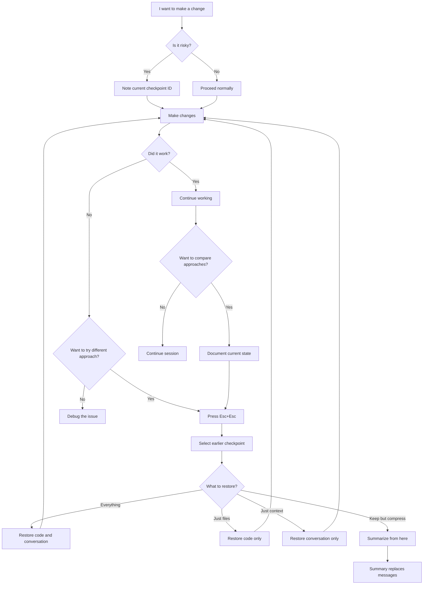
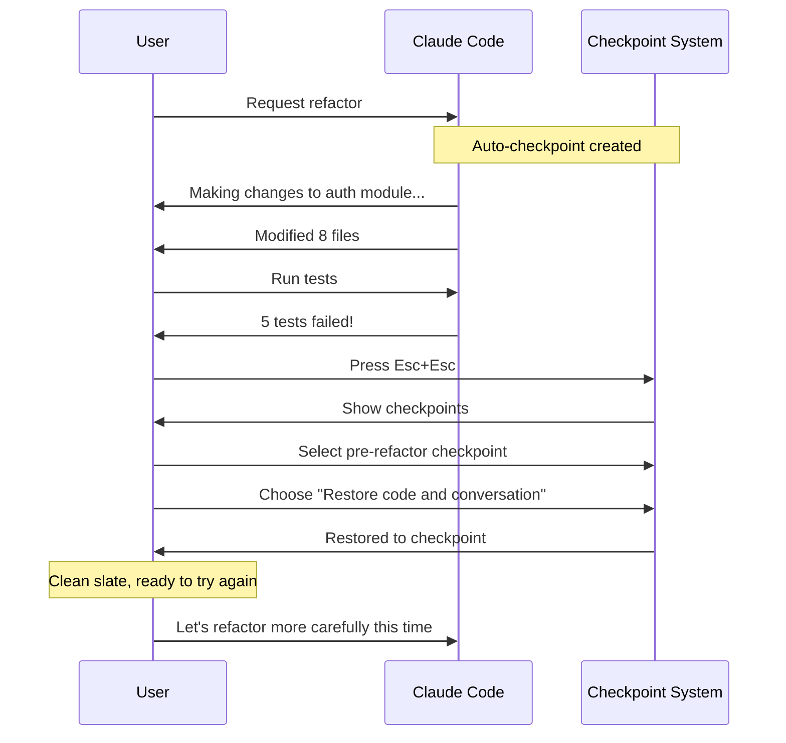
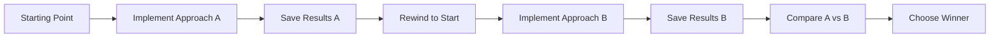
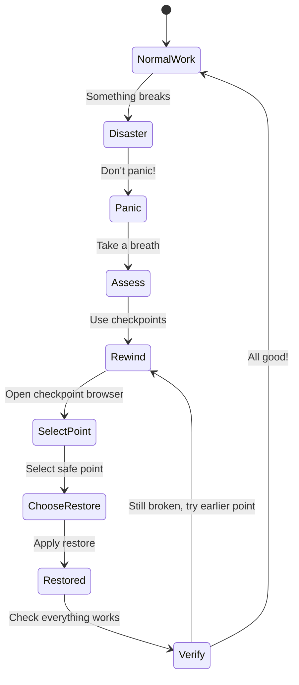
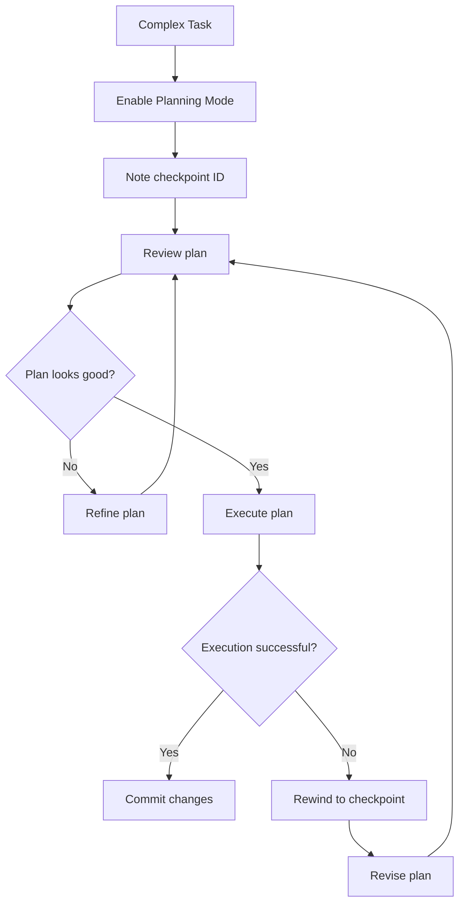
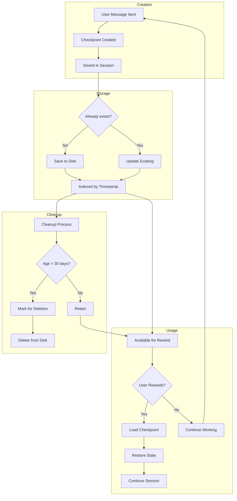
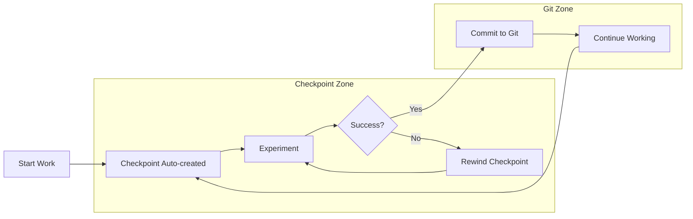

<picture>
  <source media="(prefers-color-scheme: dark)" srcset="../resources/logos/claude-howto-logo-dark.svg">
  
</picture>

> 🟢 **Beginner** | ⏱ 25 minutes
>
> ✅ Verified against Claude Code **v2.1.92** · Last verified: 2026-04-05

**What you'll build:** Save and restore conversation state.

# Checkpoints and Rewind

Your refactor just broke 3 things. The tests are failing. The API is returning 500 errors. And you can't remember exactly what you changed. Here's how checkpoints save you — one keystroke and you're back to the working state, ready to try a more careful approach.

Checkpoints allow you to save conversation state and rewind to previous points in your Claude Code session. This is invaluable for exploring different approaches, recovering from mistakes, or comparing alternative solutions.

---

## The "Oh No" Moment

We've all been there:

```
You: Refactor the auth module to use OAuth2

Claude: [Makes 47 changes across 12 files]

You: Run the tests

Claude: Tests failed. 23 assertions broken.
       Error in payment processing.
       Database connection lost.

You: ...what just happened?
```

Without checkpoints, you're stuck. You could spend hours debugging. Or you could undo everything and start over, losing any good changes mixed in with the bad.

**With checkpoints:**

```
You: [Press Esc twice] Rewind to before the refactor

Claude: Restored to checkpoint "auth-oauth2-start".
       All files reverted. Conversation restored.

You: Let's try that again, one module at a time.
```

This is the power of checkpoints — instant recovery from any "oh no" moment.

---

## What Are Checkpoints?

Checkpoints are snapshots of your conversation state, including:

| Component | What's Captured |
|-----------|-----------------|
| **Messages** | All user and assistant messages exchanged |
| **Files** | All file modifications made during the session |
| **Tools** | Complete history of tool invocations |
| **Context** | Session metadata and state |

Think of checkpoints as "save points" in a game. At any moment, you can load a previous save and try a different path.

---

## Key Concepts

| Concept | Description |
|---------|-------------|
| **Checkpoint** | Snapshot of conversation state including messages, files, and context |
| **Rewind** | Return to a previous checkpoint, discarding subsequent changes |
| **Branch Point** | Checkpoint from which multiple approaches are explored |
| **Recovery Point** | A checkpoint you create before risky operations |

---

## Accessing Checkpoints

You can access and manage checkpoints in two primary ways:

### Using Keyboard Shortcut

Press `Esc` twice (`Esc` + `Esc`) to open the checkpoint interface and browse saved checkpoints.

### Using Slash Command

Use the `/rewind` command (alias: `/checkpoint`) for quick access:

```bash
# Open rewind interface
/rewind

# Or use the alias
/checkpoint
```

---

## Checkpoint Strategy Decision Tree

When should you create checkpoints? When should you rewind? This decision tree guides you through the checkpoint workflow:



---

## Rewind Options Explained

When you rewind, you're presented with five options. Understanding each one helps you choose the right recovery strategy:

### 1. Restore Code and Conversation

**Use when:** You want a complete reset to a known-good state.

```
Before: Checkpoint A (working state)
        ↓
        Changes made (broken state)
        
After:  Checkpoint A restored
        Files: Reverted
        Messages: Reverted
        Tool history: Reverted
```

This is your "nuclear option" — complete rollback to a saved point.

### 2. Restore Conversation Only

**Use when:** You want to reset the context but keep your file changes.

```
Scenario: You made good code changes but the conversation
          got confused or went down a wrong path.

Result:   Files stay as they are
          Conversation resets to checkpoint
          You can re-explain requirements with clean context
```

### 3. Restore Code Only

**Use when:** The conversation was helpful but the code changes broke something.

```
Scenario: Claude figured out the architecture but the 
          implementation has bugs.

Result:   Files revert to checkpoint state
          Conversation history preserved
          You can refer back to the reasoning
```

### 4. Summarize From Here

**Use when:** The conversation is too long and you want to compress history.

```
Scenario: You've been working for 2 hours, the context
          is bloated, but you don't want to lose everything.

Result:   Claude generates a summary of conversation
          Summary replaces messages from checkpoint forward
          Original messages preserved in transcript
          Context window freed up
```

You can optionally provide instructions to focus the summary:

```
User: Summarize from here, focusing on the API design decisions
```

### 5. Never Mind

**Use when:** You opened the rewind menu by accident or changed your mind.

```
Result: Returns to current state with no changes
```

---

## Automatic Checkpoints

Claude Code automatically creates checkpoints for you:

| Trigger | Behavior |
|---------|----------|
| Every user prompt | New checkpoint created automatically |
| Session persistence | Checkpoints saved across sessions |
| Auto-cleanup | Checkpoints older than 30 days removed |

This means you can always rewind to any previous point in your conversation, from a few minutes ago to days before.

### Configuration

You can toggle automatic checkpoints in your settings:

```json
{
  "autoCheckpoint": true
}
```

- `autoCheckpoint`: Enable or disable automatic checkpoint creation on every user prompt (default: `true`)

---

## Workflow Templates

Here are three ready-to-use checkpoint workflows for common scenarios.

### Template 1: Safe Refactoring Workflow

Use this workflow when making significant changes to existing code.



**Try It Now:**

Context: You're about to make a potentially risky change to your authentication module.

1. Start a potentially risky operation:
   ```
   You: Refactor the database layer to use connection pooling
   ```

2. If something goes wrong, press `Esc` twice and select the checkpoint before the refactor.

3. Choose "Restore code and conversation" for a clean slate.

Expected Output: All changes reverted, conversation reset to pre-refactor state.

### Template 2: A/B Testing Workflow

Use this workflow when you want to compare two different approaches.



**Step-by-step:**

1. **Document your starting checkpoint:**
   ```
   You: I'm at checkpoint "feature-start-001"
   Claude: Noted. Current state saved.
   ```

2. **Implement Approach A:**
   ```
   You: Implement caching with Redis
   Claude: [Implements Redis caching]
   
   You: Run benchmarks
   Claude: Average response time: 45ms
   ```

3. **Save your results:**
   ```
   You: Document: Redis approach gives 45ms response time
   ```

4. **Rewind and try Approach B:**
   ```
   You: [Press Esc+Esc, rewind to "feature-start-001"]
   You: Implement caching with in-memory cache
   Claude: [Implements in-memory caching]
   
   You: Run benchmarks
   Claude: Average response time: 12ms
   ```

5. **Compare and choose:**
   ```
   You: In-memory is 3x faster. Let's go with that.
   ```

**Try It Now:**

Context: You need to compare two different sorting algorithms for your data processing pipeline.

```
You: I want to compare two sorting algorithms. 
     Current checkpoint is my baseline.

Claude: Ready to implement first algorithm.

You: Implement quicksort and run the benchmark suite.

[Claude runs benchmark, reports results]

You: Great, results saved. Now I'll rewind and try mergesort.

[Press Esc+Esc, rewind to baseline]

You: Implement mergesort and run the same benchmark.
```

Expected Output: Two benchmark results to compare, no code conflicts.

### Template 3: Disaster Recovery Workflow

Use this workflow when something has gone terribly wrong.



**Recovery Protocol:**

1. **Don't panic.** Checkpoints have you covered.

2. **Assess the damage:**
   ```
   You: What just broke?
   Claude: The deployment failed, 3 services are down,
           and the database migration rolled back partially.
   ```

3. **Open checkpoint browser:**
   ```
   Press Esc+Esc (or /rewind)
   ```

4. **Select a known-good checkpoint:**
   - Look for checkpoints before the risky operation
   - Check timestamps to find the right one
   - "Restore code and conversation" for full rollback

5. **Verify recovery:**
   ```
   You: Run the test suite
   Claude: All 847 tests passing.
   ```

6. **Document what happened:**
   ```
   You: Note for future: Don't run migrations during peak traffic.
   ```

---

## Integration with Planning Mode

Planning Mode and Checkpoints work together as a powerful combination for complex tasks.

### How They Complement Each Other

| Feature | Planning Mode | Checkpoints |
|---------|---------------|-------------|
| **Purpose** | Structure approach before execution | Recover if execution fails |
| **When to use** | Before starting complex work | When something goes wrong |
| **Scope** | Future actions | Past states |
| **Visibility** | Shows what will happen | Shows what happened |

### Recommended Workflow



### Example: Planning + Checkpoints in Action

```
You: /plan Refactor the authentication system to support 
     multi-tenancy. This is complex and touches 20+ files.

Claude: [Planning Mode enabled]
        Creating implementation plan...
        
        Plan:
        1. Update User model for tenant association
        2. Modify auth middleware for tenant context
        3. Update session management
        4. Migrate existing data
        5. Update tests
        
        Note: Current checkpoint is "auth-multitenant-start"

You: Plan approved. Execute.

Claude: [Executes plan step by step]
        Step 1 complete...
        Step 2 complete...
        Step 3 failed! Migration error.

You: [Press Esc+Esc] Rewind to "auth-multitenant-start"

Claude: Restored to checkpoint. 
        The issue was in step 3 - let's adjust the plan.

You: /plan Revise step 3 to handle the migration error

Claude: [Planning Mode enabled]
        Revised plan for step 3...
```

### Key Integration Points

1. **Before Planning:** Note your checkpoint ID
2. **During Planning:** Reference the checkpoint for rollback
3. **After Planning:** If plan fails, rewind and revise

---

## Checkpoint Lifecycle

Understanding the full lifecycle helps you use checkpoints effectively.



---

## Try It Now: Checkpoint Explorer

**Goal:** Familiarize yourself with the checkpoint interface and understand what information is available.

Context: You want to see what checkpoints exist in your current session and learn what details they contain.

1. Open the checkpoint browser:
   ```
   Press Esc twice (Esc + Esc)
   ```
   
   Or use the slash command:
   ```
   /rewind
   ```

2. Browse the checkpoint list:
   - Note the timestamps for each checkpoint
   - Look at the number of messages at each point
   - See which files were modified

3. Select a checkpoint (don't restore yet):
   - Read the checkpoint details
   - See what tools were used
   - Understand the scope of changes

4. Cancel and return:
   - Choose "Never mind" to return without changes

Expected Output: You should see a list of checkpoints with timestamps and details. No changes made to your session.

**Pro tip:** Get in the habit of opening the checkpoint browser periodically to understand what recovery points are available. This builds muscle memory for when you actually need to rewind.

---

### Lifecycle Stages

| Stage | Description | Duration |
|-------|-------------|----------|
| **Creation** | Auto-created with each user prompt | Instant |
| **Active** | Available for rewind operations | Session lifetime |
| **Retention** | Stored for future sessions | Up to 30 days |
| **Cleanup** | Automatically removed after 30 days | Scheduled |

### What's Captured at Each Checkpoint

```
Checkpoint "auth-refactor-start" created at 2024-01-15 14:23:45
├── Messages: 47 (user: 23, assistant: 24)
├── Files Modified: 8
│   ├── src/auth/login.ts (modified)
│   ├── src/auth/middleware.ts (modified)
│   ├── src/models/user.ts (modified)
│   └── ...
├── Tools Used: Edit (23), Bash (8), Read (15)
└── Session Context: Available
```

---

## Try It Now: Hands-On Exercises

### Exercise 1: Basic Rewind

**Goal:** Experience the checkpoint workflow firsthand.

Context: You want to understand how checkpoints work by making a reversible change.

1. Make a change:
   ```
   You: Add a comment to the top of README.md that says "Temporary test"
   ```

2. Verify the change:
   ```
   You: Read the first line of README.md
   Claude: "Temporary test" is at the top.
   ```

3. Rewind:
   - Press `Esc` twice
   - Select the checkpoint from before step 1
   - Choose "Restore code and conversation"

4. Verify the rewind:
   ```
   You: Read the first line of README.md
   Claude: The original first line is back.
   ```

Expected Output: After step 2, the comment is visible. After step 4, the comment is gone and original content is restored.

### Exercise 2: Branching Exploration

**Goal:** Use checkpoints to explore two different approaches.

Context: You're designing a button component and want to compare styling options.

1. Note your starting point:
   ```
   You: I'm at checkpoint "exploration-base". I want to try 
        two different button styles.
   ```

2. Implement Style A:
   ```
   You: Style the button with a gradient background
   Claude: [Adds gradient CSS]
   ```

3. Document results:
   ```
   You: Style A: Gradient background applied
   ```

4. Rewind and try Style B:
   ```
   [Press Esc+Esc, rewind to "exploration-base"]
   
   You: Style the button with a solid color and shadow
   Claude: [Adds solid color CSS]
   ```

5. Compare:
   ```
   You: Which style looks better for our brand?
   Claude: I can describe both if you remind me what 
           Style A looked like...
   ```

Expected Output: You have two different implementations to choose from, no code conflicts because each was tested independently.

### Exercise 3: Recovery Practice

**Goal:** Practice recovering from a "broken" state.

Context: You accidentally made a destructive change and need to recover quickly.

1. Create a deliberate problem:
   ```
   You: Delete the entire src/ directory
   Claude: [Deletes src/ directory]
   ```

2. Panic (just kidding):
   ```
   You: Oh no! I need that back!
   ```

3. Recover:
   ```
   [Press Esc+Esc]
   [Select checkpoint before the deletion]
   [Choose "Restore code only"]
   ```

4. Verify:
   ```
   You: List files in src/
   Claude: All files restored.
   ```

Expected Output: Directory restored to pre-deletion state, no permanent damage.

---

## Patterns & Recipes

### Pattern 1: Branching Exploration

**When to use:** Comparing multiple implementation approaches.

**Recipe:**

```
1. Document starting checkpoint
2. Implement Approach A
3. Record results/metrics
4. Rewind to start
5. Implement Approach B
6. Record results/metrics
7. Compare and choose winner
```

**Example:**

```markdown
# Comparison: Database Connection Strategies

## Baseline Checkpoint: "db-optimization-start"

### Approach A: Connection Pooling
- Checkpoint: "db-pooling-complete"
- Connection time: 2ms avg
- Memory: +15MB
- Complexity: Low

### Approach B: Connection Multiplexing
- Checkpoint: "db-multiplex-complete"
- Connection time: 1.5ms avg
- Memory: +8MB
- Complexity: Medium

## Decision: Approach B
- 25% faster connections
- Lower memory footprint
- Complexity acceptable for our use case
```

### Pattern 2: Safe Refactoring

**When to use:** Making significant changes to existing code.

**Recipe:**

```
1. Run tests, ensure passing
2. Note checkpoint ID
3. Make small, focused change
4. Run tests immediately
5. If failing: rewind, adjust approach
6. If passing: commit, note new checkpoint
7. Repeat for next change
```

**Example:**

```
You: All tests passing. Checkpoint: "refactor-step-0"

You: Extract the validation logic into a separate function
Claude: [Extracts validation to validateInput()]

You: Run tests
Claude: 3 tests failing in validation module

You: [Rewind to "refactor-step-0"]

You: Let's extract it differently - keep the signature the same
Claude: [Extracts with same signature]

You: Run tests
Claude: All tests passing. Checkpoint: "refactor-step-1"

You: Great, commit this step and continue.
```

### Pattern 3: Recovery Protocol

**When to use:** Something has gone wrong and you need to recover.

**Recipe:**

```
1. Stop! Don't make more changes.
2. Assess: What's broken?
3. Open checkpoint browser (Esc+Esc)
4. Find last known-good checkpoint
5. Choose appropriate restore option:
   - "Code and conversation" for full rollback
   - "Code only" if conversation was helpful
   - "Conversation only" if code is fine
6. Verify recovery with tests
7. Document what went wrong
8. Resume with revised approach
```

**Example Recovery Log:**

```markdown
# Recovery Log: 2024-01-15

## Incident
- Attempted: Database schema migration during peak traffic
- Result: Connection pool exhausted, 500 errors
- Checkpoint: "pre-migration-stable"

## Recovery
- Rewound to: "pre-migration-stable"
- Restore type: Code and conversation
- Verification: All health checks passing

## Lessons Learned
- Never migrate during peak hours
- Add connection pool monitoring
- Test migration on staging first

## Next Steps
- Schedule migration for off-peak hours
- Add rollback procedure to runbook
```

### Pattern 4: Incremental Checkpoint Naming

**When to use:** Complex multi-step operations.

**Recipe:**

```
1. Before each major step, note the checkpoint
2. Use descriptive labels in your messages:
   "Checkpoint: step-1-models-complete"
   "Checkpoint: step-2-routes-complete"
   "Checkpoint: step-3-tests-passing"
3. If step 3 fails, rewind to step 2
```

**Example:**

```
You: Starting feature implementation.
     Checkpoint: "feature-start"

Claude: [Implements models]
        Models created and migrated.

You: Tests passing. Checkpoint: "feature-models-done"

Claude: [Implements routes]
        Routes added.

You: Tests passing. Checkpoint: "feature-routes-done"

Claude: [Implements controllers]
        Controllers added.

You: Tests failing! Rewind to "feature-routes-done"

Claude: [Restored] What went wrong with the controllers?

You: Let's implement them more carefully this time.
```

### Pattern 5: Checkpoint as Documentation

**When to use:** Collaborating or documenting decision points.

**Recipe:**

```
1. At key decision points, note the checkpoint
2. Record the decision made
3. If revisiting later, checkpoint serves as reference
```

**Example:**

```markdown
# Decision Log

## 2024-01-15: API Versioning Strategy

**Checkpoint:** "api-versioning-decision"

**Options considered:**
- A: URL path versioning (/v1/users)
- B: Query parameter versioning (/users?version=1)
- C: Header versioning (Accept: application/vnd.api.v1+json)

**Decision:** Option A - URL path versioning
**Rationale:** Simpler for clients, easier to cache

**To revisit:**
Rewind to checkpoint "api-versioning-decision" and 
try option B for comparison.
```

---

## Use Cases

| Scenario | Workflow |
|----------|----------|
| **Exploring Approaches** | Save → Try A → Save → Rewind → Try B → Compare |
| **Safe Refactoring** | Save → Refactor → Test → If fail: Rewind |
| **A/B Testing** | Save → Design A → Save → Rewind → Design B → Compare |
| **Mistake Recovery** | Notice issue → Rewind to last good state |
| **Long Running Tasks** | Checkpoint at milestones → Rewind if later steps fail |

---

## Using Checkpoints

### Viewing and Rewinding

Press `Esc` twice or use `/rewind` to open the checkpoint browser. You'll see a list of all available checkpoints with timestamps. Select any checkpoint to rewind to that state.

### Checkpoint Details

Each checkpoint shows:
- Timestamp of when it was created
- Files that were modified
- Number of messages in the conversation
- Tools that were used

---

## Practical Examples

### Example 1: Exploring Different Approaches

```
User: Let's add a caching layer to the API

Claude: I'll add Redis caching to your API endpoints...
[Makes changes at checkpoint A]

User: Actually, let's try in-memory caching instead

Claude: I'll rewind to explore a different approach...
[User presses Esc+Esc and rewinds to checkpoint A]
[Implements in-memory caching at checkpoint B]

User: Now I can compare both approaches
```

### Example 2: Recovering from Mistakes

```
User: Refactor the authentication module to use JWT

Claude: I'll refactor the authentication module...
[Makes extensive changes]

User: Wait, that broke the OAuth integration. Let's go back.

Claude: I'll help you rewind to before the refactoring...
[User presses Esc+Esc and selects the checkpoint before the refactor]

User: Let's try a more conservative approach this time
```

### Example 3: Safe Experimentation

```
User: Let's try rewriting this in a functional style
[Creates checkpoint before experiment]

Claude: [Makes experimental changes]

User: The tests are failing. Let's rewind.
[User presses Esc+Esc and rewinds to the checkpoint]

Claude: I've rewound the changes. Let's try a different approach.
```

### Example 4: Branching Approaches

```
User: I want to compare two database designs
[Takes note of checkpoint - call it "Start"]

Claude: I'll create the first design...
[Implements Schema A]

User: Now let me go back and try the second approach
[User presses Esc+Esc and rewinds to "Start"]

Claude: Now I'll implement Schema B...
[Implements Schema B]

User: Great! Now I have both schemas to choose from
```

### Example 5: Incremental Feature Development

```
User: I'm building a new feature. Checkpoint: "feature-start"

Claude: [Implements step 1: Models]
        Models created.

User: Tests passing. Checkpoint: "feature-step-1"

Claude: [Implements step 2: API routes]
        Routes created.

User: Tests passing. Checkpoint: "feature-step-2"

Claude: [Implements step 3: Frontend]
        UI created.

User: Integration tests failing! Rewind to "feature-step-2"

Claude: [Restored] The issue was in the API contract.
        Let's fix that.

User: Good. Tests passing. Checkpoint: "feature-step-3"
```

---

## Checkpoint Retention

Claude Code automatically manages your checkpoints:

| Policy | Details |
|--------|---------|
| Creation | Automatic with every user prompt |
| Retention | Up to 30 days |
| Cleanup | Automatic deletion of old checkpoints |
| Storage | Local disk in Claude Code data directory |

---

## Workflow Patterns

### Branching Strategy for Exploration

When exploring multiple approaches:

```
1. Start with initial implementation → Checkpoint A
2. Try Approach 1 → Checkpoint B
3. Rewind to Checkpoint A
4. Try Approach 2 → Checkpoint C
5. Compare results from B and C
6. Choose best approach and continue
```

### Safe Refactoring Pattern

When making significant changes:

```
1. Current state → Checkpoint (auto)
2. Start refactoring
3. Run tests
4. If tests pass → Continue working
5. If tests fail → Rewind and try different approach
```

---

## Best Practices

Since checkpoints are created automatically, you can focus on your work without worrying about manually saving state. However, keep these practices in mind:

### Using Checkpoints Effectively

**Do:**
- Review available checkpoints before rewinding
- Use rewind when you want to explore different directions
- Keep checkpoints to compare different approaches
- Understand what each rewind option does (restore code and conversation, restore conversation, restore code, or summarize)
- Note checkpoint IDs at important milestones
- Document decisions made at each checkpoint

**Don't:**
- Rely on checkpoints alone for code preservation
- Expect checkpoints to track external file system changes
- Use checkpoints as a substitute for git commits
- Forget to verify after rewinding
- Skip testing after a rewind

### Workflow Best Practices

1. **Before Risky Operations:** Note your checkpoint ID
2. **After Milestones:** Verify tests pass, note checkpoint
3. **When Exploring:** Document results at each checkpoint
4. **When Stuck:** Rewind to last known-good state

---

## Limitations

Checkpoints have the following limitations:

| Limitation | Impact | Mitigation |
|------------|--------|------------|
| **Bash command changes NOT tracked** | Operations like `rm`, `mv`, `cp` on the filesystem are not captured | Use with caution; verify after rewind |
| **External changes NOT tracked** | Changes made outside Claude Code are not captured | Commit important changes to git |
| **Not a replacement for version control** | No collaboration, history, or branching features | Use git for permanent changes |
| **Session-scoped storage** | Not designed for long-term archival | Commit successful states to git |

### What Checkpoints Don't Capture

```
NOT captured:
├── Bash commands that modify filesystem (rm, mv, cp)
├── Changes made in your editor
├── Changes made in terminal outside Claude Code
├── Git operations (commit, push, pull)
└── Environment variable changes

CAPTURED:
├── All user messages
├── All assistant responses
├── File changes made via Edit/Write tools
├── Tool usage history
└── Session context
```

---

## Troubleshooting

### Missing Checkpoints

**Problem:** Expected checkpoint not found

**Solutions:**
1. Check if checkpoints were cleared (manual cleanup or settings)
2. Verify that `autoCheckpoint` is enabled in your settings
3. Check available disk space
4. Look for checkpoints with slightly different timestamps

**Debugging steps:**

```
You: /rewind

[Checkpoint list appears]

You: I don't see the checkpoint from 2 hours ago.

Claude: Checkpoints are listed by timestamp. 
        Let me help you find it...

[Scroll through the list or search by date]
```

### Rewind Failed

**Problem:** Cannot rewind to checkpoint

**Solutions:**
1. Ensure no uncommitted changes conflict with git
2. Check if checkpoint is corrupted (rare)
3. Try rewinding to a different checkpoint
4. Restart Claude Code and try again

**Error recovery:**

```
User: [Attempts to rewind]
Error: Rewind failed - file conflict detected

User: What do I do?

Claude: The file has been modified outside this session.
        Options:
        1. Commit or stash your external changes
        2. Try "Restore code only" to preserve conversation
        3. Try an earlier checkpoint
```

### Checkpoint Corruption (Rare)

**Problem:** Checkpoint data is corrupted or incomplete

**Solutions:**
1. Try a nearby checkpoint (before or after)
2. Check disk for errors
3. Restart Claude Code session
4. As a last resort, start fresh session

---

## Integration with Git

Checkpoints complement (but don't replace) git:

| Feature | Git | Checkpoints |
|---------|-----|-------------|
| **Scope** | File system | Conversation + files |
| **Persistence** | Permanent | Session-based (30 days) |
| **Granularity** | Commits | Any point |
| **Speed** | Slower (commit, push, pull) | Instant |
| **Sharing** | Yes (remote repos) | Limited (export) |
| **Branching** | Yes | Via rewind/try again |
| **History** | Full commit history | Recent session only |
| **Collaboration** | Multi-user | Single user |

### Recommended Integration Pattern

```
1. Use checkpoints for rapid experimentation
   ↓
2. When experiments succeed, commit to git
   ↓
3. Use git commits for permanent code changes
   ↓
4. Use git branches for long-running features
   ↓
5. Create checkpoint before git operations
   ↓
6. If git operation fails, rewind checkpoint
```

### Git + Checkpoints Workflow



---

## Quick Start Guide

### Basic Workflow

1. **Work normally** - Claude Code creates checkpoints automatically
2. **Want to go back?** - Press `Esc` twice or use `/rewind`
3. **Choose checkpoint** - Select from the list to rewind
4. **Select what to restore** - Choose from restore code and conversation, restore conversation, restore code, summarize from here, or cancel
5. **Continue working** - You're back at that point

### Keyboard Shortcuts

| Shortcut | Action |
|----------|--------|
| `Esc` + `Esc` | Open checkpoint browser |
| `/rewind` | Alternative way to access checkpoints |
| `/checkpoint` | Alias for `/rewind` |

### Quick Reference Card

```
┌─────────────────────────────────────────────────────┐
│ CHECKPOINT QUICK REFERENCE                          │
├─────────────────────────────────────────────────────┤
│ CREATE:  Automatic on every user message            │
│ VIEW:    Esc + Esc OR /rewind                       │
│ REWIND:  Select checkpoint → Choose restore type    │
│                                                     │
│ RESTORE OPTIONS:                                    │
│   • Code + Conversation: Full reset                 │
│   • Conversation only: Reset context, keep files   │
│   • Code only: Reset files, keep context           │
│   • Summarize: Compress history                    │
│                                                     │
│ BEST PRACTICES:                                     │
│   • Note checkpoints at milestones                  │
│   • Verify after rewinding                          │
│   • Use git for permanent changes                   │
│                                                     │
│ LIMITATIONS:                                        │
│   • Bash changes not tracked                        │
│   • External changes not tracked                    │
│   • Not a git replacement                           │
└─────────────────────────────────────────────────────┘
```

---

## Knowing When to Rewind: Context Monitoring

Checkpoints let you go back — but how do you know *when* you should? As your conversation grows, Claude's context window fills up and model quality silently degrades. You might be shipping code from a half-blind model without realizing it.

**[cc-context-stats](https://github.com/luongnv89/cc-context-stats)** solves this by adding real-time **context zones** to your Claude Code status bar. It tracks where you are in the context window — from **Plan** (green, safe to plan and code) through **Code** (yellow, avoid starting new plans) to **Dump** (orange, finish up and rewind). When you see the zone shift, you know it's time to checkpoint and start fresh instead of pushing through with degraded output.

### Context Zone Indicators

| Zone | Context Usage | Recommendation |
|------|---------------|----------------|
| **Plan** (Green) | 0-50% | Safe for planning and complex tasks |
| **Code** (Yellow) | 50-80% | Avoid starting new long tasks |
| **Dump** (Orange) | 80-100% | Finish current work, rewind soon |

### Using Context Stats with Checkpoints

```
1. Start complex task in "Plan" zone
2. Work through "Code" zone
3. As you approach "Dump" zone:
   a. Finish current thought
   b. Note checkpoint ID
   c. Start fresh session
   d. Reference old checkpoint if needed
```

---

## Related Concepts

- **[Advanced Features](../09-advanced-features/)** - Planning mode and other advanced capabilities
- **[Memory Management](../02-memory/)** - Managing conversation history and context
- **[Slash Commands](../01-slash-commands/)** - User-invoked shortcuts
- **[Hooks](../06-hooks/)** - Event-driven automation
- **[Plugins](../07-plugins/)** - Bundled extension packages

---

## Additional Resources

- [Official Checkpointing Documentation](https://code.claude.com/docs/en/checkpointing)
- [Advanced Features Guide](../09-advanced-features/) - Extended thinking and other capabilities
- [Context Stats Tool](https://github.com/luongnv89/cc-context-stats) - Real-time context monitoring

---

## Summary

Checkpoints are an automatic feature in Claude Code that lets you safely explore different approaches without fear of losing work. Every user prompt creates a new checkpoint automatically, so you can rewind to any previous point in your session.

### Key Benefits

| Benefit | Description |
|---------|-------------|
| **Experiment Fearlessly** | Try multiple approaches without risk |
| **Recover Quickly** | One keystroke back to working state |
| **Compare Solutions** | Side-by-side evaluation of alternatives |
| **Integrate with Git** | Checkpoints for experimentation, git for permanence |

### The Checkpoint Mindset

```
WITHOUT CHECKPOINTS:
  Make change → Hope it works → Debug if broken → Panic

WITH CHECKPOINTS:
  Note checkpoint → Make change → Test → 
  If works: Continue → 
  If fails: Rewind → Try different approach
```

### Remember

- Checkpoints are automatic — no manual saving needed
- Press `Esc` twice to access any checkpoint
- Choose the right restore option for your situation
- Use checkpoints for rapid experimentation
- Use git commits for permanent code changes
- The best checkpoint is the one you created before you needed it

---

*Checkpoints: Because "undo" isn't enough when you need to explore multiple futures.*