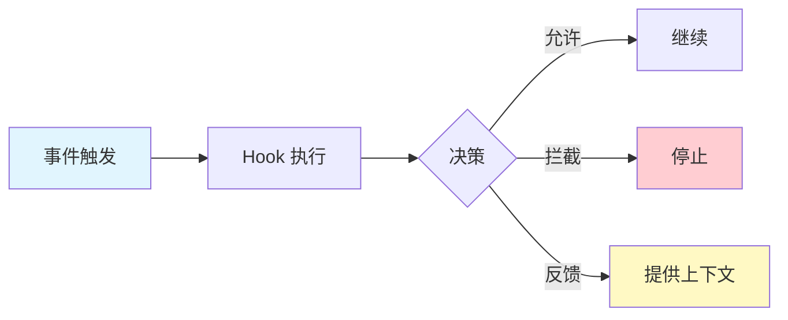

<picture>
  <source media="(prefers-color-scheme: dark)" srcset="../resources/logos/claude-howto-logo-dark.svg">
  
</picture>

> 🟡 **中级** | ⏱ 70 分钟
>
> ✅ 已验证 Claude Code **v2.1.92** · 最后验证：2026-04-06

**你将构建：** 通过事件驱动脚本自动化工作流，让重复操作不再占用你的心智带宽。

---

## 为什么需要这个？

"我希望某些操作能自动执行"

这是每个开发者的心声。你刚写完代码，忘了格式化，提交后 CI 红了。你刚保存了文件，忘了运行 lint，20 分钟后才发现问题。你刚结束一个会话，想通知队友进度，却忘了发消息。

这些"忘了"不是你的错——人类不该记住这些机械操作。Hooks 就是解决方案：它们在你思考时默默执行，在你忘记时自动补救，在你忙碌时代替你发送通知。

**没有 Hooks 的痛苦循环：**

```
编写代码 → 提交 → 推送 → CI 启动 → 5 分钟安装 → 10 分钟构建 → 5 分钟测试 → 失败 → 修复 → 重复
```

**有了 Hooks：**

```
编写代码 → Hook 运行 → 2 秒 → 立即修复 → 提交干净代码 → CI 通过
```

Hooks 将验证从"事后"转变为"你还在思考时"。它们在提交前捕获密钥，在切换文件前格式化代码，在执行危险命令前拦截。

---

## 核心概念

Hooks 是事件驱动的自动化脚本。当 Claude Code 中发生特定事件时，Hook 自动执行并响应。

### 事件驱动模型



**四个关键要素：**

| 要素 | 说明 |
|------|------|
| **事件** | 什么时候触发（保存文件、执行命令、结束会话） |
| **匹配器** | 匹配哪些操作（Write、Edit、Bash） |
| **Hook 类型** | 怎么执行（命令、提示、HTTP、智能体） |
| **输出** | 做什么（允许、拦截、提供反馈） |

### Hook 类型

| 类型 | 用途 | 示例 |
|------|------|------|
| **command** | Shell 命令执行 | 格式化、lint、安全扫描 |
| **prompt** | LLM 评估 | 任务完成检查、质量评估 |
| **http** | Webhook 调用 | 外部系统集成 |
| **agent** | 子智能体验证 | 复杂条件评估 |

### 退出码含义

| 退出码 | 含义 | 效果 |
|--------|------|------|
| **0** | 成功 | 继续执行，解析 JSON 输出 |
| **2** | 拦截 | 停止操作，显示错误信息 |
| **其他** | 错误 | 继续执行，仅在详细模式显示警告 |

---

## 场景 1：保存后自动格式化

**问题：** 你写完代码忘记格式化，提交后 CI 报错，浪费 20 分钟等待反馈。

**目标：** 每次保存文件时自动运行格式化工具，确保代码风格一致。

### 创建 Hook 脚本

**步骤 1：创建 hooks 目录**

```bash
mkdir -p .claude/hooks
```

**步骤 2：创建自动格式化脚本**

`.claude/hooks/auto-format.sh`：

```bash
#!/bin/bash
# auto-format.sh - 保存后自动格式化代码
# Hook: PostToolUse (Write|Edit)
# 从 stdin 接收 JSON 输入

set -euo pipefail

INPUT=$(cat)
FILE_PATH=$(echo "$INPUT" | jq -r '.tool_input.file_path // empty')
TOOL_NAME=$(echo "$INPUT" | jq -r '.tool_name // empty')

# 只处理 Write 和 Edit 工具
if [[ "$TOOL_NAME" != "Write" && "$TOOL_NAME" != "Edit" ]]; then
  exit 0
fi

# 跳过不存在或无路径的文件
[[ -z "$FILE_PATH" || ! -f "$FILE_PATH" ]] && exit 0

log() {
  echo "[Hook:format] $1" >&2
}

# 根据文件扩展名选择格式化工具
case "$FILE_PATH" in
  *.ts|*.tsx|*.js|*.jsx|*.json|*.md|*.yaml|*.yml|*.css|*.scss)
    if command -v prettier &>/dev/null; then
      prettier --write "$FILE_PATH" 2>/dev/null && log "已格式化 (prettier): $FILE_PATH"
    fi
    ;;
  *.py)
    if command -v black &>/dev/null; then
      black "$FILE_PATH" 2>/dev/null && log "已格式化 (black): $FILE_PATH"
    elif command -v autopep8 &>/dev/null; then
      autopep8 --in-place "$FILE_PATH" && log "已格式化 (autopep8): $FILE_PATH"
    fi
    ;;
  *.go)
    if command -v gofmt &>/dev/null; then
      gofmt -w "$FILE_PATH" && log "已格式化 (gofmt): $FILE_PATH"
    fi
    ;;
  *.rs)
    if command -v rustfmt &>/dev/null; then
      rustfmt "$FILE_PATH" && log "已格式化 (rustfmt): $FILE_PATH"
    fi
    ;;
esac

exit 0
```

**步骤 3：设置执行权限**

```bash
chmod +x .claude/hooks/auto-format.sh
```

### 配置 Hook

在 `.claude/settings.json` 中添加配置：

```json
{
  "hooks": {
    "PostToolUse": [
      {
        "matcher": "Write|Edit",
        "hooks": [
          {
            "type": "command",
            "command": "$CLAUDE_PROJECT_DIR/.claude/hooks/auto-format.sh",
            "timeout": 30
          }
        ]
      }
    ]
  }
}
```

### 验证效果

让 Claude 创建一个 TypeScript 文件：

```
> 创建 utils.ts，包含 formatDate 函数

[Hook:format] 已格式化 (prettier): utils.ts  ← Hook 自动运行！
```

**你收获了什么：**
- 每个文件在保存时自动格式化
- 不再需要手动运行格式化命令
- CI 不会因为格式问题失败
- 零心智负担——它自动发生

---

## 场景 2：提交前自动检查

**问题：** Claude 建议了一个危险的命令（如 `rm -rf /`），如果执行可能造成灾难性后果。

**目标：** 在执行 Bash 命令前自动拦截危险操作，保护你的系统。

### 创建安全验证 Hook

**步骤 1：创建验证脚本**

`.claude/hooks/security-validator.sh`：

```bash
#!/bin/bash
# security-validator.sh - 拦截危险的 Bash 命令
# Hook: PreToolUse (Bash)
# 退出码 2 = 拦截操作

set -euo pipefail

INPUT=$(cat)
CMD=$(echo "$INPUT" | jq -r '.tool_input.command // empty')

log() {
  echo "[Hook:security] $1" >&2
}

# 危险命令模式 - 这些会被拦截（退出码 2）
BLOCKED_PATTERNS=(
  'rm -rf /'
  'rm -rf ~'
  'rm -rf /*'
  'sudo rm -rf'
  'dd if=/dev/zero'
  'dd if=/dev/urandom'
  ':(){ :|:& };:'         # Fork bomb
  'mkfs'
  'git push --force main'
  'git push --force master'
  'git push --force origin main'
  'git push --force origin master'
  'DROP DATABASE'
  'TRUNCATE TABLE'
  'kubectl delete namespace'
  'kubectl delete all'
  'terraform destroy'
)

# 检查危险模式
for pattern in "${BLOCKED_PATTERNS[@]}"; do
  if [[ "$CMD" == *"$pattern"* ]]; then
    log "拦截危险命令: $pattern"
    log "完整命令: $CMD"
    exit 2  # 退出码 2 = 拦截操作
  fi
done

# 警告但允许的模式
WARN_PATTERNS=(
  'git reset --hard'
  'npm publish'
  'docker system prune'
)

for pattern in "${WARN_PATTERNS[@]}"; do
  if [[ "$CMD" == *"$pattern"* ]]; then
    log "警告: 有风险的操作 - $pattern"
    # 继续执行但 Claude 看到警告
  fi
done

log "安全检查通过"
exit 0
```

**步骤 2：设置执行权限**

```bash
chmod +x .claude/hooks/security-validator.sh
```

### 配置 Hook

```json
{
  "hooks": {
    "PreToolUse": [
      {
        "matcher": "Bash",
        "hooks": [
          {
            "type": "command",
            "command": "$CLAUDE_PROJECT_DIR/.claude/hooks/security-validator.sh",
            "timeout": 10
          }
        ]
      }
    ]
  }
}
```

### 验证效果

尝试让 Claude 执行危险命令：

```
> 运行 rm -rf /tmp/old-files

[Hook:security] 拦截危险命令: rm -rf /
[Hook:security] 完整命令: rm -rf /tmp/old-files

操作被拦截！Claude 无法执行此命令。
```

**你收获了什么：**
- 危险命令自动拦截
- 不用担心误操作造成灾难
- 有风险的命令收到警告
- 安全边界自动守护

---

## 场景 3：会话结束时自动通知

**问题：** 你完成了一个复杂的任务，想通知队友进度，但总是忘记发送消息。

**目标：** 会话结束时自动发送通知（桌面提醒、Slack、邮件）。

### 创建通知 Hook

**步骤 1：创建通知脚本**

`.claude/hooks/session-notify.sh`：

```bash
#!/bin/bash
# session-notify.sh - 会话结束时发送通知
# Hook: SessionEnd 或 Stop

set -euo pipefail

INPUT=$(cat)
SESSION_ID=$(echo "$INPUT" | jq -r '.session_id // empty')
CWD=$(echo "$INPUT" | jq -r '.cwd // empty')
REASON=$(echo "$INPUT" | jq -r '.reason // empty')

log() {
  echo "[Hook:notify] $1" >&2
}

# 桌面通知（macOS/Linux）
desktop_notify() {
  local title="Claude Code 会话结束"
  local message="任务完成于: $(basename "$CWD")"

  if [[ "$(uname)" == "Darwin" ]]; then
    osascript -e 'display notification "'"$message"'" with title "'"$title"'"' 2>/dev/null || true
  elif [[ "$(uname)" == "Linux" ]]; then
    notify-send "$title" "$message" 2>/dev/null || true
  fi
}

# Slack 通知（可选，需设置 SLACK_WEBHOOK_URL 环境变量）
slack_notify() {
  local webhook="${SLACK_WEBHOOK_URL:-}"
  [[ -z "$webhook" ]] && return

  local project=$(basename "$CWD")

  curl -X POST "$webhook" \
    -H 'Content-Type: application/json' \
    -d '{"text": "Claude Code 会话结束于 *'"$project"'*"}' \
    --silent --max-time 5 || true

  log "Slack 通知已发送"
}

# 主流程
log "会话结束: $REASON"
desktop_notify
slack_notify

exit 0
```

**步骤 2：设置执行权限**

```bash
chmod +x .claude/hooks/session-notify.sh
```

### 配置 Hook

```json
{
  "hooks": {
    "Stop": [
      {
        "hooks": [
          {
            "type": "command",
            "command": "$CLAUDE_PROJECT_DIR/.claude/hooks/session-notify.sh"
          }
        ]
      }
    ],
    "SessionEnd": [
      {
        "hooks": [
          {
            "type": "command",
            "command": "$CLAUDE_PROJECT_DIR/.claude/hooks/session-notify.sh"
          }
        ]
      }
    ]
  }
}
```

### 验证效果

当你完成任务并结束会话时：

```
会话结束...

[Hook:notify] 会话结束: clear
[Hook:notify] Slack 通知已发送

桌面弹出通知："任务完成于: my-project"
```

**你收获了什么：**
- 任务完成自动通知队友
- 桌面提醒让你知道会话状态
- Slack 消息自动发送
- 不再忘记同步进度

---

## 完整 Hook 事件列表

Claude Code 支持 **25 个 Hook 事件**：

| 事件 | 触发时机 | 可拦截 | 常见用途 |
|------|----------|--------|----------|
| **PreToolUse** | 工具执行前 | 是 | 验证输入、拦截危险操作 |
| **PostToolUse** | 工具成功后 | 否 | 格式化、日志、安全扫描 |
| **PostToolUseFailure** | 工具失败后 | 否 | 错误恢复、清理 |
| **UserPromptSubmit** | 用户提交提示 | 是 | 验证提示内容 |
| **PermissionRequest** | 权限对话框 | 是 | 自动批准/拒绝 |
| **Stop** | Claude 完成响应 | 是 | 任务完成检查 |
| **SessionStart** | 会话开始 | 否 | 环境设置 |
| **SessionEnd** | 会话结束 | 否 | 清理、通知 |
| **SubagentStart** | 子智能体启动 | 否 | 子智能体设置 |
| **SubagentStop** | 子智能体完成 | 是 | 结果验证 |
| **FileChanged** | 监听文件变更 | 否 | 文件监控、重建 |
| **CwdChanged** | 工作目录变更 | 否 | 目录特定设置 |

完整事件列表请参考 [官方文档](https://code.claude.com/docs/en/hooks)。

---

## Hook 输入输出格式

### JSON 输入（通过 stdin）

所有 Hooks 通过 stdin 接收 JSON：

```json
{
  "session_id": "abc123",
  "transcript_path": "/path/to/transcript.jsonl",
  "cwd": "/current/working/directory",
  "hook_event_name": "PreToolUse",
  "tool_name": "Write",
  "tool_input": {
    "file_path": "/path/to/file.js",
    "content": "..."
  }
}
```

### JSON 输出（stdout）

退出码 0 时，stdout 中的 JSON 被解析：

```json
{
  "hookSpecificOutput": {
    "hookEventName": "PreToolUse",
    "permissionDecision": "allow",
    "permissionDecisionReason": "文件在允许目录中",
    "updatedInput": {
      "file_path": "/modified/path.js"
    }
  }
}
```

---

## 配置位置

Hooks 可以配置在多个位置：

| 位置 | 作用范围 | 提交建议 |
|------|----------|----------|
| `~/.claude/settings.json` | 用户全局 | 不提交 |
| `.claude/settings.json` | 项目共享 | 可提交 |
| `.claude/settings.local.json` | 本地环境 | 不提交 |
| 插件 `hooks/hooks.json` | 插件范围 | 随插件提交 |
| Skill/Agent frontmatter | 组件生命周期 | 随组件提交 |

---

## 完整配置示例

结合三个场景的完整配置：

```json
{
  "hooks": {
    "PreToolUse": [
      {
        "matcher": "Bash",
        "hooks": [
          {
            "type": "command",
            "command": "$CLAUDE_PROJECT_DIR/.claude/hooks/security-validator.sh",
            "timeout": 10
          }
        ]
      }
    ],
    "PostToolUse": [
      {
        "matcher": "Write|Edit",
        "hooks": [
          {
            "type": "command",
            "command": "$CLAUDE_PROJECT_DIR/.claude/hooks/auto-format.sh",
            "timeout": 30
          }
        ]
      }
    ],
    "Stop": [
      {
        "hooks": [
          {
            "type": "command",
            "command": "$CLAUDE_PROJECT_DIR/.claude/hooks/session-notify.sh"
          }
        ]
      }
    ],
    "SessionEnd": [
      {
        "hooks": [
          {
            "type": "command",
            "command": "$CLAUDE_PROJECT_DIR/.claude/hooks/session-notify.sh"
          }
        ]
      }
    ]
  }
}
```

---

## 🎯 Try It Now

**挑战：创建你的第一个 Hook**

1. 创建 `.claude/hooks/` 目录
2. 复制上面的 `auto-format.sh` 脚本
3. 设置执行权限：`chmod +x .claude/hooks/auto-format.sh`
4. 配置 `.claude/settings.json`
5. 让 Claude 创建一个代码文件，观察 Hook 自动运行

**预期结果：**

```
> 创建 hello.ts 文件

[Hook:format] 已格式化 (prettier): hello.ts
```

**下一步：**

- 添加安全验证 Hook，拦截危险命令
- 添加密钥扫描 Hook，防止泄露
- 添加会话通知 Hook，同步进度

---

## 常见问题

### Hook 没有触发？

**排查步骤：**

1. 验证 JSON 配置语法：`cat .claude/settings.json | jq .hooks`
2. 检查匹配器模式：确保工具名称匹配（区分大小写）
3. 确保脚本可执行：`chmod +x script.sh`
4. 运行调试模式：`claude --debug` 查看 hook 执行日志
5. 验证 Hook 从 stdin 读取（不是命令参数）

### Hook 意外拦截？

**排查步骤：**

1. 使用示例 JSON 测试：`echo '{"tool_name": "Write", ...}' | ./hook.sh`
2. 检查退出码：应为 0（允许）或 2（拦截）
3. 检查 stderr 输出（退出码 2 时显示）
4. 确认拦截逻辑是否过于宽泛

### JSON 解析失败？

**解决方案：**

1. 始终从 stdin 读取，不是命令参数
2. 使用 `jq` 或 Python JSON 解析（不要用字符串操作）
3. 优雅处理缺失字段：`jq -r '.field // empty'`
4. 测试解析：`echo '{}' | jq .`

### Hook 执行太慢？

**优化建议：**

1. 设置合理的 timeout（格式化 30 秒，lint 10 秒）
2. 跳过不必要的处理（敏感文件、大文件）
3. 使用后台任务（`&`）执行非关键操作
4. 条件跳过：检查文件大小、类型

### 如何调试 Hook？

**调试技巧：**

1. 启用详细模式：`Ctrl+O` 在 Claude Code 中
2. 独立测试：`echo '{"tool_name":"Write","tool_input":{"file_path":"/test.js"}}' | ./hook.sh`
3. 检查退出码：`echo $?`
4. 查看调试输出：`claude --debug 2>&1 | grep -i hook`

---

## 安全注意事项

### 使用风险

**Hooks 执行任意 shell 命令。你需要负责：**

- 配置的命令安全性
- 文件访问/修改权限
- 潜在数据丢失风险
- 生产环境前的充分测试

### 最佳实践

| 应该 | 不应该 |
|------|--------|
| 验证和净化所有输入 | 盲目信任输入数据 |
| 引用 shell 变量：`"$VAR"` | 使用未引用：`$VAR` |
| 使用 `$CLAUDE_PROJECT_DIR` 绝对路径 | 硬编码路径 |
| 跳过敏感文件（`.env`、密钥） | 处理所有文件 |
| 先单独测试 Hooks | 部署未测试的 Hooks |
| HTTP Hooks 使用显式 `allowedEnvVars` | 向 webhooks 暴露所有环境变量 |

---

## 进阶模式

### 模式 1：Hook 链式执行

多个 Hook 顺序执行，形成处理管道：

```json
{
  "hooks": {
    "PostToolUse": [
      {
        "matcher": "Write|Edit",
        "hooks": [
          { "type": "command", "command": "format.sh", "timeout": 30 },
          { "type": "command", "command": "lint.sh", "timeout": 10 },
          { "type": "command", "command": "security-scan.sh", "timeout": 10 }
        ]
      }
    ]
  }
}
```

### 模式 2：基于提示的 Hook

使用 LLM 评估任务完成情况：

```json
{
  "hooks": {
    "Stop": [
      {
        "hooks": [
          {
            "type": "prompt",
            "prompt": "验证所有请求的任务是否已完成。检查：1) 所有文件已创建 2) 无未解决的错误",
            "timeout": 30
          }
        ]
      }
    ]
  }
}
```

### 模式 3：组件范围 Hooks

在 Skill/Agent 的 frontmatter 中定义 Hooks：

```yaml
---
name: secure-operations
description: 执行带有安全检查的操作
hooks:
  PreToolUse:
    - matcher: "Bash"
      hooks:
        - type: command
          command: "./scripts/check.sh"
          once: true
---
```

---

## 下一章预告

> "我改出问题了，能不能回退？"

你设置了自动格式化、安全验证、会话通知——一切都在自动运行。但万一 Hook 改错了代码怎么办？万一操作造成不可逆的影响怎么办？

下一章 **[Checkpoints 和 Rewind](../08-checkpoints/)** 将解决这个问题：

- 保存会话快照，随时回滚
- Rewind 到任意时间点
- 恢复到"出错前"的状态
- 保护你的工作成果

---

## 相关资源

- **[官方 Hooks 文档](https://code.claude.com/docs/en/hooks)** - 完整技术参考
- **[Checkpoints 和 Rewind](../08-checkpoints/)** - 会话快照与回滚
- **[Skills](../03-skills/)** - 可复用自主能力
- **[Subagents](../04-subagents/)** - 委托任务执行
- **[高级功能](../09-advanced-features/)** - 探索更多能力