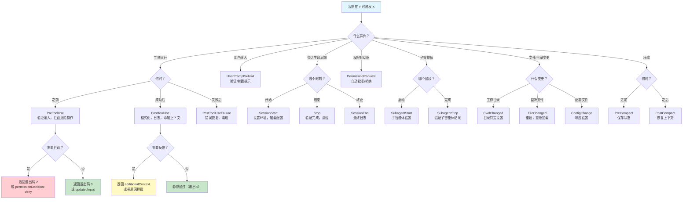
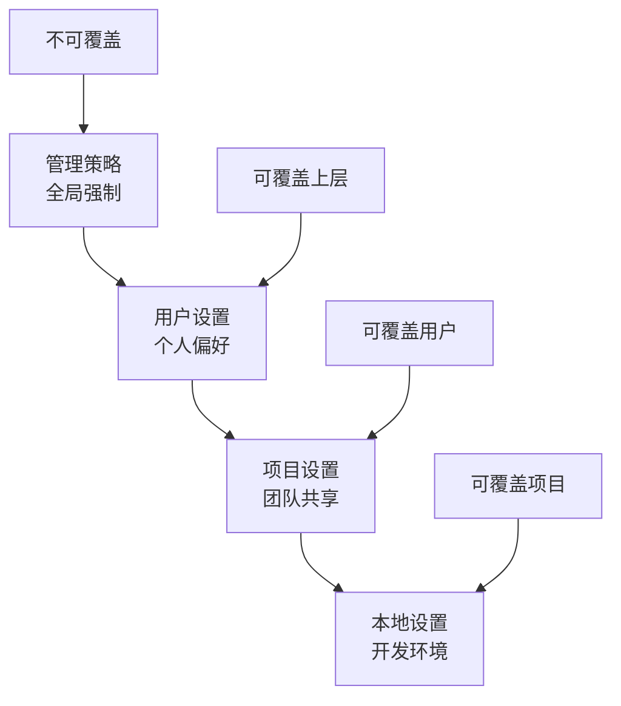
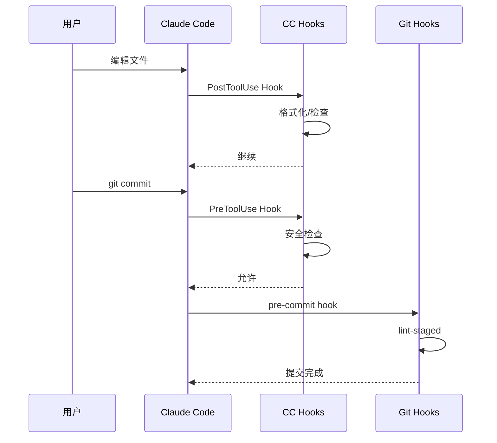

<picture>
  <source media="(prefers-color-scheme: dark)" srcset="../resources/logos/claude-howto-logo-dark.svg">
  
</picture>

> 🟡 **中级** | ⏱ 70 分钟
>
> ✅ 已验证 Claude Code **v2.1.92** · 最后验证：2026-04-06

**你将构建：** 通过事件驱动脚本自动化工作流。

# Hooks

Hooks 是在 Claude Code 会话期间响应特定事件自动执行的脚本。它们支持自动化、验证、权限管理和自定义工作流。

## 概述

Hooks 是自动操作（shell 命令、HTTP webhooks、LLM 提示或子智能体评估），当 Claude Code 中发生特定事件时自动执行。它们接收 JSON 输入，并通过退出码和 JSON 输出传递结果。

**关键特性：**
- 事件驱动自动化
- 基于 JSON 的输入/输出
- 支持命令、提示、HTTP 和智能体 hook 类型
- 工具特定 hooks 的模式匹配

---

## Hook 的关键时刻

你的 CI 在 20 分钟构建后发现了 lint 错误。Hooks 能在 2 秒内捕获它。

**没有 hooks 的痛苦循环：**
```
编写代码 → 提交 → 推送 → CI 启动 → 5 分钟安装 → 10 分钟构建 → 5 分钟测试 → 失败 → 修复 → 重复
```

**有了 hooks：**
```
编写代码 → Hook 运行 → 2 秒 → 立即修复 → 提交干净代码 → CI 通过
```

Hooks 将验证从"事后"转变为"你还在思考时"。它们在提交前捕获密钥，在切换文件前格式化代码，在执行危险命令前拦截。

---

## 选择正确的 Hook 事件



---

## 立即尝试：你的第一个 Hook

让我们创建一个 hook，在 Claude 写入 TypeScript 文件后自动格式化它们。

**步骤 1：创建 hooks 目录**

```bash
mkdir -p .claude/hooks
```

**步骤 2：创建格式化 hook**

创建 `.claude/hooks/auto-format.sh`：

```bash
#!/bin/bash
# Auto-format code after Write/Edit
# Receives JSON via stdin from Claude Code

INPUT=$(cat)
FILE_PATH=$(echo "$INPUT" | jq -r '.tool_input.file_path // empty')

# Skip if no file path
[ -z "$FILE_PATH" ] && exit 0

# Format based on extension
case "$FILE_PATH" in
  *.ts|*.tsx|*.js|*.jsx|*.json|*.md)
    prettier --write "$FILE_PATH" 2>/dev/null && \
      echo "[Hook] Formatted: $FILE_PATH" >&2
    ;;
  *.py)
    black "$FILE_PATH" 2>/dev/null && \
      echo "[Hook] Formatted: $FILE_PATH" >&2
    ;;
  *.go)
    gofmt -w "$FILE_PATH" && \
      echo "[Hook] Formatted: $FILE_PATH" >&2
    ;;
esac

exit 0
```

**步骤 3：使其可执行**

```bash
chmod +x .claude/hooks/auto-format.sh
```

**步骤 4：配置 hook**

添加到 `.claude/settings.json`：

```json
{
  "hooks": {
    "PostToolUse": [
      {
        "matcher": "Write|Edit",
        "hooks": [
          {
            "type": "command",
            "command": "$CLAUDE_PROJECT_DIR/.claude/hooks/auto-format.sh",
            "timeout": 30
          }
        ]
      }
    ]
  }
}
```

**步骤 5：测试它**

让 Claude 写入一个 TypeScript 文件。观察 hook 自动格式化它：

```
> 创建一个简单的 utils.ts 文件，包含 formatDate 函数

[Hook] Formatted: utils.ts  ← Hook 自动运行！
```

---

## 配置

Hooks 在设置文件中使用特定结构配置：

- `~/.claude/settings.json` - 用户设置（所有项目）
- `.claude/settings.json` - 项目设置（可共享，可提交）
- `.claude/settings.local.json` - 本地项目设置（不提交）
- 管理策略 - 组织范围设置
- Plugin `hooks/hooks.json` - 插件范围 hooks
- Skill/Agent frontmatter - 组件生命周期 hooks

### 基本配置结构

```json
{
  "hooks": {
    "EventName": [
      {
        "matcher": "ToolPattern",
        "hooks": [
          {
            "type": "command",
            "command": "your-command-here",
            "timeout": 60
          }
        ]
      }
    ]
  }
}
```

**关键字段：**

| 字段 | 描述 | 示例 |
|-------|-------------|---------|
| `matcher` | 匹配工具名称的模式（区分大小写） | `"Write"`、`"Edit\|Write"`、`"*"` |
| `hooks` | Hook 定义数组 | `[{ "type": "command", ... }]` |
| `type` | Hook 类型：`"command"`（bash）、`"prompt"`（LLM）、`"http"`（webhook）或 `"agent"`（子智能体） | `"command"` |
| `command` | 要执行的 shell 命令 | `"$CLAUDE_PROJECT_DIR/.claude/hooks/format.sh"` |
| `timeout` | 可选超时时间（秒，默认 60） | `30` |
| `once` | 如果为 `true`，每个会话只运行一次 | `true` |

### 匹配器模式

| 模式 | 描述 | 示例 |
|---------|-------------|---------|
| 精确字符串 | 匹配特定工具 | `"Write"` |
| 正则模式 | 匹配多个工具 | `"Edit\|Write"` |
| 通配符 | 匹配所有工具 | `"*"` 或 `""` |
| MCP 工具 | 服务器和工具模式 | `"mcp__memory__.*"` |

## Hook 类型

Claude Code 支持四种 hook 类型：

### 命令 Hooks

默认 hook 类型。执行 shell 命令，通过 JSON stdin/stdout 和退出码通信。

```json
{
  "type": "command",
  "command": "python3 \"$CLAUDE_PROJECT_DIR/.claude/hooks/validate.py\"",
  "timeout": 60
}
```

### HTTP Hooks

> 在 v2.1.63 中添加。

远程 webhook 端点，接收与命令 hooks 相同的 JSON 输入。HTTP hooks 将 JSON POST 到 URL 并接收 JSON 响应。启用沙箱时，HTTP hooks 通过沙箱路由。出于安全考虑，URL 中的环境变量插值需要显式 `allowedEnvVars` 列表。

```json
{
  "hooks": {
    "PostToolUse": [{
      "type": "http",
      "url": "https://my-webhook.example.com/hook",
      "matcher": "Write"
    }]
  }
}
```

**关键属性：**
- `"type": "http"` -- 标识为 HTTP hook
- `"url"` -- webhook 端点 URL
- 启用沙箱时通过沙箱路由
- URL 中任何环境变量插值需要显式 `allowedEnvVars` 列表

### 提示 Hooks

LLM 评估的提示，hook 内容是 Claude 评估的提示。主要用于 `Stop` 和 `SubagentStop` 事件进行智能任务完成检查。

```json
{
  "type": "prompt",
  "prompt": "评估 Claude 是否完成了所有请求的任务。",
  "timeout": 30
}
```

LLM 评估提示并返回结构化决策（详见[基于提示的 Hooks](#基于提示的-hooks)）。

### 智能体 Hooks

基于子智能体的验证 hooks，启动专用智能体评估条件或执行复杂检查。与提示 hooks（单次 LLM 评估）不同，智能体 hooks 可以使用工具并执行多步推理。

```json
{
  "type": "agent",
  "prompt": "验证代码变更遵循我们的架构指南。检查相关设计文档并进行比较。",
  "timeout": 120
}
```

**关键属性：**
- `"type": "agent"` -- 标识为智能体 hook
- `"prompt"` -- 子智能体的任务描述
- 智能体可以使用工具（Read、Grep、Bash 等）执行评估
- 返回类似提示 hooks 的结构化决策

## Hook 事件

Claude Code 支持 **25 个 hook 事件**：

| 事件 | 触发时机 | 匹配器输入 | 可拦截 | 常见用途 |
|-------|---------------|---------------|-----------|------------|
| **SessionStart** | 会话开始/恢复/清除/压缩 | startup/resume/clear/compact | 否 | 环境设置 |
| **InstructionsLoaded** | CLAUDE.md 或规则文件加载后 | （无） | 否 | 修改/过滤指令 |
| **UserPromptSubmit** | 用户提交提示 | （无） | 是 | 验证提示 |
| **PreToolUse** | 工具执行前 | 工具名称 | 是（允许/拒绝/询问） | 验证，修改输入 |
| **PermissionRequest** | 显示权限对话框 | 工具名称 | 是 | 自动批准/拒绝 |
| **PostToolUse** | 工具成功后 | 工具名称 | 否 | 添加上下文，反馈 |
| **PostToolUseFailure** | 工具执行失败 | 工具名称 | 否 | 错误处理，日志 |
| **Notification** | 发送通知 | 通知类型 | 否 | 自定义通知 |
| **SubagentStart** | 子智能体启动 | 智能体类型名称 | 否 | 子智能体设置 |
| **SubagentStop** | 子智能体完成 | 智能体类型名称 | 是 | 子智能体验证 |
| **Stop** | Claude 完成响应 | （无） | 是 | 任务完成检查 |
| **StopFailure** | API 错误结束轮次 | （无） | 否 | 错误恢复，日志 |
| **TeammateIdle** | 智能体队友空闲 | （无） | 是 | 队友协调 |
| **TaskCompleted** | 任务标记完成 | （无） | 是 | 任务后操作 |
| **TaskCreated** | 通过 TaskCreate 创建任务 | （无） | 否 | 任务跟踪，日志 |
| **ConfigChange** | 配置文件变更 | （无） | 是（策略除外） | 响应配置更新 |
| **CwdChanged** | 工作目录变更 | （无） | 否 | 目录特定设置 |
| **FileChanged** | 监听文件变更 | （无） | 否 | 文件监控，重建 |
| **PreCompact** | 上下文压缩前 | manual/auto | 否 | 压缩前操作 |
| **PostCompact** | 压缩完成后 | （无） | 否 | 压缩后操作 |
| **WorktreeCreate** | 正在创建 worktree | （无） | 是（路径返回） | worktree 初始化 |
| **WorktreeRemove** | 正在移除 worktree | （无） | 否 | worktree 清理 |
| **Elicitation** | MCP 服务器请求用户输入 | （无） | 是 | 输入验证 |
| **ElicitationResult** | 用户响应 elicitation | （无） | 是 | 响应处理 |
| **SessionEnd** | 会话终止 | （无） | 否 | 清理，最终日志 |

### PreToolUse

在 Claude 创建工具参数后、处理前运行。用于验证或修改工具输入。

**配置：**
```json
{
  "hooks": {
    "PreToolUse": [
      {
        "matcher": "Bash",
        "hooks": [
          {
            "type": "command",
            "command": "$CLAUDE_PROJECT_DIR/.claude/hooks/validate-bash.py"
          }
        ]
      }
    ]
  }
}
```

**常见匹配器：** `Task`、`Bash`、`Glob`、`Grep`、`Read`、`Edit`、`Write`、`WebFetch`、`WebSearch`

**输出控制：**
- `permissionDecision`：`"allow"`、`"deny"` 或 `"ask"`
- `permissionDecisionReason`：决策解释
- `updatedInput`：修改后的工具输入参数

### PostToolUse

工具完成后立即运行。用于验证、日志或向 Claude 提供上下文。

**配置：**
```json
{
  "hooks": {
    "PostToolUse": [
      {
        "matcher": "Write|Edit",
        "hooks": [
          {
            "type": "command",
            "command": "$CLAUDE_PROJECT_DIR/.claude/hooks/security-scan.py"
          }
        ]
      }
    ]
  }
}
```

**输出控制：**
- `"block"` 决策向 Claude 提示反馈
- `additionalContext`：为 Claude 添加的上下文

### UserPromptSubmit

用户提交提示后、Claude 处理前运行。

**配置：**
```json
{
  "hooks": {
    "UserPromptSubmit": [
      {
        "hooks": [
          {
            "type": "command",
            "command": "$CLAUDE_PROJECT_DIR/.claude/hooks/validate-prompt.py"
          }
        ]
      }
    ]
  }
}
```

**输出控制：**
- `decision`：`"block"` 阻止处理
- `reason`：拦截时的解释
- `additionalContext`：添加到提示的上下文

### Stop 和 SubagentStop

Claude 完成响应（Stop）或子智能体完成（SubagentStop）时运行。支持基于提示的评估进行智能任务完成检查。

**额外输入字段：** `Stop` 和 `SubagentStop` hooks 在 JSON 输入中接收 `last_assistant_message` 字段，包含停止前 Claude 或子智能体的最终消息。这对评估任务完成很有用。

**配置：**
```json
{
  "hooks": {
    "Stop": [
      {
        "hooks": [
          {
            "type": "prompt",
            "prompt": "评估 Claude 是否完成了所有请求的任务。",
            "timeout": 30
          }
        ]
      }
    ]
  }
}
```

### SubagentStart

子智能体开始执行时运行。匹配器输入是智能体类型名称，允许 hooks 针特定子智能体类型。

**配置：**
```json
{
  "hooks": {
    "SubagentStart": [
      {
        "matcher": "code-review",
        "hooks": [
          {
            "type": "command",
            "command": "$CLAUDE_PROJECT_DIR/.claude/hooks/subagent-init.sh"
          }
        ]
      }
    ]
  }
}
```

### SessionStart

会话启动或恢复时运行。可以持久化环境变量。

**匹配器：** `startup`、`resume`、`clear`、`compact`

**特殊功能：** 使用 `CLAUDE_ENV_FILE` 持久化环境变量（在 `CwdChanged` 和 `FileChanged` hooks 中也可用）：

```bash
#!/bin/bash
if [ -n "$CLAUDE_ENV_FILE" ]; then
  echo 'export NODE_ENV=development' >> "$CLAUDE_ENV_FILE"
fi
exit 0
```

### SessionEnd

会话结束时运行以执行清理或最终日志。无法拦截终止。

**原因字段值：**
- `clear` - 用户清除了会话
- `logout` - 用户登出
- `prompt_input_exit` - 用户通过提示输入退出
- `other` - 其他原因

**配置：**
```json
{
  "hooks": {
    "SessionEnd": [
      {
        "hooks": [
          {
            "type": "command",
            "command": "\"$CLAUDE_PROJECT_DIR/.claude/hooks/session-cleanup.sh\""
          }
        ]
      }
    ]
  }
}
```

### 通知事件

通知事件更新的匹配器：
- `permission_prompt` - 权限请求通知
- `idle_prompt` - 空闲状态通知
- `auth_success` - 认证成功
- `elicitation_dialog` - 向用户显示对话框

## 组件范围 Hooks

Hooks 可以附加到特定组件（skills、agents、commands）的 frontmatter 中：

**在 SKILL.md、agent.md 或 command.md 中：**

```yaml
---
name: secure-operations
description: 执行带有安全检查的操作
hooks:
  PreToolUse:
    - matcher: "Bash"
      hooks:
        - type: command
          command: "./scripts/check.sh"
          once: true  # 每个会话只运行一次
---
```

**组件 hooks 支持的事件：** `PreToolUse`、`PostToolUse`、`Stop`

这允许在使用它们的组件中直接定义 hooks，保持相关代码在一起。

### 子智能体 Frontmatter 中的 Hooks

在子智能体的 frontmatter 中定义 `Stop` hook 时，它会自动转换为该子智能体范围的 `SubagentStop` hook。这确保 stop hook 只在该特定子智能体完成时触发，而不是主会话停止时。

```yaml
---
name: code-review-agent
description: 自动化代码审查子智能体
hooks:
  Stop:
    - hooks:
        - type: prompt
          prompt: "验证代码审查是否彻底且完整。"
  # 上面的 Stop hook 自动转换为该子智能体的 SubagentStop
---
```

## PermissionRequest 事件

使用自定义输出格式处理权限请求：

```json
{
  "hookSpecificOutput": {
    "hookEventName": "PermissionRequest",
    "decision": {
      "behavior": "allow|deny",
      "updatedInput": {},
      "message": "自定义消息",
      "interrupt": false
    }
  }
}
```

## Hook 输入和输出

### JSON 输入（通过 stdin）

所有 hooks 通过 stdin 接收 JSON 输入：

```json
{
  "session_id": "abc123",
  "transcript_path": "/path/to/transcript.jsonl",
  "cwd": "/current/working/directory",
  "permission_mode": "default",
  "hook_event_name": "PreToolUse",
  "tool_name": "Write",
  "tool_input": {
    "file_path": "/path/to/file.js",
    "content": "..."
  },
  "tool_use_id": "toolu_01ABC123...",
  "agent_id": "agent-abc123",
  "agent_type": "main",
  "worktree": "/path/to/worktree"
}
```

**常见字段：**

| 字段 | 描述 |
|-------|-------------|
| `session_id` | 唯一会话标识符 |
| `transcript_path` | 对话记录文件路径 |
| `cwd` | 当前工作目录 |
| `hook_event_name` | 触发 hook 的事件名称 |
| `agent_id` | 运行此 hook 的智能体标识符 |
| `agent_type` | 智能体类型（`"main"`、子智能体类型名称等） |
| `worktree` | git worktree 路径（如果智能体在 worktree 中运行） |

### 退出码

| 退出码 | 含义 | 行为 |
|-----------|---------|----------|
| **0** | 成功 | 继续，解析 JSON stdout |
| **2** | 拦截错误 | 拦截操作，stderr 显示为错误 |
| **其他** | 非拦截错误 | 继续，stderr 在详细模式显示 |

### JSON 输出（stdout，退出码 0）

```json
{
  "continue": true,
  "stopReason": "停止时的可选消息",
  "suppressOutput": false,
  "systemMessage": "可选警告消息",
  "hookSpecificOutput": {
    "hookEventName": "PreToolUse",
    "permissionDecision": "allow",
    "permissionDecisionReason": "文件在允许目录中",
    "updatedInput": {
      "file_path": "/modified/path.js"
    }
  }
}
```

## 环境变量

| 变量 | 可用性 | 描述 |
|----------|-------------|-------------|
| `CLAUDE_PROJECT_DIR` | 所有 hooks | 项目根目录绝对路径 |
| `CLAUDE_ENV_FILE` | SessionStart、CwdChanged、FileChanged | 持久化环境变量文件路径 |
| `CLAUDE_CODE_REMOTE` | 所有 hooks | 在远程环境运行时为 `"true"` |
| `${CLAUDE_PLUGIN_ROOT}` | 插件 hooks | 插件目录路径 |
| `${CLAUDE_PLUGIN_DATA}` | 插件 hooks | 插件数据目录路径 |
| `CLAUDE_CODE_SESSIONEND_HOOKS_TIMEOUT_MS` | SessionEnd hooks | SessionEnd hooks 可配置超时（毫秒，覆盖默认值） |

## 基于提示的 Hooks

对于 `Stop` 和 `SubagentStop` 事件，可以使用基于 LLM 的评估：

```json
{
  "hooks": {
    "Stop": [
      {
        "hooks": [
          {
            "type": "prompt",
            "prompt": "审查所有任务是否完成。返回你的决策。",
            "timeout": 30
          }
        ]
      }
    ]
  }
}
```

**LLM 响应模式：**
```json
{
  "decision": "approve",
  "reason": "所有任务成功完成",
  "continue": false,
  "stopReason": "任务完成"
}
```

## 示例

### 示例 1：Bash 命令验证器（PreToolUse）

**文件：** `.claude/hooks/validate-bash.py`

```python
#!/usr/bin/env python3
import json
import sys
import re

BLOCKED_PATTERNS = [
    (r"\brm\s+-rf\s+/", "Blocking dangerous rm -rf / command"),
    (r"\bsudo\s+rm", "Blocking sudo rm command"),
]

def main():
    input_data = json.load(sys.stdin)

    tool_name = input_data.get("tool_name", "")
    if tool_name != "Bash":
        sys.exit(0)

    command = input_data.get("tool_input", {}).get("command", "")

    for pattern, message in BLOCKED_PATTERNS:
        if re.search(pattern, command):
            print(message, file=sys.stderr)
            sys.exit(2)  # Exit 2 = blocking error

    sys.exit(0)

if __name__ == "__main__":
    main()
```

**配置：**
```json
{
  "hooks": {
    "PreToolUse": [
      {
        "matcher": "Bash",
        "hooks": [
          {
            "type": "command",
            "command": "python3 \"$CLAUDE_PROJECT_DIR/.claude/hooks/validate-bash.py\""
          }
        ]
      }
    ]
  }
}
```

### 示例 2：安全扫描器（PostToolUse）

**文件：** `.claude/hooks/security-scan.py`

```python
#!/usr/bin/env python3
import json
import sys
import re

SECRET_PATTERNS = [
    (r"password\s*=\s*['\"][^'\"]+['\"]", "Potential hardcoded password"),
    (r"api[_-]?key\s*=\s*['\"][^'\"]+['\"]", "Potential hardcoded API key"),
]

def main():
    input_data = json.load(sys.stdin)

    tool_name = input_data.get("tool_name", "")
    if tool_name not in ["Write", "Edit"]:
        sys.exit(0)

    tool_input = input_data.get("tool_input", {})
    content = tool_input.get("content", "") or tool_input.get("new_string", "")
    file_path = tool_input.get("file_path", "")

    warnings = []
    for pattern, message in SECRET_PATTERNS:
        if re.search(pattern, content, re.IGNORECASE):
            warnings.append(message)

    if warnings:
        output = {
            "hookSpecificOutput": {
                "hookEventName": "PostToolUse",
                "additionalContext": f"Security warnings for {file_path}: " + "; ".join(warnings)
            }
        }
        print(json.dumps(output))

    sys.exit(0)

if __name__ == "__main__":
    main()
```

### 示例 3：自动格式化代码（PostToolUse）

**文件：** `.claude/hooks/format-code.sh`

```bash
#!/bin/bash

# Read JSON from stdin
INPUT=$(cat)
TOOL_NAME=$(echo "$INPUT" | python3 -c "import sys, json; print(json.load(sys.stdin).get('tool_name', ''))")
FILE_PATH=$(echo "$INPUT" | python3 -c "import sys, json; print(json.load(sys.stdin).get('tool_input', {}).get('file_path', ''))")

if [ "$TOOL_NAME" != "Write" ] && [ "$TOOL_NAME" != "Edit" ]; then
    exit 0
fi

# Format based on file extension
case "$FILE_PATH" in
    *.js|*.jsx|*.ts|*.tsx|*.json)
        command -v prettier &>/dev/null && prettier --write "$FILE_PATH" 2>/dev/null
        ;;
    *.py)
        command -v black &>/dev/null && black "$FILE_PATH" 2>/dev/null
        ;;
    *.go)
        command -v gofmt &>/dev/null && gofmt -w "$FILE_PATH" 2>/dev/null
        ;;
esac

exit 0
```

### 示例 4：提示验证器（UserPromptSubmit）

**文件：** `.claude/hooks/validate-prompt.py`

```python
#!/usr/bin/env python3
import json
import sys
import re

BLOCKED_PATTERNS = [
    (r"delete\s+(all\s+)?database", "Dangerous: database deletion"),
    (r"rm\s+-rf\s+/", "Dangerous: root deletion"),
]

def main():
    input_data = json.load(sys.stdin)
    prompt = input_data.get("user_prompt", "") or input_data.get("prompt", "")

    for pattern, message in BLOCKED_PATTERNS:
        if re.search(pattern, prompt, re.IGNORECASE):
            output = {
                "decision": "block",
                "reason": f"Blocked: {message}"
            }
            print(json.dumps(output))
            sys.exit(0)

    sys.exit(0)

if __name__ == "__main__":
    main()
```

### 示例 5：智能 Stop Hook（基于提示）

```json
{
  "hooks": {
    "Stop": [
      {
        "hooks": [
          {
            "type": "prompt",
            "prompt": "审查 Claude 是否完成了所有请求的任务。检查：1）所有文件是否创建/修改？2）是否有未解决的错误？如果不完整，解释缺少什么。",
            "timeout": 30
          }
        ]
      }
    ]
  }
}
```

### 示例 6：上下文使用跟踪器（Hook 配对）

使用 `UserPromptSubmit`（消息前）和 `Stop`（响应后）hooks 配合跟踪每个请求的 token 消耗。

**文件：** `.claude/hooks/context-tracker.py`

```python
#!/usr/bin/env python3
"""
Context Usage Tracker - Tracks token consumption per request.

Uses UserPromptSubmit as "pre-message" hook and Stop as "post-response" hook
to calculate the delta in token usage for each request.

Token Counting Methods:
1. Character estimation (default): ~4 chars per token, no dependencies
2. tiktoken (optional): More accurate (~90-95%), requires: pip install tiktoken
"""
import json
import os
import sys
import tempfile

# Configuration
CONTEXT_LIMIT = 128000  # Claude's context window (adjust for your model)
USE_TIKTOKEN = False    # Set True if tiktoken is installed for better accuracy


def get_state_file(session_id: str) -> str:
    """Get temp file path for storing pre-message token count, isolated by session."""
    return os.path.join(tempfile.gettempdir(), f"claude-context-{session_id}.json")


def count_tokens(text: str) -> int:
    """
    Count tokens in text.

    Uses tiktoken with p50k_base encoding if available (~90-95% accuracy),
    otherwise falls back to character estimation (~80-90% accuracy).
    """
    if USE_TIKTOKEN:
        try:
            import tiktoken
            enc = tiktoken.get_encoding("p50k_base")
            return len(enc.encode(text))
        except ImportError:
            pass  # Fall back to estimation

    # Character-based estimation: ~4 characters per token for English
    return len(text) // 4


def read_transcript(transcript_path: str) -> str:
    """Read and concatenate all content from transcript file."""
    if not transcript_path or not os.path.exists(transcript_path):
        return ""

    content = []
    with open(transcript_path, "r") as f:
        for line in f:
            try:
                entry = json.loads(line.strip())
                # Extract text content from various message formats
                if "message" in entry:
                    msg = entry["message"]
                    if isinstance(msg.get("content"), str):
                        content.append(msg["content"])
                    elif isinstance(msg.get("content"), list):
                        for block in msg["content"]:
                            if isinstance(block, dict) and block.get("type") == "text":
                                content.append(block.get("text", ""))
            except json.JSONDecodeError:
                continue

    return "\n".join(content)


def handle_user_prompt_submit(data: dict) -> None:
    """Pre-message hook: Save current token count before request."""
    session_id = data.get("session_id", "unknown")
    transcript_path = data.get("transcript_path", "")

    transcript_content = read_transcript(transcript_path)
    current_tokens = count_tokens(transcript_content)

    # Save to temp file for later comparison
    state_file = get_state_file(session_id)
    with open(state_file, "w") as f:
        json.dump({"pre_tokens": current_tokens}, f)


def handle_stop(data: dict) -> None:
    """Post-response hook: Calculate and report token delta."""
    session_id = data.get("session_id", "unknown")
    transcript_path = data.get("transcript_path", "")

    transcript_content = read_transcript(transcript_path)
    current_tokens = count_tokens(transcript_content)

    # Load pre-message count
    state_file = get_state_file(session_id)
    pre_tokens = 0
    if os.path.exists(state_file):
        try:
            with open(state_file, "r") as f:
                state = json.load(f)
                pre_tokens = state.get("pre_tokens", 0)
        except (json.JSONDecodeError, IOError):
            pass

    # Calculate delta
    delta_tokens = current_tokens - pre_tokens
    remaining = CONTEXT_LIMIT - current_tokens
    percentage = (current_tokens / CONTEXT_LIMIT) * 100

    # Report usage
    method = "tiktoken" if USE_TIKTOKEN else "estimated"
    print(f"Context ({method}): ~{current_tokens:,} tokens ({percentage:.1f}% used, ~{remaining:,} remaining)", file=sys.stderr)
    if delta_tokens > 0:
        print(f"This request: ~{delta_tokens:,} tokens", file=sys.stderr)


def main():
    data = json.load(sys.stdin)
    event = data.get("hook_event_name", "")

    if event == "UserPromptSubmit":
        handle_user_prompt_submit(data)
    elif event == "Stop":
        handle_stop(data)

    sys.exit(0)


if __name__ == "__main__":
    main()
```

**配置：**
```json
{
  "hooks": {
    "UserPromptSubmit": [
      {
        "hooks": [
          {
            "type": "command",
            "command": "python3 \"$CLAUDE_PROJECT_DIR/.claude/hooks/context-tracker.py\""
          }
        ]
      }
    ],
    "Stop": [
      {
        "hooks": [
          {
            "type": "command",
            "command": "python3 \"$CLAUDE_PROJECT_DIR/.claude/hooks/context-tracker.py\""
          }
        ]
      }
    ]
  }
}
```

**工作原理：**
1. `UserPromptSubmit` 在处理提示前触发 - 保存当前 token 计数
2. `Stop` 在 Claude 响应后触发 - 计算差值并报告使用情况
3. 每个会话通过临时文件名中的 `session_id` 隔离

**Token 计数方法：**

| 方法 | 准确性 | 依赖 | 速度 |
|--------|----------|--------------|-------|
| 字符估算 | ~80-90% | 无 | <1ms |
| tiktoken (p50k_base) | ~90-95% | `pip install tiktoken` | <10ms |

> **注意：** Anthropic 未发布官方离线 tokenizer。两种方法都是近似值。记录包括用户提示、Claude 响应和工具输出，但不包括系统提示或内部上下文。

### 示例 7：种子自动模式权限（一次性设置脚本）

一次性设置脚本，向 `~/.claude/settings.json` 添加约 67 个安全权限规则，相当于 Claude Code 自动模式基线 — 无需任何 hook，无需记住未来选择。运行一次；可安全重复运行（跳过已存在的规则）。

**文件：** `09-advanced-features/setup-auto-mode-permissions.py`

```bash
# 预览将添加的内容
python3 09-advanced-features/setup-auto-mode-permissions.py --dry-run

# 应用
python3 09-advanced-features/setup-auto-mode-permissions.py
```

**添加内容：**

| 类别 | 示例 |
|----------|---------|
| 内置工具 | `Read(*)`、`Edit(*)`、`Write(*)`、`Glob(*)`、`Grep(*)`、`Agent(*)`、`WebSearch(*)` |
| Git 读取 | `Bash(git status:*)`、`Bash(git log:*)`、`Bash(git diff:*)` |
| Git 写入（本地） | `Bash(git add:*)`、`Bash(git commit:*)`、`Bash(git checkout:*)` |
| 包管理器 | `Bash(npm install:*)`、`Bash(pip install:*)`、`Bash(cargo build:*)` |
| 构建和测试 | `Bash(make:*)`、`Bash(pytest:*)`、`Bash(go test:*)` |
| 常用 shell | `Bash(ls:*)`、`Bash(cat:*)`、`Bash(find:*)`、`Bash(cp:*)`、`Bash(mv:*)` |
| GitHub CLI | `Bash(gh pr view:*)`、`Bash(gh pr create:*)`、`Bash(gh issue list:*)` |

**有意排除的内容**（此脚本从不添加）：
- `rm -rf`、`sudo`、强制推送、`git reset --hard`
- `DROP TABLE`、`kubectl delete`、`terraform destroy`
- `npm publish`、`curl | bash`、生产部署

## 插件 Hooks

插件可以在其 `hooks/hooks.json` 文件中包含 hooks：

**文件：** `plugins/hooks/hooks.json`

```json
{
  "hooks": {
    "PreToolUse": [
      {
        "matcher": "Bash",
        "hooks": [
          {
            "type": "command",
            "command": "${CLAUDE_PLUGIN_ROOT}/scripts/validate.sh"
          }
        ]
      }
    ]
  }
}
```

**插件 Hooks 中的环境变量：**
- `${CLAUDE_PLUGIN_ROOT}` - 插件目录路径
- `${CLAUDE_PLUGIN_DATA}` - 插件数据目录路径

这允许插件包含自定义验证和自动化 hooks。

## MCP 工具 Hooks

MCP 工具遵循模式 `mcp__<server>__<tool>`：

```json
{
  "hooks": {
    "PreToolUse": [
      {
        "matcher": "mcp__memory__.*",
        "hooks": [
          {
            "type": "command",
            "command": "echo '{\"systemMessage\": \"Memory operation logged\"}'"
          }
        ]
      }
    ]
  }
}
```

## 安全考虑

### 免责声明

**使用风险自负**：Hooks 执行任意 shell 命令。你独自负责：
- 你配置的命令
- 文件访问/修改权限
- 潜在数据丢失或系统损坏
- 在生产环境使用前在安全环境中测试 hooks

### 安全说明

- **需要工作区信任：** `statusLine` 和 `fileSuggestion` hook 输出命令现在需要工作区信任接受才能生效。
- **HTTP hooks 和环境变量：** HTTP hooks 需要显式 `allowedEnvVars` 列表才能在 URL 中使用环境变量插值。这防止敏感环境变量意外泄露到远程端点。
- **管理设置层级：** `disableAllHooks` 设置现在遵循管理设置层级，意味着组织级设置可以强制禁用 hooks，个人用户无法覆盖。

### 最佳实践

| 应该 | 不应该 |
|-----|-------|
| 验证和净化所有输入 | 盲目信任输入数据 |
| 引用 shell 变量：`"$VAR"` | 使用未引用：`$VAR` |
| 拦截路径遍历（`..`） | 允许任意路径 |
| 使用 `$CLAUDE_PROJECT_DIR` 的绝对路径 | 硬编码路径 |
| 跳过敏感文件（`.env`、`.git/`、密钥） | 处理所有文件 |
| 先单独测试 hooks | 部署未测试的 hooks |
| HTTP hooks 使用显式 `allowedEnvVars` | 向 webhooks 暴露所有环境变量 |

## 调试技巧

### 启用调试模式

使用调试标志运行 Claude 以获取详细 hook 日志：

```bash
claude --debug
```

### 详细模式

在 Claude Code 中使用 `Ctrl+O` 启用详细模式并查看 hook 执行进度。

### 独立测试 Hooks

```bash
# 使用示例 JSON 输入测试
echo '{"tool_name": "Bash", "tool_input": {"command": "ls -la"}}' | python3 .claude/hooks/validate-bash.py

# 检查退出码
echo $?
```

### 日志分析

Hook 输出在调试模式下可见，包括：
- Hook 执行顺序
- 输入 JSON 内容
- 输出 JSON 内容
- 退出码
- 执行时间

```bash
# 查看调试输出中的 hook 信息
claude --debug 2>&1 | grep -i hook
```

### 常见调试场景

**场景 1：Hook 不触发**

```bash
# 检查配置语法
cat .claude/settings.json | jq .hooks

# 验证匹配器模式
# 确保工具名称匹配（区分大小写）
# PreToolUse matcher: "Write" 匹配 Write 工具
# PreToolUse matcher: "Write|Edit" 匹配两者
```

**场景 2：Hook 输出被忽略**

```bash
# 检查退出码
# 0 = 成功，解析 JSON stdout
# 2 = 拦截错误，stderr 显示为错误
# 其他 = 非拦截错误，stderr 仅在详细模式显示

# 确保 JSON 输出到 stdout，日志到 stderr
python3 hook.py 2>/dev/null | jq .  # 测试 JSON 输出
python3 hook.py 1>/dev/null         # 测试 stderr 输出
```

**场景 3：JSON 解析失败**

```bash
# 验证 JSON 输入格式
echo '{"tool_name":"Write","tool_input":{"file_path":"/test.js"}}' | \
  python3 -c "import sys,json; print(json.load(sys.stdin))"

# 验证 JSON 输出格式
echo '{"hookSpecificOutput":{"hookEventName":"PreToolUse","permissionDecision":"allow"}}' | \
  jq .
```

---

## 性能优化

Hooks 在每个工具调用时执行，性能直接影响用户体验。

### 超时配置

```json
{
  "hooks": {
    "PostToolUse": [
      {
        "matcher": "Write|Edit",
        "hooks": [
          {
            "type": "command",
            "command": "$CLAUDE_PROJECT_DIR/.claude/hooks/format.sh",
            "timeout": 30  // 30秒超时
          }
        ]
      }
    ]
  }
}
```

| Hook 类型 | 推荐超时 | 理由 |
|-----------|----------|------|
| 格式化 | 10-30秒 | 单文件操作 |
| Lint | 10-30秒 | 单文件检查 |
| 安全扫描 | 10-30秒 | 正则匹配快速 |
| 测试运行 | 60-120秒 | 可能需要编译 |
| Stop 检查 | 30秒 | LLM 评估 |

### 后台任务

将耗时操作移到后台，避免阻塞主流程：

```bash
#!/bin/bash
# 后台格式化 - 不阻塞 Claude

INPUT=$(cat)
FILE_PATH=$(echo "$INPUT" | jq -r '.tool_input.file_path // empty')

# 在后台执行格式化
(
  sleep 1  # 等待文件写入完成
  prettier --write "$FILE_PATH" 2>/dev/null
) &

# 立即返回，不等待后台任务
exit 0
```

### 条件跳过

智能跳过不必要的处理：

```bash
#!/bin/bash
INPUT=$(cat)
FILE_PATH=$(echo "$INPUT" | jq -r '.tool_input.file_path // empty')

# 跳过不存在的文件
[[ ! -f "$FILE_PATH" ]] && exit 0

# 跳过敏感文件
case "$FILE_PATH" in
  *.env|*.secret|.git/*|node_modules/*)
    exit 0
    ;;
esac

# 跳过大于 100KB 的文件
SIZE=$(wc -c < "$FILE_PATH")
[[ $SIZE -gt 100000 ]] && exit 0

# 执行处理
prettier --write "$FILE_PATH"
exit 0
```

### 并行优化

Hooks 自动并行执行，优化执行顺序：

```json
{
  "hooks": {
    "PostToolUse": [
      {
        "matcher": "Write|Edit",
        "hooks": [
          // 快速检查先执行
          { "type": "command", "command": "quick-check.sh", "timeout": 5 },
          // 格式化其次
          { "type": "command", "command": "format.sh", "timeout": 30 },
          // 深度检查最后（可能失败不影响格式化）
          { "type": "command", "command": "deep-scan.sh", "timeout": 60 }
        ]
      }
    ]
  }
}
```

### 性能监控

```bash
#!/bin/bash
# 性能跟踪 hook

INPUT=$(cat)
START=$(date +%s.%N)

# 执行实际处理
# ... 你的 hook 逻辑 ...

END=$(date +%s.%N)
DURATION=$(echo "$END - $START" | bc)

# 如果超过阈值，记录警告
if (( $(echo "$DURATION > 2" | bc -l) )); then
  echo "[Hook] Performance warning: took ${DURATION}s" >&2
fi

exit 0
```

---

## 安全最佳实践

### 输入验证

始终验证和净化所有输入：

```python
#!/usr/bin/env python3
import json
import sys
import os
import re

def validate_path(file_path: str) -> bool:
    """验证文件路径安全性"""
    
    # 检查路径遍历
    if '..' in file_path:
        return False
    
    # 检查绝对路径是否在项目目录内
    project_dir = os.environ.get('CLAUDE_PROJECT_DIR', '')
    abs_path = os.path.abspath(file_path)
    
    if not abs_path.startswith(project_dir):
        return False
    
    # 检查敏感目录
    sensitive_dirs = ['.git', '.env', 'secrets', 'credentials']
    for dir in sensitive_dirs:
        if dir in abs_path.split(os.sep):
            return False
    
    return True

def main():
    data = json.load(sys.stdin)
    file_path = data.get('tool_input', {}).get('file_path', '')
    
    if not validate_path(file_path):
        print(f"Security: Invalid path {file_path}", file=sys.stderr)
        sys.exit(2)  # Block
    
    # 继续处理...
    sys.exit(0)
```

### 命令注入防护

避免 shell 命令注入：

```bash
#!/bin/bash
# 安全的文件路径处理

INPUT=$(cat)
FILE_PATH=$(echo "$INPUT" | jq -r '.tool_input.file_path // empty')

# 使用 jq 提取，确保 JSON 安全
# 不要使用 eval 或未引用的变量

# 安全：使用引号
prettier --write "$FILE_PATH"

# 危险：未引用（可能导致注入）
# prettier --write $FILE_PATH  # 永远不要这样做

# 危险：eval（可能导致任意命令执行）
# eval "prettier --write $FILE_PATH"  # 永远不要这样做
```

### 密钥保护

防止密钥泄露：

```python
#!/usr/bin/env python3
import json
import sys
import re

# 密钥检测模式
SECRET_PATTERNS = [
    (r'AKIA[0-9A-Z]{16}', 'AWS Access Key'),
    (r'sk-[a-zA-Z0-9]{20,}', 'OpenAI API Key'),
    (r'ghp_[a-zA-Z0-9]{36}', 'GitHub Personal Token'),
    (r'eyJ[a-zA-Z0-9_-]*\.eyJ[a-zA-Z0-9_-]*\.[a-zA-Z0-9_-]*', 'JWT Token'),
    (r'password\s*[=:]\s*["\']?[^"\'\s]{8,}', 'Password'),
    (r'secret\s*[=:]\s*["\']?[^"\'\s]{16,}', 'Secret'),
]

def scan_for_secrets(content: str) -> list:
    """扫描内容中的密钥"""
    found = []
    for pattern, name in SECRET_PATTERNS:
        if re.search(pattern, content):
            found.append(name)
    return found

def main():
    data = json.load(sys.stdin)
    content = data.get('tool_input', {}).get('content', '')
    
    secrets = scan_for_secrets(content)
    
    if secrets:
        output = {
            "hookSpecificOutput": {
                "hookEventName": "PostToolUse",
                "additionalContext": f"SECURITY WARNING: Detected {', '.join(secrets)}. Review before committing."
            }
        }
        print(json.dumps(output))
    
    sys.exit(0)
```

### 权限最小化

只授予必要的权限：

```json
{
  "hooks": {
    "PreToolUse": [
      {
        "matcher": "Bash",
        "hooks": [
          {
            "type": "command",
            "command": "$CLAUDE_PROJECT_DIR/.claude/hooks/validate.sh",
            // 不要使用 dangerously-skip-permissions
            // 使用 allowedTools 配置替代
          }
        ]
      }
    ]
  }
}
```

### HTTP Hooks 安全

```json
{
  "hooks": {
    "PostToolUse": [
      {
        "type": "http",
        "url": "https://api.example.com/webhook",
        // 必须显式声明允许的环境变量
        "allowedEnvVars": ["PROJECT_NAME", "ENVIRONMENT"]
        // 不要暴露 CLAUDE_API_KEY、AWS_SECRET 等敏感变量
      }
    ]
  }
}
```

---

## 企业级 Hook 配置

### 分层配置架构

企业级配置使用三层架构：



**管理层（强制）：**

```json
// /etc/claude/policy.json (企业级)
{
  "hooks": {
    "PreToolUse": [
      {
        "matcher": "Bash",
        "hooks": [
          {
            "type": "command",
            "command": "/usr/local/bin/claude-security-check.sh"
          }
        ]
      }
    ],
    "PostToolUse": [
      {
        "matcher": "Write|Edit",
        "hooks": [
          {
            "type": "command",
            "command": "/usr/local/bin/claude-dlp-scan.sh"
          }
        ]
      }
    ]
  },
  "disableAllHooks": false,  // 用户无法覆盖
  "policy": {
    "enforceSecurityHooks": true,
    "allowedHookTypes": ["command"],
    "blockedCommands": ["rm -rf", "sudo"]
  }
}
```

**用户层（个人）：**

```json
// ~/.claude/settings.json
{
  "hooks": {
    "PostToolUse": [
      {
        "matcher": "Write|Edit",
        "hooks": [
          // 用户个人格式化偏好
          { "type": "command", "command": "~/.claude/hooks/my-format.sh" }
        ]
      }
    ]
  }
}
```

**项目层（团队）：**

```json
// .claude/settings.json (可提交)
{
  "hooks": {
    "PostToolUse": [
      {
        "matcher": "Write|Edit",
        "hooks": [
          // 团队共享 lint 规则
          { "type": "command", "command": "$CLAUDE_PROJECT_DIR/.claude/hooks/team-lint.sh" }
        ]
      }
    ],
    "Stop": [
      {
        "hooks": [
          // 团队任务完成标准
          { "type": "prompt", "prompt": "验证代码符合团队标准：1) 有单元测试 2) 类型检查通过 3) 无 TODO 注释" }
        ]
      }
    ]
  }
}
```

### 合规性 Hooks

企业合规要求自动化：

```python
#!/usr/bin/env python3
"""
合规检查 Hook - 企业级合规验证
Hook: PostToolUse (Write|Edit)
"""
import json
import sys
import re
from datetime import datetime

# 合规规则
COMPLIANCE_RULES = {
    "pii_detection": {
        "patterns": [
            r'\b\d{3}-\d{2}-\d{4}\b',  # SSN
            r'\b[A-Z]{2}\d{6}\b',       # Passport
            r'\b\d{16}\b',              # Credit card
        ],
        "action": "block",
        "message": "PII detected - requires encryption"
    },
    "copyright_check": {
        "required": "// Copyright (c) 2024 Company Inc.",
        "action": "warn",
        "message": "Missing copyright header"
    },
    "license_header": {
        "required": "// SPDX-License-Identifier: MIT",
        "action": "warn",
        "message": "Missing license identifier"
    }
}

def check_compliance(file_path: str, content: str) -> dict:
    """检查合规性"""
    results = {"passed": True, "warnings": [], "blocks": []}
    
    # PII 检测
    for pattern in COMPLIANCE_RULES["pii_detection"]["patterns"]:
        if re.search(pattern, content):
            results["blocks"].append(COMPLIANCE_RULES["pii_detection"]["message"])
            results["passed"] = False
    
    # Copyright 检查
    if COMPLIANCE_RULES["copyright_check"]["required"] not in content:
        results["warnings"].append(COMPLIANCE_RULES["copyright_check"]["message"])
    
    # License 检查
    if COMPLIANCE_RULES["license_header"]["required"] not in content:
        results["warnings"].append(COMPLIANCE_RULES["license_header"]["message"])
    
    return results

def main():
    data = json.load(sys.stdin)
    file_path = data.get('tool_input', {}).get('file_path', '')
    content = data.get('tool_input', {}).get('content', '')
    
    results = check_compliance(file_path, content)
    
    # 记录审计日志
    audit_log = {
        "timestamp": datetime.now().isoformat(),
        "file": file_path,
        "results": results,
        "user": data.get('agent_id', 'unknown')
    }
    # 写入审计日志文件
    with open('/var/log/claude/compliance.log', 'a') as f:
        f.write(json.dumps(audit_log) + '\n')
    
    if results["blocks"]:
        print(json.dumps({
            "hookSpecificOutput": {
                "hookEventName": "PostToolUse",
                "additionalContext": f"COMPLIANCE BLOCKED: {'; '.join(results['blocks'])}"
            }
        }))
        sys.exit(2)  # Block
    
    if results["warnings"]:
        print(json.dumps({
            "hookSpecificOutput": {
                "hookEventName": "PostToolUse",
                "additionalContext": f"COMPLIANCE WARNINGS: {'; '.join(results['warnings'])}"
            }
        }))
    
    sys.exit(0)

if __name__ == "__main__":
    main()
```

### 团队协作 Hooks

跨团队协作场景：

```bash
#!/bin/bash
# 团队通知 Hook - 多人协作通知
# Hook: PostToolUse (Write|Edit)

INPUT=$(cat)
FILE_PATH=$(echo "$INPUT" | jq -r '.tool_input.file_path // empty')
SESSION_ID=$(echo "$INPUT" | jq -r '.session_id // empty')

# 检测是否在共享分支上工作
BRANCH=$(git branch --show-current 2>/dev/null || echo "")

SHARED_BRANCHES=("main" "develop" "staging" "release")

for b in "${SHARED_BRANCHES[@]}"; do
  if [[ "$BRANCH" == "$b" ]]; then
    # 发送团队通知
    MESSAGE="🚨 Someone is editing $FILE_PATH on shared branch $BRANCH"
    
    # Slack 通知
    if [[ -n "$SLACK_WEBHOOK" ]]; then
      curl -X POST "$SLACK_WEBHOOK" \
        -H 'Content-Type: application/json' \
        -d '{"text": "$MESSAGE", "channel": "#dev-alerts"}' \
        --silent --max-time 5 &
    fi
    
    # Teams 通知
    if [[ -n "$TEAMS_WEBHOOK" ]]; then
      curl -X POST "$TEAMS_WEBHOOK" \
        -H 'Content-Type: application/json' \
        -d '{"text": "$MESSAGE"}' \
        --silent --max-time 5 &
    fi
    
    break
  fi
done

exit 0
```

---

## Hook 与其他系统集成

### 与 CI/CD 集成

```bash
#!/bin/bash
# CI 预检 Hook - 在本地模拟 CI 检查
# Hook: PostToolUse (Write|Edit) 或 Stop

INPUT=$(cat)

# 运行 CI pipeline 的本地模拟
CI_CHECKS=(
  "npm run lint"
  "npm run type-check"
  "npm run test:unit"
  "npm run build"
)

FAILED=()
PASSED=()

for check in "${CI_CHECKS[@]}"; do
  echo "[CI Preview] Running: $check" >&2
  if eval "$check" &>/dev/null; then
    PASSED+=("$check")
  else
    FAILED+=("$check")
  fi
done

# 报告结果
if [[ ${#FAILED[@]} -gt 0 ]]; then
  echo "[CI Preview] ❌ Failed checks:" >&2
  for f in "${FAILED[@]}"; do
    echo "  - $f" >&2
  done
  
  # 向 Claude 提供反馈
  jq -n --arg failed "$(printf '%s; ' "${FAILED[@]}")" \
    '{hookSpecificOutput: {hookEventName: "PostToolUse", additionalContext: "CI Preview: Some checks failed - \($failed)"}}'
else
  echo "[CI Preview] ✅ All checks passed" >&2
fi

exit 0
```

### 与 Git Hooks 集成

Claude Code Hooks 与 Git Hooks 配合：



**示例配置：**

```json
{
  "hooks": {
    "PostToolUse": [
      {
        "matcher": "Write|Edit",
        "hooks": [
          // Claude Code Hook: 格式化
          { "type": "command", "command": "$CLAUDE_PROJECT_DIR/.claude/hooks/format.sh" }
        ]
      }
    ]
  }
}
```

```bash
# .git/hooks/pre-commit (Git Hook)
# 与 Claude Code Hooks 配合
#!/bin/bash

# Claude Code Hooks 已经格式化了代码
# Git Hook 执行最终验证

npm run lint-staged
npm run test:related
```

### 与 IDE 集成

通过文件监控与 IDE 同步：

```json
{
  "hooks": {
    "FileChanged": [
      {
        "hooks": [
          {
            "type": "command",
            "command": "$CLAUDE_PROJECT_DIR/.claude/hooks/ide-sync.sh"
          }
        ]
      }
    ]
  }
}
```

```bash
#!/bin/bash
# IDE 同步 Hook
# 当 IDE 保存文件时触发

INPUT=$(cat)
FILE_PATH=$(echo "$INPUT" | jq -r '.file_path // empty')

# 刷新 IDE 索引（如果 IDE 支持）
# 例如：VS Code 通过文件系统监听自动刷新

# 通知 IDE 插件（如果有）
if [[ -n "$IDE_PLUGIN_SOCKET" ]]; then
  echo '{"event": "file_changed", "path": "'"$FILE_PATH"'"}' | \
    nc -U "$IDE_PLUGIN_SOCKET" 2>/dev/null || true
fi

exit 0
```

### 与监控系统集成

```python
#!/usr/bin/env python3
"""
监控集成 Hook - 发送指标到监控系统
Hook: PostToolUse 或 Stop
"""
import json
import sys
import os
from datetime import datetime

def send_metrics(metrics: dict):
    """发送指标到监控系统"""
    
    # Prometheus Pushgateway
    prometheus_url = os.environ.get('PROMETHEUS_PUSHGATEWAY', '')
    if prometheus_url:
        import requests
        metrics_text = "\n".join([
            f"{k} {v}" for k, v in metrics.items()
        ])
        try:
            requests.post(
                f"{prometheus_url}/metrics/job/claude_code",
                data=metrics_text,
                timeout=5
            )
        except Exception:
            pass
    
    # Datadog
    datadog_api_key = os.environ.get('DATADOG_API_KEY', '')
    if datadog_api_key:
        import requests
        try:
            requests.post(
                "https://api.datadoghq.com/api/v1/series",
                headers={"DD-API-KEY": datadog_api_key},
                json={"series": [
                    {"metric": k, "points": [[datetime.now().timestamp(), v]]}
                    for k, v in metrics.items()
                ]},
                timeout=5
            )
        except Exception:
            pass

def main():
    data = json.load(sys.stdin)
    
    metrics = {
        "claude_code_hook_executions": 1,
        "claude_code_tool_calls": 1,
    }
    
    # 根据工具类型添加特定指标
    tool_name = data.get('tool_name', '')
    if tool_name:
        metrics[f"claude_code_tool_{tool_name.lower()}"] = 1
    
    send_metrics(metrics)
    sys.exit(0)

if __name__ == "__main__":
    main()
```

---

## Hook 反模式

避免常见的 Hook 设计错误。

### 反模式 1：阻塞式耗时操作

```bash
# ❌ 错误：阻塞 Claude 等待长时间操作
#!/bin/bash
INPUT=$(cat)
FILE_PATH=$(echo "$INPUT" | jq -r '.tool_input.file_path')

# 运行完整的测试套件（可能几分钟）
npm test  # 阻塞！

exit 0

# ✅ 正确：快速检查或后台执行
#!/bin/bash
INPUT=$(cat)
FILE_PATH=$(echo "$INPUT" | jq -r '.tool_input.file_path')

# 只运行相关测试（几秒）
RELATED_TEST=$(find_test_for "$FILE_PATH")
npm test "$RELATED_TEST" --passWithNoTests 2>/dev/null

exit 0
```

### 反模式 2：修改用户意图

```python
# ❌ 错误：改变用户的实际请求
def main():
    data = json.load(sys.stdin)
    
    # 不要改变用户想创建的内容
    content = data['tool_input']['content']
    content = content.replace('bad', 'good')  # 改变了用户意图！
    
    output = {"updatedInput": {"content": content}}
    print(json.dumps(output))
    sys.exit(0)

# ✅ 正确：只验证和警告，不修改
def main():
    data = json.load(sys.stdin)
    content = data['tool_input'].get('content', '')
    
    if 'bad' in content:
        # 只警告，不修改
        output = {
            "hookSpecificOutput": {
                "hookEventName": "PreToolUse",
                "additionalContext": "Warning: content contains potentially problematic word"
            }
        }
        print(json.dumps(output))
    
    sys.exit(0)  # 允许用户的选择
```

### 反模式 3：无声失败

```bash
# ❌ 错误：失败但不告诉用户
#!/bin/bash
INPUT=$(cat)
FILE_PATH=$(echo "$INPUT" | jq -r '.tool_input.file_path')

prettier --write "$FILE_PATH"  # 失败了但静默

exit 0  # 好像成功了

# ✅ 正确：失败时提供反馈
#!/bin/bash
INPUT=$(cat)
FILE_PATH=$(echo "$INPUT" | jq -r '.tool_input.file_path')

if prettier --write "$FILE_PATH" 2>&1; then
  echo "[Hook] Formatted successfully" >&2
else
  echo "[Hook] Format failed - check prettier config" >&2
  # 根据严重程度决定是否继续
fi

exit 0
```

### 反模式 4：过度拦截

```python
# ❌ 错误：拦截太多正常操作
BLOCKED_WORDS = ['delete', 'remove', 'drop', 'truncate']

def main():
    data = json.load(sys.stdin)
    command = data.get('tool_input', {}).get('command', '')
    
    for word in BLOCKED_WORDS:
        if word in command.lower():
            print(f"Blocked: contains {word}", file=sys.stderr)
            sys.exit(2)  # 拦截一切包含这些词的命令
    
    sys.exit(0)

# ✅ 正确：智能拦截，区分危险和正常
DANGEROUS_PATTERNS = [
    r'\brm\s+-rf\s+/',           # rm -rf /
    r'\bsudo\s+rm',              # sudo rm
    r'\bDROP\s+DATABASE\s+\w+',  # DROP DATABASE name
]

def main():
    data = json.load(sys.stdin)
    command = data.get('tool_input', {}).get('command', '')
    
    for pattern in DANGEROUS_PATTERNS:
        if re.search(pattern, command, re.IGNORECASE):
            print(f"Blocked dangerous operation", file=sys.stderr)
            sys.exit(2)
    
    # 允许正常的删除操作如：rm temp.txt, git rm file.js
    sys.exit(0)
```

### 反模式 5：全局状态污染

```bash
# ❌ 错误：修改全局环境
#!/bin/bash

# 不要在 hook 中设置全局环境变量
export PATH="/my/path:$PATH"  # 影响所有后续操作

# 不要修改全局配置
echo "my setting" >> ~/.config/global.conf

exit 0

# ✅ 正确：使用 CLAUDE_ENV_FILE 隔离
#!/bin/bash

if [ -n "$CLAUDE_ENV_FILE" ]; then
  # 只影响当前 Claude Code 会话
  echo 'export PROJECT_SPECIFIC_VAR="value"' >> "$CLAUDE_ENV_FILE"
fi

exit 0
```

### 反模式 6：硬编码路径

```bash
# ❌ 错误：硬编码路径
#!/bin/bash

/Users/john/.claude/hooks/format.sh  # 硬编码用户路径
/home/project/scripts/check.sh       # 硬编码项目路径

exit 0

# ✅ 正确：使用环境变量和相对路径
#!/bin/bash

"$CLAUDE_PROJECT_DIR/.claude/hooks/format.sh"  # 项目相对路径
~/.claude/hooks/user-format.sh                  # 用户目录

exit 0
```

### 反模式 7：循环依赖

```json
// ❌ 错误：Hook 触发自身
{
  "hooks": {
    "PostToolUse": [
      {
        "matcher": "Write",
        "hooks": [
          {
            "type": "command",
            "command": "echo 'trigger' >> file.txt"  // 触发 Write，循环！
          }
        ]
      }
    ]
  }
}

// ✅ 正确：避免写入同一文件
{
  "hooks": {
    "PostToolUse": [
      {
        "matcher": "Write",
        "hooks": [
          {
            "type": "command",
            // 只读取和处理，不写入监控的文件
            "command": "python3 process.py --report-only"
          }
        ]
      }
    ]
  }
}
```

---

## 完整配置示例

```json
{
  "hooks": {
    "PreToolUse": [
      {
        "matcher": "Bash",
        "hooks": [
          {
            "type": "command",
            "command": "python3 \"$CLAUDE_PROJECT_DIR/.claude/hooks/validate-bash.py\"",
            "timeout": 10
          }
        ]
      }
    ],
    "PostToolUse": [
      {
        "matcher": "Write|Edit",
        "hooks": [
          {
            "type": "command",
            "command": "\"$CLAUDE_PROJECT_DIR/.claude/hooks/format-code.sh\"",
            "timeout": 30
          },
          {
            "type": "command",
            "command": "python3 \"$CLAUDE_PROJECT_DIR/.claude/hooks/security-scan.py\"",
            "timeout": 10
          }
        ]
      }
    ],
    "UserPromptSubmit": [
      {
        "hooks": [
          {
            "type": "command",
            "command": "python3 \"$CLAUDE_PROJECT_DIR/.claude/hooks/validate-prompt.py\""
          }
        ]
      }
    ],
    "SessionStart": [
      {
        "matcher": "startup",
        "hooks": [
          {
            "type": "command",
            "command": "\"$CLAUDE_PROJECT_DIR/.claude/hooks/session-init.sh\""
          }
        ]
      }
    ],
    "Stop": [
      {
        "hooks": [
          {
            "type": "prompt",
            "prompt": "停止前验证所有任务已完成。",
            "timeout": 30
          }
        ]
      }
    ]
  }
}
```

## Hook 执行详情

| 方面 | 行为 |
|--------|----------|
| **超时** | 默认 60 秒，每个命令可配置 |
| **并行化** | 所有匹配的 hooks 并行运行 |
| **去重** | 相同的 hook 命令去重 |
| **环境** | 在当前目录以 Claude Code 环境运行 |

---

## 模式与配方

久经考验的 hook 组合，解决实际问题。

### 模式 1：保存时格式化管道

最常见的 hook 模式：每次写入文件后自动格式化。

**问题：** 代码未格式化就提交。CI 失败。浪费开发者时间。

**解决方案：** 将格式化工具链为 PostToolUse hooks。

```json
{
  "hooks": {
    "PostToolUse": [
      {
        "matcher": "Write|Edit",
        "hooks": [
          { "type": "command", "command": "$CLAUDE_PROJECT_DIR/.claude/hooks/auto-format.sh" },
          { "type": "command", "command": "$CLAUDE_PROJECT_DIR/.claude/hooks/lint-check.sh" }
        ]
      }
    ]
  }
}
```

**好处：**
- 每个文件在你看到之前就已格式化
- Lint 错误立即捕获，而不是 20 分钟后在 CI 中
- 零心智负担 - 它自动发生

### 模式 2：安全门

在执行前拦截危险操作。

**问题：** Claude 有时建议危险命令。一个错误的 `rm -rf` 可能浪费数小时。

**解决方案：** PreToolUse 验证器拦截危险模式。

```json
{
  "hooks": {
    "PreToolUse": [
      {
        "matcher": "Bash",
        "hooks": [
          {
            "type": "command",
            "command": "$CLAUDE_PROJECT_DIR/.claude/hooks/prompt-validator.sh"
          }
        ]
      }
    ]
  }
}
```

**拦截内容：**
- `rm -rf /` - 根目录删除
- `sudo rm` - 提权删除
- `git push --force main` - 强制推送到 main
- `DROP DATABASE` - SQL 破坏
- `kubectl delete namespace` - 集群破坏

### 模式 3：测试守卫

代码变更时运行相关测试。

**问题：** 变更破坏测试。你直到 CI 运行才知道。

**解决方案：** PostToolUse 测试运行器用于修改的文件。

```json
{
  "hooks": {
    "PostToolUse": [
      {
        "matcher": "Write|Edit",
        "hooks": [
          {
            "type": "command",
            "command": "$CLAUDE_PROJECT_DIR/.claude/hooks/test-runner.sh",
            "timeout": 120
          }
        ]
      }
    ]
  }
}
```

**工作原理：**
- 检测哪个文件被修改
- 查找相关测试文件
- 只运行那些测试（快速反馈）
- 向 Claude 报告结果

### 模式 4：会话卫生

跟踪每个会话发生的事情。

**问题：** 长会话丢失上下文。你忘记做了什么。

**解决方案：** Hook 配对跟踪会话活动。

```json
{
  "hooks": {
    "SessionStart": [
      {
        "matcher": "startup",
        "hooks": [
          { "type": "command", "command": "$CLAUDE_PROJECT_DIR/.claude/hooks/session-init.sh" }
        ]
      }
    ],
    "Stop": [
      {
        "hooks": [
          { "type": "command", "command": "$CLAUDE_PROJECT_DIR/.claude/hooks/session-summary.sh" }
        ]
      }
    ]
  }
}
```

**跟踪：**
- 创建/修改的文件
- 运行的命令
- 通过/失败的测试
- Token 使用

### 模式 5：密钥扫描器

防止密钥进入 git。

**问题：** API 密钥、密码、令牌被提交。公开仓库泄露密钥。

**解决方案：** PostToolUse 安全扫描器。

```json
{
  "hooks": {
    "PostToolUse": [
      {
        "matcher": "Write|Edit",
        "hooks": [
          {
            "type": "command",
            "command": "$CLAUDE_PROJECT_DIR/.claude/hooks/security-scan.sh"
          }
        ]
      }
    ]
  }
}
```

**扫描内容：**
- 硬编码密码
- API 密钥和令牌
- AWS 凭证
- 私钥
- 如果可用则使用 trufflehog/semgrep

---

## 立即尝试：安全守卫

创建一个拦截危险 bash 命令的 hook。

**步骤 1：创建验证器**

`.claude/hooks/prompt-validator.sh`：

```bash
#!/bin/bash
# Block dangerous bash commands
# Hook: PreToolUse:Bash

INPUT=$(cat)
CMD=$(echo "$INPUT" | jq -r '.tool_input.command // empty')

# Dangerous patterns - exit 2 to block
BLOCKED=(
  'rm -rf /'
  'rm -rf ~'
  'sudo rm'
  'git push --force main'
  'git push --force master'
  'DROP DATABASE'
  'kubectl delete namespace'
  ':(){ :|:& };:'  # Fork bomb
)

for pattern in "${BLOCKED[@]}"; do
  if [[ "$CMD" == *"$pattern"* ]]; then
    echo "[Hook] BLOCKED: Dangerous command detected: $pattern" >&2
    echo "[Hook] Command: $CMD" >&2
    exit 2  # Exit 2 = blocking error
  fi
done

# Warn but allow for risky patterns
WARN=(
  'git reset --hard'
  'npm publish'
  'docker system prune'
)

for pattern in "${WARN[@]}"; do
  if [[ "$CMD" == *"$pattern"* ]]; then
    echo "[Hook] WARNING: Risky command: $pattern" >&2
    # Continue but Claude sees the warning
  fi
done

exit 0
```

**步骤 2：配置**

```json
{
  "hooks": {
    "PreToolUse": [
      {
        "matcher": "Bash",
        "hooks": [
          {
            "type": "command",
            "command": "$CLAUDE_PROJECT_DIR/.claude/hooks/prompt-validator.sh"
          }
        ]
      }
    ]
  }
}
```

**步骤 3：测试**

尝试让 Claude 运行危险命令：

```
> 运行 rm -rf /tmp/test

[Hook] BLOCKED: Dangerous command detected: rm -rf /
[Hook] Command: rm -rf /tmp/test
```

Claude 会看到拦截消息并且不会执行命令。

---

## 完整 Hook 脚本参考

常见用例的生产就绪 hook 脚本。每个脚本包含错误处理、日志和配置检测。

### auto-format.sh

智能检测的多语言格式化器。

```bash
#!/bin/bash
# auto-format.sh - Multi-language code formatter
# Hook: PostToolUse (Write|Edit)
# Receives JSON input via stdin

set -euo pipefail

# Parse JSON input
INPUT=$(cat)
FILE_PATH=$(echo "$INPUT" | jq -r '.tool_input.file_path // empty')
TOOL_NAME=$(echo "$INPUT" | jq -r '.tool_name // empty')

# Skip if not Write/Edit
if [[ "$TOOL_NAME" != "Write" && "$TOOL_NAME" != "Edit" ]]; then
  exit 0
fi

# Skip if no file path
[[ -z "$FILE_PATH" || ! -f "$FILE_PATH" ]] && exit 0

# Log function
log() {
  echo "[Hook:format] $1" >&2
}

# Check for formatter config
has_config() {
  [[ -f ".prettierrc" || -f ".prettierrc.json" || -f "pyproject.toml" || -f ".rustfmt.toml" ]]
}

# Format based on file extension
format_file() {
  local ext="${FILE_PATH##*.}"

  case "$ext" in
    js|jsx|ts|tsx|json|md|yaml|yml|css|scss)
      if command -v prettier &>/dev/null; then
        prettier --write "$FILE_PATH" 2>/dev/null && log "Formatted (prettier): $FILE_PATH"
      fi
      ;;
    py)
      if command -v black &>/dev/null; then
        black "$FILE_PATH" 2>/dev/null && log "Formatted (black): $FILE_PATH"
      elif command -v autopep8 &>/dev/null; then
        autopep8 --in-place "$FILE_PATH" && log "Formatted (autopep8): $FILE_PATH"
      fi
      ;;
    go)
      if command -v gofmt &>/dev/null; then
        gofmt -w "$FILE_PATH" && log "Formatted (gofmt): $FILE_PATH"
      fi
      ;;
    rs)
      if command -v rustfmt &>/dev/null; then
        rustfmt "$FILE_PATH" && log "Formatted (rustfmt): $FILE_PATH"
      fi
      ;;
    java)
      if command -v google-java-format &>/dev/null; then
        google-java-format -i "$FILE_PATH" && log "Formatted (google-java-format): $FILE_PATH"
      fi
      ;;
    *)
      # Unknown extension, skip
      ;;
  esac
}

format_file
exit 0
```

### security-scan.sh

密钥和漏洞扫描器。

```bash
#!/bin/bash
# security-scan.sh - Security scanner for secrets and vulnerabilities
# Hook: PostToolUse (Write|Edit)
# Receives JSON input via stdin

set -euo pipefail

INPUT=$(cat)
FILE_PATH=$(echo "$INPUT" | jq -r '.tool_input.file_path // empty')
TOOL_NAME=$(echo "$INPUT" | jq -r '.tool_name // empty')
CONTENT=$(echo "$INPUT" | jq -r '.tool_input.content // .tool_input.new_string // empty')

# Skip if not Write/Edit
if [[ "$TOOL_NAME" != "Write" && "$TOOL_NAME" != "Edit" ]]; then
  exit 0
fi

[[ -z "$FILE_PATH" || ! -f "$FILE_PATH" ]] && exit 0

log() {
  echo "[Hook:security] $1" >&2
}

WARNINGS=()

# Regex patterns for secrets
check_secrets() {
  # Hardcoded passwords
  if grep -qE "(password|passwd|pwd)\s*=\s*['\"][^'\"]{8,}['\"]" "$FILE_PATH" 2>/dev/null; then
    WARNINGS+=("Potential hardcoded password")
  fi

  # API keys
  if grep -qE "(api[_-]?key|apikey|access[_-]?token)\s*=\s*['\"][^'\"]{16,}['\"]" "$FILE_PATH" 2>/dev/null; then
    WARNINGS+=("Potential hardcoded API key")
  fi

  # AWS keys
  if grep -qE "AKIA[0-9A-Z]{16}" "$FILE_PATH" 2>/dev/null; then
    WARNINGS+=("AWS access key detected")
  fi

  # Private keys
  if grep -q "BEGIN.*PRIVATE KEY" "$FILE_PATH" 2>/dev/null; then
    WARNINGS+=("Private key detected")
  fi

  # Generic secrets
  if grep -qE "(secret|token)\s*=\s*['\"][^'\"]{16,}['\"]" "$FILE_PATH" 2>/dev/null; then
    WARNINGS+=("Potential hardcoded secret")
  fi
}

# Run external scanners if available
run_external_scanners() {
  # Trufflehog - verified secrets only
  if command -v trufflehog &>/dev/null; then
    trufflehog filesystem "$FILE_PATH" --only-verified --json 2>/dev/null | \
      jq -r '.DetectorName // empty' | while read detector; do
        [[ -n "$detector" ]] && WARNINGS+=("Trufflehog: $detector")
      done
  fi

  # Semgrep - vulnerability patterns
  if command -v semgrep &>/dev/null; then
    semgrep --config=auto "$FILE_PATH" --json --quiet 2>/dev/null | \
      jq -r '.results[].check_id // empty' | while read check; do
        [[ -n "$check" ]] && WARNINGS+=("Semgrep: $check")
      done
  fi
}

# Main
check_secrets
run_external_scanners

# Report warnings
if [[ ${#WARNINGS[@]} -gt 0 ]]; then
  log "Security warnings for $FILE_PATH:"
  for warning in "${WARNINGS[@]}"; do
    log "  - $warning"
  done

  # Output JSON for Claude
  jq -n --arg file "$FILE_PATH" --arg warnings "$(printf '%s; ' "${WARNINGS[@]}")" \
    '{hookSpecificOutput: {hookEventName: "PostToolUse", additionalContext: "Security scan found issues in \($file): \($warnings)"}}'
fi

exit 0
```

### test-runner.sh

修改文件的智能测试运行器。

```bash
#!/bin/bash
# test-runner.sh - Run tests related to modified files
# Hook: PostToolUse (Write|Edit)
# Receives JSON input via stdin

set -euo pipefail

INPUT=$(cat)
FILE_PATH=$(echo "$INPUT" | jq -r '.tool_input.file_path // empty')
TOOL_NAME=$(echo "$INPUT" | jq -r '.tool_name // empty')

# Skip if not Write/Edit
if [[ "$TOOL_NAME" != "Write" && "$TOOL_NAME" != "Edit" ]]; then
  exit 0
fi

[[ -z "$FILE_PATH" ]] && exit 0

log() {
  echo "[Hook:test] $1" >&2
}

# Find test file for source file
find_test_file() {
  local src="$1"
  local base=$(basename "$src" | sed 's/\.[^.]*$//')
  local dir=$(dirname "$src")

  # Common test file patterns
  local patterns=(
    "test_${base}.py"
    "${base}_test.py"
    "${base}.test.ts"
    "${base}.test.js"
    "${base}_test.go"
    "${base}Test.java"
  )

  # Check in test directories
  local test_dirs=("tests" "test" "__tests__" "src/__tests__")

  for test_dir in "${test_dirs[@]}"; do
    for pattern in "${patterns[@]}"; do
      local candidate="$test_dir/$pattern"
      [[ -f "$candidate" ]] && echo "$candidate" && return
    done
  done

  # Check same directory
  for pattern in "${patterns[@]}"; do
    [[ -f "$dir/$pattern" ]] && echo "$dir/$pattern" && return
  done
}

# Run tests based on framework
run_tests() {
  local test_file="$1"

  if [[ "$test_file" == *.py ]]; then
    if command -v pytest &>/dev/null; then
      log "Running pytest on $test_file"
      pytest "$test_file" -v --tb=short 2>&1 | tail -5 >&2
    fi
  elif [[ "$test_file" == *.ts || "$test_file" == *.js ]]; then
    if command -v jest &>/dev/null; then
      log "Running jest on $test_file"
      jest "$test_file" --passWithNoTests 2>&1 | tail -5 >&2
    elif command -v vitest &>/dev/null; then
      log "Running vitest on $test_file"
      vitest run "$test_file" 2>&1 | tail -5 >&2
    fi
  elif [[ "$test_file" == *.go ]]; then
    log "Running go test"
    go test -v "$(dirname "$test_file")" 2>&1 | tail -5 >&2
  fi
}

# Main
TEST_FILE=$(find_test_file "$FILE_PATH")

if [[ -n "$TEST_FILE" ]]; then
  log "Found test file: $TEST_FILE"
  run_tests "$TEST_FILE"
else
  log "No test file found for $FILE_PATH"
fi

exit 0
```

### prompt-validator.sh

命令和提示安全验证器。

```bash
#!/bin/bash
# prompt-validator.sh - Validate bash commands and user prompts
# Hook: PreToolUse (Bash) or UserPromptSubmit
# Receives JSON input via stdin

set -euo pipefail

INPUT=$(cat)
TOOL_NAME=$(echo "$INPUT" | jq -r '.tool_name // empty')
EVENT=$(echo "$INPUT" | jq -r '.hook_event_name // empty')

log() {
  echo "[Hook:validator] $1" >&2
}

# Get command or prompt based on event
get_target() {
  if [[ "$EVENT" == "PreToolUse" ]]; then
    echo "$INPUT" | jq -r '.tool_input.command // empty'
  elif [[ "$EVENT" == "UserPromptSubmit" ]]; then
    echo "$INPUT" | jq -r '.user_prompt // .prompt // empty'
  fi
}

TARGET=$(get_target)
[[ -z "$TARGET" ]] && exit 0

# Patterns that BLOCK execution (exit 2)
BLOCKED_PATTERNS=(
  'rm -rf /'
  'rm -rf ~'
  'rm -rf /*'
  'sudo rm -rf'
  'dd if=/dev/zero'
  'dd if=/dev/urandom'
  ':(){ :|:& };:'
  'mkfs'
  'git push --force main'
  'git push --force master'
  'git push --force origin main'
  'git push --force origin master'
  'DROP DATABASE'
  'TRUNCATE TABLE'
  'kubectl delete namespace'
  'kubectl delete all'
  'terraform destroy'
)

# Patterns that WARN but allow
WARN_PATTERNS=(
  'git reset --hard'
  'npm publish'
  'yarn publish'
  'docker system prune'
  'helm uninstall'
  'kubectl delete'
)

# Check blocked patterns
for pattern in "${BLOCKED_PATTERNS[@]}"; do
  if [[ "$TARGET" == *"$pattern"* ]]; then
    log "BLOCKED: Dangerous pattern detected"
    log "Pattern: $pattern"
    log "Target: $TARGET"

    # Return JSON block decision
    jq -n --arg reason "Blocked dangerous operation: $pattern" \
      '{decision: "block", reason: $reason}'
    exit 0
  fi
done

# Check warn patterns
for pattern in "${WARN_PATTERNS[@]}"; do
  if [[ "$TARGET" == *"$pattern"* ]]; then
    log "WARNING: Risky operation: $pattern"
    # Continue but Claude sees warning in stderr
  fi
done

log "Validation passed"
exit 0
```

### notify-session-end.sh

会话完成通知。

```bash
#!/bin/bash
# notify-session-end.sh - Send notifications when session ends
# Hook: SessionEnd or Stop
# Receives JSON input via stdin

set -euo pipefail

INPUT=$(cat)
SESSION_ID=$(echo "$INPUT" | jq -r '.session_id // empty')
CWD=$(echo "$INPUT" | jq -r '.cwd // empty')
REASON=$(echo "$INPUT" | jq -r '.reason // empty')

log() {
  echo "[Hook:notify] $1" >&2
}

# Desktop notification (macOS/Linux)
desktop_notify() {
  local title="Claude Code Session Ended"
  local message="Session complete in $CWD"

  if [[ "$(uname)" == "Darwin" ]]; then
    osascript -e 'display notification "'"$message"'" with title "'"$title"'"' 2>/dev/null || true
  elif [[ "$(uname)" == "Linux" ]]; then
    notify-send "$title" "$message" 2>/dev/null || true
  fi
}

# Slack notification
slack_notify() {
  local webhook="${SLACK_WEBHOOK_URL:-}"
  [[ -z "$webhook" ]] && return

  local project=$(basename "$CWD")

  curl -X POST "$webhook" \
    -H 'Content-Type: application/json' \
    -d '{"text": "Claude Code session ended in *'"$project"'*"}' \
    --silent --max-time 5 || true

  log "Slack notification sent"
}

# Email notification
email_notify() {
  local to="${SESSION_EMAIL:-}"
  [[ -z "$to" ]] && return

  local subject="Claude Code Session: $(basename "$CWD")"

  echo "Session ended in $CWD. Reason: $REASON" | mail -s "$subject" "$to" 2>/dev/null || true

  log "Email notification sent"
}

# Generate session summary
generate_summary() {
  local transcript=$(echo "$INPUT" | jq -r '.transcript_path // empty')

  if [[ -n "$transcript" && -f "$transcript" ]]; then
    local lines=$(wc -l < "$transcript" 2>/dev/null || echo "0")
    log "Session summary: $lines transcript lines"
  fi
}

# Main
log "Session ending: $REASON"
generate_summary
desktop_notify
slack_notify
email_notify

exit 0
```

---

## 故障排除

### Hook 未执行
- 验证 JSON 配置语法正确
- 检查匹配器模式是否匹配工具名称
- 确保脚本存在且可执行：`chmod +x script.sh`
- 运行 `claude --debug` 查看 hook 执行日志
- 验证 hook 从 stdin 读取 JSON（而非命令参数）

### Hook 意外拦截
- 使用示例 JSON 测试 hook：`echo '{"tool_name": "Write", ...}' | ./hook.py`
- 检查退出码：应为 0 表示允许，2 表示拦截
- 检查 stderr 输出（退出码 2 时显示）

### JSON 解析错误
- 始终从 stdin 读取，而非命令参数
- 使用正确的 JSON 解析（而非字符串操作）
- 优雅处理缺失字段

## 安装

### 步骤 1：创建 Hooks 目录
```bash
mkdir -p ~/.claude/hooks
```

### 步骤 2：复制示例 Hooks
```bash
cp 06-hooks/*.sh ~/.claude/hooks/
chmod +x ~/.claude/hooks/*.sh
```

### 步骤 3：在设置中配置
使用上述 hook 配置编辑 `~/.claude/settings.json` 或 `.claude/settings.json`。

## 相关概念

- **[Checkpoints 和 Rewind](../08-checkpoints/)** - 保存和恢复对话状态
- **[Slash Commands](../01-slash-commands/)** - 创建自定义 slash 命令
- **[Skills](../03-skills/)** - 可复用自主能力
- **[Subagents](../04-subagents/)** - 委托任务执行
- **[Plugins](../07-plugins/)** - 打包扩展包
- **[高级功能](../09-advanced-features/)** - 探索 Claude Code 高级能力

## 其他资源

- **[官方 Hooks 文档](https://code.claude.com/docs/en/hooks)** - 完整 hooks 参考
- **[CLI 参考](https://code.claude.com/docs/en/cli-reference)** - 命令行界面文档
- **[Memory 指南](../02-memory/)** - 持久上下文配置