<picture>
  <source media="(prefers-color-scheme: dark)" srcset="../resources/logos/claude-howto-logo-dark.svg">
  
</picture>

> 🟡 **中级** | ⏱ 90 分钟
>
> ✅ 已验证 Claude Code **v2.1.92** · 最后验证：2026-04-05

**你将构建：** 打包并分享 Claude Code 扩展。

# Claude Code Plugins

本文件夹包含完整的 Plugin 示例，将多种 Claude Code 功能打包为统一、可安装的集合。

## 概述

Claude Code Plugins 是自定义内容（slash commands、subagents、MCP servers 和 hooks）的打包集合，可通过单条命令安装。它们是最高级别的扩展机制——将多种功能组合为统一、可分享的包。

## Plugin 架构

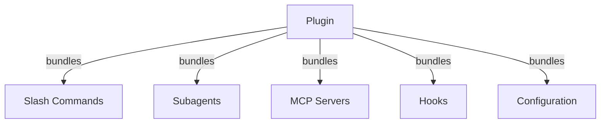

### 复杂插件设计模式

当构建复杂插件时，选择合适的架构模式至关重要。

#### 分层架构

分层架构将插件组织为独立的层级，每层负责特定职责：

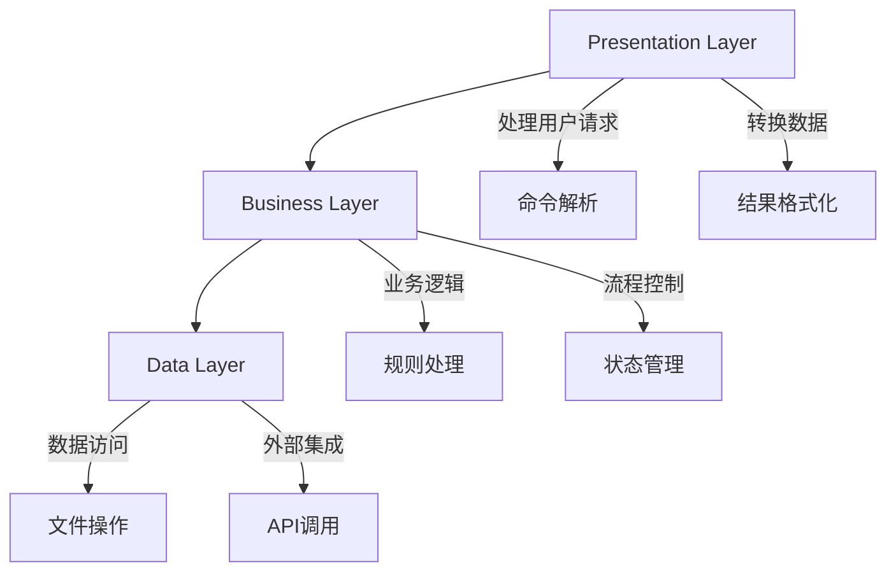

**适用场景：**
- 需要清晰职责分离的大型插件
- 有复杂数据处理流程的插件
- 需要与多个外部系统集成的插件

#### 事件驱动架构

事件驱动架构通过事件总线实现组件间的松耦合通信：

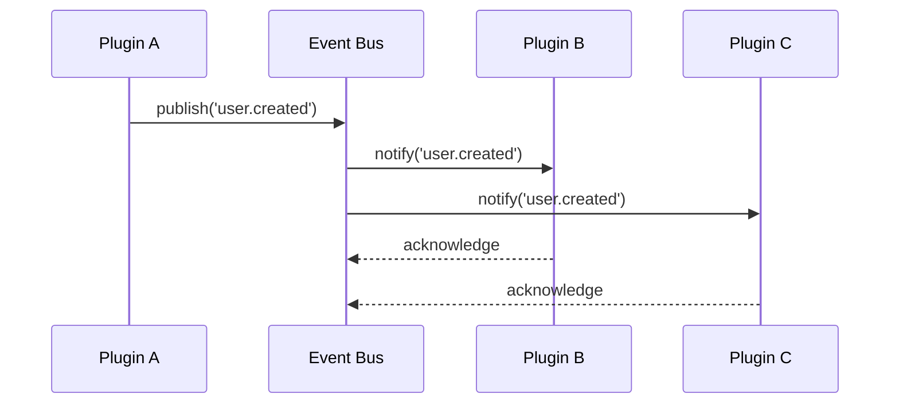

**核心组件：**
- **Event Bus**：中央事件分发器
- **Event Publishers**：发布事件的组件
- **Event Subscribers**：订阅和处理事件的组件

**适用场景：**
- 需要异步处理的插件
- 多组件协作的插件包
- 需要实时响应的插件

#### 微服务架构

微服务架构将插件拆分为独立的服务单元：

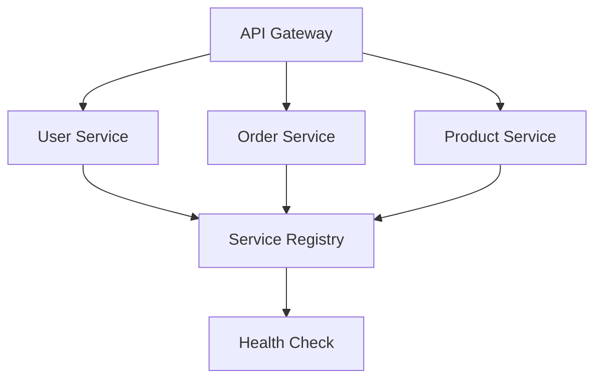

**适用场景：**
- 大型插件包，功能模块独立
- 需要独立部署和扩展的插件
- 企业级复杂插件

#### 设计模式应用

| 设计模式 | 用途 | 示例 |
|----------|------|------|
| **工厂模式** | 创建复杂对象 | 动态创建不同类型的工具 |
| **策略模式** | 可替换的算法 | 不同数据格式的处理策略 |
| **观察者模式** | 事件监听 | 监听配置变更并响应 |
| **装饰器模式** | 功能增强 | 为工具添加日志、缓存、重试 |
| **适配器模式** | 接口转换 | 将外部服务适配为 Claude 工具 |

**装饰器模式示例：**

```typescript
// 为工具添加日志、缓存和重试功能
let tool: Tool = new BaseTool();
tool = new LoggingDecorator(tool);    // 添加日志
tool = new CachingDecorator(tool);     // 添加缓存
tool = new RetryDecorator(tool, 3);    // 添加重试（最多3次）
```

## Plugin 加载流程

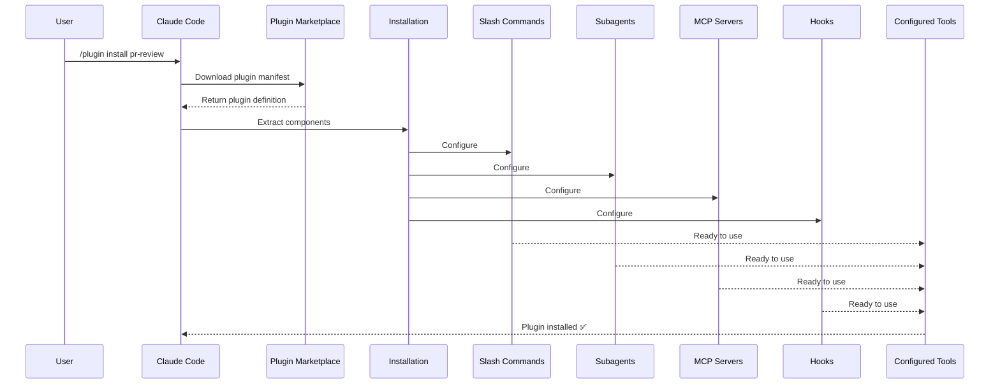

## Plugin 类型与分发

| 类型 | 范围 | 共享 | 权限方 | 示例 |
|------|-------|--------|-----------|----------|
| Official（官方） | 全局 | 所有用户 | Anthropic | PR Review, Security Guidance |
| Community（社区） | 公开 | 所有用户 | 社区 | DevOps, Data Science |
| Organization（组织） | 内部 | 团队成员 | 公司 | 内部标准、工具 |
| Personal（个人） | 个人 | 单个用户 | 开发者 | 自定义工作流 |

## Plugin 定义结构

Plugin manifest 使用 `.claude-plugin/plugin.json` 中的 JSON 格式：

```json
{
  "name": "my-first-plugin",
  "description": "A greeting plugin",
  "version": "1.0.0",
  "author": {
    "name": "Your Name"
  },
  "homepage": "https://example.com",
  "repository": "https://github.com/user/repo",
  "license": "MIT"
}
```

## Plugin 结构示例

```
my-plugin/
├── .claude-plugin/
│   └── plugin.json       # Manifest（名称、描述、版本、作者）
├── commands/             # Skills 作为 Markdown 文件
│   ├── task-1.md
│   ├── task-2.md
│   └── workflows/
├── agents/               # 自定义 agent 定义
│   ├── specialist-1.md
│   ├── specialist-2.md
│   └── configs/
├── skills/               # Agent Skills（含 SKILL.md 文件）
│   ├── skill-1.md
│   └── skill-2.md
├── hooks/                # hooks.json 中的事件处理器
│   └── hooks.json
├── .mcp.json             # MCP server 配置
├── .lsp.json             # LSP server 配置
├── settings.json         # 默认设置
├── templates/
│   └── issue-template.md
├── scripts/
│   ├── helper-1.sh
│   └── helper-2.py
├── docs/
│   ├── README.md
│   └── USAGE.md
└── tests/
    └── plugin.test.js
```

### LSP server 配置

Plugins 可以包含 Language Server Protocol（LSP）支持，提供实时代码智能。LSP servers 在你工作时提供诊断、代码导航和符号信息。

**配置位置**：
- Plugin 根目录中的 `.lsp.json` 文件
- `plugin.json` 中的内联 `lsp` 字段

#### 字段参考

| 字段 | 必需 | 描述 |
|-------|----------|-------------|
| `command` | 是 | LSP server 二进制文件（必须在 PATH 中） |
| `extensionToLanguage` | 是 | 将文件扩展名映射到语言 ID |
| `args` | 否 | server 的命令行参数 |
| `transport` | 否 | 通信方式：`stdio`（默认）或 `socket` |
| `env` | 否 | server 进程的环境变量 |
| `initializationOptions` | 否 | LSP 初始化期间发送的选项 |
| `settings` | 否 | 传递给 server 的工作区配置 |
| `workspaceFolder` | 否 | 覆盖工作区文件夹路径 |
| `startupTimeout` | 否 | 等待 server 启动的最长时间（毫秒） |
| `shutdownTimeout` | 否 | 优雅关闭的最长时间（毫秒） |
| `restartOnCrash` | 否 | server 崩溃时自动重启 |
| `maxRestarts` | 否 | 放弃前的最大重启尝试次数 |

#### 示例配置

**Go (gopls)**：

```json
{
  "go": {
    "command": "gopls",
    "args": ["serve"],
    "extensionToLanguage": {
      ".go": "go"
    }
  }
}
```

**Python (pyright)**：

```json
{
  "python": {
    "command": "pyright-langserver",
    "args": ["--stdio"],
    "extensionToLanguage": {
      ".py": "python",
      ".pyi": "python"
    }
  }
}
```

**TypeScript**：

```json
{
  "typescript": {
    "command": "typescript-language-server",
    "args": ["--stdio"],
    "extensionToLanguage": {
      ".ts": "typescript",
      ".tsx": "typescriptreact",
      ".js": "javascript",
      ".jsx": "javascriptreact"
    }
  }
}
```

#### 可用 LSP plugins

官方 marketplace 包含预配置的 LSP plugins：

| Plugin | 语言 | Server 二进制 | 安装命令 |
|--------|----------|---------------|----------------|
| `pyright-lsp` | Python | `pyright-langserver` | `pip install pyright` |
| `typescript-lsp` | TypeScript/JavaScript | `typescript-language-server` | `npm install -g typescript-language-server typescript` |
| `rust-lsp` | Rust | `rust-analyzer` | 通过 `rustup component add rust-analyzer` 安装 |

#### LSP 能力

配置后，LSP servers 提供：

- **即时诊断** —— 编辑后立即显示错误和警告
- **代码导航** —— 跳转到定义、查找引用、实现
- **悬停信息** —— 悬停时显示类型签名和文档
- **符号列表** —— 浏览当前文件或工作区中的符号

## Plugin 选项（v2.1.83+）

Plugins 可以在 manifest 中通过 `userConfig` 声明用户可配置选项。标记为 `sensitive: true` 的值存储在系统密钥链中，而非明文设置文件：

```json
{
  "name": "my-plugin",
  "version": "1.0.0",
  "userConfig": {
    "apiKey": {
      "description": "API key for the service",
      "sensitive": true
    },
    "region": {
      "description": "Deployment region",
      "default": "us-east-1"
    }
  }
}
```

## Plugin 持久化数据（`${CLAUDE_PLUGIN_DATA}`）（v2.1.78+）

Plugins 通过 `${CLAUDE_PLUGIN_DATA}` 环境变量访问持久化状态目录。此目录对每个 plugin 是唯一的，跨会话持久保存，适合用于缓存、数据库和其他持久化状态：

```json
{
  "hooks": {
    "PostToolUse": [
      {
        "command": "node ${CLAUDE_PLUGIN_DATA}/track-usage.js"
      }
    ]
  }
}
```

plugin 安装时自动创建此目录。存储在这里的文件在 plugin卸载前一直保留。

## 通过设置的内联 Plugin（`source: 'settings'`）（v2.1.80+）

Plugins 可以在设置文件中作为 marketplace 条目使用 `source: 'settings'` 字段内联定义。这允许直接嵌入 plugin 定义，无需单独的仓库或 marketplace：

```json
{
  "pluginMarketplaces": [
    {
      "name": "inline-tools",
      "source": "settings",
      "plugins": [
        {
          "name": "quick-lint",
          "source": "./local-plugins/quick-lint"
        }
      ]
    }
  ]
}
```

## Plugin 设置

Plugins 可以提供 `settings.json` 文件来设置默认配置。目前支持 `agent` 字段，用于设置 plugin 的主线程 agent：

```json
{
  "agent": "agents/specialist-1.md"
}
```

当 plugin 包含 `settings.json` 时，其默认值在安装时应用。用户可以在自己的项目或用户配置中覆盖这些设置。

## 独立 vs Plugin 方案对比

| 方案 | 命令名称 | 配置 | 最佳用途 |
|----------|---------------|---|----------|
| **独立** | `/hello` | 在 CLAUDE.md 中手动设置 | 个人、项目特定 |
| **Plugins** | `/plugin-name:hello` | 通过 plugin.json 自动配置 | 分享、分发、团队使用 |

将 **独立 slash commands** 用于快速个人工作流。将 **plugins** 用于需要打包多种功能、与团队分享或发布分发的情况。

## 实践示例

### 示例 1：PR Review Plugin

**文件：** `.claude-plugin/plugin.json`

```json
{
  "name": "pr-review",
  "version": "1.0.0",
  "description": "Complete PR review workflow with security, testing, and docs",
  "author": {
    "name": "Anthropic"
  },
  "repository": "https://github.com/your-org/pr-review",
  "license": "MIT"
}
```

**文件：** `commands/review-pr.md`

```markdown
---
name: Review PR
description: Start comprehensive PR review with security and testing checks
---

# PR Review

This command initiates a complete pull request review including:

1. Security analysis
2. Test coverage verification
3. Documentation updates
4. Code quality checks
5. Performance impact assessment
```

**文件：** `agents/security-reviewer.md`

```yaml
---
name: security-reviewer
description: Security-focused code review
tools: read, grep, diff
---

# Security Reviewer

Specializes in finding security vulnerabilities:
- Authentication/authorization issues
- Data exposure
- Injection attacks
- Secure configuration
```

**安装：**

```bash
/plugin install pr-review

# Result:
# ✅ 3 slash commands installed
# ✅ 3 subagents configured
# ✅ 2 MCP servers connected
# ✅ 4 hooks registered
# ✅ Ready to use!
```

### 示例 2：DevOps Plugin

**组件：**

```
devops-automation/
├── commands/
│   ├── deploy.md
│   ├── rollback.md
│   ├── status.md
│   └── incident.md
├── agents/
│   ├── deployment-specialist.md
│   ├── incident-commander.md
│   └── alert-analyzer.md
├── mcp/
│   ├── github-config.json
│   ├── kubernetes-config.json
│   └── prometheus-config.json
├── hooks/
│   ├── pre-deploy.js
│   ├── post-deploy.js
│   └── on-error.js
└── scripts/
    ├── deploy.sh
    ├── rollback.sh
    └── health-check.sh
```

### 示例 3：Documentation Plugin

**打包组件：**

```
documentation/
├── commands/
│   ├── generate-api-docs.md
│   ├── generate-readme.md
│   ├── sync-docs.md
│   └── validate-docs.md
├── agents/
│   ├── api-documenter.md
│   ├── code-commentator.md
│   └── example-generator.md
├── mcp/
│   ├── github-docs-config.json
│   └── slack-announce-config.json
└── templates/
    ├── api-endpoint.md
    ├── function-docs.md
    └── adr-template.md
```

## Plugin Marketplace

官方 Anthropic 管理的 plugin 目录是 `anthropics/claude-plugins-official`。企业管理员也可以创建私有 plugin marketplaces 用于内部分发。

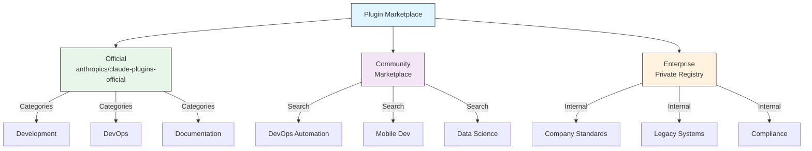

### 访问插件市场

#### 命令行访问

```bash
# 打开插件市场
claude plugin marketplace

# 列出可用插件市场
claude plugin marketplace list

# 添加新的插件市场
claude plugin marketplace add your-org/claude-plugins

# 移除插件市场
claude plugin marketplace remove your-org/claude-plugins
```

#### 斜杠命令访问

```bash
# 打开插件市场
/plugin marketplace

# 列出可用插件
/plugin list

# 搜索插件
/plugin search keyword
```

### 浏览与发现插件

#### 分类浏览

| 分类 | 内容 | 示例插件 |
|------|------|----------|
| **开发工具** | 代码编辑器、调试工具、构建工具 | TypeScript LSP, Python LSP |
| **代码质量** | linting、格式化、静态分析 | ESLint Plugin, Prettier |
| **测试工具** | 单元测试、集成测试、端到端测试 | Jest Runner, Playwright |
| **部署工具** | CI/CD、容器化、云部署 | Docker Manager, AWS Toolkit |
| **文档工具** | 文档生成、API 文档、知识库 | Doc Generator, API Docs |
| **协作工具** | 版本控制、团队协作、项目管理 | GitHub Enhanced, Jira Integration |

#### 推荐系统

插件市场提供多种发现方式：
- 基于使用历史的个性化推荐
- 热门插件排行榜
- 新上架插件推荐
- 编辑精选插件

### Marketplace 配置

企业和高级用户可以通过设置控制 marketplace 行为：

| 设置 | 描述 |
|---------|-------------|
| `extraKnownMarketplaces` | 添加额外的 marketplace 来源（超出默认值） |
| `strictKnownMarketplaces` | 控制允许用户添加哪些 marketplaces |
| `deniedPlugins` | 管理员管理的阻止列表，防止安装特定 plugins |

### 其他 Marketplace 功能

- **默认 git 超时**：从 30 秒增加到 120 秒，用于大型 plugin 仓库
- **自定义 npm registries**：Plugins 可以指定自定义 npm registry URL 用于依赖解析
- **版本锁定**：将 plugins 锁定到特定版本，实现可复现环境

### Marketplace 定义 schema

Plugin marketplaces 在 `.claude-plugin/marketplace.json` 中定义：

```json
{
  "name": "my-team-plugins",
  "owner": "my-org",
  "plugins": [
    {
      "name": "code-standards",
      "source": "./plugins/code-standards",
      "description": "Enforce team coding standards",
      "version": "1.2.0",
      "author": "platform-team"
    },
    {
      "name": "deploy-helper",
      "source": {
        "source": "github",
        "repo": "my-org/deploy-helper",
        "ref": "v2.0.0"
      },
      "description": "Deployment automation workflows"
    }
  ]
}
```

| 字段 | 必需 | 描述 |
|-------|----------|-------------|
| `name` | 是 | Marketplace 名称（kebab-case） |
| `owner` | 是 | 维护 marketplace 的组织或用户 |
| `plugins` | 是 | Plugin 条目数组 |
| `plugins[].name` | 是 | Plugin 名称（kebab-case） |
| `plugins[].source` | 是 | Plugin 来源（路径字符串或来源对象） |
| `plugins[].description` | 否 | 简短的 plugin 描述 |
| `plugins[].version` | 否 | 语义版本字符串 |
| `plugins[].author` | 否 | Plugin 作者名称 |

### Plugin 来源类型

Plugins 可以从多个位置获取：

| 来源 | 语法 | 示例 |
|--------|--------|---------|
| **相对路径** | 字符串路径 | `"./plugins/my-plugin"` |
| **GitHub** | `{ "source": "github", "repo": "owner/repo" }` | `{ "source": "github", "repo": "acme/lint-plugin", "ref": "v1.0" }` |
| **Git URL** | `{ "source": "url", "url": "..." }` | `{ "source": "url", "url": "https://git.internal/plugin.git" }` |
| **Git 子目录** | `{ "source": "git-subdir", "url": "...", "path": "..." }` | `{ "source": "git-subdir", "url": "https://github.com/org/monorepo.git", "path": "packages/plugin" }` |
| **npm** | `{ "source": "npm", "package": "..." }` | `{ "source": "npm", "package": "@acme/claude-plugin", "version": "^2.0" }` |
| **pip** | `{ "source": "pip", "package": "..." }` | `{ "source": "pip", "package": "claude-data-plugin", "version": ">=1.0" }` |

GitHub 和 git 来源支持可选的 `ref`（分支/标签）和 `sha`（提交哈希）字段用于版本锁定。

### 分发方式

**GitHub（推荐）**：
```bash
# 用户添加你的 marketplace
/plugin marketplace add owner/repo-name
```

**其他 git 服务**（需要完整 URL）：
```bash
/plugin marketplace add https://gitlab.com/org/marketplace-repo.git
```

**私有仓库**：通过 git credential helpers 或环境令牌支持。用户必须拥有仓库的读取权限。

**官方 marketplace 提交**：将 plugins 提交到 Anthropic 管理的 marketplace 以获得更广泛的分发。

### 严格模式

控制 marketplace 定义如何与本地 `plugin.json` 文件交互：

| 设置 | 行为 |
|---------|----------|
| `strict: true`（默认） | 本地 `plugin.json` 是权威的；marketplace 条目作为补充 |
| `strict: false` | Marketplace 条目是完整的 plugin 定义 |

**使用 `strictKnownMarketplaces` 的组织限制**：

| 值 | 效果 |
|-------|--------|
| 未设置 | 无限制 —— 用户可以添加任何 marketplace |
| 空数组 `[]` | 锁定 —— 不允许任何 marketplaces |
| 模式数组 | 允许列表 —— 只有匹配的 marketplaces 可以添加 |

```json
{
  "strictKnownMarketplaces": [
    "my-org/*",
    "github.com/trusted-vendor/*"
  ]
}
```

> **警告**：在严格模式下使用 `strictKnownMarketplaces` 时，用户只能从允许列表中的 marketplaces 安装 plugins。这对需要受控 plugin 分发的企业环境很有用。

## Plugin 安装与生命周期

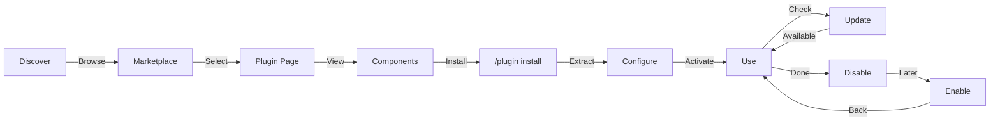

## Plugin 功能对比

| 功能 | Slash Command | Skill | Subagent | Plugin |
|---------|---------------|-------|----------|--------|
| **安装** | 手动复制 | 手动复制 | 手动配置 | 一条命令 |
| **设置时间** | 5 分钟 | 10 分钟 | 15 分钟 | 2 分钟 |
| **打包** | 单文件 | 单文件 | 单文件 | 多个 |
| **版本管理** | 手动 | 手动 | 手动 | 自动 |
| **团队分享** | 复制文件 | 复制文件 | 复制文件 | 安装 ID |
| **更新** | 手动 | 手动 | 手动 | 自动可用 |
| **依赖** | 无 | 无 | 无 | 可能包含 |
| **Marketplace** | 否 | 否 | 否 | 是 |
| **分发** | 仓库 | 仓库 | 仓库 | Marketplace |

## 多插件协作策略

当多个插件需要协同工作时，需要合理设计通信机制和生命周期管理。

### 插件间通信机制

#### 事件总线通信

事件总线是最常用的插件间通信方式，支持松耦合的消息传递：

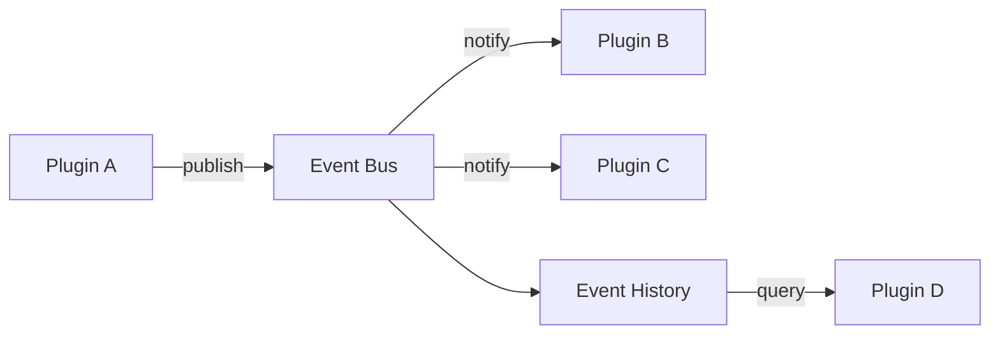

**事件总线特性：**
- 支持多订阅者同时接收事件
- 事件历史记录用于追溯
- 异步处理避免阻塞
- 错误隔离，单个监听器失败不影响其他

**使用示例：**

```typescript
// 插件 A 发布事件
eventBus.publish({
  type: 'user.created',
  source: 'plugin-a',
  data: { userId: 1, name: 'John' },
  timestamp: new Date()
});

// 插件 B 订阅事件
eventBus.subscribe('user.created', async (event) => {
  console.log(`Received: ${event.data.userId}`);
});
```

#### RPC 服务通信

RPC 适用于需要直接调用其他插件功能的场景：

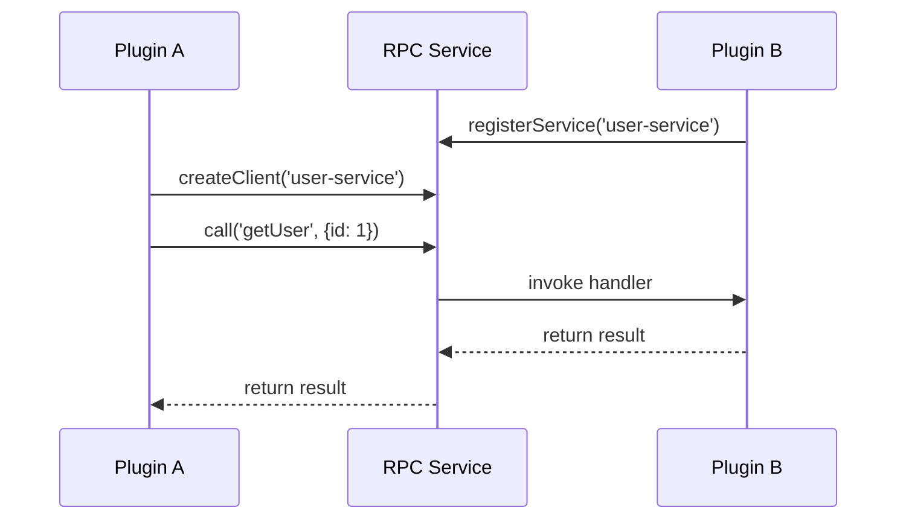

**RPC 通信特点：**
- 直接方法调用，语义明确
- 支持请求-响应模式
- 适合需要精确控制调用的场景

### 插件依赖管理

#### 依赖解析流程

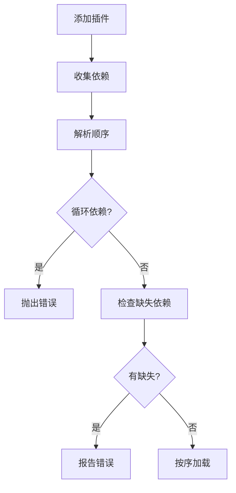

**依赖解析示例：**

```typescript
// 添加插件及其依赖关系
resolver.addPlugin({
  name: 'plugin-a',
  version: '1.0.0',
  dependencies: []
});

resolver.addPlugin({
  name: 'plugin-b',
  version: '1.0.0',
  dependencies: ['plugin-a']  // 依赖 plugin-a
});

resolver.addPlugin({
  name: 'plugin-c',
  version: '1.0.0',
  dependencies: ['plugin-a', 'plugin-b']  // 依赖两者
});

// 解析加载顺序
const order = resolver.resolve();
// 结果: ['plugin-a', 'plugin-b', 'plugin-c']
```

### 插件生命周期协调

多插件的生命周期需要按依赖顺序协调：

| 生命周期阶段 | 执行顺序 | 说明 |
|--------------|----------|------|
| **初始化** | 按依赖顺序 | 先初始化被依赖的插件 |
| **启动** | 按依赖顺序 | 先启动被依赖的插件 |
| **停止** | 反向依赖顺序 | 先停止依赖其他插件的 |
| **清理** | 反向依赖顺序 | 先清理依赖其他插件的 |

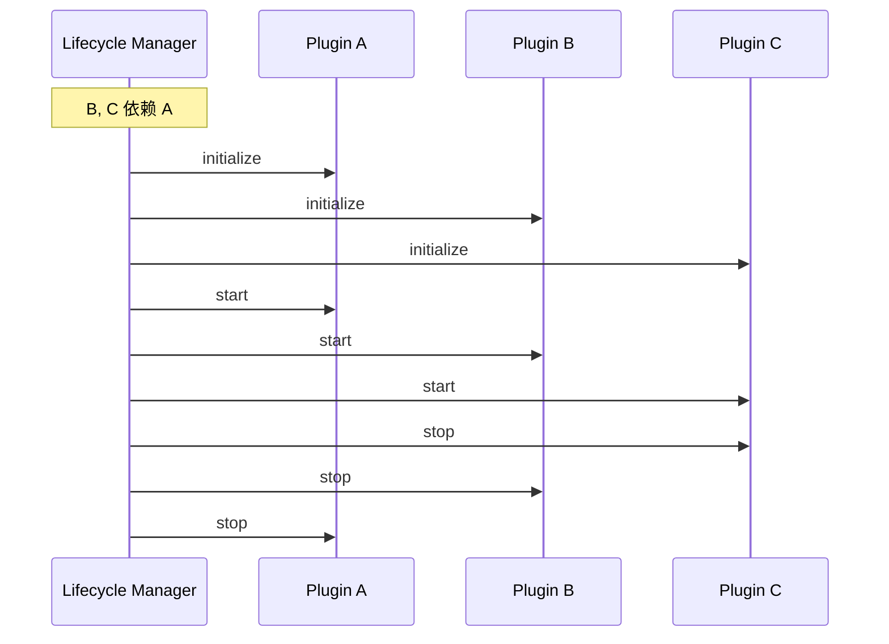

### 协作最佳实践

**推荐做法：**
- 使用事件总线进行松耦合通信
- 明确声明依赖关系
- 避免循环依赖
- 在插件 manifest 中记录依赖版本范围
- 为生命周期事件添加监听器

**避免做法：**
- 直接修改其他插件的状态
- 硬编码其他插件的具体实现
- 创建复杂的依赖链
- 在初始化阶段阻塞等待其他插件

## Plugin CLI 命令

所有 plugin 操作都可用 CLI 命令：

```bash
claude plugin install <name>@<marketplace>   # 从 marketplace 安装
claude plugin uninstall <name>               # 移除 plugin
claude plugin list                           # 列出已安装 plugins
claude plugin enable <name>                  # 启用已禁用的 plugin
claude plugin disable <name>                 # 禁用 plugin
claude plugin validate                       # 验证 plugin 结构
```

## 安装方法

### 从 Marketplace
```bash
/plugin install plugin-name
# 或从 CLI：
claude plugin install plugin-name@marketplace-name
```

### 启用 / 禁用（自动检测范围）
```bash
/plugin enable plugin-name
/plugin disable plugin-name
```

### 本地 Plugin（用于开发）
```bash
# 用于本地测试的 CLI 标志（可重复用于多个 plugins）
claude --plugin-dir ./path/to/plugin
claude --plugin-dir ./plugin-a --plugin-dir ./plugin-b
```

### 从 Git 仓库
```bash
/plugin install github:username/repo
```

##何时创建 Plugin

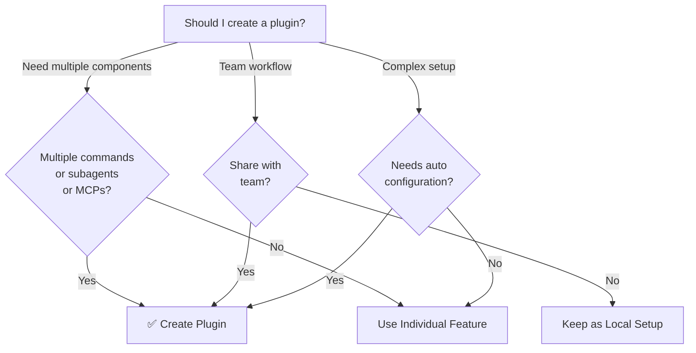

### Plugin 使用场景

| 使用场景 | 推荐 | 原因 |
|----------|-----------------|-----|
| **团队入门** | ✅ 使用 Plugin | 即时设置，完整配置 |
| **框架设置** | ✅ 使用 Plugin | 打包框架特定命令 |
| **企业标准** | ✅ 使用 Plugin | 中心分发，版本控制 |
| **快速任务自动化** | ❌ 使用 Command | 过于复杂 |
| **单领域专家** | ❌ 使用 Skill | 太重，改用 skill |
| **专业分析** | ❌ 使用 Subagent | 手动创建或使用 skill |
| **实时数据访问** | ❌ 使用 MCP | 独立，不打包 |

## 测试 Plugin

发布前，使用 `--plugin-dir` CLI 标志本地测试你的 plugin（可重复用于多个 plugins）：

```bash
claude --plugin-dir ./my-plugin
claude --plugin-dir ./my-plugin --plugin-dir ./another-plugin
```

这会启动加载了你的 plugin 的 Claude Code，让你可以：
- 验证所有 slash commands 可用
- 测试 subagents 和 agents 功能正确
- 确认 MCP servers 正确连接
- 验证 hook 执行
- 检查 LSP server 配置
- 检查任何配置错误

## 热重载

Plugins 在开发期间支持热重载。当你修改 plugin 文件时，Claude Code 可以自动检测变更。你也可以强制重载：

```bash
/reload-plugins
```

这会重新读取所有 plugin manifests、commands、agents、skills、hooks 和 MCP/LSP 配置，无需重启会话。

## Plugin 的托管设置

管理员可以使用托管设置控制整个组织的 plugin 行为：

| 设置 | 描述 |
|---------|-------------|
| `enabledPlugins` | 默认启用的 plugins 允许列表 |
| `deniedPlugins` | 不能安装的 plugins 阻止列表 |
| `extraKnownMarketplaces` | 添加额外的 marketplace 来源（超出默认值） |
| `strictKnownMarketplaces` | 限制允许用户添加哪些 marketplaces |
| `allowedChannelPlugins` | 控制每个发布通道允许哪些 plugins |

这些设置可以通过托管配置文件在组织级别应用，优先于用户级别设置。

## Plugin 安全

Plugin subagents 在受限沙箱中运行。以下 frontmatter 字段在 plugin subagent 定义中**不允许**：

- `hooks` —— Subagents 不能注册事件处理器
- `mcpServers` —— Subagents 不能配置 MCP servers
- `permissionMode` —— Subagents 不能覆盖权限模型

这确保 plugins 不能提升权限或修改超出其声明范围的主机环境。

### 权限管理详解

#### 权限模型

Claude Code 插件权限模型基于以下原则：

| 原则 | 说明 |
|------|------|
| **最小权限原则** | 插件只能获得完成其功能所需的最小权限 |
| **显式授权** | 用户必须明确授予插件权限 |
| **权限隔离** | 插件之间的权限相互隔离 |
| **动态调整** | 权限可以随时授予或撤销 |

#### 权限类型

| 权限类别 | 权限项 | 说明 |
|----------|--------|------|
| **文件系统** | `file:read` | 读取文件系统 |
| | `file:write` | 写入文件系统 |
| | `file:execute` | 执行文件 |
| | `file:read:limited` | 只能读取特定目录 |
| **网络** | `network:http` | 发起 HTTP 请求 |
| | `network:https` | 发起 HTTPS 请求 |
| | `network:http:limited` | 只能访问特定域名 |
| | `network:socket` | 网络套接字连接 |
| **系统** | `system:command` | 执行系统命令 |
| | `system:process` | 进程管理权限 |
| | `system:env` | 环境变量访问 |
| | `system:info` | 系统信息访问 |
| **数据** | `data:config` | 配置数据访问 |
| | `data:history` | 历史数据访问 |
| | `data:cache` | 缓存数据访问 |
| | `data:sensitive` | 敏感数据访问（需特殊授权） |
| **插件** | `plugin:manage` | 插件管理权限 |
| | `plugin:install` | 安装插件 |
| | `plugin:marketplace` | 插件市场访问 |

#### 权限授予方式

**命令行方式：**

```bash
# 授予单个权限
claude plugin permissions --allow file:read formatter@your-org

# 授予多个权限
claude plugin permissions --allow file:read --allow file:write formatter@your-org

# 撤销权限
claude plugin permissions --deny file:write formatter@your-org

# 重置所有权限
claude plugin permissions --reset formatter@your-org
```

**配置文件方式：**

```json
// permissions.json
{
  "plugins": {
    "formatter@your-org": {
      "permissions": {
        "file:read": true,
        "file:write": false,
        "network:http": true
      }
    }
  }
}
```

#### 权限安全最佳实践

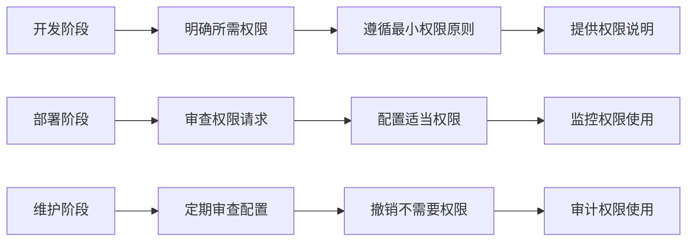

**安全检查清单：**

- [ ] 只授予插件完成功能所需的最小权限
- [ ] 定期检查插件权限，撤销不再需要的权限
- [ ] 实时监控插件权限使用情况
- [ ] 为敏感操作使用专门的插件和权限
- [ ] 保持插件和权限系统的最新版本

#### 权限故障排除

**常见权限问题：**

| 问题 | 错误信息 | 解决方案 |
|------|----------|----------|
| 无法读取文件 | `Permission denied: plugin does not have file:read` | `claude plugin permissions --allow file:read plugin-name` |
| 无法发起网络请求 | `Permission denied: plugin does not have network:http` | `claude plugin permissions --allow network:http plugin-name` |
| 权限被意外撤销 | `Permission denied: no longer has permission` | 查看审计日志，重新授予权限 |

**诊断命令：**

```bash
# 运行权限诊断
claude plugin diagnose --permissions formatter@your-org

# 查看权限审计日志
claude plugin audit formatter@your-org

# 生成权限报告
claude plugin report --permissions formatter@your-org > permissions-report.txt
```

## 发布 Plugin

**发布步骤：**

1. 创建包含所有组件的 plugin 结构
2. 编写 `.claude-plugin/plugin.json` manifest
3. 创建带有文档的 `README.md`
4. 使用 `claude --plugin-dir ./my-plugin` 本地测试
5. 提交到 plugin marketplace
6. 获得审核和批准
7. 在 marketplace 发布
8. 用户可用一条命令安装

**示例提交：**

```markdown
# PR Review Plugin

## Description
Complete PR review workflow with security, testing, and documentation checks.

## What's Included
- 3 slash commands for different review types
- 3 specialized subagents
- GitHub and CodeQL MCP integration
- Automated security scanning hooks

## Installation
```bash
/plugin install pr-review
```

## Features
✅ Security analysis
✅ Test coverage checking
✅ Documentation verification
✅ Code quality assessment
✅ Performance impact analysis

## Usage
```bash
/review-pr
/check-security
/check-tests
```

## Requirements
- Claude Code 1.0+
- GitHub access
- CodeQL (optional)
```

## Plugin vs 手动配置对比

**手动设置（2+ 小时）：**
- 逐个安装 slash commands
- 分别创建 subagents
- 单独配置 MCPs
- 手动设置 hooks
- 文档化所有内容
- 与团队分享（希望他们正确配置）

**使用 Plugin（2 分钟）：**
```bash
/plugin install pr-review
# ✅ 所有内容已安装和配置
# ✅ 立即可用
# ✅ 团队可复现精确设置
```

## 立即尝试

### 🎯 练习 1：安装 Plugin

安装并测试一个 plugin：

```bash
# 步骤 1：浏览可用 plugins
/plugin search code-review

# 步骤 2：安装 plugin
/plugin install code-review

# 步骤 3：验证安装
/plugin list
# 应显示：code-review (installed)

# 步骤 4：测试 plugin
/code-review:review
# 或仅 /review 如果无命名冲突
```

### 🎯 练习 2：创建简单 Plugin

构建一个包含单个 skill 的 plugin：

**步骤 1：创建 plugin 目录**
```bash
mkdir -p my-first-plugin
```

**步骤 2：创建 plugin.json**
```json
{
  "name": "my-first-plugin",
  "version": "1.0.0",
  "description": "A simple example plugin",
  "skills": ["hello"]
}
```

**步骤 3：创建 skill**
```bash
mkdir -p my-first-plugin/skills/hello
```

创建 `my-first-plugin/skills/hello/SKILL.md`：
```markdown
---
name: hello
description: Greet the user
---

# Hello!

Welcome to Claude Code!

Current time: !`date`
Project: !`basename $(git rev-parse --show-toplevel 2>/dev/null || pwd)`

What would you like to work on today?
```

**步骤 4：本地测试**
```bash
# 临时加载 plugin
/plugin load ./my-first-plugin

# 测试
/my-first-plugin:hello
```

### 🎯 练习 3：包含多个组件的 Plugin

创建一个综合 plugin：

**结构：**
```bash
my-dev-plugin/
├── plugin.json
├── README.md
├── skills/
│   ├── review/
│   │   └── SKILL.md
│   ├── commit/
│   │   └── SKILL.md
│   └── test/
│   │   └── SKILL.md
├── commands/
│   ├── deploy.md
│   └── release.md
└── hooks/
    └── PostToolUse/
        └── lint.sh
```

**plugin.json：**
```json
{
  "name": "dev-workflow",
  "version": "1.0.0",
  "description": "Development workflow helpers",
  "skills": ["review", "commit", "test"],
  "commands": ["deploy", "release"],
  "hooks": {
    "PostToolUse": ["lint"]
  }
}
```

### 🎯 练习 4：与团队分享 Plugin

发布你的 plugin：

**步骤 1：创建 GitHub 仓库**
```bash
git init
git add .
git commit -m "Initial plugin release"
git push origin main
```

**步骤 2：团队成员安装**
```bash
# 从仓库 URL
/plugin install https://github.com/yourname/dev-workflow-plugin

# 或从 npm（如果已发布）
/plugin install dev-workflow-plugin
```

**步骤 3：验证团队采纳**
```bash
# 在 Claude Code 中：
/plugin list
# 应显示：dev-workflow (installed, v1.0.0)

/dev-workflow:review
```

### 🎯 练习 5：Plugin 开发工作流

测试和迭代 plugins：

```bash
# 开发循环：
/plugin load ./my-plugin        # 加载本地版本
/my-plugin:test                 # 测试功能
/plugin reload ./my-plugin      # 修改后重载
/my-plugin:test                 # 再次测试

# 满意后：
/plugin unload my-plugin        # 移除临时加载
/plugin install ./my-plugin     # 永久安装
```

## 最佳实践

### 推荐做法 ✅
- 使用清晰、描述性的 plugin 名称
- 包含全面的 README
- 正确版本管理你的 plugin（semver）
- 测试所有组件组合
- 清晰文档化需求
- 提供使用示例
- 包含错误处理
- 适当标记以便发现
- 保持向后兼容
- 保持 plugins 聚焦和内聚
- 包含全面的测试
- 文档化所有依赖

### 避免做法 ❌
- 不打包不相关功能
- 不硬编码凭据
- 不跳过测试
- 不忘记文档
- 不创建冗余 plugins
- 不忽略版本管理
- 不过度复杂化组件依赖
- 不忘记优雅处理错误

### 插件性能优化技巧

性能直接影响用户体验和系统稳定性。以下优化技巧适用于复杂插件开发。

#### 性能分析流程

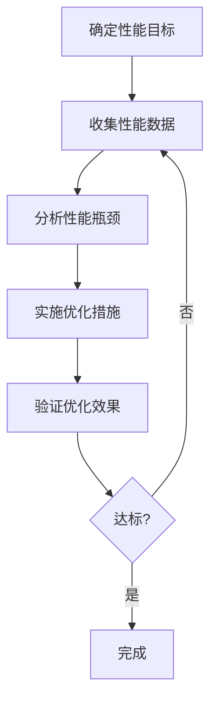

**关键性能指标：**

| 指标 | 说明 | 目标值 |
|------|------|--------|
| **响应时间** | 处理请求所需时间 | < 500ms |
| **吞吐量** | 单位时间处理请求数 | 根据场景定 |
| **内存占用** | 插件运行内存使用 | < 100MB |
| **启动时间** | 插件初始化时间 | < 2s |

#### 代码优化

**算法优化：**

```typescript
// ❌ 优化前：O(n²) 时间复杂度
function findDuplicates(arr) {
  const duplicates = [];
  for (let i = 0; i < arr.length; i++) {
    for (let j = i + 1; j < arr.length; j++) {
      if (arr[i] === arr[j]) duplicates.push(arr[i]);
    }
  }
  return duplicates;
}

// ✅ 优化后：O(n) 时间复杂度
function findDuplicates(arr) {
  const seen = new Set();
  const duplicates = new Set();
  for (const item of arr) {
    if (seen.has(item)) duplicates.add(item);
    seen.add(item);
  }
  return Array.from(duplicates);
}
```

**异步并发优化：**

```typescript
// ❌ 优化前：串行处理
async function processTasks(tasks) {
  const results = [];
  for (const task of tasks) {
    results.push(await processTask(task));
  }
  return results;
}

// ✅ 优化后：并行处理
async function processTasks(tasks) {
  return Promise.all(tasks.map(task => processTask(task)));
}
```

#### 缓存策略

**多级缓存架构：**

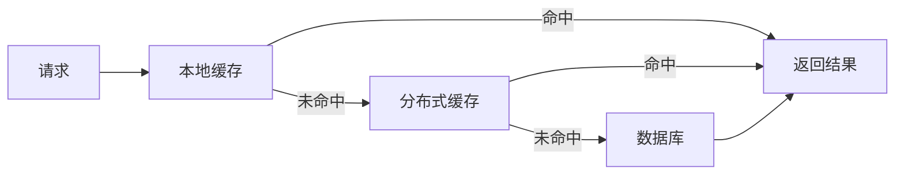

**缓存策略选择：**

| 策略 | 适用场景 | 特点 |
|------|----------|------|
| **LRU** | 通用缓存 | 淘汰最近最少使用 |
| **LFU** | 热点数据缓存 | 淘汰最不常使用 |
| **TTL** | 时效性数据 | 基于时间过期 |

#### 资源管理

**内存优化：**
- 及时释放不再使用的资源
- 使用流处理大文件，避免一次性加载
- 对象池复用频繁创建的对象

**连接池管理：**

```typescript
class ConnectionPool {
  constructor(size) {
    this.size = size;
    this.pool = [];
    this.available = [];
  }
  
  async getConnection() {
    if (this.available.length > 0) return this.available.pop();
    if (this.pool.length < this.size) {
      const conn = await createConnection();
      this.pool.push(conn);
      return conn;
    }
    // 等待可用连接
    return this.waitForAvailable();
  }
  
  releaseConnection(conn) {
    this.available.push(conn);
  }
}
```

#### 性能监控

```typescript
// 性能监控示例
class PerformanceMonitor {
  recordMetric(name, value) {
    // 记录性能指标
    this.metrics.get(name).push({ timestamp: Date.now(), value });
  }
  
  generateReport() {
    return {
      avgResponseTime: this.calculateAverage('responseTime'),
      maxMemoryUsage: this.calculateMax('memoryUsage'),
      requestCount: this.getTotal('requestCount')
    };
  }
}
```

### 插件开发最佳实践

#### API 设计原则

| 原则 | 说明 |
|------|------|
| **单一职责** | 每个接口只负责一个功能 |
| **最小依赖** | 减少接口之间的耦合 |
| **明确契约** | 清晰定义输入输出 |
| **版本管理** | 使用语义化版本控制 |

#### 错误处理规范

```typescript
// 推荐的错误处理方式
try {
  await executeOperation();
} catch (error) {
  context.logger.error('Operation failed', error);
  throw new PluginError(
    'OPERATION_FAILED',
    'Failed to perform operation',
    error
  );
}
```

#### 安全性要求

- **输入验证**：验证所有外部输入
- **权限控制**：检查用户权限
- **数据加密**：保护敏感数据
- **审计日志**：记录重要操作

#### 测试策略

```bash
# 单元测试
npm test

# 测试覆盖率
npm run test -- --coverage

# 性能测试
node benchmark.js

# 负载测试
artillery run load-test.yml
```

## 安装说明

### 从 Marketplace 安装

1. **浏览可用 plugins：**
   ```bash
   /plugin list
   ```

2. **查看 plugin 详情：**
   ```bash
   /plugin info plugin-name
   ```

3. **安装 plugin：**
   ```bash
   /plugin install plugin-name
   ```

### 从本地路径安装

```bash
/plugin install ./path/to/plugin-directory
```

### 从 GitHub 安装

```bash
/plugin install github:username/repo
```

### 列出已安装 Plugins

```bash
/plugin list --installed
```

### 更新 Plugin

```bash
/plugin update plugin-name
```

### 禁用/启用 Plugin

```bash
# 临时禁用
/plugin disable plugin-name

# 重新启用
/plugin enable plugin-name
```

### 卸载 Plugin

```bash
/plugin uninstall plugin-name
```

## 相关概念

以下 Claude Code 功能与 plugins 配合使用：

- **[Slash Commands](../01-slash-commands/)** — 打包在 plugins 中的单个命令
- **[Memory](../02-memory/)** — Plugins 的持久化上下文
- **[Skills](../03-skills/)** — 可包装成 plugins 的领域专业知识
- **[Subagents](../04-subagents/)** — 作为 plugin 组件包含的专用 agents
- **[MCP Servers](../05-mcp/)** — 打包在 plugins 中的 Model Context Protocol 集成
- **[Hooks](../06-hooks/)** — 触发 plugin 工作流的事件处理器
- **实用技能推荐** — 社区高质量 Skills 推荐（见上方章节）

## 完整示例工作流

### PR Review Plugin 完整工作流

```
1. 用户：/review-pr

2. Plugin 执行：
   ├── pre-review.js hook 验证 git 仓库
   ├── GitHub MCP 获取 PR 数据
   ├── security-reviewer subagent 分析安全
   ├── test-checker subagent 验证覆盖率
   └── performance-analyzer subagent 检查性能

3. 结果综合并呈现：
   ✅ 安全：无关键问题
   ⚠️  测试：覆盖率 65%（建议 80%+）
   ✅ 性能：无显著影响
   📝 提供 12 条建议
```

## 故障排除

### Plugin 无法安装
- 检查 Claude Code 版本兼容性：`/version`
- 使用 JSON 验证器验证 `plugin.json` 语法
- 检查网络连接（用于远程 plugins）
- 查看权限：`ls -la plugin/`

### 组件无法加载
- 验证 `plugin.json` 中的路径匹配实际目录结构
- 检查文件权限：`chmod +x scripts/`
- 查看组件文件语法
- 查看日志：`/plugin debug plugin-name`

### MCP 连接失败
- 验证环境变量正确设置
- 检查 MCP server 安装和健康状态
- 使用 `/mcp test` 独立测试 MCP 连接
- 查看 `mcp/` 目录中的 MCP 配置

### 安装后命令不可用
- 确保 plugin 成功安装：`/plugin list --installed`
- 检查 plugin 是否启用：`/plugin status plugin-name`
- 重启 Claude Code：`exit` 并重新打开
- 检查与现有命令的命名冲突

### Hook 执行问题
- 验证 hook 文件有正确权限
- 检查 hook 语法和事件名称
- 查看 hook 日志获取错误详情
- 如果可能，手动测试 hooks

## 实用技能推荐

除了创建自己的 Plugins，Claude Code 社区已经创建了大量高质量的 Skills 可以直接安装使用。以下推荐一些最有价值的技能套件。

### 🌟 Superpowers 技能套件

**Superpowers** 是一套高质量的工作流技能，旨在提升开发效率和代码质量。它包含规划、调试、测试、代码审查等核心开发流程的完整解决方案。

#### 核心技能

| 技能 | 用途 | 何时使用 |
|------|------|----------|
| **using-superpowers** | 技能查找和使用的基础框架 | 每次对话开始时自动检查 |
| **brainstorming** | 将想法转化为设计规格 | 新功能开发前、需求澄清阶段 |
| **writing-plans** | 编写详细实现计划 | 有规格后、开始编码前 |
| **executing-plans** | 执行实现计划 | 计划完成后、逐任务实现 |
| **subagent-driven-development** | 子代理驱动开发 | 多任务并行、需要隔离上下文 |
| **systematic-debugging** | 系统化调试 | 遇到 bug 或测试失败时 |
| **test-driven-development** | 测试驱动开发 | 编写新功能或修复 bug |
| **security-review** | 安全审查 | 处理认证、用户输入、支付等敏感代码 |

#### 工作流组合

这些技能设计为组合使用，形成完整的开发流程：

```
需求 → brainstorming → writing-plans → executing-plans/subagent-driven-development
                                                              ↓
                                          测试失败 → systematic-debugging
                                                              ↓
                                          编码 → test-driven-development
                                                              ↓
                                          完成 → security-review
```

#### 安装方法

Skills 通常存放在 `~/.claude/skills/` 目录中：

```bash
# 查看 Claude Code 配置目录
ls ~/.claude/skills/

# 技能目录结构
~/.claude/skills/
├── brainstorming/
│   └── SKILL.md
├── writing-plans/
│   └── SKILL.md
├── systematic-debugging/
│   └── SKILL.md
└── ...更多技能
```

### 📦 推荐技能分类

#### 开发流程类

| 技能名 | 描述 | 关键特性 |
|--------|------|----------|
| **brainstorming** | 需求头脑风暴 | 逐问题澄清、方案对比、规格文档 |
| **writing-plans** | 编写实现计划 | 小步骤任务、TDD、禁止占位符 |
| **executing-plans** | 执行计划 | 批量执行、检查点审查 |
| **subagent-driven-development** | 子代理开发 | 任务隔离、两阶段审查 |

#### 代码质量类

| 技能名 | 描述 | 关键特性 |
|--------|------|----------|
| **test-driven-development** | TDD 开发 | 红-绿-重构循环、铁律检查 |
| **systematic-debugging** | 系统化调试 | 四阶段流程、根因分析 |
| **security-review** | 安全审查 | OWASP Top 10 检查、安全清单 |
| **code-review** | 代码审查 | 质量检查、模式验证 |

#### 语言/框架专用类

| 技能名 | 适用场景 | 内容 |
|--------|----------|------|
| **python-patterns** | Python 项目 | 设计模式、最佳实践 |
| **golang-patterns** | Go 项目 | 并发模式、错误处理 |
| **rust-patterns** | Rust 项目 | 所有权、生命周期 |
| **typescript-patterns** | TypeScript | 类型设计、泛型模式 |
| **django-patterns** | Django 项目 | Models、Views、安全 |
| **springboot-patterns** | Spring Boot | 依赖注入、配置管理 |

#### 中国特色类

| 技能名 | 用途 | 适用场景 |
|--------|------|----------|
| **chinese-code-review** | 中文代码审查 | 中文团队沟通 |
| **chinese-git-workflow** | 中文 Git 工作流 | Gitee/Coding 等国内平台 |
| **chinese-documentation** | 中文文档编写 | 中文 README、技术文档 |
| **chinese-commit-conventions** | 中文提交规范 | 中文 commit message |

### 🚀 快速开始

#### 1. 确认已安装技能

```bash
# 列出已安装的技能
ls ~/.claude/skills/

# 查看技能详情
cat ~/.claude/skills/brainstorming/SKILL.md
```

#### 2. 使用技能

在对话中直接调用技能：

```
# 头脑风暴新功能
/brainstorming 我想添加一个用户认证功能

# 编写实现计划
/writing-plans 基于上面的设计规格编写计划

# 开始 TDD 开发
/test-driven-development 实现用户登录功能
```

#### 3. 技能自动激活

某些技能会在特定场景自动激活：

- **systematic-debugging** - 当测试失败或遇到 bug
- **security-review** - 当处理认证或用户输入
- **test-driven-development** - 当开始新功能开发

### 💡 使用技巧

#### 技能组合使用

```
# 完整开发流程
/brainstorming 添加支付功能
# ... 完成设计规格 ...

/writing-plans
# ... 生成实现计划 ...

/subagent-driven-development
# ... 逐任务实现 ...

# 代码审查
/security-review
```

#### 模型选择策略

| 任务类型 | 推荐模型 | 原因 |
|----------|----------|------|
| 机械性实现任务 | Haiku | 成本低、速度快 |
| 集成和判断任务 | Sonnet | 平衡性能和成本 |
| 架构设计任务 | Opus | 需要深度推理 |

#### 红线提醒

使用这些技能时要注意：

- **不要跳过流程** - 每个技能设计的流程都有其目的
- **不要猜测修复** - 先调试找到根因再修复
- **不要后补测试** - TDD 要求先写测试
- **不要忽略安全问题** - 安全审查是强制的

### 🔗 获取更多技能

#### 官方资源

- [Claude Code 官方文档](https://code.claude.com)
- [Anthropic GitHub](https://github.com/anthropics/claude-code)

#### 社区资源

- GitHub 上搜索 `claude-code-skills`
- 各语言/框架的专用技能仓库
- 企业内部技能共享

#### 安装社区技能

```bash
# 从 GitHub 仓库安装
git clone https://github.com/user/claude-skills.git ~/.claude/skills/skill-name

# 或使用符号链接
ln -s /path/to/skill ~/.claude/skills/skill-name
```

## 其他资源

- [官方 Plugins 文档](https://code.claude.com/docs/en/plugins)
- [发现 Plugins](https://code.claude.com/docs/en/discover-plugins)
- [Plugin Marketplaces](https://code.claude.com/docs/en/plugin-marketplaces)
- [Plugins 参考](https://code.claude.com/docs/en/plugins-reference)
- [MCP Server 参考](https://modelcontextprotocol.io/)
- [Subagent 配置指南](../04-subagents/README.md)
- [Hook 系统参考](../06-hooks/README.md)