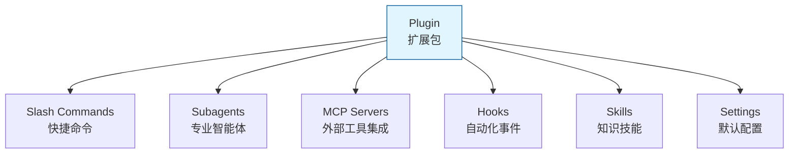
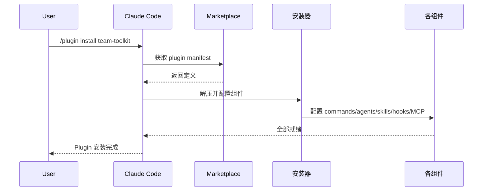
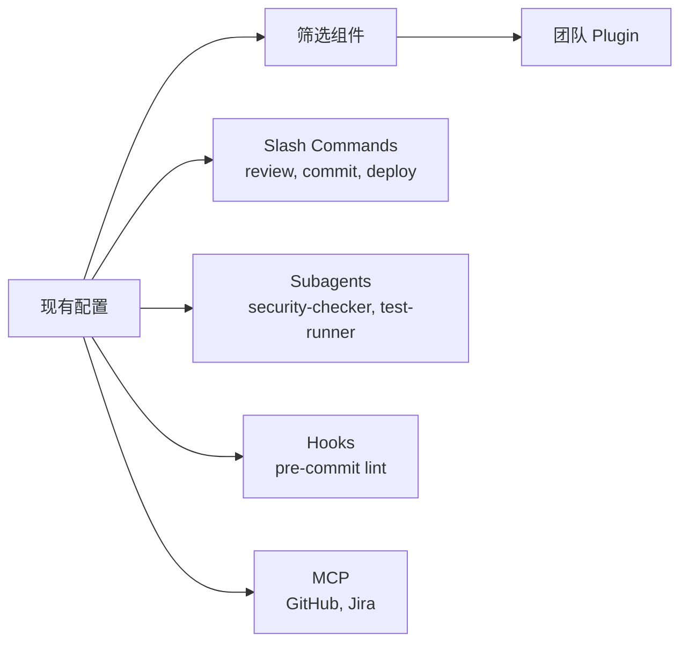
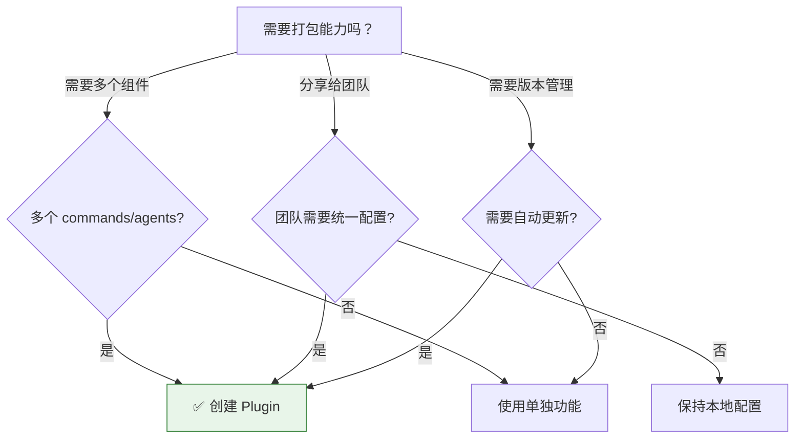

<picture>
  <source media="(prefers-color-scheme: dark)" srcset="../resources/logos/claude-howto-logo-dark.svg">
  
</picture>

> 🟡 **中级** | ⏱ 90 分钟
>
> ✅ 已验证 Claude Code **v2.1.92** · 最后验证：2026-04-06

**你将学会：** 打包 Claude Code 能力，一键分享给团队或发布到社区。

---

## 为什么需要这个？

### 我想把能力打包分享给团队

你已经在 Claude Code 中积累了丰富的配置：

- 几十个精心设计的 Slash Commands
- 多个专业的 Subagents（代码审查、安全分析、测试专家...）
- 与 GitHub、Jira、数据库集成的 MCP Servers
- 自动化工作流的 Hooks

**问题来了：**

> "新人入职要花 2 小时手动复制配置，还经常出错..."
> "团队每个人的配置都不一样，协作时总是出问题..."
> "我想把这些能力分享给其他项目，但要逐个文件复制..."

**Plugin 就是为了解决这个问题：**

把所有能力打包成一个"安装包"，团队成员一条命令就能获得完整配置：

```bash
/plugin install team-dev-toolkit
# ✅ 10 个 slash commands 已安装
# ✅ 5 个 subagents 已配置
# ✅ 3 个 MCP servers 已连接
# ✅ 4 个 hooks 已注册
# 两分钟，所有人的配置完全一致
```

---

## 核心概念

### Plugin 是什么？

Plugin 是 Claude Code 扩展的**最高打包层级**，将多种功能组合为统一、可分发、可安装的集合。



### Plugin vs 其他扩展方式

| 特性 | Slash Command | Skill | Subagent | MCP | **Plugin** |
|------|---------------|-------|----------|-----|------------|
| **打包范围** | 单命令 | 单技能 | 单智能体 | 单工具 | **全部整合** |
| **安装时间** | 手动复制 | 手动复制 | 手动配置 | 手动配置 | **一条命令** |
| **版本管理** | 无 | 无 | 无 | 无 | **自动管理** |
| **团队分享** | 文件复制 | 文件复制 | 配置复制 | 配置复制 | **安装 ID** |
| **自动更新** | 否 | 否 | 否 | 否 | **是** |
| **Marketplace** | 否 | 否 | 否 | 否 | **是** |

**一句话总结：**

> Plugin = Slash Commands + Subagents + MCP + Hooks + Skills + Settings，打包分发，一键安装。

### Plugin 结构

```
my-plugin/
├── .claude-plugin/
│   └── plugin.json       # Manifest（名称、版本、描述）
├── commands/             # Slash Commands
│   ├── review.md
│   └── deploy.md
├── agents/               # Subagents
│   ├── security-checker.md
│   └── test-runner.md
├── skills/               # Skills
│   ├── code-review/
│   │   └── SKILL.md
│   └── testing/
│   │   └── SKILL.md
├── hooks/                # Hooks
│   └── hooks.json
├── .mcp.json             # MCP 配置
├── settings.json         # 默认设置
└── README.md             # 文档
```

### Plugin 加载流程



---

## 实践场景

### 场景 1：安装社区 Plugin

**场景背景：**

你的团队需要规范的 PR Review 流程，但不想从零开始搭建。

**操作步骤：**

```bash
# 1. 搜索相关 plugin
/plugin search pr-review

# 2. 查看 plugin 详情
/plugin info pr-review
# 显示：包含安全检查、测试覆盖率、文档验证等功能

# 3. 安装 plugin
/plugin install pr-review

# 4. 验证安装
/plugin list
# pr-review (installed, v1.2.0)

# 5. 使用 plugin 提供的命令
/pr-review:check
# 或（如果无命名冲突）
/check-pr
```

**安装结果：**

```
✅ 3 slash commands 已安装
   /review-pr, /check-security, /check-tests
✅ 3 subagents 已配置
   security-reviewer, test-checker, doc-validator
✅ 2 MCP servers 已连接
   GitHub, CodeQL
✅ 4 hooks 已注册
   pre-commit 安全扫描等
```

**常用安装来源：**

| 来源 | 命令 | 示例 |
|------|------|------|
| Marketplace | `/plugin install name` | `/plugin install pr-review` |
| GitHub | `/plugin install github:owner/repo` | `/plugin install github:anthropics/code-review-plugin` |
| Git URL | `/plugin install url:https://...` | `/plugin install url:https://git.company.com/plugin.git` |
| 本地路径 | `/plugin install ./path` | `/plugin install ./my-local-plugin` |

---

### 场景 2：创建团队 Plugin

**场景背景：**

你为团队积累了完整的开发工具集，现在要打包分享给所有人。

**步骤 1：规划 Plugin 内容**

先确定要打包哪些组件：



**步骤 2：创建 Plugin 目录**

```bash
mkdir -p team-dev-toolkit
cd team-dev-toolkit

# 创建必要目录
mkdir -p .claude-plugin commands agents skills hooks
```

**步骤 3：编写 Plugin Manifest**

创建 `.claude-plugin/plugin.json`：

```json
{
  "name": "team-dev-toolkit",
  "version": "1.0.0",
  "description": "团队开发工具集：代码审查、安全检查、自动化部署",
  "author": {
    "name": "Platform Team",
    "email": "platform@company.com"
  },
  "repository": "https://github.com/company/team-dev-toolkit",
  "license": "MIT",
  "keywords": ["devops", "code-review", "security"]
}
```

**步骤 4：添加 Slash Commands**

创建 `commands/review.md`：

```markdown
---
name: review
description: 启动完整代码审查流程
---

# 团队代码审查

执行团队标准的代码审查流程：

1. 安全漏洞扫描
2. 测试覆盖率检查
3. 文档完整性验证
4. 性能影响评估
5. 团队规范检查

请提供 PR 链接或分支名称。
```

创建 `commands/deploy.md`：

```markdown
---
name: deploy
description: 执行部署流程
---

# 部署流程

执行团队部署标准流程：

- 环境检查
- 构建验证
- 部署执行
- 健康检查
- 通知团队
```

**步骤 5：添加 Subagents**

创建 `agents/security-checker.md`：

```yaml
---
name: security-checker
description: 安全漏洞检测专家
tools: read, grep, bash
---

# Security Checker

专注于发现安全漏洞：

- SQL 注入
- XSS 攻击
- 硬编码密钥
- 权限绕过
- 敏感数据泄露

使用 OWASP Top 10 作为检查标准。
```

**步骤 6：添加 Hooks**

创建 `hooks/hooks.json`：

```json
{
  "hooks": {
    "PreToolUse": [
      {
        "matcher": "Write|Edit",
        "command": "scripts/pre-commit-check.sh",
        "description": "提交前安全检查"
      }
    ],
    "PostToolUse": [
      {
        "matcher": "Bash",
        "command": "scripts/log-command.sh",
        "description": "记录执行的命令"
      }
    ]
  }
}
```

**步骤 7：本地测试**

```bash
# 使用 --plugin-dir 测试
claude --plugin-dir ./team-dev-toolkit

# 在 Claude Code 中测试所有功能
/team-dev-toolkit:review
/team-dev-toolkit:deploy

# 测试 subagent
请 security-checker 检查 src/auth.ts 的安全问题

# 热重载测试（修改后）
/reload-plugins
```

**步骤 8：验证 Plugin 结构**

```bash
claude plugin validate ./team-dev-toolkit
# 输出：
# ✅ plugin.json 格式正确
# ✅ commands/ 包含 2 个有效命令
# ✅ agents/ 包含 1 个有效 subagent
# ✅ hooks/hooks.json 格式正确
```

---

### 场景 3：发布到 Marketplace

**场景背景：**

你的团队 Plugin 测试完成，要发布到公司内部 Marketplace 供全员使用。

**方案 A：GitHub 分发（推荐）**

```bash
# 1. 创建 GitHub 仓库
git init
git add .
git commit -m "feat: team-dev-toolkit v1.0.0"
git remote add origin https://github.com/company/team-dev-toolkit
git push -u origin main

# 2. 团队成员安装
/plugin install github:company/team-dev-toolkit
```

**方案 B：公司 Marketplace**

创建 `.claude-plugin/marketplace.json`：

```json
{
  "name": "company-plugins",
  "owner": "company",
  "plugins": [
    {
      "name": "team-dev-toolkit",
      "source": "./plugins/team-dev-toolkit",
      "description": "团队开发工具集",
      "version": "1.0.0",
      "author": "Platform Team"
    },
    {
      "name": "data-science",
      "source": {
        "source": "github",
        "repo": "company/data-plugin",
        "ref": "v2.0.0"
      },
      "description": "数据分析工具集"
    }
  ]
}
```

**管理员配置：**

```bash
# 添加公司 Marketplace
claude plugin marketplace add company/claude-plugins

# 或通过配置文件
```

```json
// settings.json
{
  "extraKnownMarketplaces": [
    "company/claude-plugins"
  ],
  "strictKnownMarketplaces": [
    "company/*"
  ]
}
```

**团队成员使用：**

```bash
# 添加公司 marketplace（一次性）
/plugin marketplace add company/claude-plugins

# 浏览公司 plugins
/plugin list --marketplace company-plugins

# 安装团队工具集
/plugin install team-dev-toolkit@company-plugins
```

**版本更新流程：**

```bash
# 1. 更新 plugin 内容
# 2. 更新 plugin.json 中的 version
# 3. 发布新版本
git commit -am "feat: add new command /rollback"
git tag v1.1.0
git push origin main --tags

# 4. 用户更新
/plugin update team-dev-toolkit
```

---

## Plugin 来源类型详解

| 来源类型 | 配置语法 | 适用场景 |
|----------|----------|----------|
| **相对路径** | `"./plugins/my-plugin"` | 本地开发、测试 |
| **GitHub** | `{ "source": "github", "repo": "owner/repo", "ref": "v1.0" }` | 公开分发、版本锁定 |
| **Git URL** | `{ "source": "url", "url": "https://..." }` | 私有 Git 服务器 |
| **Git 子目录** | `{ "source": "git-subdir", "url": "...", "path": "packages/plugin" }` | Monorepo 场景 |
| **npm** | `{ "source": "npm", "package": "@scope/plugin", "version": "^2.0" }` | npm 包分发 |
| **pip** | `{ "source": "pip", "package": "claude-plugin", "version": ">=1.0" }` | Python 生态 |
| **Settings 内联** | `{ "source": "settings" }` | 快速嵌入小型 plugin |

---

## Plugin 高级功能

### 用户可配置选项（v2.1.83+）

Plugin 可以声明用户可配置的选项，敏感值自动存储到系统密钥链：

```json
{
  "name": "api-integration",
  "version": "1.0.0",
  "userConfig": {
    "apiKey": {
      "description": "API 密钥",
      "sensitive": true
    },
    "region": {
      "description": "部署区域",
      "default": "us-east-1"
    },
    "timeout": {
      "description": "请求超时（秒）",
      "default": 30
    }
  }
}
```

安装时会提示用户配置这些选项。

### 持久化数据目录（`${CLAUDE_PLUGIN_DATA}`）

Plugin 可以通过 `${CLAUDE_PLUGIN_DATA}` 环境变量访问持久化数据目录：

```json
{
  "hooks": {
    "PostToolUse": [
      {
        "command": "node ${CLAUDE_PLUGIN_DATA}/track-usage.js"
      }
    ]
  }
}
```

此目录在 plugin 安装时自动创建，卸载前一直保留，适合存储缓存、日志等持久化数据。

### LSP Server 支持

Plugin 可以包含 LSP 配置，提供实时代码智能：

```json
// .lsp.json
{
  "typescript": {
    "command": "typescript-language-server",
    "args": ["--stdio"],
    "extensionToLanguage": {
      ".ts": "typescript",
      ".tsx": "typescriptreact"
    }
  },
  "python": {
    "command": "pyright-langserver",
    "args": ["--stdio"],
    "extensionToLanguage": {
      ".py": "python"
    }
  }
}
```

LSP 提供的能力：
- 即时诊断（错误、警告）
- 代码导航（跳转定义、查找引用）
- 悬停信息（类型签名、文档）
- 符号列表浏览

---

## Plugin 管理 CLI

```bash
# 安装
claude plugin install <name>@<marketplace>
claude plugin install github:owner/repo
claude plugin install ./local-path

# 管理
claude plugin list                  # 列出已安装
claude plugin enable <name>         # 启用
claude plugin disable <name>        # 禁用
claude plugin uninstall <name>      # 卸载

# Marketplace
claude plugin marketplace list      # 列出 marketplaces
claude plugin marketplace add <repo>
claude plugin marketplace remove <repo>

# 开发
claude plugin validate ./path       # 验证结构
claude --plugin-dir ./path          # 本地测试
```

---

## Plugin 安全机制

### Subagent 权限限制

Plugin subagents 运行在受限沙箱中，以下 frontmatter 字段**不允许**：

| 禁止字段 | 原因 |
|----------|------|
| `hooks` | Subagents 不能注册事件处理器 |
| `mcpServers` | Subagents 不能配置 MCP servers |
| `permissionMode` | Subagents 不能覆盖权限模型 |

这确保 plugins 不能提升权限或修改超出声明范围的环境。

### 托管设置控制

管理员可以通过托管设置控制 plugin 行为：

| 设置 | 作用 |
|------|------|
| `enabledPlugins` | 默认启用的 plugins 白名单 |
| `deniedPlugins` | 禁止安装的 plugins 黑名单 |
| `strictKnownMarketplaces` | 限制允许的 marketplace 来源 |
| `extraKnownMarketplaces` | 添加额外的 marketplace |

---

## 🎯 Try It Now

### 练习 1：安装并探索 Plugin（5 分钟）

```bash
# 1. 搜索感兴趣的 plugin
/plugin search code-quality

# 2. 查看详情
/plugin info code-quality

# 3. 安装
/plugin install code-quality

# 4. 探索安装内容
/plugin list --verbose

# 5. 使用 plugin 命令
/code-quality:check
```

### 练习 2：创建最小 Plugin（10 分钟）

```bash
# 1. 创建目录
mkdir -p my-hello-plugin/.claude-plugin
mkdir -p my-hello-plugin/skills/hello

# 2. 创建 manifest
cat > my-hello-plugin/.claude-plugin/plugin.json << 'EOF'
{
  "name": "my-hello-plugin",
  "version": "1.0.0",
  "description": "我的第一个 Plugin"
}
EOF

# 3. 创建 skill
cat > my-hello-plugin/skills/hello/SKILL.md << 'EOF'
---
name: hello
description: 打招呼
---

# Hello!

欢迎使用 Claude Code!

当前项目: !`basename $(pwd)`
当前时间: !`date +"%H:%M"`

有什么我可以帮你的？
EOF

# 4. 测试
claude --plugin-dir ./my-hello-plugin

# 在 Claude Code 中:
/my-hello-plugin:hello
```

### 练习 3：完整团队 Plugin（20 分钟）

按照场景 2 的步骤，创建一个包含：
- 2 个 Slash Commands
- 1 个 Subagent
- 1 个 Hook

的团队 Plugin，本地测试验证。

---

## 常见问题

### Plugin 无法安装

**症状：** `/plugin install xxx` 报错

**排查步骤：**

1. 检查 Claude Code 版本：`claude --version`（某些 plugin 需要最低版本）
2. 检查网络连接（远程 plugin）
3. 验证 plugin.json 语法：`claude plugin validate ./path`
4. 检查 marketplace 是否已添加：`claude plugin marketplace list`

```bash
# 诊断命令
claude plugin diagnose <plugin-name>
```

### 安装后命令不可用

**症状：** `/plugin:command` 无响应

**排查步骤：**

```bash
# 1. 确认 plugin 已安装
/plugin list --installed

# 2. 检查 plugin 是否启用
/plugin status <plugin-name>

# 3. 检查命名冲突
# 如果有同名命令，需要使用完整名称 /plugin-name:command

# 4. 重载 plugin
/reload-plugins
```

### MCP 连接失败

**症状：** Plugin 包含的 MCP server 无法连接

**排查步骤：**

```bash
# 1. 独立测试 MCP
/mcp test <server-name>

# 2. 检查环境变量
# MCP 配置中的环境变量是否正确设置

# 3. 检查 MCP server 安装
# 确保 MCP server 二进制已安装
```

### Hook 执行异常

**症状：** Plugin hooks 没按预期执行

**排查步骤：**

1. 检查 hook 文件权限：`chmod +x scripts/*.sh`
2. 验证 hooks.json 格式
3. 查看 hook 执行日志
4. 手动测试 hook 脚本

### 权限问题

**症状：** Plugin subagent 无法访问某些工具

**说明：** Plugin subagents 有权限限制，不能使用 `hooks`、`mcpServers`、`permissionMode`。

如果需要这些能力，应在 plugin 主线程配置，而非 subagent 定义中。

---

## 何时选择 Plugin



**使用 Plugin 的场景：**

| 场景 | 推荐 | 原因 |
|------|------|------|
| 团队入门配置 | ✅ Plugin | 一键设置，统一标准 |
| 框架开发套件 | ✅ Plugin | 打包框架特定工具 |
| 企业合规工具 | ✅ Plugin | 中心分发，版本控制 |
| 快速个人命令 | ❌ Slash Command | 过于复杂 |
| 单领域知识 | ❌ Skill | 太重，用 skill |
| 实时数据访问 | ❌ MCP | 独立配置即可 |

---

## 相关概念

Plugin 整合了以下 Claude Code 功能：

- **[Slash Commands](../01-slash-commands/)** — 打包为 plugin 的快捷命令
- **[Memory](../02-memory/)** — Plugin 的持久化上下文
- **[Skills](../03-skills/)** — 打包为 plugin 的领域知识
- **[Subagents](../04-subagents/)** — 作为 plugin 组件的智能体
- **[MCP Servers](../05-mcp/)** — 打包为 plugin 的外部工具
- **[Hooks](../06-hooks/)** — Plugin 的自动化事件处理

---

## 下一章预告

> "我的项目很复杂，需要多个 Agent 协作..."

你已经掌握了如何打包和分享单个扩展包。但复杂项目往往需要**多个专业 Agent 同时工作**——代码审查、测试运行、部署监控并行执行。

下一章将介绍 **Multi-Agent 协作**，学习如何：
- 编排多个 Subagents 并行工作
- 设计 Agent 间通信机制
- 实现复杂的自动化工作流

**继续前往：[11-multi-agent](../11-multi-agent/README.md)**

---

## 扩展阅读

- [官方 Plugins 文档](https://code.claude.com/docs/en/plugins)
- [Plugin Marketplaces](https://code.claude.com/docs/en/plugin-marketplaces)
- [Plugins 参考](https://code.claude.com/docs/en/plugins-reference)
- [MCP Server 参考](https://modelcontextprotocol.io/)