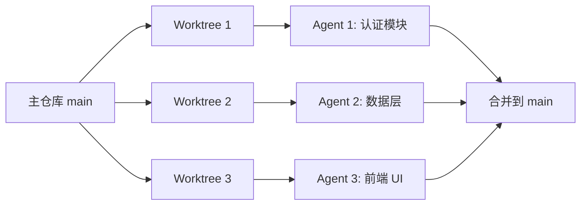
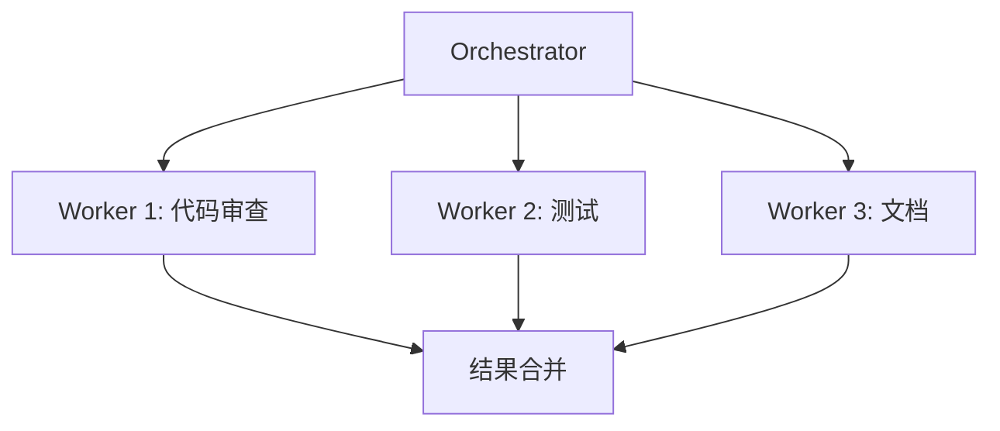
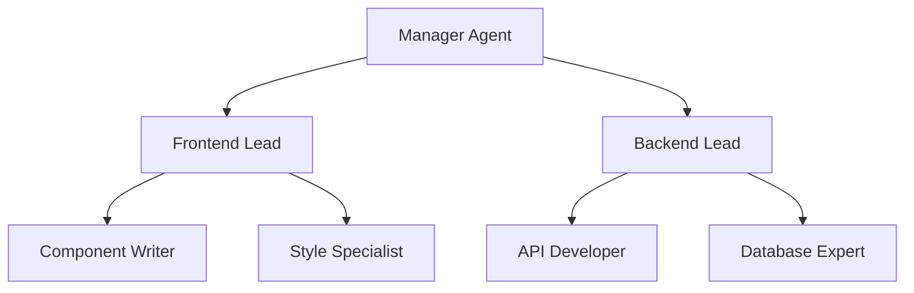
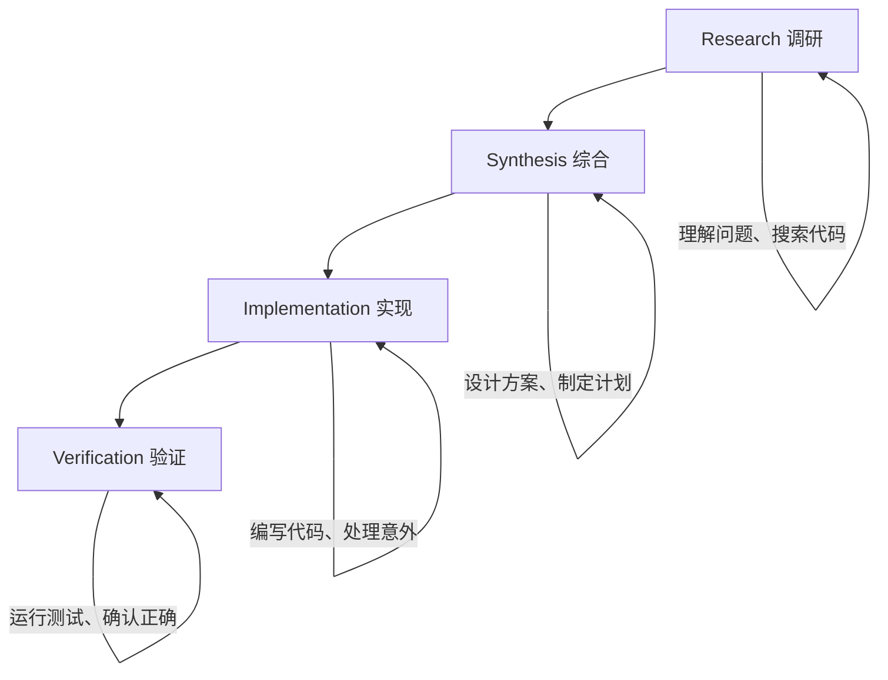

> 🟡 **中级** | ⏱ 90 分钟

# 多 Agent 协作

## 概述

多 Agent 协作是 Claude Code 最强大的能力之一。当你的熟练程度提高后，自然的扩展是**并行操作**：多个 Claude 会话同时运行，每个处理不同的工作流。

### 从单 Agent 到多 Agent

```
单 Agent 工作方式：
你 → Claude → 做任务 A → 做任务 B → 做任务 C
时间：线性增长

多 Agent 工作方式：
你 → Claude → Agent 1（任务 A）
              → Agent 2（任务 B）
              → Agent 3（任务 C）
时间：并行，大幅缩短
```

### Anthropic 内部团队的用法

Boris Cherny（Claude Code 产品负责人）的日常：
```
同时运行：
- 5 个本地 SubAgent（处理不同模块）
- 5-10 个云端 Agent（运行测试、构建、部署）
→ 一个人干一个团队的活
```

> *"我启动一个任务，然后另一个，然后另一个，然后去喝杯咖啡让它们运行。"*
> — Boris Cherny

---

## 基础设施：Git Worktrees

### 什么是 Git Worktree？

Git Worktree 允许你从同一个仓库创建多个工作目录，每个目录可以同时签出不同的分支。

```
传统方式（一个目录）：
my-project/  ← 只能在 main 分支
→ 要切换分支就要 stash 或 commit

Worktree 方式（多个目录）：
my-project/           ← main 分支
my-project-feature-a/ ← feature-a 分支
my-project-feature-b/ ← feature-b 分支
→ 同时在不同分支工作，互不干扰
```

### Worktree 与多 Agent 的关系



每个 Agent 在独立的 worktree 中工作，不会互相冲突，完成后合并分支即可。

### 创建 Worktree

```bash
# 手动创建
git worktree add ../my-project-auth feature/authentication
git worktree add ../my-project-notifications feature/notifications

# Claude Code 自动管理
claude --worktree
# Claude 会：
# 1. 在 .claude/worktrees/ 下创建新的 worktree
# 2. 基于当前 HEAD 创建新分支
# 3. 将工作目录切换到新的 worktree
# 4. 完成后可以选择保留或删除
```

### 合并 Worktree

```bash
cd my-project
git merge feature/authentication
git merge feature/notifications

# 清理已合并的 worktree
git worktree remove ../my-project-auth
```

### 使用 EnterWorktree 工具

Claude Code 提供 `EnterWorktree` 工具来管理 worktree 会话：

```markdown
# 工具参数
- name: worktree 名称（可选，自动生成）

# 行为
- 在 git 仓库中创建新 worktree
- 切换当前会话到新 worktree
- 完成后使用 ExitWorktree 返回

# 何时使用
- 用户明确要求"worktree"
- 需要在不同分支并行工作
```

---

## 协作模式

### 1. Orchestrator-Workers 模式

中央协调器将任务分发给专业工作者：



**使用场景：** 复杂功能开发、大规模重构

**实现方式：**
```bash
# 在 Claude Code 中使用 Agent 工具
Claude 会自动调度多个子代理并行处理任务
```

### 2. 并行执行模式

多个 Agent 同时处理独立子任务：

```bash
# 在 Claude Code 中请求并行执行
"同时运行 3 个子任务：
1. 安全审查 - 检查认证模块
2. 性能分析 - 检查数据库查询
3. 代码质量 - 检查代码风格

完成后汇总报告。"
```

**使用场景：** 代码审查、测试执行、文档更新

### 3. 层级管理模式

多层管理结构处理大型项目：



**使用场景：** 大型团队项目、复杂系统重构

### 4. 流水线模式

顺序处理带依赖的任务：

```bash
"按顺序执行：
1. 设计 API 结构（等待完成）
2. 实现端点（等待完成）
3. 编写测试（等待完成）
4. 生成文档"
```

**使用场景：** 有严格依赖关系的开发流程

### 5. 点对点协作模式

平等的 Agent 共享上下文协作：

```bash
"启动两个协作 Agent：
- Agent A: 实现功能
- Agent B: 同时编写测试

它们共享代码变更，实时同步。"
```

**使用场景：** 功能开发与测试同步进行

## Agent 工具详解

### 基本用法

Claude Code 使用 Agent 工具来调度子代理：

```
Agent 工具参数：
- subagent_type: 代理类型（如 general-purpose, Explore, Plan）
- prompt: 任务描述
- description: 简短任务摘要（3-5词）
- isolation: 是否隔离运行（worktree 模式）
- run_in_background: 是否后台运行
```

### 可用代理类型

| 代理类型 | 用途 | 适用场景 |
|---------|------|----------|
| general-purpose | 通用任务 | 搜索代码、执行多步任务 |
| Explore | 快速探索 | 文件搜索、关键词查找 |
| Plan | 实现规划 | 设计实现策略 |
| code-reviewer | 代码审查 | 所有代码变更 |
| security-reviewer | 安全分析 | 安全敏感代码 |
| build-error-resolver | 构建修复 | 构建失败时 |
| tdd-guide | TDD 指导 | 新功能、bug 修复 |
| architect | 架构设计 | 架构决策 |

### 并行调度技巧

在一条消息中发送多个 Agent 调用：

```markdown
# 正确：并行执行
同时启动 3 个 Agent：
1. security-reviewer 分析认证模块
2. performance-optimizer 分析数据库查询
3. code-reviewer 检查代码风格

# 错误：不必要的顺序
先 Agent 1，等完成，再 Agent 2
```

---

## Agent Teams 配置指南

### 什么是 Agent Teams？

Agent Teams 是多个 Claude Code 会话互相通信和协调的工作模式。与单个 SubAgent 的主从关系不同，Agent Teams 是多对多关系，可以互相通信协调。

```
单个 SubAgent：
主 Agent → SubAgent → 返回结果
一对一关系

Agent Teams：
Writer Agent ←→ Reviewer Agent ←→ Tester Agent
多对多关系，互相通信协调
```

### Writer/Reviewer 模式

最常用的协作模式，适合功能开发：

```
Writer Agent（写代码）:
→ 编写功能代码
→ 发送给 Reviewer

Reviewer Agent（审代码）:
→ 审查代码质量
→ 提出修改建议
→ 发回给 Writer

Writer Agent:
→ 根据建议修改
→ 再次发送给 Reviewer

Reviewer Agent:
→ 确认通过
→ 发送给 Tester

Tester Agent（测代码）:
→ 编写测试用例
→ 运行测试
→ 如果失败，反馈给 Writer

→ 循环直到所有测试通过
```

### 测试驱动模式（TDD）

质量优先的开发模式：

```
Tester Agent:
→ 先写测试用例（测试先行）

Writer Agent:
→ 实现代码让测试通过

Reviewer Agent:
→ 审查实现质量

Tester Agent:
→ 运行所有测试确认通过

→ 代码质量更高，因为有测试保障
```

### 并行会话结构示例

#### 窗口 1：前端会话

```
我们正在为笔记应用程序构建前端。后端 REST API
已经在端口 3001 上运行。你在这个会话中的范围只是 client/ 目录。

首先读取 CLAUDE.md 和 PRD.md。然后实现 PRD 中描述的三面板前端布局：
- 带有笔记列表的侧边栏（从 GET /api/notes 读取）
- 活动笔记的编辑器面板（带有按键防抖自动保存）
- 未选择笔记时的空状态

不要触及 server/ 目录中的任何文件。

首先进入计划模式。在写任何东西之前向我展示你的实现计划。
```

#### 窗口 2：测试套件会话

```
我们正在为笔记应用程序 REST API 编写集成测试。你在这个会话中的范围
是 server/tests/ 目录（如果不存在则创建它）。

读取 CLAUDE.md 和 server/routes/notes.js 文件。编写覆盖以下内容的集成测试：
1. GET /api/notes — 返回数组，当没有笔记存在时返回空数组
2. POST /api/notes — 创建笔记，返回带 id 的笔记，拒绝缺少标题的请求
3. PUT /api/notes/:id — 更新笔记，对不存在的 id 返回 404
4. DELETE /api/notes/:id — 删除笔记，返回 204，如果未找到返回 404

使用 jest + supertest 技术栈。创建 server/tests/notes.test.js。

不要修改 server/tests/ 之外的任何文件。
```

### Tmux 多窗口管理

使用 Tmux 在一个终端窗口中管理多个 Claude 会话：

```
Tmux 窗口布局：
┌─────────────┬─────────────┐
│  Agent 1    │  Agent 2    │
│  (Pane 1)   │  (Pane 2)   │
├─────────────┼─────────────┤
│  Agent 3    │  Agent 4    │
│  (Pane 3)   │  (Pane 4)   │
└─────────────┴─────────────┘

每个 Pane 运行一个独立的 Claude 会话
Ctrl+B + 方向键 切换 Pane
```

```bash
# 创建 Tmux Session
tmux new -s work

# 在不同 Pane 中启动 Claude
Pane 1: cd worktree-1 && claude
Pane 2: cd worktree-2 && claude
Pane 3: cd worktree-3 && claude

# 分配任务
Pane 1: "重构认证模块"
Pane 2: "添加支付功能"
Pane 3: "修复搜索 bug"
```

---

## Coordinator Mode 使用方法

### 四阶段协调模式

Coordinator Mode 是 Claude Code 的高级协调模式，将复杂任务分为四个阶段：



### 各阶段详解

#### 第一阶段：Research（调研）

Claude 自动执行：
- 搜索相关代码和文档
- 理解现有架构
- 识别依赖关系
- 分析可能的方案

**输出：调研报告**

#### 第二阶段：Synthesis（综合）

Claude 基于调研结果：
- 设计实现方案
- 评估各方案的优劣
- 选择最优方案
- 制定详细计划

**输出：实现计划**

#### 第三阶段：Implementation（实现）

Claude 按计划执行：
- 编写/修改代码
- 运行中间验证
- 处理意外情况

**输出：代码变更**

#### 第四阶段：Verification（验证）

Claude 验证实现：
- 运行测试
- 检查类型错误
- 验证功能正确性
- 确认没有副作用

**输出：验证报告**

### Coordinator Mode 激活

```bash
# 在请求中使用四阶段结构
"使用 Coordinator Mode 处理这个任务：
1. Research: 先调研现有代码结构
2. Synthesis: 设计最优实现方案
3. Implementation: 按计划执行
4. Verification: 验证结果正确性

每阶段完成后汇报进展。"
```

## 实战案例

### 案例 1：完整功能开发

```bash
# 使用 Orchestrator 模式开发新功能
"我需要实现用户认证功能。使用多 Agent 协作：

1. Plan Agent：设计认证架构
2. TypeScript Agent：实现前端登录 UI
3. Python Agent：实现后端 API
4. tdd-guide Agent：编写测试用例
5. doc-updater Agent：更新文档

协调这些 Agent 完成任务。"
```

### 案例 2：大型功能开发（完整流程）

目标：为电商平台添加商品推荐功能

```
Step 1: 创建 Worktrees
$ claude --worktree name=recommendation-engine
$ claude --worktree name=api-endpoints
$ claude --worktree name=frontend-ui

Step 2: 启动多个 Agent
Agent 1（recommendation-engine worktree）:
"实现基于协同过滤的推荐算法"

Agent 2（api-endpoints worktree）:
"创建推荐 API 端点，
包括 GET /api/recommendations 和
POST /api/recommendations/feedback"

Agent 3（frontend-ui worktree）:
"创建推荐组件，包括推荐卡片、
推荐列表和'不感兴趣'按钮"

Step 3: 使用 /loop 持续测试
/loop 每 15 分钟运行所有测试

Step 4: 等待 Agent 完成
[去做其他工作...]

Step 5: 审查和合并
→ 检查每个 Agent 的输出
→ 运行集成测试
→ 合并分支
→ 部署
```

### 案例 3：代码审查流水线

```bash
"对当前变更执行多 Agent 审查：

并行启动：
- security-reviewer：检查漏洞
- performance-optimizer：检查性能问题
- code-reviewer：检查代码风格

完成后生成综合报告。"
```

### 案例 4：探索与研究

```bash
"使用 Explore Agent：
- 探索代码库中的认证相关代码
- 搜索关键词 'auth' 和 'login'
- 回答：认证流程是如何实现的？"
```

### 案例 5：TDD 模式开发

```bash
# 测试驱动的多 Agent 协作
"使用 TDD 模式开发支付功能：

1. Tester Agent：先编写支付测试用例
   - 测试支付成功场景
   - 测试支付失败场景
   - 测试退款流程

2. Writer Agent：实现支付逻辑
   - 接收测试用例
   - 编写代码让测试通过

3. Reviewer Agent：审查代码质量
   - 检查安全最佳实践
   - 检查错误处理

循环：Tester 运行测试 → 反馈给 Writer → Writer 修复 → 直到全部通过"
```

## 最佳实践

### 何时使用多 Agent

| 场景 | 推荐模式 | 代理类型 |
|------|----------|----------|
| 复杂功能开发 | Orchestrator-Workers | Plan + 专业代理 |
| 并行审查 | 并行执行 | reviewer 类代理 |
| 大型重构 | 层级管理 | architect + planner |
| 有依赖的任务 | 流水线 | 顺序调度 |
| 创意头脑风暴 | 点对点协作 | general-purpose |
| TDD 开发 | Writer/Reviewer | Tester 先行 |

### 性能优化

- **限制并行数量**：建议 ≤ 5 个并行 Agent
- **使用 worktree 隔离**：避免文件冲突
- **共享只读上下文**：减少重复读取
- **后台运行独立任务**：使用 `run_in_background`
- **设置合理超时**：防止 Agent 无限运行

### 异步工作心智转变

从同步到异步是使用多 Agent 的关键思维转变：

| 旧思维 | 新思维 |
|--------|--------|
| 我要亲手写每一行代码 | 我要设计好系统，让 Agent 去实现 |
| 一个任务做完再做下一个 | 能并行的就并行 |
| 盯着屏幕等结果 | 启动任务后去做其他事 |
| Claude 是一个助手 | Claude 是一个开发团队 |
| 失败了要立即处理 | 让 Agent 自动修复并重试 |

```
新的工作方式：
早上到公司：
1. 分配任务给多个 Agent
2. 让它们并行工作
3. 你做高层次的架构设计、需求分析
4. 下午检查 Agent 的结果
5. 合并、审查、部署

你不是在"用工具"，而是在"管理团队"
```

---

## 协作反模式

### 需要避免的模式

```markdown
# 不要做

❌ 让多个 Agent 修改同一个文件
   → 这会导致合并冲突
   → 使用 Worktree 隔离

❌ 分配过于复杂的任务
   → 单个 Agent 的任务应该有明确边界
   → 复杂任务先分解再分配

❌ 忽略 Agent 的输出
   → Agent 完成后一定要审查结果
   → 不要盲目合并代码

❌ 创建过多并行 Agent
   → 5-10 个通常是合理的范围
   → 太多会消耗过多资源

❌ 在简单任务上使用多 Agent
   → 简单任务单 Agent 更高效
   → 多 Agent 有协调开销

❌ 让 Agent 相互等待不必要
   → 尽量设计独立任务
   → 有依赖的用流水线模式

❌ 在主会话中执行长任务
   → 使用后台运行
   → 避免 blocking 主会话

❌ 硬闯阻塞
   → 遇到问题停下来问用户
   → 不要盲目继续
```

### 合理分配任务原则

```
确保每个 Agent 的任务是独立的
避免两个 Agent 修改同一个文件

✅ 好的分配：
Agent 1: client/ 目录（前端）
Agent 2: server/routes/ 目录（API）
Agent 3: server/tests/ 目录（测试）

❌ 坏的分配：
Agent 1: 实现用户登录
Agent 2: 也实现用户登录（冲突）
```

---

## 高级命令支持

### /batch 批量处理

`/batch` 让你一次性将多个任务发送给 Claude Code，逐个自动处理：

```
场景：处理 10 个 GitHub Issue

你: /batch
Claude: 请提供要处理的任务列表

你:
1. 修复 #101 登录超时问题
2. 修复 #102 搜索结果排序错误
3. 实现 #103 导出 CSV 功能
4. 修复 #104 移动端布局问题

Claude:
→ 开始批量处理
→ Task 1/4: 修复登录超时... ✓
→ Task 2/4: 修复排序错误... ✓
→ Task 3/4: 实现导出 CSV... ✓
→ Task 4/4: 修复布局问题... ✓

✅ 全部完成！
```

### /loop 长时间运行任务

`/loop` 让 Claude Code 在本地长时间运行一个任务，最多支持 **3 天**无人值守：

```bash
# 持续监控测试
/loop 每 5 分钟运行测试，失败时自动修复

# 持续优化性能
/loop 每小时运行性能测试，生成报告
```

### /schedule 云端定时任务

`/schedule` 让你在云端设置定时任务：

```bash
# 每天凌晨运行安全扫描
/schedule 每天 02:00 运行 npm audit 并报告漏洞

# 每周一早上生成周报
/schedule 每周一 09:00 总结上周的 git commit 统计
```

### 非交互模式 (-p 标志)

`-p` 标志让 Claude Code 以非交互方式运行，适合脚本化操作：

```bash
# 基本用法
claude -p "帮我检查这个文件有没有语法错误" < file.js

# 输出到文件
claude -p "生成 API 文档" > api-docs.md

# CI/CD 集成
claude -p "检查代码是否符合规范"
```

## 立即尝试

### 🎯 练习 1：并行代码审查

```bash
# 在 Claude Code 中输入：
"使用并行 Agent 审查 src/ 目录：
1. security-reviewer 检查安全
2. performance-optimizer 检查性能  
3. code-reviewer 检查风格

生成合并报告。"
```

### 🎯 练习 2：功能开发流水线

```bash
"使用流水线模式：
1. Plan 设计数据模型
2. TypeScript 实现 CRUD API
3. tdd-guide 编写单元测试
4. doc-updater 生成 API 文档

每步等待前一步完成。"
```

### 🎯 练习 3：探索模式

```bash
"使用 Explore Agent：
- 查找所有 API 端点
- 搜索错误处理模式
- 回答：API 层的架构是什么？"
```

### 🎯 练习 4：Worktree 并行开发

```bash
# 步骤 1：请求 Claude 创建 worktree
"使用 EnterWorktree 创建一个名为 'feature-auth' 的 worktree"

# 步骤 2：在新 worktree 中开发
"实现用户认证功能，使用 JWT"

# 步骤 3：完成后返回
"使用 ExitWorktree 返回主仓库"
```

### 🎯 练习 5：Coordinator Mode

```bash
"使用 Coordinator Mode 处理重构任务：
1. Research: 分析当前代码结构
2. Synthesis: 设计重构方案
3. Implementation: 执行重构
4. Verification: 运行测试验证

每阶段完成后汇报进展。"
```

### 🎯 练习 6：Writer/Reviewer 模式

```bash
# 在两个终端窗口中分别运行 Claude

# 窗口 1（Writer）：
"你是 Writer Agent。实现用户搜索功能，
完成后通知 Reviewer（窗口 2）审查。"

# 窗口 2（Reviewer）：
"你是 Reviewer Agent。等待 Writer 完成代码，
审查代码质量并提出修改建议。"
```

## 相关资源

- [Subagents 参考](../04-subagents/)
- [后台任务](../12-background-tasks/)
- [CLI 命令](../10-cli/)
- [Git Worktree 指南](https://git-scm.com/docs/git-worktree)
- [Tmux 使用教程](https://github.com/tmux/tmux/wiki)
- [官方文档 - Agents](https://docs.anthropic.com/en/docs/claude-code/agents)

---

> **要点回顾**：多 Agent 协作是 Claude Code 的高级能力，通过 Git Worktrees 实现安全并行开发，使用 Agent Teams 和 Coordinator Mode 进行复杂任务的协调。关键是合理分配任务、避免冲突、定期审查 Agent 输出。