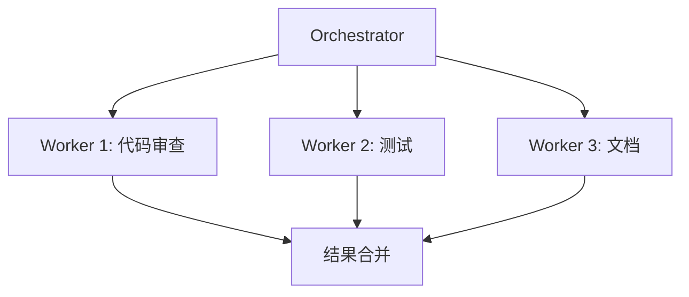
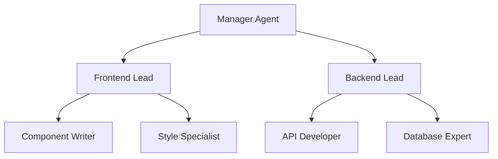

> 🟡 **中级** | ⏱ 90 分钟

# 多 Agent 协作

## 概述

Claude Code 支持多种多 Agent 协作模式，让你能够同时运行多个专业化的智能体来处理复杂任务。

## 协作模式

### 1. Orchestrator-Workers 模式

中央协调器将任务分发给专业工作者：



**使用场景：** 复杂功能开发、大规模重构

**实现方式：**
```bash
# 在 Claude Code 中使用 Agent 工具
Claude 会自动调度多个子代理并行处理任务
```

### 2. 并行执行模式

多个 Agent 同时处理独立子任务：

```bash
# 在 Claude Code 中请求并行执行
"同时运行 3 个子任务：
1. 安全审查 - 检查认证模块
2. 性能分析 - 检查数据库查询
3. 代码质量 - 检查代码风格

完成后汇总报告。"
```

**使用场景：** 代码审查、测试执行、文档更新

### 3. 层级管理模式

多层管理结构处理大型项目：



**使用场景：** 大型团队项目、复杂系统重构

### 4. 流水线模式

顺序处理带依赖的任务：

```bash
"按顺序执行：
1. 设计 API 结构（等待完成）
2. 实现端点（等待完成）
3. 编写测试（等待完成）
4. 生成文档"
```

**使用场景：** 有严格依赖关系的开发流程

### 5. 点对点协作模式

平等的 Agent 共享上下文协作：

```bash
"启动两个协作 Agent：
- Agent A: 实现功能
- Agent B: 同时编写测试

它们共享代码变更，实时同步。"
```

**使用场景：** 功能开发与测试同步进行

## Agent 工具详解

### 基本用法

Claude Code 使用 Agent 工具来调度子代理：

```
Agent 工具参数：
- subagent_type: 代理类型（如 general-purpose, Explore, Plan）
- prompt: 任务描述
- description: 简短任务摘要（3-5词）
- isolation: 是否隔离运行（worktree 模式）
- run_in_background: 是否后台运行
```

### 可用代理类型

| 代理类型 | 用途 | 适用场景 |
|---------|------|----------|
| general-purpose | 通用任务 | 搜索代码、执行多步任务 |
| Explore | 快速探索 | 文件搜索、关键词查找 |
| Plan | 实现规划 | 设计实现策略 |
| code-reviewer | 代码审查 | 所有代码变更 |
| security-reviewer | 安全分析 | 安全敏感代码 |
| build-error-resolver | 构建修复 | 构建失败时 |
| tdd-guide | TDD 指导 | 新功能、bug 修复 |
| architect | 架构设计 | 架构决策 |

### 并行调度技巧

在一条消息中发送多个 Agent 调用：

```markdown
# 正确：并行执行
同时启动 3 个 Agent：
1. security-reviewer 分析认证模块
2. performance-optimizer 分析数据库查询
3. code-reviewer 检查代码风格

# 错误：不必要的顺序
先 Agent 1，等完成，再 Agent 2
```

## 实战案例

### 案例：完整功能开发

```bash
# 使用 Orchestrator 模式开发新功能
"我需要实现用户认证功能。使用多 Agent 协作：

1. Plan Agent：设计认证架构
2. TypeScript Agent：实现前端登录 UI
3. Python Agent：实现后端 API
4. tdd-guide Agent：编写测试用例
5. doc-updater Agent：更新文档

协调这些 Agent 完成任务。"
```

### 案例：代码审查流水线

```bash
"对当前变更执行多 Agent 审查：

并行启动：
- security-reviewer：检查漏洞
- performance-optimizer：检查性能问题
- code-reviewer：检查代码风格

完成后生成综合报告。"
```

### 案例：探索与研究

```bash
"使用 Explore Agent：
- 探索代码库中的认证相关代码
- 搜索关键词 'auth' 和 'login'
- 回答：认证流程是如何实现的？"
```

## 最佳实践

### 何时使用多 Agent

| 场景 | 推荐模式 | 代理类型 |
|------|----------|----------|
| 复杂功能开发 | Orchestrator-Workers | Plan + 专业代理 |
| 并行审查 | 并行执行 | reviewer 类代理 |
| 大型重构 | 层级管理 | architect + planner |
| 有依赖的任务 | 流水线 | 顺序调度 |
| 创意头脑风暴 | 点对点协作 | general-purpose |

### 性能优化

- **限制并行数量**：建议 ≤ 5 个并行 Agent
- **使用 worktree 隔离**：避免冲突
- **共享只读上下文**：减少重复读取
- **后台运行独立任务**：使用 `run_in_background`

### 避免的模式

```markdown
# 不要做
- 不要在简单任务上使用多 Agent
- 不要让 Agent 相互等待不必要
- 不要在主会话中执行长任务（用后台）
- 不要硬闯阻塞——停下来问
```

## 立即尝试

### 🎯 练习 1：并行代码审查

```bash
# 在 Claude Code 中输入：
"使用并行 Agent 审查 src/ 目录：
1. security-reviewer 检查安全
2. performance-optimizer 检查性能  
3. code-reviewer 检查风格

生成合并报告。"
```

### 🎯 练习 2：功能开发流水线

```bash
"使用流水线模式：
1. Plan 设计数据模型
2. TypeScript 实现 CRUD API
3. tdd-guide 编写单元测试
4. doc-updater 生成 API 文档

每步等待前一步完成。"
```

### 🎯 练习 3：探索模式

```bash
"使用 Explore Agent（thoroughness: medium）：
- 查找所有 API 端点
- 搜索错误处理模式
- 回答：API 层的架构是什么？"
```

## 相关资源

- [Subagents 参考](../04-subagents/)
- [后台任务](../12-background-tasks/)
- [CLI 命令](../10-cli/)
- [官方文档 - Agents](https://docs.anthropic.com/en/docs/claude-code/agents)