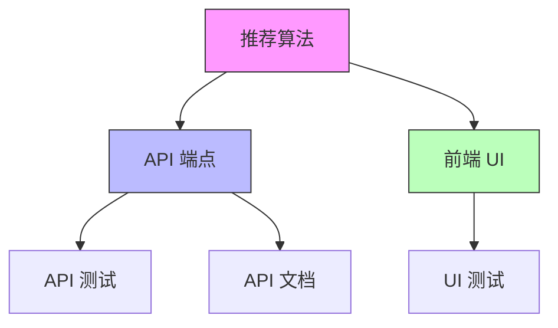
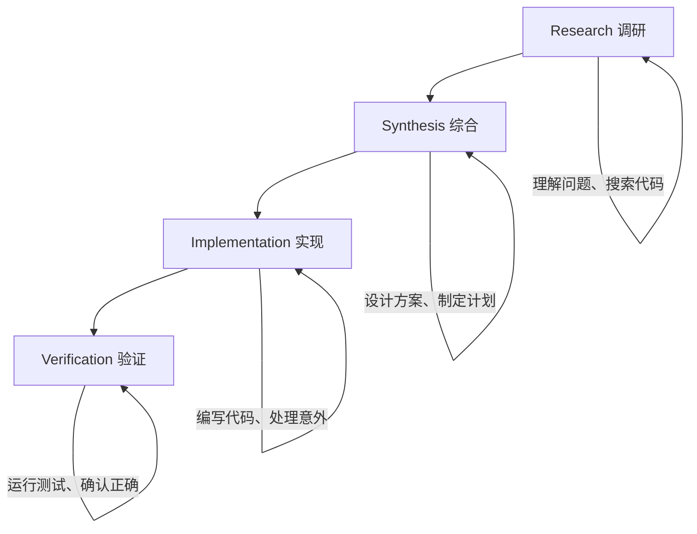

> 🔴 **高级** | ⏱ 90 分钟

# 多 Agent 协作

## 为什么需要这个？

你的项目越来越复杂，单个 Agent 处理不过来了。

"我需要同时开发前端、后端、还要写测试、更新文档..."

"一个大功能涉及多个模块，单线程开发太慢..."

"团队项目需要分工协作，一个人盯不过来..."

这些场景都需要**多 Agent 协作**。

想象一下：你早上启动 5 个 Agent，分别处理不同模块；你去喝杯咖啡，回来发现前端 UI 完成了、API 写好了、测试通过了、文档也更新了。这不是魔法，而是 Claude Code 多 Agent 协作的真实工作方式。

```
传统方式（单线程）：
你 → Claude → 任务 A → 任务 B → 任务 C → 任务 D
时间：线性叠加，一个做完才能做下一个

多 Agent 方式（并行）：
你 → Claude → Agent 1（前端 UI）
              → Agent 2（后端 API）
              → Agent 3（单元测试）
              → Agent 4（API 文档）
              → Agent 5（性能优化）
时间：并行执行，大幅缩短
```

---

## 核心概念

### 什么是多 Agent 协作？

多 Agent 协作是 Claude Code 最强大的能力之一。当你的熟练程度提高后，自然的扩展是**并行操作**：多个 Claude 会话同时运行，每个处理不同的工作流。

```
单个 SubAgent：
主 Agent → SubAgent → 返回结果
一对一关系，主从结构

多 Agent Teams：
Writer Agent ←→ Reviewer Agent ←→ Tester Agent
多对多关系，互相通信协调
```

### Git Worktrees：协作的物理基础

Git Worktree 是多 Agent 协作的物理基础设施。它允许你从同一个仓库创建多个工作目录，每个目录可以同时签出不同的分支。

```
传统方式（一个目录）：
my-project/  ← 只能在 main 分支
→ 要切换分支就要 stash 或 commit

Worktree 方式（多个目录）：
my-project/           ← main 分支
.claude/worktrees/auth/    ← feature/auth 分支
.claude/worktrees/api/     ← feature/api 分支
.claude/worktrees/ui/      ← feature/ui 分支
→ 同时在不同分支工作，互不干扰
```

### 协作模式概览

| 模式 | 结构 | 适用场景 |
|------|------|----------|
| Orchestrator-Workers | 中央协调器分发任务给专业工作者 | 复杂功能开发、大规模重构 |
| 并行执行 | 多个 Agent 同时处理独立子任务 | 代码审查、测试执行 |
| 层级管理 | 多层管理结构处理大型项目 | 大型团队项目 |
| 流水线 | 顺序处理带依赖的任务 | 有严格依赖的开发流程 |
| Writer/Reviewer | 代码编写与审查协作 | 功能开发与测试同步 |

---

## 场景 1：设计多 Agent 系统

### 任务背景

你接到一个大型功能开发需求：为电商平台添加商品推荐系统。涉及：
- 推荐算法引擎（数据科学）
- API 端点开发（后端）
- 前端 UI 组件（前端）
- 单元测试和集成测试（QA）
- API 文档（文档）

单 Agent 处理这种复杂任务效率很低，你需要设计多 Agent 协作方案。

### Step 1：分析任务结构

首先，分析任务的依赖关系：



识别出：
- **推荐算法**是基础，其他模块依赖它
- **API 和前端**可以并行开发（定义好接口后）
- **测试**依赖对应模块完成
- **文档**依赖 API 完成

### Step 2：创建 Worktrees

使用 Claude Code 的 EnterWorktree 工具创建隔离的工作环境：

```bash
# 在 Claude Code 中请求创建 worktrees
"为推荐系统功能创建 3 个 worktree：
1. recommendation-engine（推荐算法）
2. api-endpoints（API 端点）
3. frontend-ui（前端组件）"
```

Claude 会自动：
1. 在 `.claude/worktrees/` 下创建新目录
2. 基于当前 HEAD 创建新分支
3. 将工作目录切换到新 worktree

### Step 3：设计 Agent 分配方案

基于任务分析，设计 Agent 分配：

```markdown
# 多 Agent 协作方案

## Phase 1：基础建设（顺序执行）
Agent 1（recommendation-engine worktree）:
- 类型：architect + Plan
- 任务：设计推荐算法架构，实现协同过滤算法
- 预计时间：60 分钟

## Phase 2：并行开发（同时启动）
Agent 2（api-endpoints worktree）:
- 类型：backend-patterns
- 任务：创建推荐 API 端点
- 输入：推荐算法接口定义
- 预计时间：30 分钟

Agent 3（frontend-ui worktree）:
- 类型：frontend-patterns
- 任务：创建推荐组件
- 输入：推荐 API 文档
- 预计时间：30 分钟

## Phase 3：验证和文档（顺序执行）
Agent 4（主仓库）:
- 类型：tdd-guide
- 任务：编写集成测试
- 输入：完成的代码
- 预计时间：20 分钟

Agent 5:
- 类型：doc-updater
- 任务：更新 API 文档
- 输入：API 端点定义
- 预计时间：10 分钟
```

### Step 4：定义 Agent 通信协议

Agent 之间需要共享信息，定义通信协议：

```markdown
# Agent 通信协议

## 共享上下文
每个 Agent 都应该读取：
1. CLAUDE.md（项目规则）
2. PRD.md（功能需求）
3. ARCHITECTURE.md（系统架构）

## 输出格式
每个 Agent 完成后输出：
1. 完成报告（做了什么）
2. 接口定义（其他 Agent 需要知道）
3. 测试清单（QA Agent 需要验证）
4. 文档更新（Doc Agent 需要同步）

## 决策点
关键决策需要用户确认：
- 算法选择（协同过滤 vs 内容推荐）
- API 设计变更
- UI 设计方案
```

---

## 场景 2：实现协作流程

### 任务背景

你已经设计好了多 Agent 方案，现在要实际启动并协调这些 Agent。

### Step 1：启动 Phase 1 Agent

首先启动基础建设 Agent（推荐算法）：

```bash
# 在 Claude Code 中启动第一个 Agent
"启动 Plan Agent 在 recommendation-engine worktree：
1. 先阅读 CLAUDE.md 和 PRD.md
2. 设计协同过滤推荐算法架构
3. 实现算法核心逻辑
4. 定义输出接口供其他 Agent 使用

完成后输出接口定义。"
```

Claude 会：
1. 使用 EnterWorktree 切换到指定 worktree
2. 启动 Plan Agent 执行任务
3. 完成后返回接口定义

### Step 2：并行启动 Phase 2 Agents

基础完成后，同时启动并行 Agent：

```bash
# 在一条消息中请求并行执行
"推荐算法接口已定义，现在并行启动两个 Agent：

Agent A（api-endpoints worktree）:
创建推荐 API 端点：
- GET /api/recommendations/:userId
- POST /api/recommendations/feedback
接口定义见上一 Agent 输出

Agent B（frontend-ui worktree）:
创建推荐组件：
- RecommendationCard（单个推荐卡片）
- RecommendationList（推荐列表）
- DislikeButton（不感兴趣按钮）
接口定义见上一 Agent 输出

完成后各自输出测试清单。"
```

**关键技巧**：在一条消息中同时请求多个 Agent，Claude 会自动并行调度。

### Step 3：监控 Agent 状态

使用 Tmux 或多个终端窗口监控 Agent：

```bash
# Tmux 窗口布局
┌─────────────┬─────────────┐
│  Agent 1    │  Agent 2    │
│  (API)      │  (Frontend) │
├─────────────┼─────────────┤
│  Agent 3    │  Monitor    │
│  (Tests)    │  (状态监控) │
└─────────────┴─────────────┘

# Ctrl+B + 方向键切换 Pane
```

每个 Pane 运行一个独立的 Claude 会话。

### Step 4：使用 Coordinator Mode 协调

对于复杂任务，使用 Coordinator Mode 四阶段模式：



激活 Coordinator Mode：

```bash
"使用 Coordinator Mode 协调推荐系统开发：
1. Research: 调研现有代码结构
2. Synthesis: 设计最优实现方案
3. Implementation: 按计划执行
4. Verification: 验证结果正确性

每阶段完成后汇报进展，遇到决策点暂停等待我确认。"
```

### Step 5：处理 Agent 输出

每个 Agent 完成后审查输出：

```markdown
# Agent 输出审查清单

## 功能完整性
- [ ] 是否完成所有任务
- [ ] 是否遵循接口定义
- [ ] 是否处理边界情况

## 代码质量
- [ ] 是否符合项目规范
- [ ] 是否有安全漏洞
- [ ] 是否有性能问题

## 集成准备
- [ ] 是否有冲突文件
- [ ] 是否有依赖缺失
- [ ] 是否有文档更新
```

---

## 场景 3：监控和调试

### 任务背景

多 Agent 协作启动后，你需要监控进度、处理问题、合并结果。

### Step 1：实时监控 Agent 状态

使用 `/loop` 命令持续监控：

```bash
# 每隔一段时间检查进度
/loop 每 10 分钟检查所有 worktree 的进度

Claude 会：
→ 检查每个 Agent 的当前状态
→ 运行相关测试确认代码质量
→ 报告进度百分比
→ 发现问题时通知你
```

### Step 2：处理 Agent 失败

当 Agent 遇到问题时：

```bash
# Agent 报告：推荐算法测试失败

你的响应：
"使用 build-error-resolver Agent 分析推荐算法测试失败：
1. 查看测试输出
2. 分析失败原因
3. 提供修复方案

修复后重新运行测试确认。"
```

Claude 会：
1. 启动 build-error-resolver Agent
2. 分析错误日志
3. 提供修复建议
4. 自动修复（如果允许）

### Step 3：解决合并冲突

多个 Agent 可能产生文件冲突：

```bash
# 检查潜在冲突
"检查所有 worktree 与 main 分支的文件差异，
识别可能的合并冲突。"

Claude 会：
→ 运行 git diff 比较各分支
→ 列出冲突文件
→ 提供解决方案
```

解决冲突策略：

```markdown
# 合并冲突解决策略

## 预防优先
- 使用 worktree 隔离不同模块
- 每个 Agent 只修改自己的目录
- 定义清晰的模块边界

## 冲突类型处理
| 类型 | 处理方式 |
|------|----------|
| 代码逻辑冲突 | 手动审查，选择正确逻辑 |
| 格式冲突 | 使用统一 formatter |
| 导入冲突 | 合并导入，去重排序 |
| 配置冲突 | 手动合并，保留必要配置 |

## 冲突解决流程
1. 运行 git merge --no-commit 预览冲突
2. 使用 git mergetool 或手动编辑
3. 运行测试验证
4. 提交合并
```

### Step 4：验证整体系统

所有 Agent 完成后，验证整体系统：

```bash
"所有 Agent 已完成，运行整体验证：
1. 合并所有分支到 main
2. 运行完整测试套件
3. 运行 E2E 测试
4. 检查 API 文档完整性
5. 验证前端 UI 可用性

生成验证报告。"
```

### Step 5：清理 Worktrees

完成后清理：

```bash
"使用 ExitWorktree 关闭所有 worktree：
1. recommendation-engine → 已合并，删除
2. api-endpoints → 已合并，删除
3. frontend-ui → 已合并，删除

返回主仓库。"
```

---

## 🎯 Try It Now

### 练习 1：并行代码审查

```bash
# 在 Claude Code 中输入：
"对 src/ 目录执行并行 Agent 审查：
同时启动：
- security-reviewer：检查安全漏洞
- performance-optimizer：检查性能问题
- code-reviewer：检查代码风格

完成后生成合并报告。"
```

### 练习 2：Worktree 并行开发

```bash
# 步骤 1：创建 worktree
"使用 EnterWorktree 创建名为 'feature-auth' 的 worktree"

# 步骤 2：在新 worktree 中开发
"实现用户认证功能，使用 JWT"

# 步骤 3：完成后返回
"使用 ExitWorktree 返回主仓库"
```

### 练习 3：Coordinator Mode

```bash
"使用 Coordinator Mode 处理重构任务：
1. Research: 分析当前代码结构
2. Synthesis: 设计重构方案
3. Implementation: 执行重构
4. Verification: 运行测试验证

每阶段完成后汇报进展。"
```

### 练习 4：Writer/Reviewer 模式

在两个终端窗口中分别运行 Claude：

```bash
# 窗口 1（Writer）：
"你是 Writer Agent。实现用户搜索功能，
完成后通知 Reviewer（窗口 2）审查。"

# 窗口 2（Reviewer）：
"你是 Reviewer Agent。等待 Writer 完成代码，
审查代码质量并提出修改建议。"
```

---

## 常见问题

### Q1：最多可以并行多少个 Agent？

**推荐 5-10 个并行 Agent**。太少效率不够，太多消耗资源过大。Anthropic 内部团队通常同时运行 5-15 个 Agent。

### Q2：如何避免 Agent 修改同一个文件？

使用 **Worktree 隔离**。每个 Agent 在独立的 worktree 工作，修改不同分支的文件，避免冲突。

```markdown
✅ 好的分配：
Agent 1: client/ 目录（前端）
Agent 2: server/routes/ 目录（API）
Agent 3: server/tests/ 目录（测试）

❌ 坏的分配：
Agent 1: 实现用户登录
Agent 2: 也实现用户登录（冲突）
```

### Q3：Agent 失败怎么办？

Claude Code 会自动处理大部分失败：
1. 使用 build-error-resolver Agent 分析错误
2. 提供修复建议
3. 自动修复并重试（如果允许）

关键决策点会暂停等待你确认。

### Q4：单个 SubAgent vs 多 Agent Teams 有什么区别？

```
单个 SubAgent：
主 Agent → SubAgent → 返回结果
一对一关系，主从结构

多 Agent Teams：
Writer ←→ Reviewer ←→ Tester
多对多关系，互相通信协调
```

SubAgent 适合简单任务，Agent Teams 适合复杂协作。

### Q5：如何判断任务是否需要多 Agent？

| 任务类型 | 推荐方式 |
|----------|----------|
| 单文件编辑 | 单 Agent |
| 独立工具创建 | 单 Agent |
| 文档更新 | 单 Agent |
| 跨多模块功能 | 多 Agent |
| 大规模重构 | 多 Agent |
| 复杂系统调试 | 多 Agent |

### Q6：后台任务如何管理？

使用 `/loop` 和 `/schedule` 管理：

```bash
# 本地长时间运行（最多 3 天）
/loop 每 5 分钟运行测试，失败时自动修复

# 云端定时任务
/schedule 每天 02:00 运行安全扫描
```

---

## 最佳实践

### 任务分配原则

- **限制并行数量**：建议 ≤ 5 个并行 Agent
- **使用 worktree 隔离**：避免文件冲突
- **共享只读上下文**：减少重复读取
- **后台运行独立任务**：使用 `run_in_background`
- **设置合理超时**：防止 Agent 无限运行

### 协作反模式

```markdown
# 不要做

❌ 让多个 Agent 修改同一个文件
❌ 分配过于复杂的任务（单个任务应有明确边界）
❌ 忽略 Agent 的输出（完成后一定要审查）
❌ 创建过多并行 Agent（消耗过多资源）
❌ 在简单任务上使用多 Agent（有协调开销）
❌ 让 Agent 相互等待不必要（尽量设计独立任务）
❌ 在主会话中执行长任务（使用后台运行）
```

### 异步工作心智转变

| 旧思维 | 新思维 |
|--------|--------|
| 我要亲手写每一行代码 | 我要设计好系统，让 Agent 去实现 |
| 一个任务做完再做下一个 | 能并行的就并行 |
| 盯着屏幕等结果 | 启动任务后去做其他事 |
| Claude 是一个助手 | Claude 是一个开发团队 |

---

## 下一章预告

有些任务要跑很长时间...

测试套件要跑几小时，构建过程很漫长，数据迁移要过夜。

下一章 **[后台通道](../12-background-channels/)** 将介绍如何管理这些长时间运行的任务，让 Claude Code 持续工作而你不用盯着屏幕。

---

## 相关资源

- [Subagents 参考](../04-subagents/)
- [后台通道](../12-background-channels/)
- [CLI 命令](../10-cli/)
- [Git Worktree 指南](https://git-scm.com/docs/git-worktree)
- [Tmux 使用教程](https://github.com/tmux/tmux/wiki)
- [官方文档 - Agents](https://docs.anthropic.com/en/docs/claude-code/agents)

---

> **要点回顾**：多 Agent 协作是 Claude Code 的高级能力，核心是（1）Git Worktrees 实现物理隔离，（2）Agent Teams 实现逻辑协调，（3）Coordinator Mode 实现流程控制。关键是合理分配任务、避免冲突、定期审查 Agent 输出。