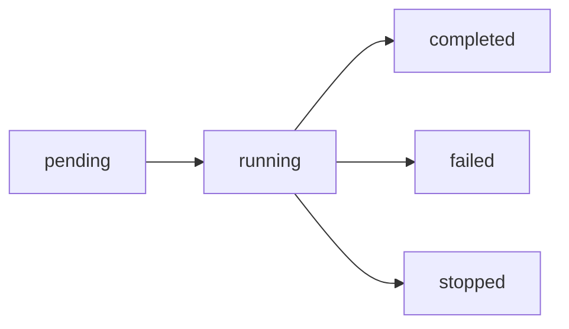

> 🟡 **中级** | ⏱ 45 分钟

# 后台任务

## 概述

后台任务让你能够启动长时间运行的操作，然后在完成时检查结果，而不阻塞你的工作流。

### 前台 vs 后台对比

```
前台任务（默认）：
你: 运行测试
→ [等待测试完成...]
→ [5分钟后]
✓ 测试完成

后台任务：
你: 运行测试（后台）
→ [立即返回]
Task started: task_001
[你可以继续工作...]

[稍后]
你: 检查任务状态
✓ task_001 完成！
```

## 后台任务机制

### 核心概念

后台任务允许：
- **非阻塞执行**：任务在后台运行，你可以继续对话
- **自动通知**：任务完成后自动通知你
- **结果获取**：随时查看任务输出和状态

### 任务类型对比

| 类型 | 运行位置 | 最长时间 | 适用场景 | 命令 |
|------|----------|----------|----------|------|
| Background Shell | 本地 | 当前会话 | 等待长时间命令 | Bash + `run_in_background` |
| Agent 后台 | 本地 | 当前会话 | 独立研究/实现 | Agent + `run_in_background` |
| `/loop` | 本地 | 3 天 | 持续监控和修复 | `/loop [间隔] [任务]` |
| `/schedule` | 云端 | 不限 | 定时执行 | `/schedule [时间] [任务]` |

## 使用方式

### Bash 后台任务

```bash
# 在 Bash 工具中设置 run_in_background: true
{
  "command": "npm test",
  "run_in_background": true
}
```

**特点：**
- 命令在后台执行
- 会话可以继续其他对话
- 完成后收到 `<task-notification>` 通知

### Agent 后台任务

```markdown
# 使用 Agent 工具的后台模式
{
  "subagent_type": "Explore",
  "prompt": "搜索所有 API 端点",
  "description": "探索 API 结构",
  "run_in_background": true
}
```

**特点：**
- 子代理独立运行
- 不阻塞主会话
- 完成后自动通知

## 任务管理

### 查看任务列表

使用 `/tasks` 命令查看所有后台任务：

```bash
/tasks
```

输出示例：
```
Running Tasks:
- a024a90: 探索 API 结构 (running)
- a195852d: 运行测试 (completed)

Background Shells:
- shell_001: npm build (running)
```

### 获取任务输出

使用 TaskOutput 工具：

```markdown
# 获取任务结果
{
  "task_id": "a024a90f936a08281",
  "block": false  // 不阻塞，只检查状态
}

# 或阻塞等待完成
{
  "task_id": "a024a90f936a08281",
  "block": true,
  "timeout": 60000  // 等待最多 60 秒
}
```

### 停止任务

使用 TaskStop 工具：

```markdown
{
  "task_id": "a024a90f936a08281"
}
```

## 实战案例

### 案例：长时间构建

```bash
# 启动构建，继续其他工作
"运行 npm build 在后台，我继续写文档"

# Claude 执行：
{
  "command": "npm run build",
  "run_in_background": true
}

# 你可以继续：
"现在帮我写 README"

# 构建完成后收到通知
<task-notification task_id="...">构建完成</task-notification>
```

### 案例：并行探索

```markdown
# 同时启动多个探索任务
"并行探索：
1. 搜索认证相关代码
2. 搜索数据库相关代码
3. 搜索 API 相关代码

都完成后汇总。"

# Claude 并行启动 3 个后台 Agent
```

### 案例：测试执行

```bash
# 后台运行测试套件
"在后台运行完整测试套件，我继续开发"

{
  "command": "pytest tests/ -v",
  "run_in_background": true,
  "timeout": 300000  // 5 分钟超时
}
```

### 案例：批量并行操作

```bash
# 安装所有微服务的依赖
"安装所有微服务的依赖"

Claude:
发现 5 个微服务

→ cd service-user && npm install & [task_001]
→ cd service-order && npm install & [task_002]
→ cd service-payment && npm install & [task_003]
→ cd service-notif && npm install & [task_004]
→ cd service-frontend && npm install & [task_005]

✓ 已并行启动 5 个安装任务

[10分钟后...]

你: 检查安装状态

Claude:
task_001: ✅ 完成
task_002: ✅ 完成
task_003: ✅ 完成
task_004: 🔄 85%
task_005: ✅ 完成
```

### 案例：长时间模型训练

```bash
# 启动模型训练，需要几小时
"启动模型训练，需要几小时"

Claude:
→ python train.py & [task_ml_001]

✓ 训练已在后台启动
日志文件: logs/training.log

[训练在后台运行...]

[2小时后...]

你: 训练完成了吗？

Claude:
task_ml_001: ✅ 完成
运行时间: 2h 15m 30s

查看结果：
→ 显示训练日志
→ 评估模型性能
```

## `/loop` 持续循环任务

### 什么是 `/loop`？

`/loop` 让 Claude Code 在本地长时间运行一个任务，最多支持 **3 天**无人值守。

```bash
# 持续监控构建状态，失败时自动修复
/loop 每 10 分钟检查构建状态，失败时自动修复

Claude:
→ 设置循环任务
→ 每 10 分钟自动执行
→ 检查构建 → 失败则分析修复 → 重新构建

━━━━━━━━━━━━━━━━━━━━━━━━━━━━━━━━━━━━━━━━
循环任务已启动
任务：检查构建状态
间隔：10 分钟
最长运行：3 天
状态：运行中
━━━━━━━━━━━━━━━━━━━━━━━━━━━━━━━━━━━━━━━━
```

### `/loop` 使用示例

```bash
# 持续监控测试
/loop 每 5 分钟运行测试，失败时自动修复

# 持续监控部署
/loop 每分钟检查部署是否完成

# 持续检查错误日志
/loop 每 15 分钟检查错误日志，发现新错误时报告

# 使用 loop skill 控制循环
/loop-status   # 查看当前循环状态
/loop-start    # 启动新循环
/loop-stop     # 停止循环
```

### `/loop` 最佳实践

```markdown
# 适用场景
- CI/CD 监控与自动修复
- 长时间数据同步监控
- 持续性代码质量检查
- 等待外部服务响应

# 注意事项
- 设置合理的检查间隔（建议 >= 5 分钟）
- 循环任务会占用会话资源
- 重要循环应记录日志便于追溯
```

## `/schedule` 云端定时任务

### 什么是 `/schedule`？

`/schedule` 通过 CronCreate 工具在云端设置定时任务，Claude 会在指定时间自动执行。

```bash
# 每天早上 9 点检查依赖更新
/schedule 每天早上 9 点检查依赖更新

Claude:
→ 创建定时任务
→ 每天 09:00 在云端自动执行
→ 检查 npm audit
→ 如果有更新，生成报告
```

### `/schedule` 使用示例

```bash
# 每天凌晨运行安全扫描
/schedule 每天 02:00 运行 npm audit 并报告漏洞

# 每周一早上生成周报
/schedule 每周一 09:00 总结上周的 git commit 统计

# 工作日每天检查测试覆盖率
/schedule 工作日 18:00 运行测试并检查覆盖率
```

### Cron 表达式格式

使用标准 5 字段 cron 表达式（本地时区）：

```
分钟 小时 日 月 星期

示例：
0 9 * * *      # 每天 09:00
0 2 * * *      # 每天 02:00
0 9 * * 1-5    # 工作日 09:00
0 9 * * 1      # 每周一 09:00
*/5 * * * *    # 每 5 分钟
0 * * * *      # 每小时整点
```

### `/schedule` 配置选项

| 参数 | 说明 |
|------|------|
| `cron` | Cron 表达式（本地时区） |
| `prompt` | 执行时运行的提示词 |
| `recurring` | `true` = 定期执行，`false` = 一次性 |
| `durable` | `true` = 持久化到文件，`false` = 仅内存 |

```markdown
# 持久化定时任务（会话重启后继续）
{
  "cron": "0 9 * * 1-5",
  "prompt": "检查测试覆盖率",
  "recurring": true,
  "durable": true
}
```

## 任务日志管理

### 日志位置

```
~/.claude/tasks/
├── task_001.log
├── task_002.log
├── task_003.log
└── scheduled/
    └── daily_audit.log
```

### 查看日志

```bash
# 查看特定任务的日志
"显示 task_001 的日志"

Claude:
→ tail -n 50 ~/.claude/tasks/task_001.log

[2024-03-15 14:25:00] Task started
[2024-03-15 14:25:01] Running: npm test
[2024-03-15 14:30:15] Test complete
[2024-03-15 14:30:15] All tests passed
```

### 日志最佳实践

```markdown
# 重要任务应保存日志
- 长时间训练任务
- 数据迁移任务
- 批量处理任务

# 日志管理建议
- 定期清理旧日志（超过 7 天）
- 重要日志复制到项目目录
- 使用时间戳便于追溯
```

## 任务监控与调试

### 实时状态监控

```bash
# 查看所有任务状态
/tasks

# 查看特定任务详情
"查看 task_001 的详细状态"

# 监控长时间任务
"每 5 分钟汇报 task_ml_001 的进度"
```

### 常见问题排查

| 问题 | 解决方案 |
|------|----------|
| 任务卡住不动 | 检查日志，可能需要停止并重试 |
| 任务失败 | 查看错误日志，分析失败原因 |
| 资源耗尽 | 限制并行任务数量 |
| 超时终止 | 增加 timeout 参数 |

### 调试技巧

```markdown
# 1. 查看任务输出
{
  "task_id": "...",
  "block": false  // 快速查看状态
}

# 2. 检查日志文件
→ Read ~/.claude/tasks/task_xxx.log

# 3. 测试命令单独运行
先前台运行验证命令正确性，再后台化

# 4. 分阶段执行
复杂任务拆分为多个小任务
```

## 任务状态

### 状态流转



### 状态查询

```markdown
# 使用 TaskOutput 查询状态
{
  "task_id": "...",
  "block": false  // 只查询，不等待
}

# 返回状态信息
{
  "status": "running",
  "progress": "50%"
}
```

## 最佳实践

### ✅ DO - 应该做的

**1. 长时间任务使用后台模式**
```bash
构建大型项目 → 后台
运行完整测试 → 后台
数据库迁移 → 后台
模型训练 → 后台
```

**2. 监控任务状态**
```bash
定期检查后台任务
收到通知后及时处理结果
保存重要任务日志
```

**3. 使用并行处理**
```bash
独立任务可以并行运行
批量操作使用并行策略
限制并行数量避免资源耗尽
```

**4. 设置合理的超时**
```markdown
# 根据任务类型设置 timeout
{
  "command": "npm test",
  "timeout": 120000  // 2 分钟
}

{
  "command": "python train.py",
  "timeout": 3600000  // 1 小时
}
```

**5. 持续监控使用 `/loop`**
```bash
# CI/CD 自动修复
/loop 每 10 分钟检查构建状态，失败时自动修复

# 部署监控
/loop 每分钟检查部署是否完成
```

### ❌ DON'T - 避免做的

**1. 启动太多并行任务**
```bash
# 错误：同时启动 20 个任务
# 正确：限制在 5 个以内，分批次执行
```

**2. 忘记检查结果**
```bash
# 错误：启动后台任务后忽略通知
# 正确：收到通知后立即查看输出
```

**3. 不监控失败的任务**
```bash
# 错误：任务失败后不处理
# 正确：查看日志，分析原因，必要时重试
```

**4. 轮询后台任务状态**
```markdown
# 错误：手动轮询
while running: check status

# 正确：等待自动通知
启动任务 → 继续其他工作 → 收到通知
```

**5. 在后台运行交互命令**
```bash
# 错误：后台运行需要输入的命令
npm init -- 后台运行

# 正确：前台运行交互命令
npm init
```

### 场景推荐

| 场景 | 推荐 | 说明 |
|------|------|------|
| 长时间构建/测试 | ✅ 后台 | 超过 1 分钟的任务 |
| 代码搜索/探索 | ✅ 后台 | Agent 任务可并行 |
| 独立研究任务 | ✅ 后台 | 不依赖其他工作 |
| 持续监控修复 | ✅ `/loop` | 长时间循环任务 |
| 定时执行 | ✅ `/schedule` | 云端定时任务 |
| 需要交互的任务 | ❌ 前台 | 需要输入的命令 |
| 快速简单命令 | ❌ 前台 | 低于 10 秒的任务 |
| 关键部署操作 | ❌ 前台 | 需实时观察输出 |

## 通知机制

### 任务完成通知

```xml
<task-notification>
  <task-id>a024a90...</task-id>
  <output-file>/tmp/output.txt</output-file>
</task-notification>
```

### 处理通知

收到通知后：
1. 使用 Read 工具读取输出文件
2. 或使用 TaskOutput 获取完整结果

```markdown
# 读取输出文件
{
  "file_path": "/tmp/output.txt"
}
```

## 立即尝试

### 🎯 练习 1：后台构建

```bash
# 在 Claude Code 中：
"在后台运行 npm run build，完成后告诉我结果"

# 焦点放在这，让我继续其他工作
"同时帮我写一个简单的测试用例"
```

### 🎯 练习 2：并行探索

```bash
"启动 3 个后台 Explore Agent：
1. 探索 src/ 目录结构
2. 搜索所有 async 函数
3. 搜索所有 TODO 注释

完成后汇总报告。"
```

### 🎯 练习 3：任务监控

```bash
"启动一个长时间测试，然后：
- 用 /tasks 查看状态
- 继续其他对话
- 收到通知后检查结果"
```

### 🎯 练习 4：循环监控

```bash
# 设置一个持续监控任务
/loop 每 5 分钟检查是否有新的错误日志

# 查看循环状态
/loop-status

# 停止循环
/loop-stop
```

### 🎯 练习 5：定时任务

```bash
# 创建一个定时任务
/schedule 每天 09:00 检查 git 状态

# 查看定时任务列表
# 使用 CronList 工具查看已设置的定时任务
```

### 🎯 练习 6：批量并行

```bash
# 模拟批量操作
"假设有 3 个子项目，并行安装它们的依赖：
- project-a
- project-b
- project-c

完成后汇总安装结果。"
```

## 相关资源

- [多 Agent 协作](../11-multi-agent/) - 并行 Agent 执行策略
- [CLI 命令](../10-cli/) - `/tasks` 命令详解
- [Subagents 参考](../04-subagents/) - Agent 后台模式
- [Checkpoints](../08-checkpoints/) - 任务状态快照
- [CronCreate 工具文档](https://docs.anthropic.com/claude-code/cron)

## 下一步

掌握后台任务后，继续学习 [Checkpoints](../08-checkpoints/) 了解会话快照与回滚。