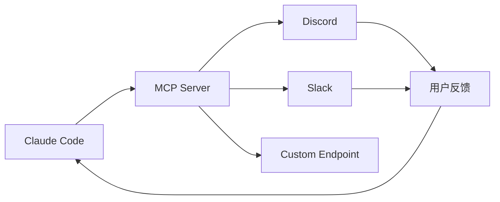

> 🟡 **中级** | ⏱ 40 分钟

# Channels（消息通道）

## 概述

Channels 是 Claude Code 的消息推送机制，通过 MCP 协议实现实时通信，支持 Discord、Slack 等平台集成。

## MCP Channels 基础

### 什么是 Channels

Channels 是基于 MCP（Model Context Protocol）的消息通道：
- **实时推送**：主动发送消息到外部平台
- **双向通信**：接收外部指令和反馈
- **事件驱动**：响应代码事件自动触发

### 核心概念



## 配置方式

### MCP Server 配置

在 `~/.claude/settings.json` 中配置：

```json
{
  "mcpServers": {
    "discord-channel": {
      "command": "node",
      "args": ["mcp-discord-server.js"],
      "env": {
        "DISCORD_TOKEN": "your-token",
        "CHANNEL_ID": "your-channel-id"
      }
    },
    "slack-channel": {
      "command": "python",
      "args": ["mcp_slack_server.py"],
      "env": {
        "SLACK_BOT_TOKEN": "xoxb-...",
        "CHANNEL_ID": "C..."
      }
    }
  }
}
```

### Channel 工具

MCP Channels 提供的工具：

| 工具 | 用途 |
|------|------|
| `send_message` | 发送消息到通道 |
| `receive_messages` | 接收新消息 |
| `list_channels` | 列出可用通道 |
| `subscribe_events` | 订阅事件 |

## 使用场景

### 场景 1：构建通知

```bash
# 构建完成后自动通知 Discord
"配置 Hook：构建完成后发送 Discord 消息"

# Hook 配置
{
  "hooks": {
    "Stop": [{
      "command": "mcp discord-channel send_message '构建完成'",
      "description": "通知构建结果"
    }]
  }
}
```

### 场景 2：团队协作

```markdown
# 通过 Slack 接收团队反馈
"检查 Slack channel 中的新消息"

# Claude 使用 MCP 工具
mcp__slack-channel__receive_messages

# 处理反馈
"根据团队反馈修改代码"
```

### 场景 3：事件订阅

```bash
# 订阅代码变更事件
"当检测到 git commit 时，通知 Discord"

# 配置自动触发
{
  "hooks": {
    "PostToolUse": [{
      "matcher": "Bash",
      "command": "mcp discord-channel send_message '新提交：$COMMIT_MSG'",
      "description": "通知新提交"
    }]
  }
}
```

## Discord 集成

### 设置 Discord Bot

1. 创建 Discord Bot
2. 获取 Bot Token
3. 获取 Channel ID
4. 配置 MCP Server

```json
{
  "mcpServers": {
    "discord": {
      "command": "npx",
      "args": ["-y", "@anthropic/mcp-discord"],
      "env": {
        "DISCORD_TOKEN": "Bot ...",
        "CHANNEL_ID": "123456789"
      }
    }
  }
}
```

### Discord 工具使用

```markdown
# 发送消息
mcp__discord__send_message({
  "content": "构建成功！✅"
})

# 接收消息
mcp__discord__receive_messages({
  "limit": 10
})
```

## Slack 集成

### 设置 Slack App

1. 创建 Slack App
2. 获取 Bot Token (xoxb-...)
3. 获取 Channel ID
4. 配置 MCP Server

```json
{
  "mcpServers": {
    "slack": {
      "command": "npx",
      "args": ["-y", "@anthropic/mcp-slack"],
      "env": {
        "SLACK_BOT_TOKEN": "xoxb-...",
        "CHANNEL_ID": "C..."
      }
    }
  }
}
```

### Slack 工具使用

```markdown
# 发送消息
mcp__slack__send_message({
  "text": "测试通过 ✅",
  "channel": "C..."
})

# 接收消息
mcp__slack__receive_messages({
  "channel": "C...",
  "limit": 20
})
```

## 自定义 Channels

### 创建自定义 MCP Server

```python
# mcp_custom_channel.py
from mcp.server import Server
from mcp.types import Tool

server = Server("custom-channel")

@server.tool()
async def send_notification(message: str) -> str:
    """发送通知到自定义端点"""
    # 发送到你的 API
    response = await post_to_api(message)
    return f"已发送: {message}"

@server.tool()
async def receive_feedback() -> list:
    """接收反馈"""
    # 从你的 API 获取
    return await get_feedback()
```

### 配置自定义 Server

```json
{
  "mcpServers": {
    "custom": {
      "command": "python",
      "args": ["mcp_custom_channel.py"]
    }
  }
}
```

## 最佳实践

### 何时使用 Channels

| 场景 | 推荐 |
|------|------|
| 团队通知 | ✅ Discord/Slack |
| CI/CD 集成 | ✅ 自定义 Channel |
| 实时反馈 | ✅ 双向 Channel |
| 单用户场景 | ❌ 不需要 |

### 避免的模式

```markdown
# 不要做
- 不要在敏感信息中使用公开 Channel
- 不要频繁发送消息（会打扰）
- 不要忽略消息格式规范
- 不要阻塞等待 Channel 响应
```

### 推荐模式

```markdown
# 好习惯
- 使用 Hook 自动触发通知
- 设置合理的消息频率
- 包含上下文信息
- 使用格式化消息（Markdown）
```

## 消息格式

### Discord 消息格式

```markdown
# 使用 Discord Markdown
**构建状态**: ✅ 成功
**分支**: main
**提交**: abc123

变更摘要:
- feat: 添加认证
- fix: 修复 bug
```

### Slack 消息格式

```json
{
  "text": "构建完成",
  "blocks": [
    {
      "type": "section",
      "text": {
        "type": "mrkdwn",
        "text": "*构建状态*: ✅ 成功"
      }
    }
  ]
}
```

## 立即尝试

### 🎯 练习 1：配置 Discord

```bash
# 1. 创建 Discord Bot
# 2. 获取 Token 和 Channel ID
# 3. 配置 ~/.claude/settings.json
# 4. 测试发送消息

"测试 Discord Channel：发送 'Hello from Claude Code'"
```

### 🎯 练习 2：自动通知

```bash
# 配置 Stop Hook
"配置 Hook：每次会话结束时通知 Discord"

# 编辑 ~/.claude/settings.json
{
  "hooks": {
    "Stop": [{
      "command": "claude mcp discord send_message '会话结束'",
      "description": "通知会话结束"
    }]
  }
}
```

### 🎯 练习 3：接收反馈

```bash
"检查 Slack Channel 的最新消息并处理反馈"

# Claude 会：
1. 调用 mcp__slack__receive_messages
2. 分析消息内容
3. 根据反馈执行操作
```

## 相关资源

- [MCP 配置](../05-mcp/)
- [Hooks 自动化](../06-hooks/)
- [官方 MCP 文档](https://modelcontextprotocol.io/)
- [MCP Discord Server](https://github.com/anthropics/mcp-discord)