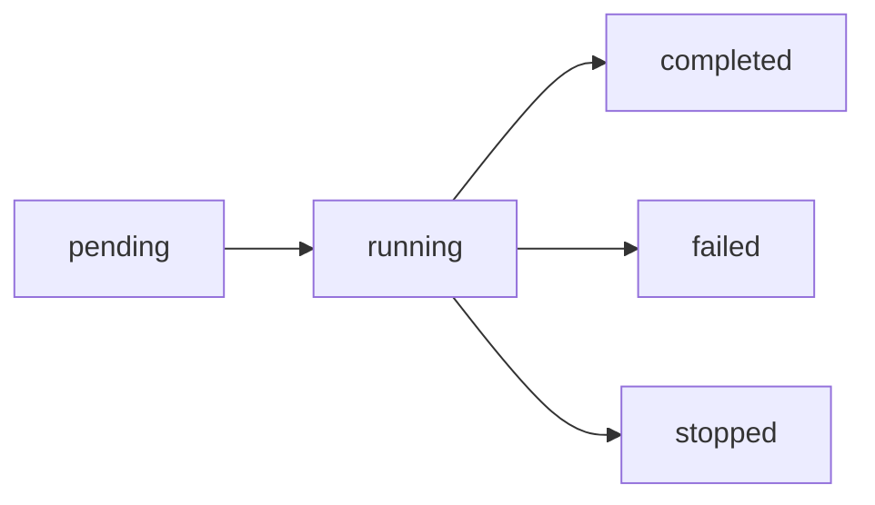

> 🟡 **中级** | ⏱ 45 分钟

# 后台任务

## 概述

Claude Code 支持后台任务执行，让你可以在等待长时间运行任务的同时继续其他工作。

## 后台任务机制

### 核心概念

后台任务允许：
- **非阻塞执行**：任务在后台运行，你可以继续对话
- **自动通知**：任务完成后自动通知你
- **结果获取**：随时查看任务输出和状态

### 任务类型

| 类型 | 工具 | 用途 |
|------|------|------|
| Shell 任务 | Bash + run_in_background | 长时间命令 |
| Agent 任务 | Agent + run_in_background | 独立研究/实现 |

## 使用方式

### Bash 后台任务

```bash
# 在 Bash 工具中设置 run_in_background: true
{
  "command": "npm test",
  "run_in_background": true
}
```

**特点：**
- 命令在后台执行
- 会话可以继续其他对话
- 完成后收到 `<task-notification>` 通知

### Agent 后台任务

```markdown
# 使用 Agent 工具的后台模式
{
  "subagent_type": "Explore",
  "prompt": "搜索所有 API 端点",
  "description": "探索 API 结构",
  "run_in_background": true
}
```

**特点：**
- 子代理独立运行
- 不阻塞主会话
- 完成后自动通知

## 任务管理

### 查看任务列表

使用 `/tasks` 命令查看所有后台任务：

```bash
/tasks
```

输出示例：
```
Running Tasks:
- a024a90: 探索 API 结构 (running)
- a195852d: 运行测试 (completed)

Background Shells:
- shell_001: npm build (running)
```

### 获取任务输出

使用 TaskOutput 工具：

```markdown
# 获取任务结果
{
  "task_id": "a024a90f936a08281",
  "block": false  // 不阻塞，只检查状态
}

# 或阻塞等待完成
{
  "task_id": "a024a90f936a08281",
  "block": true,
  "timeout": 60000  // 等待最多 60 秒
}
```

### 停止任务

使用 TaskStop 工具：

```markdown
{
  "task_id": "a024a90f936a08281"
}
```

## 实战案例

### 案例：长时间构建

```bash
# 启动构建，继续其他工作
"运行 npm build 在后台，我继续写文档"

# Claude 执行：
{
  "command": "npm run build",
  "run_in_background": true
}

# 你可以继续：
"现在帮我写 README"

# 构建完成后收到通知
<task-notification task_id="...">构建完成</task-notification>
```

### 案例：并行探索

```markdown
# 同时启动多个探索任务
"并行探索：
1. 搜索认证相关代码
2. 搜索数据库相关代码
3. 搜索 API 相关代码

都完成后汇总。"

# Claude 并行启动 3 个后台 Agent
```

### 案例：测试执行

```bash
# 后台运行测试套件
"在后台运行完整测试套件，我继续开发"

{
  "command": "pytest tests/ -v",
  "run_in_background": true,
  "timeout": 300000  // 5 分钟超时
}
```

## 任务状态

### 状态流转



### 状态查询

```markdown
# 使用 TaskOutput 查询状态
{
  "task_id": "...",
  "block": false  // 只查询，不等待
}

# 返回状态信息
{
  "status": "running",
  "progress": "50%"
}
```

## 最佳实践

###何时使用后台

| 场景 | 推荐 |
|------|------|
| 长时间构建/测试 | ✅ 后台 |
| 代码搜索/探索 | ✅ 后台 |
| 独立研究任务 | ✅ 后台 |
| 需要交互的任务 | ❌ 前台 |
| 快速简单命令 | ❌ 前台 |

### 避免的模式

```markdown
# 不要做
- 不要 poll（轮询）后台任务 —— 会自动通知
- 不要 sleep 等待任务
- 不要在后台运行交互命令
- 不要忘记检查任务结果
```

### 推荐模式

```markdown
# 好习惯
- 启动后台任务后立即继续其他工作
- 收到通知后再处理结果
- 用 block=false 检查状态
- 设置合理的 timeout
```

## 通知机制

### 任务完成通知

```xml
<task-notification>
  <task-id>a024a90...</task-id>
  <output-file>/tmp/output.txt</output-file>
</task-notification>
```

### 处理通知

收到通知后：
1. 使用 Read 工具读取输出文件
2. 或使用 TaskOutput 获取完整结果

```markdown
# 读取输出文件
{
  "file_path": "/tmp/output.txt"
}
```

## 立即尝试

### 🎯 练习 1：后台构建

```bash
# 在 Claude Code 中：
"在后台运行 npm run build，完成后告诉我结果"

# 焦点放在这，让我继续其他工作
"同时帮我写一个简单的测试用例"
```

### 🎯 练习 2：并行探索

```bash
"启动 3 个后台 Explore Agent：
1. 探索 src/ 目录结构
2. 搜索所有 async 函数
3. 搜索所有 TODO 注释

完成后汇总报告。"
```

### 🎯 练习 3：任务监控

```bash
"启动一个长时间测试，然后：
- 用 /tasks 查看状态
- 继续其他对话
- 收到通知后检查结果"
```

## 相关资源

- [多 Agent 协作](../11-multi-agent/)
- [CLI 命令](../10-cli/)
- [Subagents 参考](../04-subagents/)