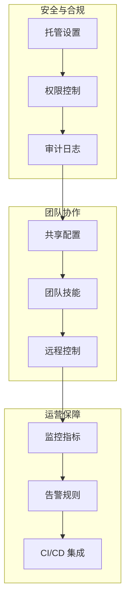

<picture>
  <source media="(prefers-color-scheme: dark)" srcset="../resources/logos/claude-howto-logo-dark.svg">
  
</picture>

> 🔴 **高级** | ⏱ 180 分钟
>
> ✅ Verified against Claude Code **v2.1.92** · Last verified: 2026-04-06

**你将掌握：** 企业级部署、团队协作、安全合规、监控审计以及 CI/CD 集成的完整实践。

# 企业部署与高级能力

本模块是 Claude Code 教程的最终章，涵盖生产环境部署、团队协作、高级工作流以及企业级最佳实践。掌握这些能力，你将能够在企业环境中安全、高效地使用 Claude Code。

---

## 为什么需要这个？

"我要在生产环境使用 Claude Code"

想象这个场景：你的团队已经熟悉了 Claude Code 的基础功能，现在需要将它引入公司的开发流程。你面临的挑战包括：

- **安全合规**：如何确保代码安全，满足 SOC 2、GDPR 等合规要求？
- **团队协作**：如何统一团队的配置和工作流？
- **监控审计**：如何追踪使用情况，发现潜在问题？
- **CI/CD 集成**：如何将 AI 辅助融入自动化流水线？
- **远程协作**：如何跨设备、跨地点协作开发？

这些问题没有正确答案，但本模块提供经过验证的实践方案，帮助你做出明智决策。

---

## 核心概念

### 企业级部署的三个支柱



| 支柱 | 核心能力 | 解决的问题 |
|------|----------|------------|
| **安全与合规** | 托管设置、权限控制、审计日志 | "如何确保安全合规？" |
| **团队协作** | 共享配置、团队技能、远程控制 | "如何统一团队工作流？" |
| **运营保障** | 监控指标、告警规则、CI/CD 集成 | "如何持续监控和改进？" |

### 高级能力概述

除了企业部署，本模块还涵盖 Claude Code 最强大的能力：

| 能力 | 功能 | 核心优势 |
|------|------|----------|
| **Computer Use** | 查看并控制你的屏幕 | 无需 API 即可实现 GUI 自动化 |
| **Voice Mode** | 按下即说语音输入 | 自然流畅的对话体验 |
| **Multi-Agent** | 并行运行多个 Agent | 显著加速工作流程 |
| **高级命令** | `/btw`、`/compact`、`/rewind` | 精通上下文管理 |

---

## 场景 1：团队部署策略

### 情境

公司决定引入 Claude Code，你作为技术负责人需要制定部署方案。团队有 10 名开发者，分为前端、后端、DevOps 三组。

### 目标

- 统一团队配置
- 分角色权限控制
- 便于后续管理

### 步骤

#### 1. 创建托管设置配置

托管设置允许组织通过配置文件集中管理 Claude Code 行为。

```bash
# 配置文件位置
# macOS
~/Library/Application Support/Claude Code/managed-settings.json

# Linux
~/.config/Claude Code/managed-settings.json

# Windows
%APPDATA%/Claude Code/managed-settings.json

# Cross-platform (v2.1.83+)
~/.claude/managed-settings.d/
  00-org-defaults.json
  10-team-policies.json
  20-project-overrides.json
```

创建基础配置：

```json
{
  "version": "1.0",
  "organization": "ExampleCorp",
  "settings": {
    "permissions": {
      "defaultMode": "auto",
      "autoApprove": {
        "bash": ["npm test", "npm run build", "git status"],
        "fileOperations": {
          "read": ["**/*.ts", "**/*.tsx", "**/*.json"],
          "write": ["src/**/*", "test/**/*"]
        }
      },
      "requireApproval": {
        "bash": ["rm -rf", "sudo", "docker"],
        "fileOperations": {
          "write": [".env", "*.key", "*.pem"]
        }
      }
    },
    "security": {
      "allowedDomains": ["github.com", "gitlab.example.com"],
      "disableTelemetry": true
    }
  }
}
```

#### 2. 分角色权限控制

不同角色的开发者需要不同的权限：

```json
{
  "roles": {
    "junior-developer": {
      "permissions": {
        "defaultMode": "default",
        "autoApprove": {
          "bash": ["npm test", "npm run lint"]
        }
      },
      "restrictions": {
        "blockDestructiveCommands": true,
        "requireCodeReview": true
      }
    },
    "senior-developer": {
      "permissions": {
        "defaultMode": "auto",
        "autoApprove": {
          "bash": ["npm *", "git *", "docker *"]
        }
      }
    },
    "devops": {
      "permissions": {
        "defaultMode": "auto",
        "autoApprove": {
          "bash": ["*"]
        }
      },
      "features": {
        "enableDeployment": true
      }
    }
  }
}
```

#### 3. MDM / OS 级策略部署

对于 macOS 环境，使用 MDM 配置：

```xml
<!-- com.claude.code.mobileconfig -->
<?xml version="1.0" encoding="UTF-8"?>
<!DOCTYPE plist PUBLIC "-//Apple//DTD PLIST 1.0//EN" "http://www.apple.com/DTDs/PropertyList-1.0.dtd">
<plist version="1.0">
<dict>
    <key>ManagedSettings</key>
    <dict>
        <key>Permissions</key>
        <dict>
            <key>DefaultMode</key>
            <string>auto</string>
        </dict>
        <key>Security</key>
        <dict>
            <key>DisableTelemetry</key>
            <true/>
            <key>AllowedDomains</key>
            <array>
                <string>github.com</string>
                <string>example.com</string>
            </array>
        </dict>
    </dict>
</dict>
</plist>
```

对于 Windows 环境，使用组策略：

```powershell
# 禁用遥测
reg add "HKLM\SOFTWARE\Policies\Anthropic\Claude Code" /v DisableTelemetry /t REG_DWORD /d 1

# 设置默认权限模式
reg add "HKLM\SOFTWARE\Policies\Anthropic\Claude Code" /v DefaultPermissionMode /t REG_SZ /d "auto"
```

#### 4. 共享团队技能

创建团队共享技能目录：

```bash
# 共享技能目录结构
/opt/team-claude-skills/
├── code-review/
│   ├── skill.json
│   └── instructions.md
├── deploy-staging/
├── test-coverage/
└── security-scan/

# 配置环境变量
export CLAUDE_TEAM_SKILLS_PATH=/opt/team-claude-skills
```

代码审查技能示例：

```markdown
# .claude/skills/code-review/instructions.md

## Code Review Checklist

Run these checks:
1. Run linter (`npm run lint`)
2. Run type check (`npm run type-check`)
3. Run tests (`npm test`)
4. Check security issues
5. Generate coverage report

Output format:
- CRITICAL: Blocking issues (must fix)
- WARNING: Improvement suggestions (should fix)
- INFO: Good practices (acknowledge)
```

### 结果验证

部署完成后验证配置：

```
你: 显示当前配置

Claude:
配置加载来源：
- managed-settings.json
- ~/.claude/settings.json

生效设置：
- 权限模式：auto
- 遞测：已禁用
- 允许域名：github.com, internal.company.com
- 审计日志：已启用
```

---

## 场景 2：安全合规配置

### 情境

公司需要通过 SOC 2 Type II 认证，你需要配置 Claude Code 满足合规要求。

### 目标

- 启用审计日志
- 配置数据驻留
- 满足 SOC 2 / GDPR 要求

### 步骤

#### 1. 启用审计日志

审计日志记录所有操作，满足合规要求：

```json
{
  "auditLogging": {
    "enabled": true,
    "logLevel": "detailed",
    "events": [
      "command.execution",
      "file.access",
      "permission.grant",
      "permission.deny",
      "skill.execution",
      "error"
    ],
    "output": {
      "type": "syslog",
      "server": "logserver.example.com:514",
      "format": "json"
    }
  }
}
```

自定义审计日志记录器：

```javascript
// audit-logger.js
class AuditLogger {
  constructor(logDir = 'logs/audit') {
    this.logDir = logDir;
  }

  log(action, user, details) {
    const logEntry = {
      timestamp: new Date().toISOString(),
      action,
      user: user || 'system',
      details,
      sessionId: details.sessionId || 'N/A'
    };

    const logFile = path.join(
      this.logDir,
      `audit-${new Date().toISOString().split('T')[0]}.log`
    );

    fs.appendFileSync(logFile, JSON.stringify(logEntry) + '\n');
  }
}

// 使用示例
auditLogger.log('file_access', 'user@example.com', {
  filePath: '/path/to/secret.js',
  operation: 'read',
  sessionId: 'session-123'
});
```

#### 2. SOC 2 合规配置

```json
{
  "compliance": {
    "framework": "SOC2",
    "controls": {
      "accessControl": {
        "requireAuthentication": true,
        "sessionTimeout": 30,
        "mfaRequired": true
      },
      "dataEncryption": {
        "inTransit": true,
        "atRest": true
      },
      "changeManagement": {
        "requireApproval": true,
        "auditTrail": true,
        "versionControl": true
      }
    }
  }
}
```

#### 3. GDPR 合规配置

```json
{
  "gdpr": {
    "dataResidency": "eu",
    "rightToErasure": {
      "enabled": true,
      "retentionDays": 30
    },
    "consent": {
      "required": true,
      "version": "2.0"
    },
    "dataProcessing": {
      "purpose": "development-tools",
      "legalBasis": "legitimate-interest"
    }
  }
}
```

#### 4. Pre-commit 安全检查

创建自动化安全检查钩子：

```bash
#!/bin/bash
# .claude/hooks/pre-commit

echo "运行团队安全检查..."

# 1. 检查敏感信息
if git diff --cached | grep -iE "(password|api_key|secret)"; then
  echo "CRITICAL: 检测到潜在敏感信息!"
  exit 1
fi

# 2. 运行 linter
npm run lint -- --quiet
if [ $? -ne 0 ]; then
  echo "Lint 检查失败"
  exit 1
fi

# 3. 运行类型检查
npm run type-check -- --quiet
if [ $? -ne 0 ]; then
  echo "类型检查失败"
  exit 1
fi

# 4. 运行单元测试
npm test -- --testPathPattern="unit" --quiet
if [ $? -ne 0 ]; then
  echo "单元测试失败"
  exit 1
fi

echo "Pre-commit 检查通过"
```

### 结果验证

```
你: 检查安全合规状态

Claude:
合规检查报告：
━━━━━━━━━━━━━━━━━━━━━━━━━━━━━━━━━━━━

✅ SOC 2 控制：
- 访问控制：已配置
- 数据加密：已启用
- 变更管理：已启用

✅ GDPR 控制：
- 数据驻留：eu
- 删除权：已启用
- 用户同意：已要求

✅ 审计日志：
- 状态：已启用
- 级别：detailed
- 输出：syslog

━━━━━━━━━━━━━━━━━━━━━━━━━━━━━━━━━━━━
```

---

## 场景 3：监控和审计

### 情境

Claude Code 已经部署到生产环境，你需要建立监控体系确保稳定运行。

### 目标

- 建立关键指标监控
- 配置告警规则
- 实现 CI/CD 集成

### 步骤

#### 1. OpenTelemetry 集成

安装和配置 OpenTelemetry：

```bash
# 安装依赖
npm install @opentelemetry/api
npm install @opentelemetry/sdk-node
npm install @opentelemetry/exporter-metrics-otlp-grpc
```

创建遥测模块：

```javascript
// telemetry.js
const { MeterProvider } = require('@opentelemetry/sdk-metrics');
const { OTLPGrpcMetricExporter } = require('@opentelemetry/exporter-metrics-otlp-grpc');

const metricExporter = new OTLPGrpcMetricExporter({
  url: process.env.OTEL_EXPORTER_OTLP_ENDPOINT || 'http://localhost:4317',
});

const meterProvider = new MeterProvider({
  exporter: metricExporter,
  interval: 10000, // 10 seconds
});

meterProvider.start();

const meter = meterProvider.getMeter('claude-code-metrics');
module.exports = { meter };
```

#### 2. 自定义指标

创建关键性能指标：

```javascript
const { meter } = require('./telemetry');

// 命令执行计数器
const commandCounter = meter.createCounter('claude.commands.total', {
  description: '执行的 Claude Code 命令总数',
});

// 命令执行时间
const commandDuration = meter.createHistogram('claude.commands.duration', {
  description: 'Claude Code 命令执行时间',
  unit: 'ms',
});

// 追踪命令执行
async function trackCommand(command, fn) {
  const startTime = Date.now();

  try {
    await fn();
    commandCounter.add(1, { command, status: 'success' });
  } catch (error) {
    commandCounter.add(1, { command, status: 'error' });
    throw error;
  } finally {
    const duration = Date.now() - startTime;
    commandDuration.record(duration, { command });
  }
}
```

#### 3. Prometheus 告警规则

```yaml
# alerts.yml
groups:
  - name: claude_code_alerts
    interval: 30s
    rules:
      # 高错误率告警
      - alert: HighErrorRate
        expr: |
          rate(claude_commands_total{status="error"}[5m])
          / rate(claude_commands_total[5m]) > 0.05
        for: 5m
        labels:
          severity: warning
        annotations:
          summary: "Claude Code 错误率过高"
          description: "错误率为 {{ $value | humanizePercentage }}"

      # 响应时间告警
      - alert: SlowResponseTime
        expr: |
          histogram_quantile(0.95, claude_commands_duration_bucket) > 5000
        for: 5m
        labels:
          severity: warning
        annotations:
          summary: "Claude Code 响应时间过慢"
          description: "P95 响应时间为 {{ $value }}ms"
```

#### 4. CI/CD 集成 - GitHub Actions

创建完整的 CI/CD 流水线：

```yaml
# .github/workflows/claude-ci.yml
name: Claude Code CI

on:
  push:
    branches: [main, develop]
  pull_request:
    branches: [main, develop]

jobs:
  claude-check:
    runs-on: ubuntu-latest

    steps:
      - name: Checkout code
        uses: actions/checkout@v4
        with:
          fetch-depth: 0

      - name: Setup Node.js
        uses: actions/setup-node@v4
        with:
          node-version: '20'

      - name: Install Claude Code
        run: |
          npm install -g @anthropic-ai/claude-code
          claude --version

      - name: Install dependencies
        run: npm ci

      - name: Run Claude Code checks
        run: |
          claude -p "审查代码库：
          - 代码质量问题
          - 安全漏洞
          - 性能隐患
          输出简洁摘要。"
        env:
          ANTHROPIC_API_KEY: ${{ secrets.ANTHROPIC_API_KEY }}

      - name: Upload results
        if: always()
        uses: actions/upload-artifact@v4
        with:
          name: claude-results
          path: .claude/reports/
```

代码审查工作流：

```yaml
# .github/workflows/claude-review.yml
name: Claude Code Review

on:
  pull_request:
    types: [opened, synchronize, reopened]

permissions:
  pull-requests: write
  contents: read

jobs:
  code-review:
    runs-on: ubuntu-latest

    steps:
      - name: Checkout PR
        uses: actions/checkout@v4
        with:
          fetch-depth: 0

      - name: Setup Claude Code
        run: npm install -g @anthropic-ai/claude-code

      - name: Run Code Review
        id: review
        run: |
          claude -p --output-format json \
            "审查此 PR 的变更。重点关注：
            - 代码质量和可读性
            - 潜在 bug 或边界情况
            - 安全考虑
            - 测试覆盖率

            输出 JSON 格式，包含：summary, issues, suggestions" > review.json
        env:
          ANTHROPIC_API_KEY: ${{ secrets.ANTHROPIC_API_KEY }}

      - name: Comment on PR
        uses: actions/github-script@v7
        with:
          script: |
            const fs = require('fs');
            const review = JSON.parse(fs.readFileSync('review.json', 'utf8'));

            const body = `## Claude Code Review

            ### Summary
            ${review.summary}

            ### Issues Found
            ${review.issues.map(i => `- **${i.severity}**: ${i.message}`).join('\n')}

            ### Suggestions
            ${review.suggestions.map(s => `- ${s}`).join('\n')}`;

            github.rest.issues.createComment({
              issue_number: context.issue.number,
              owner: context.repo.owner,
              repo: context.repo.repo,
              body: body
            });
```

#### 5. GitLab CI 集成

```yaml
# .gitlab-ci.yml
stages:
  - check
  - review
  - test
  - deploy

variables:
  CLAUDE_VERSION: "latest"

claude:check:
  stage: check
  image: node:20
  before_script:
    - npm install -g @anthropic-ai/claude-code
    - claude --version
  script:
    - npm ci
    - claude -p "运行代码质量检查并输出 JSON 报告" > claude-report.json
  artifacts:
    reports:
      codequality: claude-report.json
    paths:
      - claude-report.json
    expire_in: 1 week

claude:review:
  stage: review
  image: node:20
  before_script:
    - npm install -g @anthropic-ai/claude-code
  script:
    - claude -p "审查 merge request 变更" > review.md
  artifacts:
    paths:
      - review.md
    expire_in: 1 week
  only:
    - merge_requests

claude:security:
  stage: check
  image: node:20
  before_script:
    - npm install -g @anthropic-ai/claude-code
  script:
    - claude -p "安全扫描此代码库" > security-report.json
  artifacts:
    reports:
      sast: security-report.json
    paths:
      - security-report.json
  allow_failure: true
```

### 结果验证

查看监控仪表板：

```
你: 显示监控指标摘要

Claude:
Claude Code 监控摘要：
━━━━━━━━━━━━━━━━━━━━━━━━━━━━━━━━━━━━

📊 性能指标：
- 平均响应时间：1.8s
- P95 响应时间：4.2s
- 成功率：99.2%

📈 使用统计：
- 今日命令数：245
- 本周命令数：1,234
- 活跃会话：12

⚠️ 告警状态：
- 无活跃告警

━━━━━━━━━━━━━━━━━━━━━━━━━━━━━━━━━━━━
```

---

## 高级能力补充

本模块还涵盖以下高级能力，为企业级使用提供更多可能性。

### Computer Use

Computer Use 让 Claude Code 能够"看见"你的屏幕并控制鼠标和键盘。

```
传统 Claude Code:
你: "测试登录表单"
Claude: "我看不到浏览器。请截图..."

Computer Use:
你: "测试登录表单"
Claude: [看见屏幕]
  → 移动光标到用户名输入框
  → 输入测试凭据
  → 点击登录按钮
  → 验证跳转到仪表板
```

**适用场景：**

| 场景 | 为何使用 Computer Use |
|------|----------------------|
| Web UI 测试 | 无需 API，直接浏览器交互 |
| 传统应用 | 无可编程接口的 GUI 应用 |
| 跨应用工作流 | 跨多个应用自动化 |

### Voice Mode

Voice Mode 启用按下即说的语音输入。

```
键盘输入：
你（打字）："重构这个组件"
  → 思考措辞
  → 输入字符
  → 等待响应

语音输入：
你（说话）："重构这个组件"
  → 直接说出
  → 即时传输
  → 自然对话流程
```

**黄金法则：语音定方向，键盘写细节**

```
工作流示例：
1. 🎤 "重构认证模块"（意图）
2. ⌨️ 查看 Claude 的计划
3. 🎤 "第 3 步 - 用 OAuth 替代"（反馈）
4. ⌨️ 提供配置值
5. 🎤 "看起来不错，执行"（确认）
```

### Multi-Agent Collaboration

通过 Git Worktrees 实现并行任务处理。

```bash
# Claude Code 自动管理 worktrees
claude --worktree

# 创建 worktrees
claude --worktree name=feature-a
claude --worktree name=feature-b
claude --worktree name=feature-c

# Tmux 布局实现多面板
Pane 1: cd .claude/worktrees/feature-a && claude
Pane 2: cd .claude/worktrees/feature-b && claude
Pane 3: cd .claude/worktrees/feature-c && claude

# 每个面板分配任务
Pane 1: "实现推荐算法"
Pane 2: "创建 API 端点"
Pane 3: "构建前端组件"
```

### 高级命令

上下文管理命令：

| 命令 | 效果 | 使用时机 |
|------|------|----------|
| `/btw` | 旁路对话，不污染主上下文 | 无关问题 |
| `/compact` | 压缩上下文，释放空间 | 长对话接近限制 |
| `/rewind` | 回滚到之前状态 | 发现方向错误 |

---

## 🎯 Try It Now

### 快速实践 1：创建企业配置

```bash
# 1. 创建托管设置目录
mkdir -p ~/.claude/managed-settings.d

# 2. 创建基础配置
cat > ~/.claude/managed-settings.d/00-org-defaults.json << 'EOF'
{
  "version": "1.0",
  "organization": "MyTeam",
  "settings": {
    "permissions": {
      "defaultMode": "auto"
    },
    "security": {
      "disableTelemetry": true
    }
  }
}
EOF

# 3. 验证配置
claude -p "显示当前配置"
```

### 快速实践 2：设置代码审查技能

```bash
# 1. 创建技能目录
mkdir -p .claude/skills/code-review

# 2. 创建技能定义
cat > .claude/skills/code-review/skill.json << 'EOF'
{
  "name": "code-review",
  "description": "团队代码审查标准流程"
}
EOF

# 3. 创建指令文件
cat > .claude/skills/code-review/instructions.md << 'EOF'
## Code Review Checklist

1. Run linter
2. Run type check
3. Run tests
4. Check security issues
5. Output structured report
EOF

# 4. 使用技能
claude
> /skill code-review
```

### 快速实践 3：创建 CI 工作流

```bash
# 1. 创建 GitHub Actions 目录
mkdir -p .github/workflows

# 2. 创建基础 CI 工作流
cat > .github/workflows/claude-ci.yml << 'EOF'
name: Claude Code CI

on:
  push:
    branches: [main]
  pull_request:

jobs:
  check:
    runs-on: ubuntu-latest
    steps:
      - uses: actions/checkout@v4
      - run: npm install -g @anthropic-ai/claude-code
      - run: claude -p "检查代码质量"
        env:
          ANTHROPIC_API_KEY: ${{ secrets.ANTHROPIC_API_KEY }}
EOF

# 3. 提交并观察 CI 运行
git add .github/workflows/claude-ci.yml
git commit -m "feat(ci): add Claude Code CI workflow"
git push
```

### 快速实践 4：尝试 Voice Mode

```
1. 在 Claude Code 会话中按空格键
2. 说话："解释这段代码的作用"
3. 松开空格键发送
4. 观察语音识别和响应

混合使用：
- 语音："重构这个函数"
- 键盘：提供具体参数
- 语音："看起来不错，继续"
```

---

## 常见问题

### Q1: 托管设置和用户设置的区别？

**托管设置** 由组织控制，用户无法修改，用于强制执行安全策略。
**用户设置** 由用户控制，位于 `~/.claude/settings.json`，用于个人偏好。

优先级：托管设置 > 用户设置 > 项目设置

### Q2: 如何在不同环境使用不同配置？

使用多环境配置模式：

```json
{
  "development": {
    "permissions": { "defaultMode": "auto" },
    "features": { "enableDebugLogging": true }
  },
  "staging": {
    "permissions": { "defaultMode": "default" },
    "auditLogging": { "enabled": true }
  },
  "production": {
    "permissions": { "defaultMode": "default" },
    "security": { "strictMode": true }
  }
}
```

通过环境变量切换：

```bash
export CLAUDE_ENV=production
claude -p "检查代码"
```

### Q3: CI/CD 中如何安全使用 API Key？

使用 GitHub Secrets 或 GitLab Variables：

```yaml
env:
  ANTHROPIC_API_KEY: ${{ secrets.ANTHROPIC_API_KEY }}
```

确保：
- Secrets 从不暴露在日志中
- 使用 `--allowedTools` 限制可用工具
- 定期轮换 API Key

### Q4: 远程控制的安全性如何保证？

最佳实践：
- 使用 SSH 密钥认证
- 启用会话超时
- 在关键节点创建检查点
- 保护会话分享链接
- 启用审计日志

### Q5: 如何避免反模式？

| 反模式 | 核心问题 | 正确方式 |
|--------|----------|----------|
| 一个会话做所有事 | 上下文污染 | 一个会话一个任务 |
| 反复修正 | 需求不精确 | 一次精确需求 |
| 不验证就接受 | 无验证 | 主动测试和审查 |
| 过度微操 | AI 自主性未用 | 给方向，不给步骤 |
| 模糊需求 | Claude 猜测 | 清晰问题，具体目标 |
| 没有 CLAUDE.md | 重复劳动 | 编写项目记忆 |

### Q6: Multi-Agent 的最佳数量？

建议：每个团队 5-10 个并行 Agent。

过多会导致：
- 管理复杂度增加
- 资源竞争
- 合并冲突增多

---

## 最佳实践总结

### 企业部署

- 对所有配置文件使用版本控制
- 实施渐进式发布策略（试点 → 扩大 → 全量）
- 启用审计日志以满足合规要求
- 定期进行安全审查
- 记录所有自定义配置

### 远程控制

- 使用 SSH 密钥认证进行远程连接
- 在关键节点创建检查点
- 定期监控会话活动
- 保护会话分享链接

### CI/CD 集成

- 在 CI 流水线中缓存依赖
- 并行运行独立作业
- 使用矩阵策略进行多版本测试
- 使用 secrets 保护敏感信息
- 设置适当的超时时间

### 监控

- 适当采样追踪（10-20%）
- 使用适当的日志级别
- 在日志中保护敏感信息
- 定期审查关键指标
- 为关键阈值设置告警

---

## 学习路径回顾

恭喜你完成了 Claude Code 教程的全部学习！回顾你的学习旅程：


### 你已掌握的能力

| 模块 | 核心技能 | 应用场景 |
|------|----------|----------|
| **Slash Commands** | 自定义命令 | 快速执行常用操作 |
| **Memory** | CLAUDE.md 配置 | 项目知识持久化 |
| **Skills** | 可复用任务模板 | 标准化工作流 |
| **Subagents** | 专业智能体委托 | 复杂任务分解 |
| **MCP** | 外部数据访问 | 连接外部工具和服务 |
| **Hooks** | 事件驱动自动化 | 自动格式化、检查 |
| **Plugins** | 扩展包系统 | 打包和分发技能 |
| **Checkpoints** | 会话快照与回滚 | 安全探索和实验 |
| **Advanced Features** | 扩展思考、权限 | 深度推理和精细控制 |
| **CLI** | 命令行界面 | 高效操作和脚本集成 |
| **Enterprise** | 企业部署与集成 | 生产级团队协作 |

### 下一步建议

1. **实践巩固**：在日常开发中应用所学技能
2. **团队推广**：将企业部署方案引入团队
3. **持续学习**：关注 Claude Code 新版本更新
4. **社区贡献**：分享你的技能和配置模板

---

## 相关资源

### 官方文档

- [Enterprise Deployment Guide](https://code.claude.com/docs/en/enterprise)
- [Remote Control Documentation](https://code.claude.com/docs/en/remote-control)
- [Managed Settings Reference](https://code.claude.com/docs/en/managed-settings)
- [Computer Use Documentation](https://code.claude.com/docs/en/computer-use)
- [Voice Mode Documentation](https://code.claude.com/docs/en/voice-mode)
- [Multi-Agent Documentation](https://code.claude.com/docs/en/multi-agent)

### 相关模块

- [Advanced Features](../09-advanced-features/) - Planning, thinking, permissions
- [Hooks](../06-hooks/) - Event-driven automation
- [MCP](../05-mcp/) - External data access
- [Subagents](../04-subagents/) - Task delegation
- [Checkpoints](../08-checkpoints/) - Session management and rollback

### 外部资源

- [OpenTelemetry Documentation](https://opentelemetry.io/docs/)
- [Prometheus Best Practices](https://prometheus.io/docs/practices/)
- [Grafana Dashboards](https://grafana.com/docs/grafana/latest/dashboards/)
- [GitHub Actions Documentation](https://docs.github.com/en/actions)
- [Git Worktree Guide](https://git-scm.com/docs/git-worktree)