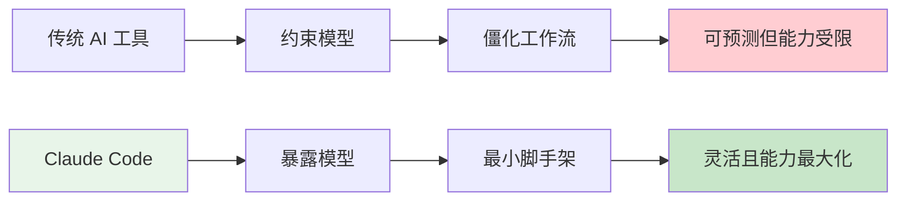
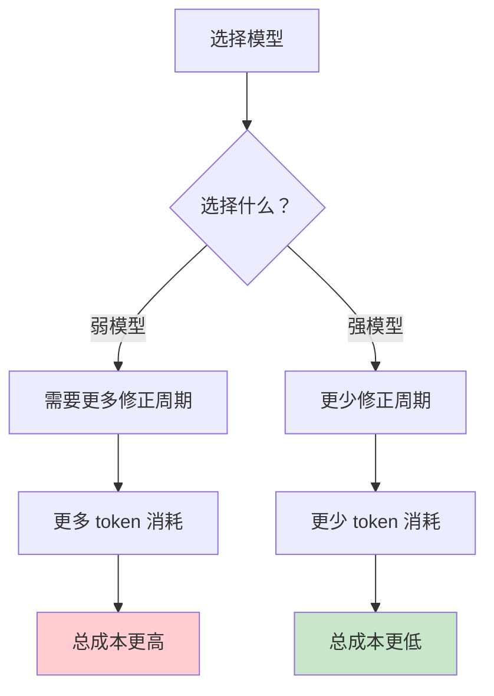
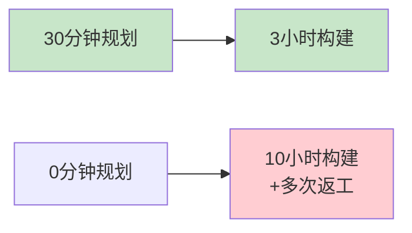
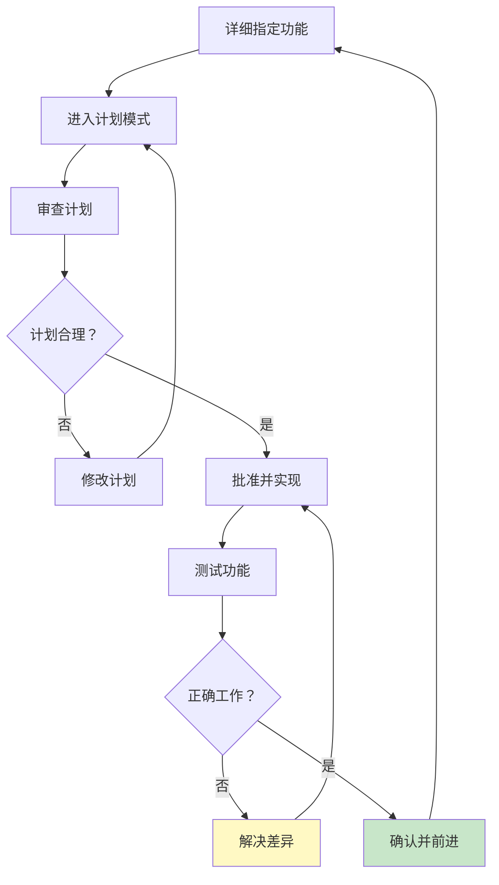

<picture>
  <source media="(prefers-color-scheme: dark)" srcset="../resources/logos/claude-howto-logo-dark.svg">
  
</picture>

> 🟡 **中级** | ⏱ 45 分钟
>
> > ✅ 已验证 Claude Code **v2.1.92** · 最后验证：2026-04-06

**你将学到：** Claude Code 设计哲学与 Anthropic 内部最佳实践。

# Boris Tips — Claude Code 负责人的实战心得

> "我从未像今天这样享受编程——因为我不再需要处理那些琐碎的事情。"
> — **Boris Cherny**，Claude Code 负责人，Anthropic

本模块从 Boris Cherny（Claude Code 产品负责人）的公开访谈和 freeCodeCamp Handbook 中提取核心见解，揭示 Anthropic 内部如何使用 Claude Code 达到 **10-30 个 PR/天/工程师** 的生产力。

---

## 设计哲学：产品就是模型

### 核心原则

大多数 AI 开发工具通过**约束模型**来构建：定义僵化的工作流、控制模型能看到什么、精确指定工具使用顺序。这以牺牲灵活性和能力为代价创造了可预测性。

Claude Code 的架构**颠倒了这一点**。

正如 Boris Cherny 所描述：

> **"产品就是模型。"**

方法是尽可能直接地暴露模型，使用最小的工具集和最小的脚手架，并允许模型确定给定任务的最佳方法。

### 设计决策背后的理念



**为什么这样设计？**

| 传统约束方法 | Claude Code 方法 |
|-------------|-----------------|
| 预定义工作流步骤 | 模型自主决定步骤 |
| 限制可见信息 | 按需读取文件 |
| 控制工具顺序 | 模型选择工具组合 |
| 预设错误处理 | 模型判断并修正 |
| 可预测的输出 | 更准确的输出 |

**核心洞察：** 一个能力较弱的模型需要更多 token 完成同样任务。使用更便宜的模型实际上更便宜并不明显。通常，最强大的模型更便宜且消耗更少 token，因为它以更少的修正周期完成任务。

---

## Anthropic 内部实践：生产力数据

### 关键指标（2026 年初）

| 指标 | 数值 | 说明 |
|------|------|------|
| GitHub 全球提交占比 | **4%** | Claude Code 生成 |
| 预计年底提交占比 | **20%** | 持续增长 |
| Anthropic PR 产出 | **10-30 个/天/工程师** | 每位工程师 |
| Claude 审查覆盖率 | **100%** | 人工审查前先由 Claude 审查 |
| 生产力提升 | **200%** | 自 Claude Code 采用后 |
| 日活用户增长 | **翻倍** | 上个月内 |

> "Spotify 的工程师自 12 月以来就没有手动编写过代码。"

### Boris 的个人工作流

**并行会话策略：**

> "我启动一个任务，然后另一个，然后另一个，然后去喝杯咖啡让它们运行。"

Boris 通常同时运行 **5 个或更多并行会话**：
- 一个构建认证系统
- 一个构建数据可视化层
- 一个编写测试
- 一个处理文档
- 一个监控 PR

**权限管理：**

> "一旦计划看起来不错，我就让模型执行。之后我自动接受编辑。用 Opus 4.6，它几乎每次都一次性正确完成。"

---

## 模型选择策略：不降低能力

### Boris 的模型选择原则

Boris Cherny **专门使用 Opus 4.6**，启用最大努力，**从不降低能力来节省 token**。

他的推理很精确：

> "因为一个能力较弱的模型不那么智能，它需要更多的 token 来完成同样的任务。使用更便宜的模型实际上更便宜并不明显。通常，最强大的模型更便宜且消耗更少的 token，因为它以更少的修正周期完成任务更快。"

### 模型能力 vs Token 成本关系



### 模型选择指南

| 任务特征 | 推荐模型 | 理由 |
|---------|---------|------|
| 初始探索、学习 Claude Code | Sonnet 4.6 | 平衡成本和能力 |
| 中等复杂度开发工作 | Sonnet 4.6 | 足够应对大多数任务 |
| 复杂架构决策 | **Opus 4.6** | 最深推理能力 |
| 扩展自主会话 | **Opus 4.6** | 减少 context drift |
| 多代理并行工作流 | **Opus 4.6** | 确保每个会话质量 |
| 简单查询、琐碎问题 | Haiku | 成本敏感场景 |

**Boris 的建议：**

> "不要试图过早优化。给工程师他们需要的所有 token。在某些东西被证明并正在扩展时，再优化。不是之前。"

---

## 规划作为核心实践

### Plan Mode 使用频率

Boris 在大约 **80%** 的会话中使用计划模式。

机制本身出奇地简单：注入模型上下文的一句话：

> *"请先不要编写任何代码。"*

### 为什么规划决定结果

一个经过审查和批准的完善计划，在编写任何代码之前，产生三个效果：

1. Claude 将其推理投入到正确的问题上
2. 意图和方法之间的不一致在嵌入代码之前被捕获
3. 结果实现是连贯的，因为它遵循连贯的设计

**时间投资回报：**

三十分钟的结构化规划经常将十小时的构建减少到三小时。



### 规划的纪律

> "实际阅读 Claude 产生的计划。不要反射性地批准它。计划是你可以以最小成本干预的点。"

**审查计划时检查：**
- 是否与设计意图一致？
- 是否会影响不应该触及的文件？
- 数据流是否正确？
- 边缘情况是否被处理？

---

## 提示词纪律：输入决定输出

### 核心诊断问题

Claude Code 产生的糟糕结果几乎从来不能归因于模型能力不足。

正确的诊断问题是：

> *我的规格是否足以产生我想要的东西？*

在大多数情况下，答案是：**不是**。

### 规格充分 vs 规格不足

**规格不足：**
```
构建一个任务管理应用。
```

**规格充分：**
```
为一个三人团队构建一个任务管理应用程序。要求：

1. 任务有标题、可选描述、截止日期和优先级（低、中、高）
2. 每个任务可以分配给三个硬编码用户之一：Alice、Bob 或 Carol
3. 任务可以标记为完成，记录完成时间戳
4. 任务列表可以按受托人或优先级过滤
5. 所有数据持久化在 localStorage 中——不需要后端
6. 界面：干净、浅色主题；没有外部 CSS 框架

技术：仅 HTML、CSS、纯 JavaScript。
```

第二个版本关闭了 Claude 否则会通过假设解决的所有重要决策点。

### 显式优于隐式

> "即使看起来明显，也要说明你想让 Claude 做什么。"

**必须显式声明的：**
- 检查文档 → 在编写代码之前
- 特定库版本 → 指定它们
- 不更改现有文件 → 明确说明
- 特定文件结构 → 描述它

隐式期望是经常不满足的期望。显式指令是一致遵循的指令。

---

## 逐功能构建方法论

### 增量开发的理由

每个实现的功能都是可以独立验证的行为单元。如果功能 2 建立在功能 1 之上而没有验证功能 1，缺陷就会复合。

基础中的缺陷向上传播，嵌入到建立在其上的所有东西中。

每个验证过的功能也是一个稳定的平台，可以在其上自信地构建下一个功能。

### 构建周期



### 构建顺序原则

**项目进度示例：**

| 阶段 | 功能 | 验证标准 |
|------|------|---------|
| 1 | 用户认证 | 登录/登出正常工作 |
| 2 | 任务创建 | CRUD 操作完成 |
| 3 | 任务过滤 | 按状态/优先级筛选 |
| 4 | 电子邮件通知 | 发送成功 |
| 5 | 团队管理 | 角色分配正确 |

---

## 并行代理工作流

### 多会话并行策略

多个 Claude Code 会话，每个分配特定范围，复制小团队的并行能力。

**Boris 的工作流：**

> "我启动一个任务，然后另一个，然后另一个，然后去喝杯咖啡让它们运行。"

### Git Worktree 配合

使用 **Git 工作树**隔离并行开发：

```bash
# 从 main 分支的仓库根目录
git worktree add ../my-project-auth feature/authentication
git worktree add ../my-project-notifications feature/notifications
```

每个工作树有自己的磁盘文件集，可以独立开发。

完成后合并：

```bash
cd my-project
git merge feature/authentication
git merge feature/notifications
```

### 并行会话示例

**窗口 1：前端会话**
```
我们正在为笔记应用程序构建前端。后端 REST API
已经在端口 3001 上运行。你在这个会话中的范围只是 client/ 目录。

不要触及 server/ 目录中的任何文件。

首先进入计划模式。在写任何东西之前向我展示你的实现计划。
```

**窗口 2：测试会话**
```
我们正在为笔记应用程序 REST API 编写集成测试。你在这个会话中的范围
是 server/tests/ 目录。

不要修改 server/tests/ 之外的任何文件。
```

---

## 上下文窗口管理

### 50% 实践

有经验的 Claude Code 用户中的工作惯例：

> 当上下文使用达到 **40-50%** 时，开始新会话。

上下文饱和的症状是 **漂移**：Claude 开始做出与它在会话早期建立的约束不一致的决策。

### 跨会话连续性

四个连续性文档：

| 文档 | 作用 |
|------|------|
| `CLAUDE.md` | 项目约定和架构上下文（自动读取） |
| `PRD.md` | 正在构建什么 |
| `README.md` | 当前实现状态 |
| `progress.md` | 会话级笔记和决策 |

新会话开始时：

```
新会话。按顺序读取以下文件：
1. CLAUDE.md
2. PRD.md
3. README.md（特别是实现状态部分）
4. progress.md

确认你对项目状态的理解并告诉我我们停在哪里。
```

---

## Anthropic 安全实践

### 发布前验证

在公开发布之前，Claude Code 在 Anthropic 内部运行了 **四到五个月**，在任何外部发布前都仔细研究了其行为。

### 机制可解释性

最深层的安全研究是**机制可解释性**：理解模型内部在单个计算组件层面实际发生了什么。

> "我们可以识别一个与欺骗相关的神经元。我们开始能够监控它并理解它正在激活。"

### 安全优先的架构

Claude Code 的设计从一开始就考虑安全：
- 权限请求机制
- PreToolUse hooks 验证
- PostToolUse 安全扫描
- 完整的审计日志

---

## 当前前沿与未来方向

### 主动任务生成

Claude Code 开始基于观察到的项目信号生成可操作建议。

> "Claude 读取 Slack 反馈线程，检查 GitHub 问题跟踪器，审查遥测数据，并提出带有相关 PR 的建议：'这里有一些我可以做的事情。我已经提了几个 PR。想看看吗？'"

### 超越软件开发

Boris 对当前状态的评估：

> "编码基本上已解决——至少是我做的那种编码。"

前沿正在扩展到相邻领域。

### 为六个月后的模型构建

Boris 最可操作的战略指导：

> **"为六个月后的模型构建，而不是为今天的模型。"**

**含义：**

| 今天假设 | 六个月后 |
|---------|---------|
| 需要详细规格 | 模型理解意图 |
| 需要逐步指导 | 模型自主规划 |
| 需要人工验证 | 模型自我验证 |
| 需要多个会话 | 单次会话完成 |

---

## Hands-on 实践

### 实践 1：规划模式体验

**任务：** 使用 Boris 的规划纪律完成一个功能。

```bash
# 1. 启动 Claude Code
claude

# 2. 激活计划模式
# 终端：按 Shift+Tab 两次
# VS Code：点击计划模式按钮

# 3. 描述任务
构建一个简单的待办事项应用。要求：
- 添加、删除、标记完成任务
- 数据存储在 localStorage
- 单页面 HTML/CSS/JS

请先不要编写任何代码。展示实现计划。

# 4. 阅读并审查计划
# 不要反射性批准！

# 5. 检查：
# - 是否有不必要的文件？
# - 数据流是否正确？
# - 是否处理了边缘情况？

# 6. 批准后才实现
```

### 实践 2：并行会话

**任务：** 运行两个并行 Claude Code 会话。

```bash
# 窗口 1：VS Code 打开项目
# 启动 Claude Code 扩展
# 范围：client/ 目录

# 窗口 2：终端
claude
# 范围：server/tests/ 目录

# 使用 Git worktree 避免冲突
git worktree add ../project-client feature/frontend
git worktree add ../project-tests feature/tests
```

### 实践 3：规格充分性测试

**任务：** 对比规格不足和规格充分的输出差异。

```bash
# 测试 A：规格不足
claude
> 构建一个登录页面

# 测试 B：规格充分
claude
> 构建一个登录页面。要求：
> - 用户名和密码输入框
> - 登录按钮和"忘记密码"链接
> - 错误提示区域
> - 深色主题，响应式设计
> - 仅使用 HTML/CSS，无框架
> - 表单验证：用户名至少3字符，密码至少8字符

# 对比两次输出的差异
```

---

## 最佳实践总结

### Boris 的十条心得

| # | 心得 | 应用 |
|---|------|------|
| 1 | **产品就是模型** | 信任模型判断，减少约束 |
| 2 | **用最强的模型** | Opus 4.6 减少总成本 |
| 3 | **80% 会话用计划模式** | 规划后再实现 |
| 4 | **阅读计划再批准** | 不要反射性批准 |
| 5 | **显式优于隐式** | 说明所有期望 |
| 6 | **逐功能构建** | 每个功能验证后继续 |
| 7 | **并行会话工作** | 5+ 会话同时运行 |
| 8 | **40-50% 上下文换会话** | 避免 drift |
| 9 | **连续性文档** | CLAUDE.md + PRD.md + README.md |
| 10 | **为六个月后构建** | 超越当前限制 |

### 反模式警示

| 反模式 | Boris 的观点 |
|--------|-------------|
| 用弱模型省钱 | "实际上更贵" |
| 不读计划就批准 | "最小成本干预点" |
| 隐式期望 | "经常不满足" |
| 一次性构建大功能 | "缺陷复合" |
| 单会话串行 | "喝咖啡的时间" |
| 填满上下文窗口 | "漂移" |
| 为今天优化 | "六个月后过时" |

---

## 进阶资源

### 原始资料

- **[freeCodeCamp Claude Code Handbook](https://www.freecodecamp.org/news/claude-code-handbook/)** — Boris Cherny 完整访谈
- **[Claude Code 官方文档](https://code.claude.ai)** — 安装和配置指南

### 相关模块

- **[03-skills](../03-skills/)** — 可复用任务模板
- **[04-subagents](../04-subagents/)** — 专业智能体
- **[05-mcp](../05-mcp/)** — 模型上下文协议
- **[06-hooks](../06-hooks/)** — 事件驱动自动化
- **[09-advanced-features](../09-advanced-features/)** — 高级功能详解

### 推荐阅读

| 文章 | 作者 | 主题 |
|------|------|------|
| [The Bitter Lesson](http://www.incompleteideas.net/IncIdeas/BitterLesson.html) | Rich Sutton | 为什么通用方法最终胜出 |
| [A Philosophy of Software Design](https://www.goodreads.com/book/show/39996759-a-philosophy-of-software-design) | John Ousterhout | 软件设计原则 |
| [Fundamentals of Software Architecture](https://fundamentalsofsoftwarearchitecture.com/) | Mark Richards & Neal Ford | 架构基础 |

---

## 附录：Boris Cherny 语录精选

### 关于编程乐趣

> "我从未像今天这样享受编程——因为我不再需要处理那些琐碎的事情。"

### 关于 Claude Code 的愿景

> "我想象一个每个人都能编程的世界。任何人都可以随时构建软件。"

### 关于模型选择

> "使用更便宜的模型实际上更便宜并不明显。通常，最强大的模型更便宜且消耗更少的 token。"

### 关于优化

> "不要试图过早优化。给工程师他们需要的所有 token。在某些东西被证明并正在扩展时，再优化。不是之前。"

### 关于编码的未来

> "编码基本上已解决——至少是我做的那种编码。"

### 关于未来规划

> "为六个月后的模型构建，而不是为今天的模型。"

---

## 检查清单

### Claude Code 使用检查清单

- [ ] 是否使用计划模式（80% 会话）
- [ ] 是否阅读并审查计划
- [ ] 是否使用显式、充分的规格
- [ ] 是否逐功能构建并验证
- [ ] 是否考虑并行会话
- [ ] 是否监控上下文使用（<50%）
- [ ] 是否维护连续性文档
- [ ] 是否选择合适的模型（Opus for 复杂任务）
- [ ] 是否为未来模型设计工作流

---

**学完本模块后，你将理解：**
- Claude Code "产品就是模型" 的设计哲学
- Anthropic 内部如何达到 10-30 PR/天/工程师
- Boris Cherny 的模型选择、规划、并行工作流策略
- 如何为六个月后的模型构建而非今天的