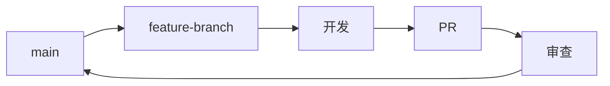

> 🟢 **初级** | ⏱ 20 分钟阅读

# Claude Code 官方团队使用技巧

## Anthropic 开发团队推荐实践

本文汇总 Claude Code 开发团队（包括 Boris 和核心工程师）的官方使用技巧。

---

## 1. 上下文管理

### 保持 CLAUDE.md 简洁

> "保持 CLAUDE.md 简洁，使用 @imports 引用详细文档"
> — Claude Code 团队

**原理：**
- CLAUDE.md 是项目入口，应快速概览
- 使用相对路径引用子文档
- 避免重复已存在的文档

**示例：**

```markdown
# CLAUDE.md

## 项目简介
 claude-howto 教程知识库

## 构建命令
npm run build

## 详细配置
参见 docs/architecture.md
参见 docs/testing-strategy.md
```

### 上下文窗口策略

> "避免在上下文窗口最后 20% 进行复杂编辑"
> — 性能优化指南

**建议：**
- 80% 容量：正常编辑、探索
- 90% 容量：单文件编辑、简单任务
- 接近上限：使用 /compact 压缩

---

## 2. 任务分解

### 小步骤验证

> "复杂任务分解为小步骤，每个步骤独立验证"
> — 开发团队建议

**流程：**


**示例：**

```markdown
任务：添加用户认证

分解：
1. ✅ 编写认证数据模型
2. ✅ 实现密码哈希函数
3. ✅ 创建登录端点
4. ✅ 添加 session 管理
5. ✅ 编写测试
6. ✅ 更新文档
```

### TDD 工作流

> "先写测试，再实现，最后重构"
> — TDD 指南

**三步循环：**

1. **RED** - 编写失败的测试
2. **GREEN** - 最小实现让测试通过
3. **REFACTOR** - 优化代码质量

---

## 3. Hooks 使用

### 自动格式化

> "使用 PostToolUse hooks 自动格式化代码"
> — 官方文档

**配置示例：**

```json
{
  "hooks": {
    "PostToolUse": [
      {
        "matcher": "Write|Edit",
        "command": "prettier --write \"$FILE_PATH\"",
        "description": "格式化编辑的文件"
      }
    ]
  }
}
```

### 自动 lint 检查

```json
{
  "hooks": {
    "PostToolUse": [
      {
        "matcher": "Write|Edit",
        "command": "eslint --fix \"$FILE_PATH\"",
        "description": "lint 检查并修复"
      }
    ]
  }
}
```

### 安全检查 Hook

```json
{
  "hooks": {
    "Stop": [
      {
        "command": "grep -r 'console.log' src/ && echo '⚠️ 发现 console.log'",
        "description": "检查遗留的调试代码"
      }
    ]
  }
}
```

---

## 4. 子代理策略

### 并行执行

> "对独立任务使用并行子代理"
> — Agent 协作指南

**推荐：**

```markdown
# 好用法：并行执行独立任务
同时启动：
- security-reviewer：安全审查
- performance-optimizer：性能分析
- code-reviewer：代码质量

# 避免：不必要顺序
先 Agent 1 → 等待 → Agent 2
```

### 专业代理选择

| 任务类型 | 推荐代理 |
|---------|----------|
| 代码审查 | code-reviewer |
| 安全分析 | security-reviewer |
| 测试指导 | tdd-guide |
| 架构设计 | architect |
| 构建修复 | build-error-resolver |

---

## 5. Memory 最佳实践

### 项目级 Memory

> "使用 .claude/memory/ 存储项目知识"
> — Memory 系统文档

**Memory 类型：**

| 类型 | 用途 | 何时保存 |
|------|------|----------|
| user | 用户偏好 | 学习用户习惯 |
| feedback | 反馈指导 | 用户纠正或确认 |
| project | 项目状态 | 了解项目进展 |
| reference | 外部引用 | 发现外部资源 |

### 避免冗余

> "不要在 Memory 中存储可从代码推导的信息"
> — Memory 规范

**应避免：**
- 代码结构（可用 Glob/Read 获取）
- Git 历史（可用 git log 获取）
- 文件路径（代码中可见）

---

## 6. 安全实践

### 禁止硬编码密钥

> "永远不要在源代码中硬编码密钥"
> — 安全指南

**正确做法：**

```typescript
// ❌ 错误
const apiKey = "sk-xxxx";

// ✅ 正确
const apiKey = process.env.OPENAI_API_KEY;
```

### 输入验证

> "始终在系统边界验证用户输入"
> — 安全规范

**验证层次：**
1. API 入口：参数验证
2. 数据库操作：参数化查询
3. 文件操作：路径净化
4. 输出：HTML 转义

---

## 7. 性能优化

### 模型选择

> "Haiku 适合轻量任务，Sonnet 用于复杂开发"
> — 性能指南

**策略：**

| 任务 | 推荐模型 |
|------|----------|
| 简单编辑 | Haiku 4.5 |
| 主要开发 | Sonnet 4.6 |
| 架构决策 | Opus 4.5 |

### 扩展思考

> "复杂任务启用扩展思考 + Plan Mode"
> — 深度推理指南

**触发条件：**
- 架构决策
- 复杂调试
- 多文件重构
- 安全分析

---

## 8. Git 工作流

### 提交规范

> "使用约定式提交格式"
> — Git 规范

**格式：**

```
<type>(<scope>): <description>

Types: feat, fix, refactor, docs, test, chore, perf, ci
```

**示例：**

```
feat(auth): add OAuth2 login support
fix(api): handle timeout errors gracefully
docs(readme): update installation guide
```

### 分支策略

> "Feature branches from main，PR required"
> — 分支规范

**流程：**



---

## Boris Cherny 的实战技巧

Boris Cherny（Anthropic 工程师）分享的使用经验：

### 重复模式自动化

> "让 Claude Code 处理重复的样板代码——它在模式化工作方面表现出色"
> — Boris Cherny

**示例场景：**
- API 端点生成
- CRUD 操作模板
- 测试用例框架
- 文档格式化

### 任务分解策略

> "将大任务拆分为小而具体的请求"
> — Boris 建议

**流程：**

```markdown
❌ 错误：大任务
"重构整个认证系统"

✅ 正确：分解任务
1. 分析现有认证代码结构
2. 设计新的认证架构
3. 实现密码哈希模块
4. 更新 session 管理
5. 添加测试用例
6. 逐个验证
```

### 学习式提问

> "让 Claude 解释代码变更——这是学习的最佳方式"
> — Boris

**示例：**

```bash
"实现这个功能后，解释：
1. 为什么选择这个方案
2. 有哪些替代方案
3. 关键的权衡决策"
```

---

## 更多官方技巧

### /compact 使用时机

> "定期使用 /compact 减少 token 使用量"
> — 官方文档

**触发条件：**
- 对话超过 50% 容量
- 完成复杂任务后
- 开始新主题前

### 键盘快捷键

| 快捷键 | 功能 |
|--------|------|
| Option+T | 切换扩展思考 |
| Ctrl+O | 显示思考输出 |
| ↑/↓ | 浏览历史命令 |

### IDE 集成最佳实践

> "VS Code 和 JetBrains 集成有特定优化"
> — IDE 文档

**配置要点：**
- 启用自动补全集成
- 配置文件监听
- 设置快捷键绑定

---

## 来源

本技巧汇总来自以下官方资源：

- [Claude Code 官方文档](https://docs.anthropic.com/en/docs/claude-code)
- [Anthropic Cookbook](https://github.com/anthropics/anthropic-cookbook)
- [Anthropic Engineering Blog](https://anthropic.com/engineering)
- [GitHub Discussions](https://github.com/anthropics/claude-code/discussions)
- Boris Cherny 社区分享

---

## 相关资源

- [Memory 系统](../02-memory/)
- [Hooks 自动化](../06-hooks/)
- [Subagents](../04-subagents/)
- [高级功能](../09-advanced-features/)