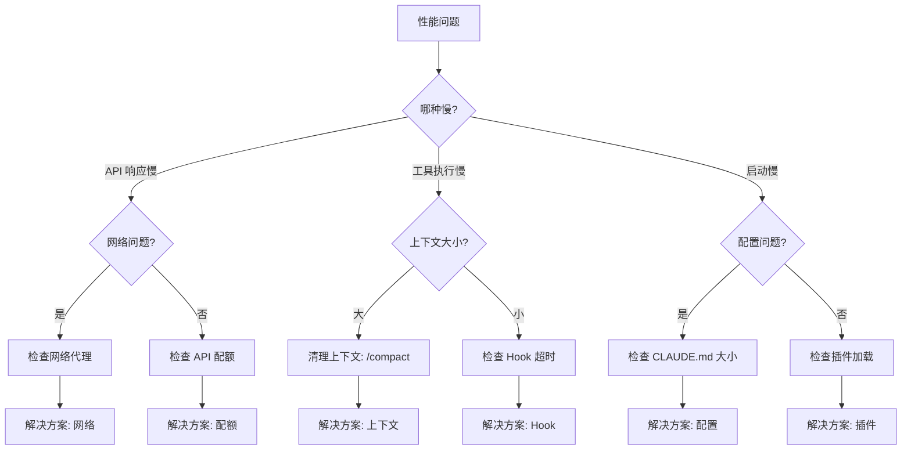
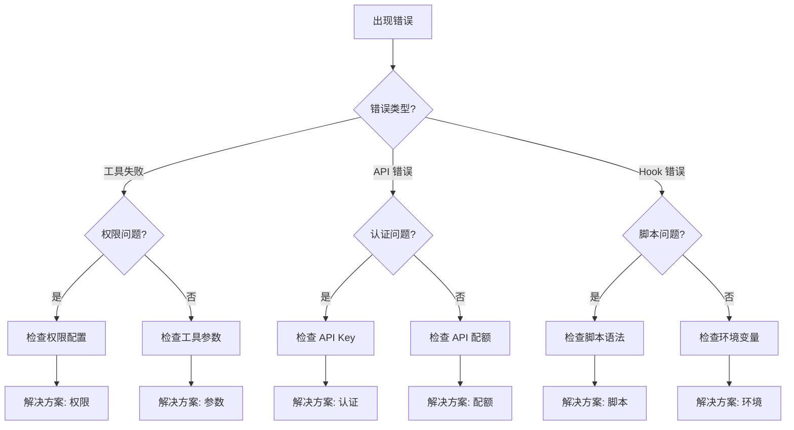

# 问题诊断库

> **快速定位问题，找到解决方案**

## 快速诊断入口

### 按症状查找

| 症状 | 可能原因 | 快速诊断 |
|------|----------|----------|
| [响应慢](./by-symptom/slow-response.md) | 网络、上下文、API 配额 | → [决策树](./decision-trees/performance.md) |
| [上下文溢出](./by-symptom/context-overflow.md) | 对话过长、文件过大 | → [解决方案](./by-symptom/context-overflow.md) |
| [Hook 失败](./by-symptom/hook-failure.md) | 脚本错误、权限问题 | → [决策树](./decision-trees/errors.md) |
| [工具超时](./by-symptom/tool-timeout.md) | 网络慢、命令耗时 | → [解决方案](./by-symptom/tool-timeout.md) |
| [MCP 连接失败](./by-symptom/mcp-connection.md) | 服务器未启动、配置错误 | → [解决方案](./by-symptom/mcp-connection.md) |
| [权限被拒绝](./by-symptom/permission-denied.md) | 权限配置、沙箱模式 | → [解决方案](./by-symptom/permission-denied.md) |

### 按功能查找

| 功能 | 常见问题 |
|------|----------|
| [Slash Commands](./by-feature/slash-commands/) | 命令未找到、参数错误 |
| [Memory](./by-feature/memory/) | CLAUDE.md 不生效、导入失败 |
| [Hooks](./by-feature/hooks/) | Hook 不执行、输出异常 |
| [MCP](./by-feature/mcp/) | 服务器连接、工具调用 |
| [Subagents](./by-feature/subagents/) | 子智能体失败、上下文问题 |

## 诊断决策树

### 性能问题



### 错误问题



## 诊断命令速查

### 系统状态

```bash
# 检查版本和配置
/status

# 查看当前模型和账户
/status

# 检查安装健康
/doctor
```

### 上下文状态

```bash
# 查看上下文使用情况
/context

# 查看内存文件
/memory

# 查看对话统计
/cost
```

### 调试模式

```bash
# 启用调试日志
claude --verbose

# 查看详细错误
claude --log-level debug

# 导出会话分析
/insights
```

## 常见问题快速解决

### 1. Claude 响应很慢

**快速诊断：**
```bash
# 检查网络延迟
curl -w "%{time_total}s\n" https://api.anthropic.com/v1/messages

# 检查上下文大小
/context
```

**解决方案：**
- 网络 > 2s：检查代理/VPN 设置
- 上下文 > 80%：运行 `/compact`
- 正常但慢：可能是 API 配额限制

### 2. Hook 不执行

**快速诊断：**
```bash
# 检查 Hook 配置
/hooks

# 检查脚本权限
ls -la .claude/hooks/
```

**解决方案：**
- 配置未显示：检查 `settings.json` 格式
- 权限错误：`chmod +x .claude/hooks/*.sh`
- 脚本错误：手动运行脚本测试

### 3. MCP 服务器连接失败

**快速诊断：**
```bash
# 列出 MCP 服务器
/mcp

# 测试连接
/mcp <server-name> test
```

**解决方案：**
- 服务器未启动：启动 MCP 服务
- 配置错误：检查 `mcpServers` 配置
- 端口占用：检查端口是否被占用

### 4. Memory 不生效

**快速诊断：**
```bash
# 查看 Memory 文件
/memory

# 检查文件路径
ls -la .claude/CLAUDE.md
```

**解决方案：**
- 文件不存在：运行 `/init` 创建
- 内容未加载：检查语法错误
- 导入失败：检查 `@file` 路径

## 报告问题

### 收集诊断信息

```bash
# 导出诊断报告
/doctor --export > diagnostics.txt

# 导出会话日志
/export session-debug.json
```

### 提交 Issue

在 [GitHub Issues](https://github.com/anthropics/claude-code/issues) 提交时包含：

1. 系统信息（OS、Node.js 版本）
2. Claude Code 版本
3. 诊断输出
4. 复现步骤
5. 期望行为 vs 实际行为

## 相关资源

- [性能决策树](./decision-trees/performance.md)
- [错误决策树](./decision-trees/errors.md)
- [最佳实践模式](../../patterns/)
- [企业安全指南](../../enterprise/security/)