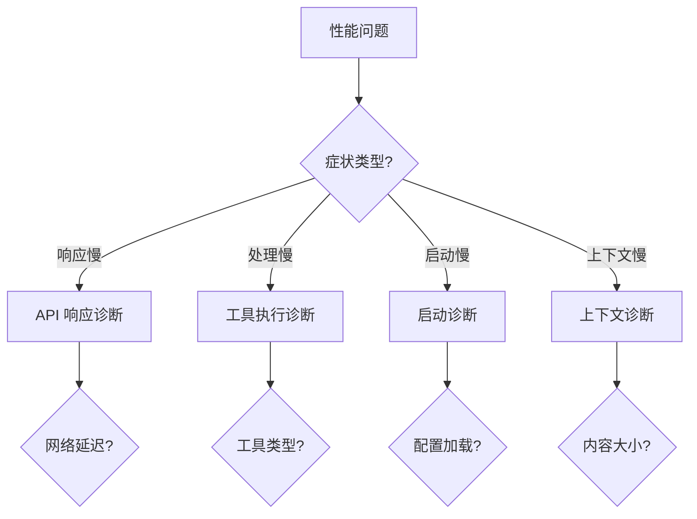
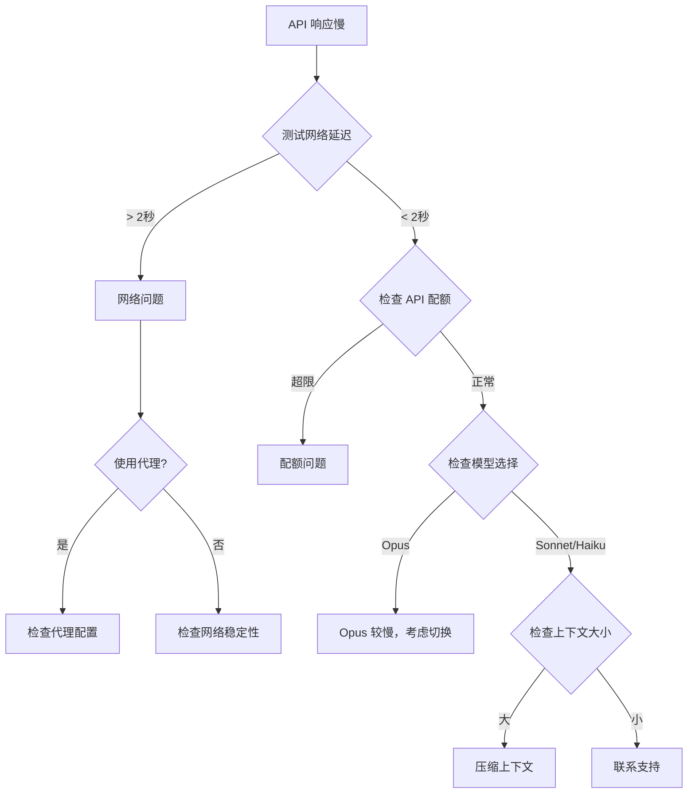
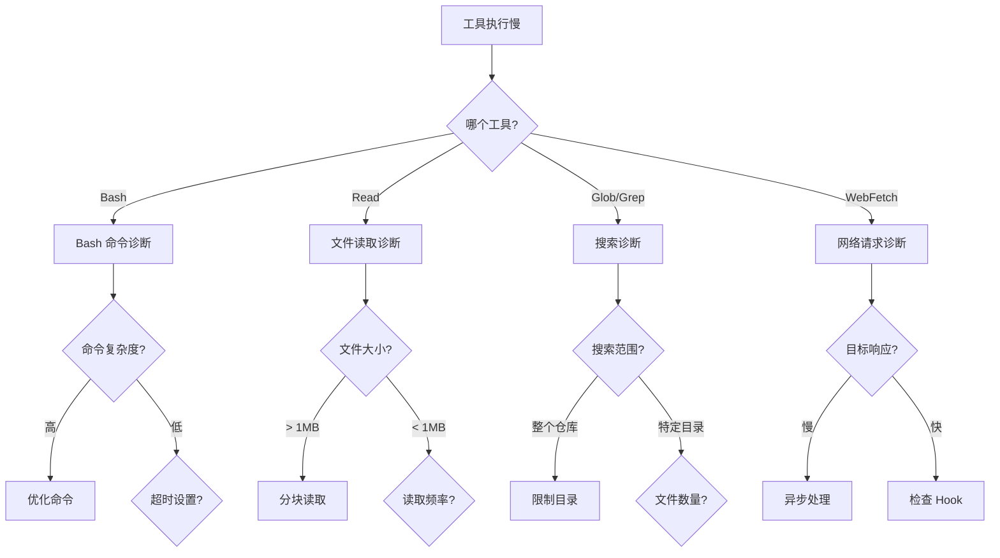
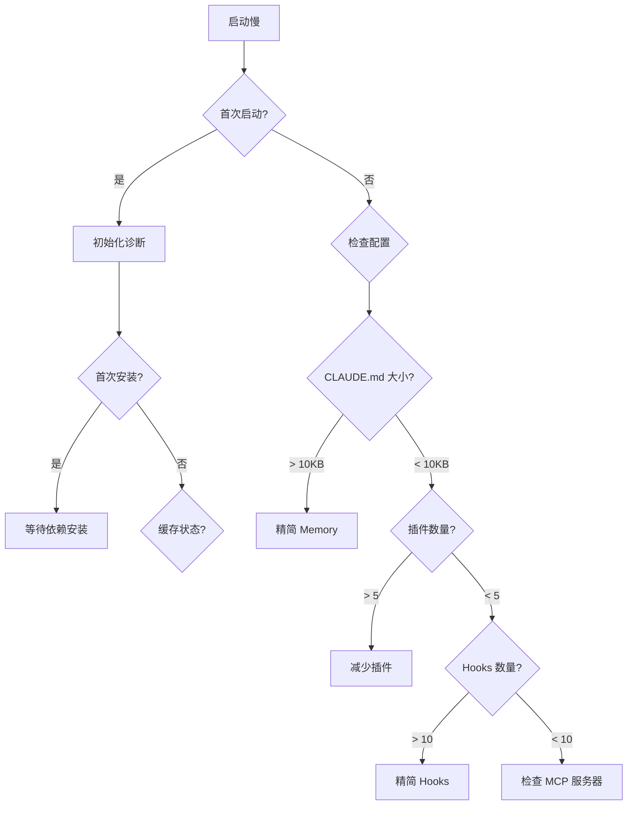

# 性能问题诊断决策树

> **目标：** 快速定位 Claude Code 性能问题的根本原因

## 主决策树



## 1. API 响应慢诊断



### 诊断命令

```bash
# 测试 API 延迟
curl -w "DNS: %{time_namelookup}s\nConnect: %{time_connect}s\nTTFB: %{time_starttransfer}s\nTotal: %{time_total}s\n" \
  -X POST https://api.anthropic.com/v1/messages \
  -H "x-api-key: $ANTHROPIC_API_KEY" \
  -H "Content-Type: application/json" \
  -d '{"model":"claude-sonnet-4-6-20250514","max_tokens":10,"messages":[{"role":"user","content":"hi"}]}'

# 检查配额
/cost

# 检查当前模型
/status
```

### 解决方案

| 问题 | 解决方案 |
|------|----------|
| 网络延迟 > 2s | 检查代理/VPN，尝试直连 |
| 配额超限 | 升级套餐或等待重置 |
| 使用 Opus | 切换到 Sonnet/Haiku |
| 上下文过大 | 运行 `/compact` |

---

## 2. 工具执行慢诊断



### 诊断命令

```bash
# 检查 Bash 命令执行时间
time bash -c "your-command-here"

# 检查文件大小
find . -name "*.md" -exec wc -l {} \; | sort -rn | head -20

# 检查文件数量
find . -type f | wc -l

# 检查 Hook 执行时间
time bash .claude/hooks/pre-tool-use.sh
```

### 解决方案

| 工具 | 优化建议 |
|------|----------|
| Bash | 使用更具体的命令，添加 `timeout` |
| Read | 使用 `limit` 参数，分块读取 |
| Glob | 限制搜索路径，使用 `type` 过滤 |
| Grep | 使用 `glob` 参数，限制 `-C` 范围 |
| WebFetch | 使用 `timeout` 参数，异步处理 |

---

## 3. 启动慢诊断



### 诊断命令

```bash
# 检查 CLAUDE.md 大小
wc -l .claude/CLAUDE.md
find . -name "CLAUDE.md" -exec wc -l {} \;

# 检查配置加载
claude --verbose 2>&1 | grep -i "load\|init"

# 检查插件
/plugin list

# 检查 Hooks
/hooks
```

### 解决方案

| 问题 | 解决方案 |
|------|----------|
| CLAUDE.md > 10KB | 删除冗余内容，使用 `@imports` |
| 插件 > 5 个 | 禁用不常用插件 |
| Hooks > 10 个 | 合并相似 Hooks |
| MCP 服务器慢 | 延迟连接或禁用 |

---

## 4. 上下文问题诊断

```mermaid
flowchart TD
    F1[上下文问题] --> F2{问题类型?}
    
    F2 -->|溢出| F3[上下文溢出]
    F2 -->|膨胀| F4[上下文膨胀]
    F2 -->|混乱| F5[上下文混乱]
    
    F3 --> F3a{对话长度?}
    F3a -->|长| F3b[/compact]
    F3a -->|短| F3c{大文件?}
    
    F4 --> F4a{Memory 大小?}
    F4a -->|大| F4b[精简 Memory]
    F4a -->|小| F4c{对话累积?}
    
    F5 --> F5a{话题分散?}
    F5a -->|是| F5b[/branch 新会话]
    F5a -->|否| F5c[检查工具结果]
```

### 诊断命令

```bash
# 查看上下文使用情况
/context

# 查看对话统计
/cost

# 检查 Memory 文件
/memory
```

### 解决方案

| 问题 | 解决方案 |
|------|----------|
| 上下文溢出 | `/compact`，开始新会话 |
| 对话累积 | `/compact focus:当前任务` |
| Memory 过大 | 精简 CLAUDE.md |
| 话题混乱 | `/branch` 创建分支会话 |

---

## 快速诊断脚本

保存为 `diagnose-performance.sh`：

```bash
#!/bin/bash

echo "=== Claude Code 性能诊断 ==="
echo ""

# 1. 网络延迟
echo "1. 网络延迟检测..."
LATENCY=$(curl -w "%{time_total}" -s -o /dev/null https://api.anthropic.com/v1/messages \
  -X POST \
  -H "x-api-key: $ANTHROPIC_API_KEY" \
  -H "Content-Type: application/json" \
  -d '{"model":"claude-sonnet-4-6-20250514","max_tokens":1,"messages":[{"role":"user","content":"hi"}]}')

if (( $(echo "$LATENCY > 2" | bc -l) )); then
  echo "  ⚠️  网络延迟高: ${LATENCY}s"
else
  echo "  ✓ 网络正常: ${LATENCY}s"
fi

# 2. 配置文件大小
echo ""
echo "2. 配置文件检测..."
if [ -f ".claude/CLAUDE.md" ]; then
  CLAUDE_LINES=$(wc -l < .claude/CLAUDE.md)
  if [ "$CLAUDE_LINES" -gt 200 ]; then
    echo "  ⚠️  CLAUDE.md 过大: $CLAUDE_LINES 行"
  else
    echo "  ✓ CLAUDE.md 正常: $CLAUDE_LINES 行"
  fi
fi

# 3. 文件数量
echo ""
echo "3. 项目规模检测..."
FILE_COUNT=$(find . -type f ! -path "./node_modules/*" ! -path "./.git/*" | wc -l)
if [ "$FILE_COUNT" -gt 10000 ]; then
  echo "  ⚠️  文件数量多: $FILE_COUNT"
else
  echo "  ✓ 文件数量正常: $FILE_COUNT"
fi

# 4. Hooks 检测
echo ""
echo "4. Hooks 检测..."
HOOK_COUNT=$(find .claude/hooks -name "*.sh" 2>/dev/null | wc -l)
if [ "$HOOK_COUNT" -gt 10 ]; then
  echo "  ⚠️  Hooks 数量多: $HOOK_COUNT"
else
  echo "  ✓ Hooks 数量正常: $HOOK_COUNT"
fi

echo ""
echo "=== 诊断完成 ==="
```

## 常见性能指标

| 指标 | 正常值 | 警告值 | 问题值 |
|------|--------|--------|--------|
| API 响应延迟 | < 1s | 1-2s | > 2s |
| 上下文使用 | < 50% | 50-80% | > 80% |
| CLAUDE.md 大小 | < 5KB | 5-10KB | > 10KB |
| Hooks 数量 | < 5 | 5-10 | > 10 |
| 插件数量 | < 3 | 3-5 | > 5 |
| 启动时间 | < 2s | 2-5s | > 5s |

## 相关资源

- [上下文溢出诊断](../by-symptom/context-overflow.md)
- [响应慢诊断](../by-symptom/slow-response.md)
- [Hook 失败诊断](../by-symptom/hook-failure.md)