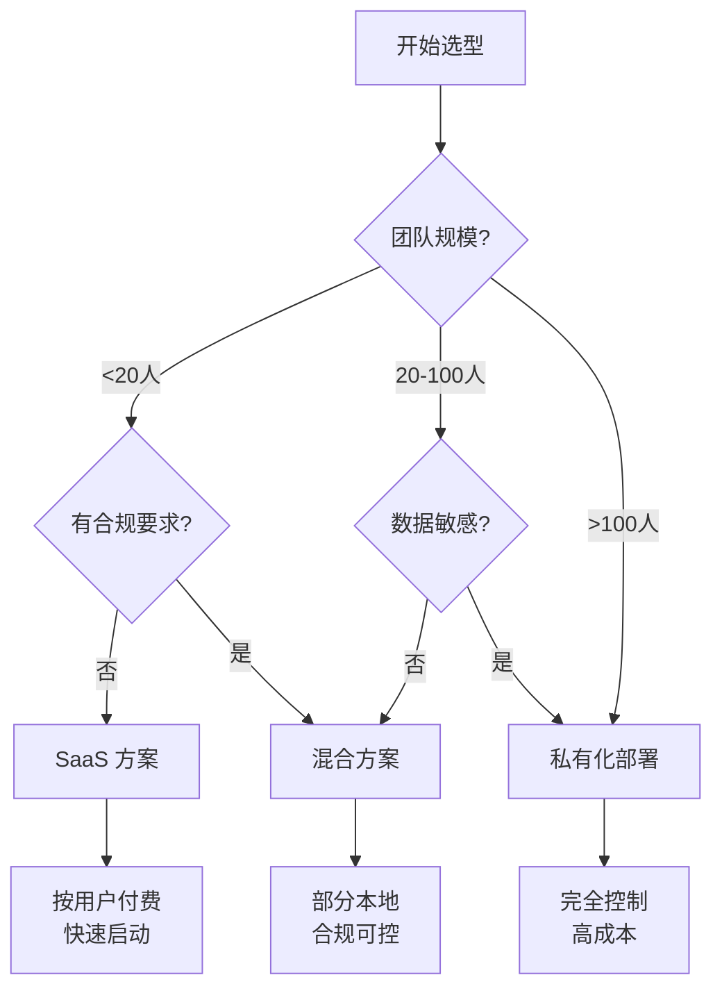

# 企业应用指南

> **适用对象：** 团队负责人、DevOps 工程师、安全合规人员
> 
> **前置要求：** 已熟悉 Claude Code 基础功能

## 为什么需要企业指南？

当你的团队规模超过 5 人，或者有安全合规要求时，单纯的个人使用方式不再适用。你需要考虑：

| 关注点 | 个人使用 | 企业场景 |
|--------|----------|----------|
| 配置管理 | 本地配置 | 统一模板、版本控制 |
| 安全合规 | 自行负责 | 审计日志、密钥管理 |
| 成本控制 | 个人付费 | 团队配额、用量监控 |
| 知识共享 | 个人记忆 | 团队 Memory、最佳实践库 |

## 部署选项对比

| 选项 | 适用规模 | 复杂度 | 成本 | 数据控制 |
|------|---------|--------|------|----------|
| **SaaS** | 小型团队 (<20人) | 低 | 按用户计费 | 云端存储 |
| **混合** | 中型团队 (20-100人) | 中 | 中等 | 部分本地 |
| **私有化** | 大型企业 (>100人) | 高 | 高 | 完全本地 |

## 快速决策



## 企业部署路线图

### 阶段 1：基础设施（Week 1）

- [ ] 选择部署方案
- [ ] 配置网络访问
- [ ] 设置身份认证
- [ ] 初始化团队配置

### 阶段 2：团队协作（Week 2）

- [ ] 创建团队 CLAUDE.md 模板
- [ ] 配置共享 Hooks
- [ ] 设置 MCP 服务器
- [ ] 建立代码审查流程

### 阶段 3：CI/CD 集成（Week 3）

- [ ] GitHub Actions 集成
- [ ] 自动化代码审查
- [ ] 安全扫描集成
- [ ] 部署流水线集成

### 阶段 4：安全合规（Week 4）

- [ ] 密钥管理方案
- [ ] 审计日志配置
- [ ] 合规报告生成
- [ ] 定期安全审计

## 本节内容

### [部署指南](./deployment/)
- 本地部署方案
- 云部署方案
- Kubernetes 部署

### [团队协作](./team/)
- 团队约定模板
- 代码审查流程
- 知识库管理

### [CI/CD 集成](./cicd/)
- GitHub Actions
- GitLab CI
- Jenkins

### [安全合规](./security/)
- 密钥管理
- 审计日志
- 合规要求

## 快速开始

```bash
# 1. 克隆企业配置模板
git clone https://github.com/your-org/claude-code-config

# 2. 复制到项目
cp -r claude-code-config/.claude your-project/

# 3. 自定义配置
# 编辑 .claude/CLAUDE.md
# 配置 .claude/settings.json

# 4. 团队成员同步
cd your-project
git pull
```

## 成功案例

### 案例：某互联网公司 100 人团队

**背景：**
- 100 人研发团队
- 需要统一 AI 辅助开发工具
- 有安全合规要求

**效果：**
- 代码审查效率提升 40%
- 安全问题减少 60%
- 新人上手时间缩短 50%

[查看完整案例](./cases/100-team-deployment.md)

## 相关资源

- [官方企业版文档](https://code.claude.com/enterprise)
- [团队最佳实践](../patterns/team/)
- [安全指南](./security/)