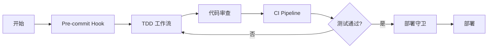
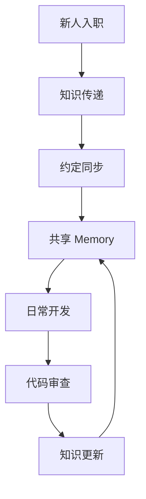

# 最佳实践模式库

> **模式化思维，复制成功经验**

## 模式分类

| 类别 | 说明 | 适用场景 |
|------|------|----------|
| [工作流模式](./workflow/) | 开发流程组织 | 个人开发、团队协作 |
| [团队模式](./team/) | 多人协作 | 5+ 人团队 |
| [自动化模式](./automation/) | 减少重复劳动 | CI/CD、部署 |
| [反模式](./anti-patterns/) | 避免踩坑 | 所有场景 |

## 模式格式

每个模式包含：

```markdown
# 模式名称

## 问题
[描述遇到的问题]

## 解决方案
[具体的解决方案]

## 代码示例
[可复制的代码]

## 适用条件
[什么时候用]

## 注意事项
[需要注意什么]
```

## 热门模式

### 工作流模式

- [TDD 工作流](./workflow/tdd-workflow.md) - 测试驱动开发
- [代码审查工作流](./workflow/code-review-workflow.md) - 自动化审查
- [重构工作流](./workflow/refactoring-workflow.md) - 安全重构

### 团队模式

- [共享 Memory](./team/shared-memory.md) - 团队知识共享
- [约定同步](./team/convention-sync.md) - 代码风格统一
- [知识传递](./team/knowledge-transfer.md) - 新人上手

### 自动化模式

- [CI Pipeline](./automation/ci-pipeline.md) - 持续集成
- [Pre-commit Hooks](./automation/pre-commit-hooks.md) - 提交前检查
- [部署守卫](./automation/deployment-guard.md) - 安全部署

### 反模式警示

- [上下文膨胀](./anti-patterns/context-bloat.md) - 信息过载
- [Hook 面条](./anti-patterns/hook-spaghetti.md) - Hook 过度复杂
- [过度工程](./anti-patterns/over-engineering.md) - 不必要的复杂性

## 快速导航

### 我是新手

推荐阅读：
1. [TDD 工作流](./workflow/tdd-workflow.md) - 建立好习惯
2. [反模式警示](./anti-patterns/) - 避免常见错误

### 我是团队负责人

推荐阅读：
1. [共享 Memory](./team/shared-memory.md) - 团队知识管理
2. [CI Pipeline](./automation/ci-pipeline.md) - 自动化流程
3. [约定同步](./team/convention-sync.md) - 代码规范

### 我是 DevOps 工程师

推荐阅读：
1. [CI Pipeline](./automation/ci-pipeline.md)
2. [Pre-commit Hooks](./automation/pre-commit-hooks.md)
3. [部署守卫](./automation/deployment-guard.md)

## 模式组合示例

### 完整开发流程



### 团队协作流程



## 贡献模式

发现好的模式？欢迎贡献！

1. Fork 仓库
2. 在对应目录添加 `.md` 文件
3. 按照模式格式编写
4. 提交 PR

详见 [贡献指南](../../community/contribute.md)

## 相关资源

- [问题诊断](../../diagnostics/) - 遇到问题先诊断
- [企业应用](../../enterprise/) - 企业场景指南
- [源码解析](../../source-analysis/) - 理解底层原理