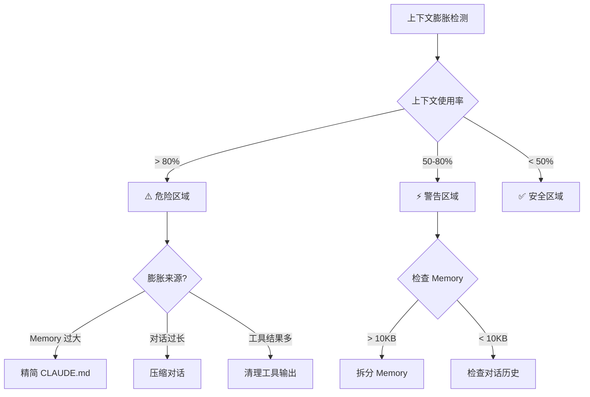

# 反模式：上下文膨胀

## 问题识别

上下文膨胀是指向 Claude 提供过多不相关信息，导致：

- 响应变慢
- 成本增加
- 理解困难
- 上下文溢出

### 症状检测



## 反模式示例

### ❌ 错误做法 1：CLAUDE.md 信息堆砌

```markdown
# 项目配置

## 所有历史记录
2024-01-01: 项目启动
2024-01-02: 添加用户模块
2024-01-03: 修复登录 bug
...（继续 100 行历史记录）

## 所有 API 端点
GET /api/users - 获取用户列表
GET /api/users/:id - 获取单个用户
POST /api/users - 创建用户
...（继续 50 个端点）

## 完整数据库 Schema
CREATE TABLE users (
  id SERIAL PRIMARY KEY,
  name VARCHAR(255) NOT NULL,
  ...（继续完整 Schema）
);
```

**问题：**
- Claude 不需要所有历史记录
- API 端点可以在代码中查找
- Schema 太大影响上下文

### ❌ 错误做法 2：对话中复制大量代码

```bash
# 用户把整个文件粘贴到对话中
"请帮我看看这个 2000 行的文件有什么问题：
[粘贴 2000 行代码]"

# 然后又粘贴另一个文件
"还有这个：
[又粘贴 1500 行代码]"
```

**问题：**
- 立即消耗大量上下文
- Claude 只需要关键部分

### ❌ 错误做法 3：过度使用文件引用

```markdown
# 项目文档

参考以下文件：
@src/index.ts
@src/app.ts
@src/config.ts
@src/database.ts
@src/server.ts
@src/middleware/auth.ts
@src/middleware/logger.ts
@src/routes/users.ts
@src/routes/posts.ts
...（继续引用 20 个文件）
```

**问题：**
- 所有文件内容都被加载到上下文
- 大部分可能不需要

## 正确做法

### ✅ 精简 CLAUDE.md

```markdown
# 项目配置

## 关键信息
- **技术栈：** TypeScript + Express + PostgreSQL
- **测试：** pnpm test（覆盖率 80%+）
- **部署：** pnpm deploy

## 当前焦点
- 正在实现用户认证功能
- 优先处理 Issue #123

## 重要约定
- API 响应格式：`{ success, data, error }`
- 错误处理：使用 `AppError` 类

## 详细文档
- API 文档：@docs/api.md
- 架构设计：@docs/architecture.md
```

**优化点：**
- 只包含关键信息
- 使用 `@imports` 延迟加载详细文档
- 记录当前焦点，不是历史

### ✅ 按需读取文件

```bash
# 不要一次性粘贴大文件
# 让 Claude 自己读取需要的部分

"帮我检查 src/auth/login.ts 的错误处理逻辑"
# Claude 会用 Read 工具只读取这个文件
```

### ✅ 使用 Glob/Grep 定位

```bash
# 不要引用所有文件
# 让 Claude 搜索需要的代码

"查找所有处理用户认证的文件"
# Claude 会使用 Glob 和 Grep 精确定位
```

## 上下文管理策略

### 策略 1：分层 Memory

```
~/.claude/CLAUDE.md          # 个人偏好（小型）
  └── 项目/.claude/CLAUDE.md # 项目约定（中型）
       └── 模块/.claude/CLAUDE.md # 模块规则（小型）
```

**好处：**
- 只加载相关的 Memory
- 各层关注不同范围

### 策略 2：延迟加载

```markdown
# 项目文档

## 快速参考
- 测试命令：pnpm test
- 构建命令：pnpm build

## 详细文档（按需加载）
- API 文档：@docs/api.md（仅在做 API 相关工作时参考）
- 架构图：@docs/architecture.md（仅在设计讨论时参考）
```

**好处：**
- Claude 可以选择是否加载
- 减少不必要的上下文占用

### 策略 3：定期清理

```bash
# 压缩对话历史
/compact focus:当前任务

# 清除不相关的上下文
/compact

# 开始新分支会话
/branch fresh-start
```

## 上下文大小指南

| 内容类型 | 建议大小 | 最大大小 |
|---------|---------|---------|
| CLAUDE.md | 2-5 KB | 10 KB |
| 单次对话 | 50-100 消息 | 200 消息 |
| 工具结果 | 按需 | 避免大量输出 |
| 文件引用 | 3-5 个 | 10 个 |

## 诊断和修复

### 检查上下文状态

```bash
# 查看上下文使用率
/context

# 查看对话统计
/cost

# 检查 Memory 大小
wc -l .claude/CLAUDE.md
```

### 修复膨胀的 CLAUDE.md

```bash
# 分析 CLAUDE.md 内容
wc -l .claude/CLAUDE.md

# 如果 > 200 行，执行：
# 1. 识别不再需要的内容
# 2. 移动详细文档到单独文件
# 3. 使用 @imports 引用

# 示例重构
# 之前：
# CLAUDE.md 包含所有 API 端点（100 行）

# 之后：
# CLAUDE.md: "API 文档：@docs/api.md"
# docs/api.md: 详细端点列表
```

### 修复膨胀的对话

```bash
# 检查对话长度
/cost

# 如果对话过长
/compact

# 如果开始新话题
/branch new-topic
```

## 案例研究

### 案例 1：CLAUDE.md 从 50KB 减少到 5KB

**问题：**
- CLAUDE.md 包含完整数据库 Schema
- 所有 API 端点列表
- 历史变更记录
- 团队所有成员信息

**解决方案：**

```markdown
# 重构前：50KB

## 数据库 Schema
CREATE TABLE users (...);
CREATE TABLE posts (...);
-- 30 个表的完整 Schema

## API 端点
GET /api/users
POST /api/users
-- 50 个端点的完整列表

## 变更历史
2024-01-01: ...
2024-01-02: ...
-- 6 个月的历史记录

---

# 重构后：5KB

## 关键约定
- 数据库：PostgreSQL（Schema 见 @docs/database.md）
- API：RESTful（端点见 @docs/api.md）
- 变更记录：见 Git history

## 当前焦点
- Issue #123：用户认证
- Deadline：本周五
```

**结果：**
- 上下文使用率从 85% 降到 40%
- 响应速度提升 2x
- 成本降低 50%

### 案例 2：对话上下文优化

**问题：**
- 一次对话中处理了 5 个不同任务
- 粘贴了 10 个文件的完整内容
- 对话长度 150 条消息

**解决方案：**

```bash
# 压缩当前任务相关内容
/compact focus:用户认证功能

# 其他任务创建分支会话
/branch api-optimization
/branch ui-refactoring
/branch bug-fix-search
```

**结果：**
- 主对话保持聚焦
- 各任务独立上下文
- 无信息干扰

## 检查清单

定期检查：

- [ ] CLAUDE.md < 10KB
- [ ] 对话消息 < 100 条
- [ ] 文件引用 < 5 个
- [ ] 工具输出已清理
- [ ] 历史任务已压缩

## 相关资源

- [Memory 最佳实践](../../02-memory/)
- [上下文溢出诊断](../../diagnostics/by-symptom/context-overflow.md)
- [性能优化决策树](../../diagnostics/decision-trees/performance.md)