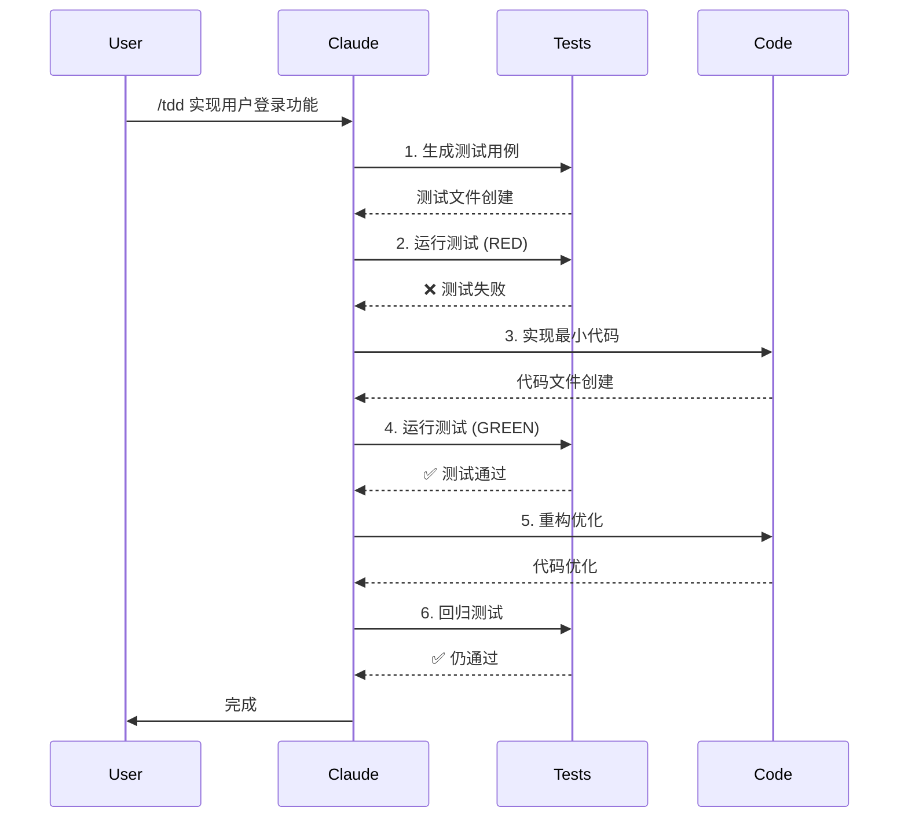

# TDD 工作流模式

## 问题

如何使用 Claude Code 进行高效的测试驱动开发？

## 解决方案

使用 Claude Code 的 Skill 和工具组合，实现完整的 TDD 红-绿-重构循环。

### 工作流图



### Skill 定义

创建 `.claude/skills/tdd/SKILL.md`:

```yaml
---
name: tdd
description: Test-Driven Development workflow. Use when implementing new features or fixing bugs.
argument-hint: feature-description
allowed-tools: Read, Write, Edit, Bash(npm test), Bash(npm run test:*), Glob, Grep
---

# TDD Workflow: $ARGUMENTS

## 红色阶段：编写失败测试

1. **理解需求**
   - 分析功能描述
   - 识别边界条件
   - 定义成功标准

2. **生成测试用例**
   ```markdown
   测试文件：tests/[feature].test.ts
   
   测试用例：
   - 正常情况：[描述预期行为]
   - 边界情况：[描述边界条件]
   - 错误情况：[描述错误处理]
   ```

3. **运行测试，确认失败**
   ```bash
   npm test -- --grep "[feature]"
   ```
   预期：FAIL (功能未实现)

## 绿色阶段：最小实现

1. **实现最小代码**
   - 只写让测试通过的最少代码
   - 不考虑优化
   - 不添加额外功能

2. **运行测试，确认通过**
   ```bash
   npm test -- --grep "[feature]"
   ```
   预期：PASS

## 重构阶段：优化代码

1. **识别重构点**
   - 重复代码
   - 过长函数
   - 命名不清

2. **应用重构**
   - 提取函数
   - 重命名变量
   - 简化逻辑

3. **回归测试**
   ```bash
   npm test
   ```
   预期：全部 PASS

## 输出格式

```markdown
# TDD 报告：[功能名称]

## 测试用例
- [ ] 测试1：[描述] ✅
- [ ] 测试2：[描述] ✅
- [ ] 测试3：[描述] ✅

## 实现文件
- `src/[feature].ts`

## 重构记录
- [重构1描述]
- [重构2描述]

## 测试覆盖率
- 行覆盖率：XX%
- 分支覆盖率：XX%
```
```

## 适用条件

| 场景 | 适用性 | 说明 |
|------|--------|------|
| 新功能开发 | ⭐⭐⭐ | 最佳实践 |
| Bug 修复 | ⭐⭐⭐ | 先写失败测试复现 bug |
| 重构 | ⭐⭐ | 先确保测试覆盖 |
| 快速原型 | ⭐ | 可能不适合严格 TDD |
| 探索性开发 | ⭐ | TDD 可能限制探索 |

## 完整示例

### 示例 1：实现用户登录

**步骤 1：启动 TDD**
```bash
/tdd 实现用户登录功能，支持邮箱密码和 OAuth
```

**步骤 2：Claude 生成测试**
```typescript
// tests/auth/login.test.ts
import { describe, it, expect, beforeEach } from 'vitest';
import { login } from '../../src/auth/login';

describe('User Login', () => {
  describe('Email/Password Login', () => {
    it('should login with valid credentials', async () => {
      const result = await login({
        email: 'user@example.com',
        password: 'valid-password'
      });
      expect(result.success).toBe(true);
      expect(result.token).toBeDefined();
    });

    it('should fail with invalid email', async () => {
      const result = await login({
        email: 'invalid-email',
        password: 'any-password'
      });
      expect(result.success).toBe(false);
      expect(result.error).toBe('INVALID_EMAIL');
    });

    it('should fail with wrong password', async () => {
      const result = await login({
        email: 'user@example.com',
        password: 'wrong-password'
      });
      expect(result.success).toBe(false);
      expect(result.error).toBe('INVALID_CREDENTIALS');
    });
  });

  describe('OAuth Login', () => {
    it('should login with Google OAuth', async () => {
      const result = await login({
        provider: 'google',
        code: 'valid-auth-code'
      });
      expect(result.success).toBe(true);
    });

    it('should login with GitHub OAuth', async () => {
      const result = await login({
        provider: 'github',
        code: 'valid-auth-code'
      });
      expect(result.success).toBe(true);
    });
  });
});
```

**步骤 3：运行测试（失败）**
```bash
npm test -- --grep "User Login"
# FAIL: Module not found
```

**步骤 4：实现最小代码**
```typescript
// src/auth/login.ts
interface EmailLogin {
  email: string;
  password: string;
}

interface OAuthLogin {
  provider: 'google' | 'github';
  code: string;
}

type LoginParams = EmailLogin | OAuthLogin;

interface LoginResult {
  success: boolean;
  token?: string;
  error?: string;
}

export async function login(params: LoginParams): Promise<LoginResult> {
  // Email/Password login
  if ('email' in params) {
    if (!params.email.includes('@')) {
      return { success: false, error: 'INVALID_EMAIL' };
    }
    
    // TODO: 实际验证逻辑
    if (params.password === 'valid-password') {
      return { success: true, token: 'jwt-token' };
    }
    
    return { success: false, error: 'INVALID_CREDENTIALS' };
  }
  
  // OAuth login
  if ('provider' in params) {
    // TODO: 实际 OAuth 逻辑
    return { success: true, token: 'jwt-token' };
  }
  
  return { success: false, error: 'UNKNOWN_METHOD' };
}
```

**步骤 5：运行测试（通过）**
```bash
npm test -- --grep "User Login"
# ✅ 5 tests passing
```

**步骤 6：重构**
```typescript
// 重构后：提取验证逻辑
// src/auth/login.ts
import { validateEmail } from './validators';
import { authenticateWithEmail } from './email-auth';
import { authenticateWithOAuth } from './oauth-auth';

export async function login(params: LoginParams): Promise<LoginResult> {
  if ('email' in params) {
    if (!validateEmail(params.email)) {
      return { success: false, error: 'INVALID_EMAIL' };
    }
    return authenticateWithEmail(params.email, params.password);
  }
  
  return authenticateWithOAuth(params.provider, params.code);
}
```

### 示例 2：修复 Bug

**步骤 1：启动 TDD**
```bash
/tdd 修复 #123：用户注销后仍能访问受保护路由
```

**步骤 2：Claude 生成复现测试**
```typescript
// tests/auth/logout.test.ts
describe('Bug #123: Logout should invalidate session', () => {
  it('should not allow access after logout', async () => {
    // 1. 登录
    const loginResult = await login({ email: 'user@example.com', password: 'pass' });
    const token = loginResult.token;
    
    // 2. 访问受保护路由 - 应该成功
    const beforeLogout = await fetchProtectedResource(token);
    expect(beforeLogout.status).toBe(200);
    
    // 3. 注销
    await logout(token);
    
    // 4. 再次访问 - 应该失败
    const afterLogout = await fetchProtectedResource(token);
    expect(afterLogout.status).toBe(401); // 这个测试会失败
  });
});
```

**步骤 3：运行测试（失败）**
```bash
npm test -- --grep "Bug #123"
# FAIL: Expected 401, got 200
```

**步骤 4：修复 Bug**
```typescript
// src/auth/session.ts
const invalidatedTokens = new Set<string>();

export async function logout(token: string): Promise<void> {
  invalidatedTokens.add(token);
}

export function isTokenValid(token: string): boolean {
  return !invalidatedTokens.has(token);
}

// src/middleware/auth.ts
export async function authMiddleware(req, res, next) {
  const token = req.headers.authorization;
  
  if (!isTokenValid(token)) {
    return res.status(401).json({ error: 'Token invalidated' });
  }
  
  next();
}
```

**步骤 5：运行测试（通过）**
```bash
npm test -- --grep "Bug #123"
# ✅ Test passing
```

## 注意事项

### 测试优先原则

- **永远先写测试**：不要在实现后再补测试
- **测试必须失败**：如果测试一开始就通过，说明测试有问题
- **最小实现**：只写让测试通过的代码

### 常见错误

| 错误 | 后果 | 解决方案 |
|------|------|----------|
| 跳过红色阶段 | 测试不可靠 | 确保测试先失败 |
| 实现过多代码 | 难以验证 | 只实现测试覆盖的功能 |
| 忽略重构 | 技术债务累积 | 每次都进行重构 |
| 测试太宽泛 | 定位问题困难 | 每个测试只验证一个行为 |

### 进阶技巧

1. **参数化测试**：用一组数据测试同一行为
2. **Mock 外部依赖**：隔离测试单元
3. **快照测试**：验证输出结构
4. **覆盖率目标**：保持 80%+ 覆盖率

## 相关模式

- [代码审查工作流](./code-review-workflow.md)
- [重构工作流](./refactoring-workflow.md)
- [上下文膨胀反模式](../anti-patterns/context-bloat.md)