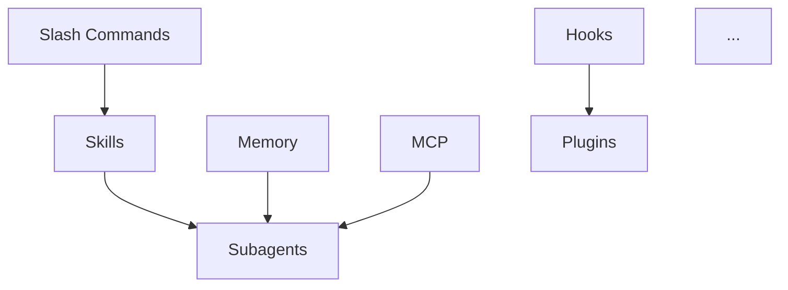

# 计划 2：核心内容

> **面向 AI 代理的工作者：** 必需子技能：使用 superpowers:subagent-driven-development 或 superpowers:executing-plans 逐任务实现此计划。

**目标：** 充实 10 个模块的深度内容，每个模块 800+ 行，包含实战案例和交互式练习

**架构：** 每个模块遵循统一结构：概念讲解 → 决策树 → 实战案例 → 交互练习 → 最佳实践。内容基于真实开发场景，提供可验证的代码示例。

**技术栈：** Markdown, Mermaid, Prism.js, 交互式代码块

---

## 模块结构模板

每个模块必须包含以下章节：

```markdown
# [模块名称]

## 概述
- 什么是 X？
- 为什么需要 X？
- 适用场景

## 核心概念
- 关键术语表
- 架构图（Mermaid）
- 工作流程图

## 决策树
- "我该不该用 X？"
- "我该用哪个选项？"
- Mermaid 流程图

## 快速开始
- 5 分钟入门教程
- 可验证的命令

## 深度讲解
- 每个功能详解
- 配置选项
- 边界情况

## 实战案例 1：[真实项目]
- 项目背景
- 完整工作流
- 代码实现
- 遇到的问题和解决方案

## 实战案例 2：[另一场景]
...

## 交互式练习
- 练习 1：基础操作
- 练习 2：进阶应用
- 验证命令

## 最佳实践
- Do's 和 Don'ts
- 常见陷阱
- 性能优化

## 故障排除
- 常见错误
- 诊断流程
- 解决方案

## 参考资源
- 官方文档链接
- 相关模块
```

---

## 文件清单

每个模块需要修改/创建的文件：

```
01-slash-commands/
├── README.md                 # 主文档（升级）
├── cases/                    # 新增：实战案例
│   ├── commit-workflow.md
│   ├── pr-automation.md
│   └── team-commands.md
└── exercises/                # 新增：交互式练习
    ├── basic-commands.md
    └── custom-commands.md

02-memory/
├── README.md
├── cases/
│   ├── project-context.md
│   ├── team-conventions.md
│   └── multi-project.md
└── exercises/

... (每个模块类似结构)
```

---

## 任务清单

### 阶段 1：新手模块（01/02/03/08/10）

#### 任务 1.1：01-slash-commands 升级

**目标：** 从 552 行升级到 1000+ 行

**文件：**
- 修改：`01-slash-commands/README.md`
- 创建：`01-slash-commands/cases/commit-workflow.md`
- 创建：`01-slash-commands/cases/pr-automation.md`
- 创建：`01-slash-commands/exercises/basic-commands.md`

- [ ] **步骤 1：重写模块 README**
  - 添加场景化 intro："你的团队刚提交了 47 个文件，如何快速生成规范的 commit message？"
  - 添加 Mermaid 决策树：选择正确的 slash command
  - 深度讲解每个内置命令
  - 添加自定义命令创建指南

- [ ] **步骤 2：创建实战案例 1 — Commit 工作流**
```markdown
# 实战案例：Git Commit 工作流自动化

## 背景
团队要求所有 commit message 遵循 Conventional Commits 规范。

## 完整工作流

### 步骤 1：创建自定义 /commit 命令
[代码示例]

### 步骤 2：集成 commitlint
[代码示例]

### 步骤 3：验证效果
[命令和预期输出]
```

- [ ] **步骤 3：创建实战案例 2 — PR 自动化**

- [ ] **步骤 4：创建交互式练习**

- [ ] **步骤 5：验证行数**
```bash
wc -l 01-slash-commands/README.md
# 预期: 1000+
```

- [ ] **步骤 6：Commit**
```bash
git add 01-slash-commands/
git commit -m "feat(slash-commands): upgrade module with cases and exercises"
```

---

#### 任务 1.2：02-memory 升级

**目标：** 从 1161 行升级到 1500+ 行

**文件：**
- 修改：`02-memory/README.md`
- 创建：`02-memory/cases/project-context.md`
- 创建：`02-memory/cases/team-conventions.md`

- [ ] **步骤 1：添加高级用法章节**
  - 多项目 memory 管理
  - 团队共享 CLAUDE.md
  - Memory 继承和覆盖

- [ ] **步骤 2：创建实战案例**

- [ ] **步骤 3：验证并 Commit**

---

#### 任务 1.3：03-skills 升级

**目标：** 从 804 行升级到 1200+ 行

- [ ] **步骤 1：添加技能创建完整指南**
  - SKILL.md 结构详解
  - frontmatter 所有字段
  - 模板系统
  - 引用机制

- [ ] **步骤 2：添加 3 个完整技能示例**

- [ ] **步骤 3：验证并 Commit**

---

#### 任务 1.4：08-checkpoints 验证

**目标：** 确认 1401 行内容质量

- [ ] **步骤 1：审查现有内容**
  - 检查 Try It Now 区块有效性
  - 验证 Mermaid 图正确渲染

- [ ] **步骤 2：补充缺失内容（如有）**

- [ ] **步骤 3：Commit 最终版本**

---

#### 任务 1.5：10-cli 升级

**目标：** 从 831 行升级到 1200+ 行

- [ ] **步骤 1：添加完整 CLI 参考手册**
  - 所有命令行参数
  - 环境变量配置
  - 配置文件详解

- [ ] **步骤 2：添加自动化场景**
  - CI/CD 集成
  - 脚本自动化
  - Headless 模式

- [ ] **步骤 3：验证并 Commit**

---

### 阶段 2：中级模块（04/05/06/07）

#### 任务 2.1：04-subagents 升级

**目标：** 从 1141 行升级到 1800+ 行

**重点内容：**
- 子智能体架构详解
- 编排模式（顺序、并行、条件）
- 子智能体 vs 技能 vs 插件对比
- 真实案例：代码审查团队

- [ ] **步骤 1：添加架构深度讲解**
- [ ] **步骤 2：创建多智能体协作案例**
- [ ] **步骤 3：验证并 Commit**

---

#### 任务 2.2：05-mcp 升级

**目标：** 从 1112 行升级到 1600+ 行

**重点内容：**
- MCP 协议原理
- 传输层对比（stdio/HTTP/SSE）
- 常用 MCP 服务器配置
- 自定义 MCP 服务器开发

- [ ] **步骤 1：添加协议深度讲解**
- [ ] **步骤 2：添加 5 个常用 MCP 配置案例**
- [ ] **步骤 3：验证并 Commit**

---

#### 任务 2.3：06-hooks 验证

**目标：** 确认 2024 行内容质量

- [ ] **步骤 1：审查现有内容**
- [ ] **步骤 2：验证所有脚本可执行**
- [ ] **步骤 3：补充生产级案例**

---

#### 任务 2.4：07-plugins 升级

**目标：** 从 943 行升级到 1400+ 行

**重点内容：**
- 插件架构
- 创建自定义插件
- 插件市场
- 企业插件管理

- [ ] **步骤 1-3：同上**

---

### 阶段 3：高级模块（09）

#### 任务 3.1：09-advanced-features 升级

**目标：** 从 1871 行升级到 2500+ 行

**重点内容：**
- Planning Mode 深度应用
- Extended Thinking 性能优化
- Auto Mode 安全边界
- 企业级部署
- 性能调优

- [ ] **步骤 1：扩展 Planning Mode 章节**
- [ ] **步骤 2：添加性能优化指南**
- [ ] **步骤 3：添加企业部署案例**
- [ ] **步骤 4：验证并 Commit**

---

### 阶段 4：跨模块整合

#### 任务 4.1：创建学习路径

**文件：**
- 创建：`content/learning-paths/`

- [ ] **步骤 1：创建新手路径**
```markdown
# 新手学习路径

## 第 1 天：基础入门
1. 安装配置（2 小时）
2. 基本使用（2 小时）
3. Slash Commands（2 小时）

## 第 2-3 天：核心概念
...

## 第 4-5 天：实战项目
...
```

- [ ] **步骤 2：创建开发者路径**

- [ ] **步骤 3：创建团队路径**

---

#### 任务 4.2：创建模块依赖图

- [ ] **步骤 1：生成模块关系 Mermaid 图**


---

## 关键里程碑

| 里程碑 | 完成标志 | 预计完成 |
|--------|----------|----------|
| M1: 新手模块完成 | 5 个模块 800+ 行 | Week 1 |
| M2: 中级模块完成 | 4 个模块 1200+ 行 | Week 2 |
| M3: 高级模块完成 | 1 个模块 2000+ 行 | Week 2 |
| M4: 跨模块整合 | 学习路径、依赖图 | Week 2 |

---

## 验收标准

- [ ] 10 个模块 README 行数达标
- [ ] 每个模块 2+ 实战案例
- [ ] 每个模块 1+ 交互式练习
- [ ] 每个模块有 Mermaid 决策树
- [ ] 所有代码示例可验证
- [ ] 学习路径完整