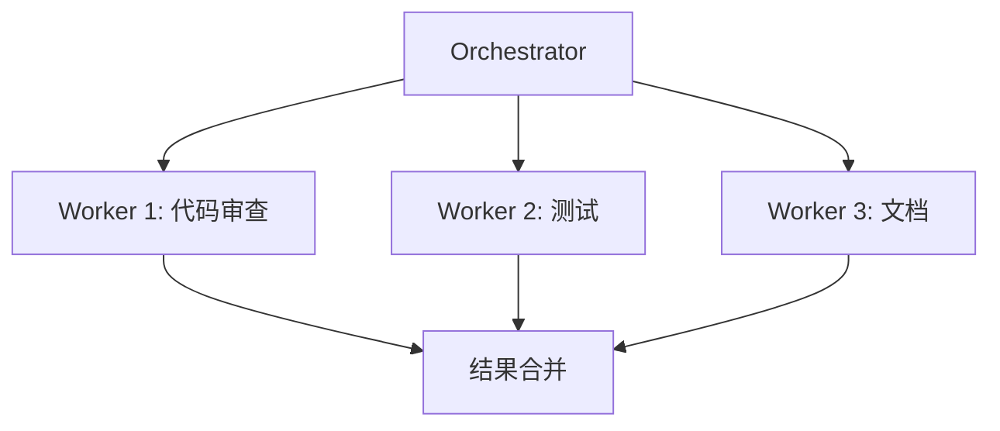

# 网站全面升级计划

> **面向 AI 代理的工作者：** 必需子技能：使用 superpowers:subagent-driven-development（推荐）或 superpowers:executing-plans 逐任务实现此计划。

**目标：** 打造全网最全面的中文 Claude Code 教程，整合最新功能、官方技巧和社区资源

**架构：** 扩展现有 10 个模块 + 新增高级主题模块 + 官方资源整合

**技术栈：** Markdown, Node.js 构建脚本, WebSearch 收集资源

---

## 问题诊断

### 当前问题
1. **翻译问题**：README 已翻译为中文，HTML 也已同步（用户可能看到缓存）
2. **缺少新功能**：多 Agent 协作、后台任务等 2025 年新功能未覆盖
3. **缺少官方资源**：Boris/开发团队的技巧未整合
4. **缺少社区资源**：网上优质教程未收集
5. **缺少高级主题**：Agent Teams、Channels、远程控制等

### 网上发现的新功能
根据搜索结果，Claude Code 2025 年新增功能包括：
- **后台代理** - 并行运行多个任务
- **Agent 协调** - Orchestrator-Workers 模式
- **增强 Memory 系统** - 项目级持久化
- **多 Agent 工作流模式** - 5 种协作模式
- **Channels** - MCP 消息推送
- **IDE 深度集成** - VS Code/JetBrains

---

## 文件结构

```
新增内容:
├── 11-multi-agent/              # 新模块：多Agent协作
│   └── README.md
├── 12-background-tasks/         # 新模块：后台任务
│   └── README.md
├── 13-channels/                 # 新模块：Channels
│   └── README.md
├── content/community/           # 社区资源
│   ├── official-tips.md         # 官方团队技巧
│   └── community-tutorials.md   # 社区教程汇总
└── 更新现有 10 个模块，添加新功能章节
```

---

## 任务清单

### 阶段 1：确认翻译同步

### 任务 1.1：验证 HTML 内容语言

**文件：**
- 验证：`website/content/*.html`

- [ ] **步骤 1：检查所有 HTML 文件**
```bash
for f in website/content/*.html; do
  echo "=== $f ==="
  grep -o "概述\|初级\|中级\|高级" "$f" | head -3
done
```

预期：所有文件显示中文词汇

- [ ] **步骤 2：清除可能的缓存**
```bash
rm -rf website/content/*.html
npm run build
```

- [ ] **步骤 3：验证首页**
```bash
head -50 website/content/01-slash-commands.html
```

---

### 阶段 2：新增多 Agent 协作模块

### 任务 2.1：创建 11-multi-agent 模块

**文件：**
- 创建：`11-multi-agent/README.md`

- [ ] **步骤 1：创建目录**
```bash
mkdir -p 11-multi-agent
```

- [ ] **步骤 2：编写模块内容**

```markdown
---
cc_version_verified: "2.1.92"
last_verified: "2026-04-05"
---
> 🟡 **中级** | ⏱ 90 分钟

# 多 Agent 协作

## 概述

Claude Code 支持多种多 Agent 协作模式，让你能够同时运行多个专业化的智能体来处理复杂任务。

## 协作模式

### 1. Orchestrator-Workers 模式

中央协调器将任务分发给专业工作者：



### 2. 并行执行模式

多个 Agent 同时处理独立子任务：

```bash
# 在 Claude Code 中
"同时运行 3 个子任务：
1. 安全审查 - 检查认证模块
2. 性能分析 - 检查数据库查询
3. 代码质量 - 检查代码风格

完成后汇总报告。"
```

### 3. 层级管理模式

多层管理结构处理大型项目：

```
Manager Agent
├── Frontend Lead
│   ├── Component Writer
│   └── Style Specialist
└── Backend Lead
    ├── API Developer
    └── Database Expert
```

### 4. 流水线模式

顺序处理带依赖的任务：

```bash
"按顺序执行：
1. 设计 API 结构（等待完成）
2. 实现端点（等待完成）
3. 编写测试（等待完成）
4. 生成文档"
```

### 5. 点对点协作模式

平等的 Agent 共享上下文协作：

```bash
"启动两个协作 Agent：
- Agent A: 实现功能
- Agent B: 同时编写测试

它们共享代码变更，实时同步。"
```

## 实战案例

### 案例：完整功能开发

```bash
# 使用 Orchestrator 模式开发新功能
"我需要实现用户认证功能。使用多 Agent 协作：

1. 设计 Agent：设计认证架构
2. 前端 Agent：实现登录 UI
3. 后端 Agent：实现 API
4. 测试 Agent：编写测试用例
5. 文档 Agent：更新文档

协调这些 Agent 完成任务。"
```

### 案例：代码审查流水线

```bash
"对当前变更执行多 Agent 审查：

并行启动：
- 安全审查 Agent：检查漏洞
- 性能审查 Agent：检查性能问题
- 风格审查 Agent：检查代码风格

完成后生成综合报告。"
```

## 最佳实践

### 何时使用多 Agent

| 场景 | 推荐模式 |
|------|----------|
| 复杂功能开发 | Orchestrator-Workers |
| 并行审查 | 并行执行 |
| 大型重构 | 层级管理 |
| 有依赖的任务 | 流水线 |
| 创意头脑风暴 | 点对点协作 |

### 性能优化

- 限制并行 Agent 数量（建议 ≤ 5）
- 使用 worktree 隔离
- 共享只读上下文

## 立即尝试

### 🎯 练习 1：并行代码审查

```bash
# 在 Claude Code 中输入：
"使用 3 个并行 Agent 审查 src/ 目录：
1. 安全审查
2. 性能检查  
3. 风格检查

生成合并报告。"
```

### 🎯 练习 2：功能开发流水线

```bash
"使用流水线模式：
1. 设计数据模型
2. 实现 CRUD API
3. 编写单元测试
4. 生成 API 文档

每步等待前一步完成。"
```

## 相关资源

- [Subagents 参考](../04-subagents/)
- [后台任务](../12-background-tasks/)
- [官方文档 - 多 Agent](https://docs.anthropic.com/en/docs/claude-code/agents)
```

- [ ] **步骤 3：更新构建脚本**
修改 `scripts/sync-modules.js` 添加新模块。

- [ ] **步骤 4：构建验证**
```bash
npm run build
```

- [ ] **步骤 5：提交**
```bash
git add 11-multi-agent/
git commit -m "feat: add multi-agent collaboration module"
```

---

### 任务 2.2：创建 12-background-tasks 模块

**文件：**
- 创建：`12-background-tasks/README.md`

- [ ] **步骤 1：创建目录和内容**
```bash
mkdir -p 12-background-tasks
```

内容涵盖：
- 后台任务基础
- 任务管理（/tasks 命令）
- 长时间运行操作
- 结果获取

---

### 任务 2.3：创建 13-channels 模块

**文件：**
- 创建：`13-channels/README.md`

内容涵盖：
- MCP Channels 概念
- 实时消息推送
- Discord/Slack 集成
- 事件订阅

---

### 阶段 3：更新现有模块

### 任务 3.1：更新 04-subagents 添加 Agent Teams

**文件：**
- 修改：`04-subagents/README.md`

- [ ] **添加 Agent Teams 章节**

```markdown
## Agent Teams（实验性）

Agent Teams 允许你配置一组协同工作的 Agent：

### 配置示例

```json
// .claude/agents/team.json
{
  "name": "dev-team",
  "agents": ["planner", "coder", "tester"],
  "display": "tmux"  // 或 "inline"
}
```

### 使用方式

```bash
# 启动团队
claude --teammate-mode tmux

# 团队协作
"使用开发团队实现用户管理功能"
```

### 显示模式

| 模式 | 说明 |
|------|------|
| `tmux` | 在 tmux 窗格中显示各 Agent |
| `inline` | 在主对话中显示 |
```

---

### 任务 3.2：更新 09-advanced-features 添加更多内容

**添加章节：**
- 远程控制详细说明
- Web 会话使用
- Chrome 集成
- 语音输入完整指南

---

### 阶段 4：添加官方和社区资源

### 任务 4.1：创建官方团队技巧文档

**文件：**
- 创建：`content/community/official-tips.md`

- [ ] **内容框架**

```markdown
# Claude Code 官方团队使用技巧

## Anthropic 开发团队推荐实践

### 1. 上下文管理

> "保持 CLAUDE.md 简洁，使用 @imports 引用详细文档"
> — Claude Code 团队

### 2. 任务分解

> "复杂任务分解为小步骤，每个步骤独立验证"
> — 开发团队建议

### 3. Hooks 使用

> "使用 PostToolUse hooks 自动格式化代码"
> — 官方文档

## 来源

- [官方文档](https://docs.anthropic.com/en/docs/claude-code)
- [Anthropic Cookbook](https://github.com/anthropics/anthropic-cookbook)
```

---

### 任务 4.2：创建社区教程汇总

**文件：**
- 创建：`content/community/community-tutorials.md`

- [ ] **搜索并整理优质教程**

```markdown
# Claude Code 社区教程汇总

## 精选教程

### 官方资源
- [Claude Code 官方文档](https://docs.anthropic.com/en/docs/claude-code)
- [Claude Code Quickstart](https://docs.anthropic.com/en/docs/claude-code/quickstart)
- [MCP 协议文档](https://modelcontextprotocol.io/)

### 社区文章
- GitHub Discussions 优质问答
- 开发者博客分享
- 实战案例分享

## 分类索引

### 入门教程
- 安装配置
- 基本使用
- 常见问题

### 进阶技巧
- Memory 最佳实践
- Hooks 自动化
- MCP 集成

### 实战案例
- Web 开发
- 数据分析
- DevOps 自动化
```

---

### 阶段 5：搜索更多资源

### 任务 5.1：收集 GitHub 优质内容

- [ ] **步骤 1：搜索 Claude Code 相关仓库**
使用 WebSearch 搜索 GitHub 上的优质项目

- [ ] **步骤 2：整理 skill 和 hook 示例**

- [ ] **步骤 3：添加到对应模块**

---

## 验收标准

- [ ] HTML 内容确认是中文
- [ ] 新增 3 个高级模块
- [ ] 现有模块更新新功能
- [ ] 官方技巧文档完成
- [ ] 社区资源汇总完成
- [ ] 构建验证通过

---

## 关键里程碑

| 里程碑 | 完成标志 | 预计时间 |
|--------|----------|----------|
| M1: 翻译确认 | HTML 中文验证 | 10分钟 |
| M2: 新模块创建 | 3 个新模块完成 | 2小时 |
| M3: 现有模块更新 | Agent Teams 等添加 | 1小时 |
| M4: 资源整合 | 官方/社区资源完成 | 1小时 |

---

## 注意事项

1. **确保翻译同步**：每次修改后运行 `npm run build`
2. **保持术语一致**：技术术语保留英文
3. **验证链接有效**：外部链接需要测试
4. **增量提交**：每完成一个任务就提交

---

**计划已完成。两种执行方式：**

**1. 子代理驱动（推荐）** - 每个任务调度一个新的子代理

**2. 内联执行** - 在当前会话中顺序执行

选哪种方式？