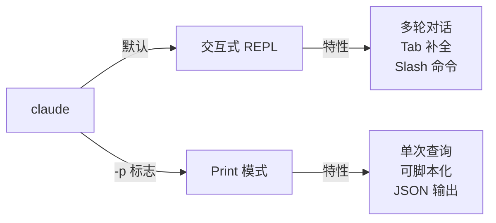

# 教程重构 - 阶段 B：新增章节编写

> **面向 AI 代理的工作者：** 必需子技能：使用 superpowers:executing-plans 逐任务实现此计划。步骤使用复选框（`- [ ]`）语法来跟踪进度。

**目标：** 编写两个全新章节：01-快速开始和02-交互与对话

**架构：** 每章遵循统一结构：为什么需要这个 → 核心概念 → 实战场景 → Try It Now → 下一章预告

**技术栈：** Markdown 编写

---

## 设计参考

根据设计文档 `docs/superpowers/specs/2026-04-06-tutorial-restructure-design.md`：
- 第 01 章：快速开始（30 分钟，初级）
- 第 02 章：交互与对话（45 分钟，初级）

---

## 文件结构

**将要编辑的文件：**
- `01-quick-start/README.md` — 全新编写
- `02-interaction/README.md` — 从 temp-cli-ref 精简提取

---

### 任务 1：编写 01-快速开始

**文件：**
- 编写：`01-quick-start/README.md`

- [ ] **步骤 1：编写 frontmatter 和开场**

```markdown
---
cc_version_verified: "2.1.92"
last_verified: "2026-04-06"
---

<picture>
  <source media="(prefers-color-scheme: dark)" srcset="../resources/logos/claude-howto-logo-dark.svg">
  
</picture>

> 🟢 **初级** | ⏱ 30 分钟
>
> ✅ 已验证 Claude Code **v2.1.92** · 最后验证：2026-04-06

**你将学会：** 5 分钟体验 Claude Code 的核心价值，知道它能不能帮到你。

# 快速开始

## 为什么需要这个？

你可能在想：Claude Code 到底是什么？它和 ChatGPT 有什么区别？能帮我做什么？

如果你：
- 第一次听说 Claude Code
- 安装了但不知道怎么用
- 想快速判断它是否适合你

这一章就是为你准备的。用 30 分钟，你就能亲身体验它的核心能力。

## Claude Code 是什么

Claude Code 不是 ChatGPT。它是 **AI 编程伙伴**。

| ChatGPT | Claude Code |
|---------|-------------|
| 只能聊文字 | 能读你的代码 |
| 你要复制粘贴代码 | 它直接访问项目文件 |
| 建议要手动执行 | 能直接修改代码 |
| 每次对话重新开始 | 记住你的项目规范 |

简单说：ChatGPT 是顾问，Claude Code 是干活的人。
```

- [ ] **步骤 2：编写安装部分**

```markdown
## 安装（5 分钟）

### macOS

```bash
# 安装 Claude Code
npm install -g @anthropic-ai/claude-code

# 登录
claude auth login
```

### Windows

```bash
# 使用 PowerShell
npm install -g @anthropic-ai/claude-code

# 登录
claude auth login
```

### Linux

同 macOS。

### 验证安装

```bash
claude --version
# 输出：Claude Code v2.1.92
```

## 第一次对话

安装完成后，打开终端，进入任意代码项目目录，输入：

```bash
claude
```

你会看到 Claude Code 启动，等待你的输入。
```

- [ ] **步骤 3：编写场景 1**

```markdown
## 实战场景

### 场景 1：让 Claude 解释一段代码

**场景：** 你接手了一个项目，看到一段看不懂的代码。

**操作：**

1. 启动 Claude Code：
```bash
cd your-project
claude
```

2. 输入问题：
```
解释 src/auth.ts 里的 verifyToken 函数做了什么
```

3. Claude 会：
   - 读取 `src/auth.ts` 文件
   - 找到 `verifyToken` 函数
   - 用中文解释它的逻辑

**体验价值：** 不用自己读代码，Claude 帮你理解。节省时间，降低上手难度。
```

- [ ] **步骤 4：编写场景 2**

```markdown
### 场景 2：让 Claude 写代码

**场景：** 你需要一个新功能，但不确定怎么写。

**操作：**

在 Claude Code 里输入：
```
帮我写一个函数，验证邮箱格式是否正确
要求：
- 返回 true/false
- 支持常见邮箱格式
- 放在 src/utils/validators.ts
```

Claude 会：
- 理解你的需求
- 编写代码
- 创建文件（或修改现有文件）
- 显示它做了什么

**体验价值：** 从想法到代码，几秒钟。
```

- [ ] **步骤 5：编写场景 3**

```markdown
### 场景 3：让 Claude 改代码

**场景：** 你发现了一个 Bug，需要修复。

**操作：**

输入：
```
src/api/users.ts 第 45 行有个 bug：
当用户名是空字符串时，会返回错误的用户数据
帮我修复，并添加对应的测试
```

Claude 会：
- 分析代码找到问题
- 提出修复方案
- 执行修复
- 写测试验证

**体验价值：** Bug 修复从"找→改→测"变成"描述→完成"。
```

- [ ] **步骤 6：编写 Try It Now**

```markdown
## 🎯 Try It Now

### 练习 1：安装并启动

1. 安装 Claude Code
2. 打开任意项目目录
3. 输入 `claude` 启动
4. 输入 "列出这个项目的目录结构"

### 练习 2：体验代码解释

1. 在 Claude Code 里输入：
   ```
   解释这个项目用到了什么技术栈
   ```
2. 观察 Claude 如何分析项目

### 练习 3：体验代码生成

1. 输入：
   ```
   写一个简单的 hello world 程序，用项目的技术栈
   ```
2. 检查 Claude 生成的代码
```

- [ ] **步骤 7：编写结尾和预告**

```markdown
## 能帮你做什么

Claude Code 的核心能力：

| 能力 | 说明 |
|------|------|
| **代码解释** | 理解复杂代码，用中文解释 |
| **代码生成** | 从需求描述生成代码 |
| **代码修改** | Bug 修复、重构、优化 |
| **代码审查** | 发现问题、提出改进建议 |
| **文档生成** | README、API 文档、注释 |
| **测试编写** | 单元测试、集成测试 |
| **命令执行** | 运行测试、构建、部署 |

## 学习路线图

本教程分为四个阶段：

1. **上手阶段**（你正在学）— 基本使用
2. **定制阶段** — 让 Claude 适应你的项目
3. **自动化阶段** — 构建自动化工作流
4. **精通阶段** — 企业级应用、复杂系统

## 常见问题

### Claude Code 收费吗？

需要 Anthropic API 密钥。按使用量付费。
- Haiku 模型最便宜（适合简单任务）
- Sonnet 模型性价比高（日常开发）
- Opus 模型最贵（复杂任务）

### 安全吗？

Claude 只能访问你当前目录的代码。
不会：
- 访问其他目录
- 发送代码到其他地方
- 自动执行危险命令

所有文件修改都需要你确认（除非开启自动模式）。

### 支持哪些语言？

所有主流编程语言：
- TypeScript/JavaScript
- Python
- Go
- Rust
- Java
- C/C++
- 等等...

## 下一章预告

你已经会用 Claude Code 了。但每次都要输入完整的问题很麻烦。

下一章，我们学习 **交互与对话**：
- 如何高效地和 Claude 沟通
- 如何管理多个对话
- 如何保存和恢复会话

继续 → [交互与对话](../02-interaction/)
```

- [ ] **步骤 8：写入文件并 Commit**

```bash
git add 01-quick-start/README.md
git commit -m "content: add 01-quick-start chapter (phase B-1)"
```

---

### 任务 2：编写 02-交互与对话

**文件：**
- 编写：`02-interaction/README.md`
- 参考：`temp-cli-ref/README.md`（提取常用内容）

- [ ] **步骤 1：编写 frontmatter 和开场**

```markdown
---
cc_version_verified: "2.1.92"
last_verified: "2026-04-06"
---

<picture>
  <source media="(prefers-color-scheme: dark)" srcset="../resources/logos/claude-howto-logo-dark.svg">
  
</picture>

> 🟢 **初级** | ⏱ 45 分钟
>
> ✅ 已验证 Claude Code **v2.1.92** · 最后验证：2026-04-06

**你将学会：** 掌握高效交互方式，会管理会话，知道怎么提问更有效。

# 交互与对话

## 为什么需要这个？

你学会了启动 Claude Code，开始和它对话。但你可能发现：

- 每次都要输入完整的问题，很累
- 有时候 Claude 不理解你的意图
- 对话太多，找不到之前的内容
- 切换项目后，又要重新解释背景

这一章，我们学习如何高效地和 Claude 交互，让每次对话都更顺畅。
```

- [ ] **步骤 2：编写核心概念**

```markdown
## 核心概念：两种交互模式

Claude Code 有两种使用方式：

### 交互式 REPL（默认）

```bash
claude
```

特点：
- 多轮对话
- Tab 补全
- 历史记录
- Slash 命令

**适合：** 开发、调试、探索

### Print 模式（非交互）

```bash
claude -p "问题"
```

特点：
- 单次查询
- 可脚本化
- 可管道化
- JSON 输出

**适合：** CI/CD、批量处理、自动化


```

- [ ] **步骤 3：编写场景 1**

```markdown
## 实战场景

### 场景 1：启动命名会话

**问题：** 你在做多个功能，每个功能需要单独的对话上下文。

**解决方案：** 使用 `-n` 参数命名会话。

```bash
# 启动一个专门做认证功能的会话
claude -n "auth-feature"

# 这个会话会记住所有关于认证的讨论
```

**效果：**
- 会话有名字，容易找到
- 上下文隔离，不会混在一起
- 可以随时切换

**Try It Now：**

```bash
# 创建一个会话
claude -n "my-first-session"

# 问一个问题
> 列出这个项目的文件结构

# 退出（Ctrl+D 或 /exit）

# 恢复这个会话
claude -r "my-first-session"
```
```

- [ ] **步骤 4：编写场景 2**

```markdown
### 场景 2：恢复之前的对话

**问题：** 昨天的对话里有重要信息，今天想继续。

**解决方案：** 使用 `-c` 或 `-r` 恢复。

```bash
# 继续最近的对话
claude -c

# 恢复特定会话（按名字）
claude -r "auth-feature"

# 恢复特定会话（按 ID）
claude -r "abc123-def456"
```

**查看所有会话：**

```bash
# 在 Claude Code 里输入
/history

# 或使用命令
claude --list-sessions
```

**Try It Now：**

```bash
# 1. 启动会话
claude -n "test-session"

# 2. 问几个问题
> 这个项目用什么框架？
> 有多少个测试文件？

# 3. 退出
/exit

# 4. 恢复
claude -c

# 5. 验证上下文保留
> 我刚才问了什么问题？
```
```

- [ ] **步骤 5：编写场景 3**

```markdown
### 场景 3：用 Print 模式快速提问

**问题：** 你只想问一个简单问题，不需要进入交互模式。

**解决方案：** 使用 `-p` 标志。

```bash
# 快速提问
claude -p "这个函数做了什么？"

# 处理文件内容
cat error.log | claude -p "分析这些错误"

# 在脚本中使用
claude -p --output-format json "列出所有 API 端点" | jq '.endpoints'
```

**Print 模式的优势：**

| 用途 | 命令示例 |
|------|----------|
| 快速查询 | `claude -p "问题"` |
| 分析日志 | `cat logs | claude -p "分析"` |
| 生成文档 | `claude -p "生成 README" > README.md` |
| CI/CD | `claude -p --output-format json "代码审查"` |

**Try It Now：**

```bash
# 快速查看项目信息
claude -p "这个项目的技术栈是什么？"

# 分析一个文件
cat package.json | claude -p "解释依赖关系"

# JSON 输出
claude -p --output-format json "有多少个 TypeScript 文件？" | jq
```
```

- [ ] **步骤 6：编写高效沟通技巧**

```markdown
## 高效沟通技巧

### 怎么提问更清晰

**不清晰的提问：**
```
帮我改一下这个代码
```

**清晰的提问：**
```
src/api/users.ts 的 updateUser 函数有个问题：
当用户邮箱格式不对时，会抛出未处理的错误。
帮我修复，要求：
- 验证邮箱格式
- 返回明确的错误信息
- 添加单元测试
```

**好的提问包含：**
1. **位置**：哪个文件、哪个函数
2. **问题**：具体是什么问题
3. **要求**：你希望的结果
4. **约束**：有什么限制

### 怎么给上下文

Claude 自动读取当前目录的代码。但有时候需要额外说明：

```
我在做用户认证功能，技术栈是：
- Express.js 后端
- PostgreSQL 数据库
- JWT 认证

请帮我写一个登录 API。
```

### 怎么逐步细化

**第一轮：** 确定方向
```
我想添加一个搜索功能，应该怎么设计？
```

**第二轮：** 确定细节
```
好，就用你的方案。具体实现时：
- 搜索结果要分页
- 支持关键词高亮
- 性能要快（100ms 内）
```

**第三轮：** 具体执行
```
开始实现，先写搜索 API 的路由
```
```

- [ ] **步骤 7：编写常用命令精简版**

```markdown
## 常用 CLI 命令（精简版）

日常最常用的 10 个命令：

| 命令 | 作用 | 示例 |
|------|------|------|
| `claude` | 启动交互会话 | `claude` |
| `claude -p "问题"` | Print 模式快速提问 | `claude -p "解释这个函数"` |
| `claude -c` | 继续最近会话 | `claude -c` |
| `claude -r "名称"` | 恢复命名会话 | `claude -r "auth"` |
| `claude -n "名称"` | 创建命名会话 | `claude -n "新功能"` |
| `/help` | 查看帮助 | `/help` |
| `/clear` | 清空当前对话 | `/clear` |
| `/compact` | 压缩对话历史 | `/compact` |
| `/exit` | 退出 | `/exit` |
| `/model opus` | 切换模型 | `/model opus` |

完整的 CLI 参考见 [附录 A：CLI 命令参考手册](../appendix-cli/)。
```

- [ ] **步骤 8：编写 Try It Now 区块**

```markdown
## 🎯 Try It Now

### 练习 1：会话管理

1. 创建命名会话：
```bash
claude -n "practice-session"
```

2. 问几个问题，记住上下文

3. 退出，然后恢复：
```bash
claude -r "practice-session"
```

4. 验证 Claude 记住了之前的讨论

### 练习 2：Print 模式

1. 快速分析一个文件：
```bash
cat src/main.ts | claude -p "这个文件做了什么？"
```

2. 使用 JSON 输出：
```bash
claude -p --output-format json "这个项目有多少文件？" | jq
```

### 练习 3：高效提问

对比两种提问方式的效果：

**模糊提问：**
```
帮我优化代码
```

**清晰提问：**
```
src/utils/parser.ts 的 parseJSON 函数：
当输入不是有效 JSON 时，会抛出通用错误。
帮我优化：
- 捕获具体错误类型
- 返回有意义的错误信息
- 性能提升（如果可能）
```

观察 Claude 的回答质量差异。
```

- [ ] **步骤 9：编写结尾和预告**

```markdown
## 常见问题

### 会话会保存多久？

默认保存在本地，除非手动清除。
- 7 天不活跃可能被清理
- 可以用 `/export` 导出保存

### 怎么查看历史？

在 Claude Code 里：
```
/history
```

### Print 模式和交互模式怎么选？

| 场景 | 推荐 |
|------|------|
| 开发调试 | 交互模式 |
| 快速查询 | Print 模式 |
| CI/CD 自动化 | Print 模式 |
| 探索学习 | 交互模式 |

## 下一章预告

你已经知道怎么和 Claude 交互了。但每次都要输入完整指令，还是有点麻烦。

有没有快捷命令，一键触发常用任务？

下一章，我们学习 **Slash 命令**：
- 55+ 内置快捷命令
- 代码审查、提交、搜索一键完成
- 自定义命令

继续 → [Slash 命令](../03-slash-commands/)
```

- [ ] **步骤 10：写入文件并 Commit**

```bash
git add 02-interaction/README.md
git commit -m "content: add 02-interaction chapter (phase B-2)"
```

---

## 验收清单

- [ ] 01-quick-start/README.md 完整
- [ ] 包含"为什么需要这个"开场
- [ ] 包含 3 个实战场景
- [ ] 包含 Try It Now 区块
- [ ] 包含"下一章预告"
- [ ] 02-interaction/README.md 完整
- [ ] 包含"为什么需要这个"开场
- [ ] 包含 3 个实战场景
- [ ] 包含 Try It Now 区块
- [ ] 包含"下一章预告"
- [ ] 两章之间的叙事逻辑连贯